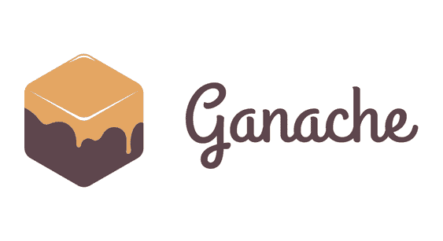
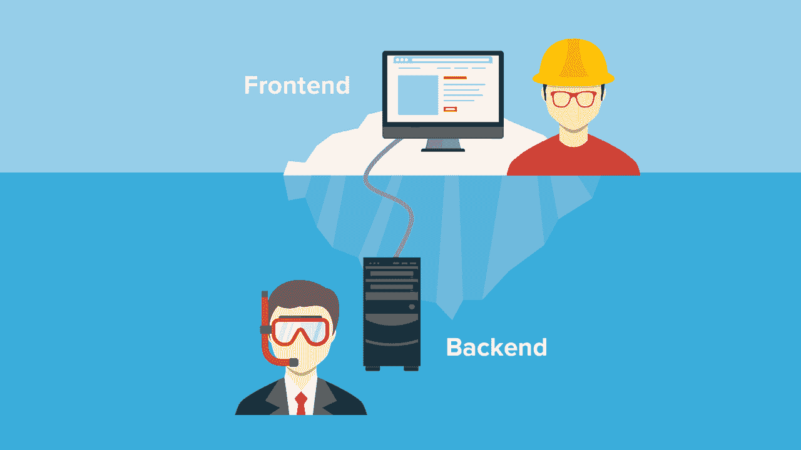

# 如何成为区块链开发者

> 原文：<https://moralis.io/how-to-become-a-blockchain-developer/>

**区块链技术正在席卷全球。此外，随着权力下放越来越受欢迎，没有迹象表明这一趋势会停止。区块链技术是这种去中心化的基础，也是构建强大的** [**dApps**](https://moralis.io/decentralized-applications-explained-what-are-dapps/) **(去中心化应用)的可能。然而，分散式应用、Web3 应用和 DeFi 应用都需要开发人员。这就是为什么今天学习如何成为一名区块链开发者比以往任何时候都重要。成为区块链开发者，参与塑造互联网的未来。最重要的是，Moralis 允许您立即过渡到区块链开发！**

随着区块链部门的快速增长，dApp 的发展比以往任何时候都更加重要。因此，这篇文章为你提供了所有关于区块链开发的基础知识以及如何成为区块链开发者的信息和技巧。

区块链开发中最耗时的一个方面是后端开发。开发一个完整的后端基础设施需要时间和资源；然而，程序员在构建 with[Moralis](https://moralis.io/)时不再需要从头开始构建这个基础设施。Moralis 是排名第一的 Web3 操作系统，支持 Web3 开发，并为您完成所有繁重的 Web3 工作。

所以，如果你想成为一名区块链开发者，一定要马上去看看并加入 Moralis！加入该平台将为您提供后端基础设施以及工具，如[Moralis NFT](https://moralis.io/announcing-the-moralis-nft-api/) 和[价格 API](https://moralis.io/introducing-the-moralis-price-api/) 、[Moralis 快速节点](https://moralis.io/speedy-nodes/)等。此外，Moralis 提供了与所有其他 Moralis 功能深度集成的[终极 NFT API](https://moralis.io/ultimate-nft-api-exploring-moralis-nft-api/) ，如 [BEP20 令牌开发](https://moralis.io/bep20-token-development-full-guide/)、 [NFT 编程](https://moralis.io/nft-programming-for-beginners/)、如何[构建以太坊 dapp](https://moralis.io/ultimate-guide-how-to-build-ethereum-dapps/)等等。

### 什么是 dApps？

分散式应用程序，或称 dApps，是区块链工业最显著的特征之一。这些 Web3 应用程序与传统应用程序有许多共同点；然而，顾名思义，将两者分开的一个特征是去中心化。这些应用程序的分散性源于 dApps 所基于的各种区块链。因此，区块链技术是实现应用程序分散化的最重要的组件之一。

本质上，这进一步意味着 dApps 配备了 [Web3](https://moralis.io/the-ultimate-guide-to-web3-what-is-web3/) 功能，并且这些应用的后端代码运行在“P2P”(点对点)网络上。此外，应用程序和 dApps 之间的另一个区别是，后者有能力实现内部令牌经济。这是非常有益的，因为令牌可以激励用户发展和营销平台。此外，我们还可以使用令牌作为治理机制，确保平台按照用户认为合适的方式发展。因此，代币经济的使用案例是多方面的，这意味着它可以从许多角度受益。

分散式应用程序，以及一般意义上的分散化，为消费者和开发者提供了许多优势。当今系统中最紧迫的问题之一是集中化，因为它导致了审查和单点故障的问题。然而，区块链和 dApps 可以避免这些问题，因为它是一个跨各种网络节点的扩展系统。这进一步意味着 dApps 有可能颠覆并彻底改变我们今天所看到的世界。

这些应用程序包括三个主要部分，我们需要了解这三个部分才能参与 dApp 开发:

1.  智能合同
2.  前端
3.  后端

因此，在接下来的几节中，我们将进一步了解这三个组件。

# 如何成为区块链开发者

现在我们对 dApp 及其组件有了更多的了解，我们将在接下来的章节中了解 dApp 开发的三个主要元素:智能合约、前端和后端开发。

我们将从仔细研究开发智能合同开始，以及在这些合同的开发过程中需要哪些技能和工具。在此之后，我们将继续查看前端和后端开发。从传统的角度来看，后端开发一直是 dApp 开发中最具挑战性和最耗时的部分。然而，当使用 Moralis 时，情况就不同了。

因此，当我们仔细观察 dApps 的后端开发时，我们将关注 Moralis 以及这个平台如何让我们更无缝地开发 dApps。此外，如果你更想看一个解释区块链发展所必需的技能和工具的视频，那么看看下面这个来自 [Moralis 的 YouTube 频道](https://www.youtube.com/channel/UCgWS9Q3P5AxCWyQLT2kQhBw)的视频:

https://www.youtube.com/watch?v=P87pLayUD8c&t=626s

尽管如此，让我们通过更深入地研究智能合约来开始这篇关于如何成为区块链开发者的教程。

## 如何成为区块链开发者——什么是智能合约？

[智能合同](https://moralis.io/smart-contracts-explained-what-are-smart-contracts/)是区块链开发的重要组成部分，在开发 dApps 时至关重要。智能契约作为一个概念并不难理解，本质上，它们是用代码编写的两部分之间的协议。例如，在以太坊的区块链上，智能合约是在本地区块链上运行的程序。该程序包含两个主要特征:1)合同的功能，以及 2)合同的状态或其数据。这些信息和数据随后被保存在以太坊区块链的一个特定地址上。

此外，智能合约也是以太坊区块链上的一种特殊类型的账户。因此，就像其他账户一样，他们可以持有资金和进行交易。然而，这些帐户与传统帐户的区别在于没有用户控制它们。因此，契约代码决定发生什么，这意味着它们按照编程的方式运行。

一个常见的类比是，智能合约是数字自动售货机，但稍微复杂一点。这意味着有人投入资金，然后合同决定是否足够执行一个功能，如果足够，合同提供一些回报。按照这种逻辑，智能合同被视为常规合同，能够通过其代码执行协议条款。

此外，要编写合同、测试它们是否有效，以及将它们部署到区块链，需要使用一些工具来使该过程可行且更容易访问。比如[创建智能合约](https://moralis.io/how-to-create-smart-contracts/)，需要掌握 Solidity 的编程语言。此外，其他有用的工具有 Remix、Truffle 和 Ganache。

### 什么是扎实？

现在我们对智能合约有了更好的理解，我们可以继续学习如何创建一个智能合约，但首先，我们需要理解 Solidity 及其编程语言，它用于编写智能合约。那么，[什么是坚固性](https://moralis.io/solidity-explained-what-is-solidity/)？

Solidity 是一种面向对象的编程语言，用于编写 [EVM](https://moralis.io/evm-explained-what-is-ethereum-virtual-machine/) (以太坊虚拟机)兼容的智能合约。此外，Solidity 也被认为是第一种面向合同的编程语言，因为它是专门为创建智能合同而设计的。此外，尽管它与智能合约开发一致，但该语言确实与其他语言(如 JavaScript 和 C++)有相似之处并受其影响。这意味着这两个例子的先验知识会帮助你，让你更容易学习 Solidity。

此外，我们提到了 Solidity 是第一个面向契约的语言，这实质上意味着它带有内置命令，使区块链开发更容易。例如，可以访问特定块的时间戳或各种链上的地址。

每当一份合同最终敲定并稳定下来，代码就会被编译成 EVM 的字节码。这意味着 Solidity smart contracts 与使用 EVM 的其他连锁店兼容。因此，我们可以使用 Solidity 的编程语言进行更多的以太坊开发，例如，币安智能链和多边形。正因如此，学习 Solidity 不会把你局限在以太坊的生态系统里。因此，你可以在其他连锁店利用你的技能——因为 Moralis 是 BSC 的顶级 [Infura 和 Avalanche](https://moralis.io/infura-bsc-alternatives-the-best-alternative-to-infura-for-bsc/) 的 [Infura。](https://moralis.io/infura-for-avalanche-exploring-infura-avalanche-alternatives/)

### 再搅拌

所以，现在我们知道了什么是可靠性，让我们探索一些在开发过程中有帮助的额外工具，其中之一就是 [Remix](http://remix.ethereum.org/) 。Remix 是一个 IDE，或者集成开发环境，适合 Solidity 开发，它非常有用并且用户友好。首先，web 应用一旦第一次启动，就会有一个默认的工作区。在这里，您会发现一个已经构建好的预建结构，您可以从中获得灵感，并查看一些合同示例。

此外，Remix 还有另外两个有用的选项卡:一个用于编译合同，一个用于将合同部署到区块链上。因此，一旦你完成了你的 Solidity 契约，你就可以通过点击一个按钮直接编译和部署契约到一个链上。因此，出于这个原因，如果你是智能合约开发的新手，使用 Remix 是非常好的，因为它很容易上手。

### 松露

松露和 Ganache 是“松露套件”生态系统的一个组成部分，我们将在下一节中探讨。然而，Truffle 是 Truffle Suite 的开发环境、测试框架和资产管道。对于以太坊开发来说，这是一个非常流行的开发框架，它使得智能合约开发更容易被用户使用。

该框架提供了一系列优秀的特性来帮助开发过程。例如智能合同管理、自动化合同测试、脚本化迁移和部署、网络管理和交互式控制台。

所有这些功能在开发智能合约时都很有帮助，所以如果你感兴趣，我们强烈建议你去看看 Truffle。例如，你可以在[Moralis 的博客](https://moralis.io/blog/)上阅读更多关于完整的[松露套件](https://moralis.io/truffle-explained-what-is-the-truffle-suite/)生态系统的信息。

### 加纳切

最后一个值得一看的元素是 [Ganache](https://moralis.io/ganache-explained-what-is-ganache-blockchain/) ，它是松露套房生态系统的一个组成部分。作为开发者，Ganache 允许你建立自己的本地以太坊区块链。然后就有可能在整个开发过程中利用这个本地链，使它成为一个非常有价值的工具。此外，这样做的主要原因是本地链允许我们确定性地测试和开发 dApps。

使用本地区块链有两个主要好处:它让我们节省时间和金钱。如果我们在整个过程中使用以太坊的 mainnet，我们将需要等待合同部署到区块链，并为所有交易支付汽油费。使用本地链可以避免这种情况，因为我们不需要等待块的确认。此外，交易是免费的，因为我们在支付煤气费时与“假”联邦电信公司合作。

因此，如果你想开始开发 dApps 和智能合同，请查看 Ganache，因为它将帮助你节省大量资源。再者，Ganache 其实还有其他的替代品，比如 [Hardhat](https://moralis.io/hardhat-explained-what-is-hardhat/) ，也值得一看。

## 如何成为区块链开发者——前端和后端开发

现在，随着对如何构建智能合约以及构建智能合约需要什么有了更好的理解，我们可以继续深入了解 dApps 的前端和后端开发部分。在前端开发的情况下，这个过程与 Web2 开发相比没有太大的不同。因此，有可能利用相同的工具和语言，这意味着在开发 dApps 的前端时，例如， [JavaScript](https://moralis.io/javascript-explained-what-is-javascript/) 、HTML 和 [CSS](https://moralis.io/cascading-style-sheets-what-is-css/) 的知识是有价值的技能。

至少从传统的角度来看，后端开发是 Web3 开发中最麻烦的任务，占用了开发人员的大部分时间。然而，有了 Moralis 的参与，这个过程变得简单明了。

dApps 的后端开发主要围绕从各种区块链获取信息并利用这些数据。建立适当的基础设施来处理这一问题既复杂又耗时。例如，我们需要使 dApps 能够认证用户、获取关于用户的信息、在数据库中存储信息等等的功能。然而，这正是 Moralis 为其用户提供的。

该平台提供了一个已经开发好的后端基础设施，也就是说，你不必“重新发明轮子”。因此，可以利用预建的 Moralis 函数来获取信息，同步智能联系人，等等。这意味着 Moralis 使得后端和前端开发更加容易。

然而，这仅仅涵盖了 Moralis 可以帮助后端开发的许多有用方式中的一部分。欲了解更多信息，请查看 [Moralis 的文档](https://docs.moralis.io/)了解其所有特性的完整分类。

## 如何成为区块链开发者—总结

关于 dApp 开发有三个主要部分:

1.  智能合同
2.  前端
3.  后端

因此，要创建 dApp，我们需要掌握这些概念，并开发执行这些概念的必要技能。

对于智能合约开发，我们需要 Solidity 的编程语言的知识。所以，如果你想学习 Solidity，你应该去看看 Ivan 的技术学院的课程“[以太坊 101](https://academy.ivanontech.com/courses/ethereum-101) ”，在那里你将学习使用 Solidity 编程。此外，在 Moralis 的 YouTube 频道上，你可以找到一个 [Solidity 系列](https://www.youtube.com/watch?v=IkCfIE1VoRo&list=PLFPZ8ai7J-iTJDENUIY40VsU_5Wmxkr7j)，它会给你一个很好的编程语言介绍。

此外，由于区块链开发本质上是分散的，因此有许多开源代码。这意味着不完全有必要知道如何开发智能合约，因为我们在开发 dApps 时已经有很多智能合约可以使用。

然而，有必要知道如何开发 dApp 的前端和后端。因此，JavaScript 是一个你应该学会的能够开发 dApps 的基本技能。因此，一定要报名参加 Ivan on Tech Academy 名为“[区块链开发者 JavaScript 编程](https://academy.ivanontech.com/courses/javascript-programming-for-blockchain-developers)”的课程。

此外，dApp 开发最重要的工具是 Moralis，因为这可以让您避免繁重的工作，让您专注于前端，这为您的 dApp 提供了更快的上市途径。因此，您可以利用该平台快速轻松地开发 dApps，从而节省宝贵的资源。

因此，如果你想成为一名区块链开发者，今天就注册 Moralis 。注册是完全免费的，您将获得对 Moralis 完全托管的后端基础设施以及平台工具的完全访问权！