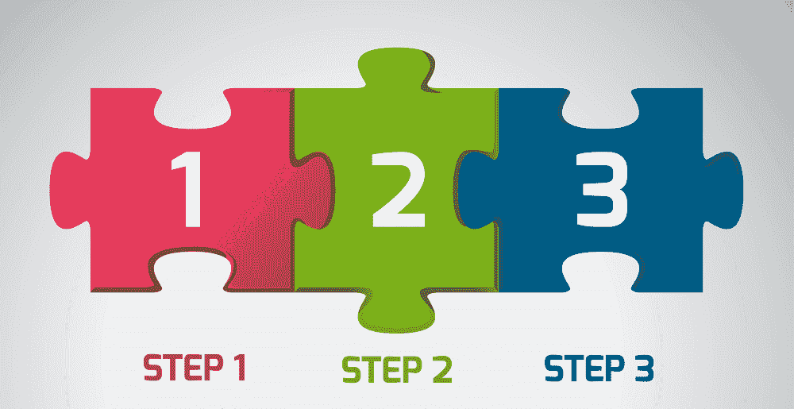
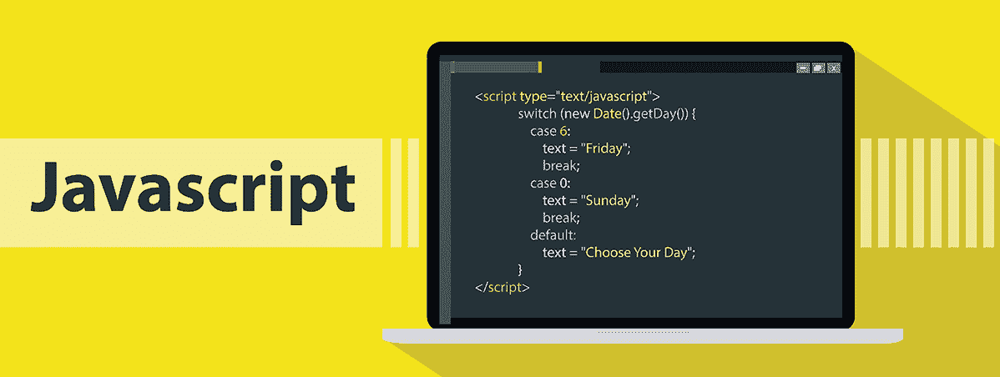
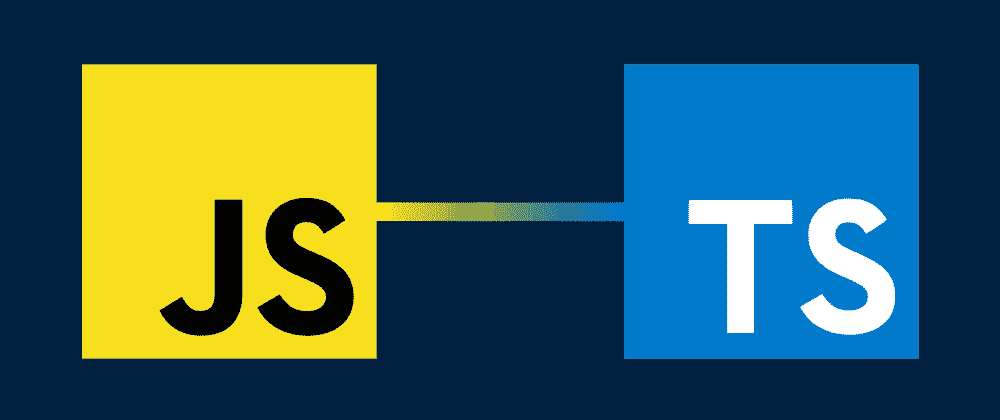
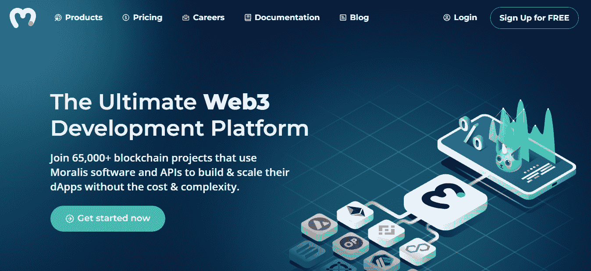
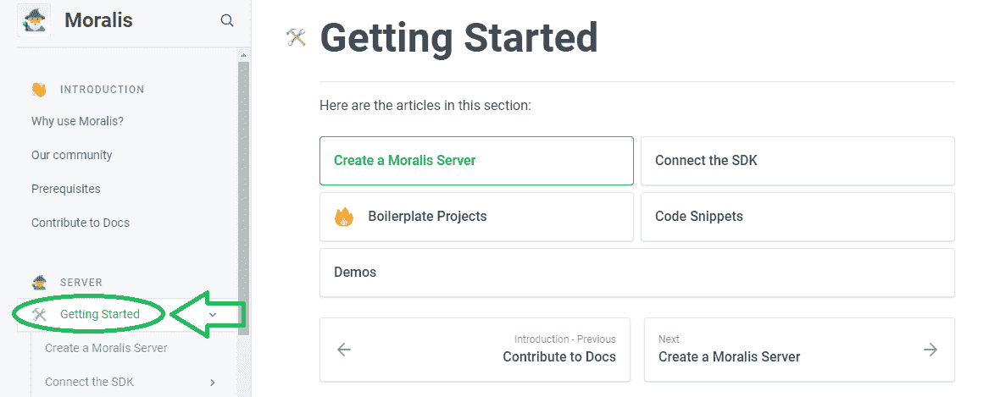
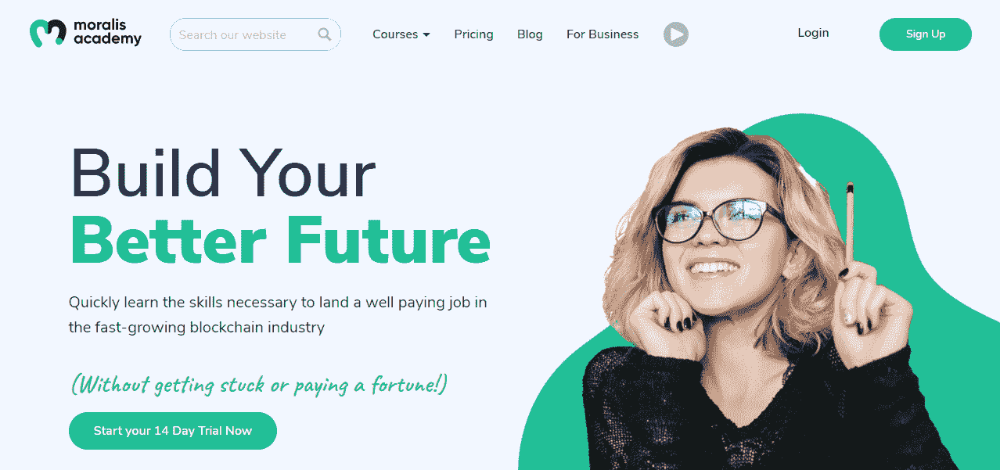
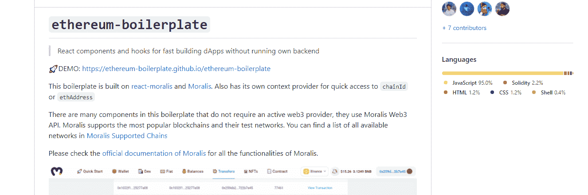
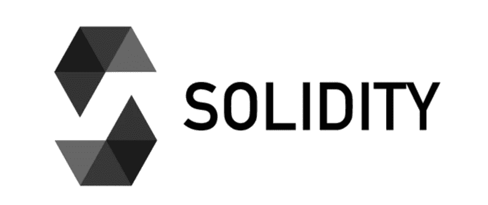
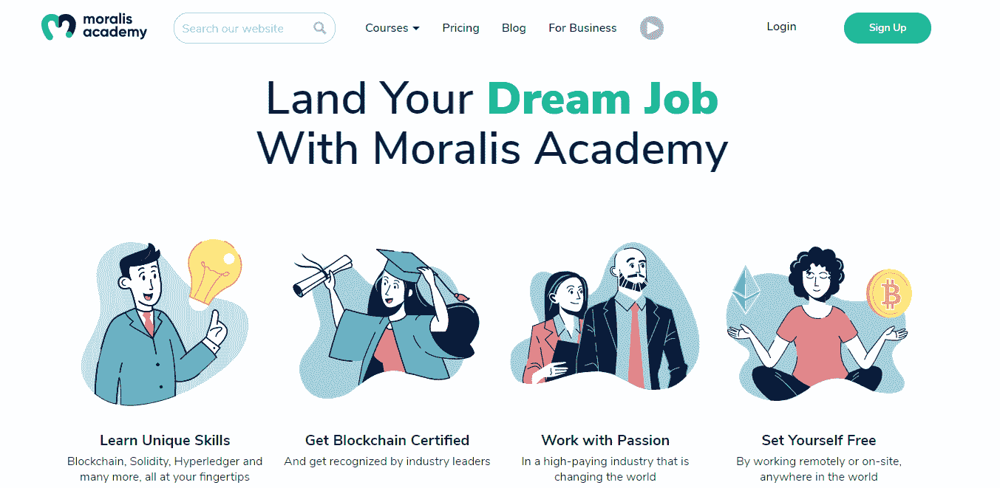

# 如何成为 Web3 开发者——完整指南

> 原文：<https://moralis.io/how-to-become-a-web3-developer-full-guide/>

仅仅通过问“如何成为一名 Web3 开发者？”你已经遥遥领先了。现在是使用你现有的 Web2 技能并向 [**Web3**](https://moralis.io/the-ultimate-guide-to-web3-what-is-web3/) **发展过渡的最佳时机。而且，即使你一点经验都没有，你也可以** [**比较快的成为一个区块链开发者**](https://moralis.io/how-to-become-a-blockchain-developer/) **。重要的是采取行动——从今天开始学习和建设。只要你能看到 Web3 会一直存在，你的想法就会被正确地引导。未来五到十年，Web3 将接管大部分行业。然而，它可能会发生得更快。因此，请确保相应地定位自己。所需要的只是足智多谋、以成长为导向、对这项新技术充满好奇，以及足够聪明地使用正确的工具。**

在这里，我们将探讨如何轻松成为一名 Web3 开发者。我们会告诉你你应该主要关注的编程语言。此外，我们将向您展示一些非凡的加密工具。此外，这些工具可以使“如何成为 Web3 开发人员”的旅程更加顺利。

更进一步，诸如 [Remix](https://moralis.io/remix-explained-what-is-remix/) 、 [Ganache](https://moralis.io/ganache-explained-what-is-ganache-blockchain/) 、 [Truffle](https://moralis.io/truffle-explained-what-is-the-truffle-suite/) 、 [OpenZeppelin](https://moralis.io/what-is-openzeppelin-the-ultimate-guide/) 、 [MetaMask](https://moralis.io/metamask-explained-what-is-metamask/) 等工具就等着被你利用并投入使用了。然而，在当前的 [Web3 技术栈](https://moralis.io/exploring-the-web3-tech-stack-full-guide/)中， [Moralis](https://moralis.io/) 是你的头号操作系统。这个终极的 Web3 开发平台，也被称为“ [Firebase for crypto](https://moralis.io/firebase-for-crypto-the-best-blockchain-firebase-alternative/) ”，让 Web3 开发变得轻而易举。它使您能够在几分钟内启动并运行 dApps ( [分散应用](https://moralis.io/decentralized-applications-explained-what-are-dapps/))。另外， [Moralis 的 SDK](https://moralis.io/exploring-moralis-sdk-the-ultimate-web3-sdk/) 自带了最广泛的 [Web3 API](https://docs.moralis.io/moralis-server/web3-sdk/intro) ，包括[以太坊 API](https://moralis.io/ethereum-api-develop-ethereum-dapps-with-moralis/) 和 [NFT API](https://moralis.io/ultimate-nft-api-exploring-moralis-nft-api/) 。你也可以用它来索引区块链。因此，现在就创建你的免费 Moralis 账户吧！

## 如何成为一名 Web3 开发者

在我们进一步讨论之前，您应该注意到 Web3 开发有几个方面。首先，你有后端和前端，就像 Web2 一样。此外，由于智能合约是 dApps 的重要组成部分，它们应该被单独归类。当然，还有新的可编程区块链的创建和开发，但这不是我们在这里感兴趣的。

正如介绍中提到的，我们的任务是向您展示如何以最少的阻力成为一名 Web3 开发者。这包括知道使用什么简单易懂的工具，以及为 Web3 开发学习什么语言。此外，你还应该专注于交付切实的成果——你可以向你的同事、潜在客户或投资者展示的东西。因此，你需要学习如何创建一个优秀的 dApp UI。因此，前端显然是必不可少的。另一方面，如果没有合适的后端和[智能合约](https://moralis.io/smart-contracts-explained-what-are-smart-contracts/)，你就不能添加任何合适的功能。

## 如何成为一名 Web3 开发者:你应该从前端还是后端开始？

那么，一个有抱负的 Web3 开发者应该主要关注什么呢？幸运的是，你可以同时了解前端和后端。怎么会？Moralis 都是可能的。这个[最好的 Web3 后端平台](https://moralis.io/exploring-the-best-web3-backend-platform/)可以让你用简短的代码片段覆盖所有与区块链相关的后端需求。请记住，整洁高效的 [Moralis 文档](https://docs.moralis.io/)完全由您支配。因此，您可以简单地复制相关的代码行，并将其粘贴到代码编辑器中。一旦你[创建了一个 Moralis 服务器](https://docs.moralis.io/moralis-server/getting-started/create-a-moralis-server)并用它的细节填充你的代码，你的后端担忧就消失了。

那么，如何成为一名 Web3 开发者呢？确保你学会了如何创建一个合适的前端，并使用 Moralis 的 SDK 来覆盖后端。这就是成为 Web3 开发者的要点。但是不要担心，我们将在下面为您提供更详细的说明。另外，请不要像其他开发者一样，在 [RPC 节点](https://moralis.io/ethereum-rpc-nodes-what-they-are-and-why-you-shouldnt-use-them/)上构建。这是一种过时的方法，并且处理 RPC 节点的[限制是非常耗时的。另外，即使投入了时间和精力，你也可能得不到你想要的结果。因此，阻力最小的道路是一条安全得多的路线，这正是 Moralis 所提供的。](https://moralis.io/exploring-the-limitations-of-rpc-nodes-and-the-solution-to-them/)

### 智能合同还是智能合同？

智能合约怎么样？你说得对；这些软件是 Web3 开发的重要部分。然而，现实情况是这部分开发通常只占百分之五到十。那么，你认为你应该首先关注智能合同的开发吗？如果你的答案是否定的，那你就对了。当然，随着您的进步，并希望了解如何满足您的 dApps 的特定需求并实现适当的自动化规则，创建高质量的智能合同已经就绪。然而，已经有这么多经过验证的智能合同模板供您使用。因此，你可以在不太了解如何创建智能合约的情况下构建各种 dApps。此外，您可以使用 OpenZeppelin 模板和 Remix 来满足大多数智能合约的需求。后者是一个智能契约编译器和部署器。

尽管如此，从头开始创建智能合约还有一个额外的方面——成本可能非常高。由于智能合约是所有规则的所在，任何错误都可能让你损失一大笔钱。因此，在部署所有智能合同之前，对其进行适当的审核至关重要。也就是说，尽可能使用经过验证的智能合同模板显然很有意义。

## 如何成为一名 Web3 开发者——要点

让我们指出，我们都有自己的偏好、期望和环境。因此，成为一名 Web3 开发者没有“一刀切”的方法。然而，根据我们自己的经验和成千上万开发人员的反馈，我们得出了一些无可争议的结论。以下是我们对如何成为 Web3 开发者的建议:

1.  学会创建一个合适的前端。
2.  学会使用 Moralis 的 SDK 来满足你的后端需求。
3.  如果需要独特的智能合约，学习如何创建自己的智能合约。

此外，以上三个阶段中的每一个阶段都有许多不同的方法。此外，你总是有一个“自由”的路径和一个“专业”的路径选项。当然，如果你真的想尽快成为一名区块链开发者，后者是你应该关注的。然而，这并不意味着没有任何高质量的免费教育视频和文章。

### 学会创建一个合适的前端

有许多前端开发语言。然而，我们相信 [JavaScript](https://moralis.io/javascript-explained-what-is-javascript/) (JS)会给你带来最大的收益。这也是我们创建 Moralis 的原因，在某种程度上，JavaScript 熟练程度与元掩码的结合足以让我们入门。当然，熟悉 Web3 基础和使用你最喜欢的代码编辑器也被认为是一些[先决条件](https://docs.moralis.io/introduction/pre-requisites)。此外，如果您已经了解 JavaScript，您可以进入第二步，学习如何使用 Moralis 的 SDK 来满足您的后端需求。

如果您还不精通 JavaScript，请确保先掌握这一技能。由于 JavaScript 的流行，有无数免费和付费的方式来学习这种流行的编码语言。带着明确的意图使用 YouTube 视频和其他免费在线材料会让你走得更远。虽然，报读精品课程会给你更精准的指导和结构合理的路径。

此外，我们强烈推荐一门特别的 JavaScript 课程——“面向区块链开发者的 [JavaScript 编程](https://academy.moralis.io/courses/javascript-programming-for-blockchain-developers)”。顾名思义，它是为那些想专注于 Web3 的开发者而设计的。在整个课程中，您将把所学的理论付诸实践，并构建一个指数。尽管如此，当使用 JavaScript 时，您可以选择关注普通 JavaScript(通常称为“普通 JavaScript”)或使用 JavaScript 前端库， [React](https://moralis.io/react-explained-what-is-react/) 。当使用后者时，您需要将您的 UI 分成组件。然而，普通 JavaScript 使您能够以任何您想要的方式构建应用程序。

此外，我们还建议学习 TypeScript (TS)，尤其是如果你想专注于使用 React 的话。ts 有一些方面优于 JS。因此，我们已经用 Moralis 实现了完全支持这种编程语言所需的一切。

### 学习使用 Moralis 的 SDK 来满足您的后端需求

Moralis 带来的速度和简单性使其成为区块链开发的重要组成部分。使用 Moralis，您可以节省多达 87%的开发时间。此外，通过学习使用这个 Web3 开发平台，您不会冒任何风险。由于 Moralis 完全是关于跨链互操作性的，它使您能够跨所有支持的链部署 dApps，如 Ethereum、Polygon、BSC 和 Avalanche。此外，埃尔隆德也在酝酿之中。因此，通过使用 Moralis，你可以让你的工作经得起未来的考验。

一旦你了解了 JavaScript 并掌握了 Web3 的基础知识，使用 Moralis 就非常容易了。你需要的所有细节都在 Moralis 的文档中，你可以免费获取。此外，你还可以免费创建你的 Moralis 账户。因此，你可以开始使用 Moralis 的 SDK，而不用花一分钱。此外，你可以在 Moralis 不和谐频道和 Moralis 论坛获得额外的支持。然而，如果你对专家指导感兴趣，[Moralis 学院](https://academy.moralis.io/)是首要平台。除了不同区块链主题的高质量[课程](https://academy.moralis.io/all-courses)，你还将获得个性化的学习路径和指导。因此，你将能够更快地掌握 Web3 开发。

总而言之，学习如何使用 Moralis 是一种实践。因此，您的目标应该是承担尽可能多的示例项目。除了 Moralis 学院提供给你的那些，Moralis 博客和 YouTube 频道上还有无数的教程。我们建议从简单的项目开始，以便掌握它的窍门。因此，掌握 [Web3 认证](https://moralis.io/web3-authentication-the-full-guide/)可能是一个很好的起点。

#### 如何成为 Web3 开发者:额外的捷径

当您通过跟随我们的示例项目开始学习如何使用 Moralis 的 SDK 时，您很快就会遇到我们的样板文件。在这里，[以太坊 dApp 样板](https://moralis.io/ethereum-dapp-boilerplate-full-ethereum-react-boilerplate-tutorial/)和[以太坊移动样板](https://moralis.io/ethereum-mobile-boilerplate-full-guide-to-ethereum-for-mobile/)是我们所有其他样板的基础。有了这些快捷方式，您可以在创纪录的时间内准备好您的 web 或移动 dApps。通常，您只需要克隆相关的 GitHub 代码，并输入您的 Moralis 服务器的详细信息。如果你对创建具有简洁 UI 的功能性 dApps 感兴趣，一定要看看我们的[样板项目](https://docs.moralis.io/moralis-server/getting-started/boilerplate-projects)。

React Native 是另一个强有力的论据，说明为什么 JS 及其流行的库 React 是一个极好的起点。他们也敞开大门，开始开发 React 原生 Web3 应用程序，并进而瞄准移动用户。

### 高级:学习创建智能合同

如上所述，即使不知道如何创建智能合同，你也可以成为一名优秀的 Web3 开发人员。然而，当你接手更多独特的项目时，学习这种技能的需求也可能会出现。因此，我们想与您分享一些快速提示。如上图所示，智能合同创建需要关注的编程语言是 [Solidity](https://moralis.io/solidity-explained-what-is-solidity/) 。幸运的是，这种语言入门相对简单；但是，掌握起来也是相当棘手的。因此，我们建议您尽可能依赖经过验证的模板。此外，坚固性适用于所有基于 EVM 的链(以太坊、多边形、雪崩等)。)，这给了你很多选择。另一方面，如果你已经知道了 Rust，你可能想把重点放在建立在索拉纳区块链之上。

而且学习 Solidity 有很多免费和付费的选择。一个很好的开始是在 Moralis 的 YouTube 频道上的“ [Learning Solidity](https://www.youtube.com/playlist?list=PLFPZ8ai7J-iTJDENUIY40VsU_5Wmxkr7j) ”播放列表。此外，“[以太坊智能合约编程 101](https://academy.moralis.io/courses/ethereum-smart-contract-programming-101/) 课程在 Moralis 学院等着你。

这里还有一个如何成为 Web3 开发人员的视频概述(从 9:43 开始):

https://www.youtube.com/watch?v=_5ktJ_uQHFw

成为区块链开发者的一个重要部分是理解基础知识。因此，使用简介中的“成为区块链开发者”链接，可以在一个地方获得基本的区块链开发概念和工具。

尽管如此，你也应该看看 [Moralis 的元宇宙 SDK](https://moralis.io/metaverse/) ，尤其是如果你有一些 Unity 的经验。这是参与 Web3 游戏开发的最简单的方式。从[用 Web3 登录](https://moralis.io/connecting-a-unity-game-with-web3-login/)连接一个 Unity 游戏开始。然后，你可以学习使用[元宇宙智能联系人](https://moralis.io/metaverse-smart-contract-how-to-build-a-metaverse-game-smart-contract/)的例子。最后，你将准备好[用 Unity 构建一个中世纪的元宇宙游戏](https://moralis.io/how-to-build-a-medieval-metaverse-game/)或者一个 [Web3 MMORPG](https://moralis.io/build-a-web3-mmorpg-with-unity-in-10-minutes/) 。

## 如何成为 Web3 开发人员的总结——完整指南

在本指南中，你已经学到了很多。你现在知道如何成为一名 Web3 开发者了。这真的不是火箭科学，我们相信每个相信这项技术并觉得它有趣的人都可以成为 Web3 开发者。此外，你还发现，在这段旅程中，你可以选择多种途径。随着在线教育的蓬勃发展，你有许多免费和付费的选择。因此，我们让你来决定你的下一步。然而，为了以最小的阻力到达终点，你应该遵循以下指导方针:

1.  学习创建一个合适的前端——学习 JavaScript。
2.  学习使用 Moralis 的 SDK 来满足您的后端需求。
3.  如果需要独特的智能合约，学习如何创建自己的智能合约。

采取行动，应用这里提供的指导方针，你很快就能成为全职加密员。