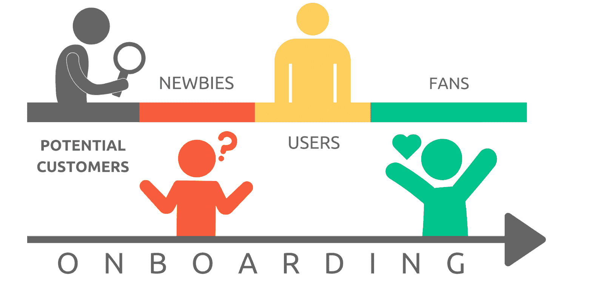
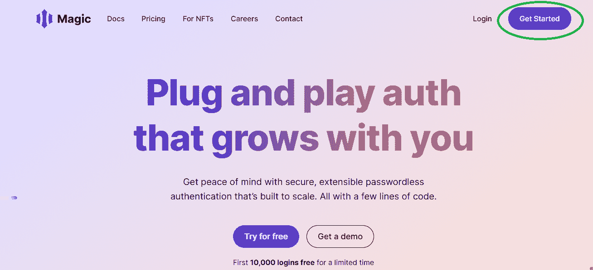

# 如何提高 Web3 用户入职成功率

> 原文：<https://moralis.io/how-to-boost-web3-user-onboarding-success-rates/>

许多因素，如积极的用户体验(UX)和高质量、用户友好的用户界面(用户界面)，都在 Web3 用户入职成功率中发挥着重要作用。此外，这部分包括简单性。现在，如果你有任何区块链开发的经验，你知道需要简化的一个过程是如何让 Web3 用户参与进来。因此，如果我们能够使入职过程平滑无缝，我们将获得更多的用户，我们的[**【dApps】**](https://moralis.io/decentralized-applications-explained-what-are-dapps/)**(分散应用)将更有可能成功。幸运的是，有几种工具可以实现这一点。在这里，我们将仔细研究这些工具，并探索如何使用 Moralis 轻松提高 Web3 用户的加入成功率。**

在本文中，您将发现如何使 Web3 用户入门无缝且简单。通过使用终极的 [Web3](https://moralis.io/the-ultimate-guide-to-web3-what-is-web3/) 开发平台、 [Moralis](https://moralis.io/) 以及它的一些最新集成，Web3 用户登录变得没有摩擦。此外，一个令人印象深刻的部分是 Moralis(又名 [Firebase for crypto](https://moralis.io/firebase-for-crypto-the-best-blockchain-firebase-alternative/) )使你能够用几行代码实现 [Web3 认证](https://moralis.io/web3-authentication-the-full-guide/)。通过[创建你的免费 Moralis 账户](https://admin.moralis.io/register)，你可以获得终极的 Web3 SDK。因此，你得到了一个完整的[以太坊 API](https://moralis.io/ethereum-api-develop-ethereum-dapps-with-moralis/) ，包括一个极其强大的 [NFT API](https://moralis.io/ultimate-nft-api-exploring-moralis-nft-api/) 。另外， [Moralis 的 SDK](https://moralis.io/exploring-moralis-sdk-the-ultimate-web3-sdk/) 为您提供了 Moralis 服务器、Moralis 仪表板(数据库)和 Moralis 同步功能。后者使您能够[索引区块链](https://moralis.io/how-to-index-the-blockchain-the-ultimate-guide/)和[同步并索引智能合约事件](https://moralis.io/sync-and-index-smart-contract-events-full-guide/)。接下来，我们将首先介绍一些基础知识，帮助大家快速掌握。然而，本文的核心是 Web3 用户入门设置指南。


## 什么是用户入职？

在我们进一步公开讨论 Web3 用户入门之前，您需要知道用户入门意味着什么。因此，用户入职是整合或熟悉新客户或客户特定产品或服务的过程或行为。这个过程并不新鲜；然而，随着移动和网络应用的诞生，它的使用越来越频繁。这些通常包括一些用户需要从一开始就熟悉的独特功能。

因此，加入用户的过程与产品或服务使用该产品或服务的要求一样复杂。此外，虽然也有例外，但作为一条经验法则，你应该始终致力于尽可能简单快速地入职。许多直观的应用程序的用户入职只不过是一个注册过程。在 Web2 应用程序中，后者可以使用电子邮件地址和密码或使用社交登录来完成。我们真的不能强调有一个平稳和简单的注册过程的重要性不够。你最不希望的就是在用户开始使用你的应用程序之前就失去他们。

当然，如果你能执行出色的营销，让用户确切地知道他们为什么要使用你的产品或服务，你可以有一个稍微复杂一点的入职流程。此外，如果你的产品或服务是市场不熟悉的，就没有办法找到更独特的用户。然而，让事情尽可能简单，并结合熟悉的步骤，毫无疑问，是一条路要走。这些指针在 Web3 用户入门中扮演着重要的角色。那么，如何将区块链世界的新概念提升到对传统用户友好的水平呢？让我们找出答案。



### Web3 中的用户入职

如果你以前使用过 Web3 应用程序，你会知道它们中的大多数依赖于 [Web3 钱包](https://moralis.io/what-is-a-web3-wallet-web3-wallets-explained/)来认证用户。因此， [MetaMask](https://moralis.io/metamask-explained-what-is-metamask/) 和 [WalletConnect](https://moralis.io/what-is-walletconnect-the-ultimate-walletconnect-guide/) 都是很好的解决方案。已经设置好钱包的用户会发现这个过程相当顺利。然而，来自传统 Web2 领域的新来者很容易被设置新钱包、添加浏览器扩展等所淹没。*有关 onboarding Web3 用户的问题列表，请参考下面的章节。*


此外，让我们提醒您，注册是用户入职流程的一部分。因此，我们可以得出结论，大多数 dApps 目前没有最用户友好的 Web3 onboarding。那么，更熟悉的方法是什么呢？嗯，我们可以自信地说，大多数用户都有一些 Web2 应用程序的经验。因此，他们很可能熟悉电子邮件和社交登录。因此，将这些注册/登录选项整合到您的 dApps 中应该会改善 Web3 用户的登录体验。此外，后者对于主流采用这一颠覆性技术至关重要。

现在，你可以来硬的了。您可以尝试构建一个基础设施，使您能够使用 Web2 方法对 Web3 用户进行身份验证。另一方面，通过使用可用的工具，您可以为自己节省大量时间、精力和资源。在“如何促进 Web3 用户参与”一节中，您将了解到关于该快捷方式的所有细节。


### Web3 用户入职问题

如上所述，目前上线的大多数 dApps 都不提供用户友好的入职服务。即使让用户熟悉 dApp 的过程是惊人的，它也不能很好地服务于密码领域的新手。如前所述，我们将在下面为您提供一个合适的解决方案。然而，让我们首先仔细看看 Web3 用户入门的一些主要问题:

*   ***通常要求之前有 web 3 tech/区块链的经验。*T3】**
*   ***要求用户创建自己的加密钱包*** *(可以是***)。**
**   **——在跨链互操作的情况下，用户会遇到令人困惑的选项。****   ***吓人****——当新用户的 Web3 钱包开始弹出信息时，他们会害怕做错事。**   ***耗时****——创建一个新钱包并安装其浏览器扩展要费时很多。许多新用户不愿意投入超过几秒钟的时间。**   **——web 3 最初是由精通技术的开发人员推动的，他们的思维过程与普通人有很大不同。****   ***不适合大众市场采用****–**考虑到上面列出的所有问题，在 crypto 有望被主流采用之前，当前的 Web3 用户入门需要改进。****

**

## 如何促进 Web3 用户的加入

如前所述，Moralis 为您提供了创建跨链互操作 dApps 所需的所有工具。因此，您可以在所有受支持的区块链上使用相同的代码部署所有面向未来的 dApps。此外，这个优秀的 [Web3 后端平台](https://moralis.io/exploring-the-best-web3-backend-platform/)让开发者节省了超过 87%的开发时间。单是 Moralis 就令人印象深刻；然而，当您将它的集成添加到图片中时，事情变得更加简单。此外，集成在 Web3 用户加入中扮演着重要的角色。更具体的说，我们说的是 Web3Auth 和 Magic(由 Magic Labs 开发)。前者为您提供 [Web3 社交登录](https://moralis.io/web3-social-login-sign-in-dapp-users-with-google-email-or-twitter/)和电子邮件登录，而后者则是通过电子邮件进行 [Web3 认证。此外，Magic 还提供了无密码登录选项，具有特殊的用户友好型吸引力。](https://moralis.io/how-to-do-web3-authentication-via-email/)

在接下来的部分中，您将有机会了解如何利用这些优秀工具的所有细节。因此，我们将指导您完成初始设置，以便您可以开始使用。总的来说，您将学习如何使用 Moralis 和 Moralis 与 Web3Auth 的集成，以及 Moralis 与 Magic 的无密码集成来创建更好的 Web3 登录。


## 社交登录–实施

为了设置 Web3 社交登录，您需要完成初始的 Web3Auth 设置。在 [Moralis 文档](https://docs.moralis.io/)中的“用户”>“web 3 认证”>“web 3 认证”下，有详细的说明等着您。然而，这里是它的要点:

1.  首先创建您的 [Web3Auth](https://dashboard.web3auth.io/) 账户。使用左边的链接。在下一页上，输入您的电子邮件地址:


2.  创建帐户后，您将可以浏览您的仪表板。因此，导航到“即插即用”部分:


3.  在“即插即用”部分，单击“创建项目”按钮之一。

4.  成功创建项目后，您将可以访问该项目的客户端 ID:


5.  接下来，是时候将 Web3Auth SDK 添加到应用程序中了。
    1.  如果您通过 CDN 导入 Moralis，请使用以下代码行:

*<script src = " https://UNP kg . com/@ web 3 auth/[【邮件保护】](/cdn-cgi/l/email-protection)/dist/web 3 auth . UMD . min . js "></script>*

2.  但是，如果您通过 NPM 或另一个包管理器导入 Moralis，请使用以下命令行:

*npm 安装–保存@web3auth/web3auth*

6.  此时，您已经准备好调用 authenticate 函数了。后者接受几个参数。此外，客户机 ID(上面获得的)是唯一需要的。这些是您需要使用的代码行。*注意，确保将占位符替换为您的客户 ID:*

```js
const user = await Moralis.authenticate({
	provider: "web3Auth",
	clientId: "ABC*****************",
})
```

以下是您也可以在上述函数中使用的可选参数列表:

*   **“chainId”**–*您希望连接的支持网络。*
*   **【主题】**–*主题的颜色可以是浅色也可以是深色。后者是默认选项。*
*   **【应用标识】**–*添加一个独特的标识。*
*   **" loginMethodsOrder "**–*您希望允许的社交登录及其顺序。*

*这里还有一个使用 Web3Auth 的示例 dApp 的视频教程:*

https://www.youtube.com/watch?v=44ItBuw86AA

## 无密码登录–实施

如果你想专注于无密码电子邮件登录，那么你需要专注于 Moralis 的神奇集成。与 Web3Auth 一样，在这种情况下，您也需要完成一些初始设置步骤。以下是您需要遵循的步骤(更多详细信息，请使用 Moralis 文档中的[“魔法”说明](https://docs.moralis.io/moralis-server/users/crypto-login/magic)):

1.  您需要获得您的 Magic API 密钥。因此，访问官方 [Magic](https://magic.link/) 网站，点击“开始”按钮。然后，完成注册过程:



创建您的 Magic 帐户后，您可以访问您的 API 密钥。

2.  是时候将 Magic SDK 添加到您的应用程序中了。
    1.  如果您通过 CDN 导入 Moralis，请使用以下代码行:

*<脚本 src = " https://auth . magic . link/SDK "></脚本>*

2.  但是，如果您通过 NPM 或另一个包管理器导入 Moralis，请使用以下命令行:

*npm 安装 magic-sdk*

3.  现在，您可以将无密码注册功能添加到您的 dApps 中了。使用以下代码行:

```js
const user = await Moralis.authenticate({ 
  provider: "magicLink",
  email: "[email protected]",
  apiKey: "pk_xxxxx",
  network: "kovan",
})
```

关于以上参数:

*   "**提供商**"–*要使用魔法链接，你需要在“提供商”旁边使用“magicLink”。*
*   "**电子邮件**"–*您需要在这里输入想要登录的用户的电子邮件地址。因此，您需要将该参数与电子邮件捕获字段连接起来。*
*   "**API key**"–*这是你粘贴神奇 API 密匙的地方。*
*   "**网络**"–*在这里，你在 mainnet (* [*以太坊*](https://moralis.io/full-guide-what-is-ethereum/) *)和* [*以太坊 testnet*](https://moralis.io/ethereum-testnet-guide-connect-to-ethereum-testnets/)*中选择一个。*

如果你更喜欢视频，你可以观看 Moralis 的专家完成上述设置。此外，他还将向您展示如何创建一个演示 dApp 来观看魔术表演:

https://www.youtube.com/watch?v=gLJ4YejmG2E

### 轮到您实施用户友好的 Web3 Onboarding 了

除非你以前使用过 Moralis，否则你首先需要完成一些简单的初始设置。除了创建你的免费 Moralis 账户，你还需要[创建一个 Moralis 服务器](https://docs.moralis.io/moralis-server/getting-started/create-a-moralis-server)。然后，您将使用该服务器的详细信息来初始化 Moralis。在这里，您有几个选项(取决于您正在处理的项目类型)。不过，一般来说，你要么从头开始，要么使用终极[以太坊 dApp 样板](https://moralis.io/ethereum-dapp-boilerplate-full-ethereum-react-boilerplate-tutorial/)。从头开始构建 dApps 时，您需要将服务器的详细信息填充到”。js“，”。jsx“，”。html”或其他一些文件。然而，当使用 [Web3 样板文件](https://moralis.io/web3-boilerplate-beginners-guide-to-web3/)时，你会把注意力集中在。env "文件:


Moralis 启动后，你就可以利用以上两个部分采取行动了。因此，您将很容易实现一个用户友好的 Web3 onboarding 方法。

## 如何提高 Web3 用户入职成功率——总结

此时，您应该是 Web3 身份验证的半个专家了。您现在知道什么是用户入职，以及为什么它必须尽可能无摩擦。此外，您知道典型的 Web3 登录(使用热钱包)对于密码领域的新手来说是不友好的。因此，你已经有机会了解两个 Moralis 整合，使一个巨大的差异。因此，您现在已经准备好提高 Web3 用户入职成功率。

无论你是否准备好接受一些有趣的项目，或者如果你想继续你的免费区块链教育，你都应该看看 [Moralis 博客](https://moralis.io/blog/)和 [Moralis YouTube 频道](https://www.youtube.com/c/MoralisWeb3)。我们的一些最新主题涵盖了 [Web3 游戏化](https://moralis.io/web3-gamification-creating-a-coinmarketcap-diamonds-dapp/)、 [React Native Web3](https://moralis.io/react-native-web3-full-react-native-web3-dev-guide/) 、[什么是元宇宙](https://moralis.io/what-is-the-metaverse-full-guide/)、[可重入智能合约示例](https://moralis.io/what-is-reentrancy-reentrancy-smart-contract-example/)、[治理令牌](https://moralis.io/what-are-governance-tokens-full-guide/)、 [BSC 钱包指南](https://moralis.io/bsc-wallet-guide-how-to-set-up-a-binance-smart-chain-wallet/)等等。然而，如果你渴望尽早成为一名区块链开发者，你需要考虑一种更专业的方法。如果是这样的话，报名参加 Moralis 学院可能是你下一个合乎逻辑的步骤。通过这样做，你可以参加专业的[课程](https://academy.moralis.io/all-courses)，加入一个了不起的社区，并得到专家的指导。

**