# 如何构建 2D Web3 游戏——全 Guide

> 原文：<https://moralis.io/how-to-build-a-2d-web3-game-full-guide%ef%bf%bc/>

你还记得视频游戏行业的早期吗？在 2D 环境中，经典游戏让每个人都在屏幕前呆上几个小时。复古游戏仍然很受欢迎，甚至现代游戏开发商今天仍然创造 2D 游戏。然而， [**Web3**](https://moralis.io/the-ultimate-guide-to-web3-what-is-web3/) **给游戏行业带来了新的概念，比如**[**play-to-earn(P2E)**](https://moralis.io/non-fungible-tokens-explained-what-are-nfts/)**模式，在这种模式下，玩家可以赚取可替代的和** [**不可替代的代币(NFTs)**](https://moralis.io/non-fungible-tokens-explained-what-are-nfts/) **。因此，如果我们结合流行的 2D 环境和 Web3，提供收入潜力，使用 NFTs 作为游戏内资产的能力，等等。，我们的 2D Web3 游戏会吸引众多用户。因此，我们决定在这里演示如何使用正确的** [**Web3 技术堆栈**](https://moralis.io/exploring-the-web3-tech-stack-full-guide/) **来构建 2D Web3 游戏，并在几分钟内完成这个过程。**

接下来，我们将把一个公开的 2D 游戏整合到 React 应用程序中。此外，为了包含 Web3 功能，我们将使用最终的 Web3 开发平台， [Moralis](https://moralis.io/) 。这个“ [Firebase for crypto](https://moralis.io/firebase-for-crypto-the-best-blockchain-firebase-alternative/) 平台将使我们能够使用最流行的 [Web3 钱包](https://moralis.io/what-is-a-web3-wallet-web3-wallets-explained/)–[元掩码](https://moralis.io/metamask-explained-what-is-metamask/)轻松整合 [Web3 认证](https://moralis.io/web3-authentication-the-full-guide/)。此外，通过 [Moralis 的 SDK](https://moralis.io/exploring-moralis-sdk-the-ultimate-web3-sdk/) ，我们将有机会向我们的 2D Web3 游戏示例添加其他链上特性。此外，我们将依靠其他一些非凡的工具让我们到达终点，如 Phaser 和 Visual Studio Code (VSC)。尽管如此，我们鼓励你跟随我们的领导，加入我们，解决这个例子项目。通过这样做，你不仅可以学习创建一个 2D Web3 游戏，还可以熟悉上面提到的工具。因此，[创建你的免费 Moralis 账户](https://admin.moralis.io/register)，我们继续学习时你会用到它。

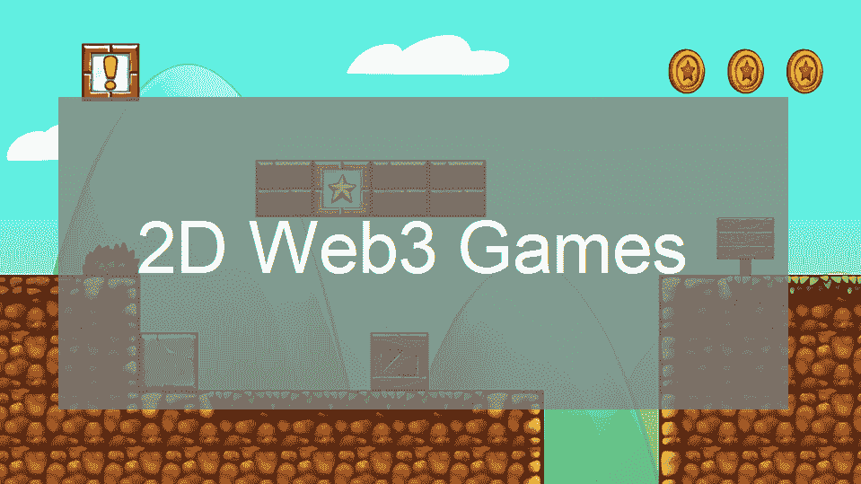

## 我们的 2D Web3 游戏示例预览

在开始我们的示例项目之前，我们想快速演示一下我们的示例 2D Web3 游戏。这将帮助你决定是否要卷起袖子跟随我们的教程继续前进。

首先，用户会看到“开始”按钮:

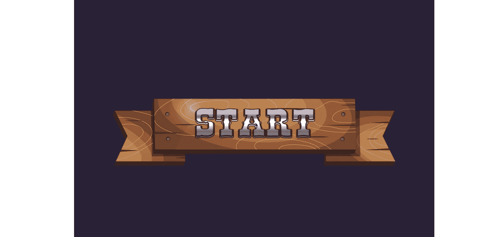

### Web3 游戏登录

点击上面的按钮，元掩码扩展会提示用户签署“使用 Moralis 登录”消息。本质上，这就是如何用元掩码对[进行认证:](https://moralis.io/how-to-authenticate-with-metamask/)


收到上述签名请求后，用户需要点击“签名”按钮。这样，他们就完成了游戏的 [Web3 登录](https://moralis.io/how-to-build-a-web3-login-in-5-steps/)。

此外，请记住，实现 Web3 身份验证有不同的方法。然而，当使用 Moralis 时，事情尽可能简单。对于 web dapp([分散式应用](https://moralis.io/decentralized-applications-explained-what-are-dapps/))，元掩码集成是首选工具。另一方面， [WalletConnect](https://moralis.io/what-is-walletconnect-the-ultimate-walletconnect-guide/) 是移动 dapps 的最佳解决方案。尽管如此，Moralis 还通过电子邮件和 [Web3 社交登录](https://moralis.io/web3-social-login-sign-in-dapp-users-with-google-email-or-twitter/)提供 [Web3 认证。这两个选项对于提高](https://moralis.io/how-to-do-web3-authentication-via-email/) [Web3 用户入职](https://moralis.io/how-to-boost-web3-user-onboarding-success-rates/)的成功率都是极好的。

### 我们 2D Web3 游戏的目标

一旦用户确认了登录信息，他们就会看到游戏的主菜单屏幕:


然后，用户需要点击屏幕上的任何地方来开始游戏。这将加载游戏:


此外，游戏的目的是在强盗(持枪的牛仔)向你开枪之前点击(射击)他们。从上面的截图可以看到，也有带着钱袋子的角色。玩家不应该射击它们。此外，顶部的数字表示玩家完成关卡需要收集的钱袋。然而，如果任何一个强盗在玩家被击中前开枪，游戏就结束了:

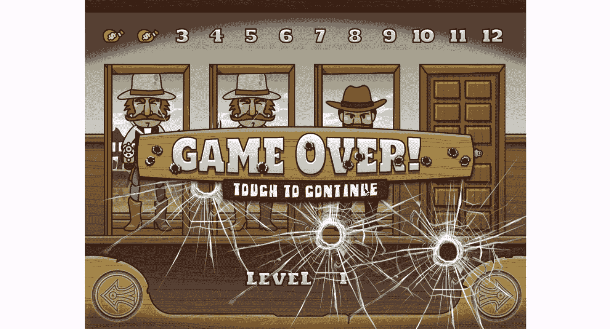

现在你知道我们将创造什么了。因此，你可以决定是否要跟随我们继续前进。然而，我们需要指出，我们将不会处理上述游戏的前端。通过使用 Phaser，我们将使用现有的 Web2 游戏作为样板，然后只添加 Web3 后端功能。

## 用相位器和 Moralis 建立一个 2D Web3 游戏

如前所述，我们将使用 Phaser，最流行的开源工作室游戏引擎，来找到一个完成的 2D 游戏。然后，我们将使用[最好的 Web3 后端平台](https://moralis.io/exploring-the-best-web3-backend-platform/)，Moralis，来整合上面介绍的区块链功能。本质上，我们将把 2D 的 Web2 游戏转换成 2D 的 Web3 游戏。

### 从 Phaser 获取现有游戏

所以，我们从 Phaser 的官网开始。在那里，我们从顶部菜单中选择“示例”。在下一页，我们向下滚动一点，点击“游戏”文件夹。从那里，我们选择“银行恐慌”游戏:

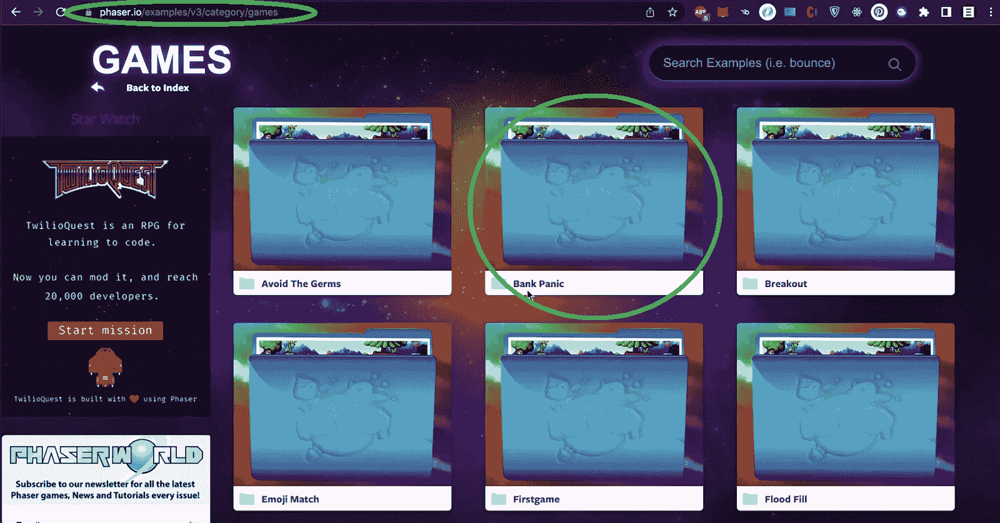

既然我们已经确定了一个特定的示例游戏，我们可以使用 Phaser 的代码和 GitHub 上的资源。因此，使用顶部菜单中的“下载”选项:

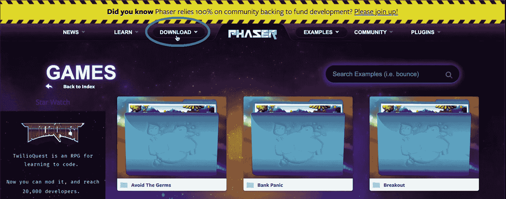

在“下载”页面，我们可以下载 Phaser:

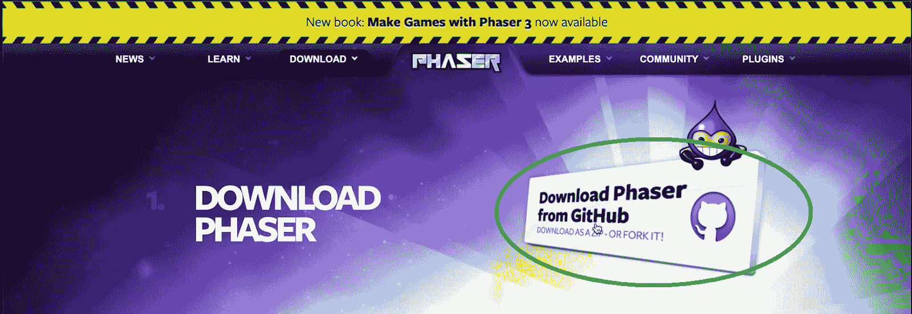

然后，点击下一页的“克隆”选项，进入 Phaser 的 GitHub:

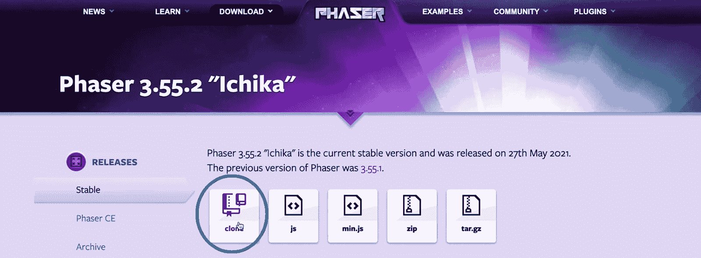

在那里，点击“photonstorm”:

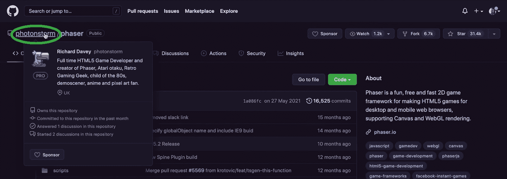

接下来，我们将选择“phase 3-examples”以确保包含“银行恐慌”游戏文件:

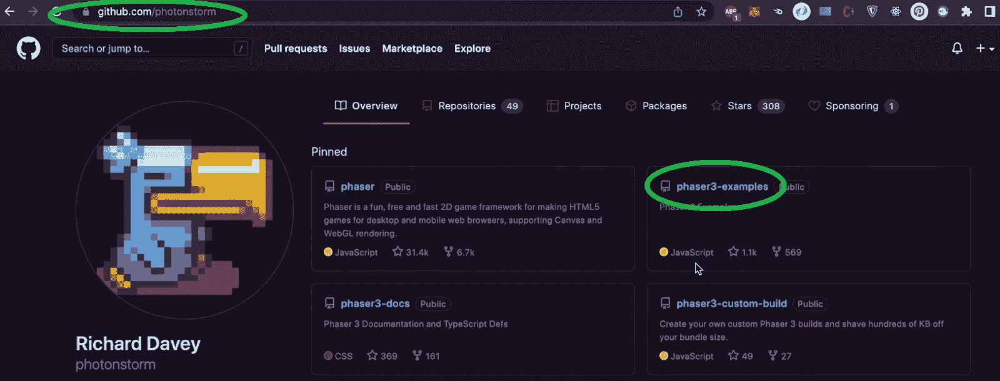

在“phase 3-examples”中，打开“public”文件夹:

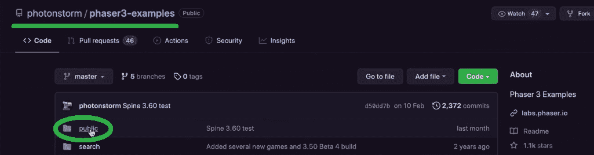

然后，在“公共”文件夹中，单击“资产”文件夹:

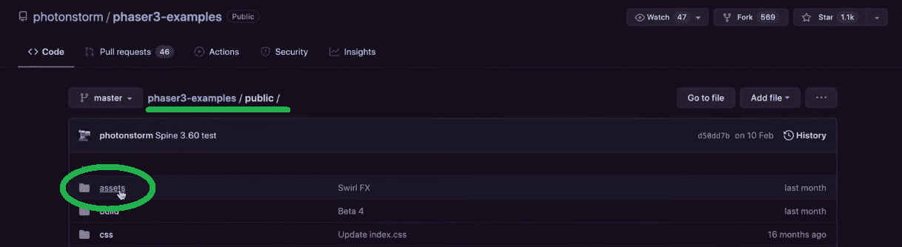

接下来，打开“游戏”，最后是“银行恐慌”:

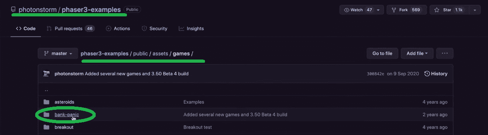

当我们查看“bank-panic”文件夹时，我们看到它包含声音、图像和其他游戏正常运行所需的文件。因此，我们可以克隆代码了。因此，我们返回到“第三阶段-示例”页面，单击“代码”，然后单击“下载 ZIP”:

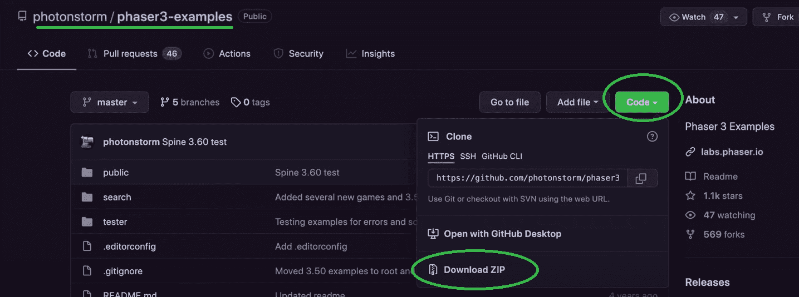

### 利用 VSC 把事情安排妥当

注意:我们在这个例子中使用了 VSC；但是，请随意使用您喜欢的代码编辑器。

我们首先创建一个 React 应用程序模板。我们通过在 VSC 的终端中输入“npx create-react-app phaser-moralis”命令来实现这一点:

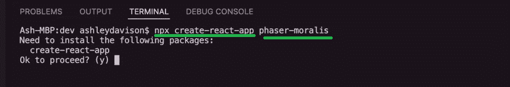

此外，请记住“phaser-moralis”是我们决定用于 dapp 的名称。你可以听从我们的领导或者使用任何你想要的名字。要最终创建我们的 React 应用程序，请在“确定继续吗？(y)"。创建该文件夹后，我们将其添加到 IDE 工作区:

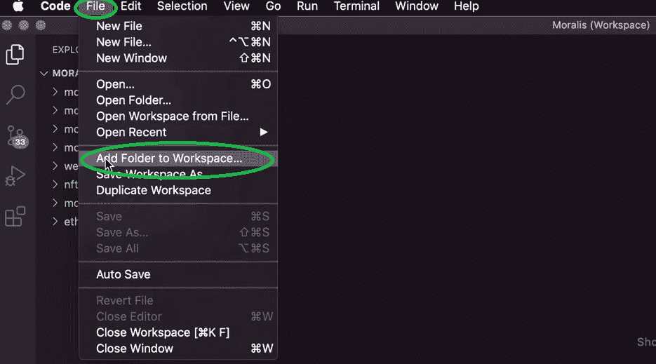

然后，选择“phaser-moralis”文件夹并点击“添加”:

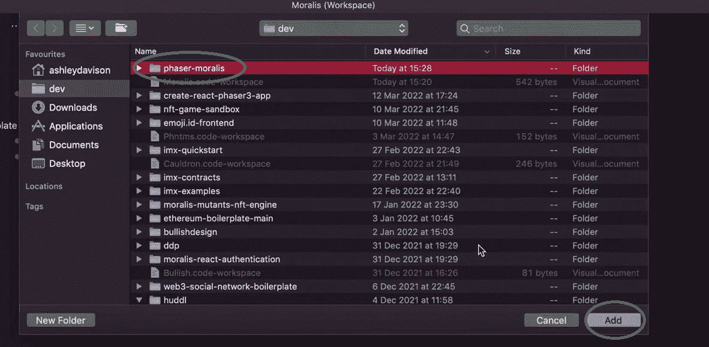

现在，我们解压之前下载的“phase 3-examples-master . zip”文件。解压缩后，我们导航到“银行恐慌”文件夹(第 3 阶段-示例-主>公共> src >游戏>银行恐慌)。这是我们示例游戏的场景文件所在的位置:

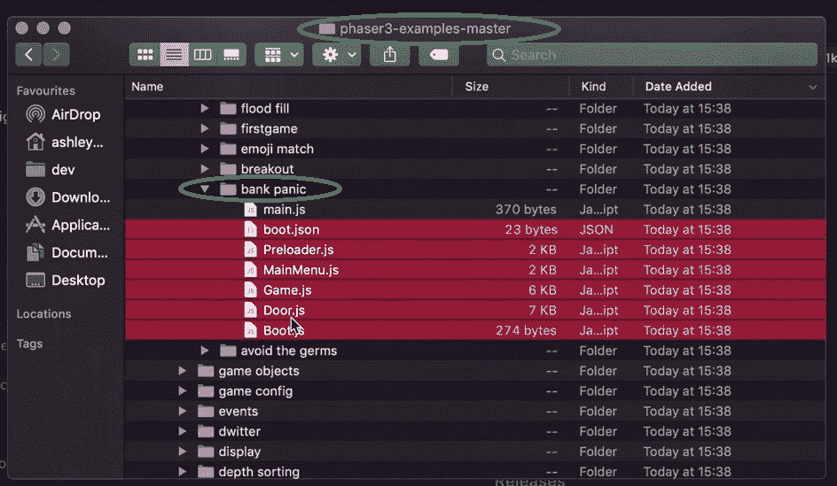

正如您在上面的截图中看到的，我们选择了除“main.js”文件之外的所有文件。我们将这些文件移动到一个新的“场景”文件夹中，该文件夹位于 React 应用程序的“src”文件夹中(如上所述):

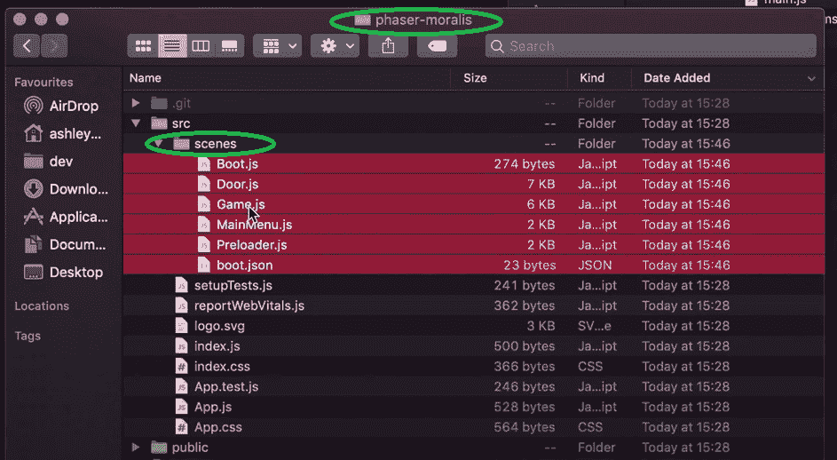

既然我们已经传输了示例游戏的场景文件，我们需要为所有的图像和声音文件做同样的事情。为此，我们必须在“资产”和“游戏”中找到“银行恐慌”文件夹。然后，我们将整个文件夹复制或移动到项目的“public”文件夹中的新“assets”文件夹中:

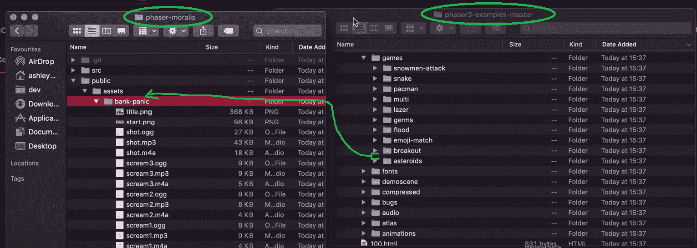

通过移动这些文件，我们实际上将 Phaser 的示例游戏集成到了 ReactJS 应用程序中。接下来，我们通过在 VSC 的终端输入“cd phaser-moralis”命令导航到“phaser-moralis”文件夹。

## 2D Web3 游戏代码演练–调整 Phaser 文件

所有想要访问我们 2D Web3 游戏的完整代码的人，你可以在 [GitHub](https://github.com/ashbeech/moralis-phaser-demo) 上这样做。但是，我们建议按照我们的步骤进行必要的调整，以充分利用本文。我们首先将“index.html”文件中的标题从“React App”更改为“Phase x React x Moralis”:

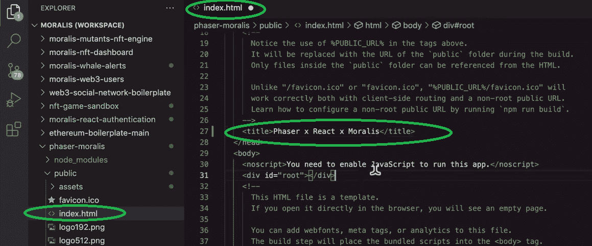

然后，改变”。js“扩展成”。" App.js "和" index.js "的 jsx "扩展:

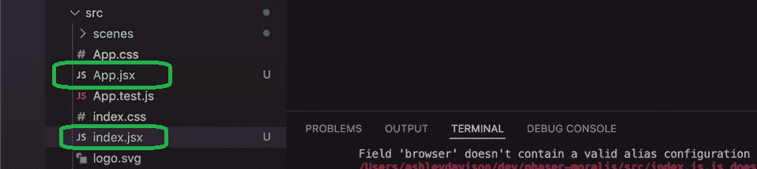

接下来，我们通过添加一个容器来调整“index.jsx”文件，我们的 canvas 元素将附加到该容器中。在“<app>”行上方，我们添加以下内容:</app>

```js
<div id= “game-container”></div>
```

此外，我们将上述容器包装在“App”组件周围:

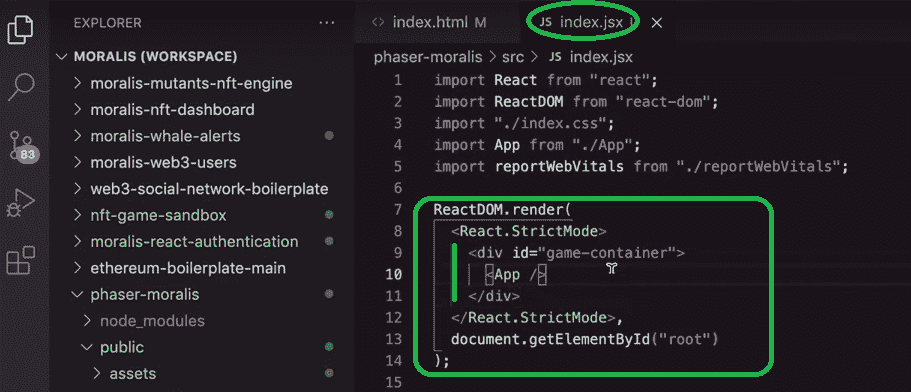

然后，我们打开“App.jsx”文件，首先在顶部导入 Phaser 文件:

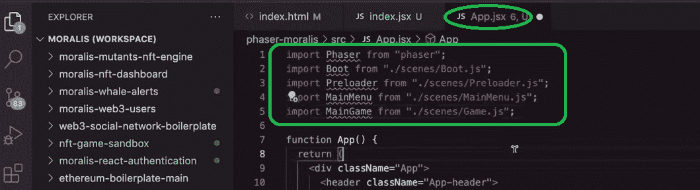

这也是我们通过在 VSC 的终端输入“npm i phaser”来安装 Phaser 的提示。接下来，仍然在" [App.jsx](https://github.com/ashbeech/moralis-phaser-demo/blob/main/src/App.jsx) "文件中，我们使用" let game = null 初始化我们的" game "变量。然后，我们需要添加一些额外的导入并调整“App()”函数。这也是我们添加以下“config”对象的地方，通过它我们的 Phaser 游戏被启动:

```js
  if (!loaded) {
    setLoaded(true);
    const config = {
      type: Phaser.AUTO,
      //gameTitle: "Phaser x Moralis",
      parent: "game-container",
      autoCenter: Phaser.Scale.CENTER_HORIZONTALLY,
      autoFocus: true,
      fps: {
        target: 60,
      },
      physics: {
        default: "arcade",
        arcade: {
          gravity: { y: 200 },
          debug: false,
        },
      },
      backgroundColor: "#282c34",
      scale: {
        mode: Phaser.Scale.ScaleModes.NONE,
      },
      scene: [Boot, Preloader, MainMenu, MainGame],
    };
    // init 2d game (Phaser canvas element)
    if (game === null) {
      // init instance of phaser game as per config
      game = new Phaser.Game(config);
      // listen to in-game events
      // before starting we sign in with wallet
      game.events.on("LOGIN_PLAYER", (event) => {
        console.log("⛓⛓⛓ Login via Web3 Wallet ⛓⛓⛓");
        // trigger wallet authentication
        login();
      });
    }
```

### 导入 Phaser

为了让上面的代码运行，我们还需要在我们的[场景文件](https://github.com/ashbeech/moralis-phaser-demo/tree/main/src/scenes) ("Boot.js "，" Door.js "，" Game.js "，" MainMenu.js "，和" Preloader.js ")中导入 phaser，使用'*从" Phaser "中导入 Phaser；*行。此外，我们还需要在“Game.js”文件中分配初始值:

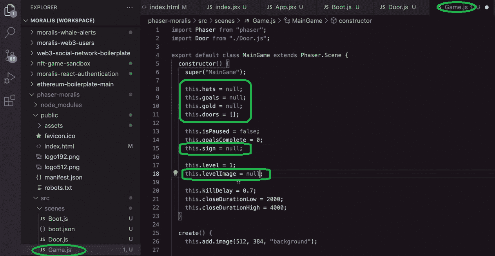

此外，我们需要更改“Preloader.js”和“Boot.js”文件中的一些文件路径。在前者中，我们将“this.load.setPath”中的“assets/game/bank-panic/”值更改为“assets/bank-panic/”。而且在“Boot.js”内部，我们把“assets/game/bank-panic/loading . png”改为“assets/bank-panic/loading.png”。

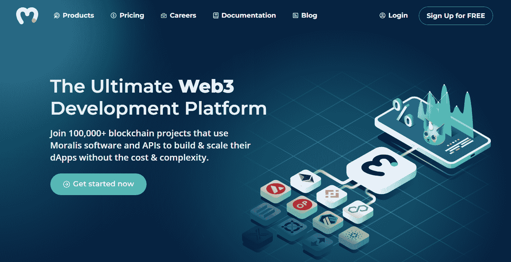

## 从 2D 的 Web2 游戏到 2D 的 Web3 游戏

应用上面所有的调整，我们有一个可用的功能 2D 游戏。然而，它目前与 Web3 无关。幸运的是，我们可以使用 Moralis 无缝地包含所有类型的 Web3 特性。但是，对于这个示例项目，我们将重点关注添加 Web3 身份验证。

我们首先用 VSC 终端中的“npm i react-moralis”命令导入 React Moralis。然后，我们重新访问“index.jsx”文件，在这里我们用' *import { MoralisProvider }从“react-moralis”导入“react-moralis”；*行。接下来，我们添加一个标准的“应用”功能(下面 12:05 的视频)。后者作为标准登录到我们的 Moralis 服务器。为了实现这一目标，我们还创建了一个新的”。env "文件(12:52)，我们在其中添加了我们的 Moralis 服务器的详细信息:


下一个任务是获取我们的 Moralis 服务器的详细信息。如果你不熟悉 Moralis 规范，以下是获取细节的步骤(13:15):

*   [登录](https://admin.moralis.io/login)您的 Moralis 账户或创建您的免费 Moralis 账户。
*   [创建一个 Moralis 服务器](https://docs.moralis.io/moralis-server/getting-started/create-a-moralis-server)。
*   访问服务器的详细信息并复制它们。
*   将服务器的详细信息(服务器 URL 和应用程序 ID)粘贴到。env "文件。

接下来，我们对“index.jsx”文件(14:10)做了一些小的调整。然后，我们在“app . jsx”(14:36)中加入 React-Moralis 函数，赋予了我们 Moralis 的 SDK 的力量。因此，我们很容易用元掩码涵盖身份验证。最后，我们包括 Redux，用于将事件从我们的 2D Web3 游戏发送到我们的 React 钩子，反之亦然(15:13)。

*注意:请务必观看下面的视频，并仔细观察以确保所有步骤正确无误。*

https://www.youtube.com/watch?v=Z4dWavvyhbA

## 如何构建 2D Web3 游戏——总结

此时，你应该已经有了自己的 2D Web3 游戏，运行正常。使用相位器，元面具和 Moralis，你可以在不到 30 分钟内做到这一点。在这个过程中，您已经学习了如何使用 Phaser 的示例游戏。此外，您还学习了如何完成初始的 Moralis 设置，然后使用它来包含 Web3 功能。因此，你现在可以使用这些技能来创建你自己的 2D Web3 游戏。然而，你可能还没有足够的信心开始自己的项目。因此，承担其他示例项目可能是你的正确方向。另一方面，您可能希望探索其他区块链发展主题。

幸运的是，在[Moralis 博客](https://moralis.io/blog/)和[Moralis YouTube 频道](https://www.youtube.com/c/MoralisWeb3)的帮助下，你可以报道这两条途径中的任何一条。这两个渠道都提供了大量有价值的内容，可以作为你的免费持续加密教育。那里的一些最新话题包括创建一个 [GameFi](https://moralis.io/gamefi-tutorial-how-to-create-a-gamefi-game/) 游戏，如何[在 2022 年进入 Web3](https://moralis.io/how-to-get-into-web3-in-2022/) ，[open sea 如何在没有汽油费的情况下交易 NFTs】，](https://moralis.io/how-opensea-trades-nfts-without-gas-fees/) [Web3 Firebase 认证](https://moralis.io/web3-firebase-authentication-create-a-web3-sign-in-with-moralis/)，[与 Unity 的区块链游戏交易](https://moralis.io/how-to-do-blockchain-game-transactions-with-unity/)，创建一个 [Web3 音乐平台](https://moralis.io/web3-music-platform-create-a-web3-music-streaming-service/)等等。

然而，为了尽早成为 Web3 开发人员，你可能需要采取更专业的方法。所以，如果你渴望在 2022 年成为全职加密员，你应该考虑报名参加[Moralis 学院](https://academy.moralis.io/)。在那里，你将接触到许多顶级的[课程](https://academy.moralis.io/all-courses)，并获得个性化的学习路径。此外，你将成为一个最先进的社区的一员。尽管如此，你也将得到专家的指导，这将引导你的区块链以最佳方式发展。

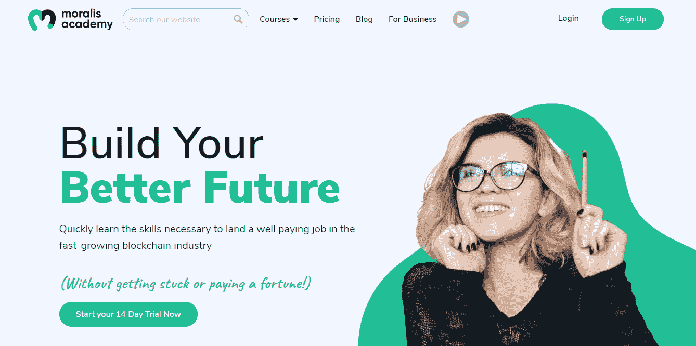