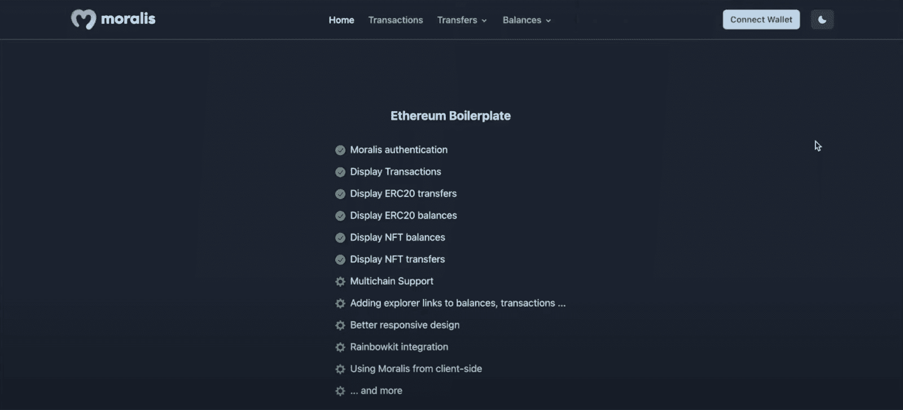
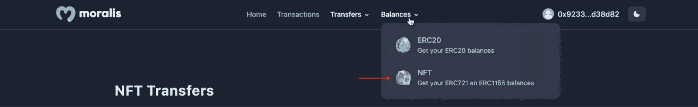
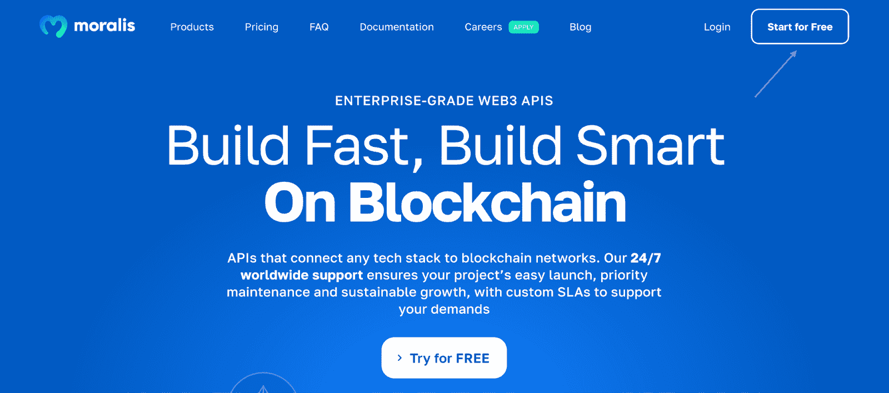
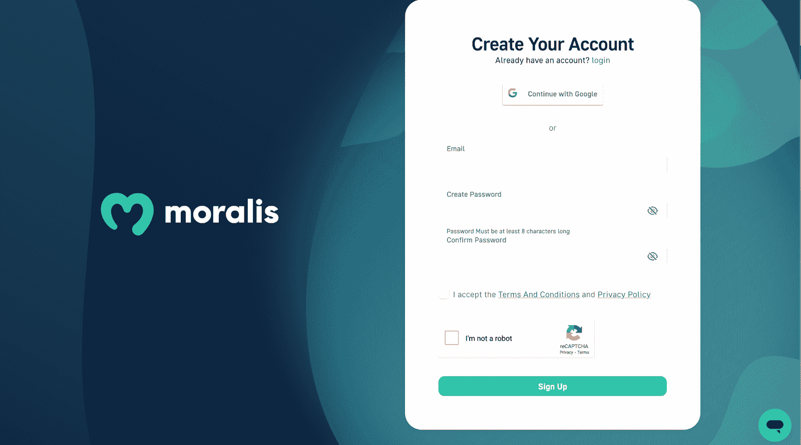

# 如何用 5 个步骤构建 Cronos Dapp

> 原文：<https://moralis.io/how-to-build-a-cronos-dapp-in-5-steps/>

本文展示了 Moralis 如何为那些对在 Cronos 上构建 dapp 感兴趣的人简化开发。此外，当利用 Moralis 作为您的[企业级 API 和 SDK 提供者](https://moralis.io/)时，您可以通过五个步骤构建一个 Cronos dapp。因此，如果您对此感兴趣，请跟随我们创建一个去中心化的 Cronos 应用程序。

**完整的样板文档—**[**https://github . com/以太坊-样板/以太坊-样板**](https://github.com/ethereum-boilerplate/ethereum-boilerplate)

如果您不想在本教程的整个过程中跟随，您可以使用上面的链接访问完整的代码。否则，请随意加入，因为我们将更详细地介绍每一步。这个过程的可访问性源于 Moralis 的工具，比如 [Auth API](https://docs.moralis.io/reference/auth-api-overview) ，以太坊样板代码等等。因此，多亏了 Moralis，您将能够在仅仅五个简单的步骤中构建 Cronos dapp！

然而，您可能会问自己，“我如何使用以太坊样板来构建 Cronos dapp？”。嗯，这是可能的，感谢 Moralis 的跨链能力。您可以选择使用任何 EVM 兼容链的模板。这表明 Moralis 的以太坊样板是构建任何类型的 web 3 应用程序的最快方式！

那么，你是否正在寻找建立一个 Cronos dapp 或任何其他网络的项目？如果是这样的话，马上和 Moralis 签约吧！创建一个帐户只需要几秒钟，而且是免费的！

## 什么是 Cronos Dapp？

回答“什么是 Cronos dapp？”问题，我们必须更深入地研究 Cronos 网络，探索分散应用程序的复杂性。因此，我们将从简要解释 Cronos 需要的一些基础知识开始这一部分。


Cronos 网络于 2021 年启动，此后一直与 Crypto.org 区块链并行运行。上述链条与 Crypto.com 密切相关，因为区块链为其“支付”功能提供动力。此外，Crypto.com 自 2016 年以来一直存在，是克罗诺斯和 Crypto.org·区块链背后的组织。此外，Cronos 区块链与 EVM 兼容，并支持基于 Cosmos SDK 的区块链内部通信网络。这表明克罗诺斯与以太坊和基于宇宙的生态系统兼容。此外，这种互操作性使得移植以太坊 dapps 和智能合约变得容易。

因此，在简要了解 Cronos 之后，我们将继续进一步解释 dapps。Dapps 或“分散应用程序”与传统的 Web2 应用程序相对相似。然而，Web2 和 Web3 应用程序的主要区别在于，Web3 应用程序是建立在区块链网络上的。因此，这意味着 dapps 配备了区块链技术和能力。

区块链技术使 dapps 在许多方面优于传统应用。然而，一个突出和普遍的特点是权力下放。dapps 的分散特性消除了 Web2 空间中普遍存在的单点故障。因此，由于安全性显著提高，攻击 dapps 变得更加困难。

因此，现在您对 Cronos 网络和 dapp 有了更好的理解，回答这个问题就变得容易了，“什么是 Cronos dapp？”。简而言之，Cronos dapp 基本上是一个建立在 Cronos 区块链上的应用程序！

## 用 5 个步骤构建 Cronos Dapp

随着对 Cronos dapps 有了更深刻的理解，我们将继续向您展示如何构建一个。由于 Moralis 和以太坊样板的可访问性，您将能够通过五个简单的步骤来完成这一点:

1.  **探索兼容 EVM 的样板文件**
2.  **创建一个 Moralis 账户**
3.  **克隆样板文件**
4.  **配置环境变量**
5.  **启动 Cronos Dapp**

您将要构建的 Cronos dapp 将允许用户使用他们的 MetaMask 钱包登录。一旦通过身份验证，用户将能够查看与其帐户相关的信息。例如，他们可以查看交易历史，交易历史将显示在表格中。然而，我们将在本教程的第一步中更深入地研究 dapp 是如何工作的，在第一步中，我们将探索以太坊样板文件。

此外，如果你是一个视频学习者，你也可以看看下面这个来自 YouTube 频道的视频:

https://www.youtube.com/watch?v=Bb5Pc–kyAY

在上面的视频中，Moralis 的一名开发人员展示了以太坊样板文件的工作原理，以及完整的设置教程。相应地，您也可以观看此视频，了解如何构建 Cronos dapp。否则，在本文的下一节，我们将更深入地研究 EVM 兼容的样板文件。

### 步骤 1:探索 EVM 兼容的样板文件

这一部分将涵盖 Moralis 以太坊样板的细节，向您展示我们正在努力的方向。首先，当您启动将要构建的 Cronos dapp 时，它会将您带到以下登录页面:



在那里，您会注意到页面顶部有一个导航菜单。该菜单包含大量选项，如“主页”、“交易”、“转账”等。这些不同的选项卡将显示有关您的 Web3 钱包的信息。但是，在您使用右上角的“连接钱包”按钮进行身份验证之前，这些标签不会填充有[链上数据](https://moralis.io/on-chain-data-the-ultimate-guide-to-understanding-and-accessing-on-chain-data/):


一旦你点击这个按钮，它会立即提示你的元掩码钱包，并允许你签署一个消息。一旦你通过了身份验证，各种标签就会显示你的钱包信息。此外，MetaMask 只是 Moralis 的默认选项，您可以轻松实现附加的 [Web3 认证](https://moralis.io/authentication/)机制。如果你想了解更多关于认证的知识，你可以，比如，阅读我们关于如何[用魔法添加登录的文章。链接](https://moralis.io/add-sign-in-with-magic-link-to-your-nextjs-project-in-5-steps/)。

然而，如果你点击“交易”标签，它会在一个简洁的表格中显示你的交易历史:


此外，“转账”和“余额”选项卡都有一个下拉菜单。因此，如果您单击这些选项中的任何一个，您将能够从“ERC-20”令牌和“NFTs”中进行选择:



因此，例如，如果您点击“余额”，然后点击“NFTs”，它将显示您钱包的 NFTs:


最后，以太坊样板还具有黑暗和光明模式。因此，您可以通过最右侧的按钮在这些模式之间切换:


### 步骤 2:创建一个 Moralis 账户

现在，您对样板文件和您的工作目标有了更多的了解，我们可以进入本文的第二步。此外，这一节将告诉你如何获得自己的 Moralis 帐户。

因此，如果您还没有，您必须点击 Moralis 网站右上角的“免费开始”按钮:



在那里，你需要输入一个电子邮件地址，创建一个新密码，点击“我接受…”框，然后点击“注册”:



就是这样！创建一个 Moralis 账户很容易，只需要几秒钟。更何况是完全免费的！

一旦您登录到您的帐户，您将到达 Moralis 管理面板。这将为您提供几个选项，如“主页”、“Web3 APIs”等。然而，我们将在第四步中进一步探讨这些，在第四步中，您需要配置一些变量。


### 步骤 3:复制样板文件

对于 Moralis 帐户，下一步是将以太坊样板文件克隆到您的本地目录。因此，您需要访问 GitHub 链接，您可以在简介中找到它。从那里，你需要点击右边的绿色“代码”按钮。接下来，您可以继续复制回购 URL:


一旦有了 URL，就可以继续打开您最喜欢的 IDE(集成开发环境)。我们将使用 VSC (Visual Studio 代码)；但是，您可以自由使用任何您喜欢的 IDE。请注意，如果您不使用 VSC，这个过程可能会略有不同。

打开环境后，您需要创建一个新文件夹。我们将称我们的为“样板”。有了这个新文件夹，您可以通过打开一个新的终端来继续。如果您像我们一样使用 VSC，您可以点击顶部的“终端”选项卡，然后点击“新终端”:


现在，剩下的就是使用您之前获得的 URL 在终端中输入以下命令:

```js
git clone “BOILERPLATE_URL”
```

但是，在运行该命令之前，您需要确保您位于计算机的正确位置，这应该是您刚刚设置的文件夹。运行上面的命令后，您可以通过以下输入再次导航到正确的文件夹:

```js
cd ethereum-boilerplate
```

如果您遵循了本文前面的步骤，您的本地目录现在应该具有以下结构:


### 步骤 4:配置环境变量

接下来，您需要配置一些环境变量。因此，要继续，您需要在 IDE 中导航到“. env.local.example”文件:


该文件包含五个环境变量，目前我们需要重点关注“ *APP_CHAIN_ID* ”、“ *MORALIS_API_KEY* ”和“ *NEXTAUTH_SECRET* ”。所以，让我们从配置前者开始。

现在，“ *APP_CHAIN_ID* ”初始设置为“ *0x1* ”，是对以太坊链 ID 的引用。然而，因为您想要构建一个 Cronos dapp，所以您必须相应地更改这个变量。因此，您可以将“ *0x1* ”替换为“ *0x152* ”，这与 Cronos testnet 相对应。

接下来，您需要将您的 API 密钥添加到变量" *MORALIS_API_KEY* "中。要获取您的密钥，请导航到 Moralis 管理面板。在那里，单击“帐户”、“密钥”，并复制“Web3 API 密钥”:


最后，您必须向变量“ *NEXTAUTH_SECRET* 添加另一个密钥。此外，为了方便起见，可以使用下面的链接来生成一个值:【https://generate-secret.now.sh/32】。

进一步检查“ *NEXTAUTH_URL* ”也是值得的。该变量当前设置为“ [http://localhost:3000](http://localhost:3000/) ”。您可以保留这个值，因为它允许您在本地测试您的 Cronos dapp。然而，一旦您启动 dapp，这个值必须适合您的 dapp 的 URL。

您还必须通过删除“”将文件名更改为“. env.local”。例”放在最后。总而言之，文件的最终版本应该如下所示:

```js
APP_CHAIN_ID=0x152
APP_DOMAIN=ethereum.boilerplate 
MORALIS_API_KEY= "YOUR_API_KEY"
NEXTAUTH_SECRET= b8e786967d7bcbc0f920d35bcc3f891c
NEXTAUTH_URL=http://localhost:3000
```

### 步骤 5:启动 Cronos Dapp

指南的最后一步将说明如何启动 Cronos dapp。但是，您必须在此之前安装特定的依赖项。因此，您可以再次打开终端并输入以下命令之一(取决于您使用的是" *npm"* 还是" *yarn"* ):

```js
npm i
yarn
```

一旦安装了依赖项，就可以使用以下输入之一启动 dapp:

```js
npm run dev
yarn run dev
```

运行其中一个命令将在 *localhost 3000* 上启动 dapp，这是您在前面的步骤中指定的。因此，您现在应该能够使用以下 URL 启动您的 Cronos dapp 了:“ [http://localhost:3000](http://localhost:3000/) ”。

现在，这是本教程！现在，您有望知道如何通过五个步骤构建 Cronos dapp。但是，如果您在本文的任何地方遇到了麻烦，我们建议您仔细看看上面嵌入的视频。此外，你还可以查看官方的 EVM API 文档。

如果你觉得这篇文章很有趣，并且想为其他类似的网络开发 dapps，一定要进一步浏览 Moralis 的 Web3 博客。例如，只需三个步骤，你就可以轻松学会如何[构建多边形 dapp](https://moralis.io/how-to-build-a-polygon-dapp-in-3-steps/) ！

## 如何构建 Cronos Dapp–总结

创建 dapps 并不一定很难，尤其是在和 Moralis 一起工作的时候。事实上，多亏了 Moralis 和以太坊样板，您只需五个步骤就能构建 Cronos dapp:

1.  **探索兼容 EVM 的样板文件**
2.  **创建一个 Moralis 账户**
3.  **克隆样板文件**
4.  **配置环境变量**
5.  **启动 Cronos Dapp**

结合以太坊样板，Moralis 的 API 是有助于该过程的可访问性的另一个重要部分。我们已经提到了 EVM API；然而，这只是许多接口中的一个例子。你可以另外查看 [NFT API](https://moralis.io/nft-api/) 和[索拉纳 API](https://docs.moralis.io/reference/solana-api) 。这些允许你创建 NFT 相关的项目和索拉纳 dapps 很容易。

此外，如果你觉得这篇文章很有趣，可以看看 Moralis 的其他文章。例如，学习如何[建造一个索拉纳 NFT 探索者](https://moralis.io/how-to-build-a-solana-nft-explorer/)或者所有关于 [EIP-4361](https://moralis.io/exploring-eip-4361-sign-in-with-ethereum/) 标准的知识！

所以，如果你努力成为一名 Web3 开发者或者只是想开发一个 Cronos dapp，你应该[注册 Moralis](https://admin.moralis.io/register) 。建立一个帐户是免费的，你可以马上开始你的 Web3 开发之旅！