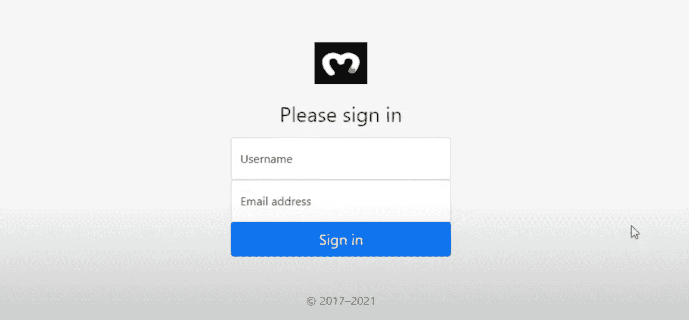
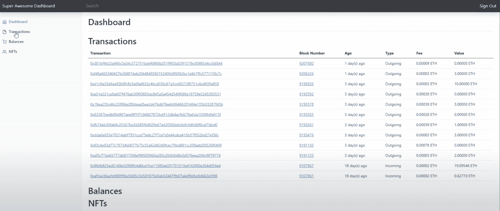
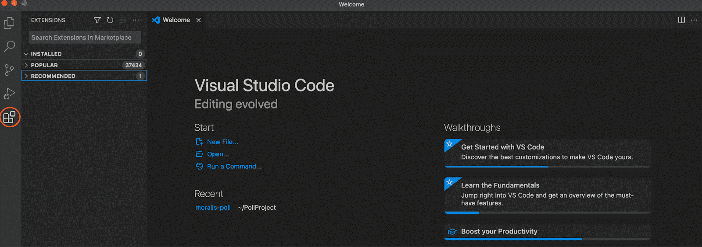
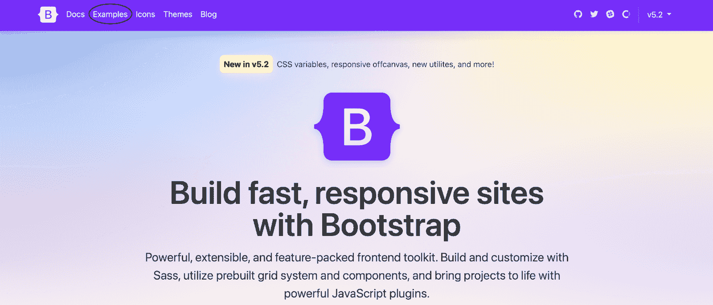
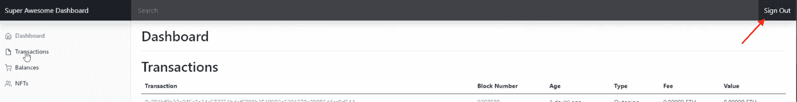
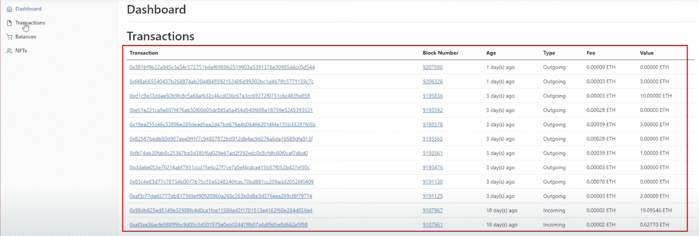

# 如何构建 Cronos Dapp

> 原文：<https://moralis.io/how-to-build-a-cronos-dapp/>

如果你一直在寻找一个能与以太坊和宇宙互操作的链条，你可能听说过 Cronos。结合 Moralis 最近宣布的 Moralis Cronos Web3 游戏元宇宙黑客马拉松和 Moralis 推出的 [**Cronos 支持**](https://medium.com/cronos-chain/announcing-moralis-cronos-integration-and-web3-metaverse-hackathon-339ad3fe1ea3) **，这意味着开始 Cronos 开发从未如此容易。因此，我们将通过这篇文章深入探究 Cronos 区块链的复杂性，以及如何使用**[**Moralis**](https://moralis.io/)**轻松构建 Cronos dapp！**

***请务必*** [***报名参加 Moralis Cronos Gaming 元宇宙黑客马拉松***](https://moralis.io/cronos-hackathon/) ***现在就有机会从黑客马拉松的总奖金池中赢得 100，000 美元！黑客马拉松的报名截止日期是 8 月 15 日！*T13】**

传统上来说，区块链开发的最大障碍是 Web3 后端开发。另一方面，Web3 前端开发更类似于传统的 Web2 实践。因此，那些开发 Web3 项目的人更喜欢专注于打造一个优秀的前端，而把后端的复杂工作留给其他人。这就是 Moralis 的用武之地。

Moralis 是 Web3 开发的领先平台之一。所有 Moralis 用户都可以访问 Moralis 强大的后端基础设施，这意味着开发者不必担心他们的后端。Moralis 为 Web3 开发的各个方面提供了更加无缝的开发体验。一个例子是 Moralis 的 [web3uikit](https://moralis.io/web3ui-kit-the-ultimate-web3-user-interface-kit/) ，它使得用户界面(UI)开发更加容易。因此，有了 Moralis，你将能够[轻松地为你未来的所有项目创建一个伟大的 dapp UI](https://moralis.io/web3-ui-how-to-create-a-great-dapp-ui/) ！

所以，如果你想建立一个 Cronos dapp，请确保现在就免费注册 Moralis！我们将在本指南中使用 Moralis。现在，事不宜迟，让我们仔细看看在 Cronos 上构建 dapps 需要什么！

## 克罗诺斯是什么？

Cronos 网络于 2021 年推出，从一开始，它就一直与支持 Crypto.com“支付”功能的 Crypto.com 区块链并行运行。此外，Crypto.com 自 2016 年 6 月以来一直存在，是上述两个链条背后的组织。


Cronos 是一个兼容 EVM 的区块链，支持基于宇宙 SDK 的 IBC 或“区块链间通信”网络。这意味着克罗诺斯兼容宇宙生态系统和以太坊。因此，它允许方便地移植[以太坊](https://moralis.io/full-guide-what-is-ethereum/) dapps 和[智能合约](https://moralis.io/smart-contracts-explained-what-are-smart-contracts/)。

Cronos 由“以太币”推动，这是快速轻松地从以太坊和其他 EVM 兼容链移植 dapps 和智能合约的机会之源。该链从一开始就在《IBC 议定书》的支持下构建，有助于其互操作性和与其他支持 IBC 的区块链的有效桥接。此外，Cronos 网络的基本结算货币是“CRO”，这是 Crypto.org 链的本地令牌。此外，Crypto.org 和整个克罗诺斯生态系统都离不开 CRO。

Cronos 利用了一种利害关系证明(PoS)共识机制。这意味着网络验证者在交易被验证时，会投入一部分资产来诱导良好的行为。使用 PoS 的主要好处是它比其他选择更具可伸缩性。现在，以以太坊为例。以太坊应用工作证明(PoW)机制而不是 PoS，这在一定程度上是网络拥塞问题的根源，导致高昂的[以太坊燃气费](https://moralis.io/ethereum-gas-fees-the-ultimate-2022-guide/)。

因此，现在我们已经对 Cronos 有了一个大致的了解，我们可以转到本文的中心部分，展示如何使用 Moralis 轻松构建 Cronos dapp！

## 如何用 Moralis 的三个步骤构建 Cronos Dapp

在本教程的剩余部分，我们将分配时间向您展示如何构建 Cronos dapp。为了说明这个过程有多简单，我们将创建一个简单的 dapp，用户可以通过 MetaMask 进行身份验证并登录。一旦登录，用户可以在他们的 [Web3 钱包](https://moralis.io/what-is-a-web3-wallet-web3-wallets-explained/)中查看他们的交易历史和可用资产。下面，您将看到两张最终 dapp 的截图，展示了我们的努力方向:

**登录组件:**



**仪表板**:



简而言之，我们将向您展示如何使用以下三个简单的步骤来构建 Cronos dapp:

1.  设置您的开发环境
2.  构建登录组件
3.  创建仪表板

然后，我们将剖析每一个步骤，仔细看看如何构建 Cronos dapp。如果你想看一段视频来更详细地解释这个过程，请观看下面来自 [Moralis YouTube](https://www.youtube.com/channel/UCgWS9Q3P5AxCWyQLT2kQhBw) 频道的剪辑。本教程所基于的视频展示了如何在以太坊上构建 dapp 然而，对于 Cronos 网络来说，这一过程本质上是相同的——只需要进行一些调整，使其适合这个生态系统。

https://www.youtube.com/watch?v=jdx2H1alijQ

## 步骤 1:如何构建 Cronos Dapp——设置您的开发环境

对于这个关于如何构建 Cronos dapp 的教程，我们将使用来自(集成开发环境)VSC 的 IDE(Visual Studio 代码)。因此，如果您还没有，那么在继续下一步之前，您需要下载 Visual Studio 代码。或者，您也可以选择使用您可能更熟悉的另一个 IDE，但这完全取决于您。

有了 IDE，我们将添加一些您可以安装的扩展，以提供更加无缝的开发体验。为此，您可以单击 VSC 界面最左侧的扩展选项卡。在那里，我们建议您安装以下三个扩展:

1.  实时服务器
2.  ES7 反应
3.  固态



一旦你安装了扩展，你应该额外下载 [node.js](https://moralis.io/node-js-explained-what-is-node-js/) ，因为这是安装一些 npm 包所必需的。尽管如此，如果你想进一步了解如何开始，你可以在视频的 [2:17](https://youtu.be/jdx2H1alijQ?t=137) 时间戳找到完整的 VSC 设置过程。

不过，这就是关于 IDE 设置过程的初始准备。现在，让我们来探索为您的 dapp 获得一个 Moralis 服务器的复杂性！

### 创建 Moralis 服务器

如果你还没有，你将需要创建一个 Moralis 帐户，因为这将允许你立即建立一个服务器。一旦你有了自己的账户，你可以导航到 Moralis 管理面板，点击界面左侧的“创建新的 Dapp”按钮。


一旦你点击这个按钮，页面将提示你选择一个开发环境。这个选择应该取决于您的需求和您计划在哪里推出 dapp。然而，由于这只是一个教程，我们建议选择“测试网”或“本地开发链”的替代品。一旦你计划在一切正常的情况下启动 dapp，你应该选择一个 mainnet 服务器，并选择 Cronos 网络作为你的选择之一。最后，剩下的就是选择一个地区，命名你的服务器，然后点击“创建你的 Dapp”。

有了服务器，我们可以继续深入了解如何创建 dapp 的登录和仪表板组件！

## 步骤 2:如何构建 Cronos Dapp——构建登录组件

在接下来的两节中，我们将把时间分配到实现登录和仪表板组件上。我们将使用 Bootstrap 中的模板作为基础，并做一些调整。为清楚起见，我们将这一部分分为两个部分，每个组件一个部分。但是，我们可以从 Bootstrap 网页下载这两个模板开始。

一旦你导航到“[getbootstrap.com](http://getbootstrap.com/)”，你会在网站顶部找到“示例”标签。在那里，您可以找到“登录”和“仪表板”组件，并下载这两个组件。有了这些模板，我们可以从前者开始，将它们逐个分解。



### 登录组件

一旦登录组件被添加到我们的本地目录，我们需要做一些调整，因为这些模板的基本状态并不完美。因此，从 HTML 代码中删除不必要的元素可能是一个好主意，或者添加您认为缺少的任何内容。此外，您可能希望使用 CSS 样式化这些 HTML 元素，使它们看起来更加美观。

在我们的例子中，登录组件的 HTML 文件将被称为“index.html”。这是您需要添加或删除 HTML 元素的地方，以确保登录组件符合您的需要。然而，由于这取决于您的偏好，我们不会深入这个过程。相反，我们将更仔细地看一下用于向登录界面的字段和按钮添加功能的一些基本组件。如果你想了解更多关于添加/删除 HTML 元素和界面样式的信息，你可以跳转到视频中的 [27:18](https://youtu.be/jdx2H1alijQ?t=1638) 时间戳，查看登录组件的完整分类。

一旦您对登录界面的外观感到满意，您会很快注意到字段和按钮实际上并没有做任何事情。出于这个原因，我们需要添加一些 JavaScript 逻辑来使元素具有交互性。因此，我们将创建一个名为“main.js”的 JavaScript 文件。

此外，一个额外的基本步骤是安装 [Moralis SDK](https://moralis.io/exploring-moralis-sdk-the-ultimate-web3-sdk/) 并初始化 Moralis。要安装 SDK，您只需将以下内容输入到“index.html”文件中:

```js
<script src="https://cdn.jsdelivr.net/npm/[email protected]/dist/web3.min.js"></script>
<script src=”https://unpkg.com/moralis/dist/moralis.js"></script>
```

要初始化 Moralis，只需在“main.js”文件中输入以下内容，并添加您的服务器 URL 和应用程序 ID:

```js
const serverUrl = "https://xxxxx.yourserver.com:2053/server";
const appId = "YOUR_APP_ID";
```

### **登录()**

在“main.js”文件中，我们需要创建一个函数来处理认证用户的逻辑。为了使这个过程更容易，我们将使用 Moralis，允许我们只使用几行代码通过 MetaMask 进行认证。因此，该函数可能是这样的:

```js
login = async () => {
    Moralis.authenticate().then(async function (user) {
        console.log(user.get(’logged in’))
        user.set(”name”, document.getElementById(’user-username’).value)
        user.set(”email”, document.getElementById(’user-email’).value)
        await user.save();
        window.location.href = ”dashboard.html”; 
    })
}
```

一旦用户点击我们 dapp 用户界面的“登录”按钮，这个功能就会触发，允许用户验证自己。当他们进行身份验证时，它会保存有关他们用来签署消息的钱包地址的信息，以及他们的姓名和电子邮件。最后，该函数将用户重定向到仪表板页面。

## 步骤 3:如何构建 Cronos Dapp–仪表板

我们 dapp 的第二个组件是仪表板，用户可以在其中看到他们的交易历史和所有可用的资产。为此，我们将引导仪表板组件的“索引”文件的名称更改为“dashboard.html”。

同样，这个模板的基本状态并不美观。因此，我们必须遵循与登录组件相同的“整理”过程。然而，由于这应该取决于您的特定 dapp 和您的偏好，我们不会深入这个过程。相反，如果你需要进一步的帮助或者只是想要一些灵感，你可以在视频的 [51:06](https://youtu.be/jdx2H1alijQ?t=3066) 时间戳找到完整的过程。

一旦您对仪表板的外观感到满意，并且包含了您想要向用户显示的所有元素，我们就可以向“main.js”文件添加一些额外的逻辑。正如你在我们 dapp 仪表板的初始截图中看到的，我们在界面的右上角有一个注销按钮。因此，我们将密切关注“logout()”函数。



### **注销()**

```js
logout = async () => {
    Moralis.User.logOut();
    window.location.href = ”index.html”;
}
```

以上是一个非常简单的函数，目的明确，我们很容易理解。该函数所做的只是注销并将用户重定向到登录组件。接下来，我们有“getTranascations()”函数，它将获取特定 Web3 钱包的交易历史。

### **gettetransaction()**

要获取关于用户交易历史的信息，我们只需几行代码就可以使用 Moralis 的 Web3 API。这是获取用户交易历史的函数的初始部分:

```js
getTransactions = async () => {
  console.log(’get transactions clicked’);
  const options = {chain: "rinkeby", address: ”0x3d6…” };
  const transactions = await Moralis.Web3API.account.getTransactions(options);
  console.log(transactions);
}
```

由于我们使用的是 [Moralis API](https://docs.moralis.io/moralis-dapp/web3-api) ，获取用户的交易历史变得非常容易。现在,“getTransactions()”函数所要做的就是使用获取的信息并将其显示给用户。然而，要获得更多关于如何做的信息，请仔细查看 [1:14:23](https://youtu.be/jdx2H1alijQ?t=4463) 时间戳。从这里，您可以看到来自函数的数据是如何输入到 dapp 中并显示在表格中的。



### **getBalances()**

下面的函数“getBalances()”用于获取关于用户余额的数据。同样，由于我们使用的是 Moralis，我们可以轻松地获取余额，并且只需要几行代码:

```js
getBalances = async () => {
  console.log(’Get balances clicked’);
  const ethBalance = await Moralis.Web3API.account.getNativeBalance();
  const ropstenBalance = await Moralis.Web3API.account.getNativeBalance({ chain: ”ropsten"});
  const rinkebyBalance = await Moralis.Web3API.account.getNativeBalance({ chain: rinkeby"});
}
```

从上面的代码可以看出，这个函数将获取以太坊、Ropsten 和 Rinkeby 令牌的余额。但是，您可以添加其他网络或删除您不感兴趣的网络。有了这些信息，剩下的工作就是使用类似于“getTransactions()”函数的过程将数据提供给 dapp。您也可以观看从 [1:55:06](https://youtu.be/jdx2H1alijQ?t=6906) 开始的视频，了解有关该过程的更详细描述。

### **getNFTs()**

我们要仔细研究的最后一个函数是“getNFTs()”。有了 Moralis 的 [NFT API](https://moralis.io/nft-api/) ，我们只用一行代码就可以获取用户的 NFT 余额。因此，函数的第一部分可能是这样的:

```js
getNFTs = async () => {
  console.log(’get nfts clicked);
  let nfts = await Moralis.Web3API.account.getNFTs({ chain: ’rinkeby’ });
  console.log(nfts); 
}
```

这个简单的函数将获取当前用户的所有[NFT](https://moralis.io/non-fungible-tokens-explained-what-are-nfts/)。接下来要做的就是遍历每个令牌并获取元数据。不过，你可以看看视频，看看这是如何从 [2:04:53](https://youtu.be/jdx2H1alijQ?t=7493) 开始的。

这就是本教程的全部内容！然而，即使链接的视频详细描述了在 Rinkeby testnet 上创建以太坊 dapp，当涉及到 Cronos 链时，过程并没有太大的不同。因此，基本原理是相同的，您需要做的只是更改一些参数！

如果您有任何进一步的问题，请查看视频，因为它提供了整个过程的更详细的解释。例如，视频解释了如何设置您的本地区块链，连接目录中的不同文件，等等！

## 如何通过 3 个步骤构建 Cronos Dapp–总结

随着 Moralis 最近对 Cronos 区块链的支持，现在是研究如何构建 Cronos dapp 的最佳时机。此外，由于我们与 Moralis 合作，因此可以通过以下三个步骤来实现:

1.  设置您的开发环境
2.  构建登录组件
3.  创建仪表板

尽管视频教程是关于以太坊开发的，但是用 Moralis 构建 Cronos dapps 的过程仍然相对相似。因此，按照相同的三个步骤，使用相同的过程和基本原理来构建 Cronos dapp 是可能的！


这说明了 Moralis 的力量；然而，这只是与 Moralis 合作潜力的皮毛。如果你想了解更多关于操作系统的知识，请浏览 [Moralis 博客](https://moralis.io/blog/)。在这里，你会发现更多令人兴奋的内容，帮助你成为更好的 Web3 开发者。

例如，你可能对 Moralis 的[元宇宙 SDK](https://moralis.io/metaverse/) 感兴趣，它允许你创建复杂的[元宇宙](https://moralis.io/what-is-the-metaverse-full-guide/)项目。如果是这样，你可以，例如，学习建立一个[元宇宙智能合同](https://moralis.io/metaverse-smart-contract-how-to-build-a-metaverse-game-smart-contract/)，或者甚至[创建你自己的元宇宙](https://moralis.io/how-to-create-your-own-metaverse/)！

所以，如果你想成为一名区块链开发者，现在就和 Moralis 签约，马上开始创建 Web3 项目！更重要的是，创建一个帐户是完全免费的，这使得加入该社区变得轻而易举。此外，不要忘记在 2022 年 8 月 15 日注册截止日期之前参加 Moralis Cronos Gaming 元宇宙黑客马拉松！