# 如何建立一个跨链桥

> 原文：<https://moralis.io/how-to-build-a-cross-chain-bridge/>

有了各种各样的可编程链，开发人员希望将它们与“跨链”项目联系起来就不足为奇了。随着跨链兼容性变得越来越流行，因为它支持连接性和可伸缩性，很明显，未来将完全是关于跨链互操作性的。考虑到这一点，对任何一个****的区块链开发者来说，将这一点实现到他们的** [**Web3 应用**](https://moralis.io/metamask-for-developers-how-to-launch-web3-apps-with-metamask/) **中是至关重要的。不过有的之前已经推出了** [**智能合约**](https://moralis.io/how-to-create-smart-contracts/) **、代币等。，现在希望用户能够在其他区块链上使用这些元素。在这种情况下，学习如何建立一个跨链桥将是非常有益的。在本文中，我们将分解术语“跨链桥”并探讨它的主题，以便您能牢牢掌握它是什么。有了对什么是跨链桥以及它们如何工作的坚实理解，你将成为一名有抱负的跨链专家，并准备好与 Moralis 一起构建一座跨链桥。****

**此外，一些令人印象深刻的“颠覆世界”的技术和工具已经被开发出来，使区块链编程变得更加简单。然而，有一个首要的软件，开发者发现它是终极的 [Web3](https://moralis.io/the-ultimate-guide-to-web3-what-is-web3/) 平台，提供最先进的[web 3 API](https://docs.moralis.io/moralis-server/web3-sdk/intro)—[Moralis](https://moralis.io/)。这个“ [Firebase for crypto](https://moralis.io/firebase-for-crypto-the-best-blockchain-firebase-alternative/) ”从一开始就具有跨链互操作性，这使它成为构建跨链桥梁的合适工具。在接下来的部分中，您将能够预览我们构建的作为指南的跨链桥示例。另外，您将进一步了解智能合约，这是您想要构建跨链桥梁时的核心部分。此外，Moralis 专家将向您展示如何利用 Moralis 的数据库、“同步”功能和云功能。此外，您还将学习如何为跨链桥编写简单的用户界面(UI)。**

**

## 什么是跨链桥？

在我们深入“构建跨链桥”示例项目之前，让我们确保大家都知道什么是跨链桥。毕竟，对它的概念有一个清晰的理解会使开发变得更加简单。那么，什么是跨链桥呢？

只要看看“跨”、“链”和“桥”这些词，你就可以推断出跨链桥与不同区块链之间的某种连接或转移有关。是的，正是如此。本质上，跨链桥(又名区块链桥)是一组正确编写的代码，包括[智能合约](https://moralis.io/smart-contracts-explained-what-are-smart-contracts/)，使用户能够在不同的区块链之间传输令牌(或其他加密资产)、智能合约事件或指令，甚至数据。因此，尽管两个链存在差异(不同的协议、规则、治理模型等。)，跨链桥确保它们安全地互操作。

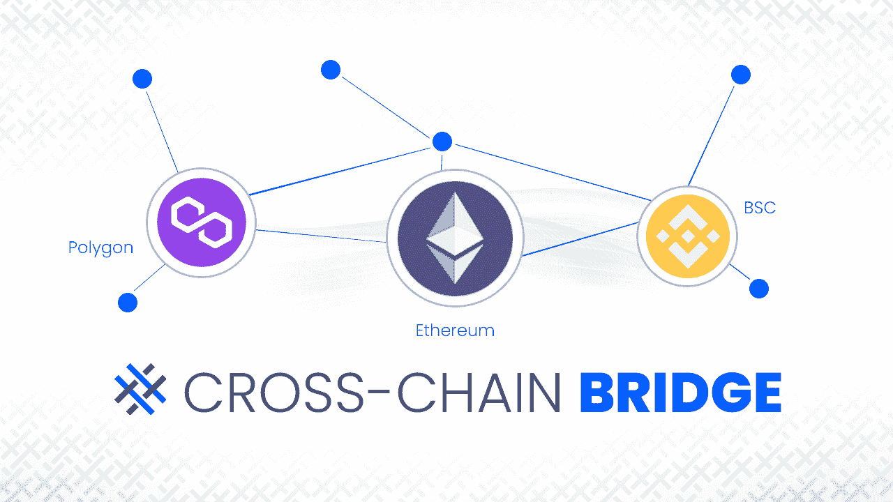

### 交叉链网桥如何工作？

为了确保您清楚地了解跨链桥是如何工作的，我们将使用下图。带有铅笔的纸张图标代表智能合约。此外，我们有四个智能合约，两个有一堆硬币(有水平线的圆柱体)，两个有一座桥。此外，我们还有一个齿轮图标，代表某种过程/工作已经完成，还有一个天线图标，代表一个信号(输入和输出)。

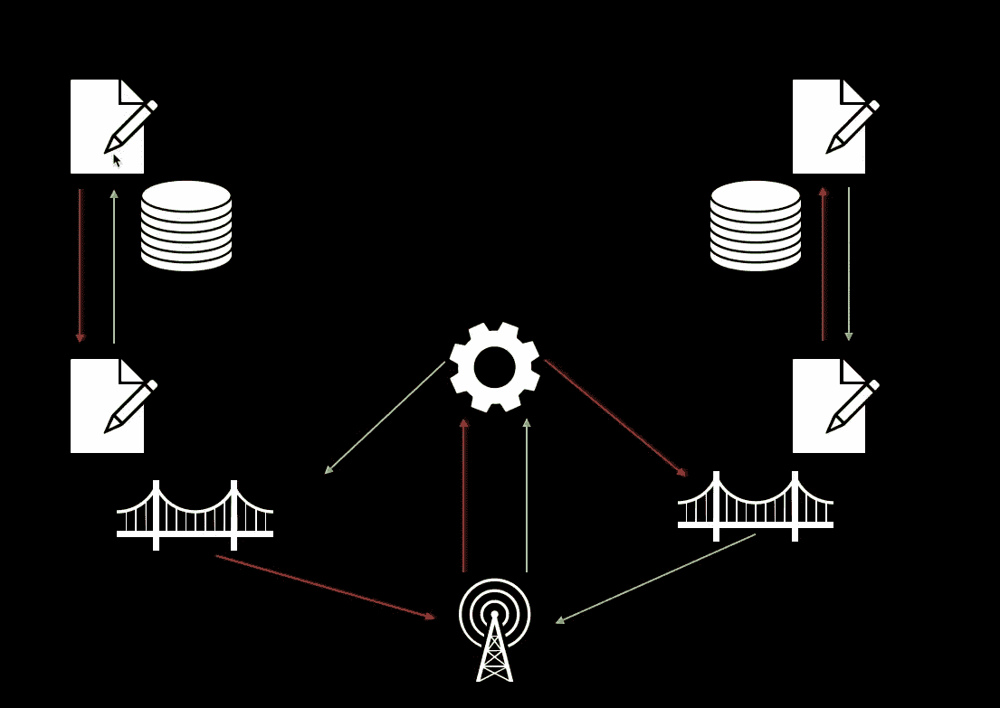

我们在左侧有“主链”(如果您有一个现有的令牌，那么您已经有了这一侧)。此外，在右边，我们有一个“侧链”，在这里我们需要有一个子令牌契约，我们需要在设计特定跨链桥的架构时创建它。接下来，我们在每一端都有一个桥接合同，以确保令牌传输安全完成。此外，红色箭头表示代币从主链转移到侧链，而绿色箭头表示相反的方向。

例如，当用户想要将令牌从主链转移到侧链时，首先使用主链上的桥契约锁定他们。这还会向中继(我们图中的天线)发送信号，然后触发网关(图中的齿轮)使用子令牌契约在侧链上铸造锁定数量的令牌。

当转移从侧链回到主链时，过程正好相反。这意味着侧链上的令牌(使用侧链桥契约)被刻录，而主链上的令牌同时被解锁:

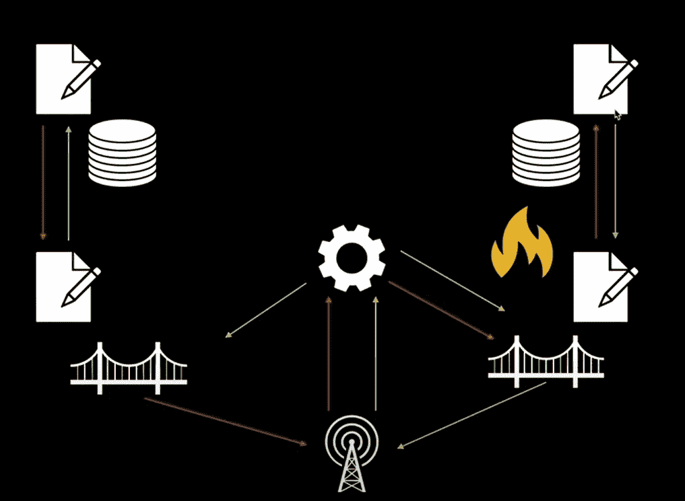

## 如何用 Moralis 建造一座跨链桥梁

既然您现在已经清楚地了解了什么是跨链桥以及它是如何工作的，那么让我们把重点放在我们的示例项目上。正如本文开头提到的，我们将使用 Moralis 使区块链相关的后端编程变得更加容易。多亏了 Moralis，建造一座跨链桥比你想象的要容易得多。通过访问其 [ultimate Web3 SDK](https://moralis.io/exploring-moralis-sdk-the-ultimate-web3-sdk/) ，您可以轻松收听智能合同事件，并在您的 Moralis 数据库中访问所需信息。然而，在我们开始我们的示例项目之前，让我们看一下我们的跨链桥的完成版本。

### 我们的跨链桥预览

当在示例项目中工作时，我们通常关注测试网，这也正是我们在这里要做的。如果你缺乏测试网的经验，可以看看我们的 [*以太坊测试网指南*](https://moralis.io/ethereum-testnet-guide-connect-to-ethereum-testnets/) *。*也就是说，我们的跨链桥将使用户能够在 Rinkeby 和 Mumbai 测试网之间转移资金。此外，我们必须指出，这个项目旨在向您展示使用 Moralis 的可能性和简单性。因此，我们已经创建了一个简单的基本 UI，您可以使用我们的 [GitHub](https://github.com/DanielMoralisSamples/27_ERC20_Bridge_POC) 页面上的代码。然后，就看你和你的 JavaScript 技能是否能更上一层楼了。

#### 从主链向侧链发送令牌

所以，这是我们跨链桥的截图:

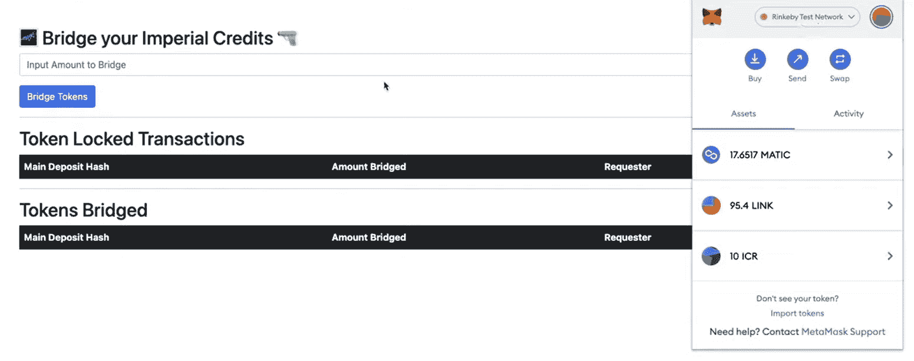

看上面的截图，你也可以看到我们的[元掩码](https://moralis.io/metamask-explained-what-is-metamask/)扩展，我们用它来[认证](https://moralis.io/how-to-authenticate-with-metamask/)用户并确认交易。此外，您可以看到我们的元掩码连接到 Rinkeby testnet，这是我们示例的主链。此外，您还可以看到我们有十个 ICR(帝国信用)代币(使用 [ERC-20 代币标准](https://moralis.io/erc20-exploring-the-erc-20-token-standard/))，这些代币是我们为了向您展示如何建造跨链桥而创建的示例代币。

如果用户想要过渡他们的 ICR 代币，他们需要点击输入字段，输入金额，然后点击“过渡代币”按钮。接下来，他们需要使用元掩码来确认交易:

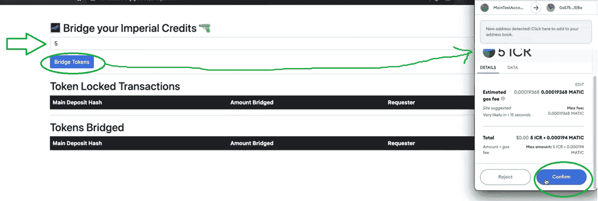

传输正确完成后，我们的用户界面会向用户提供一条确认消息:

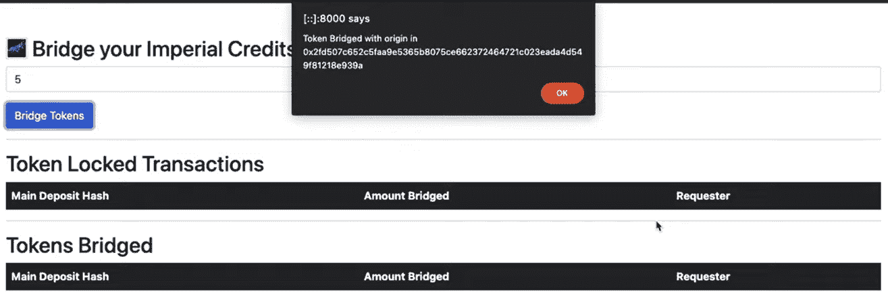

此外，如果用户现在刷新他们的浏览器页面，他们的仪表板将反映他们的传输:

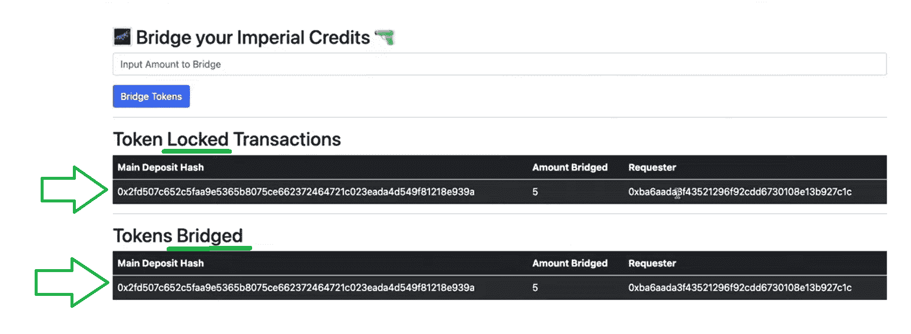

#### 从侧链向主链发送令牌

此外，用户现在可以将他们的令牌从侧链(在我们的例子中是 Mumbai testnet)桥回到主链。为此，他们需要将其元掩码网络切换到侧链，并重复上述步骤:

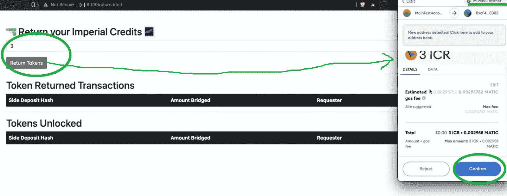

用户再次收到确认成功传输的消息:

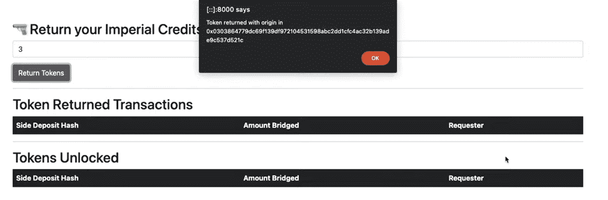

刷新页面后，仪表盘会显示我们从侧链转移回主链的情况:

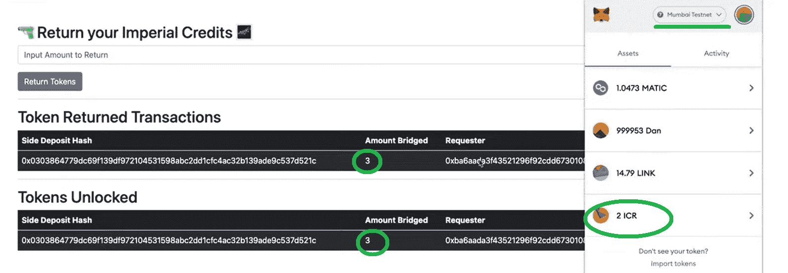

此外，我们现在可以看到三个 ICR 令牌已被解锁。这意味着对于该特定地址，我们现在在主链上有八个 ICR 令牌，在侧链上有两个。

## 用 Moralis 构建跨链桥的示例项目

现在是时候展示如何自己建造一座跨链桥(如上图所示)了。因为我们认为代码遍历更容易在视频中呈现，所以我们将把您交给 Moralis 的一位专家，在本文末尾的视频中向您展示详细信息。但是，在您继续之前，您需要设置您的 Moralis 帐户来自己完成这些步骤，并与 Moralis 建立一个跨链桥。

因此，请务必花一分钟的时间[创建您的免费 Moralis 帐户](https://admin.moralis.io/register),以便访问您的管理面板、仪表板和整个 Moralis SDK。此外，创建您的帐户后，您将能够创建您的 Moralis 服务器，这将打开提到的快捷方式。

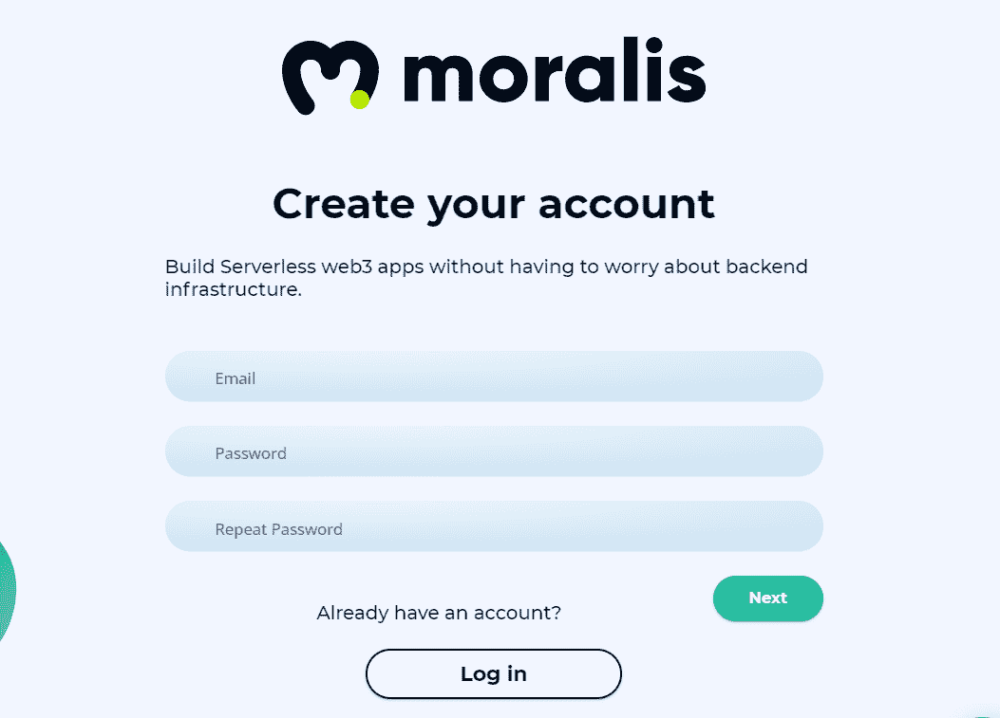

### 创建一个 Moralis 服务器

1.  **登录您的 Moralis 账户**–通过登录您的 Moralis 账户进入您的管理区。如果你还没有这样做，创建一个帐户。

2.  [**创建一个 Moralis 服务器**](https://docs.moralis.io/moralis-server/getting-started/create-a-moralis-server)–一旦进入您的管理区域，选择“服务器”选项卡。然后点击右上角的“+创建新服务器”，选择“Testnet 服务器”(见下图)。*“Testnet 服务器”选项是你在创建和从事新项目时应该关注的；然而，一旦您的 dApp 被正确测试，您就可以创建一个 mainnet 服务器。*

选择网络类型后，将出现一个弹出窗口，要求输入服务器名称(可以是您想要的任何名称)、地区、网络和链:

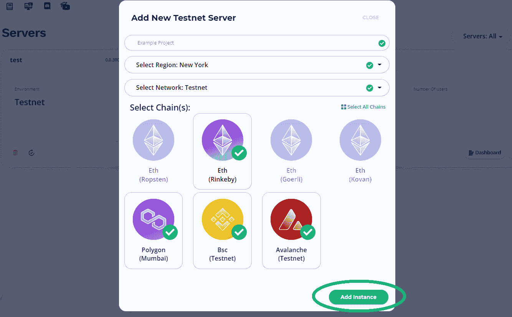

然后，点击“添加实例”,最终创建并启动您的服务器。

3.  **使用您的服务器**–现在，您的服务器已经启动并运行，您可以随意使用所有工具。首先，您可以通过点击服务器名称旁边的“查看详细信息”来访问服务器的详细信息:

这样做的时候，你会看到所有你需要粘贴到代码文件中的必要信息。

除了服务器的详细信息之外，您还可以访问“同步”选项卡，在这里您可以设置智能合约事件监听器([同步和索引智能合约事件](https://moralis.io/sync-and-index-smart-contract-events-full-guide/)):

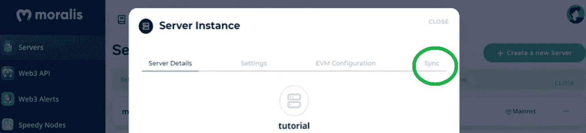

此外，您的服务器的仪表板及其云功能现在由您支配:

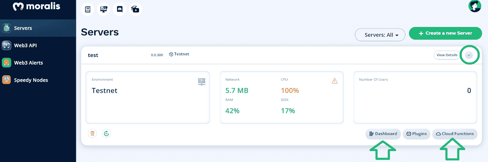

### 用 Moralis 一步一步地建造一座跨链桥梁

安装好 Moralis 服务器后，您终于可以在我们的带领下构建一个跨链桥了。如上所述，你可以从 Moralis 的一位专家的肩膀上偷看一下，他解释了所有的细节(见下面的指导概述)。此外，我们在 [GitHub](https://github.com/DanielMoralisSamples/27_ERC20_Bridge_POC) 上发布了构建跨链桥所需的全部代码。因此，确保在继续之前克隆项目。而且整个代码被整齐的分成了以下几个文件夹:“[前端](https://github.com/DanielMoralisSamples/27_ERC20_Bridge_POC/tree/master/frontend)”、“[Moralis _ 服务器](https://github.com/DanielMoralisSamples/27_ERC20_Bridge_POC/tree/master/moralis_server)”、“[坚固度](https://github.com/DanielMoralisSamples/27_ERC20_Bridge_POC/tree/master/solidity)”。“前端”文件夹包含支持“我们的跨链桥预览”部分中呈现的 UI 的文件。此外，在“moralis_server”文件夹中，您可以找到“同步和监听”事件和云功能的所有 ABI。在“solidity”文件夹中，您可以找到所有需要的智能合同。

#### 分步指南概述

*   在下面的视频中，从 12:07 开始，Moralis 专家解释了建立跨链桥所需的所有智能合同的含义，并带您浏览他们的代码。
*   接下来，您将能够学习如何部署您的跨链网桥的网关和中继(下面 19:31 的视频)。
    *   您将首先看到一个关于建立一个 Moralis 帐户和创建一个 Moralis 服务器的快速概述，我们已经在上面介绍过了。
    *   接下来，您将为主链和侧链添加“同步和观察”事件侦听器。

(记住，可以复制所需的 [ABIs](https://github.com/DanielMoralisSamples/27_ERC20_Bridge_POC/tree/master/moralis_server/eventsAbi.json) )。这些侦听器将代表您的跨链桥的中继。

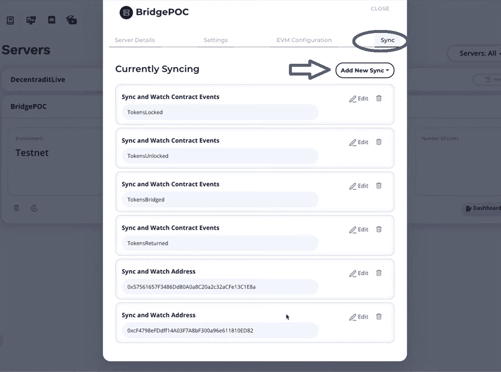

事件监听器就位后，您还将开始用所需的数据填充您的 Moralis 仪表板。

*   此外，从 25:05 开始，您将学习在您的云功能(*[*cloud code . js*](https://github.com/DanielMoralisSamples/27_ERC20_Bridge_POC/blob/master/moralis_server/cloudCode.js)*)内使用来自您的 Moralis dashboard(数据库)的数据，以确保您的网关正常运行。**
***   最后，您将学习如何在 38:08 为您的[分散式应用程序](https://moralis.io/decentralized-applications-explained-what-are-dapps/) (dApp)构建一个基本的 UI。**

**这是我们在本文中一直引用的视频:**

**https://www.youtube.com/watch?v=UkWj7rwOGGc

## 如何构建跨链桥–总结

随着新的可编程链的出现和流行，我们可以预计区块链应用的未来将是跨链互操作性。因此，现有令牌必须能够以安全的方式从一个链转移到另一个链。此外，如果您遵循了以上部分中提供的说明，您现在知道如何构建一个跨链桥来实现这种转换。通过使用在 open zeppelin 上可用的智能合同模板、[Remix](https://moralis.io/remix-explained-what-is-remix/)或[Brownie](https://moralis.io/eth-brownie-explained-what-is-brownie/)等工具，以及最终的 Web3 开发平台——Moralis，你可以在不到一个小时的时间内搭建一座跨链桥梁。然而，这只有在您使用我们提供给您的代码文件时才有可能。

如果你对这个范例项目感兴趣，并想接手其他区块链发展范例项目以提升你的技能，请务必访问 [Moralis 博客](https://moralis.io/blog/)和 [Moralis YouTube 频道](https://www.youtube.com/c/MoralisWeb3)。我们的一些最新任务向您展示了如何[在十分钟内](https://moralis.io/how-to-create-a-dao-in-10-minutes/)创建一个 DAO，如何[用 MetaMask](https://moralis.io/metamask-for-developers-how-to-launch-web3-apps-with-metamask/) 启动 Web3 应用程序，如何[创建免费令牌](https://moralis.io/create-free-token-how-to-deploy-your-own-testnet-crypto-token-in-10-mins/)，如何[用短信获取 Web3 事件](https://moralis.io/get-web3-events-with-sms-messages/)，如何[在币安智能链上创建 NFT](https://moralis.io/create-nft-on-binance-smart-chain-full-guide/)，如何[免费制作 NFT 而无需支付汽油费](https://moralis.io/how-to-mint-nfts-for-free-without-paying-gas-fees/)，如何[用共价 API](https://moralis.io/how-to-build-with-the-covalent-api/) 构建等等尽管如此，如果你想成为一名拥有高级技能的区块链开发者，并成为全职加密员，我们鼓励你去参观 T21 Moralis 学院的课程。

****