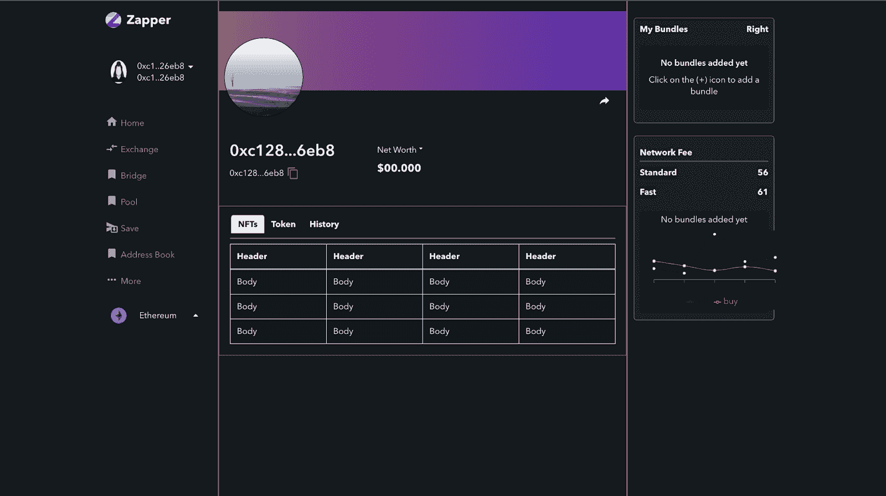
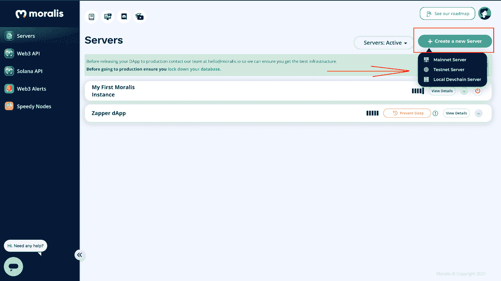
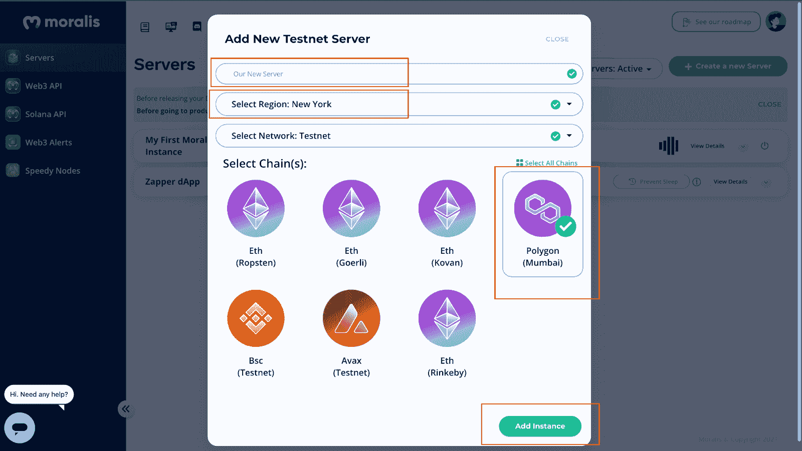
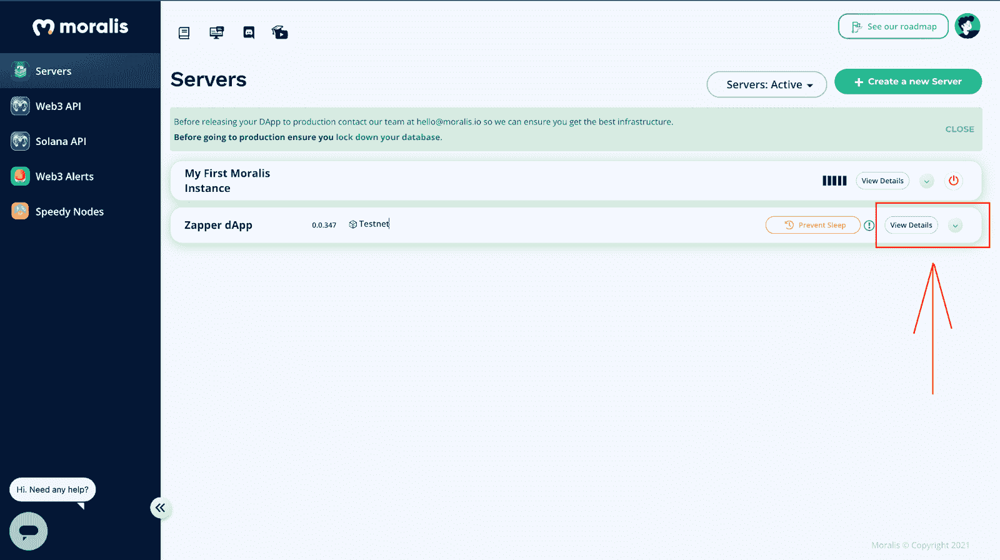
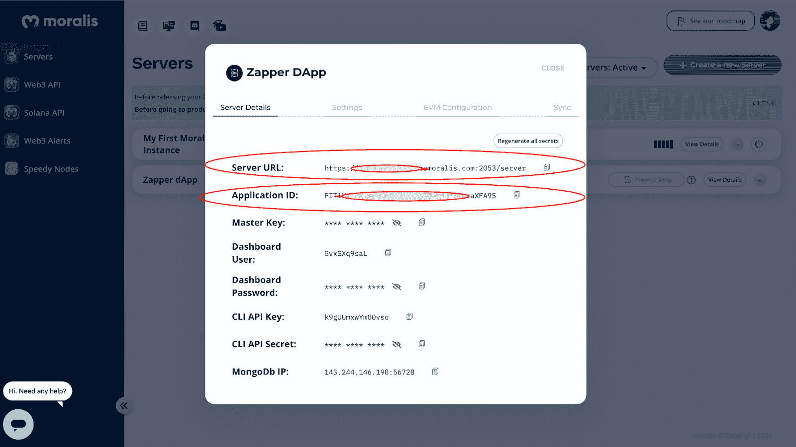

# 如何使用 Moralis API 和无服务器实时事务构建带有 ReactJS 的跨链 Zapper dApp

> 原文：<https://moralis.io/how-to-build-a-cross-chain-zapper-dapp-with-reactjs-using-moralis-api-and-serverless-real-time-transactions/>

毫无疑问，你听说过很多关于 dApps 的东西，但你可能不知道如何快速构建一个。IT 界的许多人似乎对 dApp 的构成有自己的定义，你越深入研究，它就变得越专业。简单来说，dApp 是“去中心化应用”的简称，是一款 Web3 app。这些 dApps 通常需要大量的工作才能推向市场。然而，如果您利用一个健壮的 Web3 后端基础设施平台，如 Moralis，您可以显著减少 dApp 开发时间！

在本教程中，我们将介绍如何使用 Moralis 的 API 和无服务器实时事务来构建一个带有 ReactJS 的跨链 Zapper dApp。

它将是一个平台，允许任何具有互联网连接的人连接他们的钱包并查看他们的投资组合(其中将包括 NFT、令牌、本地余额和实时无服务器交易历史)。

#### **目录**

*   什么是 dApps？
*   什么是 Moralis？
*   项目设置和安装
*   Moralis 服务器设置
*   构建跨链 Zapper dApp
*   结论

这里有一个到现场演示和 GitHub 库的链接👉[扎珀·达普](https://github.com/Olanetsoft/zapper--project)

### **先决条件**

*   确保您已经在我们的电脑上安装了 Node.js/NPM。如果你不知道，请点击[这里](https://nodejs.org/en/)查看快速入门指南
*   使用 React.js 的经验

### **什么是 dApps？**

术语“dApps”代表“分散式应用程序”它们可以与常规应用程序相媲美，并执行类似的任务，但它们运行在对等网络上，如区块链。

简而言之，分布式应用程序(dApps)运行在点对点(P2P)网络上，类似于区块链。智能合约使 dapp 能够在没有中介的情况下提供功能，通常在 dapp 中使用。

#### **什么是 Moralis？**

[Moralis](https://moralis.io/) 是一项服务，它汇集了各种工具和资源，用于构建连接到区块链的去中心化软件，如以太坊、多边形和币安智能链(现为 BNB 智能链)。

Moralis 的终极 Web3 开发平台包括内置的跨链功能，允许新手和有经验的开发人员快速轻松地工作。此外，Moralis 为您提供了一个 Web3 后端基础设施，让您专注于前端开发。它基本上处理了让你的 dApps 运行所需的所有复杂的、幕后的 Web3 事情。

Moralis 也是完全受控和无限可扩展的，这意味着您的 dApps 将毫无困难地扩展。

### **项目设置和安装**

为了快速开始项目设置和安装，我们将在 GitHub 上克隆这个[项目](https://github.com/Olanetsoft/zapper--project/tree/project-setup)，并确保我们在“project-setup”分支上。接下来，我们将在终端上使用以下命令在本地启动克隆后的项目。

CD zapper-项目&&纱线&&纱线开始

或者

CD zapper-项目和 npm 安装和 npm 启动

在克隆和安装项目之后，我们应该得到类似于下面的东西:

接下来，我们将设置 Moralis 服务器。

### **Moralis 服务器设置**

让我们开始设置我们的 Moralis 服务器，因为我们将在下一节中使用它来开发 Zapper dApp。我们将在我们的 Moralis 管理面板上设置一个服务器。如果您还没有帐户，请在此注册一个[。注册很容易，你可以完全免费开始。](https://admin.moralis.io/register)

我们将点击“创建一个新的服务器”,如下所示，然后在我们的管理面板上选择 testnet 服务器。

我们现在将输入我们的服务器详细信息，如下所示:

我们的服务器将在几分钟内准备好，我们必须从我们的 Moralis 管理面板上新创建的服务器实例中访问我们的服务器 URL 和应用程序 ID。

我们将使用这些详细信息从我们的应用程序连接到服务器实例，如下所示:

接下来，我们将构建 Zapper dApp。

**构建跨链 Zapper dApp**

现在我们已经设置好了一切，让我们开始实现。

首先，我们将转到“index.js”文件，并使用从之前构建的服务器实例中获取的应用程序 ID 和服务器 URL 来配置我们的应用程序以使用 Moralis。

我们将需要创造一个”。env "文件放在项目的根目录中，使用以下命令:

触摸。包封/包围（动词 envelop 的简写）

“里面。env”，请在下面添加以下详细信息:

REACT _ APP _ MORALIS _ APPLICATION _ ID = our-APPLICATION-ID REACT _ APP _ MORALIS _ SERVER _ URL = our-SERVER-URL

## **Moralis 初始化**

在“index.js”中，我们将用下面的代码片段更新它:

参见 [CodePen](https://codepen.io) 上 Rasmus ( [@rashmosh](https://codepen.io/rashmosh) )的 Pen [如何使用 Moralis API 和无服务器实时事务 1](https://codepen.io/rashmosh/pen/zYPeMjM) 用 ReactJS 构建跨链 Zapper dApp。