# 如何用 C#和？4 步净

> 原文：<https://moralis.io/how-to-build-a-dapp-with-c-and-net-in-4-steps/>

你想知道如何用 C#构建一个 dapp 吗？而且，你想发现用 C#和 [**构建 Web3 app**](https://moralis.io/fastest-way-to-build-a-web3-app/) **的最快方法吗？网？如果是这样，那么这篇文章就是给你的！使用 Moralis'** [**企业级 API 和 SDK 进行区块链开发**](https://moralis.io/) **时，可以用 C#和构建 dapp。网毫不费力。事实上，使用 Moralis，我们可以通过四个简单的步骤来完成这个开发任务:**

1.  **创建一个 C#应用程序**
2.  **导入并设置最新的 Moralis 规范。NET SDK**
3.  **将您的应用与 Moralis 服务集成**
4.  **从任何支持的链中获取区块链数据**

要轻松处理上述步骤，您还必须考虑两个先决条件。您必须[创建您的免费 Moralis 帐户](https://admin.moralis.io/register)并安装和设置 Visual Studio。此外，您的 Moralis 帐户将允许您访问您的 Moralis Web3 API 密钥，这将是您进入 [Web3](https://moralis.io/the-ultimate-guide-to-web3-what-is-web3/) 开发的门户。因此，我们将首先向您展示如何获取密钥。此外，值得指出的是，Moralis 完全是关于跨链的互操作性，让您使用相同的代码行来处理所有领先的可编程区块链。此外，你可以接触到更广泛的观众，永远不会拘泥于一个特定的区块链。因此，您的 dapp 开发是面向未来的。

尽管如此，尽管我们将使用 C#和。NET，你应该记住，Moralis 也是跨平台互操作的。所以，你可以使用一些流行的平台，比如 Firebase，Supabase，Unity，以及其他一些平台来深入 Web3 领域。


## 用 C#和。NET——满足先决条件

我们将首先向您展示如何获得您的 Moralis Web3 API 密钥来开始这篇文章。毕竟，这样做是“用 C#构建 dapp”任务中至关重要的一部分。因此，请确保现在创建您的免费 Moralis 账户。您可以使用上面的“创建您的免费 Moralis 帐户”链接或访问 Moralis 主页。在那里，您需要点击其中一个“免费开始”按钮:


无论你选择哪一个选项，你都会进入这个页面:


看上面的截图，你可以看到你需要输入你的电子邮件地址并创建你的密码。但是你也可以使用你的谷歌账户。如果你选择前一个选项，请确保确认你的帐户。你可以点击你收件箱里的确认链接来确认。

随着你的 Moralis 帐户的建立和运行，你将能够访问你的 Moralis 管理区。从那里，您将能够以两种方式访问您的 Web3 API 密钥。

首先，你可以点击侧边菜单中的“Web3 APIs”选项:


然后在“EVM API”和“索拉纳 API”之间选择。当你想专注于以太坊或其他 EVM 兼容链，前者将是你的首选。最后，单击“复制 API 密钥”，然后单击“Web3 Api 密钥”:


通过上面的点击，您将复制您的 Web3 API 密钥。作为对该操作的确认，您将在右上角看到一个通知:

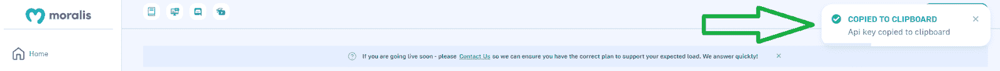

其次，您可以从“帐户设置”页面复制您的 Moralis Web3 API 密钥。要到达那里，点击侧面菜单中的“帐户”选项。进入“帐户设置”页面后，选择“密钥”选项卡，然后复制您的 Web3 API 密钥:


### 安装和设置 Visual Studio

下一个先决条件是安装和设置 Visual Studio。要使用这个免费的 IDE，请使用您最喜欢的浏览器和搜索引擎来查询“Visual Studio”:

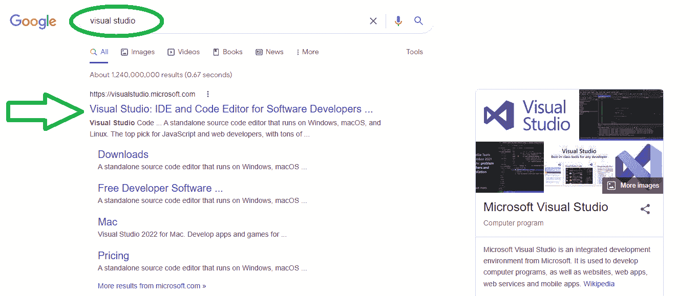

一旦登陆 Visual Studio 官方网站，点击“免费 Visual Studio”。这将带您到“下载”部分，在那里您需要点击“免费下载”按钮:

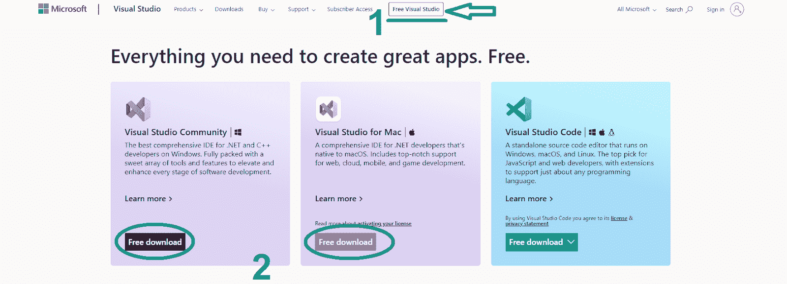

最后，在计算机上安装 Visual Studio。

## 用 C#和。NET–步骤 1:创建一个 C#应用程序

您将通过打开 Visual Studio 开始“用 C#构建 dapp”任务的这一步。接下来，创建一个新项目。此外，确保选择“C#控制台”作为模板:


然后，您需要配置您的新项目。您可以通过输入项目名称和位置来完成此操作。欢迎跟随我们，将您的项目命名为“ConsoleDemo”:

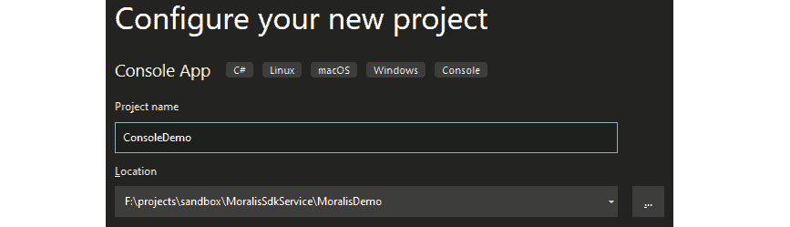

看上面的截图，你可以看到我们使用了 location 下的“MoralisDemo”文件夹。此外，就像项目名称一样，请随时跟随我们的领导。最后，选择“.NET 6.0 "框架并点击"创建"按钮:

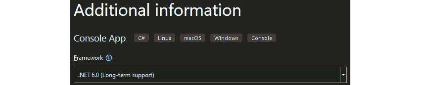

通过创建您的 C#应用程序，Visual Studio 将为您生成一个基本的“C#控制台”项目:

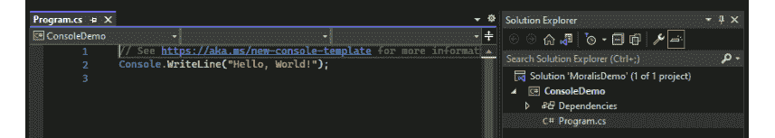

此外，如上图所示，Visual Studio 应该为您创建“ *Program.cs* ”脚本。

## 用 C#和。第二步:导入并设置最新的 Moralis 规范。NET SDK

通过添加 Web3 功能，您可以将上面创建的 C#应用程序转换成 dapp。然而，您需要导入 Moralis 的 SDK 来添加该功能。所以，首先，你需要管理“NuGet 包”。您可以在“工具”>“NuGet 包管理器”>“管理解决方案的 NuGet 包…”下找到此选项:

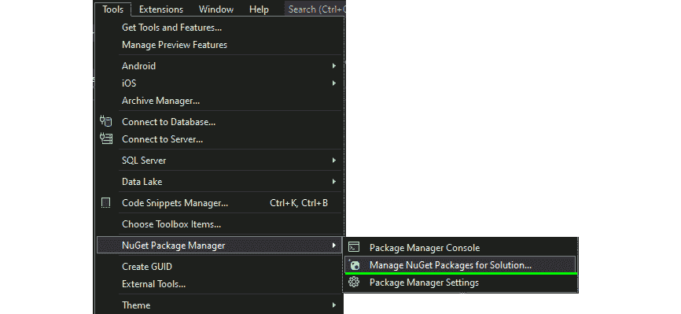

一旦进入“管理解决方案的 NuGet 包…”选项，请确保选中“包括预发布”框。然后，在搜索栏中输入“Moralis”。在给定的结果中，选择最新的 Moralis 包并单击“安装”按钮:

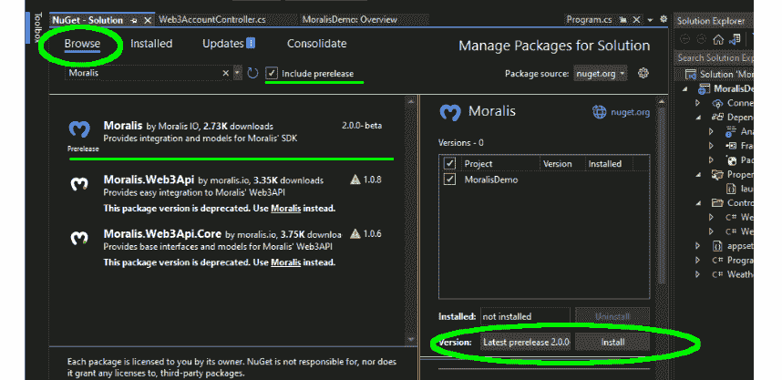

## 用 C#和。NET–步骤 3:将你的应用程序与 Moralis 服务集成

Moralis 家的。安装了. NET SDK 之后，您就可以将您的应用程序与 Moralis 服务集成了。这一步将使您能够用 C#构建一个 dapp。因此，首先在“解决方案资源管理器”窗口中打开“ *Program.cs* ”文件。然后，选择该文件的当前内容并将其删除。接下来，使用语句粘贴以下两个*:*

```js
using Moralis;
using Moralis.Web3Api.Models;
```

有了" *using* "语句之后，继续添加"*名称空间*"、"*类*"和基本公共静态" *Main* "。此外，您需要确保设置"*Moralis 客户端。ConnectionData* "与之前获得的 Moralis Web3 API 密钥。因此，只需用您的密钥替换“*您的 Moralis WEB3API 密钥*”。这些是你需要用来覆盖它的代码行:

```js
namespace ConsoleDemo
{
    internal class Program
    {
        static void Main(string[] args)
        {
            // Setup Moralis
            MoralisClient.ConnectionData = new Moralis.Models.ServerConnectionData()
            {
                ApiKey = "YOUR MORALIS WEB3API KEY"
            };
        }
    }
}

Next, you must create the "DisplayCryptoData" static async function under the "Main" function. Moreover, this function should accept two parameters - "address" (string) and "chainId" (ChainList). Nonetheless, the return type should be "Task":

internal static async Task DisplayCryptoData(string address, ChainList chainId)
{

}
```

上述函数还决定了您的应用程序将接受同样的两个参数——地址和链 ID。由于确保这些参数被正确传递和有效是至关重要的，我们建议添加将验证这些参数的代码行(见下文)。最后，您必须添加“*任务。运行*语句调用“ *DisplayCryptoData* ”异步函数。

### 你的“主要”功能

完成上述所有工作后，下面是“ *Main* 函数应该包含的代码行:

```js
        static void Main(string[] args)
        {
            if (args.Length < 2)
            {
                Console.Write("Usage: ConsoleDemo.exe ADDRESS CLIENT_ID");
                return;
            }

            string address = args[0];
            int chainId = 1;

            if (!int.TryParse(args[1], out chainId))
            {
                Console.Error.WriteLine("CHAIN_ID must be a number.");
            }

            // Setup Moralis
            MoralisClient.ConnectionData = new Moralis.Models.ServerConnectionData()
            {
                ApiKey = "YOUR MORALIS WEB3API KEY"
            };

            Task.Run(async () =>
            {
                await DisplayCryptoData(address, (ChainList)chainId);
            }).Wait();
        }
```

有了上面几行代码，您就有了用 C#构建 dapp 的一切，它将能够获取链上数据。在这个任务的最后一步，你将有机会学习如何获取和显示原生余额、ERC-20 代币余额和 NFTs 的元数据。

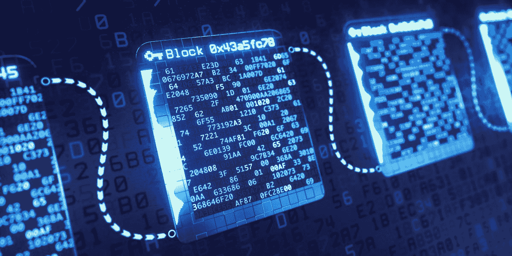

## 用 C#和。NET–步骤 4:从任何支持的链中获取区块链数据

为了将 Web3 功能添加到您的应用程序中，我们将重点关注" *DisplayCryptoData* "函数。本质上，您需要向这个先前创建的异步函数添加适当的代码行。首先，您需要显示有问题的地址:

```js
Console.WriteLine($"For address: {address}...\n");
```

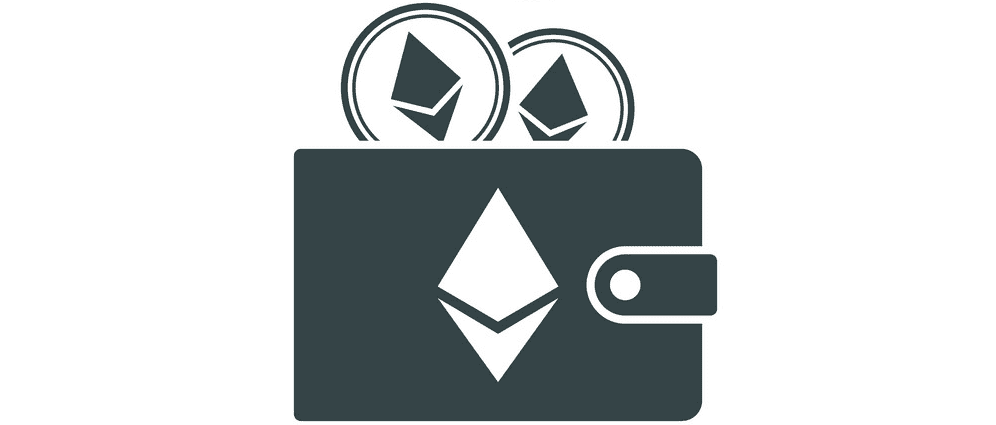

### 
取出并显示本机余额

在前面的步骤中，您已经安装并集成了 Moralis SDK。因此，您现在可以利用 Moralis Web3 API。此外，您可以使用直观的端点来获取各种链上数据。在获取本机余额时，端点“ *GetNativeBalance* ”可以完成这项任务。因此，这是您需要添加到“ *DisplayCryptoData* ”函数中的代码行:

```js
// Load native balance for address
NativeBalance bal = await MoralisClient.Web3Api.Account.GetNativeBalance(address, chainId);
```

此外，您还需要以下代码行来正确格式化和显示本机余额:

```js
double nativeBal = 0;

double.TryParse(bal.Balance, out nativeBal);

Console.WriteLine($"Your native balance is {nativeBal / Math.Pow(10,18)}");
```

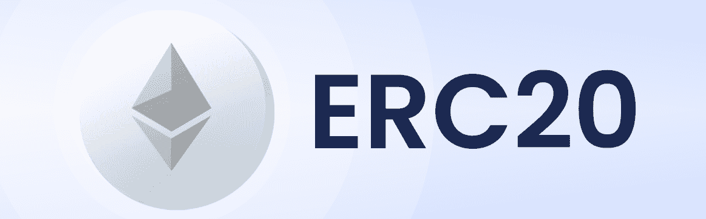

### 获取和显示 ERC-20 代币余额

在获取和显示 ERC-20 代币余额时，您需要遵循与本机余额相同的原则。当然，您需要使用不同的端点。在这种情况下，它将是" *GetTokenBalances* ":

```js
// Load ERC-20 Token List for address
List<Erc20TokenBalance> erc20Balnaces = await MoralisClient.Web3Api.Account.GetTokenBalances(address, chainId);
```

此外，与本地余额不同，在一个钱包地址中可以有多种 ERC-20 令牌类型。因此，我们需要使用列表并正确显示它。尽管如此，你也应该记住，在一个特定的 Web3 钱包里可能没有任何 ERC-20 代币。以下代码行将正确显示 ERC-20 令牌余额:

```js
Console.WriteLine("\n\nYour ERC 20 Tokens:");

if (erc20Balnaces != null && erc20Balnaces.Count > 0)
{
    // Print out each token with symbol and balance.
    foreach (Erc20TokenBalance tb in erc20Balnaces)
    {
        Console.WriteLine($"\t{tb.Symbol} - {tb.Name}: {tb.NativeTokenBalance}"); 
    }
}
else
{
    Console.WriteLine("\tNone");
}
```


### 获取和显示 NFT

当谈到获取 NFT，或者我们应该说它们的元数据时，事情遵循与上面两个例子相同的原则。当然，我们需要使用一个合适的端点。在这种情况下，“ *GetNFTs* ”完成了以下任务:

```js
// Load first 10 NFTs for the address
NftOwnerCollection nfts = await MoralisClient.Web3Api.Account.GetNFTs(address, (ChainList)chainId, "", null, 10);
```

这些代码行显示了上述 10 个 NFT 的名称、余额和元数据:

```js
        // Load first 10 NFTs for the address
        NftOwnerCollection nfts = await MoralisClient.Web3Api.Account.GetNFTs(address, (ChainList)chainId, "", null, 10);

        Console.WriteLine("\n\nYour NFTs:");

        if (nfts != null && nfts.Result.Count > 0)
        {
            // Print out each token with symbol and balance.
            foreach (NftOwner nft in nfts.Result)
            {
                Console.WriteLine($"\t{nft.Name}: {nft.Amount}\n\tMetaData: {nft.Metadata}\n\n");
            }
        }
        else
        {
            Console.WriteLine("\tNone");
        }
```

*注意:* *包含文件 URL 的是 NFTs 的元数据(如 PNG)。因此，通过创建适当的前端，您可以轻松地显示获取的 NFT。*

最后但同样重要的是，您可以在 [GitHub](https://github.com/MoralisWeb3/dot-net-sample-console-dapp) 上查看用 C#构建 dapp 的完整代码。此外，你应该使用 [Moralis 文档](https://docs.moralis.io/docs/your-first-net-app)来获得进一步的帮助。

### 运行您的 Dapp 并调试

所有代码就绪后，您就可以在 Visual Studio 中运行 dapp 了。如果您使用这里提供的代码，输出将是:

```js
Usage: ConsoleDemo.exe ADDRESS CLIENT_ID
```

因此，我们建议您单击“打开调试启动配置文件 UI”(在“解决方案资源管理器”>“属性”>“调试”>“常规”中):

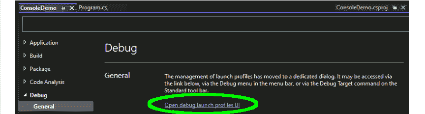

然后，用钱包地址和链 ID 填充“命令行参数”输入字段:

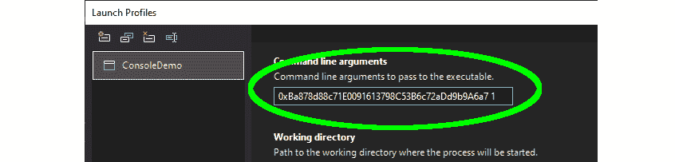

*注:* *我们建议您使用钱包地址。此外，使用与您有余额的链匹配的链标识。要查找可编程区块链的身份证号，请使用 Moralis 文档中的“* [*【支撑链】*](https://docs.moralis.io/reference/supported-chains-evm) *页面。例如，上面使用的数字“1”对应于以太网链。*

如果您在输入钱包地址和链 ID 后再次运行 dapp，它将正常工作。因此，控制台将显示给定地址和链的本机余额、ERC-20 令牌余额和 NFTs 元数据。此外，这也意味着你已经成功地用 C#和。网！

## 如何用 C#和？4 步净-总结

本文演示了如何使用 C#和. NET 构建 dapp。此外，本文还通过以下四个步骤向您展示了如何实现这一点:

1.  创建 C#应用程序
2.  导入并设置最新的 Moralis 规范。NET SDK
3.  将您的应用程序与 Moralis 服务集成
4.  从任何支持的链获取区块链数据

有了这里获得的技能和知识，您现在知道如何创建基本的后端 dapps。所以，你可能已经准备好把你的 C#和 Web3 基础带到下一个层次了。因此，我们鼓励你使用我们的教程之一，并建立一个全栈杀手 dapp。请记住，您可以使用其他编程语言和遗留开发平台。不管你是想更深入地研究 C#和。例如，如果您想探索 Firebase，您应该使用 Moralis 文档。然而，对于更高级的示例项目， [Moralis 博客](https://moralis.io/blog/)和 [Moralis YouTube 频道](https://www.youtube.com/c/MoralisWeb3)应该是你的首选渠道。这两个地方可以免费帮助你成为 Web3 开发者。

此外，我们应该告诉你，去全职加密，成为区块链认证可以是你的入场券。这就是[Moralis 学院](https://academy.moralis.io/)登场的地方。在这里，您可以参加顶尖的区块链发展课程，获得个性化的学习路径，并体验专家指导。更重要的是，Moralis 学院为你提供了密码领域最先进的社区之一的会员资格！