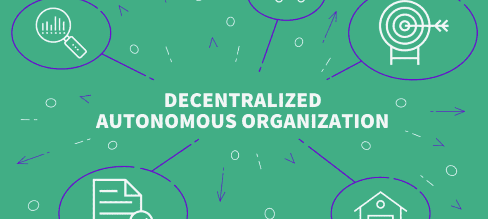
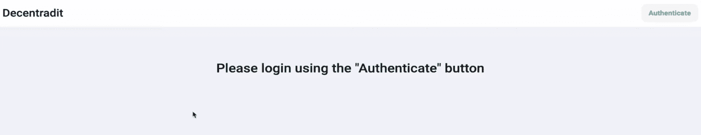
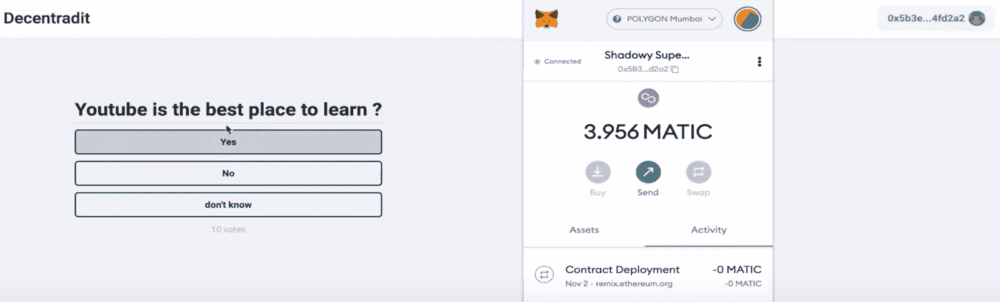
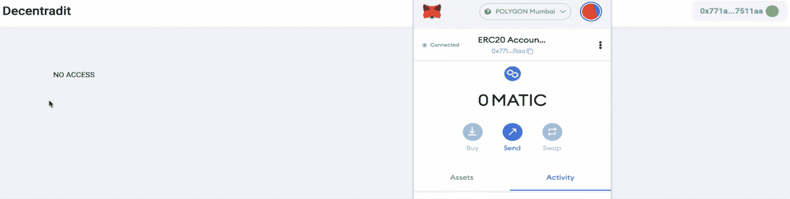
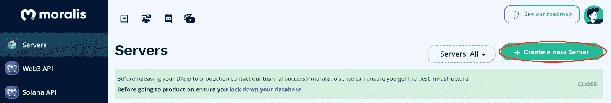
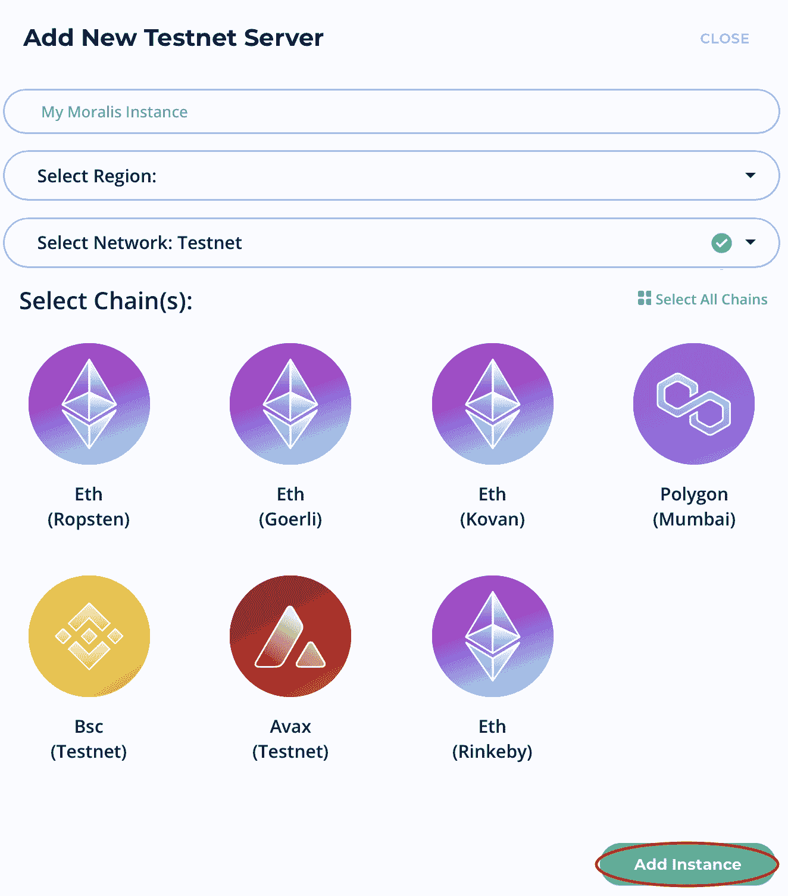
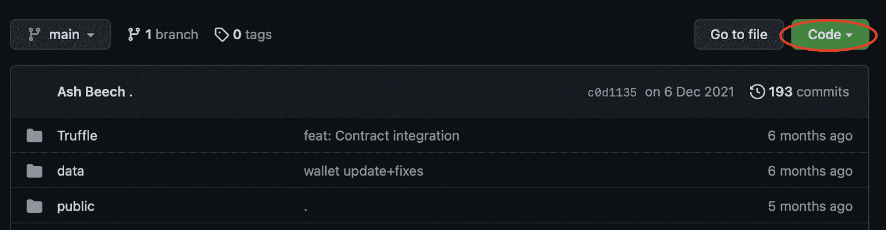
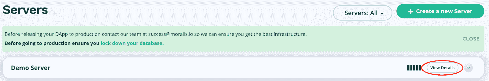

# 如何建立一个分散的自治组织(DAO)

> 原文：<https://moralis.io/how-to-build-a-decentralized-autonomous-organization-dao/>

分散自治组织(Dao)最近风靡一时。在本文中，我们将演示如何构建一个去中心化的自治组织(DAO)。然而，在深入我们的教程之前，我们将简要解释 Dao 是什么以及它们是如何工作的。因此，如果您已经熟悉 DAOs，可以通过查看下面的 GitHub 库直接进入代码:

**完成如何建刀文档——**[](https://github.com/ashbeech/moralis-poll)

****去中心化是互联网发展的下一步 [Web3](https://moralis.io/the-ultimate-guide-to-web3-what-is-web3/) 的定义特征。如果你熟悉 Web3，你会知道区块链技术促进了这种向更加分散化的网络发展。然而，在由用户拥有和管理的分散系统的中心，您还会发现 Dao。通俗地说，一个 DAO 指的是一个 Web3 项目的管理机构，组织的成员决定平台应该如何发展。作为 Web3 的重要组成部分，我们将在本文中仔细研究如何使用 [Moralis](https://moralis.io/) 操作系统构建一个去中心化的自治组织。****

****首先，我们将简要解释 Dao 是什么以及它们是如何工作的。接下来，我们将直接进入使用 Moralis 构建你自己的 DAO 的过程，它是 Web3 开发的头号操作系统。更重要的是，使用该平台创建一个帐户是完全免费的！****

****如果您加入了 Moralis，您将立即获得操作系统令人难以置信的开发工具，如 [Moralis Speedy Nodes](https://moralis.io/speedy-nodes/) 、 [Moralis 元宇宙 SDK](https://moralis.io/metaverse/) 、Moralis 的 [NFT API](https://moralis.io/ultimate-nft-api-exploring-moralis-nft-api/) 等。除了广泛的工具箱，您还可以访问系统完善的后端基础设施，使所有区块链开发更容易访问。****

****因此，在我们继续之前，注册 Moralis，并采取下一步成为区块链开发者吧！****

## ****什么是去中心化的自治组织？****

****在我们进入构建 DAO 的过程之前，更多地了解这些组织的复杂性是非常有益的。因此，我们将在这一节中探讨更多关于 Dao 的内容，它们是如何工作的，以及它们为什么有用。所以，跟着我们回答这个问题，“什么是分散的自治组织？”。****

****

“一体行动”指的是项目或协议的管理机构。Dao 本质上是 dapps(分散的应用程序),提供了以完全分散的方式运行部分或整个组织的能力。因此，Dao 是一种消除完全控制项目或平台的中央集权的方式。

支持 DAOs 的一项基本技术是[智能合约](https://moralis.io/smart-contracts-explained-what-are-smart-contracts/)。智能合约为特定令牌的持有者提供了民主参与平台治理的权利。此外，提供参与投票权利的令牌是[治理令牌](https://moralis.io/what-are-governance-tokens-full-guide/)。因此，治理令牌的持有者有机会影响平台/项目的未来方向。

此外，Dao 提供了一种链上治理的形式，允许任何拥有令牌和设备的人参与。这表明这些组织不受地域限制，并在决策过程中提供真正的权力下放。因此，DAOs 进一步使区块链项目民主化，并确保所有用户对未来前景拥有自主权。

Dao 有许多好处，最突出的两个例子是透明度和建立群体信任。由于所有决策都是在链上做出的，因此它提供了完全的透明性，因为存在不可变的变更记录。此外，由于令牌持有者拥有权力，它可以建立社区信任，因为用户决定是否应该发生变化。

对 DAOs 有了更好的理解后，我们可以进入本文的下一部分，探索如何构建一个分散的自治组织！

## 如何用三个步骤建立一个分散的自治组织

在本文接下来的部分中，我们将花时间探索更多关于构建 DAO 的过程。我们将创建一个简单的 DAO dapp，用户可以用他们的 [Web3 钱包](https://moralis.io/what-is-a-web3-wallet-web3-wallets-explained/)登录，并在一个特定的投票中投票，假设他们有 testnet MATIC 的正余额。为了说明我们的工作目标，我们将继续仔细研究 dapp 本身。因此，一旦 dapp 启动，用户将会看到以下内容:



随着 dapp 的推出，用户将能够在界面的右上角验证自己。点击“认证”按钮将提示用户的[元掩码](https://moralis.io/metamask-explained-what-is-metamask/)钱包并允许他们登录。通过身份验证后，将根据他们的代币余额显示两个屏幕中的一个。因此，如果有人钱包里有 testnet MATIC，他们会看到以下内容:



正如上面的打印屏幕所示，用户的代币余额允许他们参与投票，决定 YouTube 是否是最好的学习平台。但是，如果用户的 testnet MATIC 余额为零，他们将看到以下屏幕:



您很快就会注意到，投票已经结束，dapp 显示的是“NO ACCESS”消息，表明用户没有投票权。

当使用 Moralis 操作系统时，创建这个应用程序变得相对容易。事实上，完整的过程可以分为以下三个步骤:

1.  创建 Moralis 服务器
2.  克隆 Moralis 民意调查 GitHub Repo
3.  初始化 Moralis

所以，事不宜迟，让我们继续下一节，创建我们自己的 Moralis 服务器！

### 步骤 1:构建 DAO——创建 Moralis 服务器

要建立一个分散的自治组织，你首先需要一个 Moralis 账户。所以，如果你还没有注册，请马上注册。然后，有了一个帐户，你可以通过点击“+创建一个新服务器”按钮来创建你自己的 Moralis 服务器。



这将提供一个有三个选项的菜单。在这个例子中，我们将选择一个 testnet 服务器。点击此选项后，将出现一个窗口，您需要在其中输入名称、选择区域并决定链。在我们的例子中，我们选择了孟买测试网，因为我们不打算在主网上发布 dapp。

现在就是这样；剩下的就是点击窗口右下角的“添加实例”按钮。服务器启动可能需要几分钟，但是不要担心；它将立即启动！



有了服务器，您有几个选择可以探索。例如，您可以单击最右边的箭头来查找有关您的服务器的更多信息。您还会找到“Dashboard”按钮，如果您点击这个选项，您会找到关于您的 dapp 的各种详细信息。例如，将来一旦有人在杆子上投票，dapp 就会记录信息并保存到仪表板上。因此，dapp 以后可以从这个数据库中获取信息，并限制用户在同一次投票中投票两次。

然而，这只是 Moralis 服务器的众多用途之一。尽管如此，现在服务器已经启动并运行了，我们可以进入下一步:从 Moralis poll 存储库中克隆 dapp 本身。

### 步骤 2:构建一个 DAO——克隆 Moralis Poll GitHub Repo

在接下来的步骤中，我们将克隆 Moralis poll GitHub 存储库。通过这样做，我们可以快速有效地创建这个 dapp。所以，你要做的是访问我们在介绍中链接的 GitHub 库。

接下来，您可以点击绿色的“代码”按钮并复制 URL。这将是“git”repo 的 URL，我们将利用它将项目克隆到我们的本地目录。有了这个链接，您就可以导航到您的 IDE(集成开发环境)。我们使用的是 Visual Studio 代码(VSC)；然而，请随意使用您更熟悉的任何其他代码编辑器！



尽管如此，在 Visual Studio 代码打开的情况下，我们可以通过以下命令克隆项目:

```js
git clone ”REPO LINK”
```

此外，您还需要确保项目的所有依赖项都已安装，这可以通过在终端中输入以下命令来实现:

```js
npm i
```

将一个克隆添加到您的本地开发环境并安装了所有依赖项之后，下一步是将项目或 dapp 链接到我们在上一步中创建的 Moralis 服务器。因此，让我们仔细看看如何初始化 Moralis。

### 步骤 3:构建一个 DAO 初始化 Moralis

有了服务器和项目，最后一步是初始化 Moralis。为此，您需要在存储库中找到“. env.example”文件。在打开文件之前，您可以删除“.”。例“名称的一部分，只留下”。env”。

打开文件后，您会发现下面两行代码:

```js
REACT_APP_MORALIS_APPLICATION_ID = "xxx"
REACT_APP_MORALIS_SERVER_URL = "xxx"
```

如您所见，我们需要一个应用程序 ID 和一个服务器 URL。您可以通过导航回到 Moralis 管理面板来找到这些元素。要找到 ID 和 URL，您需要单击服务器的“查看详细信息”按钮。剩下的就是用正确的输入替换代码中相应的“xxx”。



为了确保一切正常，您可以使用以下命令运行 dapp:

```js
npm start
```

这就是关于如何建立一个去中心化的自治组织的教程！

然而，尽管这是 DAO dapp 的一个简单示例，但是您可以将自己的想法添加到项目中，并在此基础上添加更复杂的功能。此外，如果你想更详细地了解整个代码，你可以访问 [Moralis YouTube 频道](https://www.youtube.com/channel/UCgWS9Q3P5AxCWyQLT2kQhBw)并查看以下视频:

https://www.youtube.com/watch?v=S-yBqLWEtGw

如果你真的想创建自己的 DAO，你可以通过查看 [Moralis 博客](https://moralis.io/blog/)的更多内容来磨练你的 Web3 开发技能。例如，学习更多关于令牌开发的知识是一个好主意。因此，看看下面这些关于[如何创建自己的 ERC-20 令牌](https://moralis.io/how-to-create-your-own-erc-20-token-in-10-minutes/)、[创建自己的 NFT](https://moralis.io/how-to-create-your-own-nft-in-5-steps/) 、[创建多边形令牌](https://moralis.io/how-to-create-a-polygon-token/)或[创建 BNB NFT](https://moralis.io/how-to-create-a-bnb-nft/) 的文章。

阅读这些文章将提高您在令牌开发方面的熟练程度，这对您将来开发 DAOs 很有帮助！

## 如何建立一个分散的自治组织——总结

Dao，或称分散自治组织，是 Web3 最重要的特征之一，它们进一步民主化了一个已经分散的空间。Dao 本质上是平台、项目或协议的管理主体，它们将权力和控制权分配给用户。此外，参与和做出关于项目未来的决策所必需的只是一个设备和足够平衡的治理令牌。

此外，在本文中，我们提供了一个快速教程，解释如何构建自己的分散自治组织。事实上，这一过程分为以下三个步骤:

1.  创建 Moralis 服务器
2.  克隆 Moralis 民意调查 GitHub Repo
3.  初始化 Moralis

通过利用 Moralis 平台的工具和从 GitHub 克隆项目的基础，我们能够在几分钟内创建这个 DAO。因此，这展示了与 Moralis 合作的力量，以及操作系统如何使 Web3 开发更容易。

如果你的目标是[成为一名区块链开发者](https://moralis.io/how-to-become-a-blockchain-developer/)，我们建议在 Moralis 查看更多内容。例如，仔细阅读[分数 NFTs](https://moralis.io/what-are-fractional-nfts-the-ultimate-2022-f-nft-guide/) 、[动态 NFTs](https://moralis.io/what-are-dynamic-nfts-the-ultimate-2022-guide/) 、 [Web3 认证替代方案](https://moralis.io/web3-without-metamask-web3-authentication-alternatives/)、[区块链开发的最佳语言](https://moralis.io/best-languages-for-blockchain-development-full-tutorial/)等。

此外，如果你想成为一名更熟练的区块链程序员，访问[Moralis 学院](https://academy.moralis.io/)并报名参加市场上最好的[区块链课程](https://academy.moralis.io/all-courses)！

然而，[与 Moralis](https://admin.moralis.io/register) 签约，并从该平台提供的已开发的后端基础设施中获益。这将让你在所有未来的区块链项目上减少 87%的平均开发时间。此外，创建一个帐户是完全免费的，你可以在几分钟内开始你的开发工作！****