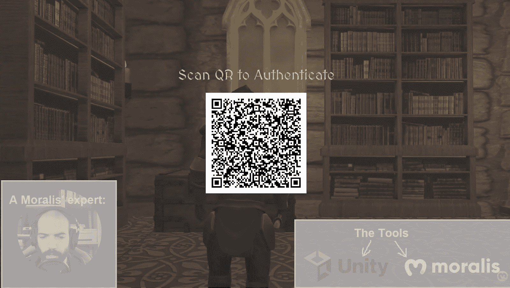
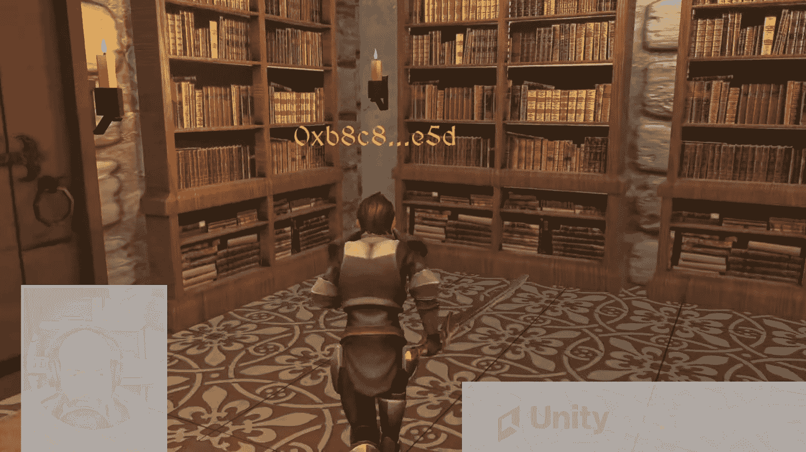
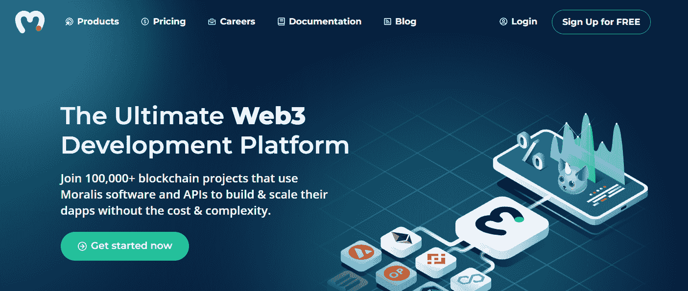
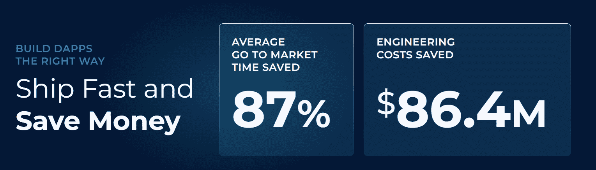
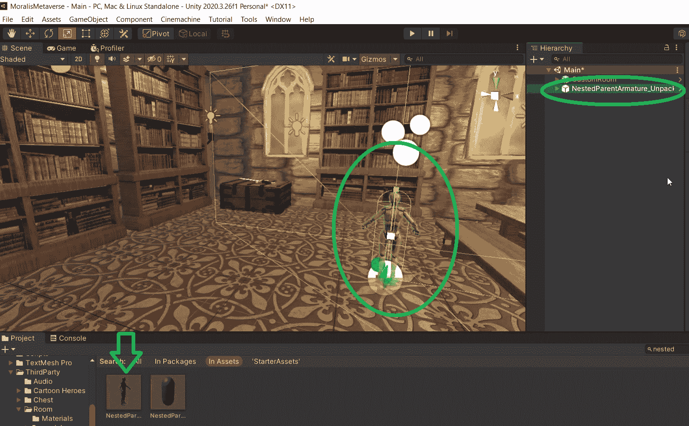
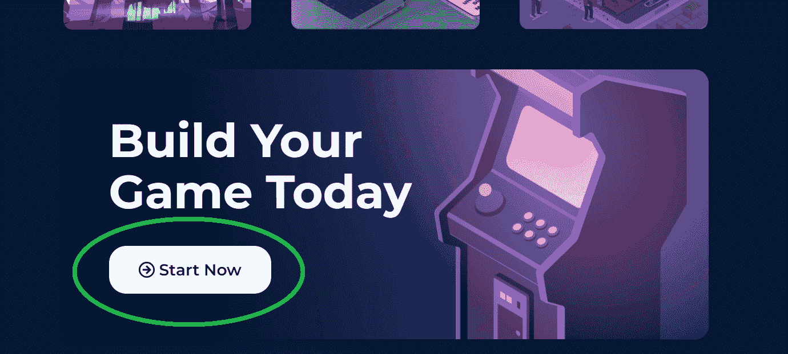
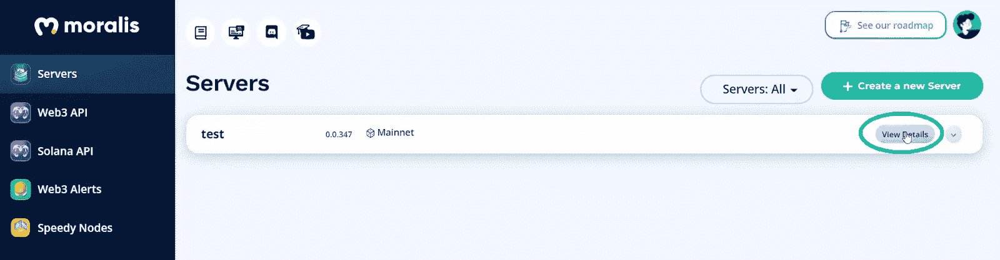
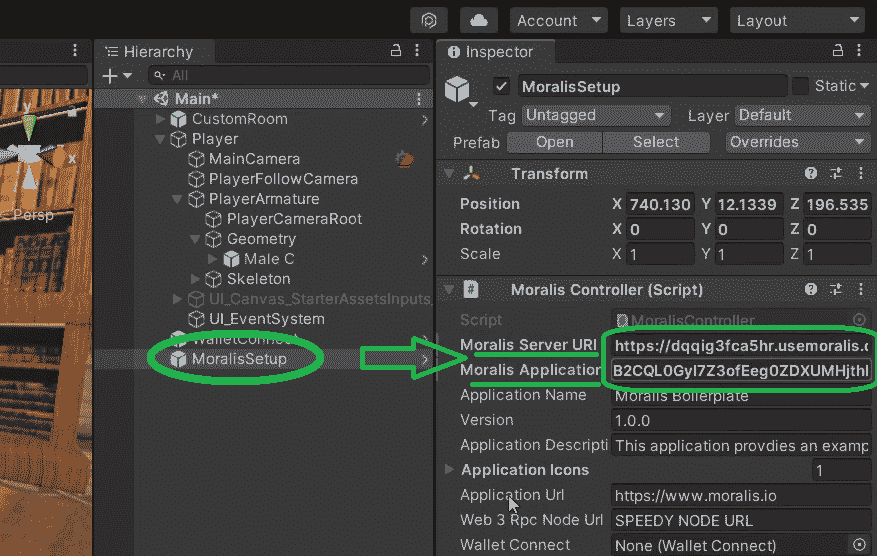
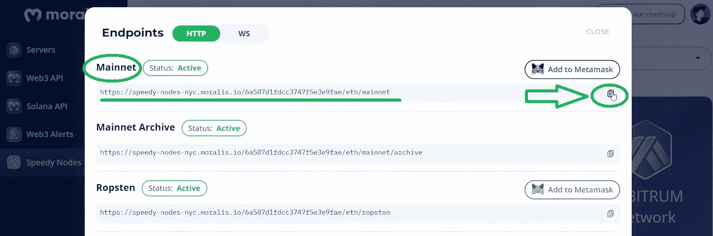

# 如何在 25 分钟内构建一个元宇宙游戏

> 原文：<https://moralis.io/how-to-build-a-metaverse-game-in-25-minutes/>

**任何人都可以创造出******的游戏；然而，用工作元素正确地构建它是许多人做不到的，特别是当他们使用原始和过时的工具时。因此，快速构建一个功能齐全的元宇宙游戏的诀窍在于使用合适的工具。使用 Moralis，您可以在大约 25 分钟内轻松完成我们的“如何构建一个元宇宙游戏”示例项目。此外，虽然许多人认为区块链开发似乎令人生畏，Moralis 简化了过程。也就是说，我们不仅会在这里向你展示如何快速构建一个元宇宙游戏，还会向你展示如何以正确的方式构建一个。****

**接下来，你将学习如何用当前 [Web3 技术栈](https://moralis.io/exploring-the-web3-tech-stack-full-guide/)–[Moralis](https://moralis.io/)的巅峰来构建一个元宇宙游戏。这个“ [Firebase for crypto](https://moralis.io/firebase-for-crypto-the-best-blockchain-firebase-alternative/) ”工具是负责整个后端的终极 [Web3](https://moralis.io/the-ultimate-guide-to-web3-what-is-web3/) 开发平台。此外， [Moralis 的元宇宙 SDK](https://moralis.io/metaverse/) 使您能够使用 Unity 来交付非凡的区块链游戏。因此，您可以开始利用 [Unity Web3](https://moralis.io/unity-web3-beginners-guide-to-unity-web3-programming/) 机会。后者包括 [GameFi 和](https://moralis.io/what-is-gamefi-and-play-to-earn-p2e/)P2E(play-to-earn)，是元宇宙的重要特色。此外，有了[最好的 Web3 后端平台](https://moralis.io/exploring-the-best-web3-backend-platform/)，你可以将你的注意力和资源投入到创造最好的 Web3 UI 上。因此，您可以向用户提供他们想要的东西，而无需处理后端的任何开销。尽管如此，团结和 Moralis，我们的“如何建立一个元宇宙游戏”的追求归结为三个主要步骤。其中包括创建 3D 世界、创建头像、添加 [Web3 认证](https://moralis.io/web3-authentication-the-full-guide/)。**

**

## 如何建立一个元宇宙游戏-示例项目

如前所述，本文将讨论我们的“如何构建一个元宇宙游戏”示例项目。在接下来的部分中，我们将涵盖所有必要的步骤，包括初始设置。在这个过程中，您将了解到几个有价值的捷径。首先，我们将使用 Unity 的资产商店来获取现成的游戏元素。因此，我们将使用这些元素在几分钟内构建我们的示例 3D 空间和示例角色。此外，我们决定通过在 [GitHub](https://github.com/MoralisWeb3/youtube-tutorials/tree/main/unity-metaverse) 上发布我们的代码，让你的探索变得更加简单。然而，在我们开始构建我们的元宇宙之前，让我们快速演示一下我们完成的示例 dapp ( [分散式应用](https://moralis.io/decentralized-applications-explained-what-are-dapps/))。

### 如何使用 Unity 构建元宇宙游戏–演示

让我们先来看看我们的潜在用户在使用我们的元宇宙游戏时会看到什么:

正如你在上面的截图中看到的，用户有机会使用一个简洁的 [Web3 登录](https://moralis.io/how-to-build-a-web3-login-in-5-steps/)方法。通过扫描二维码，这是我们元宇宙的入口，他们可以控制化身。此外，正如你所看到的，头像位于一个中世纪的图书馆。后者是我们 3D 世界的一个例子。此外，在代码上方有一个清晰的指示信息，告诉用户如何开始。此外，用户的 [Web3 钱包](https://moralis.io/what-is-a-web3-wallet-web3-wallets-explained/)地址将显示在角色的头部上方:

此外，您可以看到我们的示例元宇宙游戏包含了所有的基础，包括用户友好的 Web3 身份验证、3D 世界和虚拟角色。因此，这是一种 Web3 RPG 游戏。此外，我们还保持事情相对简单，以便您能够在 30 分钟内完成所有内容。这个例子的重点是通过看到你所拥有的潜力来激发你的想法。例如，您可以通过添加房间、建筑甚至地图来扩展这个 3D 世界。此外，您可以添加额外的字符。因此，你可以轻松地创建一个合适的元宇宙或者至少是一个 MMORPG。既然你已经有了目标，是时候向你展示如何用团结和 Moralis 来构建一个元宇宙游戏了。

*注* *:在本文的底部，你还可以观看这个视频格式的演示(0:51)。*

## 如何建立一个团结和 Moralis 的元宇宙游戏

正如本文前面提到的，我们可以通过三个主要步骤来完成“如何构建一个元宇宙游戏”的挑战:

1.  创造一个 3D 世界。
2.  添加第三人称角色(头像)。
3.  使用简洁的二维码选项整合 Web3 钱包登录。

我们将使用 Unity 引擎结合 Unity 资产商店中的免费资产来完成前两步。

*注**:GitHub 上的“* [*Assets*](https://github.com/MoralisWeb3/youtube-tutorials/tree/main/unity-metaverse/Assets) *”文件夹中有我们在元宇宙游戏示例中使用的所有资产。*

你可能已经注意到，前两步与 Web3 没有任何关系。事实上，这是将我们的示例项目转换成 Web3 以完成我们的“构建一个元宇宙游戏”任务的第三步。在这里，您将看到 Moralis 的力量，以及它如何解决我们与区块链相关的后端需求。此外，由于 Web3 身份验证是所有 dapps 的重要组成部分，这也是我们在这里要关注的。此外，有了各种可靠的登录选项，知道什么最适合您的用户是很重要的。例如，如果你的用户是精通加密的人，[元掩码](https://moralis.io/metamask-explained-what-is-metamask/)和 [WalletConnect](https://moralis.io/what-is-walletconnect-the-ultimate-walletconnect-guide/) 认证是最好的选择。另一方面，如果你的目标是 Web3 新人，那么通过电子邮件进行的 [Web3 认证](https://moralis.io/how-to-do-web3-authentication-via-email/)和 [Web3 社交登录](https://moralis.io/web3-social-login-sign-in-dapp-users-with-google-email-or-twitter/)甚至是更好的选择。因此，重要的是要考虑你的元宇宙游戏的目标是谁。

### 构建元宇宙游戏时节省时间和资源

幸运的是， [Moralis 的 SDK](https://moralis.io/exploring-moralis-sdk-the-ultimate-web3-sdk/) 为您提供了上述所有选择。此外，通过 Moralis 服务器、Moralis 仪表板(数据库)和 Moralis“同步”功能，您可以在[索引区块链](https://moralis.io/how-to-index-the-blockchain-the-ultimate-guide/)。一旦你[同步并索引智能合约事件](https://moralis.io/sync-and-index-smart-contract-events-full-guide/)，你想要添加到你的 dapps 的功能就“无所不能”了。此外，正是由于这些快捷方式，Moralis 为开发人员节省了超过 87%的开发时间。尽管如此，您还应该注意到，Moralis 完全是关于跨链互操作性的。因此，您的 dapps 和元宇宙游戏可以轻松部署到所有支持的连锁店。因此，你的工作也是“经得起未来考验的”。

现在是时候卷起袖子，跟随 Moralis 专家的领导了。跟随或观看下面的视频教程，因为他会牵着你的手从起点到终点。事不宜迟，让我们从创建上面演示中展示的 3D 世界开始。

### 创造一个 3D 世界

要获得示例项目这一部分的详细指导，请使用下面的视频(3:57)。Moralis 专家将告诉你如何建立一个新的场景开始元宇宙游戏。您将首先发现如何正确地分组和排列资产文件。通过这样做，您将能够轻松地浏览您的文件夹。就创建 3D 世界而言，您将依赖于“CustomRoom”文件。后者还包括一把放在箱子顶部的剑(这两个元素都是由 Moralis 专家添加的):

### 添加第三人称角色

此时，您应该已经创建了简单的 3D 世界。反过来，你就可以添加你的头像了。幸运的是，这也是免费资产提供了一条难以置信的捷径。后者消除了从头创造角色的需要。此外，在下面的视频中，创建你的虚拟形象的细节将在 5:30 开始。在这里，您将学习如何找到“NestedParentArmature”(“Player”)。此外，该文件将作为您角色的基础:

在此过程中，您还将学习如何添加网格碰撞器。然后，你的 3D 房间会有一个地板，角色可以在上面行走。因此，有了一个“骨骼”化身和一个有地板的 3D 房间，您就已经有了移动功能:

然而，正如你在上面的截图中看到的，你的头像仍然有一个机器人的外观。因此，接下来你需要改变你的化身的甲胄。就这个示例项目而言，我们选择了“[男性 C](https://github.com/MoralisWeb3/youtube-tutorials/blob/main/unity-metaverse/Assets/ThirdParty/Cartoon%20Heroes/Character%20Prefabs/Male/Male%20C.prefab) ”选项。但是，您可以使用任何其他选项。通过选择一个头像甲胄并完成一些简单的设置(细节在下面的视频中)，你将得到一个合适的头像:

### 整合 Web3 功能

从 8:25 开始(下面的视频)，你将看到如何使用快速谷歌搜索轻松访问 Moralis 元宇宙 SDK。虽然，你可以使用文章开头提到的“Moralis 元宇宙 SDK”。登录 Moralis 元宇宙 SDK 页面后，您需要向下滚动，直到看到“立即开始”按钮:

点击上面的按钮，你会被带到 GitHub 上的[以太坊统一样板](https://github.com/ethereum-boilerplate/ethereum-unity-boilerplate)。在那里，您需要选择“Releases”部分来获取最新版本:

接下来，下载顶层文件“*”。unitypackage* ":

现在，你需要使用 Unity 打开上面下载的文件夹。最简单的方法是将文件夹拖放到 Unity 的界面中。还有，别忘了确认导入。因此，您将能够访问 Unity 中“MoralisWeb3ApiSdk”文件夹的内容:

那个文件夹里面有很多有用的文件夹和文件。然而，为了这个示例项目，我们将只使用“MoralisSetup”和“WalletConnect”。因此，使用搜索栏找到这两个组件，并将它们分别拖放到“Hierarchy”选项卡中:

添加这两个组件后，您需要调整一些设置。就 WalletConnect 组件而言，使用 10:00 位置的视频。对于“Moralis 设置”组件，您需要跳到 10:17。此外，在“Moralis 设置”预设中，您需要 Moralis 服务器的详细信息:

#### 初始 Moralis 设置–获取服务器详细信息并将 Unity 与 Moralis 的 SDK 连接

如果你想学习如何用 Unity 和 Moralis 构建一个元宇宙游戏，你需要完成一些简单的初始 Moralis 设置步骤。首先，您需要创建您的 Moralis 服务器(10:41)。幸运的是，这非常简单:

1.  [**登录您的 Moralis 家账户**](https://admin.moralis.io/login)——如果您还没有 Moralis 家账户，[创建您的免费 Moralis 家账户](https://admin.moralis.io/register)。

2.  [**创建 Moralis 服务器**](https://docs.moralis.io/moralis-server/getting-started/create-a-moralis-server)–在您的 Moralis 管理区内，点击“+创建新服务器”按钮，并完成以下步骤:

*   选择服务器类型:

*   输入您的服务器详细信息:

3.  **访问您服务器的详细信息**–服务器启动并运行后，您可以访问其详细信息:

*   复制服务器的 URL 和应用程序 ID:

4.  **填充 Unity***–*将上面复制的详细信息粘贴到 Unity 中的相应字段:

#### 初始 Moralis 设置–使用快速节点

初始 Moralis 设置的第二部分围绕着 [Moralis 快速节点](https://moralis.io/speedy-nodes/) (11:24)。正如你在上面的截图中看到的，你需要你的 speedy node 的 URL。幸运的是，通过您的 Moralis 帐户，您已经可以从 Moralis 获得该产品。因此，导航到“快速节点”标签内的 Moralis 管理区。接下来，选择相应网络下的“端点”按钮:

接下来，复制 mainnet 或 testnet URL 地址:

最后，返回 Unity，将该 URL 地址粘贴到“ *Web 3 Rpc 节点 Url* ”旁边的输入字段中:

在下面视频的 11:50，你会看到如何链接 WalletConnect。现在，完成了上面的设置，您可以进入我们的示例元宇宙游戏的最后部分了。如果您回忆一下我们的演示，您会注意到我们仍然没有添加二维码。因此，请确保从 11:56 开始跟随 Moralis 专家。此外，从 13:47 开始，您还将学习如何在头像上方显示用户地址。尽管如此，您还将有机会仔细看看幕后的代码脚本(15:00)。

*这是我们在整篇文章中引用的视频教程:*

https://www.youtube.com/watch?v=wjqDSH29ZKk

## 如何在 25 分钟内构建一个元宇宙游戏——总结

通过以上几节，你已经学会了如何在不到半个小时的时间内构建一个元宇宙游戏。此外，如果你已经卷起袖子，按照我们的指示，你也创建了一个简单的元宇宙游戏自己的版本。本质上，你已经构建了一个简单的中世纪元宇宙游戏。在此过程中，您已经学习了如何完成初始的 Moralis 设置，以及如何将 Unity 与 Moralis 的 SDK 连接起来。此外，您还发现了公开可用的 Unity 资产如何成为捷径。尽管如此，您已经完成了 Web3 身份验证的实现。因此，你已经准备好进一步发展你的元宇宙。因此，我们建议你从 Unity[学习如何与 Web3 数据库通信，](https://moralis.io/how-to-communicate-with-a-web3-database-from-unity/)[如何存储离线数据](https://moralis.io/how-to-store-off-chain-data-unity-web3-database/%C4%87)，以及[如何与 Unity](https://moralis.io/how-to-do-blockchain-game-transactions-with-unity/) 进行区块链游戏交易。

然而，如果你想探索其他区块链发展话题，一定要访问 [Moralis YouTube 频道](https://www.youtube.com/c/MoralisWeb3)和 [Moralis 博客](https://moralis.io/blog/)。这两个渠道都提供了大量有价值的内容，可以作为可靠和免费的加密教育来源。一些最新的话题探索了[如何降低固体汽油成本](https://moralis.io/how-to-reduce-solidity-gas-costs-full-guide/)、[如何创建以太坊 NFT](https://moralis.io/how-to-create-an-ethereum-nft-full-guide/) 、如何[创建 2D Web3 游戏](https://moralis.io/how-to-build-a-2d-web3-game-full-guide%ef%bf%bc/)、如何创建 [GameFi](https://moralis.io/gamefi-tutorial-how-to-create-a-gamefi-game/) 游戏、OpenSea 如何交易[无汽油费的 NFT](https://moralis.io/how-opensea-trades-nfts-without-gas-fees/)等等。尽管如此，如果你渴望以更专业的方式进入 Web3，可以考虑报名参加 Moralis 学院。在那里，你可以接触到顶级的[密码开发课程](https://academy.moralis.io/all-courses)，一个优秀的社区，以及专业的导师。

**