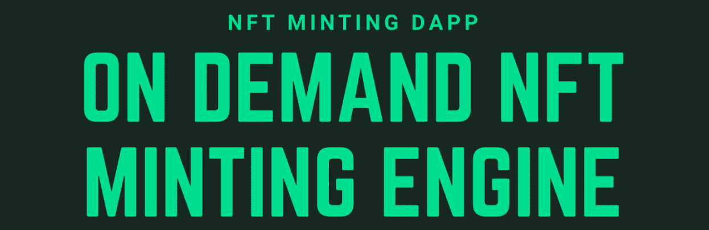
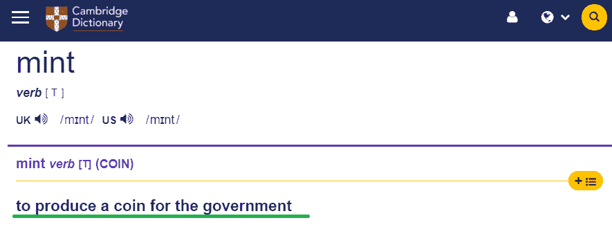
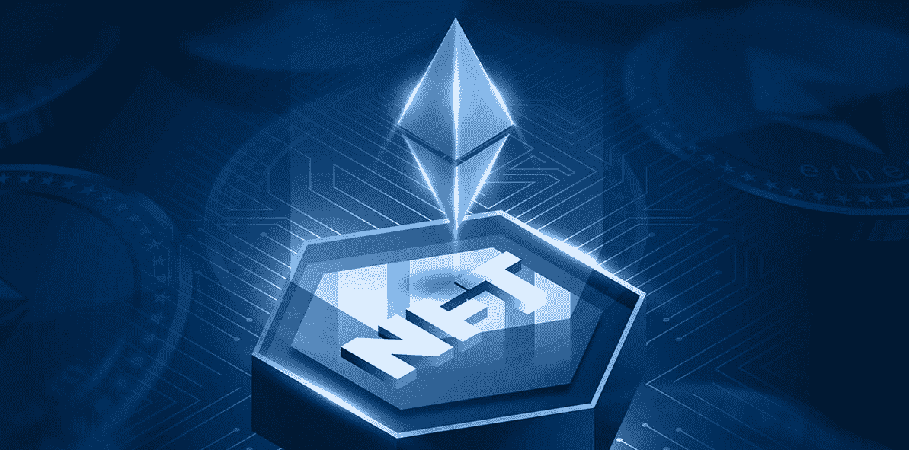
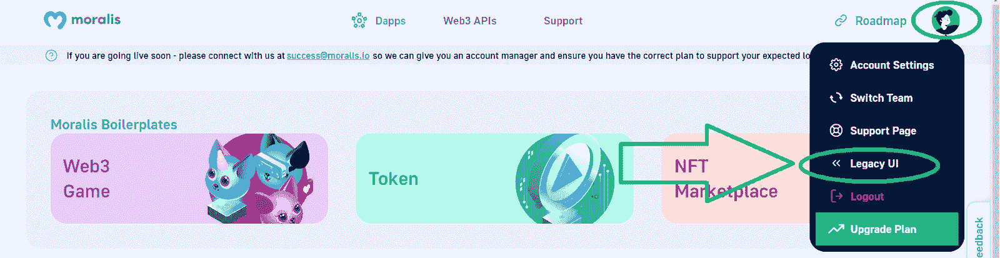
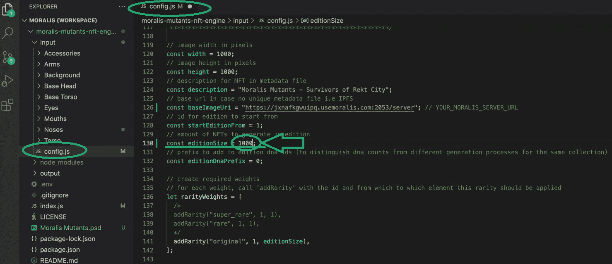
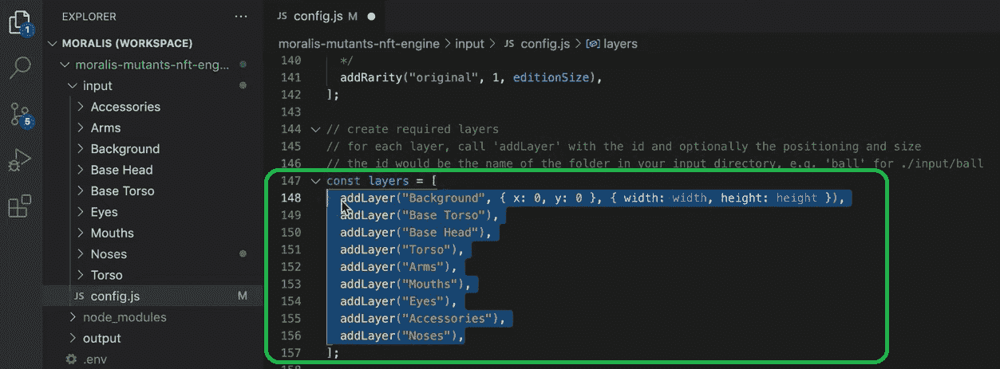
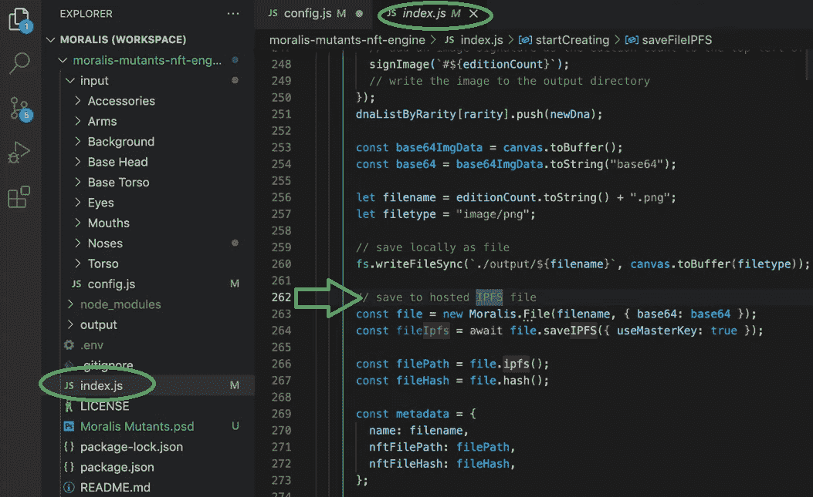
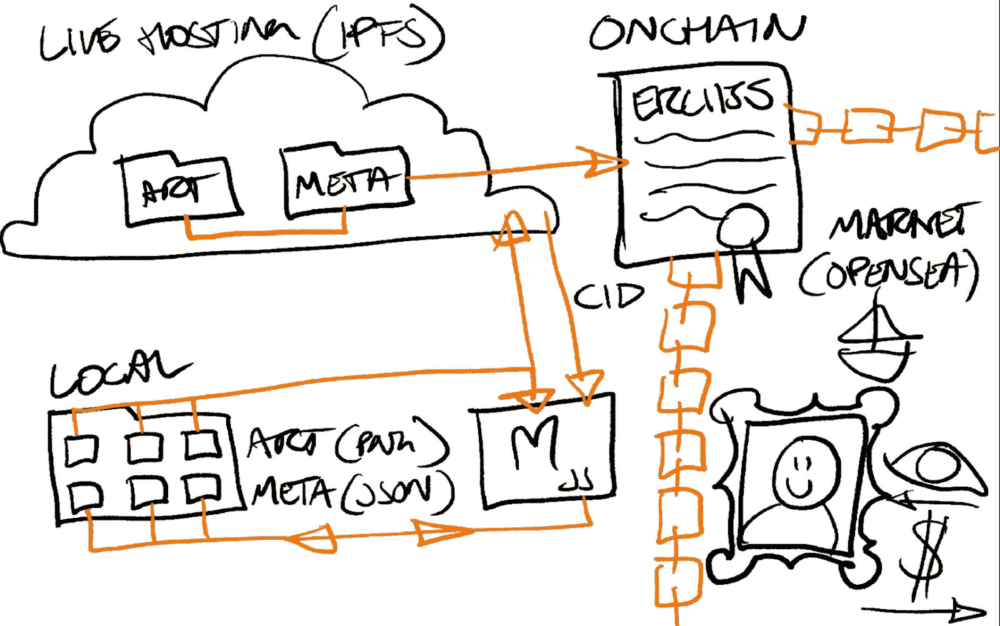
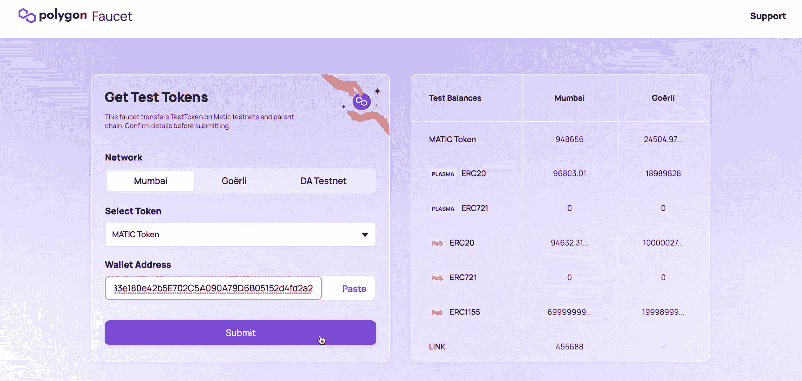
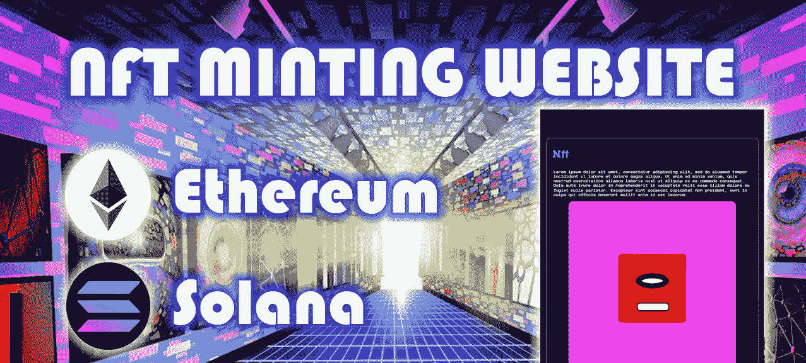

# 如何建立一个铸造 Dapp

> 原文：<https://moralis.io/how-to-build-a-minting-dapp/>

公平地说，NFT 已经席卷了全世界，似乎每个人每周都推出一个新的 NFT 系列。此外，在那个时候，人们不能总是使用一个铸造 dapp 来产生数千个 NFT。相反，这需要一些严肃的编程技巧。幸运的是，在过去的几年里，事情有了很大的进展。然而，我们不得不承认，到目前为止，事实上大多数炒作都围绕着 NFT 项目，这些项目并没有给世界带来任何重大价值。然而，我们喜欢将这些项目视为概念验证。NFTs 的真正效用还有待实现。这将彻底改变所有主要行业的游戏、证书发行和所有权。因此，学习如何建立一个 NFT 铸造 dapp 似乎是一个非常聪明的举动。幸运的是，它比大多数人想象的要简单得多。

诀窍在于使用正确的工具，这也是 [Moralis](https://moralis.io/) 登场的地方。这个最好的 Web3 后端平台为您提供了终极的 NFT API。此外，它还为 Web3 身份验证提供了简洁的解决方案，这是所有 dapps(分散式应用程序)的入口点。此外，Moralis 还专门为开发人员提供 Web3 同步，以便轻松索引区块链。此外，Moralis 是跨平台和跨链互操作的，这提供了无数的机会。而且，Moralis 最大的优点可能是它无缝地连接了 Web2 和 Web3。毕竟，JavaScript 或 Unity 的熟练程度加上一些 Web3 的基础知识是你开始工作所需要的。因此，为了以最简单的方式建立一个铸造 dapp，[创建你的免费 Moralis 账户](https://admin.moralis.io/register)并跟随我们。然而，在我们卷起袖子之前，让我们确保你知道什么是铸造 dapp。



## 什么是铸造 Dapp？

以太坊是第一个可编程的区块链，它催生了智能合约。这些链上程序是铸币的核心。然而，要理解什么是铸造 dapp，你需要知道 dapp 和铸造是什么。正如简介中指出的，“dapp”代表“分散式应用程序”，这是一种包含某种 Web3 功能的应用程序。换句话说，dapps 是让用户以某种方式与区块链互动的应用程序。dapp 可以是只读的，也可以允许用户执行事务，这是在区块链上存储数据的唯一方式。此外，dapps 可以是跨链的，这意味着用户可以在多个区块链之间切换，或者他们可以被限制到单个区块链。



如果我们现在把重点放在“铸造”上，你可能会认出这个术语是指发行实体硬币。当涉及某种冲压时，硬币被铸造出来。当代币(非本地硬币)出现时，链上采矿采用了这个术语。例如，在以太坊和其他 EVM 兼容链的情况下，这些是 ERC-20 代币。此外，如上所述，铸造是通过智能契约来完成的，智能契约是定义条件和满足这些条件时的动作的代码。为了部署智能合约，开发人员需要执行区块链事务。此外，铸造的细节取决于智能合约的细节。在某些情况下，一旦部署了智能合约，就可以执行令牌铸造。另一方面，可以通过执行某些链上事务来随意执行铸造。此外，当涉及到在 EVM 兼容链上制造 NFT 时，ERC1155 和 ERC721 标准设定了规则。

现在让我们把它们放在一起:铸造 dapp 是一个 Web3 应用程序，它使用户能够铸造可替换或不可替换的令牌。



# 构建批量铸造 Dapp–示例项目

两个最受欢迎的 NFT 收藏仍然是野猪猿游艇俱乐部(BAYC)和 CryptoPunks。这两者都围绕着 10，000 个独特生成的字符(个人资料图片)。因此，我们希望首先专注于做这类事情的铸造 dapp。

我们的一位内部专家创建了一个由三部分组成的系列，向您展示关于生成 NFT 您需要知道的所有内容。毕竟，你需要一些东西来创造。然而，技术部分是棘手的。至于 PNG 图像，你总是可以外包或与数字艺术家合作。

要独自完成这一壮举，您需要以下工具:

*   Moralis
*   代码编辑器(我们更喜欢 Visual Studio 代码[VSC])
*   照片编辑器(我们更喜欢 Adobe Photoshop)
*   MetaMask
*   再搅拌

在您进一步行动之前，我们还想强调从最终目标开始的重要性。你需要提前设想你的 NFTs。毕竟，批量铸造通常围绕着图像层被放在一起。因此，确定这些图像代表哪些部分具有足够数量的不同选项并正确堆叠它们是很重要的。此外，您还需要考虑 NFT 的总数，以及您是否希望某些 NFT 重复出现(它们的元数据是唯一的，但是它们的可视部分是相同的)。因此，确保你从适当的准备开始:


上图显示了生成 NFT 过程的关键阶段。然后，你需要在此基础上建立一个造币 dapp，我们会在底部的“如何创建 NFT 造币网站”一节中介绍。

### 生成 1，000 个 NFT–层和组件

可以想象，手动创建 1，000 张图像会花费大量时间。此外，人们似乎很欣赏计算机代码生成 NFTs 的艺术部分这一事实。然而，你仍然需要准备单独的组件(例如:背景、身体、衣服、眼睛、嘴巴、鼻子、配件等。).

如果您决定自己创建组件，可以使用 Photoshop，它使您能够将图层导出为文件:


另一方面，你可以去 Fiverr 或其他自由职业平台，雇人为你创建组件。话虽如此，让我们继续到编码部分，这是你作为一个开发人员无论如何都要关注的。

## 用 Moralis 创建 NFTs 三部分教程

如上所述，我们的一位内部专家就该主题制作了非常详细的视频教程。因此，我们鼓励你使用它们。下面列出的视频将向您展示从头开始生成 NFTs 到底需要什么。此外，这也是您将学习如何在 OpenSea 上列出生成的 NFT 的地方。然而，我们希望你能更进一步，甚至创造一个铸造 dapp。

尽管如此，为了节省大量时间，我们鼓励您使用我们的代码。你可以在 YouTube 上的视频描述中找到 GitHub 的所有链接。此外，我们鼓励您使用下面的视频概述来确定您是否要参加这些教程。

* * *

*如何生成 NFTs 视频–第一部分:*

https://www.youtube.com/watch?v=KBV4FrCv4ps

*如何生成 NFTs 视频–第二部分:*

https://www.youtube.com/watch?v=FcH7qXnOgzs

*如何生成 NFTs 视频——第三部分(Q & A):*

https://www.youtube.com/watch?v=32LHYSyv6Ko

* * *

### 创建文件生成机器-第一部分概述

第一部分(2:14)从用 Photoshop 创建艺术部分的所有细节开始。在这里，您可以学习将每个图层导出为单独的 PNG 文件。接下来，视频(4:48)向您展示如何利用我们的代码与 VSC。本质上，你可以配置你自己的 NFT 生成引擎。后者获取艺术组件(PNG 文件)并生成独特而完整的图像。这些图像将成为您的 NFTs 的可视部分。

从 6:00 开始，您将看到如何创建 Moralis 服务器，这是您获得 Moralis 强大功能的途径。

*注* *:视频教程是在新的 Moralis UI 发布之前创建的。但是，您仍然可以切换到传统用户界面:*



接下来，您将学习如何调整版本大小(6:28)，这将向您展示如何定义要生成的独特图像的总数。“config.js”文件对此负责:



*注意* *:生成的图像总数越大，需要保留唯一性的组件就越多。此外，图像数量越多，生成图像所需的时间就越长。*

NFT 生成引擎的关键组件之一是层的正确排列以及它们如何插入到数组中(6:53):



从 7:38 开始，您将把焦点转移到“index.js”文件上。这基本上是你的 NFT 发电引擎。它将编译这些层，并创建最终的 PNG 文件和元数据文件(JSON 文件)。“Index.js”还确保生成的文件上传到 IPFS。这是 Moralis 在其 IPFS 集成和 Moralis 数据库中涉及的另一个方面:



最后，您将执行“node index.js”命令，这将返回文件的路径。

### 用再混合铸造非功能性纤维——第二部分概述

如果您已经完成了第一部分中的步骤，现在您已经将图像和相应的元数据保存到了 IPFS。这些文件将是您的 NFTs 的核心；然而，在您创建您的 NFT 之前，这些文件只是文件。如果你没记错的话，你需要一份智能合约来铸造。此外，这也是您可以设置适当的铸造 dapp 以使用户能够铸造他们自己的 NFT 的部分。本质上，铸造 dapp 只需要触发你的智能合同，这将从 IPFS 获得文件，并生成一个 NFT。



从上面第二部分视频的 7:24 开始，你将学习如何铸造成千上万的 NFT。这是您将使用元掩码的地方。此外，您将关注 Polygon 的 testnet(孟买)(7:42)。但是，您可以在任何其他受支持的链上创建您的 NFT。您将学习如何获得一些“播放”提示(8:04):



8:54 开始，你会去混音。在那里，您可以粘贴我们的智能契约(代码在 GitHub 等着您)并应用一些基本的调整。您需要将“INSERT_YOUR_CID_METAHASH”部分替换为您上传的文件夹的 CID(可在您的 Moralis 仪表板中找到)。此外，要创建 1，000 个 NFT，您需要用一个适当的循环替换下面的代码:

```js
    {
        // account, token_id, number
        _mint(msg.sender, 1, 1, "");
        _mint(msg.sender, 2, 1, "");
        _mint(msg.sender, 3, 1, "");
    }
```

您希望循环遍历所有的 PNG 和 JSON 文件。代码准备就绪后，您将开始编译智能合约。最后，从 12:15 开始，您将学习如何部署您的合同，从而打造您的 NFTs:


### 如何创建一个 NFT 造币网站

正如承诺的那样，我们还想向您展示当您使用 Moralis 时，创建一个 [NFT 造币页面](https://moralis.io/how-to-launch-an-nft-minting-page-full-walkthrough/)是多么容易。当然，使用我们在 GitHub 上等待你的代码也是一个巨大的捷径。然而， [NFT 造币网站开发](https://nftcoders.com/create-an-nft-minting-website-in-5-steps/)的目的就是为用户创造一种简洁的方式来进行网上交易，从而实现造币。幸运的是，Moralis 的 NFT API 使您能够毫不费力地处理后端问题。因此，你需要投入时间和资源来创造最好的用户界面和 UX。



当然，您还需要创建和部署智能契约，您现在知道这是铸造的核心。然而，感谢像 OpenZeppelin、Remix 和 Hardhat 这样的工具，你不需要成为一个 Solidity 专家就可以做到这一点。如果你想专注于索拉纳，这不是一个 EVM 兼容链，Metaplex 将是一个工具，如果你不精通生锈。你可以在 Moralis 的博客上了解这些工具。然后，你可以使用 Moralis 家的 YouTube 频道上的教程将理论付诸实践。

尽管如此，这里有一个视频教程将向你展示如何创建一个 NFT 矿业网站，这只是一种特殊的造币 dapp:

https://www.youtube.com/watch?v=WdQHnb_5m5Q

## 如何建立铸造 Dapp 总结

如果你想创建一个铸造 dapp，这个过程不仅仅是 UI。事实上，在这里你可以了解到，铸造 dapp 本质上只是一个顶部的樱桃。尽管如此，一颗非常重要的樱桃。

本质上，我们带你经历了可收集的 NFT 背后的整个过程，其中你通常需要生成数千个 NFT。

因此，您现在知道您需要从适当的规划开始，这有助于您确定想要创建的 NFT 的种类。记住这一点，您就能够确定您需要什么组件。然后，你可以使用 Photoshop 或类似的程序来生成必要的 PNG 文件，或者你可以外包艺术部分。准备好 PNG 组件后，您需要创建一个机器来生成最终的 PNG 和相应的元数据。此外，该机器还将生成的文件上传到分散的存储系统。另一个难题是一个合适的智能契约，它将执行铸造并实际铸造 NFT。只有在您成功上传文件并部署智能合约之后，您才能创建一个 minting dapp。而且，你现在知道 Moralis 帮助你把一切联系在一起。

如果你想探索其他区块链发展教程，一定要访问 Moralis 家的 YouTube 频道和 Moralis 家的博客。这也是免费成为 Web3 开发者的好方法。然而，如果你想尽快成为全职加密员，获得区块链认证可能是明智之举。如果你感兴趣，一定要去看看[Moralis 学院](https://academy.moralis.io/)。