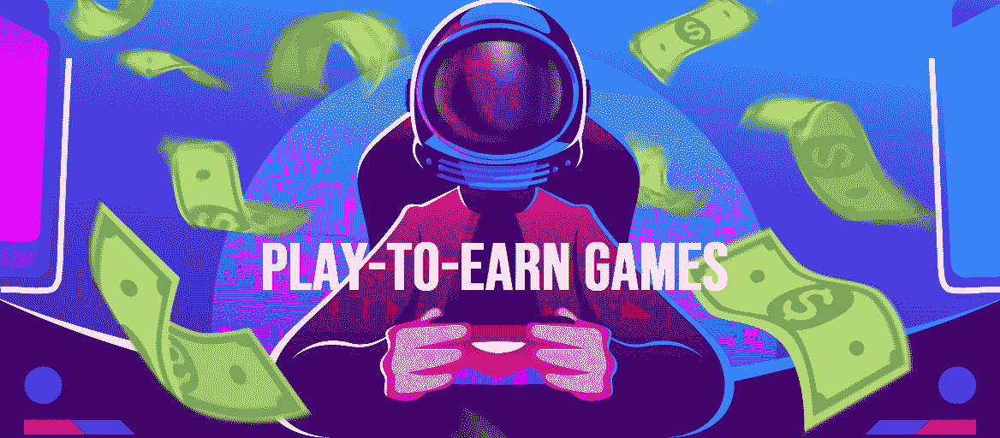
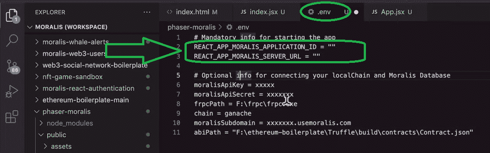
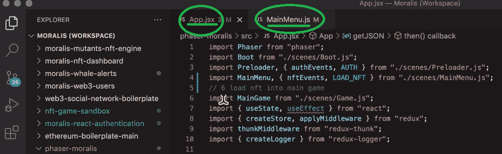
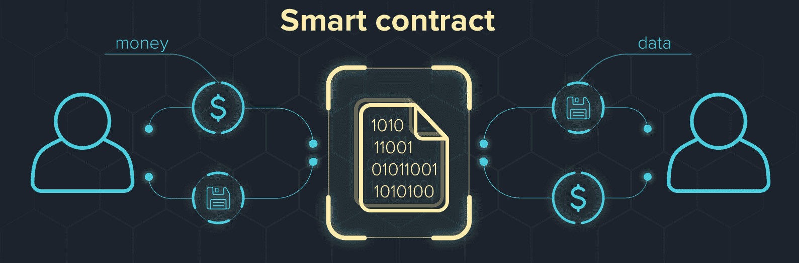
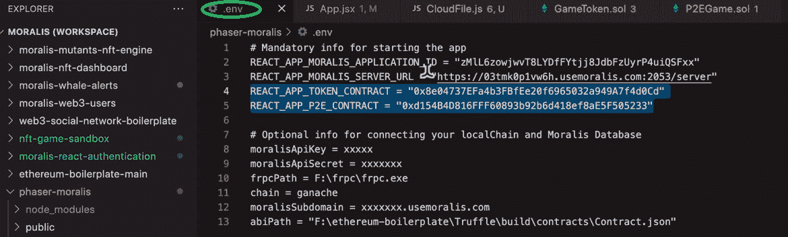
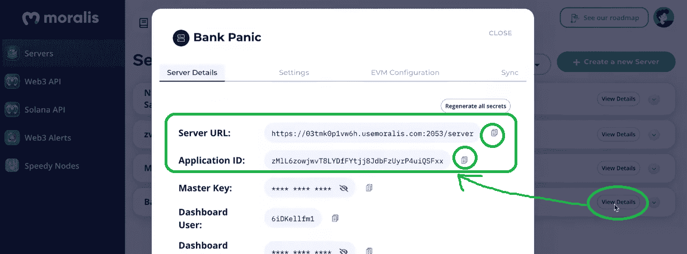
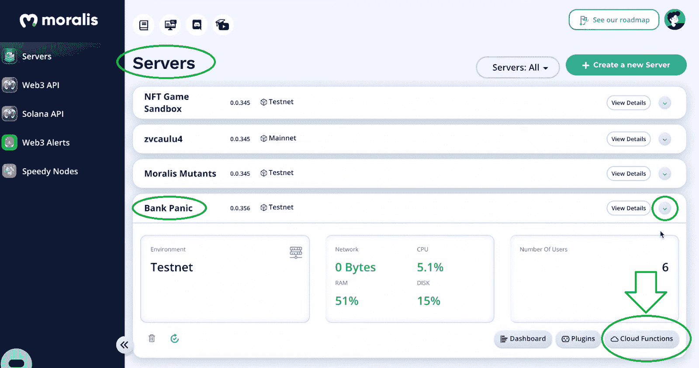
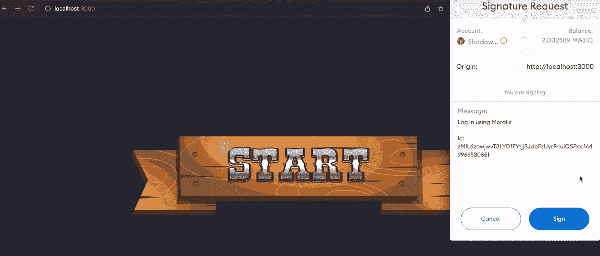

# 如何建立一个玩赚(P2E)游戏

> 原文：<https://moralis.io/how-to-build-a-play-to-earn-p2e-game/>

如果你有合适的工具，开发一款“玩赚即赔”( P2E)游戏会很容易。有了正确的工具，你可以通过简单的四个步骤开发出一款前沿的 P2E 游戏。在下面的指南中，我们概述了创建一个玩即赚游戏的所有必要步骤，包括如何:

1.  **打造一款 2D Web3 游戏**
2.  **合并 NFT**
3.  **建立一个智能合同来运行一个 P2E 游戏**
4.  **整合 Moralis 和智能合同**

*注意:以下说明简要解释了创建一款“玩即赚”( P2E)游戏需要什么。因此，我们鼓励您观看每个部分中列出的视频。在每一个视频中，我们内部的 Moralis 专家将向您更详细地解释如何构建一个 P2E 游戏。*

在本文中，您将学习如何使用 Phaser 和 Moralis 构建一个“玩赚”游戏。前者是一个开源的工作室游戏引擎，提供各种游戏元素甚至整个游戏。然而，[Moralis 规范](https://moralis.io/)使得 Web3 的发展如丝般顺畅。这个“ [Firebase for crypto](https://moralis.io/firebase-for-crypto-the-best-blockchain-firebase-alternative/) ”平台是最好的 Web3 开发平台，可以让精通 [JavaScript](https://moralis.io/javascript-explained-what-is-javascript/) 的开发人员创建杀手级应用程序。Moralis 还具有跨链和跨平台的互操作性。因此，它提供了无数的机会。 [Moralis SDK](https://moralis.io/exploring-moralis-sdk-the-ultimate-web3-sdk/) 配备了全面的工具和集成，可以满足您所有的后端需求。因此，您可以轻松地[同步和索引智能合约事件](https://moralis.io/sync-and-index-smart-contract-events-full-guide/)，进而[索引区块链](https://moralis.io/how-to-index-the-blockchain-the-ultimate-guide/)。最重要的是，Moralis 还通过其 [web3uikit](https://moralis.io/web3ui-kit-the-ultimate-web3-user-interface-kit/) 和 [Web3 样板](https://moralis.io/web3-boilerplate-beginners-guide-to-web3/)提供前端快捷方式。所以，如果你想不费吹灰之力或不花一大笔钱就能开发一款游戏，确保[创建你的免费 Moralis 账户](https://admin.moralis.io/register)。



## 建立一个玩赚(P2E)游戏-示例项目

在继续之前，我们必须指出，本文围绕着一个正在进行的跨越多个部分的示例项目。我们在一个多月前开始了最新的一个，并且已经完成了前三个部分。在第一部分中，我们使用 Phaser 和 Moralis 创建了一个简单的 [2D Web3 游戏](https://moralis.io/how-to-build-a-2d-web3-game-full-guide%ef%bf%bc/)。在我们“建立一个玩赚游戏”任务的第二部分，我们关注于[的 NFT 能量](https://moralis.io/develop-a-web3-game-with-nft-power-ups-in-9-minutes/)。此外，我们举例说明了如何将 Web3 游戏的访问权限只授予特定 NFT 的所有者([不可替换令牌](https://moralis.io/non-fungible-tokens-explained-what-are-nfts/))。在我们任务的第三部分，我们关注于 [Web3 契约](https://moralis.io/what-are-web3-contracts-exploring-smart-contracts/) ( [智能契约](https://moralis.io/smart-contracts-explained-what-are-smart-contracts/))来涵盖游戏经济。我们使用 ERC-20 合约来创建示例可替换代币，我们的 P2E 游戏使用了这些代币。此外，我们创建了另一个[元宇宙智能合同](https://moralis.io/metaverse-smart-contract-how-to-build-a-metaverse-game-smart-contract/)。这样可以确保奖励和代币得到妥善处理。

这也把我们带到了示例项目的下一部分，我们将在这里重点讨论。我们的任务是将这些智能合约整合到我们的“银行恐慌”游戏中。当然，我们将使用 Moralis 在几分钟内毫不费力地完成这项工作。


*注意* *:对于那些渴望自己完成前面三个步骤的人，一定要看看“赶上”部分。在那里，你可以找到前三部的所有视频教程。此外，我们还包括一些解释和时间戳，以进一步帮助你在“建立一个玩赚(P2E)的游戏任务”。另一方面，如果您一直关注我们的进展，请随意跳过这些部分。*

## 创建一个先玩后赚的游戏——迎头赶上

如上所述，在这里你可以找到你需要知道的关于我们正在进行的项目的一切。为了更加方便，我们将这一部分分成了三个部分，如上面的注释所述。此外，这里还有 GitHub 上我们示例项目代码的链接:[https://github.com/ashbeech/moralis-phaser-demo](https://github.com/ashbeech/moralis-phaser-demo)。

### 第 1 部分–制作一个 2D Web3 游戏

如果你想制作与我们制作的 2D Web3 游戏相同或相似的游戏，你必须完成第一个视频，在视频中，Moralis 专家展示了如何完成初始设置，以及如何使用 Phaser 来完成 2D 游戏。因此，你将有一个功能的 2D 游戏准备在任何时候。接下来，您将在 Moralis 的 SDK 的帮助下开始添加 Web3 特性。此外，您的主要目标是将 [Web3 认证](https://moralis.io/web3-authentication-the-full-guide/)添加到 Phaser 示例游戏中。

首先，您将使用 Visual Studio 代码(VSC)终端和" [index.jsx](https://github.com/ashbeech/moralis-phaser-demo/blob/main/src/index.jsx) "文件导入 React-Moralis。然后，您将添加一个标准的“应用程序”功能(下面的第一个视频，从 12:05 开始)。您还将学习如何使用”。env "文件输入您的 Moralis 服务器的详细信息:



您需要完成初始的 Moralis 设置(13:15)并创建一个 Moralis 服务器来完成这一部分。此外，您将经历以下步骤:

1.  创建您的免费 [Moralis 账户](https://admin.moralis.io/register)或[登录](https://admin.moralis.io/login)您现有的账户。
2.  登录后，[在“Servers”选项卡中创建一个 Moralis 服务器](https://docs.moralis.io/moralis-dapp/getting-started/create-a-moralis-dapp#2.-create-a-moralis-server)。
3.  访问您的服务器的详细信息并复制它们。
4.  将服务器 URL 和应用程序 ID 粘贴到您的”。env "文件。

接下来，您将对“index.jsx”文件(14:10)进行额外的调整。然后，您将在“[app . jsx](https://github.com/ashbeech/moralis-phaser-demo/blob/main/src/App.jsx)”(14:36)中添加 React-Moralis 函数。这样，你就可以用元掩码对[进行认证。总结第一部分，您将在 15:13 看到 Redux。后者将从你的示例游戏向你的](https://moralis.io/how-to-authenticate-with-metamask/) [React](https://moralis.io/react-explained-what-is-react/) 钩子发送事件，反之亦然。

视频第一部分

https://www.youtube.com/watch?v=Z4dWavvyhbA

### 第 2 部分–整合非功能性测试

*注意* *:我们的“建立一个玩赚游戏”项目的这一部分并不重要，因为我们不会在这个功能的基础上继续发展。然而，这是一个很好的方式来了解 NFT 的力量，以及如何将 NFTs 融入到 P2E 游戏中。*



要继续学习视频教程的第二部分，请确保您已经完成了第一部分。当然，如果你想专注于 [NFT 实用程序](https://moralis.io/nft-utility-exploring-nft-use-cases-in-2022/)，你也可以使用上面的 GitHub 链接并克隆代码。0:55 开始，您将有机会看到您需要添加到“App.jsx”和“ [MainMenu.js](https://github.com/ashbeech/moralis-phaser-demo/blob/main/src/scenes/MainMenu.js) ”的详细信息。Moralis 专家非常友好地在代码中用注释标记了这些添加的内容。此外，在这里您将学习如何利用“getNFTBalances”来检查用户钱包中的相关 NFT。此外，您将学习如何使 NFTs 的元数据可呈现。最后，您将看到如何利用用户的 NFTs 来个性化游戏中主菜单的背景。

**视频第二部分**

https://www.youtube.com/watch?v=D-KW4_FgYj0

### 第 3 部分-建立一个智能合同来运行一个 P2E 游戏

如果你想开发一款游戏，你必须处理好智能合约。他们运行并平衡我们 P2E 游戏的经济，如果你想让你的游戏成功，这必须是公平的。幸运的是，这并不意味着你需要成为一名[可靠性](https://moralis.io/solidity-explained-what-is-solidity/)专家。有了像 [OpenZeppelin](https://moralis.io/what-is-openzeppelin-the-ultimate-guide/) 和 [Remix](https://moralis.io/remix-explained-what-is-remix/) 这样的工具，你就能以最小的阻力满足你的智能合约需求。



我们的目标是最终让游戏“免费玩”。尽管如此，我们将从要求玩家下注少量代币开始，因为这会使游戏的经济性更简单。赌注将给予玩家玩游戏的权利，并且对平衡我们游戏的经济非常重要。在第三部分视频的开始，您将看到一个包含代币的示例游戏的演示。然后，在 1:26，Moralis 专家解释了我们的示例游戏的经济方面。此外，我们保持事情相对简单。本质上，赢得游戏的玩家可以收集赌注代币以及在游戏中赢得的代币。然而，如果他们输了，游戏的金库会收集他们的赌注代币。从 1:59 开始，您可以看到如何使用[元掩码](https://moralis.io/metamask-explained-what-is-metamask/)来添加帐户。

在 2:28，你开始学习如何使用 [Mumbai testnet 龙头](https://moralis.io/mumbai-testnet-faucet-how-to-get-free-testnet-matic-tokens/)和 Polygon 龙头来获得一些“玩”自动代币。你需要这些硬币在 Polygon 的 testnet(孟买)上部署智能合约。然后，你将仔细看看我们的两个示例合同(3:11)。“ [P2EGame.sol](https://github.com/ashbeech/moralis-phaser-demo/blob/main/src/contracts/P2EGame.sol) ”契约负责游戏币在游戏中的流动，而“ [GameToken.sol](https://github.com/ashbeech/moralis-phaser-demo/blob/main/src/contracts/GameToken.sol) ”则负责铸造我们游戏的游戏币。最后，您将使用 Remix 来部署合同。

**视频第三部分:**

https://www.youtube.com/watch?v=1_qCiL0qajs

## 第 4 部分-整合 Moralis 和智能合同

在这一点上，你们应该都已经掌握了第 1-3 部分的内容。然而，如果你没有时间完成前面所有的步骤，你可以从 GitHub 克隆代码。后者链接在“建立一个游戏赚取-赶上”一节。当然，您还需要部署两个智能契约，如第三部分所示。因此，您将获得他们的合同地址，您必须将其粘贴到”。env "文件:



查看上面的截图，您可以看到您还需要您的 Moralis 服务器的详细信息。如果您需要这一步的帮助，请在 0:40 使用下面的视频:



### 使用 Moralis 云函数

从 1:00 开始(下面的视频)，Moralis 专家开始解释如何使用 Moralis 的云功能来构建一个“玩赚”游戏。要从 Moralis 访问此功能，请登录到您的 Moralis 管理区，并导航到“服务器”选项卡。在那里，单击服务器名称旁边的箭头以查看更多选项。然后，您可以点击“云功能”按钮:



在“云函数”功能内部，需要粘贴来自“ [CloudFile.js](https://github.com/ashbeech/moralis-phaser-demo/blob/main/src/components/Cloud/CloudFile.js) 的内容。此外，这一行代码定义了玩家获胜时要使用的函数:

```js
Moralis.Cloud.define("playerWon", async (request) =>
```

上面的函数调用 P2E 契约，它通过链上交易分配奖金。因此，合同地址也必须包含在我们的代码中:

```js
const p2e_contract_address = "0x7053c8dB1c4ED4C96c47E322A8517BcAeE4ECaE5";
```

*注意:确保在部署合同后使用您从 Remix 获得的地址。这同样适用于合同的 ABI。*

对于我们的云函数的更详细的代码演练，请使用下面 1:28 开始的视频。此外，“Moralis。“App.jsx”文件中的 Cloud.run()”确保我们的示例游戏正确使用云函数。因此，云功能触发了链上交易。

然而，在“游戏令牌”合同的情况下，玩家通过 Moralis 的 API (3:00)直接与之交互。我们使用“useWeb3ExecuteFunction()”函数来调用“批准”。这确保了只有具有赌注代币的玩家才能进入游戏。

最后，我们鼓励您查看我们的示例 P2E 游戏的最终演示，第 1-4 部分已经完成(3:54)。

视频第四部分:[https://www.youtube.com/watch?v=h31YcNgAIUw](https://www.youtube.com/watch?v=h31YcNgAIUw)

#### 下一步是什么？

为了使大腿尽可能整齐，我们将在接下来的教程中继续这个示例项目，在 Phaser 场景中创建用户界面。这样，我们将创造一个丰富的 UX，这是游戏成功的关键。我们即将推出的教程也将探讨如何防止作弊。因此，我们将介绍如何从链外真实数据中产生有效的链内共识的技术。所以，一定要保持关注！



## 如何创建“玩即赚”游戏——总结

在这篇文章中，我们首先快速介绍了“如何构建一个游戏赚取”任务的前三个部分。然后，我们通过集成 Moralis 和智能契约来关注最后一步。简而言之，开发一款“玩即赚”( P2E)游戏的步骤如下:

1.  **打造一款 2D Web3 游戏**
2.  **合并 NFT**
3.  **建立一个智能合同来运行一个 P2E 游戏**
4.  **整合 Moralis 和智能合同**

在这个过程中，你必须学会如何使用 Remix、Moralis 和 Moralis 的云功能。最后，我们通知您，未来的教程即将推出，您可以在其中总结这个示例项目。因此，我们希望你期待创造一个令人敬畏的 [Web3 UI](https://moralis.io/web3-ui-how-to-create-a-great-dapp-ui/) 并实施反作弊措施。

如果你认为我们的“建立一个游戏赚钱”示例项目很有趣，我们鼓励你访问[Moralis 的 YouTube 频道](https://www.youtube.com/c/MoralisWeb3)和[Moralis 的博客](https://moralis.io/blog/)。在那里，你会找到大量其他优秀的教程和区块链开发主题。例如，一些最新的文章涵盖了如何创建一个没有元掩码的[币安 NFT](https://moralis.io/how-to-create-a-binance-nft-in-5-steps/) ，[Web3](https://moralis.io/web3-without-metamask-web3-authentication-alternatives/)替代品，[以太坊名称服务](https://moralis.io/what-is-ethereum-name-service-full-ens-guide/) (ENS)，如何[声明一个游戏内的 NFT](https://moralis.io/how-to-claim-an-in-game-nft-full-guide/) ，[将 web 3 钱包连接到一个 Twitter 账户](https://moralis.io/connecting-web3-wallet-to-twitter-account/)，等等。然而，如果你更喜欢 Web3 游戏，从我们的《Unity Web3 编程入门指南》开始吧。这样，你将学会如何充分利用 [Moralis 的元宇宙 SDK](https://moralis.io/metaverse/) 。

我们还建议您学习如何[存储链外数据](https://moralis.io/how-to-store-off-chain-data-unity-web3-database/)以及如何[与 Unity 的 Web3 数据库](https://moralis.io/how-to-communicate-with-a-web3-database-from-unity/)通信。此外，你还可以[将一个 Unity 应用程序连接到一个 Web3 钱包](https://moralis.io/how-to-connect-a-unity-app-to-a-web3-wallet/)，并用 Unity 进行[区块链交易。尽管如此，如果你渴望成为一名专业的 Web3 开发者，你应该报名参加 Moralis 学院。](https://moralis.io/how-to-do-blockchain-game-transactions-with-unity/)