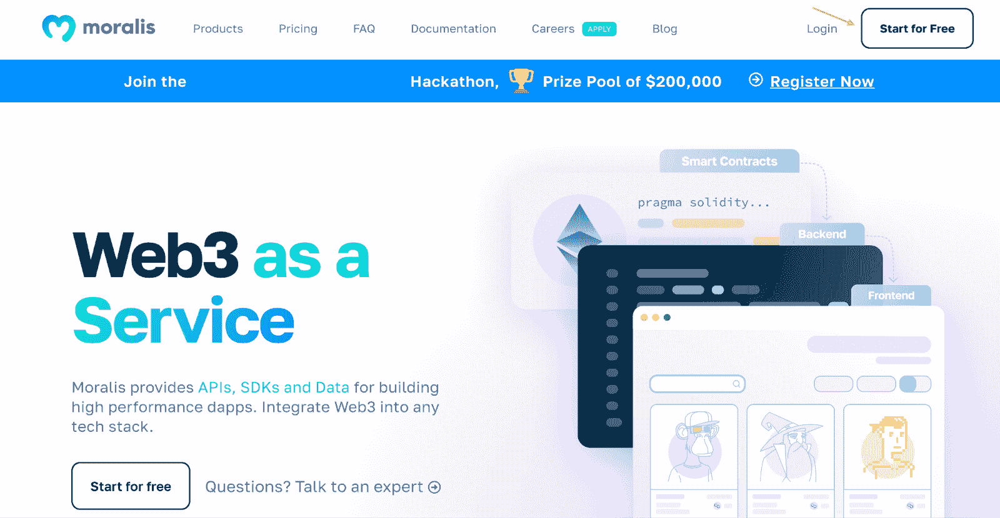

# 如何通过 3 个步骤构建多边形 Dapp

> 原文：<https://moralis.io/how-to-build-a-polygon-dapp-in-3-steps/>

由于以太坊的拥塞问题，一个突出的 Web3 开发替代方案是多边形网络。Polygon 有助于降低交易成本并提供更高的可伸缩性。也就是说，你知道吗，多亏了 [Moralis](https://moralis.io/) ，你只需要三个步骤就可以构建一个多边形 dapp？如果这引起了你的兴趣，请继续阅读并发现创建多边形兼容 dapps 的最简单方法！此外，如果您想跳过本教程，可以在下面的 GitHub 资源库中找到 dapp 的完整代码:

**完整以太坊样板文档—**[**https://github . com/以太坊-样板/以太坊-样板**](https://github.com/ethereum-boilerplate/ethereum-boilerplate)

本教程将向你展示如何建立一个多边形 dapp 的三个步骤。dapp 将允许用户用他们的 Web3 钱包登录，并访问他们的交易历史等信息。该过程的可访问性部分源于 Moralis 的以太坊样板，我们将在本指南中使用它。然而，这可能有点令人困惑；一个搭建多边形 dapp 的以太坊模板？嗯，您应该使用 Moralis 的一个突出原因是该平台是跨链兼容的。因此，您可以使用这个样板文件为任何 [EVM](https://moralis.io/evm-explained-what-is-ethereum-virtual-machine/) 系统构建 dapps，包括 Polygon！

结合以太坊样板，额外的 Moralis 工具有助于这个过程的可访问性。例如，Moralis 的[认证 API](https://docs.moralis.io/reference/auth-api-overview) 使得[的 Web3 认证](https://moralis.io/authentication/)更容易访问。此外，这允许你很容易地集成 [EIP-4361](https://moralis.io/exploring-eip-4361-sign-in-with-ethereum/) 兼容的认证方法，模板的特点。

因此，如果你有雄心建立一个多边形 dapp，你应该立即与 Moralis 签约。几秒钟就可以创建一个账户，而且完全免费！

## 什么是多边形 Dapp？

“什么是多边形 dapp？”相对简单。简而言之，它是一个建立在多边形网络上的 dapp(去中心化应用)。但是，如果您不熟悉 dapps 和多边形，这没有多大意义。因此，我们将利用这一部分来解释这两个概念，从 dapps 开始。


Dapps 与传统应用程序非常相似，因为它们实现了许多相同的功能。然而，Web2 应用程序和 dapp 之间最显著的区别是，后者是建立在 P2P(点对点)区块链网络上的。此外，这意味着 dapps 配备了区块链和 Web3 功能。此外，分散化通常是 dapps 的普遍特征，这提供了几个好处。例如，去中心化消除了 Web2 生态系统中普遍存在的“单点故障”。因此，dapps 提供了更高程度的安全性，因为用户更难实施欺诈行为，黑客也更难访问用户数据。

对 dapps 有了更好的理解，我们可以继续探索多边形网络的复杂性。Polygon 是以太坊所谓的“缩放解决方案”或“缩放平台”。Polygon 专注于可扩展性和低交易费用，提供比以太坊更经济友好的平台。更重要的是，作为一个扩展平台，网络可以实现更低的费用和更高的可扩展性，同时不会牺牲以太坊链的安全性。


因此，Polygon dapp 本质上是构建在以太坊扩展平台上的应用程序。这意味着多边形 dapps 功能强大，可以轻松采用基于区块链的功能。

随着对什么是多边形 dapp 有了更好的理解，我们可以进一步演示如何只通过三个步骤来构建多边形 dapp！

## 分 3 步建立一个多边形 Dapp

在接下来的几节中，我们将向您展示构建多边形 dapp 的最简单快捷的方法。为了使这个过程尽可能容易理解，我们将使用 Moralis 的以太坊样板。该模板允许您减少不必要的开发时间，因为您可以避免重新发明轮子。因此，您有机会使用样板的基本结构作为您未来项目的基础，并在市场竞争中胜出！

多亏了样板文件和额外的 Moralis 工具，您可以通过以下三个步骤构建多边形 dapp:

1.  克隆以太坊样板文件
2.  配置环境变量
3.  启动多边形 Dapp

然而，在我们深入本指南的第一步之前，我们将通过下面的部分来展示我们的目标。因此，我们将更详细地探讨 dapp 的功能。

此外，如果你更想看一段解释本指南步骤的视频，可以看看下面这个来自[Moralis YouTube 频道](https://www.youtube.com/c/MoralisWeb3)的视频:

https://www.youtube.com/watch?v=Bb5Pc–kyAY

## 以太坊样板功能–构建多边形 Dapp 的最快方法

本节将展示 Moralis 以太坊样板的功能。通过探索该模板，您将更好地了解我们的工作目标。然而，这将是任何启动 dapp 的人的登录页面:


如图所示，在顶部的导航栏中有几个选项可供选择。dapp 在界面顶部有四个选项卡:“主页”、“交易”、“转账”和“余额”。除了这些不同的标签，您还可以在右上角找到一个“连接钱包”按钮:


在您与 dapp 的其他选项卡交互之前，您需要使用此按钮进行身份验证。如果你点击“连接钱包”，这应该会提示你的元掩码钱包，并允许你签署一个消息。一旦您确认了您的 [Web3 身份](https://moralis.io/web3-identity-the-full-guide-to-authentication-identity-and-web3/)，dapp 将自动获取[链上数据](https://moralis.io/on-chain-data-the-ultimate-guide-to-understanding-and-accessing-on-chain-data/)，并使用您的用户信息填充其他选项卡。例如,“事务”选项卡可能是这样的:


上表包含几条信息。例如，您可以看到交易散列、地址、交易日期等。当您构建多边形 dapp 以提供更愉快的用户体验时，这些信息可能是必不可少的。

其他“转账”和“余额”选项卡也有下拉菜单，允许您在 ERC-20 代币和 NFT 之间切换。例如，当点击“余额”时，它看起来是这样的:


此外，例如，如果你点击 NFT 选项，它将显示钱包中包含的所有非功能表:


除了这些基本功能，dapp 还具有黑暗模式。因此，您可以通过点击右上角的按钮在暗模式和亮模式之间切换:


## 如何构建多边形 Dapp

既然您已经发现了以太坊样板文件的复杂性，并且对我们的最终产品有了更深刻的理解，我们将继续核心部分，并解释如何构建多边形 dapp。所以，事不宜迟，让我们直接进入主题，了解如何将 Moralis 的以太坊样板文件克隆到您的本地存储库中！

### 步骤 1–克隆以太坊样板文件

要构建多边形 dapp，首先需要克隆以太坊样板。因此，您可以从导航到我们在文章中最初链接的 GitHub repo 开始。单击链接后，您可以通过单击绿色的“代码”按钮并复制回购 URL 来继续操作:


从那里，您必须打开您首选的 IDE(集成开发环境)并创建一个新文件夹。在我们的例子中，我们将使用 VSC (Visual Studio 代码)并将文件夹命名为“样板文件”。如果您喜欢使用另一个 IDE，这很好；但是，过程可能会有所不同。

然而，随着 IDE 的打开和文件夹的使用，您需要打开一个新的终端。对于 VSC，您可以点击界面顶部的“终端”选项卡，然后点击“新建终端”:


使用新的终端，您可以使用之前获取的链接，通过以下命令克隆 GitHub repo。此外，确保在与刚刚设置的文件夹相对应的正确位置运行该命令:

```js
git clone “BOILERPLATE_URL”
```

从那里，您需要导航到该文件，这可以通过以下命令来完成:

```js
cd ethereum-boilerplate
```

在适当的位置运行这些命令应该会得到如下所示的结构:


GitHub repo 克隆完成后，您可以进入第二步，我们将配置一些环境变量！

### 步骤 2–配置环境变量

在配置必要的环境变量之前，您需要一个 Moralis 帐户。因此，如果您还没有，您可以访问 Moralis，点击“免费开始”，并填写必要的信息:



有了您的帐户，我们可以继续第二步，如何构建一个多边形 dapp 并配置必要的环境变量。因此，您可以导航回您的 IDE，并在 repo 中找到“. env.local.example”文件。该文件将包含以下五个变量:


#### 多边形开发的可变配置

所以，让我们一个一个地分解变量，仔细看看你需要考虑的必要配置。首先，您有一个“ *APP_CHAIN_ID* ”变量，最初设置为“ *0x1* ”。这是区块链以太坊的 ID。然而，由于这是一个如何构建多边形 dapp 的指南，您需要改变这个变量。此外，由于这是一个教程，我们仍处于开发阶段，我们将选择多边形孟买测试网。相应地，您可以将“ *APP_CHAIN_ID* ”更改为等于“ *0x13881* ”，它对应于多边形孟买链 ID。

第二个变量“ *APP_DOMAIN* ”可以保持不变。然而，第三个变量，称为“*Moralis _API_KEY* ”，是您需要考虑的一个变量。这个变量需要等于您的 API 键。要获得密钥，请登录 Moralis，点击“Account ”,导航到“Keys”选项卡，并点击 Web3 API 密钥的复制按钮。你需要做的就是将变量设置为这个值。


接下来，您必须向变量“ *NEXTAUTH_SECRET* 添加一个值。您可以使用以下链接生成一个号码:【https://generate-secret.now.sh/32[。](https://generate-secret.now.sh/32)

最后，你还有最后一个“ *NEXTAUTH_URL* ”变量，目前等于“ [http://localhost:3000](http://localhost:3000/) ”。由于您仍处于开发阶段，因此您可以暂时保留这个版本。这允许您在本地主机上运行 dapp，并在安全的环境中测试它。然而，一旦您计划启动 dapp，您需要更改这个值以适合您的 dapp 的 URL。

这就是可变构型。剩下的就是将文件重命名为" . env.local "，最终的内容应该是这样的:

```js
APP_CHAIN_ID=0x13881
APP_DOMAIN=ethereum.boilerplate 
MORALIS_API_KEY= "YOUR_API_KEY"
NEXTAUTH_SECRET= b8e786967d7bcbc0f920d35bcc3f891c
NEXTAUTH_URL=http://localhost:3000
```

### 步骤 3–启动多边形 Dapp

现在我们已经配置了环境变量，剩下的就是启动应用程序了。但是，在这样做之前，您需要安装一些依赖项。这相对简单，您只需在终端中输入以下命令之一:

```js
npm i
yarn
```

从那里，您可以使用以下任一选项启动应用程序:

```js
npm run dev
yarn run dev
```

这将启动 Polygon dapp，它将在本地主机 3000 上运行。可以通过上一步指定的 URL 启动 dapp:[http://localhost:3000](http://localhost:3000/)。

这就是关于如何构建多边形 dapp 的简要指南。从这里开始，您可以使用此模板作为您未来 dapps 的基础。所以，现在由你来实现额外的功能或删除那些你认为不必要的功能！

如果你想为你的第一个项目寻找灵感，可以考虑看看 Moralis 的博客。例如，你可以了解不同的[类型的 Dao](https://moralis.io/full-2022-guide-to-different-types-of-daos/)或[区块链 syncs](https://moralis.io/blockchain-syncs-exploring-on-chain-syncing/) ，这对你未来的区块链发展努力会有帮助。

此外，考虑检查额外的 Moralis 工具。例如，该平台使得实现 [Web3 流](https://moralis.io/streams/)或创建 [Web3 webhooks](https://moralis.io/web3-webhooks-the-ultimate-guide-to-blockchain-webhooks/) 变得容易。然而，这些只是 Moralis 如何提供更无缝的开发者体验的几个例子。因此，如果你想成为一名区块链开发者，请立即注册 Moralis！

## 如何构建多边形 Dapp–摘要

本文主要介绍如何使用以下三个步骤构建多边形 dapp:

1.  克隆以太坊样板文件
2.  配置环境变量
3.  启动多边形 Dapp

这个过程的可访问性源于 Moralis 的以太坊样板，这是构建 Web3 应用程序的最快方式[。此外，由于 Moralis 具有跨链兼容性，因此可以使用该模板为所有 EVM 兼容的区块链构建 dapps，包括 Polygon！](https://moralis.io/fastest-way-to-build-a-web3-app/)


更重要的是，甚至可以使用 Moralis 的以太坊样板来为 Solana 网络创建 dapps。所以，如果你对 [Solana 编程](https://moralis.io/solana-programming-the-ultimate-guide-to-solana-development/)特别感兴趣，我们建议你仔细看看 Moralis 的 [Solana API](https://docs.moralis.io/reference/solana-api) 。这个工具允许你为 Solana 创建复杂的 dapps 和 Web3 项目。

此外，如果你正在寻找建立一个多边形 dapp 或 Solana 网络项目，这并不重要；Moralis 将在所有这些过程中提供帮助。因此，您应该[立即注册 Moralis](https://admin.moralis.io/register) 并享受更加无缝的开发者体验！