# 如何建立预测市场 dApp

> 原文：<https://moralis.io/how-to-build-a-prediction-market-dapp/>

下注并试图预测市场走向非常流行。此外，预测市场已经存在了几千年，很少被公平地设定。但现在，随着区块链技术的正确实施，完全透明和适当的机会可能会到位。因此，有史以来第一次，预测市场可能真的如其所愿——一场公平的机会游戏。而且从以往的情况来看，这类应用的需求将是巨大的。因此，知道如何建立预测市场 dApp 的开发商面临着光明和突出的未来。

此外，虽然建立一个预测市场 dApp ( [分散应用](https://moralis.io/decentralized-applications-explained-what-are-dapps/))可能听起来令人生畏，但我们向您保证，当利用一套正确的工具和适当的指导时，这是相当简单的。事实上，通过使用 [Moralis](https://moralis.io/) (又名 [Firebase for crypto](https://moralis.io/firebase-for-crypto-the-best-blockchain-firebase-alternative/) )及其 [ultimate Web3 SDK](https://moralis.io/exploring-moralis-sdk-the-ultimate-web3-sdk/) 结合最好的[以太坊 dApp 样板](https://moralis.io/ethereum-dapp-boilerplate-full-ethereum-react-boilerplate-tutorial/)和其他一些实用工具，您可以在大约六个小时内构建一个预测市场 dApp。就指南而言，我们将为您提供清晰的说明和完成此任务所需步骤的全面概述。

然而，本文将展示构建预测市场 dApp **时需要开始的前几个步骤。**然后，你将有机会完成剩下的部分，在我们的 YouTube 视频中，你可以看到 Moralis 的一位专家进行这项探索。此外，我们鼓励你采取行动，自己实施所有步骤，以便从这篇文章中获得最大收益，并实际学习如何建立一个预测市场 dApp。

## 如何建立预测市场 dApp 预览

知道你将建造什么是至关重要的。因此，让我们从预测市场 dApp(随着我们的发展，我们将共同建立的市场)的概述开始。请记住，虽然我们的 dApp 看起来不错，但这里的重点是功能性。一旦你习惯了使用 Moralis 和其他 Web3 开发工具，你将能够使用你的 [JavaScript](https://moralis.io/javascript-explained-what-is-javascript/) 熟练程度来完善 UI。此外，如果你熟悉 [React Native](https://moralis.io/create-mobile-ethereum-dapp-with-react-native-template/) ，你以后也可以用移动优先的方法建立一个预测市场 dApp。为此，我们创建了最实用的[以太坊移动样板](https://moralis.io/ethereum-mobile-boilerplate-full-guide-to-ethereum-for-mobile/)。说了这么多，我们再来看看我们的预测市场 dApp 会是什么样子，会有什么功能。

本质上，我们将创建一个赌博游戏，其中两个用户需要将资金存入游戏。然后使用[智能合约](https://moralis.io/smart-contracts-explained-what-are-smart-contracts/)(预定义条件)和链上数据可信地选出获胜者。而且，赢的人得到所有的资金，也就是说输的人失去了用于游戏的钱。将使用 Chainlink 生成随机数来确定获胜者。但是，请注意，您也可以使用 Chainlink 来获取真实世界的数据(体育赛事、政治等)。).因此，你可以很容易地建立一个预测市场 dApp 与许多其他投注选项遵循相同的原则，你将要学习。

### 我们预测市场 dApp

下面是我们预测市场 dApp 的仪表板截图:

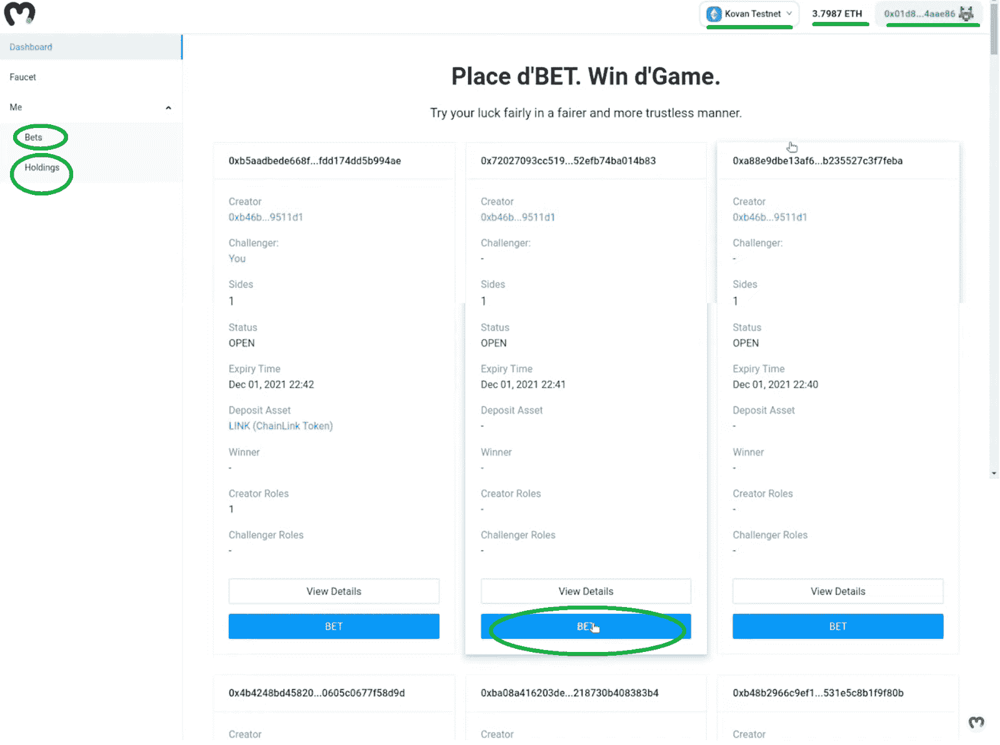

仪表板的核心是张贴的游戏，用户可以通过点击“下注”按钮参与其中。投注游戏可以由所有用户创建，这意味着每个用户都可以创建他们自己的投注游戏或在任何其他用户创建的现有游戏上投注。而且，这是用户点击“下注”按钮后会看到的弹出窗口:

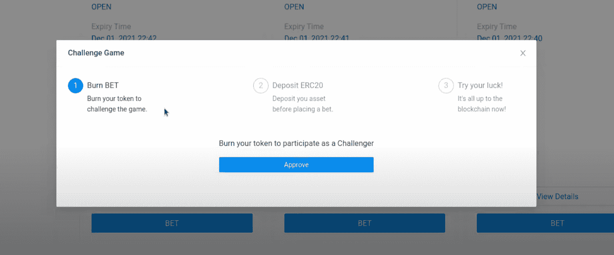

弹出窗口向用户提供如何参与下注的说明。首先，他们需要烧掉他们的“赌注”代币(我们创造的实用工具 [ERC-20 代币](https://moralis.io/erc20-exploring-the-erc-20-token-standard/))，这意味着他们需要持有我们的代币。点击“批准”按钮后，用户需要存入他们的 ERC-20 令牌(我们使用“链接”)。这些存款也是对获胜者的奖励:

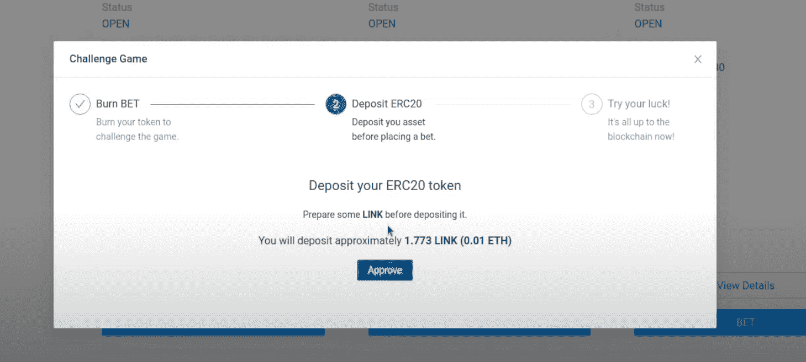

确认存款后，用户可以下注:

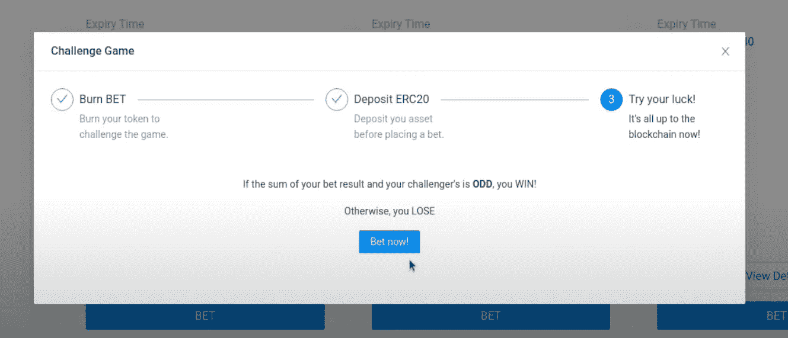

如前所述，我们采用了一个相对简单的下注规则；基于奇数或偶数的随机数之和。此外，任何赌注的赢家都可以通过单击出现在该用户所赢游戏下方的“提款”按钮来提取该赌注的所有相关资金:

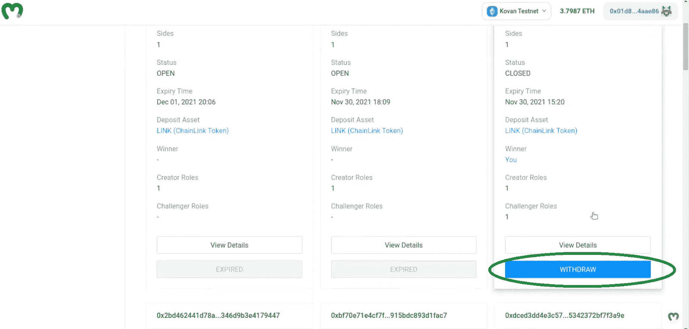

点击“撤销”后，会提示用户的[元掩码](https://moralis.io/metamask-explained-what-is-metamask/)确认交易。此外，如上所述，所有用户都可以通过导航到“我”和“下注”部分来创建自己的下注游戏，在这里他们可以找到“创建游戏”按钮:

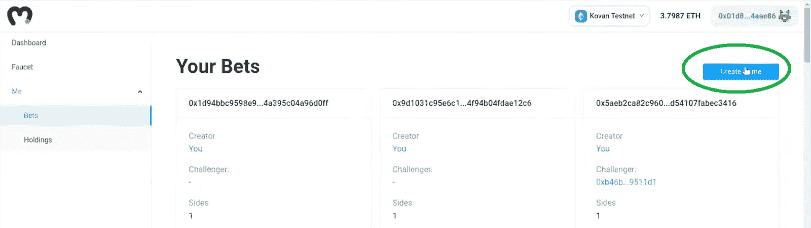

创建游戏的过程与对创建的游戏下注非常相似(这是一个三步过程):

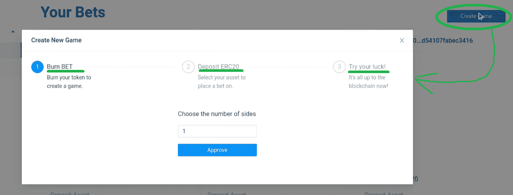

*注* *:如果你更多的是一个视频人，请务必查看本文底部的视频，从 0:33 开始，为我们的投注 dApp 预览。*

## 如何建立预测市场 dApp 项目概述

既然你对我们的探索有了一个清晰的认识，现在是时候给你一个建立预测市场 dApp 所需的过程的适当概述了。如前所述，你可以在不到六个小时内完成；然而，如果你是区块链开发的新手，它很可能会花费你更多的时间。

从零开始建立一个预测市场 dApp，六个小时的时间并不多。然而，这是一项相当艰巨的任务。然而，我们可以通过将整个过程分解为八个部分来简化事情(参见下面的大纲)。

预测市场 dApp 项目大纲:

*   环境设置–设置 Moralis 服务器并克隆样板文件(7:14 的视频)。
*   创建一个[坚固度](https://moralis.io/solidity-explained-what-is-solidity/)的博彩游戏智能合约(19:59 的视频)。
*   创建一个 ERC-20 令牌并学习如何在智能合约中处理它(燃烧、存款、提取)(57:30 的视频)。
*   整合 Chainlink 的价格信息和 VRF(视频时间为 1:40:16)。
*   使用 [Moralis Speedy Nodes](https://moralis.io/speedy-nodes/) 将我们的智能合约部署到区块链(视频在 2:26:30)。
*   通过将 [React](https://moralis.io/react-explained-what-is-react/) 上的智能合约与 Moralis 的 SDK(2:56:31 的视频)集成，创建一个 UI。
*   同步事件，使用 Moralis 数据库和 Moralis 的云功能选项，用实时区块链数据(4:41:39 的视频)增强我们的 dApp。
*   用我们的 Moralis 服务器托管我们的 dApp(5:54:10 的视频)。

通过完成概述的部分，你不仅将学习建立一个预测市场 dApp，而且你还将学习许多有价值的区块链开发技能，你可以在其他项目中使用。

## 用 Moralis 规范构建预测市场 dApp 的环境设置

为了充分利用 Moralis，您需要[创建您的免费 Moralis 帐户](https://admin.moralis.io/register)。这将为您提供对管理面板、仪表板和整个 Moralis SDK 的访问。此外，它还将使您能够创建您的 Moralis 服务器。因此，创建了您的 Moralis 帐户后，完成以下步骤来创建 Moralis 服务器。

### 创建一个 Moralis 服务器

1.  **登录您的 Moralis 账户**–只需[登录](https://admin.moralis.io/login)您的 Moralis 账户即可进入您的管理区。如果您没有帐户，请确保现在创建一个。

2.  [**创建 Moralis 服务器**](https://docs.moralis.io/moralis-server/getting-started/create-a-moralis-server)–在您的 Moralis 管理区内选择“服务器”选项卡，然后点击右上角的“+创建新服务器”按钮。将出现一个下拉菜单，提供不同的网络类型(见下图)。对于我们的示例项目，选择“Testnet 服务器”。*“测试网服务器”选项(* [*连接以太网测试网*](https://moralis.io/ethereum-testnet-guide-connect-to-ethereum-testnets/) *)往往是创建和处理新项目时的最佳选项；然而，一旦您的 dApp 被正确测试，您就可以创建一个 mainnet 服务器。*

接下来，将出现一个弹出窗口，您需要在其中输入服务器名称(可以是您想要的任何名称)，选择区域、网络和链:

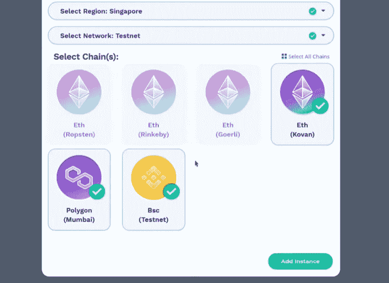

要最终创建并启动您的服务器，请单击“添加实例”。

3.  **访问服务器详细信息**–现在您的服务器已经启动并运行，您可以通过单击服务器名称旁边的“查看详细信息”按钮来访问其详细信息:

你会在弹出窗口中看到你需要的所有信息。因此，您需要通过单击“复制”图标来复制服务器 URL 和应用程序 ID 的详细信息:

4.  **初始化 Moralis 规范**–使用您的服务器的详细信息并填充。env "文件(您可能还需要将该文件从" . env.example "重命名为"。env"):

    *注意:* *继续下一节，稍后完成这一步(步骤四)。*

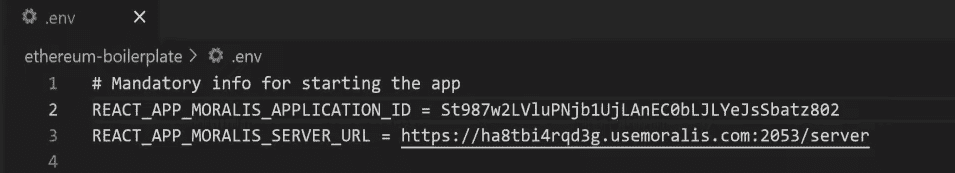

*注意* *:确保使用您特定服务器的详细信息，并使用* ***而不是*** *上图中显示的详细信息。*

### 克隆我们的项目

在这一点上，您有两个选择:您可以使用最终的 [Web3 样板文件](https://moralis.io/web3-boilerplate-beginners-guide-to-web3/)并从那里开始(就像我们所做的那样)，或者您可以克隆我们的项目以使事情对您来说更加简单。如果你决定从我们的 Web3 样板开始，使用以太坊样板的 [GitHub](https://github.com/ethereum-boilerplate/ethereum-boilerplate) 页面上提供的详细说明。但是，如果您决定走捷径，只需按照以下说明克隆我们的项目:

1.  进入我们项目的 GitHub 页面:[https://GitHub . com/ether eum-boilerplate/ether eum-prediction-market-boilerplate](https://github.com/ethereum-boilerplate/ethereum-prediction-market-boilerplate)。

2.  进入页面后，点击“代码”按钮，然后点击“复制”图标复制地址:

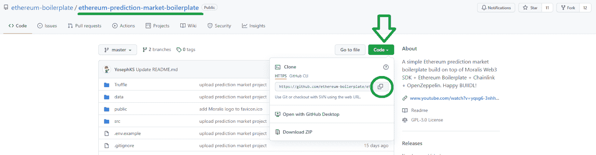

3.  然后，打开您的终端(当然，您可以使用代码编辑器中的终端)，转到您想要克隆项目的任何目录，然后使用" *git clone"* 命令，后跟复制的地址:

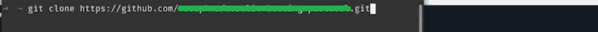

4.  现在，在您的代码编辑器中打开项目(我们使用 Visual Studio 代码[VSC])，并安装所有依赖项。此外，您可以在代码编辑器的终端中使用" **npm install** 或" **yarn install** "命令。*关于这个项目结构的更多细节，请看下面 9:56 的视频。*

5.  现在，您可以完成上一小节中的第四步。除了添加服务器的 URL 和应用程序 ID 之外，还要复制“CLI API 密钥”和“CLI API 机密”(在服务器的“查看详细信息”选项中):

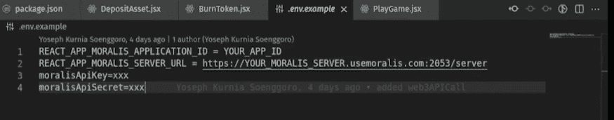

*注意* *:在“松露”文件夹里有一个类似的可选设置(13:02 的视频)。在这里，您还将了解到 Moralis Speedy Nodes API，以及如何将其添加到“truffle-config.js”文件中。*

6.  用元掩码 wallet 的助记符填充“. secret.example”文件，并将该文件重命名为“”。秘密”。如果您不记得您的秘密短语，请使用 Truffle 生成新短语(15:46 的视频)。

7.  最后，确保钱包里有足够的原生令牌(16:30 视频)。

## 建立市场预测 dApp 分步视频说明

环境设置完成后，您就可以卷起袖子构建如上所述的预测市场 dApp 了。由于有许多相当详细的方面要涵盖，你会更好地按照我们的 Moralis 专家在下面的视频中提供的指示。他将指导您完成这个示例项目的其余七个部分。万一六个小时对你来说太长了，确保把你的“建立预测市场”的任务分散到几天内。

以下是余下的七个部分，您将按照 Moralis 专家的指导完成:

*   用坚固创造你的聪明契约(19:59)。
*   创建您的 ERC-20 令牌，并学习如何正确处理它(57:30)。
*   整合 Chainlink 的价格源和 VRF (1:40:16)。
*   使用 Moralis Speedy Nodes 将您的智能合约部署到区块链(2:26:30)。
*   通过将 React 上的智能合约与 Moralis 的 SDK 集成来创建 UI(2:56:31)。
*   同步事件，使用 Moralis 数据库和 Moralis 的云功能，使用实时区块链数据增强您的 dApp(4:41:39)。
*   最后，用 Moralis 服务器托管 dApp(5:54:10)。

此外，这是我们在本文中引用的带有时间戳的视频:

https://www.youtube.com/watch?v=yQSG6-3NHhI

## 如何建立预测市场 dApp 总结

如果你遵循了文章和上面视频中提供的指导，你现在知道如何在六个小时内建立一个预测市场 dApp。此外，通过完成这个相当复杂的示例项目，您还学习了如何正确设置 Moralis 服务器，如何克隆 GitHub 项目，如何创建智能合同和 ERC-20 令牌。此外，您还学习了如何集成 Chainlink 的价格源和 VRF，如何使用 Moralis Speedy Nodes 部署智能合同，以及如何使用您的 JavaScript 技能通过 Moralis 的 SDK 创建 UI。此外，您现在知道如何同步事件，如何使用 Moralis 的数据库和 Moralis 的云功能，以及如何使用 Moralis 托管 dApp。

正如开始时提到的，这是一个相当广泛的示例项目。所以，如果你想从简单的开始，我们鼓励你去看看[Moralis 博客](https://moralis.io/blog/)和[Moralis YouTube 频道](https://www.youtube.com/c/MoralisWeb3)。在那里，您可以找到大量有价值的内容，解释了各种加密概念和术语，还提供了许多示例项目。例如，我们的一些最新指南向您展示了如何[创建免费令牌](https://moralis.io/create-free-token-how-to-deploy-your-own-testnet-crypto-token-in-10-mins/)，如何[用短信获取 Web3 事件](https://moralis.io/get-web3-events-with-sms-messages/)，如何[在币安智能链上创建 NFTs】，如何](https://moralis.io/create-nft-on-binance-smart-chain-full-guide/)[免费制作 NFT 而无需支付汽油费](https://moralis.io/how-to-mint-nfts-for-free-without-paying-gas-fees/)，如何[用共价 API 构建](https://moralis.io/how-to-build-with-the-covalent-api/)，如何[同步和索引智能合约事件](https://moralis.io/sync-and-index-smart-contract-events-full-guide/)，如何[构建跨链 dapp](https://moralis.io/how-to-build-cross-chain-dapps/)，以及

然而，如果你还不精通 JavaScript，但渴望[成为一名区块链开发者](https://moralis.io/how-to-become-a-blockchain-developer/)，我们建议你报名参加 Moralis 学院 [2021 区块链开发者 JavaScript 编程](https://academy.moralis.io/courses/javascript-programming-for-blockchain-developers)课程。此外，要想尽快成为全职加密员，一定要去看看[Moralis 学院](https://academy.moralis.io/)的其他有价值的课程。

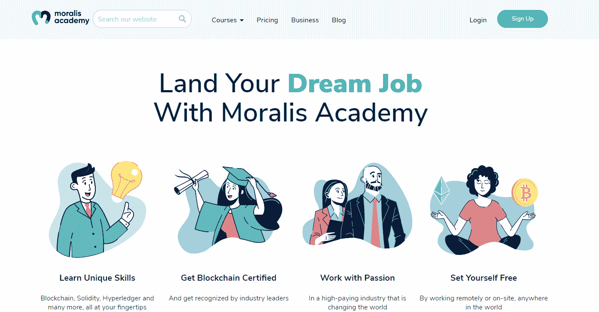