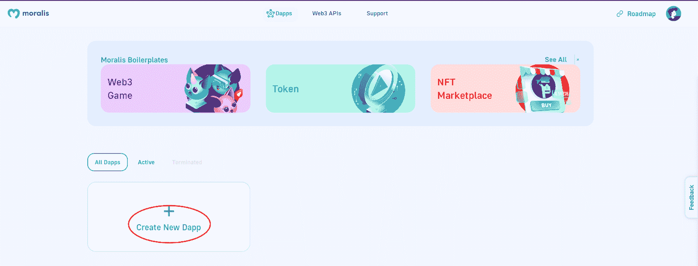

# 如何用 3 个步骤建立一个索拉纳 Dapp

> 原文：<https://moralis.io/how-to-build-a-solana-dapp-in-3-steps/>

在本教程中，我们将构建一个 Solana dapp，用户可以根据自己提供的 [Web3 wallet](https://moralis.io/what-is-a-web3-wallet-web3-wallets-explained/) 地址查询投资组合。为了使这个过程更容易理解，我们将把这个过程分成三个简单的步骤。但是，如果您想跳过指南直接进入代码，您可以在下面的 GitHub repo 中找到完整的文档:

**全索拉纳 Dapp 文档—**[](https://github.com/YosephKS/demo-moralis-solana-api)

****Solana 是区块链的主要网络之一，拥有一个由 dapps(去中心化应用)、 [DeFi](https://moralis.io/what-is-defi-the-full-decentralized-finance-guide/) 平台和其他有趣的 [Web3](https://moralis.io/the-ultimate-guide-to-web3-what-is-web3/) 项目组成的著名生态系统。当以太坊的天然气费用飙升，使得在这个网络上发展经济上不可行时，寻找其他替代方案变得越来越有趣。索拉纳强调可伸缩性和速度，这使得它成为一个有效的[以太坊](https://moralis.io/full-guide-what-is-ethereum/)的替代品。因此，我们将在接下来的章节中探索如何使用 [Moralis](https://moralis.io/) 操作系统构建一个 Solana dapp。所以，如果你跟着做，你将学会只通过三个简单的步骤就能创造出你自己的索拉纳 dapp！****

****使用 Moralis [Solana API](https://docs.moralis.io/moralis-dapp/solana-api) ，您可以轻松地为 Solana 网络创建 dapps。这与平台的底层后端基础设施和其他有趣的开发工具相结合，提供了一个更容易访问的开发过程。然而，这仅仅触及了 Moralis 的表面，还有更多有待发现。例如，如果你想进入其他网络的 [dapp 开发](https://moralis.io/dapp-development-tutorial-full-guide-to-building-a-dapp/)，请查看[以太坊 dapp API](https://moralis.io/what-is-an-ethereum-dapp-api-build-ethereum-dapps-easily/) 或[多边形 dapp API](https://moralis.io/polygon-dapp-api-how-to-efficiently-create-polygon-dapps/) 。这些工具让我们能够轻松地创建复杂的 dapps，如 [Web3 Spotify](https://moralis.io/how-to-build-a-web3-spotify-clone/) 和 [Web3 Amazon](https://moralis.io/how-to-build-a-web3-amazon-marketplace/) 克隆。****

****所以，如果你有成为区块链开发者的雄心，你来对地方了。Moralis 为你提供进入 [Web3 开发](https://moralis.io/how-to-build-decentralized-apps-dapps-quickly-and-easily/)所需的一切，你可以完全免费与 Moralis 签约！****

## ****什么是索拉纳 Dapp？****

****在我们探索如何构建一个 Solana dapp 之前，深入了解 Solana dapp 以及它们需要什么可能是一个好主意。因此，我们将用这一部分来回答这个问题，“什么是索拉纳 dapp？”****

****

为了理解什么是索拉纳 dapp，我们首先需要探索索拉纳网络。Solana 于 2017 年首次推出，是一级区块链，专注于解决“区块链三难困境”的问题。具体来说，在构建区块链网络时，开发人员通常会被迫牺牲以下三个特征中的一个来支持其他特征:

1.  **可扩展性**
2.  **权力下放**
3.  **安全**

Solana 专注于速度和可扩展性，而网络由于其独特的混合共识机制可以促进这一点。同时，以太坊利用了 PoW(工作证明)机制，Solana 实现了 PoS(利害关系证明)和 PoH(历史证明)。

您可能更熟悉 PoS 的概念，其中验证者更有可能根据他们在协议中持有多少加密货币来验证块。另一方面，PoH 可能更洋气；然而，这基本上允许索拉纳网络创建历史记录，显示事件发生在特定时刻。不幸的是，尽管这个系统允许更大的可伸缩性，但它是以分散化为代价的。

简要地看一下索拉纳网络，回答“什么是索拉纳 dapp？”变得相对容易。本质上，Solana dapp 是建立在 Solana 网络之上的 dapp。就这么简单！如果你想了解更多关于 dapps 的信息，请查看下面这篇回答问题“[dapps](https://moralis.io/decentralized-applications-explained-what-are-dapps/)是什么？”

## 用 Moralis 的三个步骤构建 Dapp

对什么是 Solana dapp 有了更好的理解，我们可以进入主题，探索如何构建 Solana dapp。因为我们将利用 Moralis，所以我们可以只通过三个简单的步骤来创建 dapp:

1.  创建 Moralis Dapp
2.  用 HTML 构建 Dapp 的内容
3.  添加 JavaScript 逻辑

通过这些步骤，我们将创建一个 dapp，允许用户输入钱包地址并查询其投资组合。这样，用户可以访问有关钱包的本地索拉纳令牌、其他令牌和 NFT 余额的信息。但是，为了让您了解最终产品的外观，这里有一个 UI(用户界面)的打印屏幕:


更重要的是，如果你更想看一个解释整个过程的视频，请随时查看下面的视频。在视频中，您将收到整个代码的更详细的分解，因为我们将在本文中重点关注要点。

https://www.youtube.com/watch?v=ax5scht_s4U

但是，事不宜迟，让我们开始这个“如何构建一个 Solana dapp”教程，深入到第一步，我们将创建一个 Moralis dapp！

## 第一步:建立一个索拉纳 Dapp——创造一个 Moralis Dapp

如果您还没有，在我们继续之前，您需要一个 Moralis 帐户。你可以在 Moralis 这里免费创建一个账户，只需要几秒钟。现在您已经是 Moralis 的成员，您可以通过按下 Moralis 管理面板上的“创建新 dapp”按钮来启动创建 Moralis dapp 的过程。



如果您单击此按钮，将提示您选择开发环境。由于这是一个教程，我们将选择“Testnet”的替代品。所以，如果你跟着做，我们建议你也这样做。选定环境后，下一步是选择网络。然而，你会很快注意到索拉纳不是一个选项，但这没关系。由于 Moralis 的 Solana API，你可以选择任何可用的网络，这不会影响 dapp。因此，我们将选择 Polygon 的 Mumbai testnet 作为我们的演示 dapp。

选定网络后，您需要选择一个区域。这种选择应该取决于你的地理位置和你应该选择离你最近的替代方案。在那里，你只需要命名 dapp 并点击“创建你的 Dapp”按钮。这将启动 dapp，它将立即运行。

既然您已经访问了您的 Moralis dapp，您可以探索几个选项。因此，如果您点击有问题的 dapp 的“设置”,您将被定向到 dapp 的仪表板。这将在你界面的左边显示一个导航栏，里面有很多选项供你探索。

但是，我们会将注意力转向登录页面，在该页面中，您可以找到“Dapp 凭据”。在此标题下，您可以找到 dapp URL 和应用程序 ID。请记住这一点，因为在第三步中我们需要这两个元素。


## 步骤 2:构建一个 Solana Dapp——用 HTML 构建 Dapp 的内容

随着第一步的完成和 Moralis dapp 的出现，我们可以更仔细地看看代码本身。我们建议您做的第一件事是将项目克隆到您的本地目录。在这种情况下，我们将选择普通的 JavaScript 选项。所以，如果你想继续下去，我们建议你也这样做。

将项目放在您首选的 IDE(集成开发环境)中，您会注意到两个独立的文件，在这一部分，我们将仔细看看“[index.html](https://github.com/YosephKS/demo-moralis-solana-api/blob/main/solana-vanilla/index.html)”。这是一个 HTML 文件，包含 dapp 的所有字段和按钮的代码。因此，如果我们回到本文前面介绍的 dapp 的打印屏幕，HTML 文件中的元素应该与标题、输入字段、下拉菜单和“Get Portfolio”按钮相对应。


这些元素非常简单，因为这决定了 dapp 内容的结构，所以您可以随意定制。因此，您可以根据自己的喜好添加、删除或编辑现有元素。但是，如果您对该文件进行了更改，请确保相应地更改 JavaScript 逻辑。此外，您可以使用 [CSS](https://moralis.io/cascading-style-sheets-what-is-css/) 进一步定制这些元素。

如果你想了解更多关于 [Web3 前端](https://moralis.io/web3-frontend-everything-you-need-to-learn-about-building-dapp-frontends/)开发的信息，请查看 Moralis 的 [web3uitkit](https://moralis.io/web3ui-kit-the-ultimate-web3-user-interface-kit/) 。使用这个工具，你将能够[为所有未来的 Web3 项目创建一个伟大的 dapp UI](https://moralis.io/web3-ui-how-to-create-a-great-dapp-ui/) ！

然而，在我们继续之前，我们还必须为 HTML 文件的起始行写一小段。第五行代码非常重要，因为这是我们导入 [Moralis SDK](https://docs.moralis.io/moralis-dapp/connect-the-sdk) 的地方，允许我们使用已经准备好的代码片段。尽管如此，代码看起来是这样的:

```js
<script src="https://unpkg.com/moralis/dist/moralis.js"></script>
```

## 步骤 3:构建一个 Solana Dapp——添加 JavaScript 逻辑

在构建 Solana dapp 的最后一部分，我们将检查" [index.js](https://github.com/YosephKS/demo-moralis-solana-api/blob/main/solana-vanilla/index.js) "文件。这个文件包含了所有 dapp 的逻辑，也是我们添加基于 Web3 钱包地址查询投资组合的功能的地方。然而，在探索 dapp 功能的代码之前，我们需要初始化 Moralis。

初始化 Moralis 相对容易，现在是我们需要之前找到的 dapp URL 和应用程序 ID 的时候了。因此，您可以导航回 Moralis 管理面板并复制这些元素。一旦有了它们，您需要在代码的以下部分输入它们:

```js
const serverUrl = "";
const appId = "";
Moralis.start({ serverUrl, appId });
```

初始化 Moralis 后，我们可以深入代码的核心函数，这个函数叫做“getSolanaPortfolio()”。该函数可能看起来有点短；然而，这要感谢 Moralis，它让我们只需要一行代码就可以查询钱包投资组合！尽管如此，以下是整个函数，因此我们可以进一步分析它:

该函数做的第一件事是使用用户的输入和选择创建一个名为“options”的对象。因此，该函数从 dapp 的 UI 中获取网络和地址。然后，该函数在调用 Moralis 的“Moralis”时将该对象作为参数传递。SolanaAPI.account.getPortfolio()"函数。最后，返回响应，提供对钱包的投资组合的访问。

这里的神奇之处在于 Moralis 函数和 Solana API，它允许我们轻松地获取各种链上数据！如果没有 API 和 Moralis 的 SDK，这个过程会非常困难，并且会占用不必要的时间。因此，选择与 Moralis 合作是显而易见的，因为您可以为所有项目节省平均 87%的开发时间！

## 创建 Solana Dapps —摘要

索拉纳区块链网络于 2017 年首次推出，现在是 dapps 和其他有趣的 Web3 项目的庞大生态系统的宿主。索拉纳是以太坊的一个很好的替代品，以太坊一直在与高昂的以太坊燃气费作斗争。Solana 更注重可伸缩性，并将交易成本保持在最低水平。因此，这对于[以太坊发展](https://moralis.io/ethereum-development-for-beginners/)来说是一个更加经济可行的选择。

由于 Solana 网络的好处，我们通过这篇文章更深入地研究了 Solana 编程。这样做，我们探索了如何建立一个 Moralis 的索拉纳 dapp。由于使用了 Moralis 操作系统，我们只需三个步骤就能构建 Solana dapp:

1.  创建 Moralis Dapp
2.  用 HTML 构建 Dapp 的内容
3.  添加 JavaScript 逻辑

然而，这仅仅涵盖了 Moralis 的基本可能性。更多信息，请考虑阅读[Moralis 博客](https://moralis.io/blog/)。在那里，您可以找到最新的 Web3 开发内容，帮助您进行编程。例如，看看下面关于 [Web3 webhooks](https://moralis.io/web3-webhooks-the-ultimate-guide-to-blockchain-webhooks/) 和 [Web3 同步](https://moralis.io/web3-syncing-how-to-sync-smart-contract-web3-events/)的文章，如果你想升级你的 Web3 游戏，这些文章很棒！

更重要的是，如果你想变得更加精通区块链发展的最佳语言，考虑报名参加 T2 Moralis 学院。Moralis 学院提供市场上最好的[区块链课程](https://academy.moralis.io/all-courses)。如果您对 Solana 开发特别感兴趣，请查看" [Solana 编程 101](https://academy.moralis.io/courses/solana-programming-101) "否则，如果你对这个领域完全陌生，参加“[初学者加密](https://academy.moralis.io/courses/crypto-for-beginners)”课程来学习 Web3 和加密领域的基础知识。


所以，如果你想打造 Solana dapps，一定要去 Moralis 注册！您可以创建一个完全免费的帐户，并立即开始向 Solana 或任何其他网络投稿！****