# 如何建立一个索拉纳 NFT 探索者

> 原文：<https://moralis.io/how-to-build-a-solana-nft-explorer/>

由于速度快、交易费用低，Solana 已经成为领先的可编程区块链之一。于是，很多专注于 NFT 的项目都决定利用 Solana，至此，有无数的 Solana NFT([**不可替代令牌**](https://moralis.io/non-fungible-tokens-explained-what-are-nfts/) **)值得探索。也就是说，如果你是一名 NFT 开发者，知道如何在索拉纳区块链的 dapp 中呈现各种 NFT 是至关重要的。在本文中，我们将介绍一个能够做到这一点的 dapp 在 Solana 上展示 NFTs。更重要的是，在接下来的章节中，我们将展示如何在 Moralis 的帮助下快速、轻松地构建一个索拉纳 NFT 浏览器。多亏了** [**Moralis 的 Solana API**](https://moralis.io/solana-api/) **，你可以很容易地获取 NFT 元数据，然后使用图像 URL 整齐地显示 NFT。此外，多亏了 Moralis，你还可以建立一个带有附加过滤器的索拉纳 NFT 浏览器。**

记住这一点，现在是学习更多关于 Solana 链编程的好时机。此外，通过学习如何建立一个索拉纳 NFT 浏览器，你也将熟悉 Moralis。接下来，我们将向您展示如何设置您的帐户并获取您的 Moralis Web3 API 密钥。因此，您将能够使用 Moralis 进行各种 dapp 开发工作。

由于 Moralis 完全是关于跨平台的互操作性，您将能够在流行的 Web2 开发平台上使用它。例如，你可以使用 Firebase、Supabase 或 Unity 来加入 Web3 革命。此外，在使用 Moralis 规范时，你永远不会拘泥于某个特定的区块链。虽然我们在这里建立了一个索拉纳 NFT 探索者，我们也可以专注于任何其他领先的网络。毕竟，Moralis 也是跨链互通的。因此，[创建您的免费 Moralis 账户](https://admin.moralis.io/register),跟随我们的脚步。


## 建立一个像我们一样的索拉纳 NFT 探索者-演示

在我们向您展示如何构建一个索拉纳 NFT 浏览器之前，让我们看一下我们的示例 dapp。因此，你会从今天的教程中看到什么。你也可以决定是否要卷起袖子，打造你自己的索拉纳·NFT 探索者。

下面的截图代表了我们的索拉纳 NFT 探险家 dapp 的要点。最初，我们的示例 dapp 是空的:

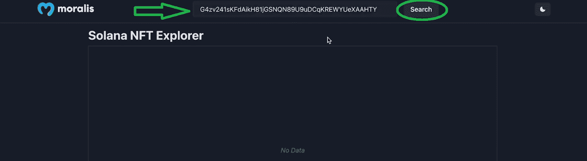

此外，看上面的图片，你可以看到我们的 dapp 的标题，Moralis 标志，输入字段，和“搜索”按钮。此外，您还可以看到它已经用一个示例 NFT 收款地址填充了输入字段。此外，我们只需点击“搜索”按钮即可获得结果:


结果整齐地显示在两行中。同样，对于每一个 NFT，你可以在顶部看到它的图像，它的名字，我们可以在底部看到它的符号。此外，您可以看到，随着结果的显示，出现了两个额外的选项。在我们 dapp 的顶部，在“索拉纳·NFT 探索者”标题的右边，我们现在有了一个页面导航器和一个过滤器输入字段。对于前者，我们可以使用箭头移动到下一页或上一页。或者，我们也可以输入我们想要访问的页码:


就过滤器而言，我们需要单击输入字段，然后我们可以按符号搜索 NFT:


所以，现在你知道接下来会发生什么了。假设你想学习如何建立一个上面提到的索拉纳 NFT 浏览器，然后继续下一节。在那里，您将首先学习如何获得您的 Moralis Web3 API 密钥。

## 如何用 NextJS 和 Moralis 构建一个索拉纳 NFT 探索者

如标题所示，用于构建上述 dapp 的主要工具是 Moralis 和 NextJS。我们还使用了终极以太坊样板作为起点，这使得事情变得简单多了。然而，您可以通过简单地克隆我们完成的代码来节省更多的时间，这些代码在 [GitHub](https://github.com/johnvsnagendra/solana-nft-explorer) 上等着您:

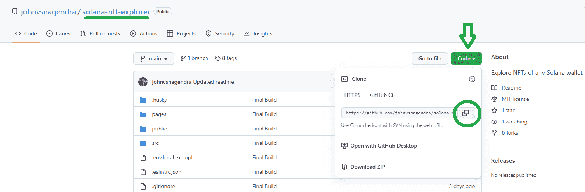

因此，在克隆我们的代码之后，您将会看到下面的布局:

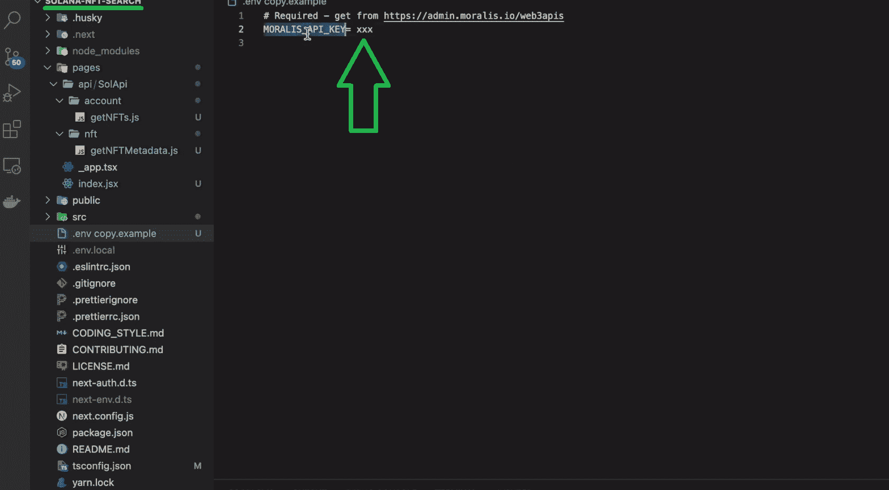

我们将带您浏览代码，但是正如您在上面的图片中看到的，您首先需要获得您的 Moralis Web3 API 密钥。

### 获取您的 Moralis Web3 API 密钥

如果您还没有这样做，[点击此处](https://admin.moralis.io/login)创建您的免费 Moralis 帐户。或者，您可以访问 Moralis 官方网站，点击“免费开始”或“免费试用”按钮:

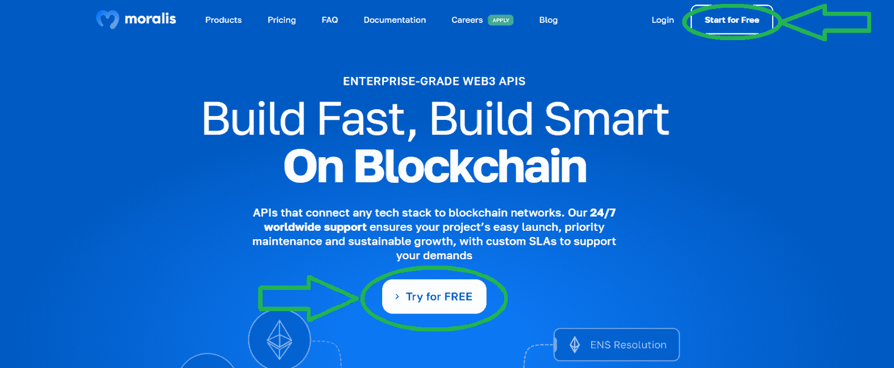

这些选项中的任何一个都会将您带到注册页面:


正如你在上面的截图中看到的，在注册页面上，你需要输入你的电子邮件地址并创建你的密码。您还可以使用您的 Google 帐户来加快注册过程。如果你带着你的邮箱和密码去，别忘了确认你的账户。要做到这一点，你需要点击你的电子邮件收件箱中的确认链接。

一旦您成功设置了您的 Moralis 帐户，这应该不会超过一分钟，您可以访问您的 Moralis 仪表板。这是您将在侧边菜单中看到“Web3 APIs”选项卡的地方:


在“Web3 API”页面上，您可以使用“复制”图标来复制您的 Moralis Web3 API 密钥:


此外，您可以在您的帐户设置中访问所有的 Moralis 密钥，包括 Web3 API 密钥。要到达那里，你需要点击侧边菜单中的“帐户”选项。进入“帐户设置”页面后，选择“密钥”选项卡，然后复制您的 Web3 API 密钥:

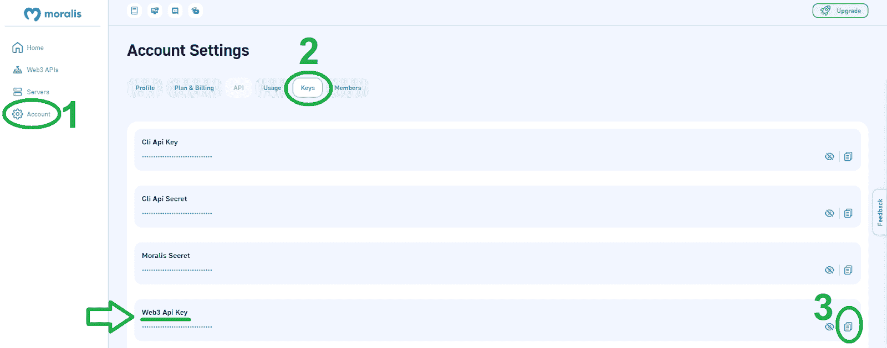

最后，你可以回到你的”。env copy.example "归档并用您的密钥替换" *xxx* "。然后，将该文件重命名为“. env.local”。这就完成了初始设置！

## 用终极索拉纳 API 构建索拉纳 NFT 探索者

感谢[企业级 web 3 API](https://moralis.io/)和 SDK 提供商 Moralis，我们将轻松实现与区块链相关的后端功能。事实上，我们将只需要两个特定的端点来创建上述的 dapp。所以，要构建一个索拉纳 NFT 探索者，“**/*帐号/{网络}/{地址}/nft*** ”和“***NFT/{网络}/{地址}/元数据*** ”就行了。那么，让我们快速概述一下这两个端点。然而，您可以使用 [Moralis 文档](https://docs.moralis.io/reference/getnfts-5)更详细地研究它们。

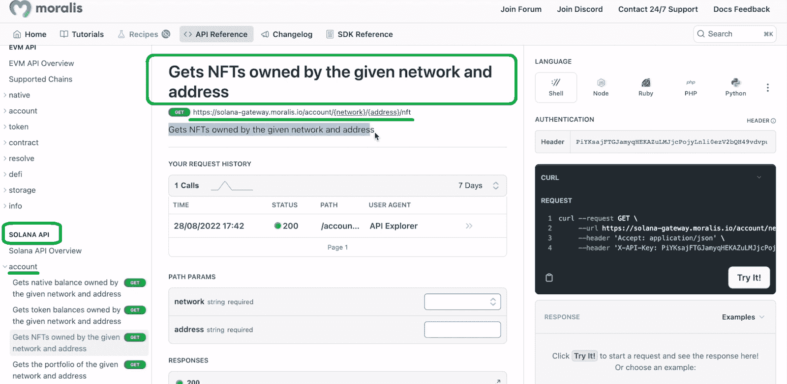

首先，我们使用“***account/{ network }/{ address }/nft***”来获取给定网络和地址所拥有的 NFT。该 API 接受“*网络*和“*地址*参数:

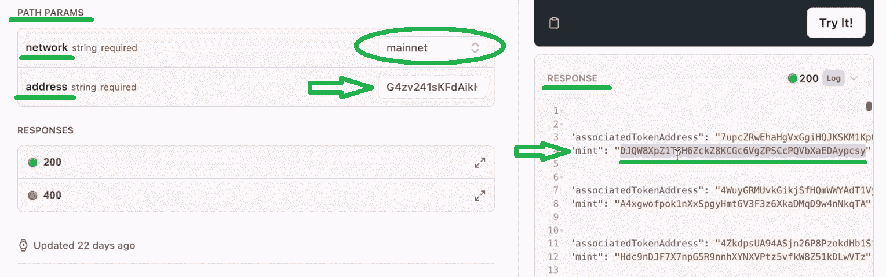

对于“*网络*”参数，我们可以在“mainnet”和“devnet”选项之间进行选择。有了这两个参数，我们就可以尝试代码并获得响应。这就是我们看到的“*造币厂*的价值观。这些值不过是 NFT 令牌地址。因此，我们可以在"***NFT/{网络}/{地址}/元数据*** 中使用这些值:

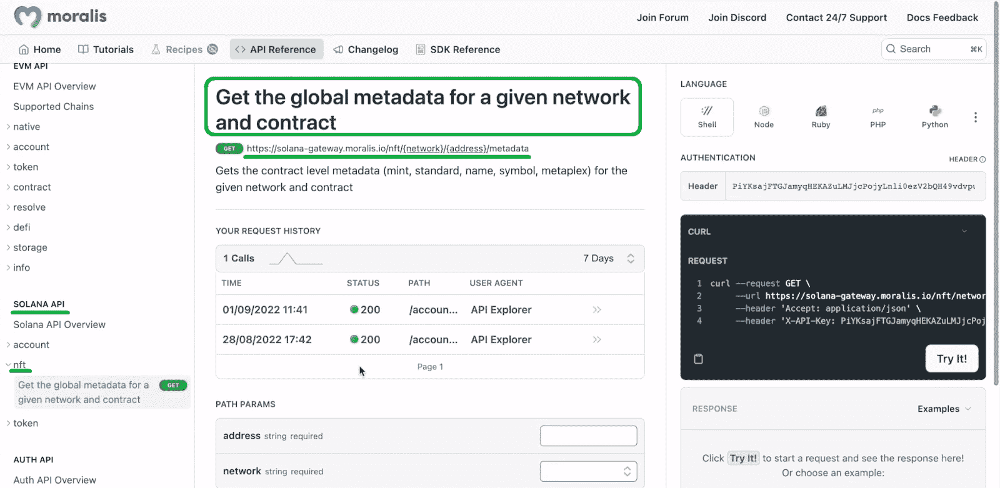

如果我们现在将上面复制的" *mint* 地址粘贴到" *path params* 的" *address* "输入字段中，并再次使用 mainnet，代码返回所有 NFT 的元数据:

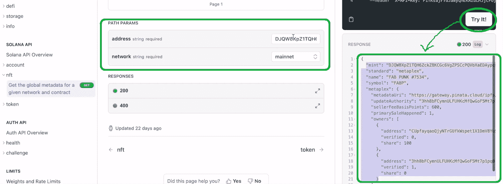

此外，这是我们构建索拉纳 NFT 探索者所需的所有后端。

## 构建索拉纳 NFT 浏览器–代码演练

要查看我们如何使用上面介绍的 API，请访问“getNFTs.js”和“getNFTMetadata.js”文件。这两个 JavaScript (JS)文件都位于“api/SolAPI”文件夹中:

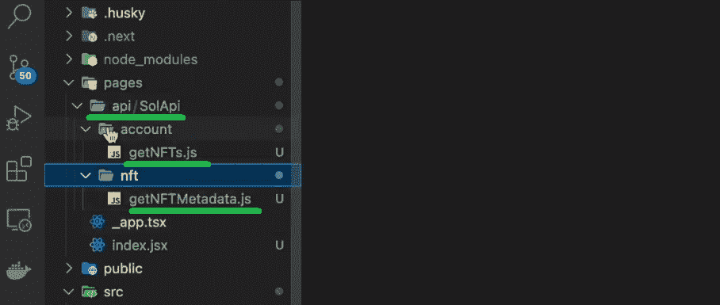

因此，如果我们首先查看“getNFTs.js”文件，它包含以下代码行:

```js
import Moralis from 'moralis';

export default async function handler(req, res) {
  const { address, network } = req.body;
  await Moralis.start({ apiKey: process.env.MORALIS_API_KEY });

  try {
    const data = await Moralis.SolApi.account.getNFTs({
      network,
      address,
    });
    res.status(200).json(data);
  } catch (error) {
    res.status(400).json(error);
  }
}
```

在顶部，我们首先导入 Moralis，这是使您能够构建索拉纳 NFT 浏览器 dapp 的关键之一。接下来，我们使用"*处理程序*"异步函数，它包含了我们获取 NFT 地址所需的所有内容。如您所见，我们还使用“. env.local”文件中的“ *MORALIS_API_KEY* ”变量来启动 Moralis SDK。尽管如此，所有繁重的工作都是由" *getNFTs* " Solana API 端点从" *account* "类型的端点执行的。

另一方面，“getNFTMetadata.js”文件使用类似的代码行:

```js
import Moralis from 'moralis';

export default async function handler(req, res) {
  const { address, network } = req.body;
  await Moralis.start({ apiKey: process.env.MORALIS_API_KEY });

  try {
    const data = await Moralis.SolApi.nft.getNFTMetadata({
      network,
      address,
    });
    res.status(200).json(data);
  } catch (error) {
    res.status(400).json(error);
  }
}
```

本质上，唯一的区别是我们使用了" *getNFTMetadata* "端点。而且，后者是“ *NFT* 类型端点的一部分。

### 前端组件

你可能有一些前端开发的经验；然而，让我们仍然仔细看看我们的 dapp 的 UI 组件背后的代码。让我们从" *NFTCard.jsx* "脚本开始:

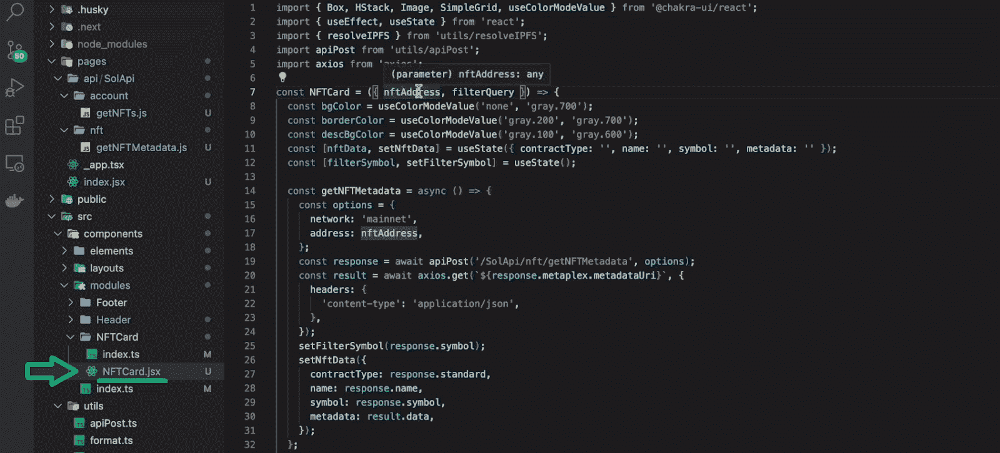

“ *NFTCard* ”组件接受“ *nftAddress* ”和“ *filterQuery* ”。前者是“ *mint* ”地址，后者是用户在过滤器的输入字段中输入的内容。此外，“ *nftAddress* ”用于获取 NFT 的元数据。同样，这也是我们使用" *getNFTMetadata* "的地方。

此外，值得指出的是，通过使用“ *axios.get* ”，我们可以从元数据 URI 中提取图像的 URL。以下是元数据 URI 及其图像 URL 的示例:

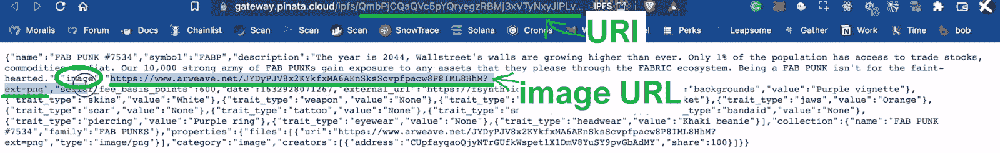

接下来，我们使用“ *setNftData* 将所有提取的 NFT 数据设置到“ *nftData* 状态变量中。后者包括协定类型、名称、符号和元数据。而且，它是" *src={resolveIPFS(nftData？。元数据？。image)* "渲染 NFT 图像的代码行。它对其他 NFT 数据使用相同的原理(见下面 7:49 的视频)。

“ *NFTCard* ”组件的另一个重要部分是“ *apiPost* ”函数(8:01)。通过使用这个函数，我们只需要给它端点和参数，让我们感兴趣来调用特定的 API。

另一方面，我们的示例 dapp 的逻辑包含在“index.jsx”文件中。因此，让我们仔细看看这个脚本。

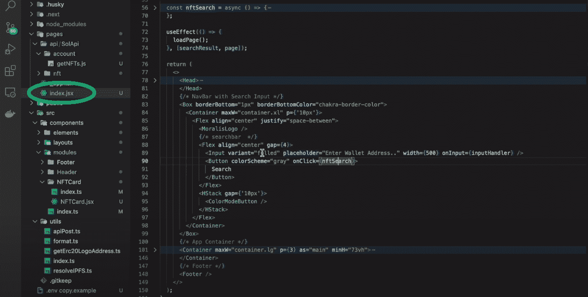

### UI 逻辑-"*index . jsx*"

因此，“index.jsx”负责 UI 逻辑。此外，该文件确保所有组件都如上面演示的那样显示，包括 Moralis 徽标、“Solana NFT 浏览器”标题和地址搜索栏。显然，后者是为我们的 dapp 提供处理所需数据的关键。此外，我们的示例 dapp 接收一个地址，然后利用 Moralis 的 Solana API 施展魔法。为此，" *index.jsx* "使用" *inputHandler* "更新" *searchInput* "状态变量。

我们的 UI 逻辑还包括“ *nftSearch* ”按钮。因此，每次用户点击这个按钮，就会激活“ *nftSearch* ”功能，重置“搜索”输入，然后显示结果的第一页。此外，它还使用“ *solApi/account/getNFTs* ”端点调用了“ *apiPost* 函数。最后但同样重要的是，“ *nftSearch* ”函数还在“ *searchResults* ”状态变量中设置搜索结果。

接下来，UI 逻辑使用" *loadPage* "函数来设置页面结果，以便每页显示十个 NFT。这也触发了“*设置页面结果*，它更新了“*页面结果*状态变量。此外，每次更新“ *pageResult* ”时，都会呈现上述“ *NFTCard* ”组件。

“*上一页*”和“*下一页*”功能由“箭头”按钮激活，该按钮负责页面导航。最后，我们还使用了“ *queryHandler* ”，它确保用户在过滤器的输入字段中输入的任何内容都用于呈现相关的结果。

对于详细的代码演练，请使用下面从 3:19 开始的视频。

https://www.youtube.com/watch?v=EvxSq0MJnMI

## 如何建立一个索拉纳 NFT 探险家-总结

使用今天的文章，你可以学习如何建立一个索拉纳 NFT 浏览器 dapp。你第一次有机会看到我们的例子 dapp 的演示。然后，我们为您提供了一个 GitHub 链接，您可以在那里获得完整的代码。通过克隆该代码，您有机会创建自己的索拉纳 NFT 浏览器 dapp 实例。你所需要做的就是获得你的 Moralis Web3 API 密匙并粘贴到“. env.local”文件中。尽管如此，我们还是带您浏览了代码，您也有机会使用我们内部专家的视频教程进行更深入的研究。

如果您喜欢今天的文章，请确保您的 Solana 编程更上一层楼。在这里，Moralis 文档、 [Moralis YouTube 频道](https://www.youtube.com/c/MoralisWeb3)和 [Moralis 博客](https://moralis.io/blog/)将为您提供所需的所有指导。当然，你也可以利用这些宝贵的资源关注其他可编程链。除了以太坊，Moralis 已经支持所有领先的 EVM 兼容链，包括 BNB 链，雪崩，多边形，Cronos 和 Fantom。

我们还应该指出，Web3 开发仍处于早期阶段，提供了无数的机会。因此，这可能是最好的时间去全职加密。如果你对此感兴趣，一定要考虑报名参加[Moralis 学院](https://academy.moralis.io/)成为区块链认证。这将大大增加你获得梦想工作的机会。除了顶级的加密开发课程，Moralis 学院也是获得专家指导的地方。此外，这个在线学院为您提供了个性化的学习路径和行业中最先进的社区之一的成员资格。

