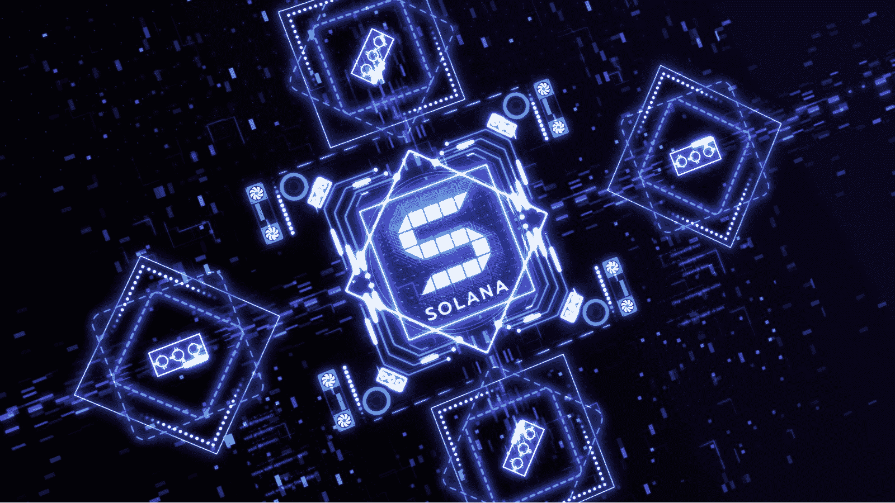
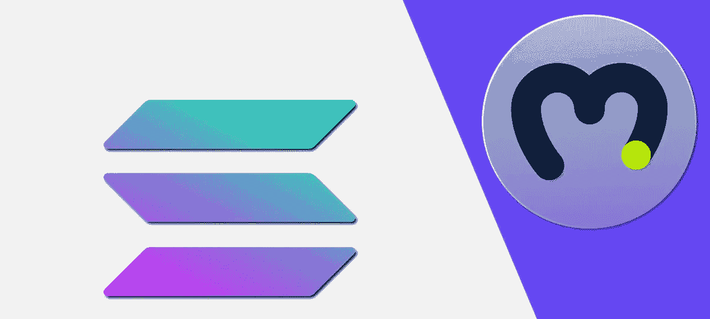
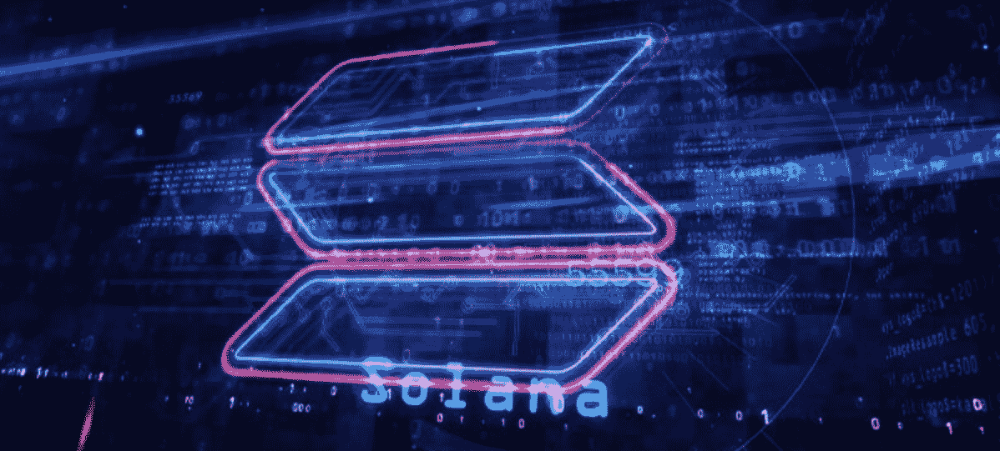
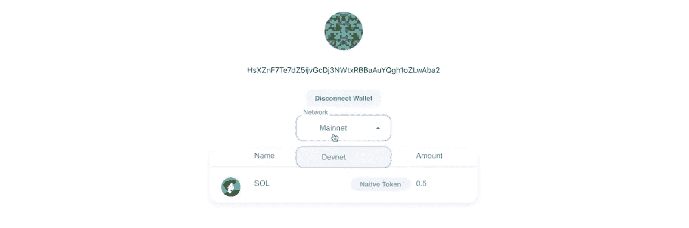
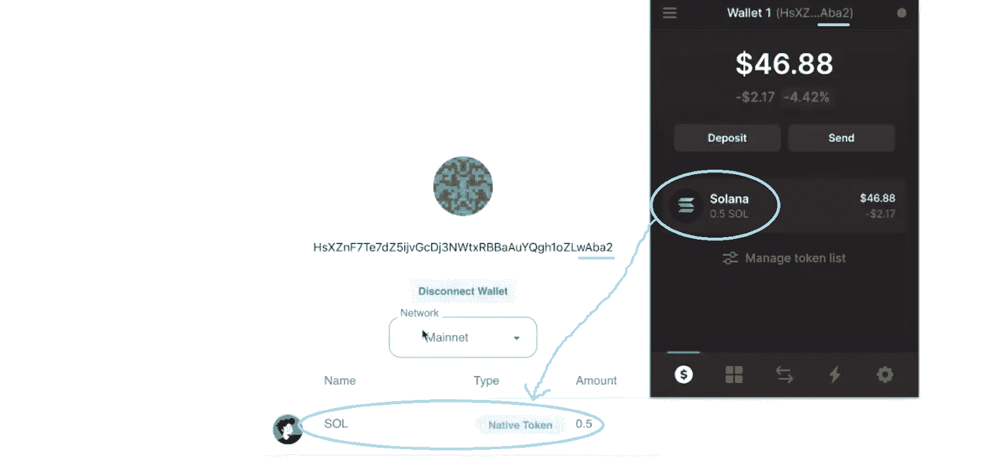
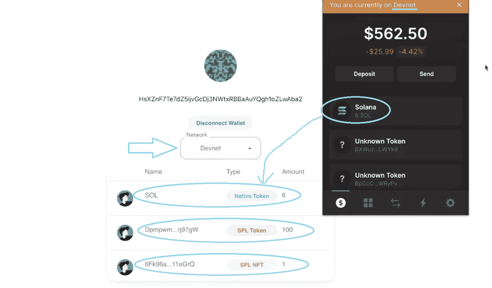
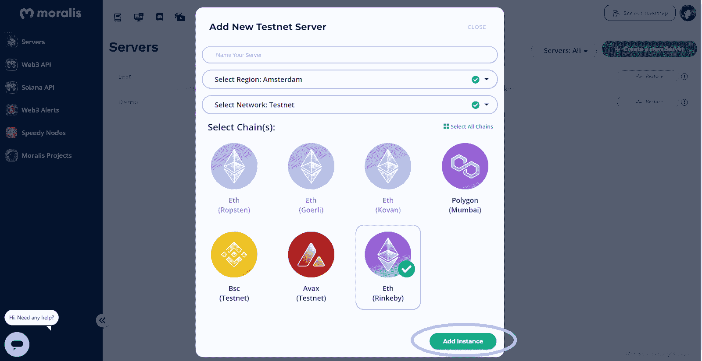
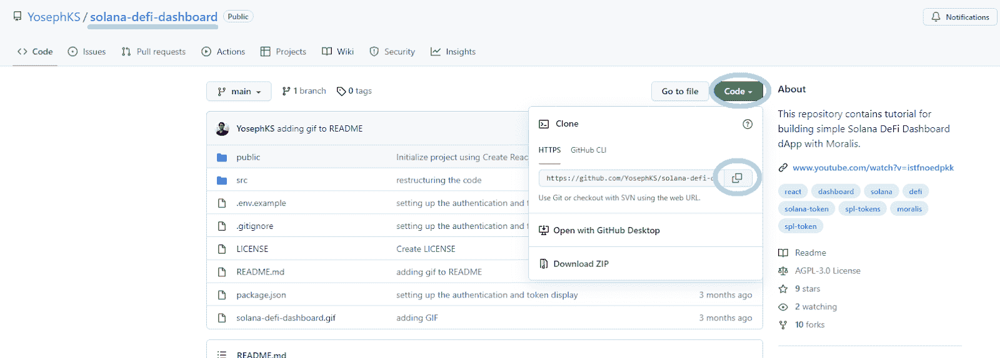

# 如何建立一个索拉纳令牌仪表板

> 原文：<https://moralis.io/how-to-build-a-solana-token-dashboard/>

Solana 令牌仪表板可以为用户提供多种功能。例如，它可以显示用户的 [**NFTs**](https://moralis.io/non-fungible-tokens-explained-what-are-nfts/) **的投资组合以及各种代币的余额。像这样的可视化界面，结合** [**Web3 认证**](https://moralis.io/web3-authentication-the-full-guide/) **，构成了 dapp 的简单**[**DeFi dashboard**](https://moralis.io/how-to-create-a-defi-dashboard-in-5-steps/)**的基础。尽管大多数** [**去中心化应用**](https://moralis.io/decentralized-applications-explained-what-are-dapps/) **存在于以太坊上，Solana 在 2021 年令人印象深刻的牛市让开发者探索其区块链，意识到 Solana 令人难以置信的速度和低费用使其成为 dapp 开发的理想选择。因此，大量的 Web3 应用开始出现。因此，越来越多的开发人员希望学习如何在 Solana 上构建 dapps。首先，程序员将受益于创建一个带有整洁仪表板的 dapp。幸运的是，这就是我们将要展示给你的。因此，请跟随我们探索如何使用来自** [**Web3 技术堆栈**](https://moralis.io/exploring-the-web3-tech-stack-full-guide/)**【Moralis】的最佳工具来构建 Solana 令牌仪表板！**

通过建立一个索拉纳令牌仪表板，你将了解更多关于 Moralis 的知识。这个“ [Firebase for crypto](https://moralis.io/firebase-for-crypto-the-best-blockchain-firebase-alternative/) ”选项是支持多个链和平台的终极 [Web3 后端平台](https://moralis.io/exploring-the-best-web3-backend-platform/)。除了 [Solana API](https://moralis.io/moralis-releases-solana-api/) 之外， [Moralis SDK](https://moralis.io/exploring-moralis-sdk-the-ultimate-web3-sdk/) 还包括[以太坊 API](https://moralis.io/ethereum-api-develop-ethereum-dapps-with-moralis/) 。因此，你也可以用它来满足你在 EVM 兼容链上的后端需求。此外，使用 Moralis 非常简单，因为在实现各种 Web3 功能时，您可以从 [Moralis 文档](https://docs.moralis.io/)中复制并粘贴单行代码。此外，多亏了 Moralis 的开发者，有更多的快捷方式供你使用。通过使用 GitHub 上的显著样板，您可以在几分钟内创建各种 dapps。事实上，如果您按照我们在本文中的指导，您将利用这种快捷方式，快速而轻松地构建您的 Solana 令牌仪表板。



## 为什么要建立在索拉纳身上？

说到区块链开发和 Web3，我们基本上刚刚起步。因此，新的可编程链经常出现。当然，[以太坊](https://moralis.io/full-guide-what-is-ethereum/)依然是庞然大物。然而，这种声誉良好的网络伴随着高昂的费用。因此，开发人员急于探索通常被称为“以太坊杀手”的替代品。索拉纳是那些提供相对较少的问题和极低的天然气费用高性能的连锁店之一。尽管如此，你不应该轻视“杀手”这个词。基于我们的专业知识，未来将会有几家声誉良好的连锁店，以太坊最有可能留在这里。因此，跨链互操作性将成为游戏的名称。



幸运的是，这是 Moralis 的基础。本质上，将来您可以使用相同的代码(稍加修改)在其他链上部署您的 Solana dapps。因此，您可以让您的工作经得起未来的考验。然而，当您开始构建 Solana 令牌仪表板时，我们总是建议您开始使用 Solana 的 testnet(在 Solana 的情况下是 devnet)来为您的区块链开发壮举创建一个无压力的环境。

## 使用 Moralis 构建 Solana 令牌仪表板–示例项目

如前所述，我们将向您展示如何轻松创建一个 Solana 令牌仪表板。通过使用 Moralis 和样板模板，你将能够在 15 分钟内完成这个示例项目。简而言之，这些是你一路要完成的步骤:

*   完成初始 Moralis 设置。
*   克隆“ [solana-defi-dashboard](https://github.com/YosephKS/solana-defi-dashboard) ”代码。
*   通过在 Visual Studio 代码(VSC)中输入“yarn install”命令来安装所有依赖项。
*   填充“.env "文件，包含您的 Moralis 服务器 URL 和应用程序 ID。
*   在 VSC 输入“纱线启动”命令运行应用程序。
*   用幻影 [Web3 wallet](https://moralis.io/what-is-a-web3-wallet-web3-wallets-explained/) 实现 Web3 认证。
*   确保正确提取用户的投资组合数据。

然而，在我们向您介绍上述操作之前，让我们确保您对我们将要构建的内容有一个清晰的了解。因此，让我们快速演示一下我们的示例 Solana 令牌仪表板。



### 我们的 Solana 令牌仪表板示例演示

以下是用户登录我们的 Solana 令牌仪表板时看到的内容:


与所有 Web3 应用程序一样，用户需要首先验证自己。然而，由于 Solana 不是 EVM 兼容的链，我们不使用 MetaMask 进行认证。相反，我们使用幻影钱包，点击“连接钱包”按钮后，它会提示用户输入密码并获得批准:


以下是我们的 Solana 令牌仪表板经过身份验证后的外观:



如您所见，它显示了一个用户的地址，让用户断开钱包，并提供了一种在 mainnet 和 devnet 之间切换的方法。尽管如此，它还显示本机令牌和其他 Solana 令牌余额。上面的截图很清楚的显示了连接钱包里有 0.5 SOL，这是链上数据。



您可以查看上面的图像，了解数据确实是从区块链获得的。这包括示例用户的钱包地址和该地址的令牌余额。然而，由于这个钱包只包含本地令牌(SOL ),让我们转移到 devnet。在这里，这个示例钱包还包含其他 Solana 令牌:



上面的屏幕截图清楚地显示了所有令牌，包括 SPL 标准 NFT。

## 逐步构建 Solana 令牌仪表板

看完上面的演示后，您可能已经决定加入到这个行动中来，构建您自己的 Solana 令牌仪表板。幸运的是，这并不困难。毕竟，您将使用我们的样板文件和 Moralis 的 SDK 在创纪录的时间内到达终点。

### 初始 Moralis 设置

无论您是在其他受支持的链上构建 Solana token dashboard 还是 Web3 应用程序，您都必须首先完成以下步骤才能使用 Moralis:

1.  **创建您的 Moralis 账户**–[在 Moralis 的注册页面创建您的账户](https://admin.moralis.io/register)。在那里，您必须输入您的电子邮件地址并创建您的密码。然后，您还应该点击电子邮件收件箱中的确认链接。然而，如果这不是你第一次参加 Moralis 竞技，只需[登录](https://admin.moralis.io/login)。


2.  **创建一个 Moralis 服务器**——一旦登录，你需要[创建一个 Moralis 服务器](https://docs.moralis.io/moralis-dapp/getting-started/create-a-moralis-dapp#2.-create-a-moralis-server)。为此，请转到 Moralis 管理区的“服务器”选项卡，然后单击“+创建新服务器”。*新用户还会得到页面教程*的指导:


然后，你需要选择适合你项目的网络类型(见下面截图)。*由于这是一个示例项目，“Testnet 服务器”将是最合适的:*


接下来，您必须输入您的服务器详细信息。因此，首先输入您的服务器名称，可以是您想要的任何名称。之后，选择您所在的地区、网络类型和连锁店。然后点击“添加实例”按钮启动服务器:



3.  **查看并复制您服务器的详细信息**–现在您的服务器正在运行，您可以查看其详细信息了。为此，请单击“查看详细信息”按钮:


这将打开一个包含所有必要细节的新窗口。只需使用服务器 URL 和应用程序 ID 旁边的复制图标:


稍后，您将使用这些详细信息来填充其中一个样板文件。但是，您必须首先克隆我们的代码。

### 克隆“solana-defi-dashboard”代码

首先使用上面概述列表中提供的“solana-defi-dashboard”链接。在我们的 GitHub 页面上，复制代码的地址:



然后，打开您最喜欢的代码编辑器(我们更喜欢使用 Visual Studio 代码[VSC])来克隆代码。在 VSC 内部，您需要打开终端，然后输入“git clone”命令，后跟上面复制的地址来克隆代码:

```js
 *git 克隆 https://github . com/yoephks/Solana-defi 控制板. git* 克隆代码后，您将能够看到与我们的示例项目相关的以下文件夹和文件:安装所有依赖项您还需要安装所有的依赖项。因此，您想再次使用您的 VSC 航站楼。首先，将“光盘”放入正确的文件夹中。如果您使用与我们相同的名称，那么您需要使用以下命令行:

```
 *cd Moralis 可升级智能合同*

```js
然后，进入“纱线安装”。安装完成后，您将获得“yarn.lock”文件:注意:你也可以使用 npm。在这种情况下，您将获得“package-lock.json”而不是“yarn.lock”。填充“.env "文件正如您在上面的图像中看到的，有一个“. env.example”文件，您可以将其复制并重命名为”。env”。当然也可以直接改名。然后，打开”。env”文件，并粘贴在“初始 Moralis 设置”一节的第三步中获得的详细信息:*注意* *:不要使用上面的服务器 URL 和应用 ID。相反，请确保粘贴您的服务器的详细信息。*运行应用程序现在，通过在终端命令行中输入“yarn start ”,您就可以运行应用程序了。如果您已经正确完成了上述所有步骤，您应该会看到以下屏幕:您应该已经熟悉上面的截图，因为我们在前面的演示中使用过它。此外，您知道一旦用户通过身份验证，Solana token dashboard 界面会是什么样子。然而，您还不知道 Web3 认证过程是如何执行的，以及它如何获取用户的投资组合数据。因此，接下来让我们关注这两个方面。*注* *:既然你已经克隆了我们的代码，那么 Web3 认证和用户的数据组合提取都已经实现了。因此，下面的部分只是一个代码演练。*Web3 身份验证和用户作品集数据提取我们的 dapp 的核心逻辑，也包括这两个基本但强大的特性，包含在“ [App.js](https://github.com/YosephKS/solana-defi-dashboard/blob/main/src/App.js) 文件中。就 Solana 网络上的认证而言，Moralis 实现了幻影钱包。首先，您需要从“react-moralis”导入 Moralis SDK 和 Solana API:

```
import {
  useMoralis,
  useMoralisSolanaApi,
  useMoralisSolanaCall,
} from "react-moralis";
```js

上面给了你一些非常强大的钩子。因此，您可以使用“ **authenticate** 来创建您的“onConnectPhantomWallet”函数:

```
  const onConnectPhantomWallet = async () => {
    await authenticate({
      type: "sol",
    });
  };
```js

上面几行代码处理 [Web3 用幻影钱包登录](https://moralis.io/how-to-build-a-web3-login-in-5-steps/)。这意味着我们 dapp 的“连接钱包”按钮会调用这个功能。至于获取用户的投资组合数据，上面的“导入”已经确保了我们拥有完全的控制权。因此，我们可以使用这些钩子来定义必要的常量:

```
  const { account } = useMoralisSolanaApi();
  const { fetch, data, isLoading } = useMoralisSolanaCall(account.getPortfolio);
```js

此外，“ **getPortfolio** ”做所有的重活。我们还使用“fetch”函数，该函数获取 mainnet 或 devnet 上的用户(登录)地址:

```
  useEffect(() => {
    if (isAuthenticated && user.get("solAddress")) {
      // Fetch only when authenticated
      fetch({
        params: {
          address: user.get("solAddress"),
          network,
        },
      });
    }
  }, [fetch, isAuthenticated, user, network]);
```js

如果你更喜欢视频教程，请务必在 23:16 开始观看下面的视频。在该视频中，Moralis 专家完成了上述所有步骤。在这里，您还可以获得我们的 dapps 认证和投资组合获取的更详细的代码演练(从 27:15 开始)。https://www.youtube.com/watch?v=IsTFNOedPkk 如何构建 Solana 令牌控制面板—摘要我们希望你已经跟随我们的领导，你现在有你自己版本的索拉纳令牌仪表板。如果是这样，你已经学会了如何完成初始 Moralis 设置。因此，您现在知道了如何获得您的服务器 URL 和应用程序 ID 来填充一个。env "文件。此外，您还了解了如何轻松实现 Web3 身份验证以及如何获取用户的投资组合数据。多亏了 Moralis 的 SDK，这两个特性都只需要相对较短的代码片段。尽管如此，如果您喜欢这个示例项目，我们建议您也学习如何[创建一个 Solana 令牌](https://moralis.io/how-to-create-a-solana-token-in-5-steps/)。此外，您可能希望将注意力转移到其他可编程链上。因此，我们鼓励您了解如何[创建多边形令牌](https://moralis.io/how-to-create-a-polygon-token/)、 [BNB 链令牌](https://moralis.io/how-to-create-a-bnb-chain-token-in-5-minutes/)或[雪崩 dapp](https://moralis.io/how-to-create-an-avalanche-dapp-in-4-steps/) 。所有这些教程和许多其他教程都可以在[Moralis YouTube 频道](https://www.youtube.com/c/MoralisWeb3)和[Moralis 博客](https://moralis.io/blog/)上找到。这些是一些最新的话题:如何[创建 BNB NFT](https://moralis.io/how-to-create-a-bnb-nft/) ，[分数 NFTs](https://moralis.io/what-are-fractional-nfts-the-ultimate-2022-f-nft-guide/) 指南，关于[动态 NFTs](https://moralis.io/what-are-dynamic-nfts-the-ultimate-2022-guide/) ，[基于 NFT 的会员资格](https://moralis.io/what-are-nft-based-memberships-full-guide/)，一个[即玩即赚(P2E)游戏智能合约](https://moralis.io/how-to-build-a-play-to-earn-p2e-game-smart-contract/)，构建一个 [Uniswap DEX 克隆](https://moralis.io/build-a-uniswap-dex-clone-with-html-css-javascript-moralis-on-the-ethereum-network/)，如何[获得区块链短信通知](https://moralis.io/how-to-get-blockchain-sms-notifications/)，添加一个 [Web3 连接钱包按钮尽管如此，所有这些有价值的内容都可以作为你免费的区块链发展教育。](https://moralis.io/how-to-add-a-web3-connect-wallet-button-to-your-website/)另一方面，你可能渴望[成为一名 Web3 开发者](https://moralis.io/how-to-become-a-web3-developer-full-guide/)并成为全职加密高手。如果是这样的话，采取更专业的方法通常效果最好。因此，我们建议你报名参加[Moralis 学院](https://academy.moralis.io/)，那里有专业水平的[课程](https://academy.moralis.io/all-courses/)等着你。最重要的是，你还将获得个性化的学习路径，专家指导，以及密码领域最令人难以置信的社区之一的会员资格。    

```

```js

```