# 如何建立一个 Web3 亚马逊市场

> 原文：<https://moralis.io/how-to-build-a-web3-amazon-marketplace/>

谈到 Web2 市场，亚马逊无疑是最大的 Web2 电子商务市场。然而，由于 Web3 才刚刚起步，在加密领域还没有真正的 Amazon 替代品。因此，这为开发者提供了一个建立 Web3 亚马逊市场的绝佳机会。当然，你可能志存高远，所以你的最终目标可能是创造出像亚马逊一样大的东西。然而，仅仅通过学习如何创建一个 Web3 亚马逊克隆，你就可以为许多企业提供一种开始接受加密货币的方式。在这篇文章中，我们将向你展示如何建立一个 Web3 亚马逊市场的详细指南。因此，你将能够使用相同的原则来构建 Moralis 所支持的各种区块链。幸运的是，当您使用正确的[**web 3 tech stack**](https://moralis.io/exploring-the-web3-tech-stack-full-guide/)**时，跨链互操作性就在您的掌握之中。**

也就是说，向前看，你将学会如何使用终极的 [Web3](https://moralis.io/the-ultimate-guide-to-web3-what-is-web3/) 开发平台、 [Moralis](https://moralis.io/) 。这个“ [Firebase for crypto](https://moralis.io/firebase-for-crypto-the-best-blockchain-firebase-alternative/) ”选项是最好的 [Web3 后端平台](https://moralis.io/exploring-the-best-web3-backend-platform/)。它为你提供了令人印象深刻的 Web3 SDK，包括终极[以太坊 API](https://moralis.io/ethereum-api-develop-ethereum-dapps-with-moralis/) 和 [NFT API](https://moralis.io/ultimate-nft-api-exploring-moralis-nft-api/) 。因此，当你的目标是建立一个 Web3 亚马逊市场时，它是一个重要的工具。实质上，Moralis 是一个工具，它可以让你在大约一个小时内创建一个 Web3 Amazon 克隆。在接下来的章节中，你将有机会加入我们创建一个 Web3 Amazon 克隆。通过这样做，你也将学会如何完成最初的 Moralis 设置，从而在处理其他项目时被覆盖。因此，如果你对此感兴趣，请确保在继续之前[创建你的免费 Moralis 账户](https://admin.moralis.io/register)。

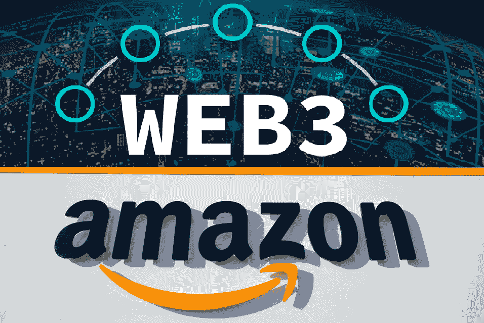

## 用 Moralis 建立一个 Web3 亚马逊市场

如上所述，我们将承担一个示例项目，我们的目标是创建一个 Web3 亚马逊克隆。此外，使我们能够以尽可能少的摩擦完成工作的一个重要工具是 Moralis。后者将使我们能够最轻松地满足我们所有的后端需求。

例如，我们将使用 Moralis 的[元掩码](https://moralis.io/metamask-explained-what-is-metamask/)集成来涵盖 [Web3 认证](https://moralis.io/web3-authentication-the-full-guide/)。此外，通过使用 Moralis [Web3 API](https://docs.moralis.io/moralis-server/web3-sdk/intro) ，我们能够复制简短的代码片段来包含各种功能和特性。没有这条捷径，我们将被迫面对 RPC 节点的所有[限制。然而，当使用 Moralis 构建时，您可以投入所有的精力和资源来创建最佳的用户体验。因此，你创造一个伟大的 Web3 UI 的机会要高得多。此外，后者最终会给你的 dApps(分散式应用程序)带来明显更大的成功机会。](https://moralis.io/exploring-the-limitations-of-rpc-nodes-and-the-solution-to-them/)

在我们真正开始建立一个 Web3 亚马逊市场之前，我们想确保你心中有一个清晰的画面。因此，我们将更仔细地查看我们完成的示例 dApp 的概况。通过这样做，您将对我们的示例项目有一个更好的理解。此外，有了这些信息，您可以很容易地决定是否要自己创建一个 Web3 Amazon 克隆。

## 创建 Web3 Amazon 克隆之前——dApp 预览

作为今天示例项目的一部分，我们将构建一个类似亚马逊的网络书店。简而言之，以下是其主页的预览:

查看上面的截图，您已经可以看到我们的示例 Web3 书店具有“Amazon”的外观。此外，我们在顶部创建了一个搜索栏。此外，搜索栏旁边是“登录”按钮。在那里，用户可以轻松完成他们的 [Web3 登录](https://moralis.io/how-to-build-a-web3-login-in-5-steps/)。*在我们使用最流行的* [*Web3 钱包*](https://moralis.io/what-is-a-web3-wallet-web3-wallets-explained/) *的例子中，Moralis 还能让你设置* [*Web3 社交登录*](https://moralis.io/web3-social-login-sign-in-dapp-users-with-google-email-or-twitter/) *到位。*

此外，搜索栏下方是顶部菜单。在那里，用户可以选择不同的类别，包括漫画、字典、小说、幻想、恐怖和冒险。然后，我们有旋转区域，有三个旋转横幅吸引客户。页面再往下，有四个部分:分类购物、浏览漫画、阿特米斯奇幻历险和莫比·迪克。尽管如此，这四个部分的底部都有一个按钮。例如，假设用户点击“浏览漫画”部分下的“立即购买”按钮:

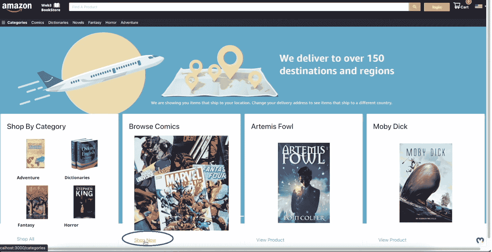

点击上面的按钮，他们将进入购买漫画的页面:

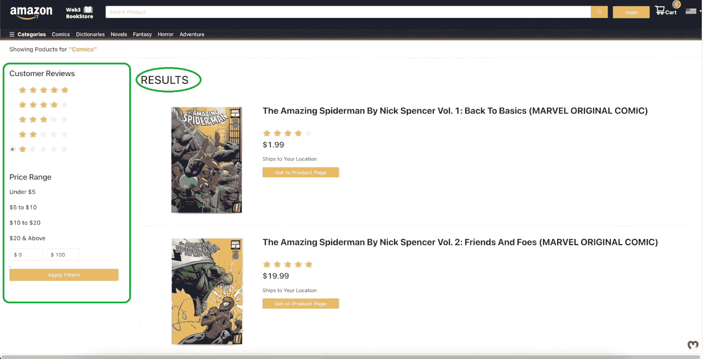

正如你在上面的图片中看到的，用户现在可以看到可用的漫画，他们的评论星级，以及他们的价格。此外，在左手边，有几个过滤器。例如，用户可以选择只看五星的漫画。除了评论过滤器，还有价格过滤器。后者使客户能够选择一个预定义的价格范围或输入他们自己的价格范围。

### 示例 Web3 亚马逊克隆预览–完成购买

现在让我们假设顾客想要购买特定的漫画。因此，他们首先需要点击他们选择的漫画下方的“转到产品页面”按钮:

通过这样做，客户登陆到该产品的页面。在这里，客户可以查看产品标题、星级评论、价格和简短描述:

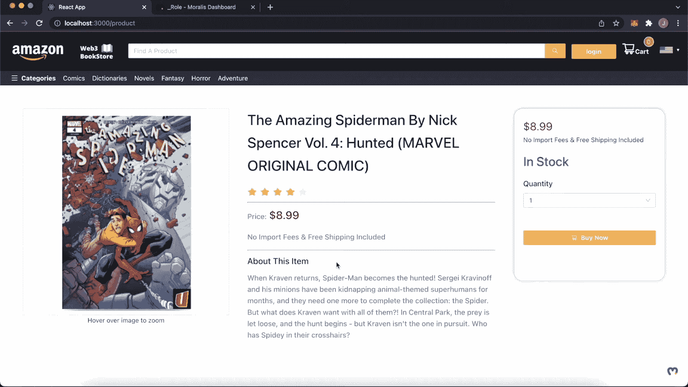

左手边有一张封面图片，你可以把鼠标悬停在上面放大。此外，在右边有一个框架，用户可以选择所需的数量，预览整体价格，并通过点击“立即购买”来购买该项目。但是，在客户实际购买任何商品之前，他们需要登录。

### 示例 Web3 亚马逊克隆预览–登录

为了让用户登录，他们需要准备好元掩码浏览器扩展和加密钱包。设置就绪后，他们需要单击“登录”按钮:

接下来，将弹出来自 MetaMask 的签名请求。因此，用户需要点击“登录”按钮进行登录:

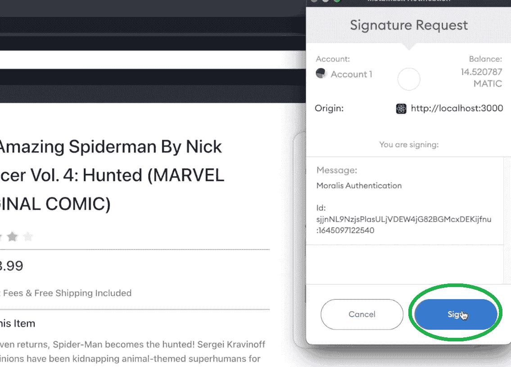

登录后，用户可以点击“立即购买”按钮完成购买:

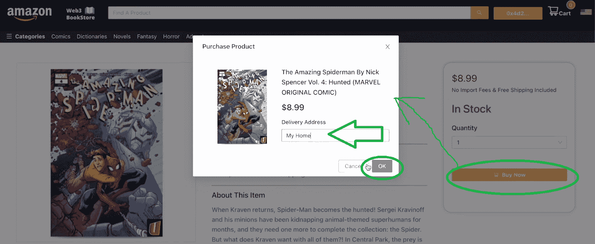

从上面的截图可以看出，一旦用户点击“立即购买”按钮，就会出现一个新的弹出窗口。在这里，他们需要输入他们的交货地址，然后单击“确定”按钮。然后，MetaMask 会提示他们确认购买。在我们的例子中，我们使用的是 Mumbai testnet。因此，使用的加密货币是“测试”自动的。从下面的截图可以看到，价格自动换算成 MATIC。此外，要确认购买，用户需要点击“确认”按钮:

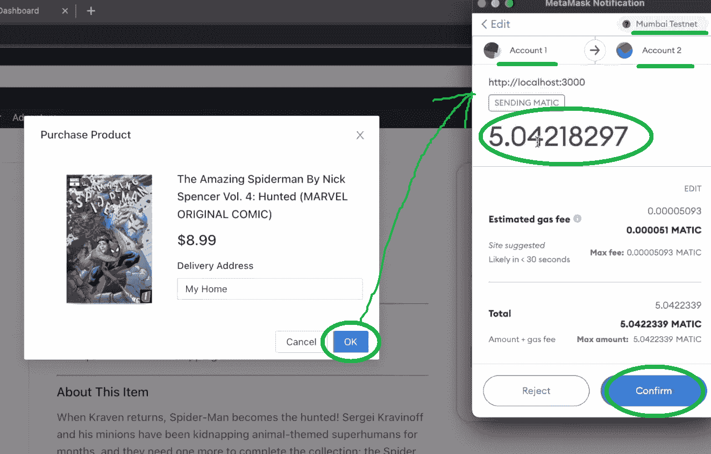

*注* *:“账户 1”是一个示例用户的账户，而“账户 2”是我们的示例亚马逊克隆店店主的账户。后者是用于购买的所有 MATIC 交易被发送到的地方。*

#### Moralis 仪表板预览

交易完成后，我们可以在我们的 Moralis 仪表板中查看它:

Moralis dashboard 本质上是一个 Web3 数据库，它与每个 Moralis 服务器一起提供。后者是您需要创建的，作为初始 Moralis 设置的一部分。此外，Moralis 仪表板是一个强大的工具，它与 Moralis 的“同步”功能一起，使您能够[同步和索引智能合同事件](https://moralis.io/sync-and-index-smart-contract-events-full-guide/)。这给了你[不费吹灰之力索引区块链](https://moralis.io/how-to-index-the-blockchain-the-ultimate-guide/)的权力。

这也结束了我们的预览。现在，您应该对我们在示例项目中将要构建的内容有了一个坚实的了解。

## 使用 Moralis 构建 Web3 亚马逊市场–示例项目

在这一节中，我们将向您展示如何使用 Moralis 来构建一个 Web3 亚马逊市场。目标是实现上面预览中介绍的所有功能。此外，我们的目标是同样的外观。接下来，我们将指导您完成初始项目设置。然而，对于更详细的代码演练，我们将把您交给 Moralis 的一位专家，看他们的详细视频教程。

### 创建 Web3 Amazon 克隆–项目设置

如上所述，让我们一起完成项目设置。首先启动您最喜欢的代码编辑器。我们更喜欢使用 Visual Studio 代码(VSC)。因此，我们的说明将集中在使用该软件上。接下来，打开一个文件夹(或创建一个新文件夹),在其中创建您的项目。我们使用一个名为 Amazon 的文件夹:

接下来，使用 VSC 的终端输入您的命令。从克隆我们在 GitHub 上提供的[启动代码](https://github.com/IAmJaysWay/amazon-clone-1)开始。*当然，如果你想使用成品代码，你也可以访问我们的* [*最终代码*](https://github.com/IAmJaysWay/amazon-clone-full) 。要克隆代码，请使用“ ***git clone*** ”命令，后面跟着该代码的 GitHub 链接:

接下来，在终端中输入“ ***cd amazon-clone-1*** ，打开克隆的项目:

然后，您还需要安装所有的依赖项。因此，运行“yarn”(如果您喜欢 NPM，请使用该选项):

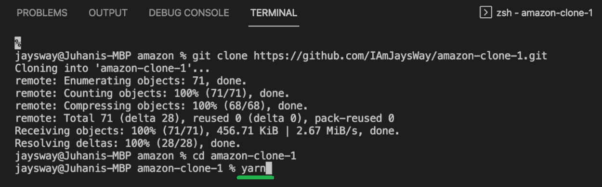

最后，您已经准备好运行您的模板应用程序。您可以通过在命令行中输入“纱线开始”来完成此操作:

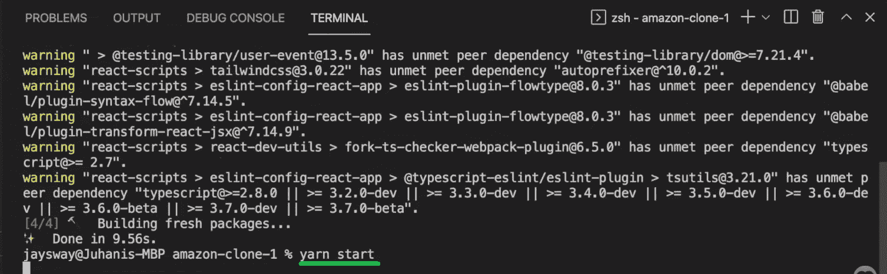

此外，这是您在运行上述命令后应该看到的内容:

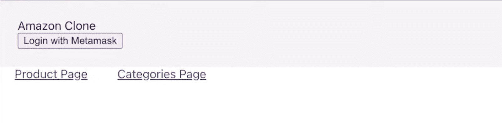

本质上，上面代表你的空白画布。通过使用下面视频教程中的细节，你将实现代码来构建一个 Web3 亚马逊市场。此外，这里还有您的项目将包含的所有文件的预览:

作为项目设置的最后一步，让我们确保您还导入了“antd”CSS 库。于是，转到“App.css”文件，粘贴“***@ import ' antd/dist/antd . CSS '；***’“在最顶端:

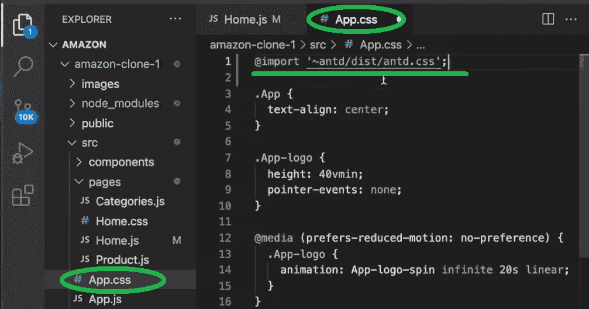

这个示例项目的另一个重要部分是完成您的初始 Moralis 设置。在这里，您将学习如何[创建一个 Moralis 服务器](https://docs.moralis.io/moralis-server/getting-started/create-a-moralis-server)并将其详细信息复制到“index.js”文件中(视频见下文 01:00:58):

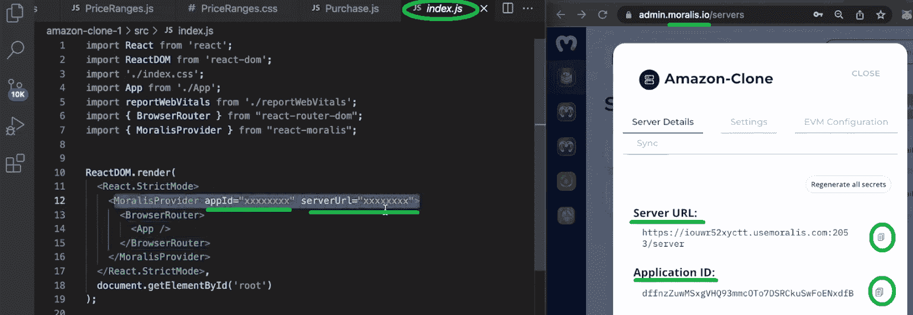

### 创建 Web3 亚马逊克隆-视频教程

初始设置完成后，我们将把您交给 Moralis 专家。在下面的视频中，他将首先向您展示如何着手创建与上述预览(05:45)相匹配的页眉。接下来，他会指导你如何建立你的主页(15:50)。然后，你将学习如何创建你的类别页(22:14)。在 47:14，Moralis 专家将指导您完成构建合适的产品页面所需的步骤。完成后，你将有你的前端准备好了。因此，您将开始关注后端。因此，您将首先完成上述 Moralis 设置。最后，您将了解满足所有后端需求是多么容易。多亏了 Moralis 的 Web3 API，这才成为可能。最后，你还将学习如何安排付款(01:05:57)。

*这是我们在文章* *:* 中一直引用的视频

https://www.youtube.com/watch?v=GKsIPkXWpyc

## 如何建立一个 Web3 亚马逊市场——总结

按照上面的说明和视频教程，你现在应该已经学会了如何用 Moralis 创建一个 Web3 Amazon 克隆。此外，你知道如何在一个多小时内建立一个 Web3 亚马逊市场。因此，您还知道如何正确地设置项目以及如何创建 Moralis 服务器。因为后者是您获得全部 [Moralis SDK](https://moralis.io/exploring-moralis-sdk-the-ultimate-web3-sdk/) 功能的门户，所以完成这一步至关重要。一旦创建了 Moralis 服务器，您就可以访问它的详细信息，然后将这些信息粘贴到您的代码中。

如果你喜欢这个教育教程，我们在 [Moralis 博客](https://moralis.io/blog/)和 [Moralis YouTube](https://www.youtube.com/c/MoralisWeb3) 频道还有很多其他的在等着你。除了示例项目之外，这两个渠道还对各种加密主题提供了很好的解释。因此，它们提供了一个免费了解区块链发展的绝佳途径。例如，一些最新的话题包括如何[将 Unity 应用程序连接到 Web3 钱包](https://moralis.io/how-to-connect-a-unity-app-to-a-web3-wallet/)， [Alchemy API 替代方案](https://moralis.io/alchemy-api-alternatives-web3-development-platforms/)，如何创建 [BNB 链令牌](https://moralis.io/how-to-create-a-bnb-chain-token-in-5-minutes/)，[克隆比特币基地钱包](https://moralis.io/cloning-coinbase-wallet-how-to-create-a-coinbase-clone/)，如何[创建索拉纳令牌](https://moralis.io/how-to-create-a-solana-token-in-5-steps/)，一个 [NFT 铸造页面](https://moralis.io/how-to-launch-an-nft-minting-page-full-walkthrough/)演练，如何[用 Unity 创建元宇宙 dApp](https://moralis.io/how-to-create-a-metaverse-dapp-with-unity/)，如何促进 [Web3 用户加入](https://moralis.io/how-to-boost-web3-user-onboarding-success-rates/)

然而，如果你真的想尽快成为一名区块链开发者，你可以考虑走一条更专业的道路。为了复制我们许多学生的成功，报名参加[Moralis 学院](https://academy.moralis.io/)可能正是你所需要的。除了获得专业课程，你还将成为一个最先进的社区的一部分。最重要的是，你将获得专家指导和个性化的学习路径。

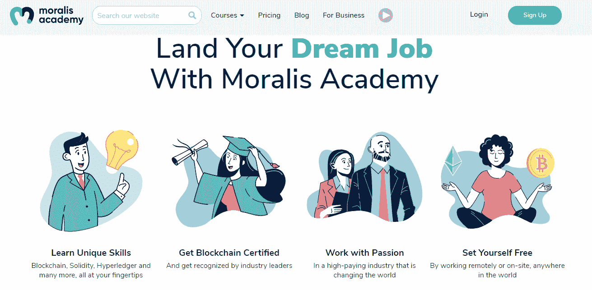