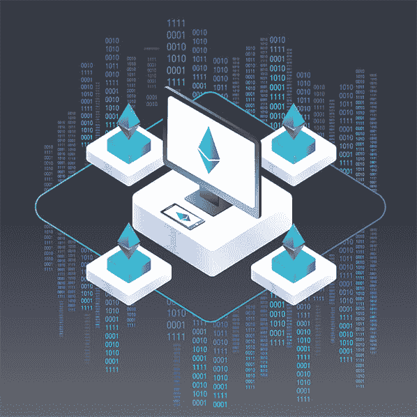
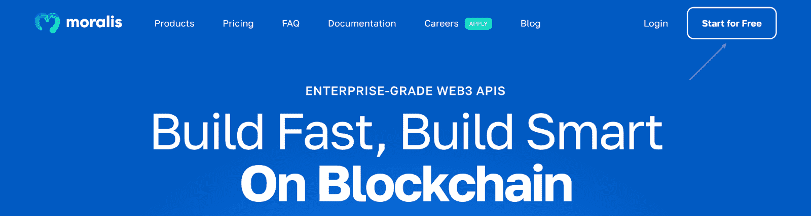

# 如何构建 Web3 应用程序

> 原文：<https://moralis.io/how-to-build-a-web3-app/>

不管你是 Web3 开发的新手还是业内有经验的人；每个人都应该知道构建 Web3 应用的最快方法是使用 [Moralis](https://moralis.io/) 。如果你想了解更多，请加入我们，我们将向你展示如何在几分钟内构建一个 Web3 应用程序！此外，您还可以选择跳过教程，直接进入代码。您将在下面找到我们将要创建的 dapp 的完整代码:

**完整样板文件库-**[**https://github . com/以太坊-样板文件/以太坊-样板文件**](https://github.com/ethereum-boilerplate/ethereum-boilerplate)

上面的存储库提供了来自 Moralis 的领先的以太坊样板，这是有助于更无缝的开发人员体验的工具之一。此外，这个模板使得构建一个 Web3 应用程序比平常快得多！此外，即使名字中包含“以太坊”，样板文件也兼容任何 EVM 连锁店，甚至索拉纳。因此，您也可以使用以太坊样板文件，例如，[构建一个多边形 dapp](https://moralis.io/how-to-build-a-polygon-dapp-in-3-steps/) 。熟悉 Moralis 的人已经知道，这是在 Web3 上构建的[最快的方法。](https://moralis.io/fastest-way-to-build-a-web3-app/)

样板文件——与诸如 Moralis 的 [Web3 认证 API](https://docs.moralis.io/docs/web3-authentication) 等工具相结合——有助于 Moralis 提供可访问性。例如，Auth API 使得 [Web3 认证](https://moralis.io/authentication/)无缝，允许你实现几个 [EIP-4361](https://moralis.io/exploring-eip-4361-sign-in-with-ethereum/) 兼容的认证机制。

所以，如果你想快速无缝地构建一个 Web3 应用，一定要马上注册 Moralis。创建一个帐户是免费的，你可以在几分钟内开始建设令人兴奋的区块链项目！

## 什么是 Web3 应用程序？–解释了 Web3 应用

在我们向您展示如何构建一个 Web3 应用程序之前，至少对于门外汉来说，回归基础并探索什么是 Web3 应用程序可能是有益的。但是，如果您已经熟悉这些类型的应用程序，请随意跳过这一初始部分，立即进入下一节中构建 Web3 应用程序的过程！



Web3 应用程序，或者通常被称为 dapps(去中心化应用程序)，很像传统的应用程序。然而，主要区别在于 dapps 具有 Web3 和区块链功能。这是开发者在以太坊这样的 P2P(点对点)网络上构建 dapps 的一个立竿见影的效果。此外，Web3 应用程序使用智能合约，这为创新的新解决方案的出现提供了大量机会，并彻底改变了几个经济部门。

“分散式应用程序”这个名称所揭示的一个中心特征就是分散化。这意味着 Web3 应用程序通常不受单一机构或实体的控制。此外，新一代应用程序的分散特性确保了不存在单点故障。因此，这增加了用户的安全性，并使 dapps 更不容易受到审查。

更重要的是，结合抗审查和更安全，dapps 还有其他好处。例如，由于 Web3 应用程序基于区块链并利用智能联系人，因此将加密货币集成到 dapps 的功能中变得很容易。此外，Web3 应用程序开源并不罕见。这将对整个社区产生积极影响，因为它是创新的驱动力。

尽管如此，对区块链应用程序有了基本的了解，现在是时候进入核心部分了，在这里我们将演示如何构建一个 Web3 应用程序！

## 如何使用 Moralis 构建 Web3 应用程序

随着对 Web3 应用程序有了更深刻的理解，现在是讨论中心话题的时候了，我们将向您展示如何构建 Web3 应用程序。您即将构建的 Web3 应用将允许用户使用他们的 [Web3 钱包](https://moralis.io/what-is-a-web3-wallet-web3-wallets-explained/)登录。通过身份验证后，他们可以查看自己的交易历史、余额等。然而，稍后会有更多的介绍。


首先，我们将探索 Moralis 的以太坊样板。这将说明你的工作目标和最终产品的样子。此外，由于以太坊样板，您将能够只通过三个步骤构建一个 Web3 应用程序:

1.  复制样板文件
2.  配置环境变量
3.  启动 Web3 应用程序

以上步骤使得在几分钟内构建一个 Web3 应用成为可能！然而，在我们开始学习教程之前，您需要做的第一件事是创建一个 Moralis 帐户。要注册 Moralis，您需要点击 Moralis 网站顶部的“免费开始”按钮:



在那里，你需要填写必要的信息并点击“注册”:


现在，有了一个 Moralis 帐户，我们可以通过探索 Moralis 的以太坊样板文件继续学习“如何构建 Web3 应用程序”教程！

## 构建一个 Web3 应用——Moralis 的以太坊样板

首先，我们将更详细地探索 Moralis 的以太坊样板，使您能够构建一个 Web3 应用程序！此外，这将说明你正在努力的方向。然而，当有人启动您的 dapp 时，他们将到达以下登录页面:


如上图所示，Web3 应用程序的顶部有一个导航栏。此外，您有四个选项可供选择:“家庭”、“交易”、“转账”和“余额”。然而，在使用钱包识别您的 [Web3 身份](https://moralis.io/web3-identity-the-full-guide-to-authentication-identity-and-web3/)之前，这些不会提供太多信息。要验证您的身份，您需要点击“连接钱包”按钮:


只要你按下这个按钮，它就会触发你的 MetaMask 钱包。从那里，你将能够签署一个消息。通过身份验证后，Web3 应用程序将填充与您的钱包相关的信息。因此，如果您现在单击“Transactions”选项卡，它应该会在一个表格中显示您的交易历史:


除交易外，您还可以点击“转账”或“余额”。这两个选项卡都有一个下拉菜单，允许您在“ERC-20”和“NFTs”之间进行选择。例如，如果您单击“Balances”，它应该是这样的:


如果您在“Balances”选项卡中选择了“NFTs”选项，它会在一个整洁的表格中显示您的 NFTs:


同样的原则也适用于“ERC-20”备选方案和“转让”选项卡。此外，样板文件还具有明暗模式。因此，您可以使用最右侧的按钮在这些选项之间切换:


现在你知道我们的目标是什么，我们将举例说明如何快速构建这个 Web3 应用程序。因此，不再拖延，让我们直接进入第一步，了解如何克隆以太坊样板文件！

### 第一步:克隆样板文件

构建 Web3 应用程序的第一件事是打开您最喜欢的 IDE 或集成开发环境。我们将使用 VSC (Visual Studio 代码)。如果您使用另一个环境，这个过程可能会有所不同。然而，不用担心；无论如何，很可能不会有任何重大分歧。

启动 IDE 后，必须创建一个新文件夹。您可以随意命名这个文件夹，在我们的例子中，我们将其命名为“样板”。有了这个文件夹，您将需要导航到 GitHub repo，您可以在本文的介绍或开头找到它。在那里，您可以单击右侧的“代码”按钮，然后复制回购 URL:


一旦您复制了 URL，您就可以导航到您的 IDE 并打开一个新的终端。为此(如果您使用的是 VSC)，您可以点击顶部的“终端”选项卡，然后点击“新建终端”:


现在，打开一个新的终端，repo URL 可供您使用，您可以使用以下命令克隆项目(确保在您之前创建的文件夹的位置运行该命令):

```js
git clone “BOILERPLATE_URL”
```

使用以太坊样板代码运行上面的命令后，您可以通过该命令导航到正确的文件夹:

```js
cd ethereum-boilerplate
```

如果您继续操作，并在正确的位置输入正确的命令，您应该得到如下所示的结构:


### 第二步:环境变量配置

项目在本地目录中可用，现在是时候对环境变量进行一些配置了。因此，您可以打开“. env.local.example”文件:


正如您在上面看到的，您将需要配置一些变量。让我们从顶部的" *APP_CHAIN_ID* "变量开始。最初设置为“ *0x1* ，对应以太坊主网。如果你想为以太坊创建 dapps，你可以让这个保持原样。然而，Moralis 是跨链兼容的。这意味着你可以为其他类似的连锁店开发 dapps。如果你想了解更多信息，你可以在这里找到所有支持的链[。](https://docs.moralis.io/reference/supported-chains-for-nft-api)

您必须配置的以下变量是" *MORALIS_API_KEY* "。要获取您的 API 密钥，请登录您的 Moralis 帐户并导航至管理面板。在那里，您可以单击左侧的“Account”，按“Keys”选项卡，然后复制“Web3 Api Key”:


有了这个密钥，您可以简单地将" *MORALIS_API_KEY* "变量设置为等于这个值。接下来，你需要给“ *NEXTAUTH_SECRET* 加一个值。如果你需要帮助，你可以使用下面的链接来创建一个新的秘密:【https://generate-secret.now.sh/32。

最后，“ *NEXTAUTH_URL* ”当前设置为“ [http://localhost:3000](http://localhost:3000/) ”。目前，让它保持原样是很好的。因此，它将允许您在本地主机上测试应用程序。但是，当您计划启动 dapp 时，需要将其更改为 dapp 的 URL。

此外，在我们向您展示如何启动 dapp 之前，您必须将文件名改为“. env.local”。" . env.local "文件的最终代码应该如下所示:

```js
APP_CHAIN_ID=0x1
APP_DOMAIN=ethereum.boilerplate 
MORALIS_API_KEY= "YOUR_API_KEY"
NEXTAUTH_SECRET= b8e786967d7bcbc0f920d35bcc3f891c
NEXTAUTH_URL=http://localhost:3000
```

### 第三步:启动 Web3 应用程序

配置完成后，下一步是启动 dapp。但是，在启动 dapp 之前，您需要安装依赖项。此外，根据您使用的是“*纱线*还是“ *npm* ，您可以在终端中输入以下任一项:

```js
npm i
yarn
```

接下来，剩下的工作就是执行这个命令，在本地主机上运行应用程序:

```js
npm run dev
yarn run dev
```

如果您想要访问 Web3 应用程序并确保一切功能正常，您可以通过之前指定的 URL 启动 dapp:[http://localhost:3000](http://localhost:3000/)。

就是这样！现在，您知道了如何通过三个简单的步骤使用 Moralis 构建一个 Web3 应用程序。现在，您可以通过添加或删除潜在客户想要/不想要的功能来定制该模板。然而，使用 Ethereum 样板文件可以让您快速启动应用程序，并且它可能提供先发优势！

如果你在这个教程中遇到了麻烦，或者想看一个解释这个过程的视频，一定要看看下面这个来自 [Moralis 的 YouTube](https://www.youtube.com/c/MoralisWeb3) 频道的视频:

https://www.youtube.com/watch?v=Bb5Pc–kyAY

## 如何构建 Web3 应用——总结

如果您阅读了整篇文章，您现在知道如何构建 Web3 应用程序。多亏了 Moralis 和以太坊样板，你可以在一瞬间创建 dapp。事实上，您可以通过以下步骤在创纪录的时间内做到这一点:

1.  复制样板文件
2.  配置环境变量
3.  启动 Web3 应用程序

如果你觉得这个指南很有趣，想要更多精彩的内容，可以看看 Moralis 的 [Web3 博客](https://moralis.io/blog/)。该博客的特色是每天更新的新鲜和引人入胜的内容。例如，你可以了解不同的[类型的 Dao](https://moralis.io/full-2022-guide-to-different-types-of-daos/)或者[如何建立一个分散的社交媒体档案](https://moralis.io/how-to-build-a-decentralized-social-media-profile/)！

此外，您应该查看官方的 Moralis 规范文档。在那里，你会找到更多关于 Moralis 如何工作的教程。例如，您可以探索 [Solana API](https://docs.moralis.io/reference/solana-api) ，它允许您为 Solana 网络构建独特的项目。你还可以探索 Moralis [Web3 Streams](https://moralis.io/streams/) API，使你能够在任何网络上接收 webhooks。

此外，如果你是这个行业的新手，你可以在 Moralis 学院学习 Web3 开发的基础知识。学院为初学者和更有经验的开发者提供精彩的[区块链课程](https://academy.moralis.io/all-courses)。例如，报名参加“[区块链&比特币基础](https://academy.moralis.io/courses/blockchain-bitcoin-101)”课程开始学习吧！


如果这篇文章激起了你进一步探索 Web3 开发领域的兴趣，[注册 Moralis](https://admin.moralis.io/register) ！创建一个帐户将提供对平台工具的即时访问，使您未来的开发工作更加无缝。