# 如何建立一个 Web3 增强现实 NFT 战利品箱

> 原文：<https://moralis.io/how-to-build-a-web3-augmented-reality-nft-loot-box/>

你知道增强现实早在 1968 年就被发明了吗？然而，直到 1990 年，“增强现实”这个术语才被创造出来。尽管如此，这项令人兴奋的技术在过去几年里才真正开始得到更广泛的应用。尽管如此，大多数增强现实应用程序仍然运行在集中式 Web2 技术上。而且，由于我们相信去中心化的未来，我们决定向您展示如何轻松创建 Web3 增强现实 dapp ( [**去中心化应用**](https://moralis.io/decentralized-applications-explained-what-are-dapps/) **)。用右边的**[**Web3 tech stack**](https://moralis.io/exploring-the-web3-tech-stack-full-guide/)**，你可以使用 Unity 为你的 web 3 增强现实功勋。这要归功于 Moralis，最终的 Web3 开发平台**[**Moralis**](https://moralis.io/)**。这款**[**Firebase for crypto**](https://moralis.io/firebase-for-crypto-the-best-blockchain-firebase-alternative/)**提供了一种非常直接的方式来为你的 Unity 应用配备 Web3 功能。这样，你可以在几分钟内实现** [**Web3 认证**](https://moralis.io/web3-authentication-the-full-guide/) **。此外，** [**Moralis 的 SDK**](https://moralis.io/exploring-moralis-sdk-the-ultimate-web3-sdk/) **也使您能够轻松处理******链上事件，并创建一个** [**链上库存系统**](https://moralis.io/create-an-nft-on-chain-inventory-system-for-gaming/) **。****

**在我们看来，Web3 增强现实有很多优点。在现实世界中实现虚拟物体是一件很酷的事情。当然，Web3 引入的真正所有权为用户增加了很多价值。后者可以通过引入不可替换令牌(NFT)很容易地实现。当然，如果你是第一次接触 [dapp 开发](https://moralis.io/dapp-development-tutorial-full-guide-to-building-a-dapp/)，创建自己的 Web3 增强现实(AR) dapp 听起来可能会非常棘手。然而，在这里你将有机会在大约一个小时内建造你自己的 AR NFT 战利品箱。此外，即使您是 Unity 的新手，完成这个示例项目应该没有问题。此外，在这个过程中，你将学会如何利用最好的 [Web3 后端平台](https://moralis.io/exploring-the-best-web3-backend-platform/)。此外，您还将熟悉坚固性基础知识和安全帽。所以，请务必[创建您的免费 Moralis 账户](https://admin.moralis.io/register)并跟随我们。**

**

## Web3 增强现实 Unity Dapp–演示

在我们邀请你卷起袖子，构建自己的 Web3 增强现实 dapp 实例之前，我们希望确保你知道未来会发生什么。因此，让我们从我们的示例 AR dapp 的快速演示开始。这是我们 Android dapp 的初始屏幕:

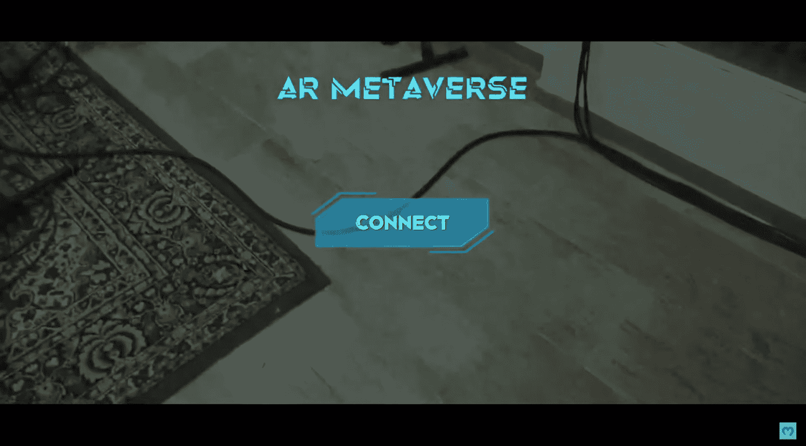

正如你在上面的截图中看到的，用户需要点击“连接”按钮开始。通过这样做，我们的示例 dapp 自动连接到用户的 Web3 钱包:

当然，用户需要确认他们的加密钱包内的连接才能继续。一旦用户完成他们的 [Web3 登录](https://moralis.io/how-to-build-a-web3-login-in-5-steps/)，他们就可以通过智能手机的摄像头在屏幕上看到真实的世界:

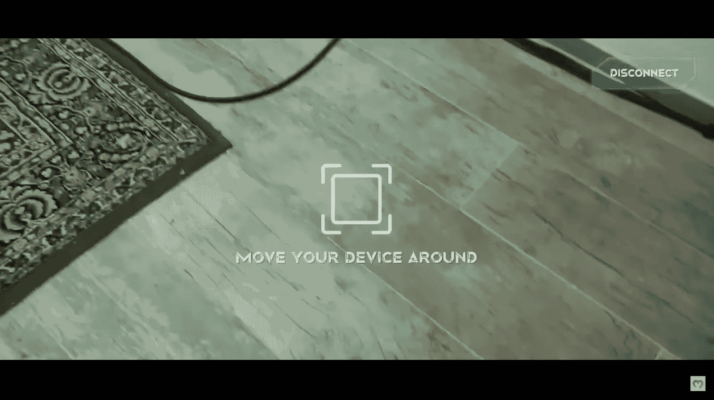

此外，正如屏幕上的说明所示，用户可以自由移动他们的智能手机。接下来，用户需要在屏幕上点击，将对象放在选定的位置:

在我们的示例 Web3 增强现实 dapp 中，对象是一个 NFT 战利品盒。点击后，后者会出现在屏幕上:

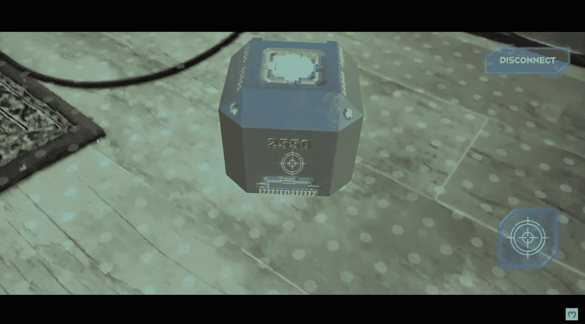

看上面的截图，你可以看到 NFT 战利品箱顶部的蓝色灯。这是用户打开盒子需要点击的地方:

此外，正如你在上面的截图中看到的，十字准线固定在屏幕的中间。因此，它与设备一起移动:

此外，右下角有一个十字图标，指示“拍摄”阶段。此外，当用户最终点击盒子顶部的蓝色灯时，盒子打开:

### 在我们的 Web3 增强现实 Dapp 中铸造–演示

接下来，玩家需要点击从盒子里出来的发光物品。这给了他们一个机会将这件物品铸造成 NFT:

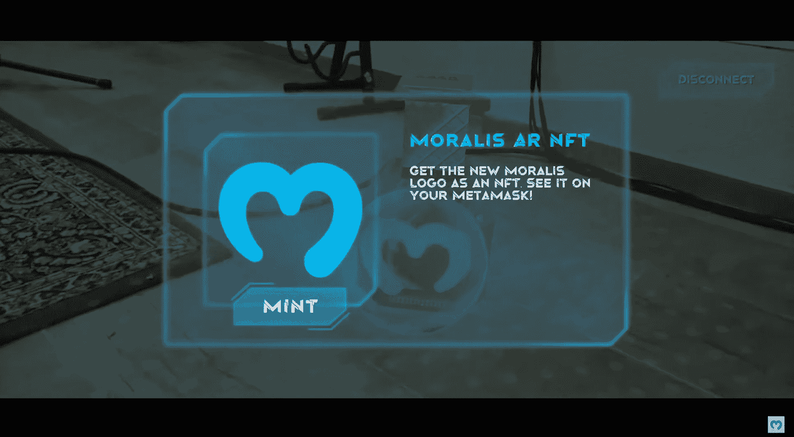

当用户看到上面的屏幕时，他们需要点击“mint”按钮。此外，屏幕上的信息告诉他们使用他们的 Web3 钱包来确认交易:

此外，他们的钱包会自动弹出，用户需要点击“确认”按钮:

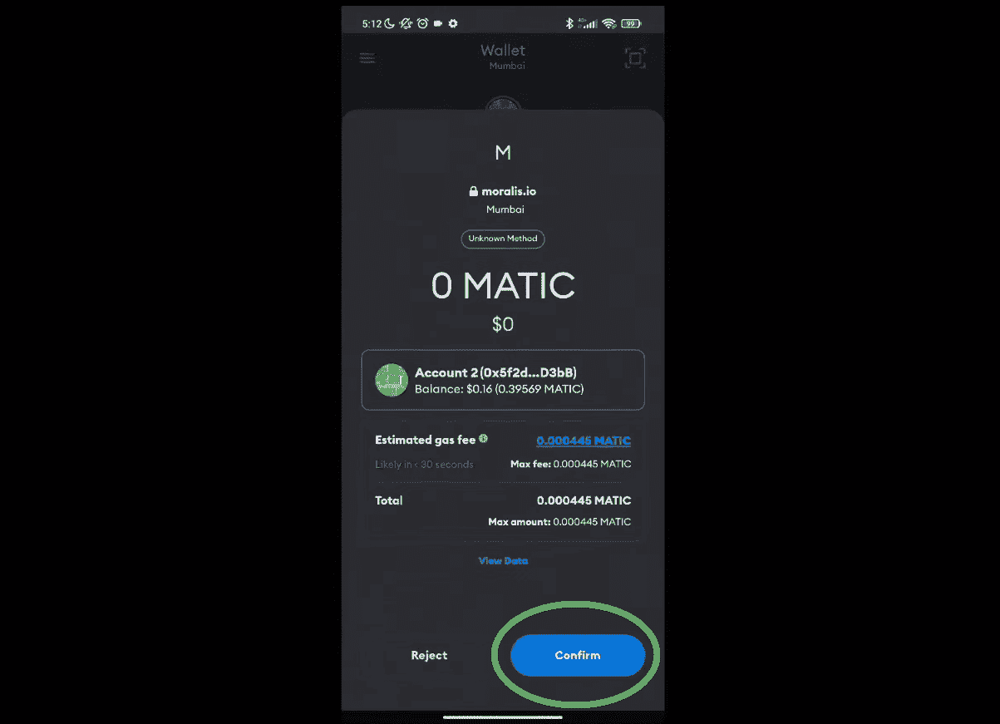

确认铸造交易后，用户可以再次点击 NFT，将其导入他们的 [MetaMask](https://moralis.io/metamask-explained-what-is-metamask/) 钱包:

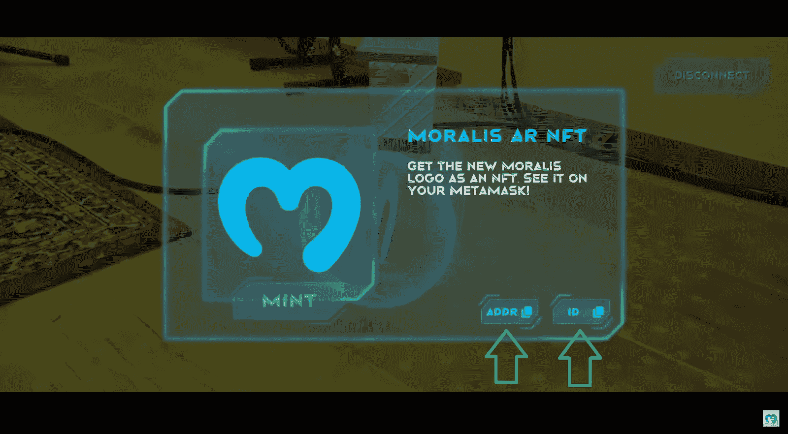

通过点击“地址”按钮，他们的元掩码钱包再次弹出，在那里他们需要粘贴复制的地址:

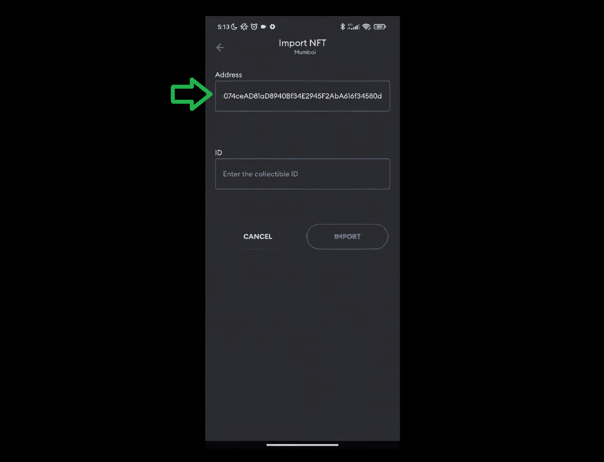

然后，用户需要返回到我们的 dapp 屏幕，点击“ID”按钮，重复上述 ID 步骤:

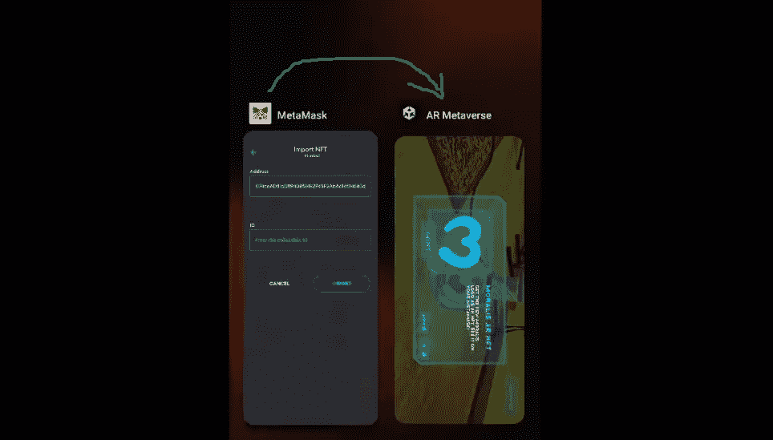

一旦用户填充了“地址”和“ID”字段，他们就可以点击“导入”按钮:

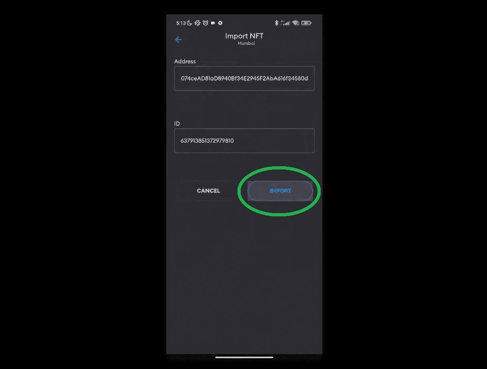

通过导入来自 NFT 战利品盒的 NFT，用户现在可以在他们的钱包里看到它:

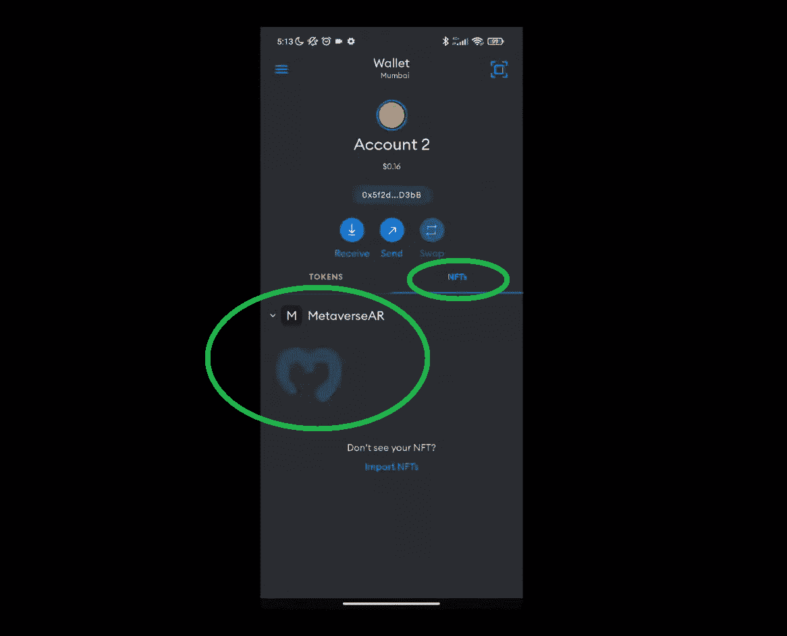

*注意* *:如果你喜欢看我们 dapp 的视频演示，你可以在文章底部看到*

# 用 Unity、Hardhat 和 Moralis 构建一个 Web3 增强现实 NFT 战利品箱

现在是时候动手打造自己的 Web3 增强现实 dapp 了。当然，你不必从头开始——相反，你可以使用我们在 [GitHub](https://github.com/MoralisWeb3/unity-web3-sample-ar-metaverse) 上等待你的示例项目。此外，正如在简介中提到的，Moralis 是一个强大的工具，可以让你毫不费力地完成所有的 [Unity Web3](https://moralis.io/unity-web3-beginners-guide-to-unity-web3-programming/) 集成。因此，如果你还没有创建你的免费 Moralis 账户，请务必创建。

接下来，我们将分六个主要阶段处理今天的示例项目:

1.  首先，我们将重点关注使用 Unity 进行 AR 开发所需的项目设置和要求。
2.  第二，我们将帮助您完成初始 Moralis 设置。在这里，您将获得您的 dapp 证书以连接 Unity 和 Web3。
3.  第三，我们将做项目概述。结合上面的演示，这将确保您知道需要实现什么功能。
4.  第四，我们将向您展示如何创建一个元宇宙项目。在这里，你将熟悉从 [IPFS](https://moralis.io/what-is-ipfs-interplanetary-file-system/) 加载数据以从战利品箱中创建物品。
5.  第五，您将可以使用我们的智能合约，并使用 Hardhat 进行部署。这一阶段还将包括一些初步的安全帽设置。
6.  第六，你将学习如何让用户把战利品箱中的物品铸造成 NFT。

这里还有一些关于我们的示例项目的附加细节:

*   我们将关注哪个区块链？多边形测试网(孟买)。请记住，Moralis 是跨链互操作的，这意味着您可以对其他区块链使用相同的代码(稍加修改)。
*   我们将关注什么系统？安卓。*请注意，您也可以使用本教程来创建 iOS dapp。*

*注* *:所有时间参考参考下面的视频教程。*

## 阶段 1:项目设置

对于这个项目，我们将使用 Unity 的 AR 基础框架，它结合了 AR 核心和 AR 工具包。这些工具使你能够为 Android 和 iOS 构建 Unity 应用程序。因此，我们安装了所有需要的包。但是，在打开项目之前，请确保安装了正确的构建支持。为此，请使用您的 Unity Hub:

*注意* *:为了避免任何兼容性问题，请确保安装与上述相同的版本。*

在“添加模块”窗口中，确保您安装了 Android 构建支持:

*注意* *:如果你想专注于 iOs，你需要安装 iOS 构建支持。*

此外，还要记住，我们使用了 Unity 的 AR 模板来构建这个项目。您可以通过单击“项目”选项卡上的“新建项目”来访问此选项:

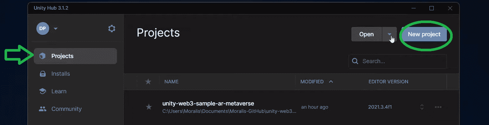

“AR”模板附带安装了所有必需的软件包和依赖项:

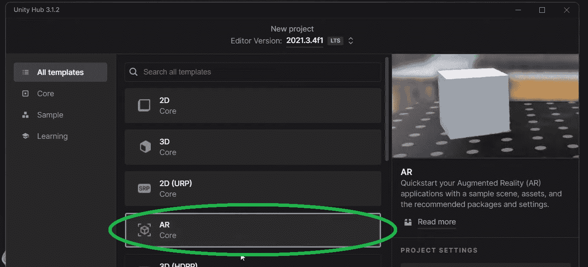

考虑到这一点，是时候使用上面的“GitHub”链接并打开今天的项目了:

所有的设置都应该与我们的相匹配；但是，我们鼓励您使用下面的视频(7:38)手动检查。

## 第二阶段:建立你的 Moralis 观

如果您已经执行了上述设置检查，您将首先需要重新打开“Moralis Web3 设置”窗口:

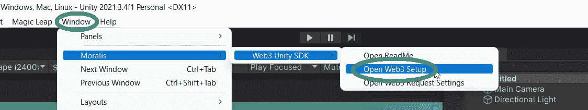

打开“Moralis Web3 设置”窗口后，您会看到两个输入字段——“Dapp URL”和“Dapp ID”:

此外，正如您在上面的屏幕截图中看到的，该窗口为您提供了关于如何获取所需凭证的简单说明。但是，为了进一步帮助您，请遵循以下步骤(9:17):

1.  创建您的 Moralis 帐户或[登录](https://admin.moralis.io/login)您现有的帐户:

2.  单击“创建新的 Dapp”按钮:

3.  选择“Testnet”环境:

4.  选择“多边形孟买”并点击“继续”按钮:

5.  选择离您最近的城市，然后继续:

6.  输入您的 dapp 的名称，然后点击“创建您的 Dapp”按钮:

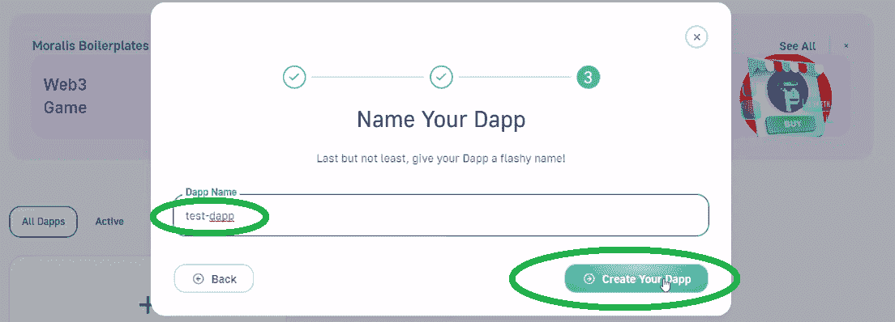

7.  一旦您的 dapp 启动并运行，请点击“设置”以访问其凭据:

8.  复制您的 dapp URL 和 ID:

9.  将以上复制的详细信息粘贴到 Unity 中的“Moralis Web3 设置”窗口，然后单击“完成”:

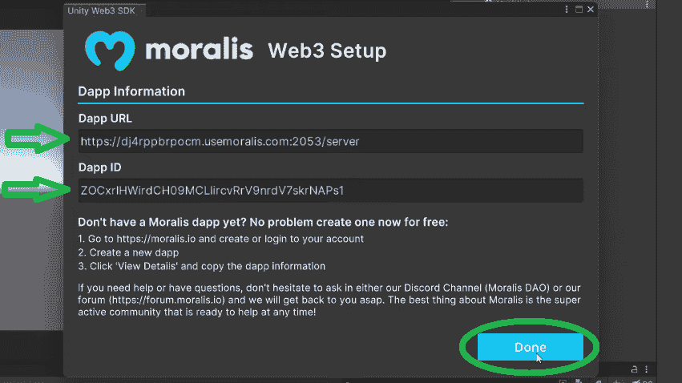

## 阶段 3: Unity 项目结构概述–我们的 Web3 增强现实 Dapp

为了打开“主”场景，导航到“场景”文件夹:

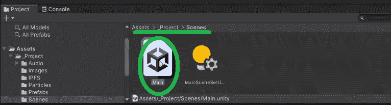

因此，在“层次”窗口中应该有“主”场景:

因此，您可以看到该场景已经包含了“AuthenticationKit”，它负责 Web3 身份验证。但是，你的主要关注点应该是“GameManager”，也就是状态机。“游戏管理器”将确保你的 Web3 增强现实 dapp 功能如上面的演示所示。此外，“游戏管理”通过其多种状态(游戏对象)来实现:

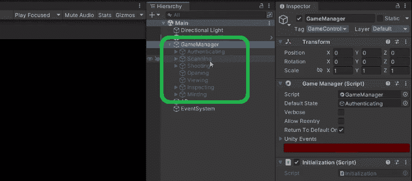

每个状态都包含适当的代码，这些代码根据每个状态的目的执行必要的操作。上述国家的名称清楚地表明了它们的目的。*要更详细地了解每场比赛的状态，请观看下面的视频，从 12:25 开始。*

## 阶段 4:创建元宇宙项目

从以下视频的 18:47 开始，我们的内部专家将向您展示如何制作元宇宙单品。“开幕”脚本负责创建元宇宙项目的要点。但是，你也将有机会看到我们的 Web3 游戏是如何登上舞台的。因此，您将仔细查看“扫描”和“拍摄”脚本。在 24:40，你将会看到“MetaverseItem”预制品是如何与 IFPS 网址一起工作的:

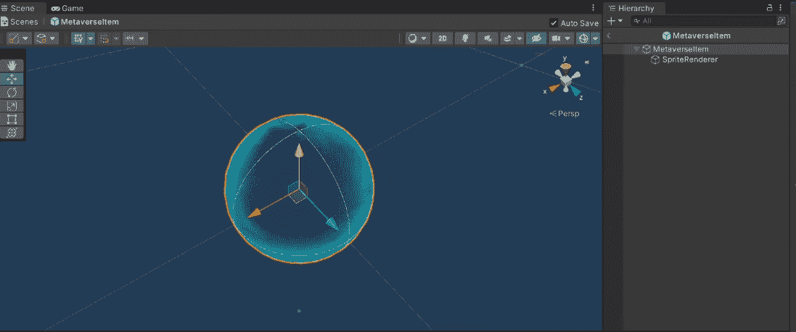

因此，您将看到“MetaverseItem”脚本如何使用 IPFS URL 来获取图像 URL 并创建 sprite。

*注意* *:对于这个例子项目的目的，你可以使用我们的 IPFS 网址。*

接下来，您将看到“查看”脚本的细节(31:40)，它检查用户何时点击从战利品框中出来的元宇宙物品。后者导致“正在检查”状态:

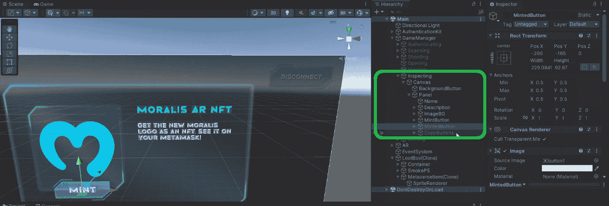

## 阶段 5:部署您的智能合同

为了激活你的 Web3 增强现实 dapp 的“Mint”按钮，你需要将你的智能合约的 ABI 和地址添加到“GameManager”脚本中:

因此，您将需要部署[我们的智能合同](https://github.com/MoralisWeb3/unity-web3-sample-ar-metaverse/blob/main/Assets/_Project/SmartContract/MetaverseAR.txt)。关于如何用 Hardhat 做这件事的详细指导，请跳到 36:39。此外，这里有你可以遵循的[书面说明](https://github.com/MoralisWeb3/unity-web3-sample-ar-metaverse/blob/main/Assets/_Project/SmartContract/INSTRUCTIONS.txt)。

*注意* *:如果您熟悉 Remix，可以使用在线 IDE 随意部署您智能合约。此外，确保在元掩码中有一些“play”MATIC。你可以使用* [*孟买水龙头*](https://moralis.io/mumbai-testnet-faucet-how-to-get-free-testnet-matic-tokens/) *来达到那个目的。*

## 第六阶段:铸造一个 NFT

至此，您已经成功部署了您的智能合约，并将您的 [Web3 合约](https://moralis.io/what-are-web3-contracts-exploring-smart-contracts/)的 ABI 和地址粘贴到“GameManager”脚本中。因此，您已经准备好了解关于“铸造”脚本的更多细节(57:00)。本质上，“ExecuteMinting”函数通过将上面讨论的元数据 URL 作为参数来完成所有繁重的工作。此外，由于 Moralis，你可以很容易地做到这一点:

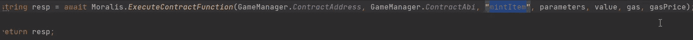

最后但同样重要的是，这里有视频教程:

https://www.youtube.com/watch?v=Ne33FSVnMzw

## 如何建立一个 Web3 增强现实 NFT 战利品箱-总结

在今天的文章中，你了解到，由于 Moralis 的力量，你可以用 Unity 创建很酷的 Web3 增强现实 dapps。此外，使用我们的示例项目，您有机会创建自己的 Web3 增强现实 dapp。因此，您学习了如何将 Unity 与 Web3 功能连接起来，以及如何使用 Hardhat 来部署智能合同。此外，通过仔细查看一些最重要的脚本，您也有机会了解更多关于用 Unity 创建的 AR 游戏的所有重要活动部分。

如果你喜欢这个示例项目，我们鼓励你访问[Moralis 的 YouTube 频道](https://www.youtube.com/c/MoralisWeb3)和[Moralis 的博客](https://moralis.io/blog/)。例如，你可以学习构建一个 [Web3 角色扮演游戏](https://moralis.io/how-to-build-a-web3-action-role-playing-game/)或 [Web3 MMORPG](https://moralis.io/build-a-web3-mmorpg-with-unity-in-10-minutes/) 。另一方面，也可以随意探讨其他话题。一些最新的文章解释了我们的[以太坊 dapp API](https://moralis.io/what-is-an-ethereum-dapp-api-build-ethereum-dapps-easily/) ，如何建立一个 [Web3 博客 dapp](https://moralis.io/guide-to-creating-a-web3-blog-dapp/) ，[以太坊合并](https://moralis.io/ethereum-merge-what-is-ethereum-2-0-and-the-merge/)，或者我们的[以太坊 NFT API](https://moralis.io/what-is-an-ethereum-nft-api-ethereum-nft-apis-explained/)——这是任何有抱负的 [NFT 程序员](https://nftcoders.com/)的必备。不难理解为什么 Moralis 最近被评为[最佳 web3 创业公司之一](https://moralis.io/moralis-named-among-top-web3-startups-in-sifteds-europe-rising-100-report/)！

而且，如果你想快速自信地成为一名 Web3 开发者，我们推荐 T2 Moralis 学院。在这里，您可以报名参加专业的[区块链发展课程](https://academy.moralis.io/all-courses/)，获得个性化的学习路径和专家指导，并成为业内最先进社区的一员。**