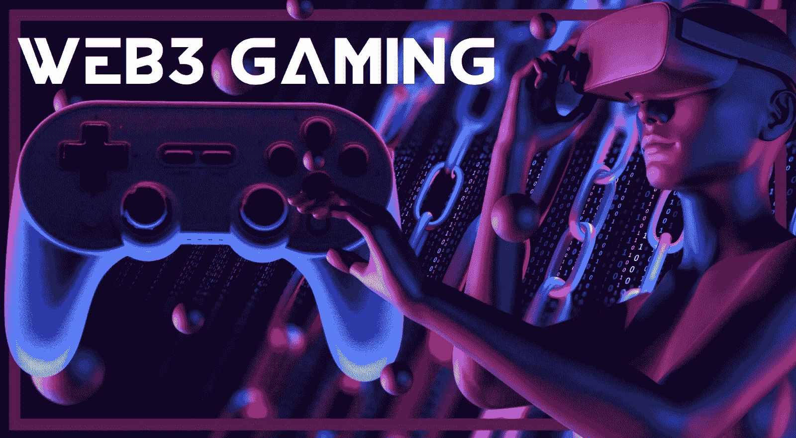
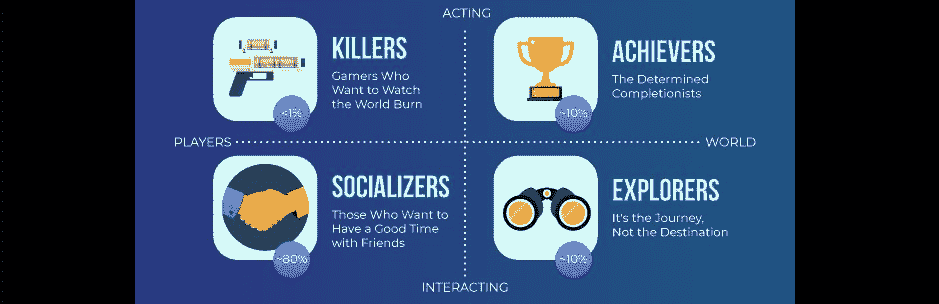
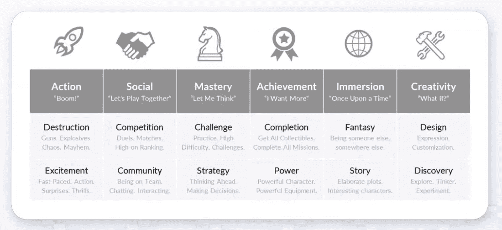
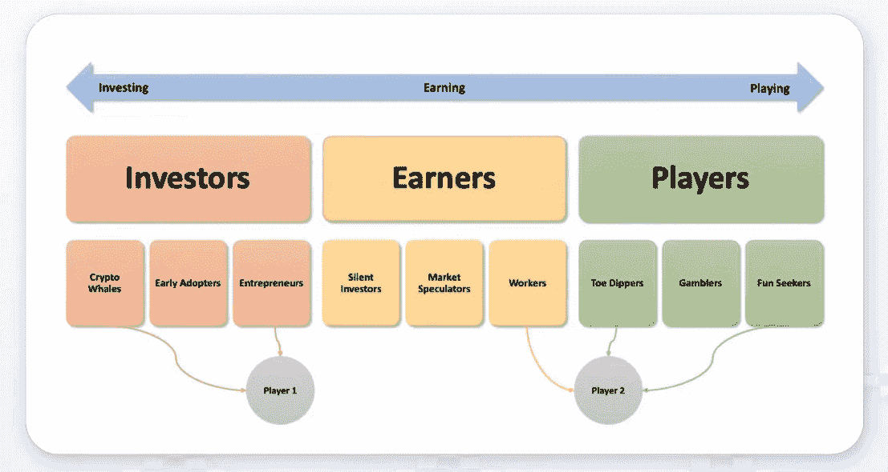

# 如何构建 Web3 FIFA 克隆版

> 原文：<https://moralis.io/how-to-build-a-web3-fifa-clone/>

全球无数人喜欢玩充满活力、乐趣和竞争性的体育游戏 FIFA。因此，这款游戏是 Web3 模式的完美候选。通过跟随这篇文章，我们不仅希望你在基于 Web3 的 FIFA 游戏中取得进球，还希望你达到这篇文章的主要目标，获得灵感并构建一个 Web3 FIFA 克隆版。此外，在本教程结束时，如果你想进一步提高你的 Web3 游戏开发技能，并真正为 Web3 创建一个 FIFA 的克隆版，你将知道你的下一步应该是什么。最好的部分是，你可以使用遗留的工具，如团结为所有区块链发展的努力，所有感谢 Moralis。

领先的企业级 Web3 API 提供商 Moralis 使您能够整合所有类型的 Web3 特性。首先，您可以使用 Moralis 的 [Web3 认证](https://moralis.io/authentication/)解决方案，允许用户将他们的 Web3 钱包连接到您的 dapps，并为他们提供进入加密域的网关。然后，通过使用最终的 Web3 API，您可以毫不费力地查询所有链上数据。此外，您还可以使用 Moralis 最先进的 NFT API 整合 NFT 功能。更重要的是，您可以在几个受支持的链上这样做。因此，你可以让你的 Web3 游戏具有跨链的互操作性，并绕过许多开发者面临的问题——只能使用一个区块链。因此，如果你认为你有能力构建一个 Web3 FIFA 克隆版，[创建你的免费 Moralis 账户](https://admin.moralis.io/register)，开始连接 Web2 和 Web3。

## 国际足联是什么？

国际足联，或国际足球协会联合会，是足球协会、沙滩足球和五人制足球的国际管理机构。国际足联于 1904 年在巴黎成立；然而，其目前的总部设在瑞士苏黎世。此外，这一管理机构在很大程度上促进了足球的普及(又称足球协会或英式足球)。毕竟，足球(不要误认为是美式足球)仍然是世界上最受欢迎的运动。

然而，当在游戏环境中讨论 FIFA 时，它指的是最受欢迎的体育视频游戏之一。国际足联运动会已有近三十年的历史，于 1993 年首次发布。从那以后，这款游戏每年都有一个新版本，确保所有最新的玩家、球场和其他细节都是最新的。一路走来，图形和游戏内的功能得到了显著改善。当然，并不是所有的系列都同样成功。例如，FIFA 12 保持着“有史以来销售最快的体育游戏”的记录。不过这款游戏的一致性和高质量一直都处于非常高的水平。再者，各大平台都支持 FIFA 游戏。此外，据游戏发行商 EA Sports 宣布，从 2023 年起，该游戏将被称为 [*EA Sports FC*](https://www.ea.com/news/ea-sports-fc?isLocalized=true) ，标志着足球娱乐的新时代。

有着如此悠久的历史，你以前玩过 FIFA 游戏的几率相当高。因此，你可能记得玩这个游戏的兴奋。当和朋友、同龄人面对面或在线玩的时候尤其如此。现在，想象一下国际足联拥有 Web3 的所有好处。那么，如何打造 Web3 FIFA 克隆版呢？在回答这个问题之前，我们先来看看游戏动机和玩家类型。

### 是什么让我们选择我们最喜欢的游戏

在制作 Web3 游戏时，事情的开始与 Web2 游戏一样——灵感。然而，由于 Web3 的功能增加了价值，你可以从流行的 Web2 游戏中获得灵感。构建 Web3 FIFA 克隆版时就是这种情况。不过，总的来说，你应该记住玩家因为各种原因喜欢游戏。因此，游戏应该在情感上与玩家建立联系。它还应该符合玩家的动机，并与他们的玩家类型相匹配。本质上，玩家的游戏动机和玩家类型将决定他们最喜欢的游戏。

例如，玩家类型的“Bartle 分类法”将他们分为四类:“社交者”、“探索者”、“成功者”和“杀手”。

如上图所示，“杀手”和“成功者”更喜欢表演而不是互动。“成功者”专注于完成任务或其他游戏内任务，“杀手”则享受毁灭。然而，你也可以看到大多数人(大约 80%)是“社交者”，他们只是想和朋友们玩得开心。

此外，Quantic Foundry 的最新研究确定了与九种游戏玩家类型相匹配的十二种游戏玩家动机。他们的模型明确指出，玩家的动机决定了他们的类型，类型决定了他们喜欢的游戏。以下是主要动机的列表:

此外，根据 Quantic Foundry 的研究人员，以下是九种主要的玩家类型:

此外，还值得指出的是，大多数玩家只有一种玩家类型。但是，有些用户可能属于多种玩家类型。

尽管如此，将 Web3 带到桌面上，一个新的频谱开始应用:

看上面的图片，你可以看到 Web3 gaming 将参与者分为投资者、赚钱者和玩家。因此，Web3 功能拓宽了视野，并提供了无数额外的机会。

## 构建 Web3 FIFA 克隆版——理论

既然你已经熟悉了喜爱的游戏背后动机的复杂性，你可能会同意与测试过的赢家合作是有意义的。因为我们知道 FIFA 是那些测试过的赢家之一，所以建立一个 Web3 FIFA 克隆是一个安全的赌注。当然，构建像 FIFA 这样的游戏的 Web2 功能需要大量的资源。因此，我们将集中在理论上解决这一壮举。关键的一点是，如果你能处理 Web2 方面，你将很容易添加 Web3 特性。毕竟，Moralis 会支持你。

现在，如果您想学习更多包含代码示例的实用教程，请务必查看我们最近在 Moralis 的 Web3 博客上发表的文章。例如，我们为有抱负的区块链开发者准备了一个指南，告诉他们如何通过三个简单的步骤创建一个 Web3 dapp！

### 熟悉 Moralis

Moralis 是一整套企业级 Web3 APIs，由于 Moralis 的跨链互操作性，它使您能够将任何技术栈连接到几个流行的区块链网络。此外，Moralis SDK 支持所有领先的 Web2 开发平台，如 Firebase、Supabase、Unity、React Native 等。因此，Web2 开发人员可以加入 Web3 革命，而无需花费时间学习新的编程语言。

此外，Moralis 通过专注于简单性和效率来满足 Web3 游戏和 dapps(去中心化应用)的需求。此外，由于 Moralis 的 Unity SDK，您可以使用 Unity 的灵活性，进而为新兴的 Web3 创建自己的实时解决方案。此外，除了各种 2D 或 3D dapps，你还可以轻松地创建惊人的 Web3 游戏，甚至是 Web3 FIFA 的克隆。

此外，Moralis 包括一个完整的学习资源范围。这些包括[Moralis 文件](https://docs.moralis.io/)、 [Web3 YouTube 频道](https://www.youtube.com/c/MoralisWeb3)、[区块链博客](https://moralis.io/blog/)和[Moralis 学院](https://academy.moralis.io/)。前三个出口是完全免费的，并提供了无数的例子项目和 Web3 概念的解释。因此，你可以免费成为一名 Web3 开发者。然而，如果你有兴趣去全职加密快，你可能会想报名参加 Moralis 学院。在那里，你获得了区块链认证，大大提高了你在区块链行业获得一份好工作的机会。

### 受我们 Web3 FIFA 创意的启发？

如果我们构建 Web3 FIFA 克隆版的想法启发了你，请务必创建你的 Moralis 帐户。然后，下载 Moralis Unity SDK 并开始构建。当然，你可以对任何你喜欢的传统游戏做同样的事情。毕竟，以这样或那样的方式，他们都可以通过某种 Web3 特性获得价值。

如果我们回到我们的 Web3 国际足联的想法，你可以专注于职业模式，并确保球员真正拥有自己的进步。人物可以被转换成 NFT，由 FIFA 游戏之外的玩家拥有，他们可以很容易地交易他们的进展。你也可以将独特的比赛亮点或特殊球衣转换成 NFT。本质上，天空是无限的。另一方面，你也可以创建一个“FIFA”令牌，并将其用作 Web3 FIFA 游戏的内置货币系统。然后，玩家可以用这种代币互相对战以获得奖励。他们可以用它来购买装备，并将其兑换成信誉良好的稳定币，然后将游戏中的资金输出到现实世界。最终，对于可替换和不可替换的令牌，有无数的实用选项。此外，有了 Moralis，你可以很容易地把它们结合起来。当然，您将从 Web3 身份验证开始。

#### 授权开发人员授权用户

通过给游戏添加 Web3 特性，你引入了去中心化、不变性、透明性和游戏内资产的所有权，为玩家提供了大量的额外价值。此外，你甚至可以为 Web3 FIFA 克隆创建一个 DAO。因此，整个社区可以决定你的游戏应该增加什么功能。

我们的使命是让所有人都能使用 Web3 的企业开发。此外，我们的愿景是通过让企业能够集成区块链来增加价值，从而加速互联网的下一次迭代。通过使用 Moralis，你成为一个有能力的开发者。然后，你可以构建杀手级的 dapps 和 Web3 游戏，通过以用户友好的方式提供区块链科技的所有额外待遇来增强用户的能力。

记住这一点，确保探索前面列出的资源并开始构建。如果你有技能和想法，从一开始就专注于你自己的项目。然而，如果你需要先提高你的开发技能，使用我们的教程。此外，如果 Web3 游戏是您的主要兴趣，请确保从我们的 Unity Web3 播放列表开始:

*   [Unity Web3 开发](https://www.youtube.com/watch?v=UActVWlODUI&list=PLFPZ8ai7J-iT8JvlwTCvBrKYqO8qT4DrB)
*   [Unity Web3 编程](https://www.youtube.com/watch?v=rZSPIyB-0R4&list=PLFPZ8ai7J-iQcI05EXqRUPK2VXDQaAPIr)

另一方面，Web3 游戏可能不适合你。在这种情况下，你可以专注于其他类型的 dapp 教程。尽管如此，这里也有一个视频，其中 Moralis 的一名研究人员解释了为什么 FIFA 是他最喜欢的游戏，以及为什么你应该建立一个 Web3 FIFA 克隆版。此外，这也是您了解上述玩家动机和玩家类型的地方:

https://www.youtube.com/watch?v=9ZKbazl_Zzc

## 如何构建 Web3 FIFA 克隆版–总结

在我们的大多数文章中，我们通常会浏览实际的 dapp 示例，并展示如何构建 dapp。此外，我们通常会概述包含代码示例的具体步骤，说明如何对您的分散式应用程序进行编程。然而，今天，我们在理论上探索了构建 Web3 FIFA 克隆。此外，在这样做之前，我们看看国际足联是什么，是什么让我们选择我们最喜欢的游戏。在这个过程中，您遇到了 Moralis，这个工具使您能够利用 Web2 技能，开始构建 Web3 游戏和分散式应用程序。此外，您还了解了 Web3 的一些很酷的功能，您的 Web3 FIFA 克隆版可以包含这些功能。此外，我们还为您提供了一个资源列表，可以帮助您快速成为一名合格的 Web3 开发人员。事实上，它们值得在这里重复:

*   有关技术细节、终点和指南，请使用 **Moralis 文档**。
*   要观看各种加密概念的视频教程和视频解释，请访问 **Moralis YouTube 频道**。
*   关于区块链开发工具的书面教程和解释，请浏览 **Moralis 博客**。
*   要参加每周挑战，请参加**Moralis 工作室**。
*   为了获得专业水平的加密教育和区块链认证，请报名参加**Moralis 学院**。

如果你想帮助构建互联网的未来，利用以上资源，打造一些优秀的 Web3 游戏和 dapps(去中心化应用)。另一方面，如果你不想成为 Web3 的一部分，很可能你还不了解它的潜力。如果是这样，你应该更深入地探索它，了解更多。因此，我们强烈推荐 Moralis 学院。此外，上面的列表也可以帮助你。毕竟，Web3 已经存在，你可以成为解决方案的一部分，也可以被抛在后面。