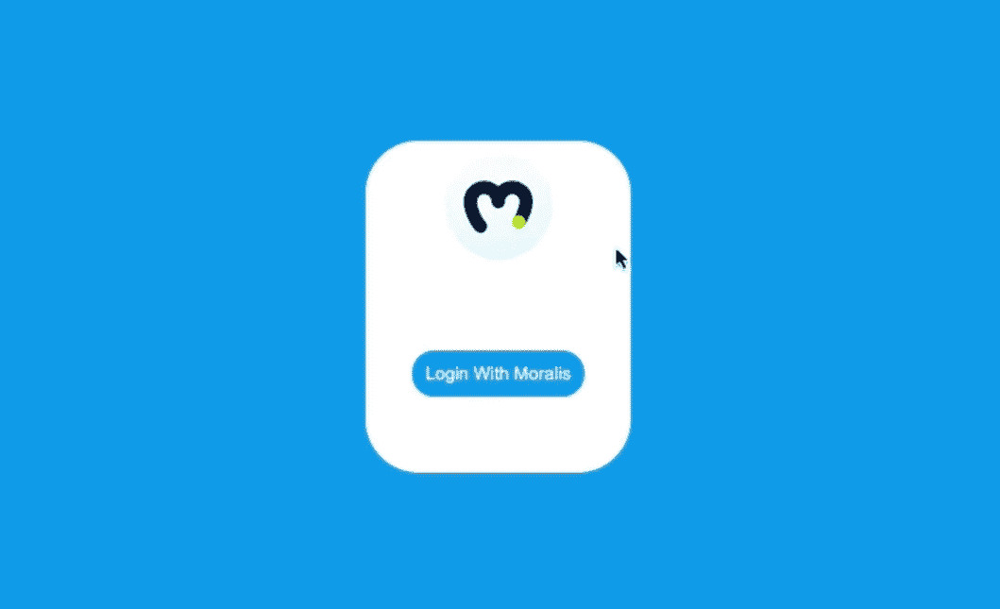
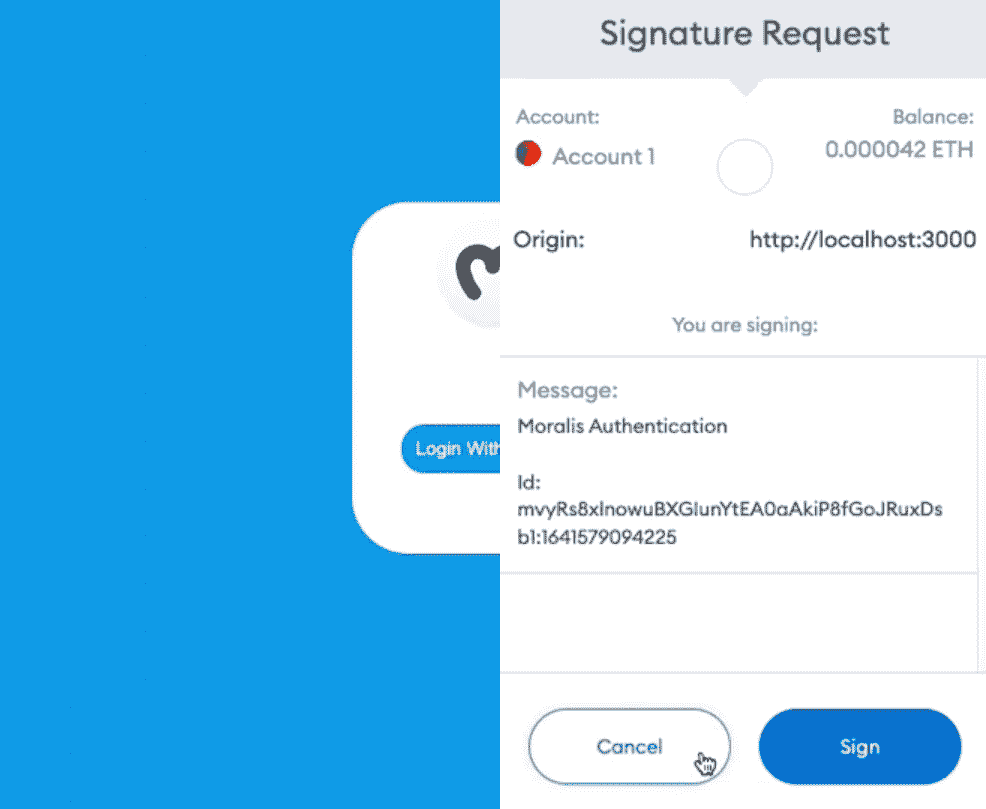
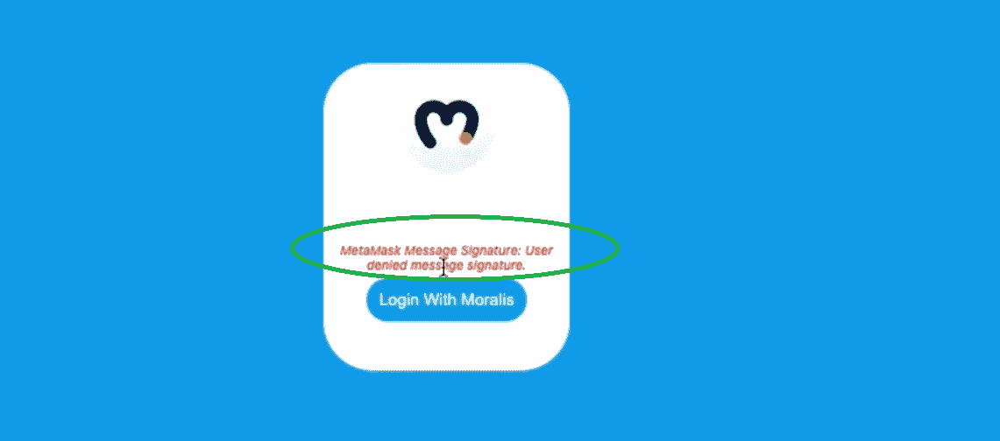
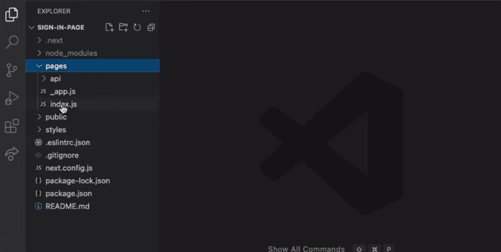
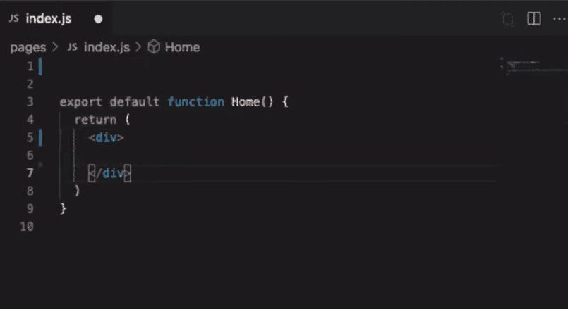
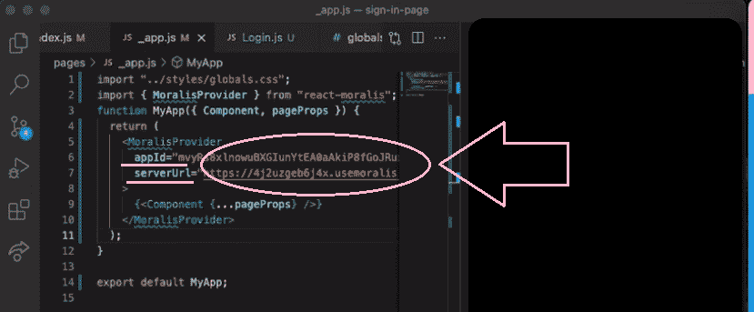
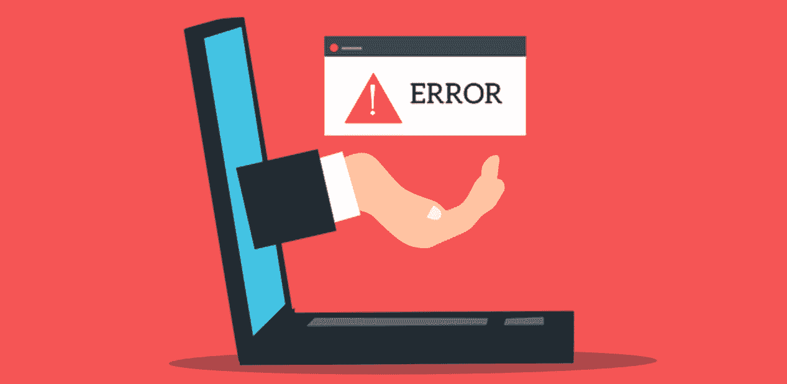

# 如何用 5 个步骤建立一个 Web3 登录

> 原文：<https://moralis.io/how-to-build-a-web3-login-in-5-steps/>

在下面的指南中，我们将概述如何通过 5 个简单的步骤构建 Web3 登录。如果你迫不及待地想开始，看看我们的视频指南吧！

https://www.youtube.com/watch?v=XmezdzLb154

**Web3 认证在构建** [**去中心化应用**](https://moralis.io/decentralized-applications-explained-what-are-dapps/) **(dApps)时至关重要。因此，区块链开发人员必须知道如何构建 Web3 登录。如果你已经直接在** [**以太坊 RPC 节点**](https://moralis.io/ethereum-rpc-nodes-what-they-are-and-why-you-shouldnt-use-them/) **上编程，你会知道创建一个 Web3 登录特性是相当棘手和耗时的。然而，2021 引入了区块链开发的新方法，打破了 RPC 节点** **的** [**限制。我们说的是领先的**](https://moralis.io/exploring-the-limitations-of-rpc-nodes-and-the-solution-to-them/)[**Web 3.0**](https://moralis.io/the-ultimate-guide-to-web3-what-is-web3/)**开发平台——**[**Moralis 家**](https://moralis.io/) **。这款**[**Firebase for crypto**](https://moralis.io/firebase-for-crypto-the-best-blockchain-firebase-alternative/)**[**JavaScript**](https://moralis.io/javascript-explained-what-is-javascript/)**——精通 Web3 SDK** **的开发者用。反过来，开发人员只需在他们的 dApps 中加入几行简短的代码，只需几个步骤就可以实现功能，并在创纪录的时间内启动他们的项目。在 Moralis 提供的众多解决方案中，我们将在本文中看看如何用 Moralis 的五个步骤构建一个 Web3 登录。****

**接下来，我们将首先介绍一些基础知识，帮助大家快速掌握。然后，我们将关注一个示例项目，向您展示如何快速构建 Web3 登录。我们将涵盖的任务将向您介绍 Next.js，以及它如何为您简化事情。当然，你也会看到创建一个干净简单的前端是多么容易。尽管如此，您也将有机会学习如何正确处理错误。我们将向您展示如何构建 Web3 登录，您也将学习如何使用 Moralis。通过完成 Moralis 的初始设置，您将知道如何在未来的项目中充分利用这个强大的工具。为了让您轻松跟随我们，请务必[创建您的免费 Moralis 账户](https://admin.moralis.io/register)。**

**

## 什么是 Web3 登录？

Web3 登录有时简称为 [Web3 认证](https://moralis.io/web3-authentication-the-full-guide/)更好。因此，它听起来可能比实际更复杂。如果操作得当，它应该只不过是一个按钮后跟着一个确认。当然，前端的简单并不意味着后端的东西不太先进。如你所知，大多数 Web2 网站使用电子邮件和密码组合来登录用户。然而，当我们考虑 Web3 领域时，用户的加密地址可以作为密钥。此外，确保区块链网络和用户安全的加密技术相当复杂。因此，使用长加密地址手动登录用户并处理密钥对对用户来说一点也不友好。

幸运的是，当使用正确的工具时，您不必担心这一点。您很快就会看到，介绍 Web3 身份验证就像复制和粘贴简短的代码片段一样简单。后者之所以成为可能，要感谢 Moralis 和声誉卓著的 [Web3 钱包](https://moralis.io/what-is-a-web3-wallet-web3-wallets-explained/)(“连接器”)。许多加密钱包现在以浏览器扩展和移动应用的形式出现，并提供可靠的 UXs。此外，虽然它们的主要功能可能是帮助用户处理和存储加密货币，但它们也可以用作 Web3 登录工具。因此，对于每个对探索加密领域感兴趣的人来说，它们是必不可少的工具。

有了 Web3 钱包，存储、发送和接收可替换和[不可替换的令牌](https://moralis.io/non-fungible-tokens-explained-what-are-nfts/) (NFTs)成为可能。他们给用户一条进入 DeFi 平台、 [NFT 市场](https://moralis.io/how-to-launch-an-nft-marketplace/)、区块链或 [NFT 游戏](https://moralis.io/what-are-nft-games-and-how-to-make-nft-games/)以及其他加密渠道的途径。因此，Web3 钱包也是区块链开发者的必备工具。同样，Moralis 通过完全集成 [MetaMask](https://moralis.io/metamask-explained-what-is-metamask/) 和 [WalletConnect](https://moralis.io/what-is-walletconnect-the-ultimate-walletconnect-guide/) 来支持你，这应该涵盖你所有的 Web3 工作。

### 为什么需要 Web3 登录？

现在，您已经知道 Web3 网站和应用程序为用户提供了一种与区块链互动的方式。因此，它们必须为用户提供连接到特定加密网络的安全方式。这正是一个合适的 Web3 登录解决方案所做的。认证成功后，用户可以与其他通过认证的用户和该网络的功能进行交互。因此，所有 dApps 都需要这种登录。

现在你知道了什么是 Web3 登录以及为什么你需要它，是时候开始一个示例项目了。为了让事情变得有趣，你将有机会关注前端。然而，你也将了解到，在 Moralis 的帮助下，涵盖所有与区块链相关的后端方面是多么容易。

## 如何用 Moralis 的 5 个步骤建立一个 Web3 登录

在接下来的几节中，我们将向您展示如何使用 Visual Studio 代码(VSC)、Next.js、Moralis 的 SDK 和 MetaMask 构建 Web3 登录。这种构建 Web3 登录的方法非常好，因为它让您可以完全定制 UI。然而，如果你有兴趣在几分钟内完成 Web3 登录实现过程，你应该使用最好的[以太坊 dApp 样板](https://moralis.io/ethereum-dapp-boilerplate-full-ethereum-react-boilerplate-tutorial/)。接下来，我们将通过将以下五个步骤分成更易于管理的部分来涵盖它们:

1.  **Next.js 项目设置。**
2.  **建造前端。**
3.  **Moralis 的初始设置。**
4.  **整合 Moralis 观。**
5.  **错误处理。**

除了我们的解释和截图之外，您还有机会观看一段 Moralis 专家完成上述步骤的视频。然而，在继续之前，让我们对您将要构建的界面做一个简单的预览。

### Web3 登录示例预览

因为这个示例项目旨在向您展示您的选择，所以我们关注简单性。因此，这是您将创建的 Web3 登录:

点击“使用 Moralis 登录”按钮，将提示 MetaMask，要求确认:

我们的 Web3 登录示例也能够处理所有错误。例如，如果用户点击“取消”按钮而不是“签名”，他们将得到以下消息:

此外，如果用户点击“签名”按钮，他们将进入这个简单的页面:

正如你所看到的，我们的重点是在登录页面。因此，如果您想为您的 dApps 构建一个漂亮的开发级登录页面，您可以使用本教程。接下来，您还将学习如何使用 CSS“flexbox ”,它使页面元素的定位变得极其简单。

## 步骤 1:如何构建 web 3 log in–next . js 项目设置

首先打开您的终端，转到您想要用于这个 Web3 登录示例项目的文件夹。您还需要确保运行最新版本的节点。因为我们在这个项目中使用 Next.js，所以首先在命令行中键入或粘贴“ **npx [【电子邮件保护】](/cdn-cgi/l/email-protection)** ”。接下来，会询问您项目的名称。你可以效仿我们，把它命名为“签到页”。此外，创建新项目需要几秒钟时间:

安装完成后，在命令行中输入“ **cd 登录页面**”，然后输入“ **npm 运行开发**”。现在，您应该已经准备好构建 Web3 登录页面了:

接下来，启动您的代码编辑器(我们更喜欢 VSC)并打开上面创建的项目。您将看到已经创建了几个默认文件夹和文件:

此外，正如您在前面截图的右侧所看到的，有许多与 Next.js 相关的模板内容是我们不需要的。所以打开“index.js”文件，选择从“头”到“尾”的所有内容，删除。另外，删除所有的“导入”行和“”中的“类名”。结果，你会得到这样的结果:

*注* *:如果你想了解更多关于 Next.js 与* [*React*](https://moralis.io/react-explained-what-is-react/) *的细节，请务必查看下面 0:52 开始的视频。*

## 步骤 2:如何构建 Web3 登录——构建前端

如果你精通 JavaScript，你将不会有任何问题。然而，由于用截图清楚地呈现所有步骤是相当棘手的，我们将把您交给 Moralis 专家。在本文开头的视频中(5:12)，他将首先向您展示如何调整“styles”文件夹中的“global.css”文件。接下来，他将创建一个新的登录组件，并为其添加一个新的 CSS 文件。这也是您了解“flexbox”更多细节的地方。最后，您将在不到二十分钟的时间内准备好前端部分(如预览中所示)。

*注* *:您可以在* [*GitHub*](https://github.com/MoralisWeb3/youtube-tutorials/tree/main/react-metamask-login) *访问整个代码。*

## 步骤 3:如何建立 Web3 登录——Moralis 初始设置

无论您决定从头开始创建 dApps(如在这个示例项目中)还是使用我们的终极 [Web3 样板](https://moralis.io/web3-boilerplate-beginners-guide-to-web3/)，您首先需要完成一些简单的 Moralis 设置步骤。因此，请遵循以下子步骤:

1.  [**创建你的免费 Moralis 账户**](https://admin.moralis.io/register)——如果你还没有创建你的免费 Moralis 账户，现在就创建吧。您可以使用此步骤开始时的链接。因此，您将进入注册页面。在那里，您需要输入您的电子邮件并创建您的密码。要完成该流程，您需要点击确认链接(查看您的电子邮件收件箱)。*另一方面，如果您已经拥有一个有效的 Moralis 家账户，只需使用您的凭证* [*登录*](https://admin.moralis.io/login) *。*

2.  [**创建一个 Moralis 服务器**](https://docs.moralis.io/moralis-server/getting-started/create-a-moralis-server)–在您的 Moralis 管理区内，进入“服务器”选项卡。在那里，点击右上角的“+创建新服务器”按钮(见下面的截图)。接下来，您需要从下拉菜单中选择最适合您需求的网络类型(见下图)。*当处理示例项目或者测试你的 dApps 时，你想要关注“Testnet 服务器”或者“本地 Devchain 服务器”选项。在我们的情况下，我们将选择后者。但是，一旦你想向公众发布你的 dApps，你需要选择“Mainnet 服务器”。*

选择网络类型后，您会看到一个弹出窗口，要求您输入服务器的详细信息。首先输入您的服务器名称(可以是您想要的任何名称)。然后，选择您所在的地区、网络类型和链。最后，单击“添加实例”启动您的服务器:

3.  **安装 Moralis SDK**–在继续之前，您还需要安装 Moralis SDK。为此，在终端的命令行中输入“ **npm install moralis** ”，然后输入“ **npm install react-moralis** ”。然后，输入“ **npm 运行开发**”。

## 步骤 4:如何构建 Web3 登录——整合 Moralis

既然您的服务器已经启动并运行，是时候将 Moralis 集成到您的代码中了。然而，在这样做之前，打开 VSC 里面的“_app.js”并应用必要的调整(上面 24:02 的视频)。

4.  **访问服务器详细信息**–您可以通过点击服务器名称旁边的“查看详细信息”来访问服务器 URL 和应用 ID 信息:

接下来，您会看到所有您需要的信息(“服务器 URL”和“应用程序 ID”)都显示在一个新窗口中。然后，使用右侧的复制图标复制所需的详细信息:

5.  初始化 Moralis 规范–现在是初始化 Moralis 规范的时候了。这将最终让你完全接触到 Moralis 的力量，从而满足你的后端需求。在我们的示例项目中，您需要填充上面准备好的“_app.js”文件来连接和初始化 Moralis:

*   当使用我们的 Web3 样板时，您需要填充您的”。env "文件:

6.  **添加 Web3 登录功能**–通过集成 Moralis，您可以轻松地在示例 dApp(登录页面)中包含后端功能。您可以通过向“Login.js”文件添加几行简单的代码来实现这一点。通过使用 Moralis 的魔法，所有 Web3 登录的辛苦工作都披上了“ **onClick=(authenticate)** ”。*如需详细指导，请使用上面 26:08 开始的视频。*

## 步骤 5:如何构建 Web3 登录–错误处理

完成以上四个步骤后，您已经拥有了一个外观漂亮、功能强大的 Web3 登录页面。因此，深入研究错误处理是不必要的。然而，为了更平稳地运行 dApp，这是你应该考虑的事情。此外，它将让用户知道他们是否犯了错误，并确保更好的用户体验。因此，我们建议查看 28:00 开始的视频。

## 如何通过 5 个步骤建立 Web3 登录–总结

按照我们的指导并完成概述的步骤，您应该已经创建了自己的 Web3 登录页面。有了这个特性，创建的页面按照定义就是一个非常简单的 dApp。当然，现在由您来添加一些额外的功能。此外，通过承担这个示例项目，您已经学习了如何启动 Next.js 项目，如何设置 Moralis，以及如何使用 Moralis 来满足您的后端需求。此外，您现在知道以下五个步骤是“如何构建 Web3 登录”探索的要点:

1.  **Next.js 项目设置。**
2.  **建造前端。**
3.  **Moralis 的初始设置。**
4.  **整合 Moralis 观。**
5.  **错误处理。**

此外，您还了解了在几分钟内部署用户就绪的 dApps 的终极捷径。后者是通过使用最实用的 Web3 样板来完成的，可以从 GitHub 获得。此外，要获得更多免费的区块链发展教育，请访问[Moralis 博客](https://moralis.io/blog/)和[Moralis YouTube 频道](https://www.youtube.com/c/MoralisWeb3)。我们最近的一些话题围绕着[以太坊煤气费](https://moralis.io/ethereum-gas-fees-the-ultimate-2022-guide/)、 [GameFi 和 play-to-earn (P2E)](https://moralis.io/what-is-gamefi-and-play-to-earn-p2e/) 、如何[通过网站](https://moralis.io/how-to-interact-with-smart-contracts-through-your-website/)与智能合约互动、如何[用 Moralis](https://moralis.io/walletconnect-android-sdk-alternative-authenticate-android-apps-withmoralis/) 认证 Android 应用、一个 [DAO 智能合约示例](https://moralis.io/dao-smart-contract-example-dao-guide/)、 [ERC20 合约](https://moralis.io/what-are-erc20-contracts-full-erc20-contract-guide/)等等。此外，你还有机会通过报名参加[Moralis 学院](https://academy.moralis.io/)采取更专业的方法。有了顶级质量的课程、支持和欢迎的社区以及专业水平的指导，你应该在创纪录的时间内成为全职加密员。

**