# 如何建立一个 Web3 地图游戏

> 原文：<https://moralis.io/how-to-build-a-web3-map-game/>

你了解 Unity 吗？如果是这样，你已经准备好成为一名 Web3 开发者，并着手 Web3 游戏开发。你知道吗，这是你创建一个 Web3 地图游戏所需要的。当然，完成这样一个项目需要几个运动部件和设置。然而，当您使用正确的工具时，事情会比预期的简单得多。这就是最终的 Web3 开发平台 [**Moralis 家**](https://moralis.io/) **的不同之处。从 [Web3 认证](https://moralis.io/authentication/)开始，其 Unity SDK 允许您毫不费力地整合 Web3 功能。此外，由于 Moralis 的终极 Web3 APIs，您可以用单个代码完成大部分繁重的工作。Unity 让你创建一个吸引人的前端，而 Moralis 负责与区块链相关的后端。这包括处理链上和链下数据，与智能合约通信，等等。**

接下来，我们将仔细看看我们的 Web3 地图游戏。我们将从这个示例游戏的一个快速演示开始，这样你就可以决定你是否想弄脏你的手。然后，我们将向您展示如何在 Moralis 和统一中完成所有必要的设置。此外，我们的 Web3 地图游戏使用 NFTs ( [不可替换令牌](https://moralis.io/non-fungible-tokens-explained-what-are-nfts/))来表示游戏中的属性。因此，我们还将向您展示如何部署一个智能契约来创建游戏内 NFTs。在这里，您将了解关于 Hardhat 的更多信息，以及它如何简化 Web3 合同的部署。此外，我们将仔细查看主脚本，为您提供关于我们的 Web3 地图游戏如何工作的额外见解。当然，你可以使用我们的代码，它在 GitHub 上等着你。所以，[创建你的免费 Moralis 账户](https://admin.moralis.io/register)吧！

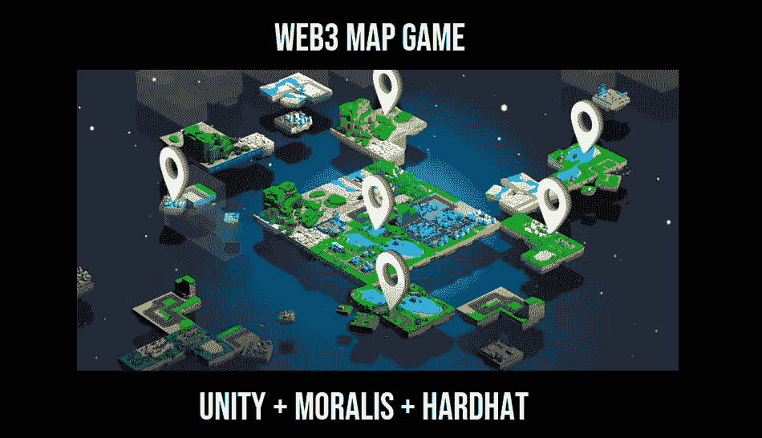

## 我们的 Web3 地图游戏演示

并非我们游戏的所有部分都发生在链上；然而，我们仍然决定只有经过认证的用户才能玩。因此，我们的 Web3 地图游戏从以下屏幕开始:

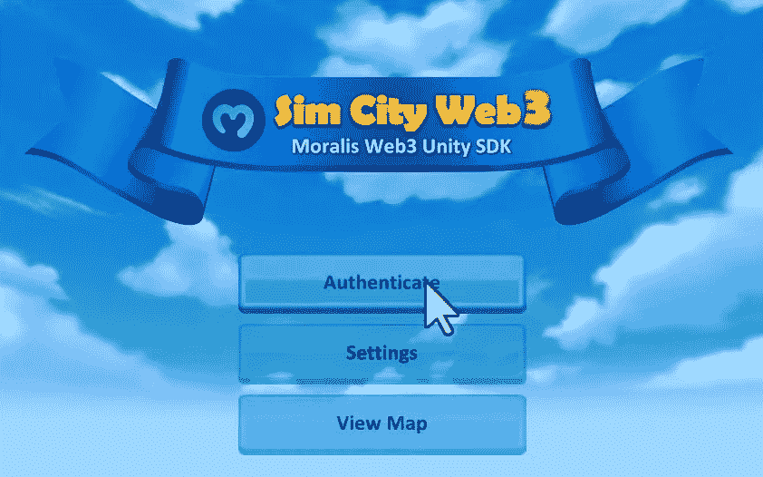

想要继续的用户需要点击“认证”按钮。接下来，他们需要点击“连接”按钮:

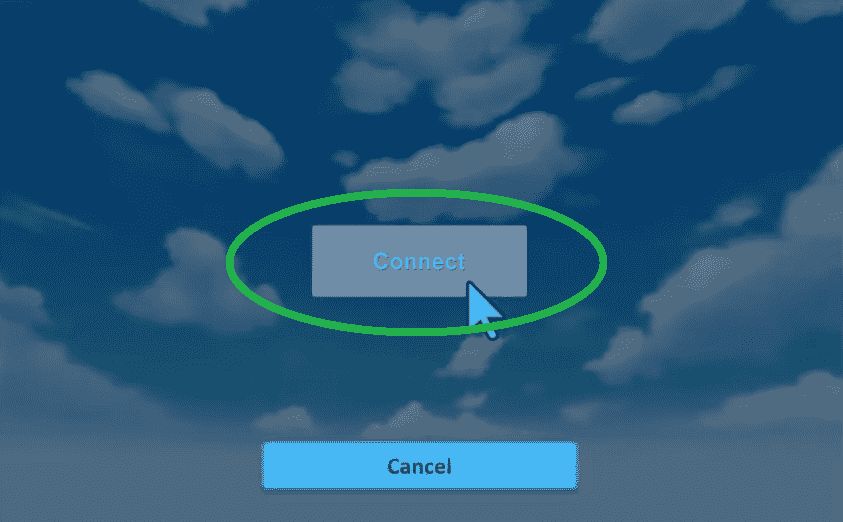

然后，游戏显示登录二维码:

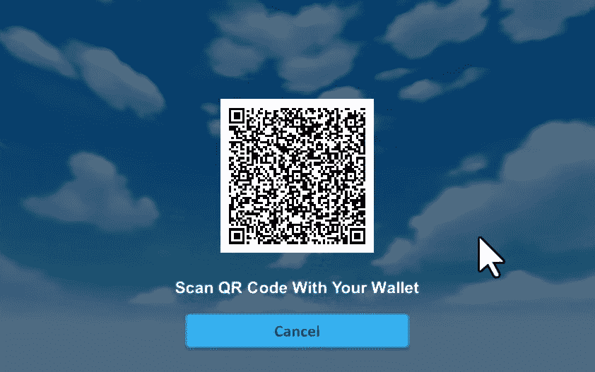

在这种情况下，用户需要使用兼容 WalletConnect 的 Web3 移动钱包来扫描代码。此外，他们还需要在手机钱包中确认他们的 Web3 登录:

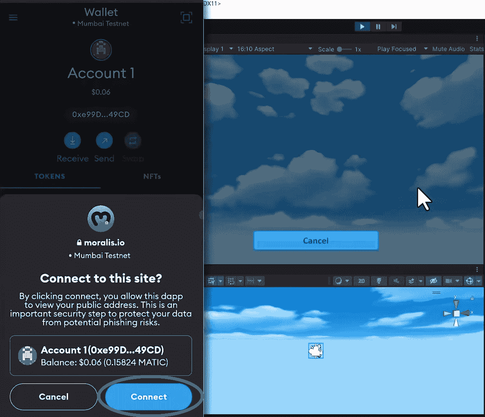

用户登录后，会看到主菜单:

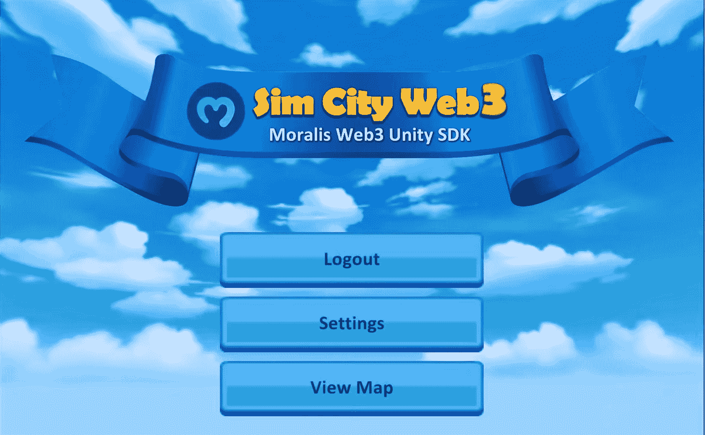

“查看地图”按钮将带他们进入游戏的核心。默认情况下，我们的地图目标是曼哈顿:

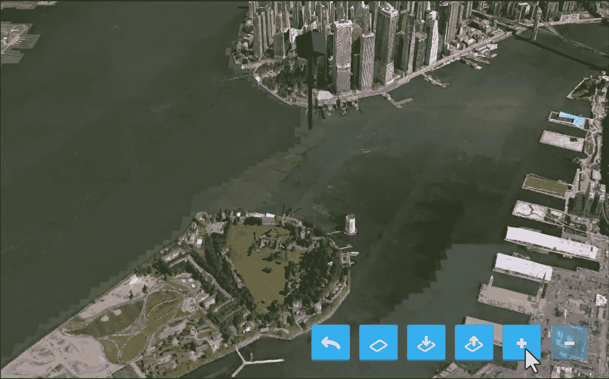

绿色大头针表示地图的中心点。然而，用户可以简单地通过点击和拖动鼠标来移动地图，并通过鼠标滚动来放大或缩小。此外，在屏幕的右下方，有各种命令按钮。如果玩家想要添加属性，他们需要单击加号按钮:

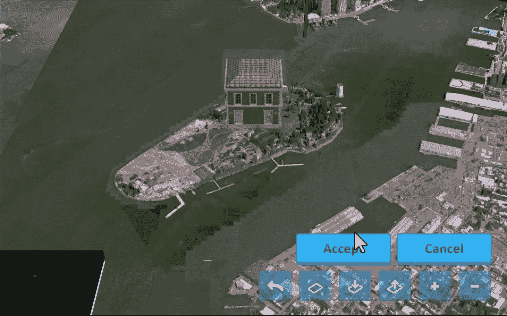

在他们点击加号按钮后，一个建筑出现在屏幕上(见上图)。然后，用户可以平移地图，将建筑物悬停在他们想要放置财产的土地上方。他们通过点击“接受”按钮来完成。当然，他们也可以取消他们的行动。另一方面，玩家也可以删除属性。在这种情况下，他们需要选择一个现有建筑，然后单击减号按钮:

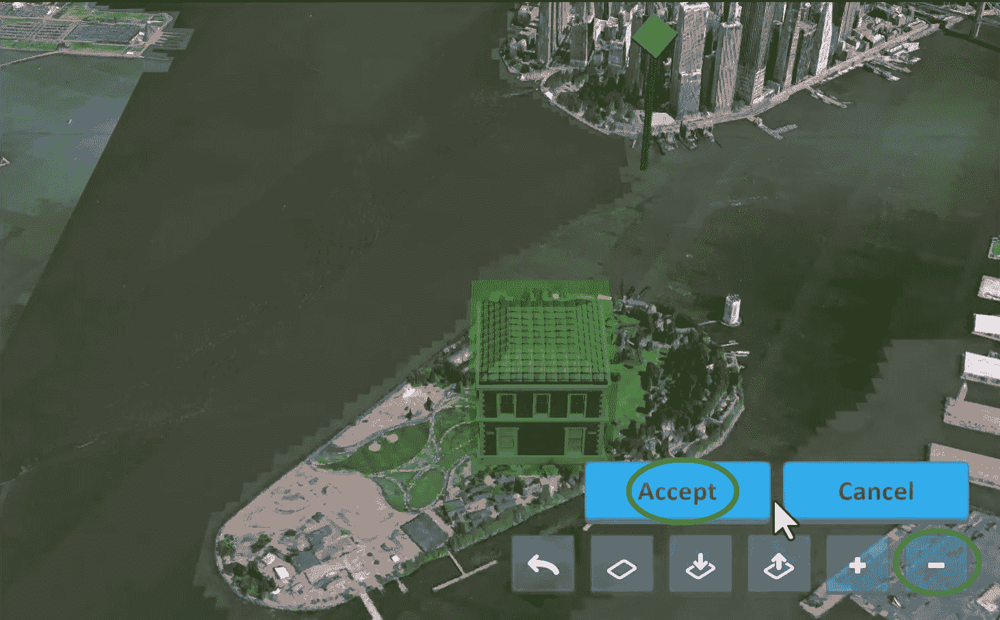

这就是我们 Web3 地图游戏的主旨。要获得更详细的演示，请查看文章底部的视频。

# 如何用 Unity，Moralis 和 Hardhat 构建一个 Web3 地图游戏

如果你觉得上面的演示很有趣，我们邀请你卷起袖子跟随我们。正如简介中提到的，除了克隆我们的项目，您还需要完成一些初始设置。因此，我们将首先向您展示如何完成初始的 Moralis 设置。此外，现在是确保您准备好以下工具的最佳时机:

*   一致
*   节点 JS
*   元掩码(移动和网络)
*   Visual Studio 代码(VSC)或您首选的代码编辑器

此外，对于这个示例项目，我们将关注多边形的 testnet (Mumbai)。后者是一个受欢迎的 EVM 兼容测试链，交易费用非常低。此外，您可以利用多边形水龙头，以获得一些测试。因此，我们还将向您展示如何轻松地将孟买网络添加到元掩码中，以及如何使用多边形水龙头。接下来，我们将向您展示如何使用 Hardhat 来创建、编译、部署和验证一个相当简单的 ERC721 智能合约。随着初始设置的完成和智能合同的部署，我们将最终专注于 Unity。在这里，您将了解在哪里输入您的 Moralis dapp 证书。此外，我们还将进行更详细的代码演练，以提供额外的上下文。

## 初始 Moralis 设置

1.  如果您还没有这样做，现在创建您的免费 Moralis 帐户。另一方面，使用您的凭据登录:

2.  在您的 Moralis 管理区，使用“创建新的 Dapp”按钮:

3.  在“选择环境”弹出窗口的第一步，选择“Testnet”选项:

4.  接下来，选择“Polygon Mumbai”网络，并点击“继续”按钮确认您的选择:

5.  然后，选择离您最近的城市，再次点击“继续”按钮继续前进:

6.  最后，你需要给你的 dapp 命名。既然这可以是任何东西，你就可以随心所欲地发挥创造力。不过，你也可以跟随我们的领导，使用“test-dapp”。有了名称后，点击“创建您的 dapp”启动您的 Moralis Dapp:

7.  一旦您的 dapp 启动并运行，您可以通过“设置”按钮访问其所有详细信息和功能:

8.  在这里您可以找到在克隆我们的代码后需要粘贴到 Unity 中的凭证:

### 将孟买添加到您的元蒙版并获得 Play MATIC

此时，您应该已经安装了 MetaMask 浏览器扩展，并准备好了 Web3 钱包。因此，你可以很容易地添加孟买网络。使用与上面相同的“设置”按钮，您有机会访问“网络”选项卡:

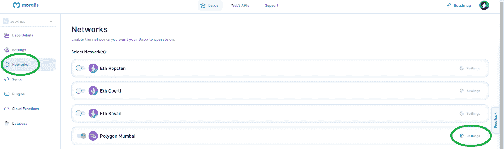

如上面截图所示，点击“多边形孟买”旁边的“设置”按钮，这将打开该网络的详细信息。这就是您将看到的“节点”部分:

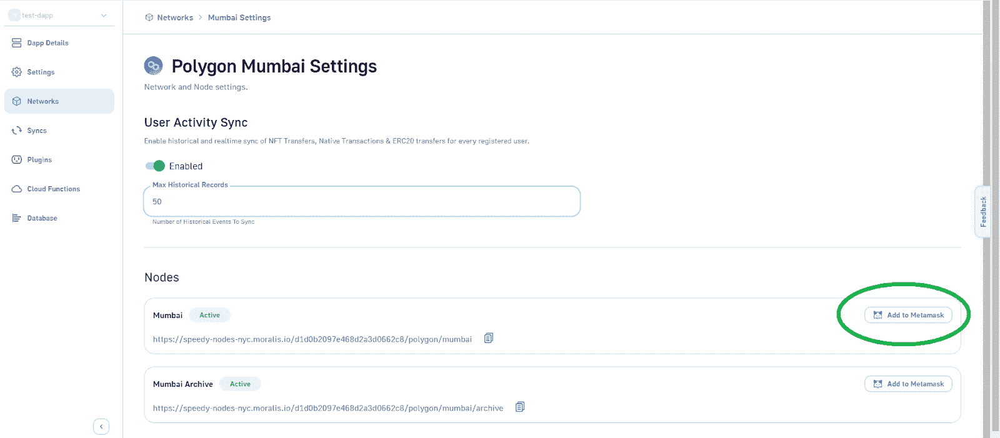

你所要做的就是点击“添加到元掩码”按钮，并在元掩码中确认这个操作。

随着孟买网络添加到您的元掩码中，您已经准备好获得一些 play MATIC。因此，请访问 Polygon 水龙头网站:

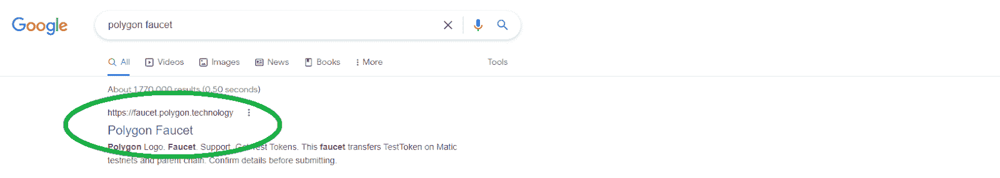

在那里，你需要选择“孟买”网络和“自动令牌”，粘贴你的钱包地址(从你的元掩码中复制)，然后点击“提交”:

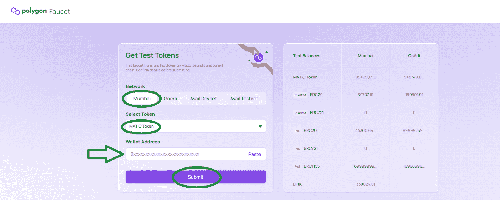

## 我们的 Web3 地图游戏智能合同

在继续之前，请访问 GitHub 并克隆或下载[我们的示例项目](https://github.com/MoralisWeb3/web3-unity-sdk-sample-game-scw):

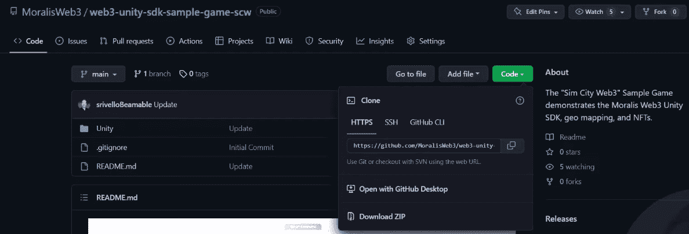

当谈到使用 Hardhat 管理智能合同时，我们创建了一个特殊的文件，其中包含一步一步的说明。您可以在“SmartContracts”文件夹中找到“Instructions.txt”文件。该文件包含以下步骤:

1.  安装节点 JS
2.  在 GIT 之外创建一个空文件夹。在文本编辑器中打开(例如:VSC)
3.  使用命令行安装 Hardhat。这些是你需要输入的命令:
    *npm i -D 安全帽*
    *npx 安全帽*
4.  使用命令行安装 Hardhat。这些是你需要输入的命令:
    *NPM I-D @ open zeppelin/contracts*
    *NPM I-D @ nomiclabs/hard hat-waffle*
    *NPM I-D @ nomiclabs/hard hat-etherscan*
5.  重命名”。/contracts/Greeter.sol" to "。/contracts/{YourContractName}。sol" *(当然没有" { } ")*
6.  变”。/scripts/sample_script.js" to "。/scripts/deploy { YourContractName }。js" *(同样没有" { } "*
7.  里面”。/scripts/deploy { YourContractName }。sol "，将“greeter”重命名为{YourContractName}，“Greeter”重命名为{yourContractName} *(考虑现有字母大小写)*
8.  在”。/scripts/deploy { YourContractName }。sol”，确保“deploy()”函数具有正确的协定构造函数参数
9.  里面”。/scripts/deploy { YourContractName }。sol "添加代码 blow *(用实际名称替换{ your contract name)*:

*await { YourContractName } . deploy transaction . wait(5)；*

*//我们验证合同*

*等待 hre.run("verify:verify "，{*

地址:{您的合同名称}。地址，

*        constructorArguments: [],*

*})；*

10.  在”。/hardhat.config.js "，在顶部添加这行代码:

*要求(" @ nomic labs/hard hat-ethers can ")；*

11.  里面”。/hardhat.config.js”，在“module.exports”部分之前添加这些字段:

*const PRIVATE _ KEY = " "；*

*const MUMBAI _ NETWORK _ URL = " "；*

*const POLYGONSCAN _ API _ KEY = " "；*

12.  在”。/hardhat.config.js "，修改" module.exports ":

*module.exports = {*

*坚固度:【0.8.7】，*

*网络:{*

*孟买:{*

*网址:孟买网络网址，*

*账户:[私钥]*

*}*

*}，*

*以太扫描:{*

*API KEY:POLYGONSCAN _ API _ KEY*

*}*

*}；*

13.  使用以下命令编译您的智能合约:
    1.  *npx 安全帽清洗*
    2.  *npx 安全帽编译*
14.  使用以下命令部署您的智能合约:
    1.  *npx hard hat run scripts/deploy property . js–网络* *孟买*

*注* *:你也可以用下面的视频(16:11)。*

### ERC721 智能合同

因为你可以简单地复制我们的智能合约，所以没有必要知道构建你的 Web3 地图游戏的可靠性。不过，如果您有兴趣了解更多关于我们的 ERC721 智能合约的细节，请观看下面的视频，时间从 21:32 开始。在这里，您将了解该合同如何让您使用链上或链下存储。

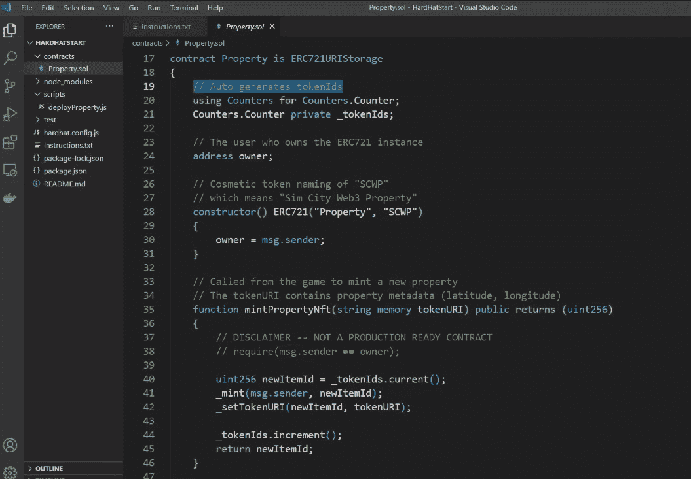

此外，在部署您的合同后，您将在终端中获得您的智能合同的地址和 ABI:

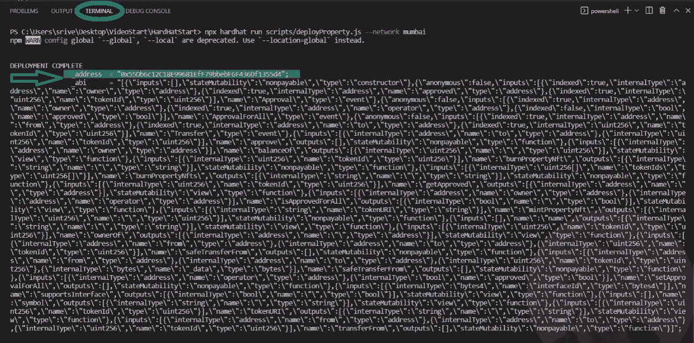

但是，您也可以在 Polygonscan (27:53)上查看您的所有合同详情:

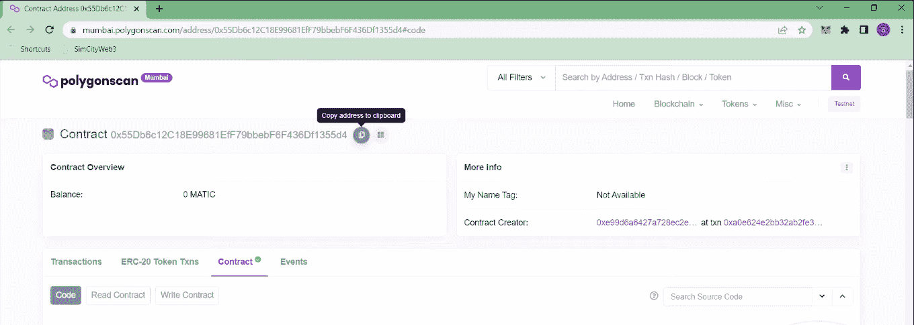

## 一款 Web3 地图游戏和 Unity

首先在 Unity 中打开我们的示例项目。然后，你可以使用“读我”来查看你需要知道的一切(28:38):

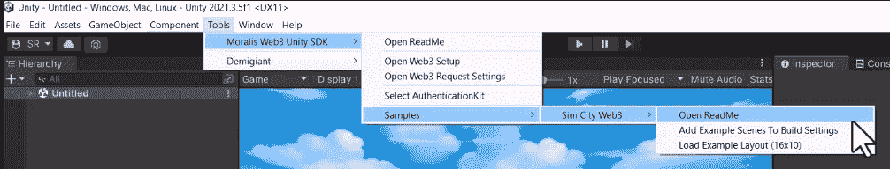

在这一点上，我们的 Web3 地图游戏的 Web3 功能还不是由你支配。为了包含它，你需要把它和 Moralis 家的 SDK 连接起来。因此，现在是时候将您的 Moralis dapp 证书(来自“初始 Moralis 设置”部分的步骤 8)复制到“Moralis Web3 设置”窗口中了:

如果上述窗口没有自动打开，您可以通过“窗口> Web3 Unity SDK >打开 Web3 设置”来访问它:

接下来重点关注“SimCityWeb3Configuration.asset”。此外，您将看到，默认情况下，我们的项目设置为使用外链数据:

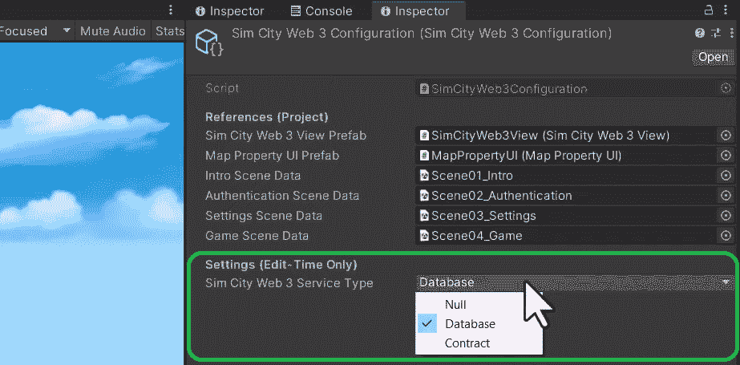

### “Web3ContractService”脚本

然而，要使这个示例游戏成为一个合适的 Web3 地图游戏，您需要将上面的选项切换到“契约”。*为了更深入地了解“SimCityWeb3ServiceFactory”脚本，请使用下面的视频，从 34:30 开始。*然而，我们想把重点放在“SimCityWeb3ContractService”类上。如果您想自己编写代码，您可以跟随我们的内部专家观看下面的视频(35:05)。这样，您将从该项目中获得最大收益，并学习如何手动实现上面部署的智能合约提供的所有功能。这也是你第一次看到 Moralis 的力量，以及像“GetNFTOwners”这样的钩子如何使世界变得不同。

另一方面，你可以使用我们完成的代码，只需提供你的合同地址和 ABI。这就是“PropertyContract”类出现的地方。因此，这是您需要更新的唯一一段代码:

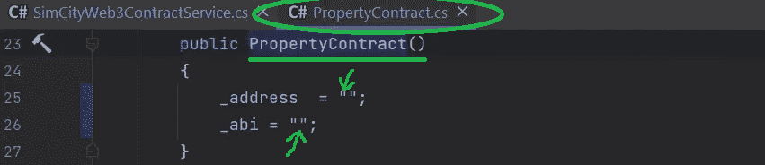

因此，只需粘贴这两个值(从终端或多边形扫描中复制)并保存它:

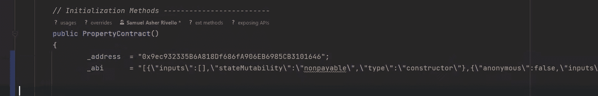

通过粘贴您的智能合约的详细信息，您的版本的 Web3 地图游戏将完全可用。因此，您可以自己运行它并四处游玩。您将看到，添加和删除属性现在是连锁交易，您需要通过 Web3 wallet 进行确认:

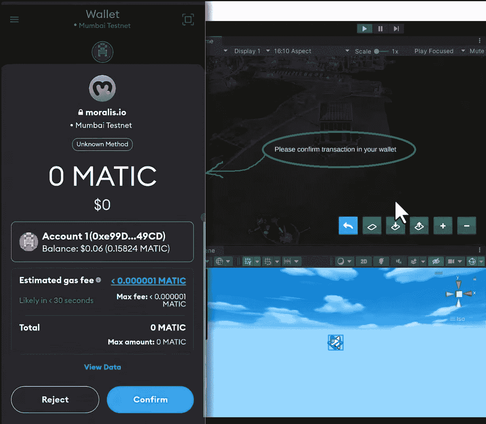

*注意* *:我们设计项目的方式要求使用移动 Web3 钱包进行在线交易确认。我们也可以把它设计成一个 WebGL 项目，在这种情况下，玩家可以用他们的 web 浏览器元掩码扩展来确认交易。*

最后，这是我们在整篇文章中引用的视频教程:

https://www.youtube.com/watch?v=3jCJ7jCTqXk

## 如何构建一个 Web3 地图游戏——摘要

至此，你已经知道多亏了 Moralis，创建一个 Web3 地图游戏一点也不复杂。如果你决定复制我们的代码，那就更是如此。然而，即使您是从零开始，使用 Moralis 的 Unity SDK，您也可以节省大量宝贵的开发时间。并且，通过完成上面的示例项目，您学习了如何完成初始的 Moralis 设置以及如何获得您的 dapp 证书。此外，您还学习了如何将 Mumbai 链添加到 MetaMask 中，以及如何获得一些 play MATIC。因此，你现在可以开始着手自己的项目了。

另一方面，你可能需要一些额外的练习来更加熟悉 U [nity Web3 编程](https://moralis.io/unity-web3-beginners-guide-to-unity-web3-programming/)。在这种情况下，我们鼓励你使用[Moralis 利斯的 YouTube 频道](https://www.youtube.com/c/MoralisWeb3)和[Moralis 利斯的博客](https://moralis.io/blog/)。这两个网点托管了许多其他 Unity Web3 示例项目。此外，还有许多关注其他加密主题的示例项目和主题。例如，我们最新的文章向您展示了如何进行 NFT 链上分析，处理链上数据，或者学习如何在几分钟内开始生成 NFT。

此外，如果你有兴趣尽快成为全职加密员，Moralis 学院可能是你的好去处。在那里，你可以报名参加各种专业的区块链发展课程。因此，你可以从专家那里了解具体的加密利基和最有声誉的区块链。此外，这也是获得个性化学习路径、指导和神奇社区成员资格的地方。