# 如何使用 Unity 多人游戏构建 Web3 多人游戏

> 原文：<https://moralis.io/how-to-build-a-web3-multiplayer-game-using-unity-multiplayer/>

你想使用 Unity 多人游戏来建立一个 Web3 多人游戏吗？在这个游戏中，你可以进入一个游戏场来移动和交易货币和 NFT。如果是这样，您需要完成以下步骤:

1.  **访问我们的** [**GitHub**](https://github.com/MoralisWeb3/web3-unity-sdk-sample-game-wump) **页面**
2.  **下载 GitHub 的回购(*。zip 或*。git)**
3.  **使用 Unity 的编辑器打开回购**
4.  **按照“README.md”文件**设置 Unity
5.  **使用 Unity & PlayFab** **”教程**完成 [**设置后端**](https://docs.moralis.io/docs/using-unity-playfab)

[**GitHub Repo to Build a Web3 Multiplayer Game**](https://github.com/MoralisWeb3/web3-unity-sdk-sample-game-wump)

如果您已经掌握了一些扎实的开发技能，您可以访问 repo 立即开始。然而，如果你是一个更有抱负的区块链开发者，你可能需要一些帮助。因此，跟随本教程，我们看看如何建立一个 Web3 多人游戏！

### 概观

说到游戏类型，我们都有不同的偏好。然而，我们大多数人认为多人游戏是最有趣的。有了 Web3，事情变得更加激动人心！尽管 Web3 仍处于起步阶段，但它已经颠覆了游戏行业。因此，现在可能是学习如何构建 Web3 多人游戏的最佳时机。此外，由于 Unity Multiplayer 等工具，现在开发这类游戏比以往任何时候都容易。就集成 Web3 功能而言， [Moralis](https://moralis.io/) 是首选。这个终极的 Web3 API 提供者使您能够获取链上数据，实现 [Web3 认证](https://moralis.io/authentication/)，甚至与智能合约交互。

接下来，我们将进一步了解什么是 Unity 多人游戏。然后，我们还将快速回顾 Moralis 的特点。毕竟，这些是我们在制作如何构建 Web3 多人游戏的教程时使用的工具。当然，我们还会仔细看看我们的示例多人 Web3 游戏。基本上，我们会对我们的游戏做一个适当的演示，以确保你可以把它作为一个概念来使用。事实上，您可以使用我们的存储库在几分钟内构建一个具有多人游戏功能的游戏。你需要做的就是克隆我们的代码，完成初始设置，并输入你的 Moralis 细节。

此外，我们还将看看我们的网络伙伴 dapp，它是对我们的示例多人游戏的一个很好的实用补充。因此，如果你想学习如何简单地构建一个 Web3 多人游戏，请确保[创建你的免费 Moralis 账户](https://admin.moralis.io/register)并跟随我们。

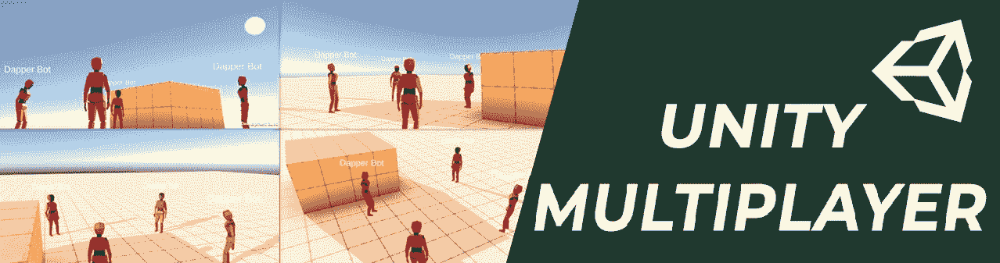

## 什么是 Unity 多人游戏？

Unity Multiplayer 指的是“Unity 多人联网”，是 Unity 用于多人游戏开发的工具集。2021 年，Unity 朝着多人联网迈出了重要的一步。那时他们正式发布了 GameObjects 的 Netcode，它有一个扩展功能，专注于中等速度、小规模的合作游戏。同时，Unity 增强了 Unity Transport 并增加了对 DTLS 加密的支持。此外，在那个时候，Unity 团队发布了一个新的网络档案功能和多人游戏服务——Unity Relay 和 Lobby。

然而，直到 2022 年 9 月 20 日，Unity devs 才不再需要依赖第三方工具来支持某些多人游戏类型。从那时起，开发人员已经可以访问 GameObjects (NGO) 1.0 的 Netcode。后者与 Unity 的新多人游戏解决方案密切相关，包括游戏服务器托管(多人游戏)和媒人解决方案。此次升级是 Unity 目标的一部分，旨在通过一系列开箱即用的解决方案为在线游戏的崛起做出贡献。不过，值得指出的是，Unity 仍然允许您将他们的解决方案与第三方工具混合搭配，为您的项目找到最佳的技术组合。

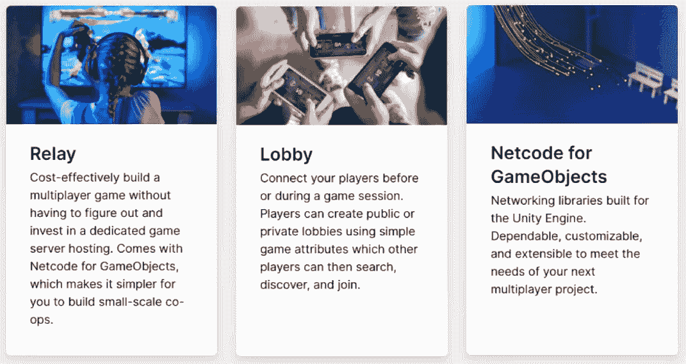

注意:如果你想了解更多关于 Unity 的 GameObject 和其他多人游戏工具的网络代码，请务必浏览 Unity 多人游戏网络文档。

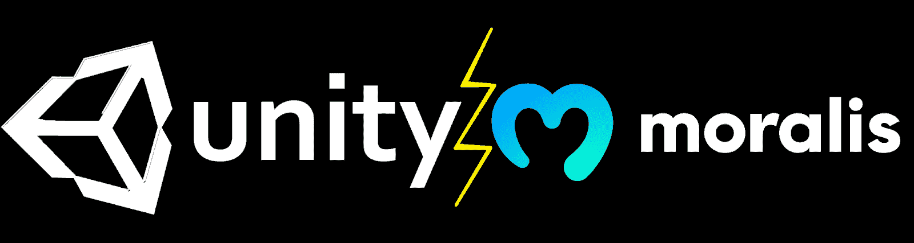

## 使用 Unity Multiplayer 和 Moralis 构建一个 Web3 多人游戏

在我们仔细研究如何构建一个 Web3 多人游戏并演示我们的示例游戏之前，让我们通过回答一些常见问题来奠定适当的基础:

*   **什么是多人游戏？**多人游戏与两个或更多玩家共享体验。因此，多人游戏的特点包括连接和同步。

*   什么是 Web3？ Web3 是互联网的最新发展(从 Web2 发展而来)，它整合了真正的所有权和货币化功能，这些功能由区块链技术实现。此外，Web3 引入了去中心化、不变性和透明性。一些核心的 Web3 功能包括 Web3 身份验证、发送资产、获取资产、与智能合约交互以及监视实时事件。

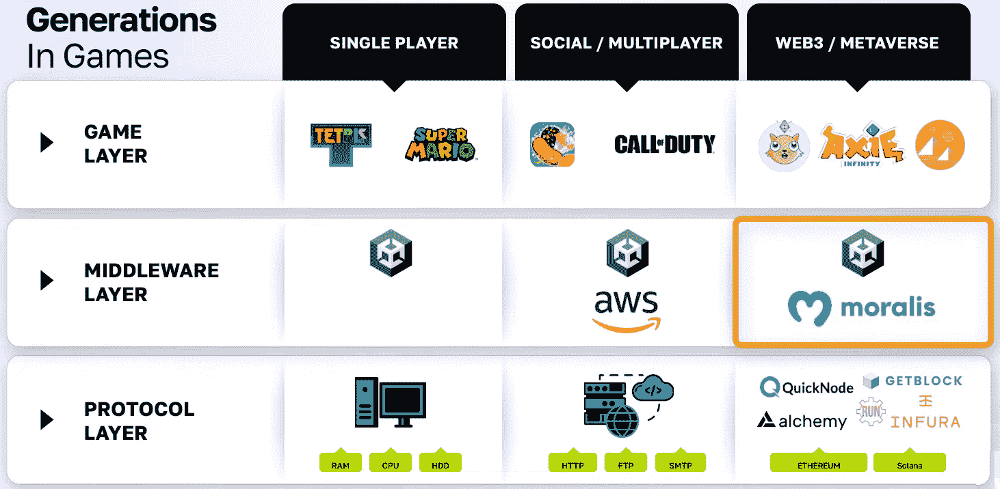

当涉及到多人游戏功能时，我们的示例游戏依赖于 Unity 的多人游戏功能。另一方面，我们将利用 Moralis 的力量添加 Web3 功能。毕竟，Moralis 解决了上面提到的核心 Web3 需求，并使 Web3 游戏和 dapps(分散应用程序)的创建更加简单。它通过简化 Web3 身份验证实现、与智能合约的通信等等来实现这一点。此外，Moralis 与其他领先的 Web3 工具和服务完全兼容。它还集成了流行的后端遗留系统和编程语言。

有了这些基础知识，你就可以仔细看看我们的示例多人 Unity 游戏“ *The Playground* ”。

## 构建一个 Web3 多人游戏

使用上面介绍的工具，你可以很容易地构建各种 Web3 多人游戏。在操场上，我们确保多人游戏功能将玩家匹配在一起，并同步他们的数据。因此，每个玩家都可以看到其他玩家的角色位置、帐户详情等。我们用 Unity 涵盖了这些方面。另一方面，我们使用 Moralis 将 ERC-20 和 ERC-721 代币整合到游戏中。

*注:* *每个代币背后都有智能合约，包括我们的游戏内实例资产。然而，这些契约的创建和部署超出了本教程的目的。然而，你可以从我们之前在 Moralis YouTube 频道和 Web3 博客上的 Unity 教程中了解更多。此外，我们不会在本文中详细讨论 Web3 认证。*

在操场上，我们的 ERC-20 代币代表金币，而 ERC-721 代币代表 NFT 奖。这也意味着玩家拥有自己的游戏内资产。此外，这些资产是不可变的，可以转移到其他账户。玩家可以在游戏内或游戏外使用他们的 Web3 钱包来完成这项工作。尽管如此，由于这些资产存放在区块链，有关转让和所有权的细节是完全透明的。

说到这里，是时候看看我们的示例 Unity 多人 Web3 游戏了。

### 游乐场–演示

像大多数 Web3 游戏和 dapps 一样，游乐场从 Web3 认证开始。通过点击“认证”按钮，用户可以用他们喜欢的手机钱包扫描二维码:

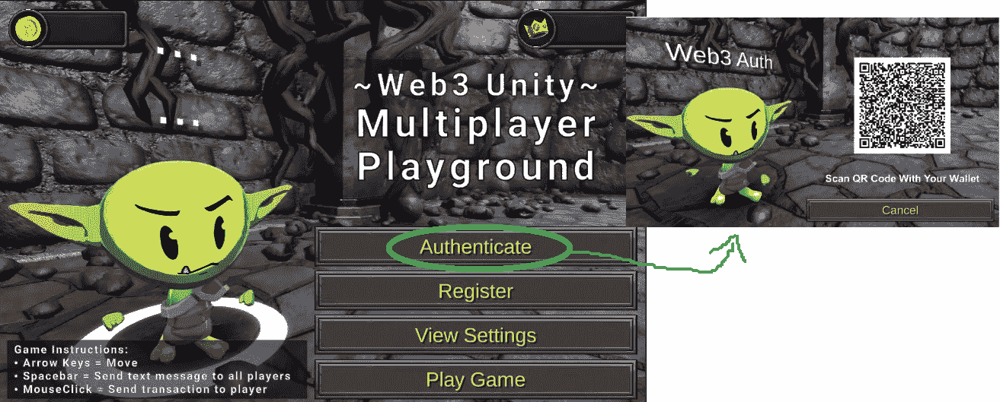

用户可以点击“玩游戏”按钮，以单人模式开始游戏。然而，在本文中，我们将重点关注多人游戏。此外，我们将在单个桌面上运行所有播放器实例。然而，这同样适用于通过局域网或互联网连接的不同电脑。这是一个玩家通过元掩码钱包验证后的实例:

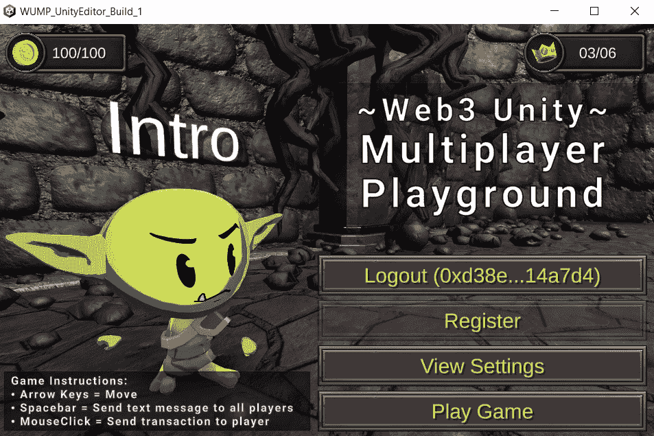

看上面的截图，你可以在左上角看到金币的数量，在右上角看到 NFT 奖励的数量。左下角还有游戏说明。尽管如此，您现在可以看到“Logout”按钮后面是示例用户的帐户地址，而之前是“Authenticate”按钮。要开始游戏，我们需要单击“玩游戏”按钮，这将显示我们的示例房间:

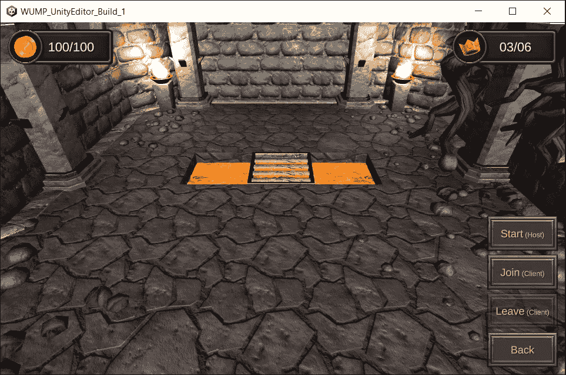

在我们的角色出现之前，我们需要点击“开始”或“加入”按钮。然而，由于这是第一个玩家，我们需要使用“主机”选项。让我们首先运行几个构建来正确模拟多人游戏选项:

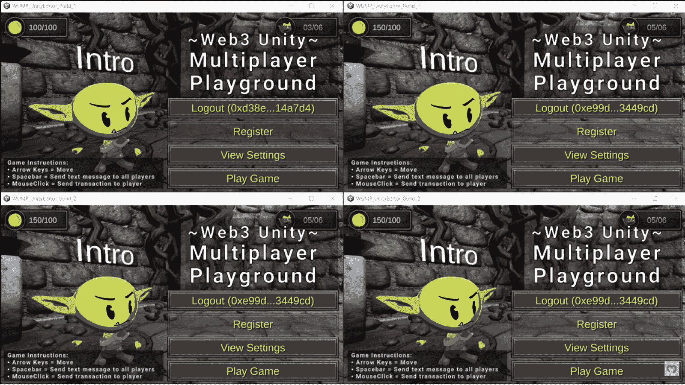

#### 本地四人演示

正如你在上面的图片中看到的，我们现在有四个不同的玩家，都通过了身份验证。可以加入的玩家数量没有限制。但是，我们不能同时显示四个以上。如果你仔细观察，你会发现除了左上角的玩家，我们对其他三个玩家使用了相同的地址。因此，任何代币交易都会反映在他们的屏幕上。事实上，每个玩家都有自己的钱包。

每个玩家还可以通过“查看设置”选项随机选择他们的昵称并重置他们的玩家数据(被视为新玩家):

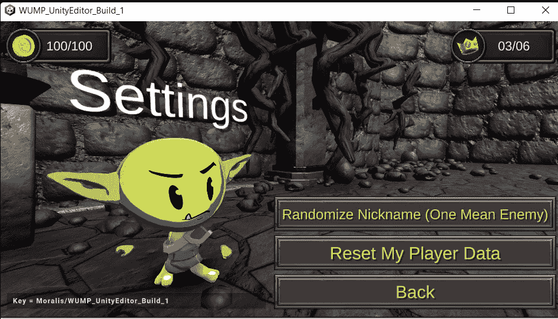

此外，我们在所有四个实例上都点击了“玩游戏”按钮。然后，我们使用右上角的构建(P1)播放器点击“开始(主机)”按钮，同时点击其他三个构建(P2、P3 和 P4)上的“加入”按钮:

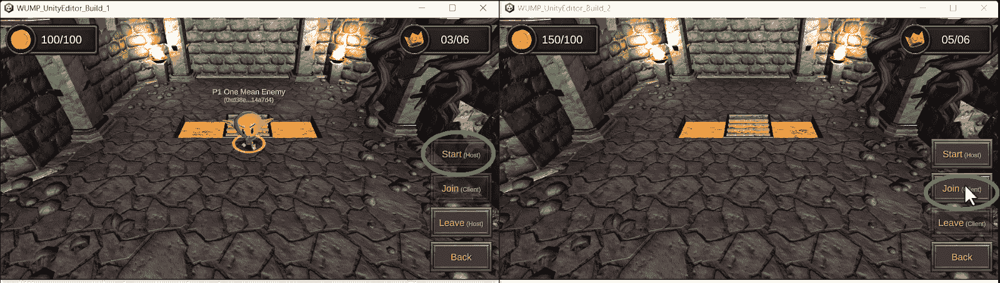

因此，每个玩家现在都能看到所有其他三个玩家，包括他们的昵称和钱包地址:

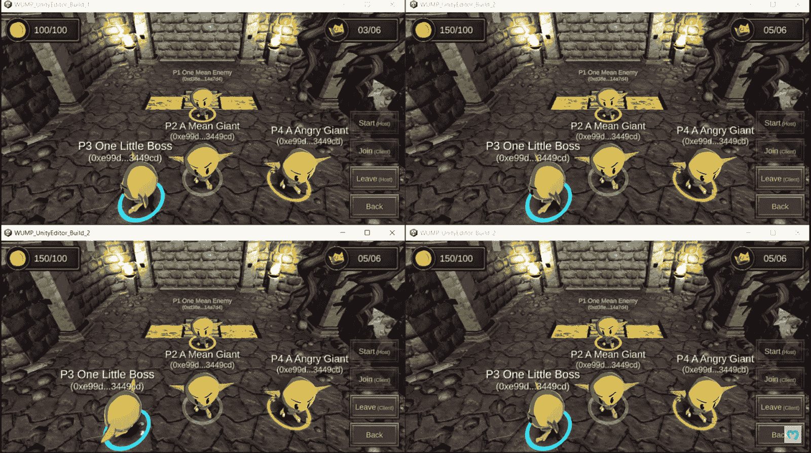

通过移动任何玩家，我们可以测试同步(见下面的视频，从 10:11 开始)。物理学也起作用——例如，角色不能进入熔岩坑，但是他们可以过桥。还有，玩家适当碰撞。此外，任何玩家都可以点击“空格”按钮打招呼:

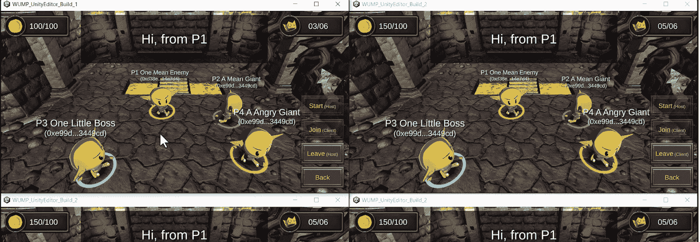

除了 Web3 身份验证，Unity Multiplayer 涵盖了上述所有功能。然而，玩家也可以点击其他玩家来转移他们的金币(ERC-20)或 NFT 奖励(ERC-721)。

#### 游乐场内的代币转让

因此，让我们使用左上角的玩家(P1)将代币转移给另一个玩家。*记住，他们都用同一个地址；因此，他们都将收到代币。点击另一名玩家后，发送者可以选择发送哪些代币。此外，该界面还显示潜在交易中涉及的地址:*

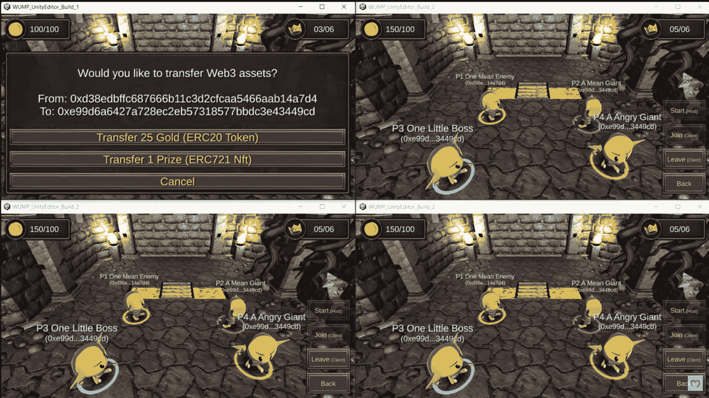

一旦玩家选择要发送的资产，玩家必须使用其钱包(连接的钱包)确认交易:

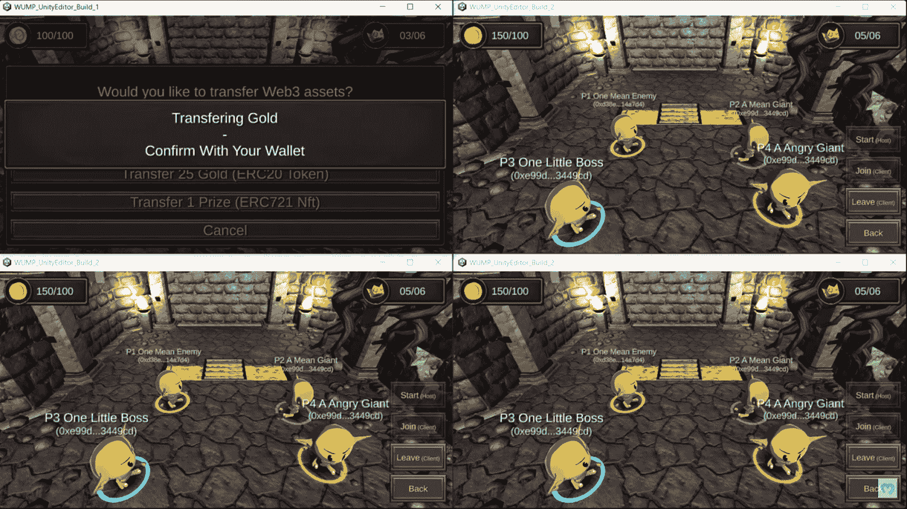

使用连接的钱包确认交易后，会出现“*正在等待交易*”消息:

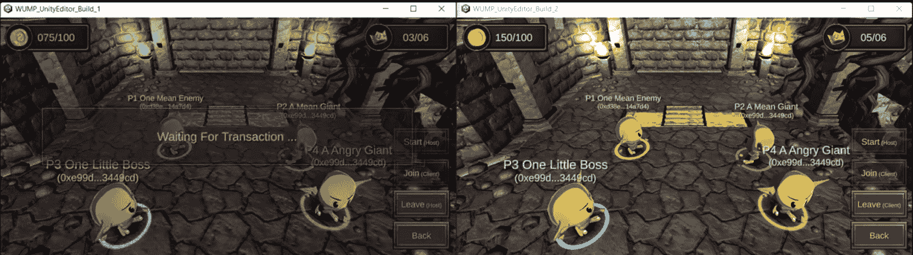

最后，在确认链上交易之后，接收者首先接收消息:

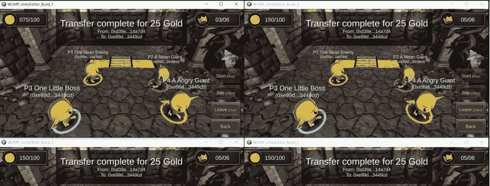

消息到达后不久，接收者也会收到代币，这些代币反映在玩家的余额中(从 150 到 175):

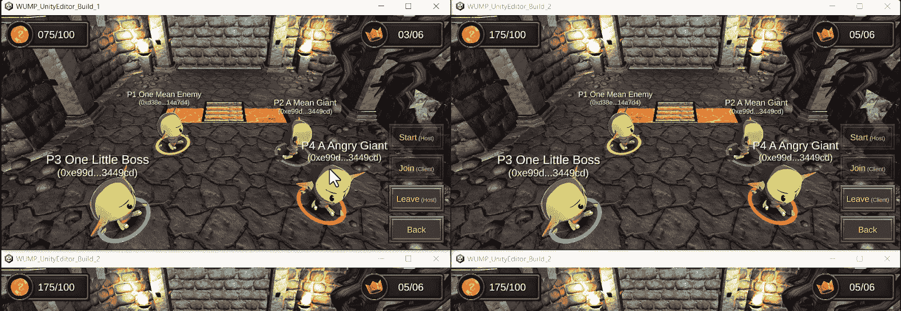

当然，这同样适用于转移奖品(ERC-721 NFTs)。

## 如何使用 Unity 构建一个 Web3 多人游戏

看了演示后，你可能很想亲自测试一下我们的示例游戏，对吗？幸运的是，您可以访问 GitHub 上的代码，并在几分钟内构建您自己的示例 Web3 多人游戏实例。尽管我们在本文开始时概述了这些步骤，但让我们再次快速概述一下您需要完成的步骤:

1.  访问上面的 GitHub 链接
2.  下载回购(*。zip 或*。git)
3.  使用 Unity 编辑器打开回购
4.  按照“README.md”文件设置 Unity
5.  通过完成“使用 Unity & PlayFab ”教程来设置后端，该教程在 Moralis 文档中等待您

关于第五步，一定要跳过“.NET”中的步骤。而且，在添加 Azure 的应用设置和 PlayFab 的功能时，使用“使用 Unity & PlayFab”教程和 Visual Studio 代码:

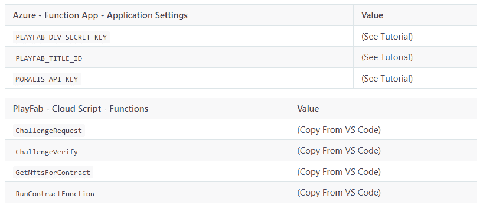

### 想自己打造一款 Web3 多人游戏？

通过遵循上一节中概述的说明，您有能力和信息来构建您的操场多人游戏实例。使用下面的视频(从 5:11 开始)并了解完成该过程的可用选项。但是，请务必记住，如果您想让这样的游戏为生产做好准备，您还必须部署您的智能合约。后者将负责代币铸造和交易。此外，在测试多人游戏特性时，你可能会想关注“局域网”选项:

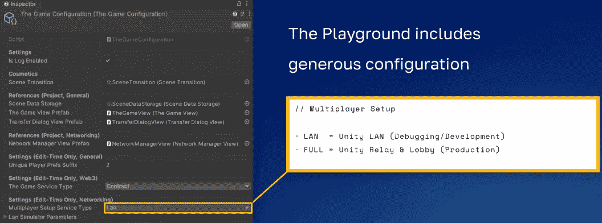

此外，在通过玩游乐场获得足够的信心后，你可能会想专注于创建自己的 Web3 多人游戏。这是你充分利用 Unity 的多人游戏功能和 Moralis 力量的时候。此外，拥有一个“网络伴侣”dapp 可以带来巨大的不同。毕竟，这样的 dapps 使您能够创建记分板，提供整洁的仪表板，为员工管理员提供访问权限，或者实现许多其他管理目的。要查看我们的操场网络伙伴 dapp 示例，请使用下面的视频，从 13:16 开始。

最后，这是我们在“构建一个 Web3 多人游戏”的过程中一直参考的视频教程:

[https://www.youtube.com/embed/9f_SG3Fib5E?feature=oembed](https://www.youtube.com/embed/9f_SG3Fib5E?feature=oembed)

## 如何使用 Unity 多人游戏构建 Web3 多人游戏–总结

由于 Unity 关于多人游戏功能的最新更新，你不再需要依赖第三方工具来覆盖游戏的这一方面。因此，统一成为一个更强大的工具。在本文中，你还了解到你可以将 Unity 更进一步，用它来构建一个 Web3 多人游戏。要实现这一点，你需要 Moralis——最终的 Web3 API 提供者。后者为您提供核心的 Web3 特性。你只需要从 Moralis 文档中复制粘贴简短的代码片段，并将它们添加到你的后端代码中。最后，您看到了我们的示例 Web3 多人游戏的运行。

至此，您知道了使用什么工具以及构建 Web3 多人游戏的步骤。如果你是 Web3 开发的新手，我们鼓励你从一些其他初学者友好的挑战开始。例如，你可以使用 Moralis 文档，用 Unity 和 PlayFab 创建你的第一个 dapp。接下来，使用现有的 Unity 教程，你可以在 [Moralis YouTube 频道](https://www.youtube.com/c/MoralisWeb3)和 [Moralis 博客](https://moralis.io/blog/)上找到。当然，这些渠道也是探索其他区块链发展主题的重要资源。我们的一些最新文章关注于[构建以太坊 dapps](https://moralis.io/building-ethereum-dapps-create-test-and-deploy/) ，用 MetaMask 创建[web 3 Firebase 登录，在以太坊上创建](https://moralis.io/create-a-web3-firebase-login-with-metamask/)[去中心化网站](https://moralis.io/how-to-create-a-decentralized-website-on-ethereum/)，构建 [Solana 智能合约](https://moralis.io/solana-smart-contract-building/)，等等。

除了上述免费资源，你也可以考虑成为区块链认证。实现这一目标的最佳地点是 Moralis 学院。如果你对 Web3 开发感兴趣，那么“ [Unity 区块链游戏开发 101](https://academy.moralis.io/courses/unity-blockchain-game-development-101) 课程应该是你的起点。