# 如何构建 Web3 Spotify 克隆版

> 原文：<https://moralis.io/how-to-build-a-web3-spotify-clone/>

音乐在我们所有人的心中有着特殊的地位；它可以改变我们对事物的看法，改变我们的心情，它可以传达至关重要的信息。是的，Spotify 等音频流媒体平台变得如此受欢迎并不奇怪。无论你喜欢什么类型的音乐，或者你想找什么样的歌曲，都有一个适合每个人的音频流媒体平台。此外，你可能知道，Spotify 是首选之一。然而，随着 [**Web3**](https://moralis.io/the-ultimate-guide-to-web3-what-is-web3/) **的崛起，我们相信音乐产业已经做好了改变的准备。因此，创造一个领先的“Web3 Spotify”替代品是摆在每个区块链开发者面前的巨大机遇。因此，我们想向您展示如何构建一个 Web3 Spotify 克隆版，进而将去中心化带到桌面上。当然，这也是提供歌曲为** [**NFTs**](https://moralis.io/non-fungible-tokens-explained-what-are-nfts/) **并接受加密支付的一种简单方式。**

接下来，我们将进行一个示例项目，我们将使用一些非凡的工具创建一个 Web3 Spotify 克隆。为了帮助我们开发前端并创建一个优秀的 [Web3 UI](https://moralis.io/web3-ui-how-to-create-a-great-dapp-ui/) ，我们将使用一个名为“蚂蚁设计”的设计系统(在下面的视频中有所涉及)。为了满足我们与区块链相关的后端需求，我们将让最终的 Web3 开发平台 [Moralis](https://moralis.io/) 来承担这一任务。这个“ [Firebase for crypto](https://moralis.io/firebase-for-crypto-the-best-blockchain-firebase-alternative/) 平台是[最好的 Web3 后端平台](https://moralis.io/exploring-the-best-web3-backend-platform/)，也是 [Web3 技术栈](https://moralis.io/exploring-the-web3-tech-stack-full-guide/)的首要平台。使用 [Moralis 的 SDK](https://moralis.io/exploring-moralis-sdk-the-ultimate-web3-sdk/) ，您可以通过复制和粘贴简短的代码片段来覆盖后端功能。因此，您可以节省 87%的开发时间。此外，Moralis 使您能够轻松地索引区块链。此外，Web3 开发平台的首选[与跨链互操作性有关。现在，](https://moralis.io/alchemy-api-alternatives-web3-development-platforms/)[创建您的免费 Moralis 帐户](https://admin.moralis.io/register),加入我们，打造一个 Web3 Spotify 克隆版！

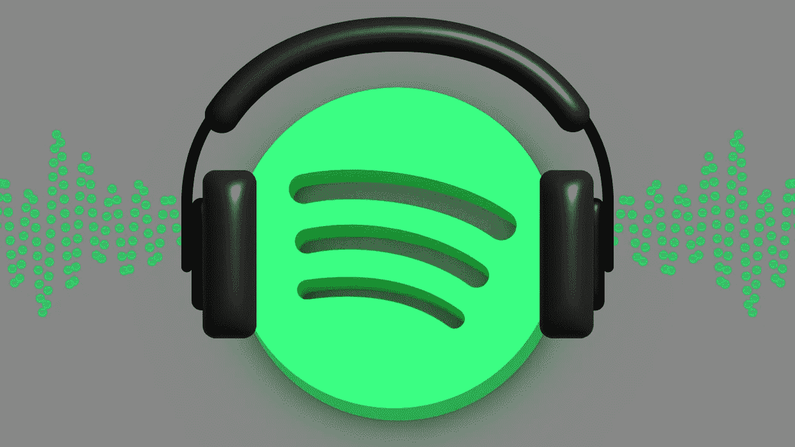

## 我们的 Web3 Spotify 克隆预览

在我们真正卷起袖子开始构建 Web3 Spotify 克隆版之前，让我们快速预览一下我们的 dApp。反过来，你可以看到我们的最终结果会是什么样子。此外，这将有助于你决定是否要遵循我们的指南，用 Web3 创建你自己的 Spotify 克隆。

这是我们的 Spotify 克隆版的主屏幕:

看上面的截图，你可以看到我们的 dApp 有一个侧面菜单栏。后者包括徽标、搜索栏、“主页”、“您的音乐”和“最近播放”标签。此外，它有一个标签，你可以去安装应用程序。此外，屏幕的大部分是显示不同专辑的地方。此外，它们可以通过三种方式显示。如你所见，还有精选专辑。用户还可以按流派和心情查看专辑。最后，用户可以查看新版本。

此外，我们 dApp 中所有这些音乐专辑的奇妙之处在于，它们实际上是 NFT 的收藏。通过点击上面的一张专辑，我们可以看到它包含的歌曲:

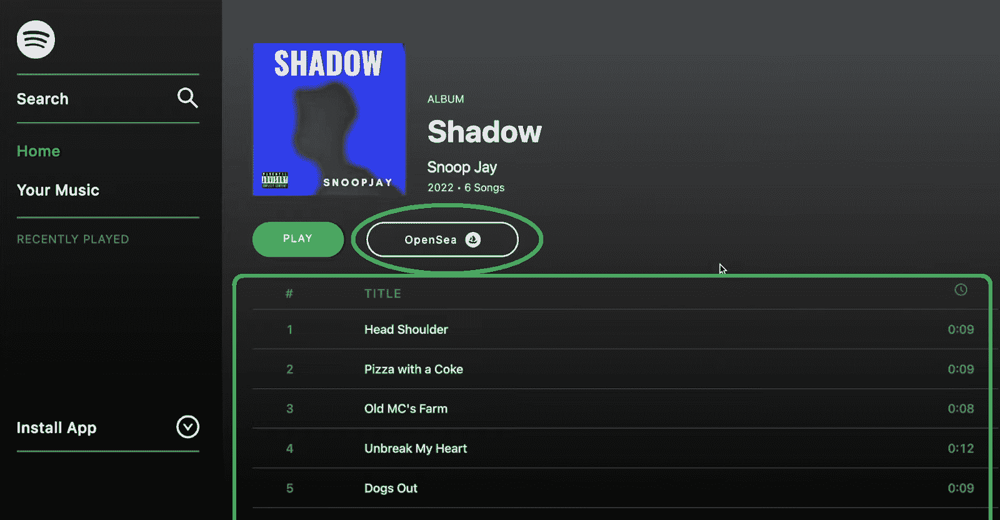

在上面的截图中，你可以看到“影子”专辑的细节。在专辑封面图片的下方，你还可以注意到右边的歌曲名称和长度。此外，专辑封面下方和歌曲列表上方还有两个按钮。播放按钮激活 dApp 的音乐播放器，而“打开海洋”按钮将我们转到 NFT 市场。在那里，我们可以查看甚至购买 NFT 格式的所有歌曲:

dApp 的音乐播放器使我们能够跳过该专辑中的歌曲，点击暂停或播放，并调节音量:

## 构建 Web3 Spotify 克隆–示例项目

既然你已经知道我们将要打造一个多么出色的 Web3 Spotify 克隆版，你可能已经迫不及待了。然而，在我们介绍示例项目的设置之前，让我们通知您，您可以在 GitHub 上访问完整的代码。因此，您可以选择克隆[完成的代码](https://github.com/IAmJaysWay/Decentralized-Spotify)，在几分钟内创建您自己的 Spotify 克隆。另一方面，你可以使用[启动代码](https://github.com/IAmJaysWay/Spotify-Starter)，并在我们前进的过程中构建它。如果您想从本教程中获得最大收益，我们推荐后者。

### 初始项目设置

您可能已经意识到，您需要一个代码编辑器。我们更喜欢与 Visual Studio 代码(VSC)；但是，请随意使用您最喜欢的编辑器。第一步是使用上面的“起始代码”链接并克隆代码:

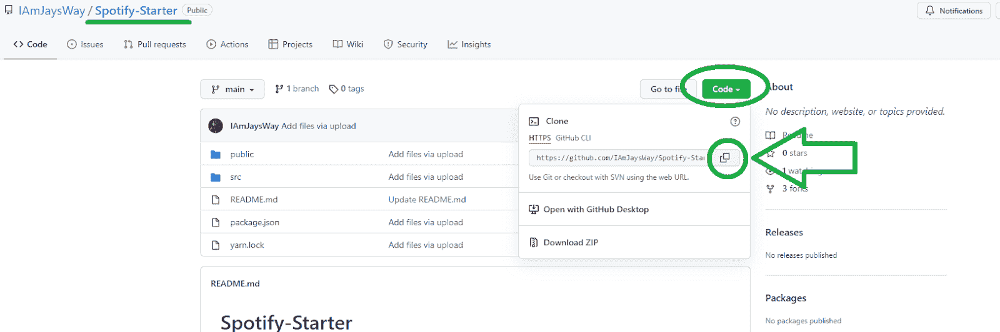

复制了上面的 GitHub URL 后，在您的终端上使用“git clone”命令克隆代码，后跟 URL:

接下来，在命令行中输入“cd Spotify-Starter”。然后，通过键入“Yarn”安装所有依赖项:

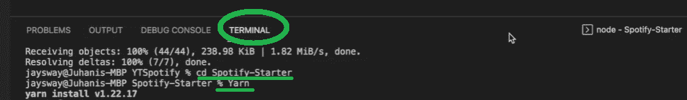

在继续之前，让我们看看模板的文件结构:

“src”文件夹是存放所有重要文件的地方。“App.js”文件已经利用 React 路由器路由到主页和相册页面。我们要指出的另一个文件是“index.js”:

这是我们使用[React](https://moralis.io/react-explained-what-is-react/)“browser router”的地方。此外，这也是我们将在其中粘贴我们的 Moralis 服务器的详细信息的文件，以访问 Moralis 的 SDK 的功能。

最后，我们可以通过在终端的命令行中输入“yarn start”来查看我们正在开始的内容:

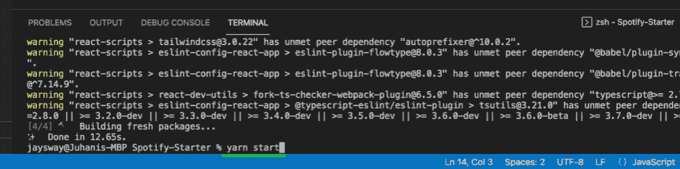

在“localhost:3000”中运行我们的应用程序，我们可以在空白画布上看到“相册页面”页面:

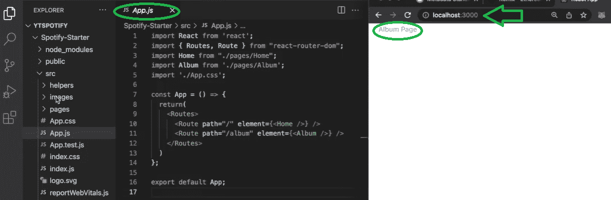

你甚至可以通过点击“相册页面”来测试它，这应该会把你从“主页”页面带到“相册页面”。当然，当我们在“相册页面”时，我们会看到“主页”链接:

#### 我们的下一步

完成初始设置后，是时候将注意力集中在 dApp 的 UI 上了。之后，我们将通过连接 Moralis 来过渡到添加 Web3 功能。有了它，我们将能够使用 [IPFS](https://moralis.io/what-is-ipfs-interplanetary-file-system/) 以分散的方式存储我们的音频文件。然后，我们还将向您展示如何使用 [Remix](https://moralis.io/remix-explained-what-is-remix/) 来部署[智能合约](https://moralis.io/smart-contracts-explained-what-are-smart-contracts/)，它将负责 [NFT 铸造](https://moralis.io/how-to-launch-an-nft-minting-page-full-walkthrough/)过程。最后，我们将好好利用 [Moralis 的 Web3 API](https://docs.moralis.io/moralis-server/web3-sdk/intro) 。

### 构建 Web3 Spotify 克隆版的用户界面

因为你们中的大多数人都精通 JavaScript，并且有相当多的前端编程经验，所以我们不会详细介绍构建我们的 Web3 Spotify 克隆版 UI 的细节。相反，我们鼓励您使用本文底部的视频。在那里，Moralis 专家将为您提供详细的指导。他将首先向您展示如何创建侧栏(03:11)。接下来，从 11:17 开始，您将有机会学习如何创建一个合适的主页。在 20:43，你将开始处理专辑页。然后，作为我们的 Web3 Spotify 克隆版 UI 的最后一部分，您将实现一个音频播放器(31:31)。

通过完成所有这些阶段，您将拥有一个看起来像“我们的 Web3 Spotify 克隆预览”部分中展示的应用程序。然而，要将这个应用程序转换为 dApp，您需要包含 Web3 功能。因此，是时候给 Moralis 让路了。

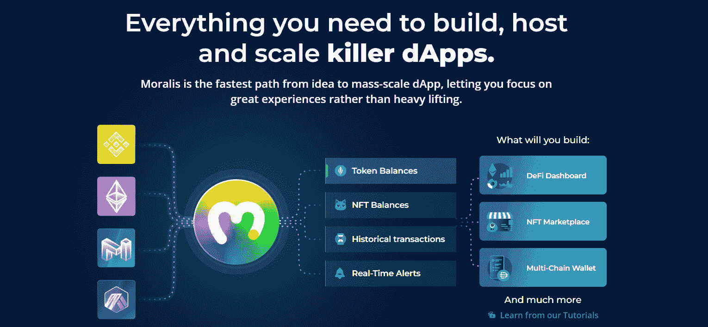

## Web3 Spotify 克隆和 Moralis

正如介绍中提到的，当您希望克服 RPC 节点的所有[限制时，Moralis 是游戏的名称。除了为](https://moralis.io/exploring-the-limitations-of-rpc-nodes-and-the-solution-to-them/) [Web3 认证](https://moralis.io/web3-authentication-the-full-guide/)提供最实用的解决方案，这个非凡的工具还提供了无数的快捷方式。此外，一旦您创建了您的 Moralis 服务器，您还可以访问您的 Moralis 仪表板。后者与 Moralis 的“同步”功能相结合，使您能够[同步和索引智能合约事件](https://moralis.io/sync-and-index-smart-contract-events-full-guide/)。另外，Moralis 包括多个集成，包括 [WalletConnect](https://moralis.io/what-is-walletconnect-the-ultimate-walletconnect-guide/) 、 [MetaMask](https://moralis.io/metamask-explained-what-is-metamask/) 和 IPFS。我们将使用后者[向 IPFS](https://moralis.io/full-guide-how-to-upload-to-ipfs/) 上传文件。此外，如果你更喜欢创作游戏， [Moralis 的元宇宙 SDK](https://moralis.io/metaverse/) 也能让你轻松处理 [Unity Web3](https://moralis.io/unity-web3-beginners-guide-to-unity-web3-programming/) 编程。

解决了这个问题，让我们把注意力放回到我们的示例项目上；是时候完成最初的 Moralis 设置了。

### 初始 Moralis 设置

1.  **创建您的免费 Moralis 账户**–使用本文开头的链接访问注册页面。在那里，你可以创建你的免费账户。只需输入您的电子邮件地址，创建您的密码，并通过点击确认链接(检查您的收件箱)来确认您的帐户。*不过，如果你已经有一个活跃的 Moralis 账号，只需* [*登录*](https://admin.moralis.io/login) *。*

2.  [**创建一个新的服务器**](https://docs.moralis.io/moralis-server/getting-started/create-a-moralis-server)——成功登录您的 Moralis 账户后，使用其“服务器”选项卡。在右上角，您会看到“+创建新服务器”按钮。点击它。接下来，将出现一个提供不同网络类型的下拉菜单(见下图)。选择适合您项目需求的一个。

*注* *:在实例项目或者自己项目的早期阶段，选择“Testnet Server”最有意义。*

一旦选择了服务器类型，您需要在新的弹出窗口中输入服务器的详细信息。提供服务器名称，选择您所在的地区、网络、链，并通过单击“添加实例”按钮启动您的服务器:

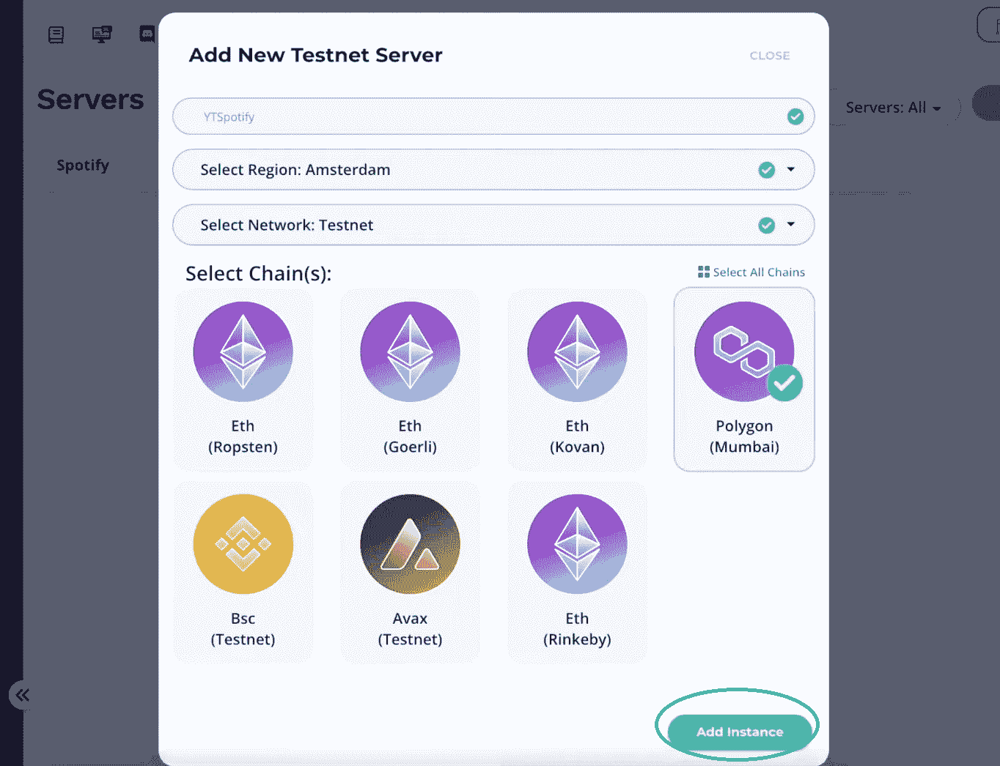

3.  **访问服务器详细信息**–您现在可以通过单击服务器名称旁边的“查看详细信息”按钮来访问服务器的详细信息:

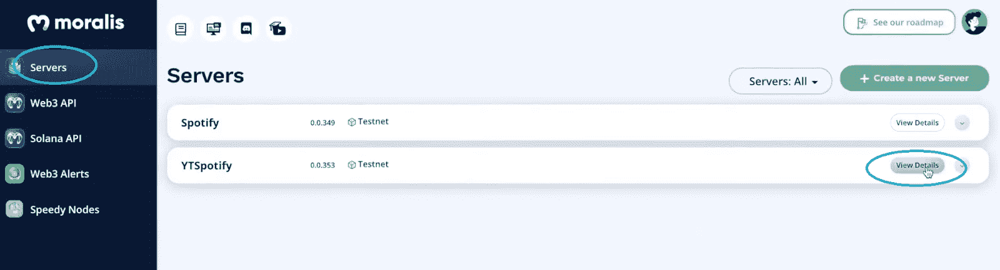

您服务器的详细信息将显示在新的弹出窗口中。通过使用“复制”图标，您可以复制您的服务器 URL 和应用程序 ID:

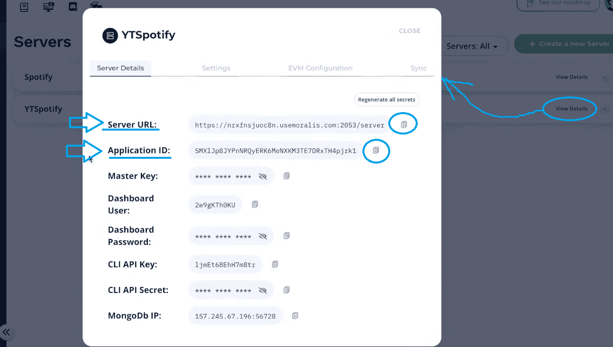

4.  **初始化 Moralis**–将上面复制的详细信息粘贴到“index.js”文件的替换占位符中:

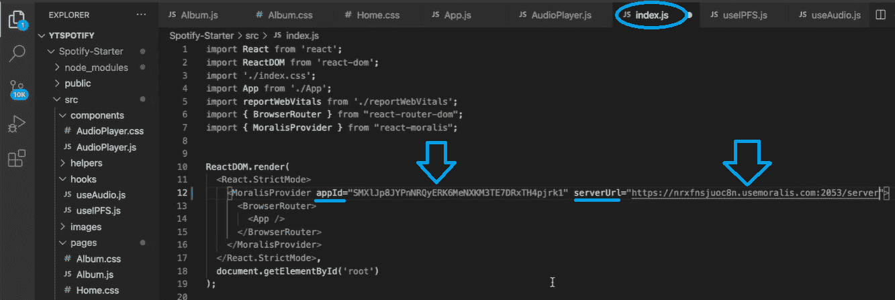

*注意* *:* ***不要*** *从上图中复制服务器详情。您需要使用服务器的详细信息。*

### 上传音频文件和专辑封面到 IPFS

您可以使用许多云文件存储解决方案。然而，它们中的大多数是集中的，不符合我们创造一个分散的未来的目标。幸运的是，Moralis 附带了 IPFS 集成，提供了一个分散的云存储解决方案。

为了覆盖这一部分，使用我们的资源创建一个新文件夹(" [Album](https://github.com/IAmJaysWay/Decentralized-Spotify/tree/main/Album) ")。该文件夹包含“ [metadata.js](https://github.com/IAmJaysWay/Decentralized-Spotify/blob/main/Album/metadata.js) ”和“ [music.js](https://github.com/IAmJaysWay/Decentralized-Spotify/blob/main/Album/music.js) ”文件，以及“ [export](https://github.com/IAmJaysWay/Decentralized-Spotify/tree/main/Album/export) ”文件夹，其中包含示例音频文件和专辑封面图像:

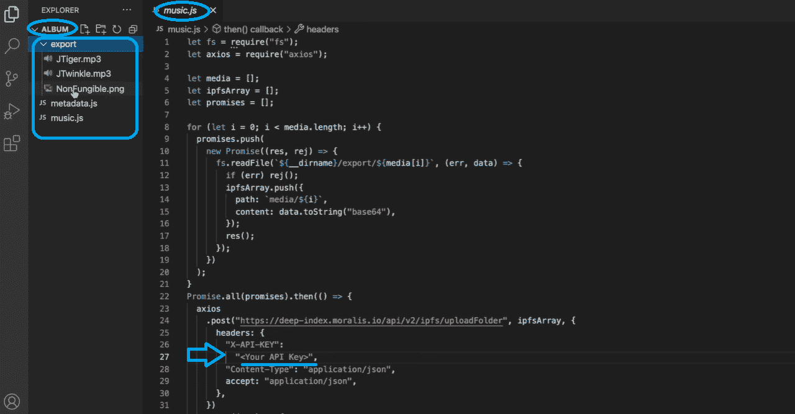

在上面的截图中，你也可以看到你需要在“music.js”文件中输入你的 API 键。有关如何操作以及如何将文件成功上传到 IPFS 的详细信息，请参考下面的视频(57:00)。

### 相册 NFT 造币厂

随着文件成功上传到 IPFS 和他们的元数据在您的处置，你已经准备好薄荷专辑 NFT。这将使您能够在 OpenSea 上列出它们，如本文顶部的预览所示。为此，我们创建了一个简单的智能契约，名为“ [Album.sol](https://github.com/IAmJaysWay/Decentralized-Spotify/blob/main/smartContracts/Album.sol) ”。后者也可以在 GitHub 上使用。要了解关于这个智能合约以及如何使用 Remix 编译和部署它的更多细节，请观看下面 01:04:20 的视频。

*注意* *:记住我们已经为我们的项目选择了多边形测试网。因此，你需要在你的* [*Web3 钱包*](https://moralis.io/what-is-a-web3-wallet-web3-wallets-explained/) *中放一些 play MATIC 来完成专辑 NFTs 的制作。*

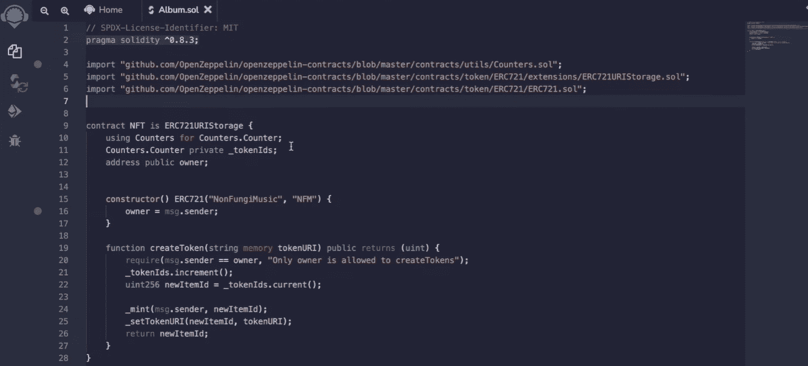

### 阅读相册 NFTs

既然专辑 NFT 已经准备好了，我们可以在 React 应用程序中使用 Moralis 的 Web3 API 来获取这些 NFT，并在我们的 Web3 Spotify 克隆中显示它们。为了做到这一点，视频中的 Moralis 专家将指导您创建一个名为“useAlbum.js”的新钩子(01:09:22)。这也是您将看到 Moralis 的“getAllTokenIds”端点的强大之处。

*这是我们在整篇文章中引用的视频:*

https://www.youtube.com/watch?v=E7R1gX-pEAs

## 如何构建 Web3 Spotify 克隆版——总结

在这篇文章中，我们已经涉及了相当多的内容。在本指南的帮助下，通过观看我们的 Moralis 专家的视频教程，我们成功地指导您完成了创建 Web3 Spotify 克隆的整个过程。此外，尽管事实上这是一个相当广泛的项目，你可以在一个多小时内完成。也就是说，如果您从我们的“starter”代码开始，并自己完成上述步骤。然而，如果你使用我们完成的代码，你可以在几分钟内克隆并运行你的 Web3 Spotify。这是一个完美的 Web3 项目，看看周围有大量的 Web3 增长。

如果你喜欢这个示例项目，一定要看看[Moralis 的 YouTube 频道](https://www.youtube.com/c/MoralisWeb3)和[Moralis 的博客](https://moralis.io/blog/)。除了无数其他的例子项目，这些都是你可以继续你的免费区块链发展教育的好地方。一些最新的话题涵盖了如何[建立一个 Web3 亚马逊市场](https://moralis.io/how-to-build-a-web3-amazon-marketplace/)，一个[中世纪元宇宙游戏](https://moralis.io/how-to-build-a-medieval-metaverse-game/)，一个 [Web3 MMORPG](https://moralis.io/build-a-web3-mmorpg-with-unity-in-10-minutes/) 与 Unity，一个[跨链 Zapper dApp 与 ReactJS](https://moralis.io/how-to-build-a-cross-chain-zapper-dapp-with-reactjs-using-moralis-api-and-serverless-real-time-transactions/) ，如何[推出一个白色标签 NFT 市场](https://moralis.io/how-to-launch-a-white-label-nft-marketplace/)，等等。

另一方面，你可能会更认真，希望[相对更快地成为 Web3 开发者](https://moralis.io/how-to-become-a-web3-developer-full-guide/)。如果是这样的话，你需要采取专业的方法。幸运的是，在[Moralis 学院](https://academy.moralis.io/)，有一个支持和进步的开发者社区在等着你。除了获得高价值的[课程](https://academy.moralis.io/all-courses)，你还将获得个性化的学习路径和专业指导。因此，你将有你需要的一切去全职加密宜早不宜迟。