# 如何在几分钟内建立雪崩 dApps

> 原文：<https://moralis.io/how-to-build-avalanche-dapps-in-minutes/>

除非你刚刚进入加密领域，否则你可能已经注意到 Avalanche 和它的 Solidity 兼容 dApps 最近受到了很多关注。这主要是因为 Avalanche 及其平台提供了许多优势。由于其高速智能合约平台和低费用，Avalanche 的潜力已经在 dApp 开发者中获得了牵引力。因此，这是一个学习如何建造雪崩****的好时机。因此，我们将扩展这个主题，探索为什么您应该构建 Avalanche dapp，但最重要的是，如何使用 Moralis 在几分钟内构建 Avalanche dapp。****

**无论您是否已经在其他链上创建了 [Web3](https://moralis.io/web3-and-javascript-what-is-javascript-and-web3-js/) 应用程序，或者如果您完全是区块链开发的初学者，使用这里的信息将会提高您的开发知识，以便您可以更有效地在 Avalanche 上构建 dApps。事实上，构建 Avalanche dApps 从未如此简单。有了 Moralis 的平台，你可以跳过所有复杂耗时的后端开发。此外，正如 Moralis 在 2021 年 9 月宣布的那样，Moralis 为开发者提供了[全面雪崩支持](https://moralis.io/moralis-announces-full-support-for-avalanche/)。因此，Moralis 有最方便，快捷，最简单的方法来建造雪崩 dApps。

然而，在我们展示如何构建雪崩 dApp 之前，让我们回顾一下关于雪崩的一些基础知识，并看看它与其他区块链相比如何。**

**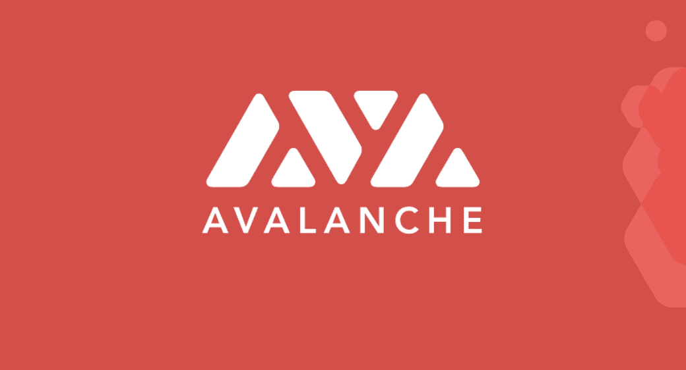

## 什么是雪崩 dApps？

自从以太坊上的智能合约诞生以来，去中心化的应用程序(dApps)就一直层出不穷。此外，分散式应用程序本质上是建立在各种区块链上的应用程序。此外，dApps 也被称为 Web3 应用程序或应用程序。

因此，Avalanche dApps 都是基于 Avalanche 链构建的 Web3 应用。雪崩链相对较新；其 mainnet 于 2020 年推出。然而，它已经获得了投资者和开发商的认可。因此，Avalanche 现在是一个声誉良好的开源平台，用于推出各种 dApps，包括 DeFi(去中心化财务)应用程序和其他自定义区块链实现。

### 什么是 AVAX？

AVAX 是 Avalanche 本国货币的代号。在其他用例中，这种硬币或原生令牌需要覆盖雪崩链上的交易成本。幸运的是，这些费用非常低，与以太坊等其他区块链的汽油费相比不算什么。因此，如果您计划构建 Avalanche dApps，AVAX 和交易费用是您需要考虑的因素。

Moralis 提供了一个简单的方法来获得 AVAX。借助 Moralis，您可以轻松集成 DEX，以便用户可以在您的 Avalanche dApp 上获得 AVAX。有关如何创建索引的更多信息，请参见 Moralis 博客中的以下文章:“[如何通过 5 个步骤](https://moralis.io/how-to-create-a-dex-in-5-steps/)创建索引”。

## 为什么要建立雪崩 dApps？

Avalanche 的两个主要兴趣点是其令人印象深刻的扩展能力和快速确认时间。该链也是环境友好的，因为它使用了利益证明(PoS)安全验证方法。如果我们还考虑到比以太坊低得多的交易费用，那么开发者和用户在 Avalanche 的区块链中找到某种吸引力就一点也不奇怪了。

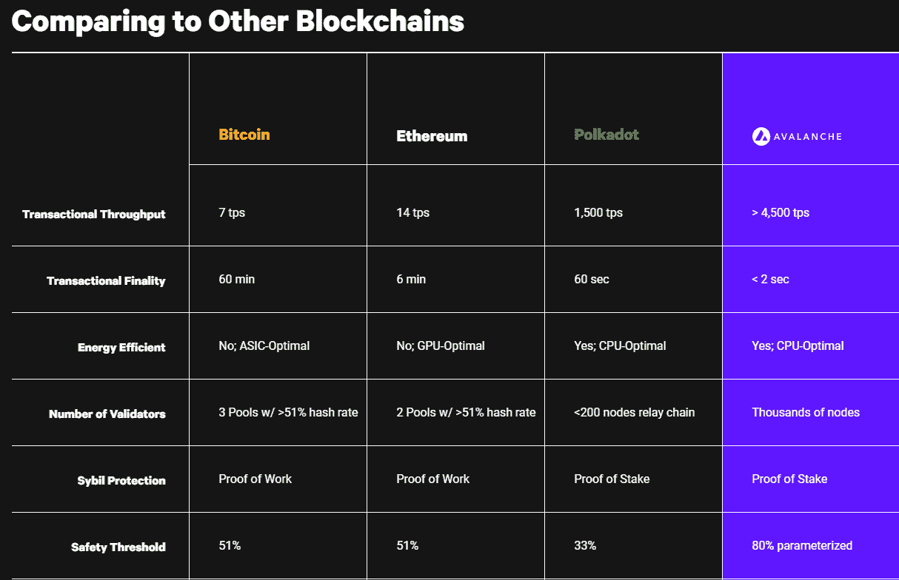

此外，值得指出的是，Avalanche 代表了第一个以分散金融为理念构建的智能合约平台。因此，资产发行、自动做市商、借贷和分散交易等功能可以很容易地建立在 Avalanche 之上。此外，Avalanche 旨在促进兼容 [Solidity](https://moralis.io/solidity-explained-what-is-solidity/) 的 dApps 的快速开发，这意味着它为所有以太坊开发者提供了一个简单的过渡。最重要的是，Avalanche 还可以与以太坊工具、资产和应用进行完全的互操作。因此，它具有全面的以太坊支持。

虽然以太坊仍然是 dApp 开发的领导者，但探索在其他知名新兴链(如 Avalanche)上开发的选项是非常值得的。随着以太坊连锁店更接近主流采用，也有更多的竞争，这使得你的 dApp 更难被注意到，而它可能更容易在人口较少的连锁店中脱颖而出。此外，通过效仿以太坊上流行的 dApp，人们可以很容易地获得他们的雪崩 dApp 的灵感。然后，只需为 dApp 添加一些独特的扭曲，并将其部署在雪崩链上。

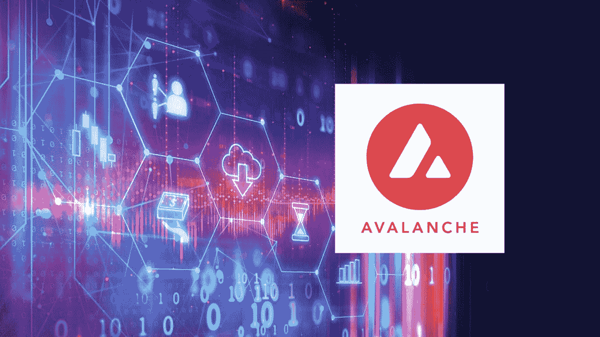

## 建造雪崩二极管的最简单方法

虽然有几种方法可以构建 Avalanche dApps，但大多数方法都需要熟练掌握 Solidity，而且往往不会让事情变得简单明了。然而，借助 Moralis 的平台和对 [JavaScript](https://moralis.io/javascript-explained-what-is-javascript/) 的利用，您可以快速轻松地创建和部署 Avalanche dApps，最棒的是 Moralis 可以免费使用！

如果你以前使用过 [Moralis 的 SDK](https://moralis.io/exploring-moralis-sdk-the-ultimate-web3-sdk/) ，你就会知道它简化了 dApps 复杂而乏味的后端开发。它基本上消除了所有的后端编码，让您可以专注于前端开发。因此，您最终可以节省时间和资源，同时提供更好的用户体验。更不用说您可以在令人印象深刻的时间框架内部署您的应用程序。

此外，作为最终的 Web3 开发平台，Moralis 是在考虑跨链互操作性的基础上构建的。因此，在这个优秀工具的帮助下构建的所有 dApps 都可以很容易地部署在任何受支持的链上(Moralis 的开发团队正在不断增加对新的知名链的支持)。这意味着，通过决定建立 Moralis 雪崩 dApps，你不会以任何方式限制自己。如果您决定在其他链(如以太坊、BSC 或 Polygon)上部署相同的应用程序，您可以无缝地迁移。

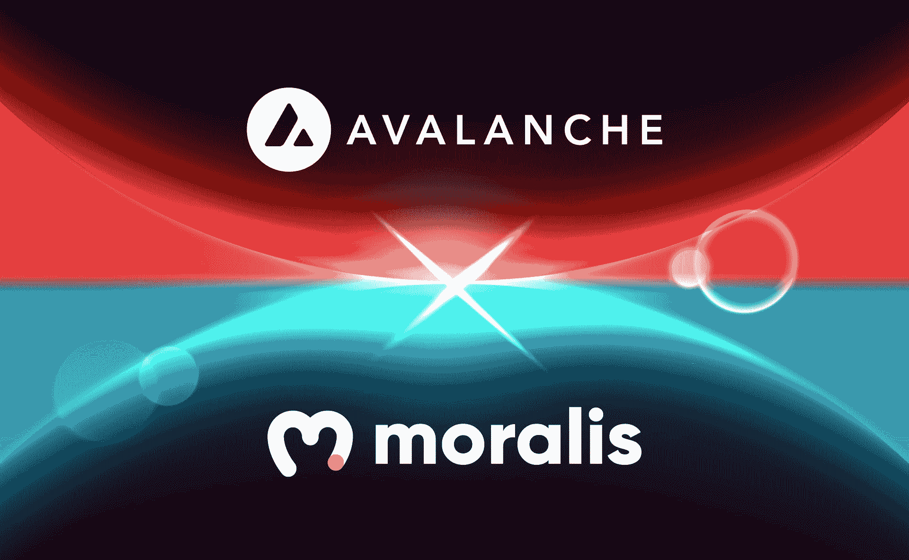

如果您还没有 Moralis 帐户，请确保在进入下一部分之前[注册](https://admin.moralis.io/register)。这样，您将能够跟随我们的示例项目，从而在几分钟内学会如何构建 Avalanche dApps。

# 如何构建 Avalanche dApps–示例项目

我们相信学习任何东西的最好方法是接受简单的任务。这样，你可以边做边学。因此，我们将采取一个例子项目，我们将建立一个雪崩钱包追踪器。

在我们开始创建 Avalanche dApp 之前，我们想向您展示一下我们将要开发的内容。看看下面的图片，以获得更清晰的画面。当你开始构建 Avalanche dApps 或任何其他分散的项目时，至少对你正在构建的东西有一个模糊的认识是很重要的。这使得过程更容易。

这就是我们的雪崩 dApp 的样子:

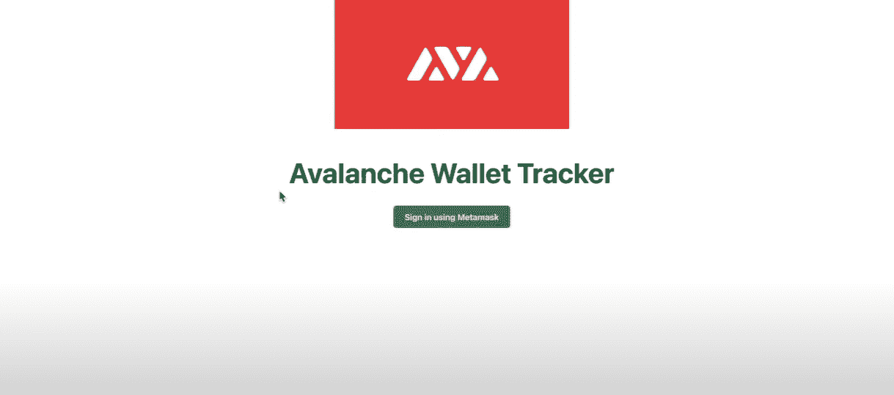

单击该按钮将允许用户登录。登录后，他们将看到以下控制面板:

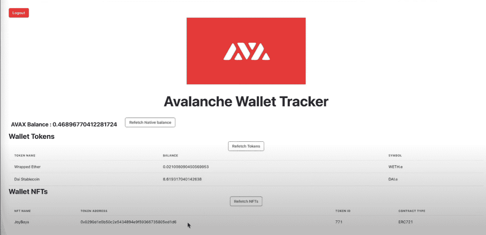

如您所见，控制面板将显示用户的 AVAX 余额、令牌及其余额以及 NFT。

根据您的编码技能水平和对 Moralis 的熟悉程度，以上可能看起来需要做很多工作。然而，我们向你保证，你会想知道我们有多容易在几分钟内准备好这样一个钱包追踪器。尤其是后端部分，否则将需要几周甚至几个月的时间，我们将能够用三段代码来完成。当使用 Moralis 代表我们做所有繁重的后端相关工作时，这一切都是可能的。

## 建立 Moralis 来建立雪崩 dApps

除了 Moralis 本身，我们还推荐在创建 dApps 时使用其他有用的工具，比如 MetaMask 和 Visual Studio 代码。有关获取和设置这些工具的更多详细信息，请查看我们的"[以太坊初学者开发](https://moralis.io/ethereum-development-for-beginners)"指南。此外，如果您想在任何其他链上构建 Avalanche dApps 或 Web3 应用程序，以下是您需要完成的 Moralis 设置步骤:

1.  **注册或登录您的 Moralis 账户**-如果您还没有创建免费的 Moralis 账户，请务必现在就创建。只需按照之前提供的链接(或[点击此处](https://admin.moralis.io/register))，输入您的电子邮件地址，设置您的密码，并确认您的电子邮件地址(您将收到一封带有确认链接的电子邮件)。如果您已经拥有一个有效的 Moralis 账户，[登录](https://admin.moralis.io/login)平台。
2.  **创建 Moralis 服务器**–登录后，您需要创建一个 Moralis 服务器。点击 Moralis 管理界面右上角的“+创建新服务器”按钮即可。从出现的下拉菜单中(见下图)，单击“Mainnet 服务器”选项。

在弹出窗口中，输入所有必需的详细信息:输入服务器名称(可以是您想要的任何名称)，选择您的地区、网络、链(因为我们正在构建 Avalanche，请确保进行相应的选择)，然后单击“添加实例”按钮。

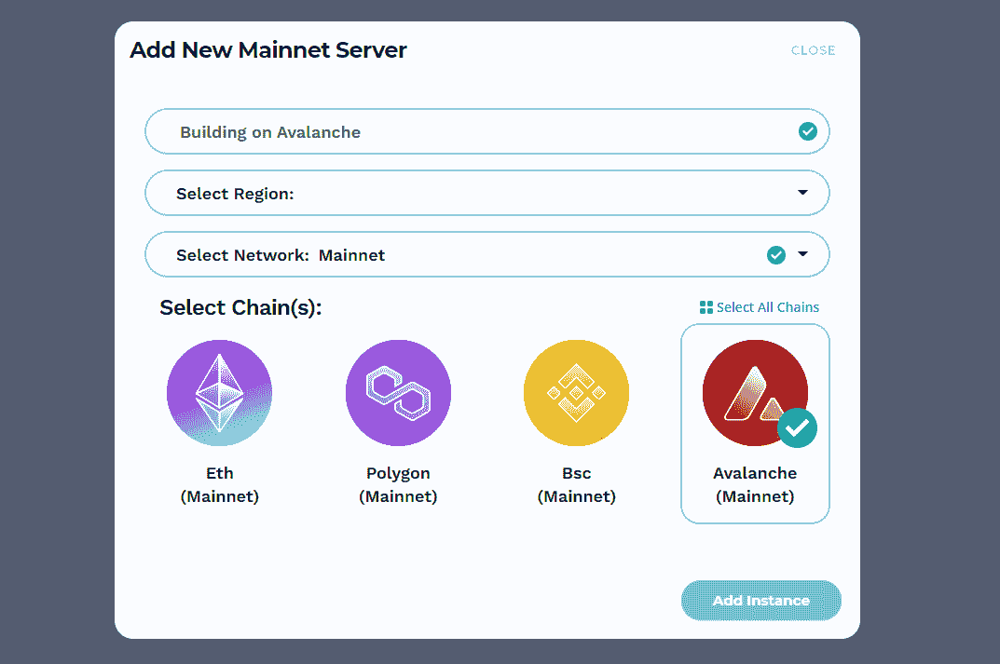

3.  **访问服务器详细信息**–成功创建您的服务器后，您需要获得它的一些详细信息(在您的”内部使用)。js”文件)。您可以通过单击服务器名称旁边的“查看详细信息”按钮来访问服务器详细信息。这将弹出一个包含详细信息的窗口:

4.  **在填充“后初始化 Moralis–**。js”文件，您可以访问强大的后端功能。对于我们的例子，我们将使用一个“index.js”文件。我们将在上一步中获得的应用程序 ID 和服务器 URL 插入该文件:

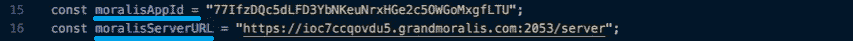

## 如何构建 Avalanche dApps–钱包追踪器示例

请用这些代码行(也在“index.js”文件中)补充我们在上一节的步骤 4 中给出的代码:

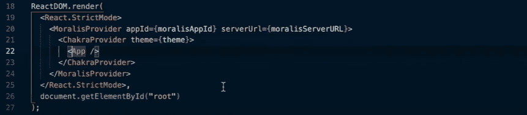

现在，Moralis 的所有后端功能都由我们支配，我们可以专注于我们的 Avalanche 应用程序的更多细节。为此，我们将使用“App.js”文件，在这里我们将对我们的应用程序组件进行编程。

### 用 Moralis 建造雪崩 dApps

感谢 Moralis 的力量，我们将有最少的后端工作。本质上，我们的应用程序将有三个主要组件:获得原生平衡、获得令牌平衡和获得 NFTs。这是帮助我们解决这个问题的代码:

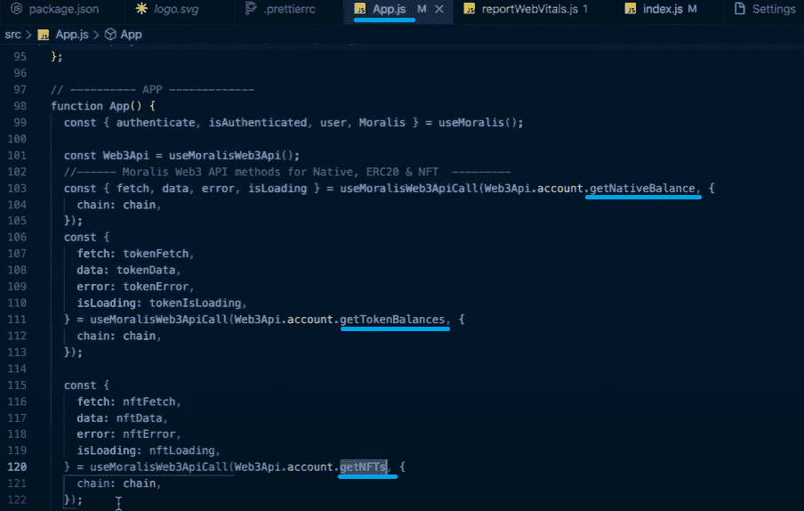

使用上述“**getnativebalances**”、“ **getTokenBalances** ”和“ **getNFTs** ”的代码片段，我们能够直接从 Avalanche 区块链获得所有使用 MetaMask(或其他支持的钱包)登录我们 dApp 的用户的详细信息(最新数据)。这种身份验证方式也默认内置在 Moralis 中。此外，您可以在上面的第 99 行看到我们在使用它。

此外，我们希望确保我们的钱包跟踪应用程序定期刷新，从而显示更新的余额。我们通过在“App.js”文件中添加以下代码行来实现这一点:

此外，我们还希望我们的 dApp 能够检测用户是否决定从他们的元掩码内部从 Avalanche 切换到另一个网络。我们通过实现以下代码行来实现此功能:

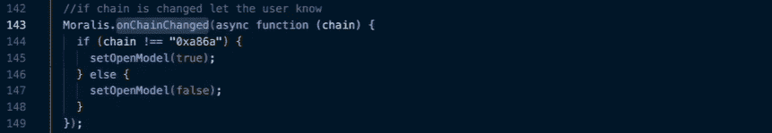

此外，我们希望确保未连接到 Avalanche 的用户遵循身份验证步骤。我们通过在钱包追踪界面中向他们提供说明来解决这一问题。下面是处理这一部分的代码:

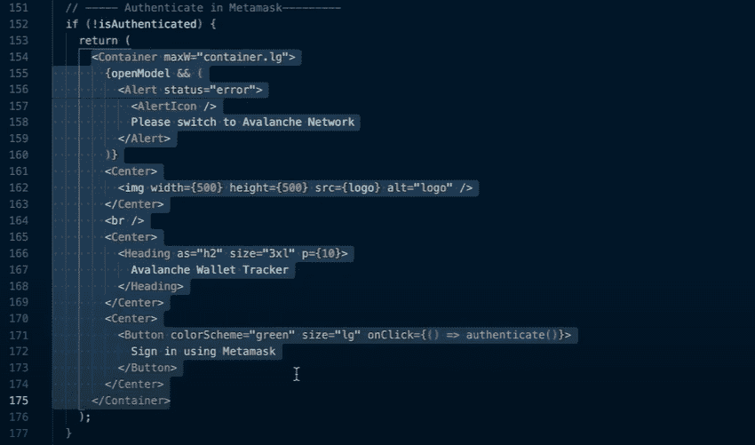

*注意:对于我们的 Avalanche dApp 示例，我们重点关注使用元掩码来验证用户。但是，您可以使用其他流行的钱包提供商来实现这一目的。当然，如果是这样的话，要显示的文本必须做相应的调整。*

### 我们雪崩 dApp 的化妆品

有了上一节实现的代码，我们的应用程序的功能就已经得到了保证。如您所见，Moralis 的 SDK 使得从区块链收集细节变得极其容易。现在，是时候确保我们的 Web3 应用程序看起来有吸引力了(如“如何构建 Avalanche dApps–示例项目”一节中的图片所示)。

我们希望钱包跟踪器显示标志和标题。下面是解决这个问题的代码:

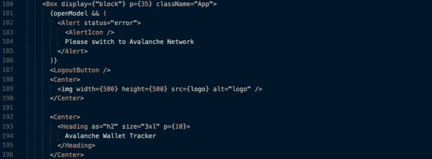

接下来，我们希望整齐地显示本机余额、令牌余额和 NFT。

下面将显示本机余额:

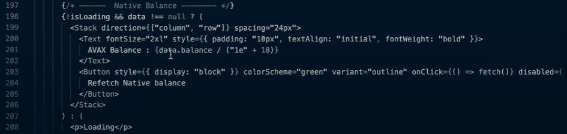

以下代码行将显示令牌余额和 NFT，我们使用表格以有组织的方式显示内容:

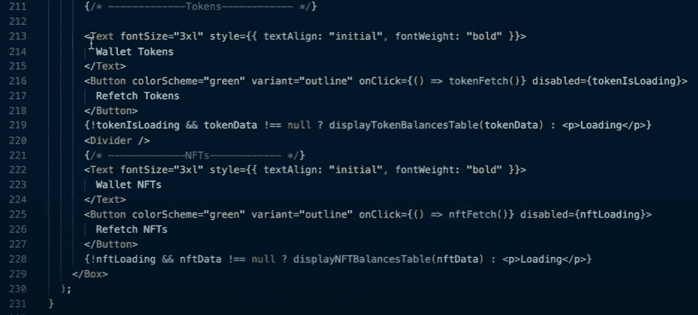

幸运的是，表的代码很简单。你可以看看下面用来展示代币的桌子。我们将不包括用于 NFTs 的那个，因为它是相似的。

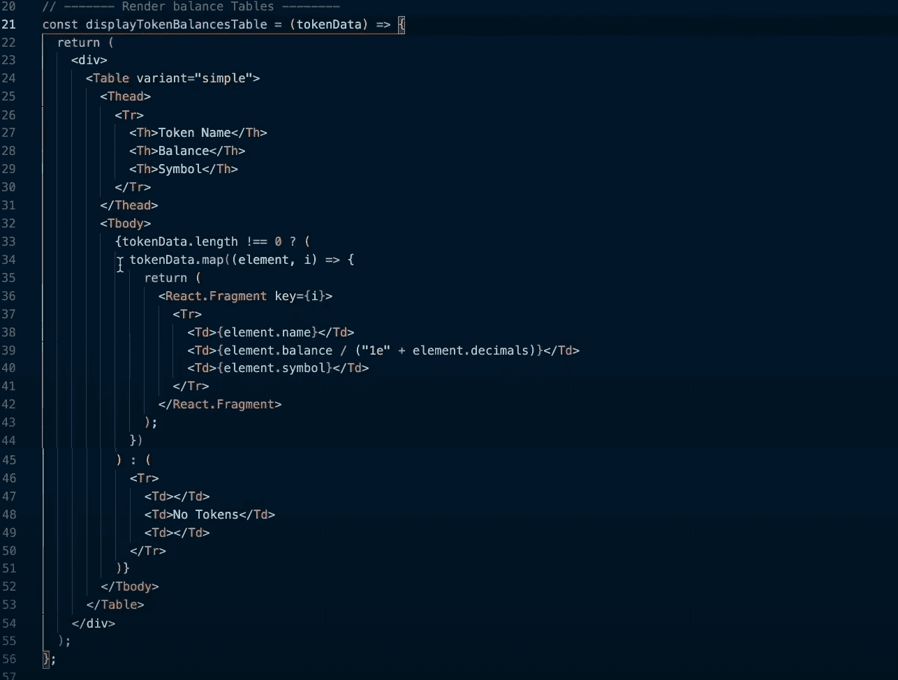

这就是我们的 Avalanche dApp 示例项目。如果您更喜欢跟随视频教程，我们有一个涵盖整个“如何构建 Avalanche dApps–示例项目”部分描述的相同步骤的教程。因此，请随意观看以下名为“[在 5 分钟内构建雪崩 Dapp](https://www.youtube.com/watch?v=YVCnxL_Cq94)”的视频:

https://www.youtube.com/watch?v=YVCnxL_Cq94

## 如何在几分钟内构建雪崩 dapp–总结

在上面的章节中，我们已经谈了很多。您已经了解了雪崩 dApps 是什么，以及为什么现在可能是开始构建它们的最佳时间。此外，您现在知道 AVAX 是雪崩链的本地货币，您需要一些 AVAX 来支付网络费用，幸运的是网络费用非常低。

此外，已经向您介绍了 Moralis，希望您已经掌握了 Moralis 可以为您的 Web3 编程之路带来的好处。此外，我们通过一个创建钱包追踪器的示例项目，展示了如何在几分钟内构建 Avalanche dApps。

有了这些信息，你就可以决定是否要专注于创造更先进的雪崩二极管二极管。如果这篇文章激发了你的兴趣，并且你想更深入地研究其他 block 项目，那么我们建议你去看看 [Moralis 的博客](https://moralis.io/blog/)。在那里，我们有无数的指南会告诉你如何在以太坊、[、BSC](https://moralis.io/how-to-create-a-bsc-token-in-5-steps/) 、[多边形](https://moralis.io/how-to-create-a-polygon-token/)和 [Arbitrum](https://moralis.io/how-to-create-an-arbitrum-token-in-6-steps/) 上建造[。](https://moralis.io/ethereum-development-for-beginners/)

祝您成功开发 dApps！**