# 如何构建跨链 dApps

> 原文：<https://moralis.io/how-to-build-cross-chain-dapps/>

构建跨链 dApps(分散式应用程序)的能力是必不可少的，因为区块链的开发者希望在不同的链上扩展他们的 Web3 应用程序。通过使用 Moralis 的 Web3 开发平台，新的和有经验的程序员可以快速轻松地开发 dApps 跨链。此外，通过 Moralis Speedy Nodes，您可以在包括以太坊、币安智能链(BSC)、Polygon、Arbitrum、Avalanche 和 Fantom 在内的网络上创建跨链 dApps。因此，这篇文章将教你如何使用 Moralis 以一种简化的方式构建跨链 dApps。

此外，Moralis 强大的区块链工具包让您在构建跨链 dApps 时具有优势。此外，借助 [Moralis Price API](https://moralis.io/introducing-the-moralis-price-api/) 等功能，您可以从分散的数据源获取价格变动，这将增强您的跨链 DeFi dApps。此外，Moralis 将帮助您利用将互操作性构建到您的项目中的固有优势，来创建跨众多区块链的最强大的 dApps。

### 什么是 dApps？

如果你是区块链开发的新手，你可能会想，“[什么是 dApps？](https://moralis.io/decentralized-applications-explained-what-are-dapps/)”。分散式应用程序(dApps)类似于常规应用程序——它们的功能和感觉几乎与我们已经习惯的应用程序完全一样——除了它们运行在不同的后端。此外，分散式应用程序在对等网络或区块链上运行。

在[区块链开发](https://moralis.io/best-languages-for-blockchain-development-full-tutorial/)中，跨链 dapp 正迅速成为常态，在未来几年中，我们预计大多数 dapp 将成为跨链 dapp。然而，这是为什么呢？这是因为当与 Web3 交互时，区块链互操作性将成为一个越来越重要的特性。更有甚者，Moralis 等 Web3 开发平台正在加速这一现象。使用 Moralis，构建跨链 dApps 要容易得多，因为该平台从第一天起就被设计为跨链兼容的。

## 如何在以太坊上构建跨链 dApps

如果你想深入了解如何构建以太坊 dApps 的教程，你会发现下面这段来自 Moralis Web3 YouTube 频道的视频信息量很大。此外，使用这些相同的步骤，您可以轻松地为 Moralis 支持的任何网络构建跨链 dApps！

https://www.youtube.com/watch?v=jdx2H1alijQ

## 跨链 dApps 与常规应用

你如何区分跨链 dApps 和常规应用？这两种类型的应用程序可以提供相似的特性和功能。然而，除了具有与常规应用相同的属性之外，跨链 dApps 还包括以下关键功能:

*   它们存储在开源的点对点区块链网络上。
*   分散式应用程序在没有单一实体控制的情况下运行。
*   通常，dApps 使用加密令牌来促进操作。
*   他们的数据是公开的。
*   它们可以互相交流，这是旧应用和第一代 dApps 所没有的功能。

除了这五个基本区别之外，跨链 dApps 还具有以下优势:

1.  开源优势

它们建立在开源区块链的基础上，鼓励大量开发人员不断改进网络和基础设施。

2.  将财务和激励系统原生集成到设计中

通过与代币或加密货币无缝兼容，支付和激励系统被内置到跨链 dApps 中。此外，象征性激励也推动了采用。

3.  弹性

区块链网络的分散特性意味着，当系统的某些部分(如个别计算机或网络的某些部分)出现问题时，停机时间很可能会更短。

4.  抵制审查

区块链网络的一个基本优势是它们可以抵抗审查。信息受到网络完整性的保护。而且单点攻击很难实施。

5.  区块链互通

互操作性是区块链与其他链通信的能力。此外，它使区块链能够相互交换价值。

传统应用依赖于 Web2 或高度集中的基础设施来运行，而跨链 dApps 则依赖于 Web3 或独立的区块链来相互对话。因此，在没有集中控制的情况下，现在由区块链桥来进行通信，而不需要集中管理机构。因此，跨链 dApps 具有“无许可”和独立于中央官僚机构的优势。

### 互操作区块链的能力

为了说明跨链 dApps 和互操作性的强大功能，下面是一些您可以做些什么的示例:

*   支持跨链支付。
*   被动收入或利用 dApps 之间套利机会的收益。
*   使用借出协议，在一个链上借用加密资产，并在其他链上将它们用作附属资产。
*   提供跨链流动性的能力。

显然，这些例子(主要集中在 DeFi)只是冰山一角，因为你的 dApp 的商业模式将围绕你的创造力工作。此外，跨链 dApps 扩大了您的机会，让您吸引更多的用户，因为它们容纳了一个以上的区块链或令牌类型。

## 跨链 dApps 生态系统

在过去的几年里，全球 dApp 的采用量有了突飞猛进的增长。随着 NFT 游戏和 DeFi 等趋势不会很快消失，建造这种 dApps 的市场正在飙升。此外，举例来说，对知道[如何启动 NFT 市场](https://moralis.io/how-to-launch-an-nft-marketplace/)的程序员的需求从未如此之高。

游戏应用程序、金融应用程序、社交应用程序、NFT 应用程序和其他类型的去中心化应用程序正在经历一场创作热潮。因此，非常需要一种跨链的 dApp 显影剂。如果你是一个新手[区块链开发者](https://moralis.io/how-to-become-a-blockchain-developer/)，你可能想看看这些资源来自 Moralis 网站上的[区块链 JavaScript 库](https://moralis.io/javascript-libraries-ethers-js-vs-web3-js/)、 [Solidity](https://moralis.io/solidity-explained-what-is-solidity/) 、[Solidity 智能合同用例](https://moralis.io/use-cases-for-solidity-smart-contracts/)和[web 3](https://moralis.io/the-ultimate-guide-to-web3-what-is-web3/)最终指南。

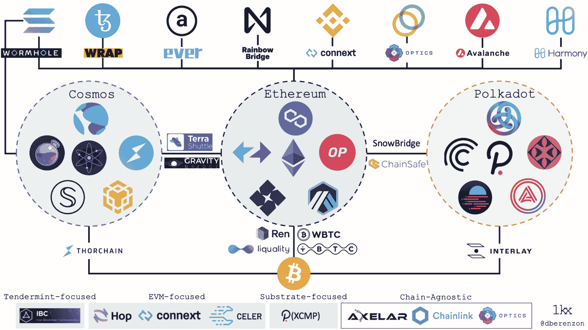

**区块链平台目前如何通过多链桥相互作用。**

大约百分之八十(80%)的 dApps 仍然建立在以太坊之上。因此，在构建跨链 dApps 时，记住以太坊兼容性很重要。然而，有很多区块链在争夺以太坊的头把交椅。

目前，以太坊构成了现存 dApps 总数的 2596 个，也就是 3636 个，并且还在继续。然而，币安智能链(BSC)已经取得了超过 1500 个基于其协议的 dApps。Solana 和 Polygon 各有大约 400 个 dApps。Polkadot 支持 200 多个 dApps，Avalanche 支持 68 个。最重要的是知道如何让这些 dApps 和生态系统相互合作。Moralis 通过其本地构建的跨链基础设施帮助您实现这一目标。

## 如何开始使用跨链 dapp–初步安装

首先，你需要安装一些软件来帮助你在以太坊上创建 dApp。

要开始构建跨链 dApps，您需要安装以下软件:

1.  MetaMask

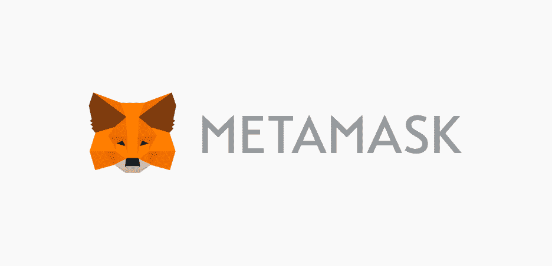

在这个特定的 dApp 项目中，我们将使用[元掩码](https://moralis.io/metamask-explained-what-is-metamask/)进行用户认证和其他事务。要更深入地了解，请务必阅读 Moralis 博客上名为“[用 MetaMask](https://moralis.io/building-dapps-with-metamask/) 构建 dApps”的文章。

2.  像 Visual Studio Code (VSC)这样的代码编辑器

安装 Visual Studio 代码后，您需要在代码编辑器中安装以下扩展:

*   Live 服务器扩展。
*   ES7 React/Redux/graph QL/React-原生代码片段。
*   坚固性插件。

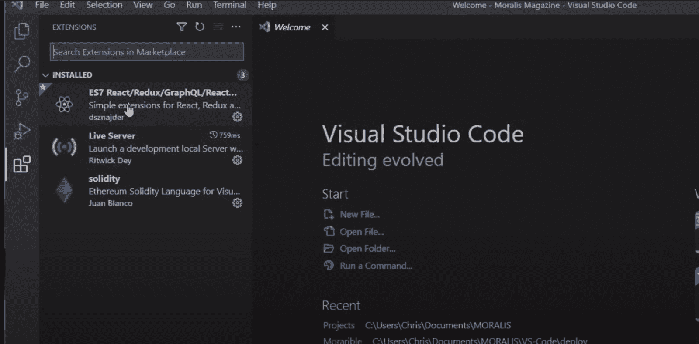

3.  节点. js

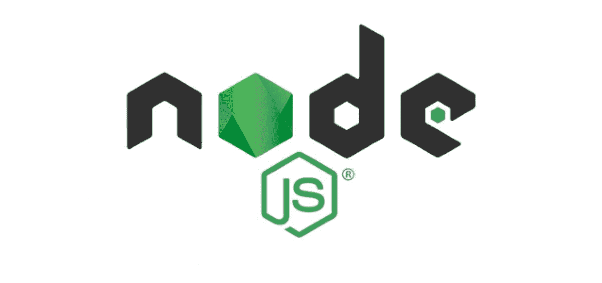

当使用 Moralis 构建时，您可能需要在浏览器之外执行 JavaScript。因此，您需要使用 Node.js。

4.  加纳切

您需要 Ganache 来创建您的本地沙箱环境。这是在 mainnet 甚至 testnet 上启动您的 dApp 之前。一旦您进入了 Ganache，它将为您提供多个地址，您可以在创建 dApp 或测试令牌时使用。要了解更多关于 Ganache 的信息，请阅读名为“[Ganache Explained-什么是 Ganache Blockchain”的文章。](https://moralis.io/ganache-explained-what-is-ganache-blockchain/)“来自 Moralis 博客。

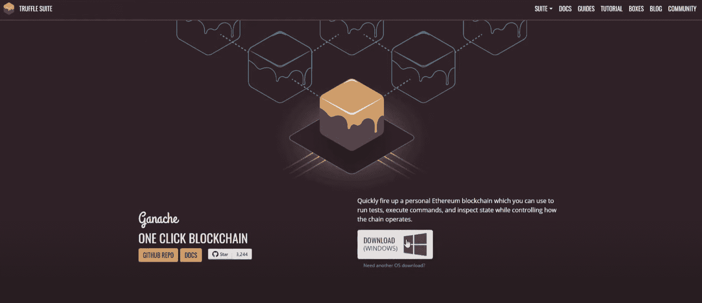

有了这四个工具，您已经完成了最初的软件需求，因此您可以继续在本地环境中构建 dApp。

#### 构建跨链 dApps 的后续步骤

以下是后续步骤的概述:

*   创建一个本地的区块链。
*   将帐户导入元掩码。
*   在区块链上发送测试交易或在本地区块链上测试 dApp。
*   一旦完成，应用程序构建完成并准备好公开测试，您就可以进入 testnet 了。在 testnet 上，你处于一个公共测试环境中，只有没有货币价值的测试/伪造交易。
*   一旦错误被解决了，你就可以进入 mainnet 了。

### 步骤 1–在 Ganache 上创建本地区块链

在以太坊下的 Ganache 上新建一个工作区。然后，命名您的工作区。在这种情况下，我们将把它命名为“第一个区块链”。点击右上角的“保存工作空间”按钮。同时，不要增加任何松露项目。

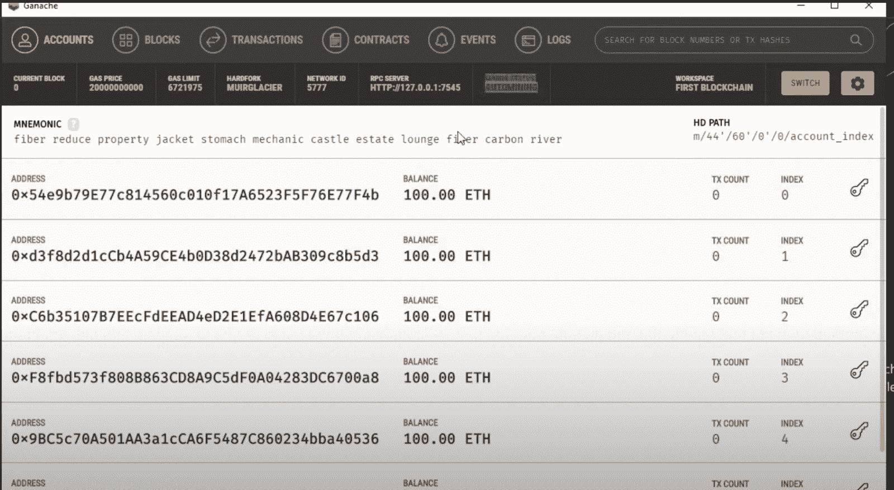

保存后，您将获得十个不同的地址，作为您当地区块链的一部分。此外，这些区块链是自动采矿。每当您与这些地址进行交互或进行事务处理时，它们将作为相应本地区块链上常规块的一部分被挖掘。十个帐户中的每一个都有一个地址，在本例中，它们包含 100 个 ETH，这只是本地测试 ETH。因此，每次您在这些地址上创建交易时，它都会被记录在 Ganache 上。在每一行的右边，你会发现一个钥匙符号，它会显示你的私人钥匙。

### 步骤 2–连接到元掩码

一旦进入 MetaMask，点击“网络”并连接到一个自定义的 RPC 网络。填写关键信息，即:网络名称、新的 RPC URL、链 ID(本例中，我们使用的是 1337)；但是，您可以将最后两个选项留空。

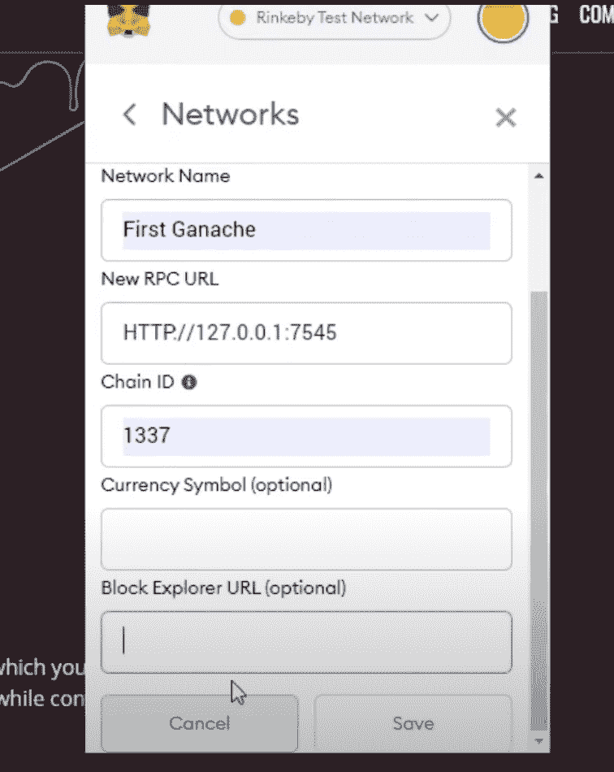

此外，您可以从您的 Ganache 工作区获得 RPC URL 信息，如下所示:

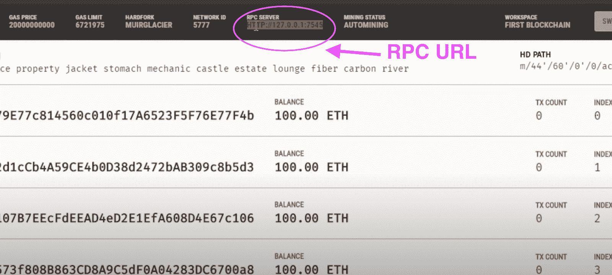

现在，保存您的详细信息。保存后，您的新网络名称将出现在 MetaMask 的网络列表中。当你进入你自己的网络，你会发现里面没有以太。您需要导入 Ganache 上的一个帐户。此外，要导入 ETH，请单击右上角的元掩码图标，选择“导入帐户”，然后将私钥粘贴到指定字段。

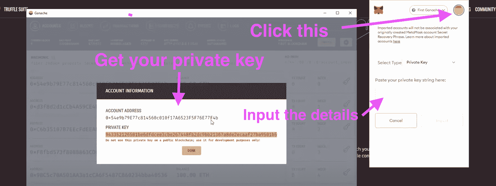

一旦你按下导入键，你会在你的账户上找到 100 test ETH。然后，通过使用相同的步骤，导入第二个帐户，以便您可以练习在两个帐户之间发送交易。

#### 向您的钱包注入公共测试网 ETH

在区块链当地的 ETH 为你的钱包提供资金后，你现在可以开始使用公共 testnet ETH 了。

使用 Ropsten 和 Rinkeby ETH testnet 网络，您可以在真实环境中测试您的 dApp，而无需购买真实的 ETH。此外，您可以使用水龙头免费为您的 testnet 钱包提供资金。在网上很容易找到 Ropsten 以太坊水龙头，它们可能看起来像下面这个:

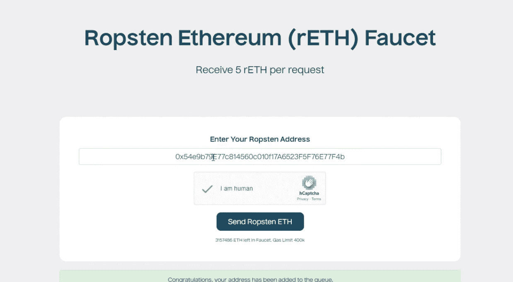

转到您的 MetaMask 钱包，选择“Ropsten 测试网络”，然后复制地址。之后，输入您的 testnet 帐户地址，以获得免费的 testnet ETH。当 testnet ETH 出现在你的帐户上时，练习在钱包之间来回发送它以确保一切正常。

你可以用 Rinkeby 网络做同样的事情。然而，Rinkeby 可能会要求你做一些社交媒体发布，以获得 testnet ETH 并获得 URL。此外，在 Rinkeby 上，你可以请求获得以太的速率。

### 第三步-建立你的跨链 dApps

关于跨链 dApp 项目的样例，可以参考上面贴的视频。转到演示部分，从 25:04 开始，按照 27:18 开始的说明继续构建 dApp。您将会看到，这个项目从创建一个全新的 Visual Studio 代码会话开始，并且最初处理表单。因此，它从下载“仪表板”和“登录”组件的引导样板开始。

在使用 HTML 完成表单方面的工作后，您可以继续进行项目的 JavaScript 部分。因此，将 JavaScript 文件连接到 HTML 索引文件，如下所示:

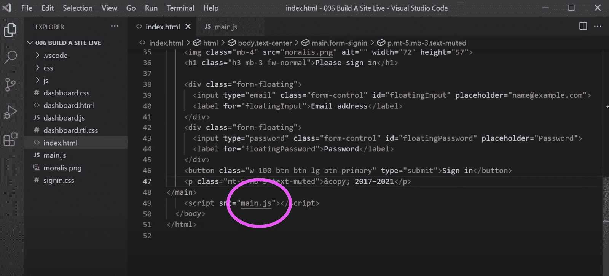

在浏览器中运行它，以确保 JavaScript 文件已正确连接。

### 步骤 4–连接到 Moralis 服务器

在建立你的 dApp 的过程中，你需要建立一个 Moralis 账户。Moralis 为您提供了开始构建 dApp 所需的所有工具，从服务器创建到无缝后端支持、特性和 API 集成。

1.  创建一个 Moralis 账户

要创建一个新的 Moralis 帐户，只需在 Moralis 网站上注册即可。这很容易，简单，而且免费。通过创建一个帐户，您可以获得优秀的功能，使 Moralis 成为构建非凡的跨链 dApps 的最终 Web3 工具。

2.  添加新服务器

一旦你得到你的帐号，你需要做的第一件事就是在 Moralis 中创建一个新的服务器。这让您无需设置自己的后端，包括购买自己的硬件基础设施。此外，使用 Moralis 将您从同步节点的繁琐步骤中解放出来，这可能需要数周时间。

只需点击右上角的按钮，选择“Mainnet 服务器”选项，命名您的项目，选择您的地区，并选择您的网络。然后，单击“添加实例”。

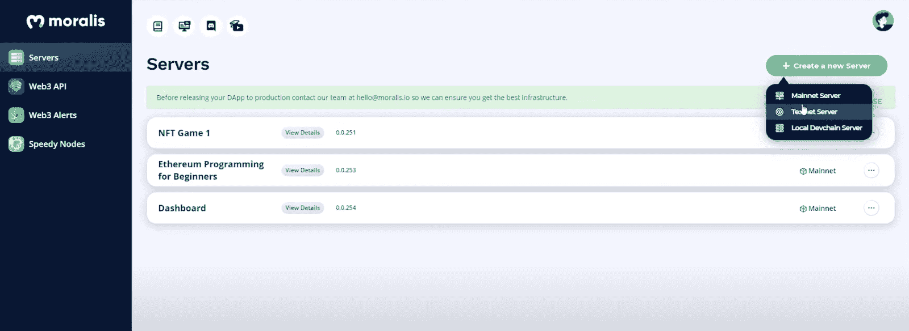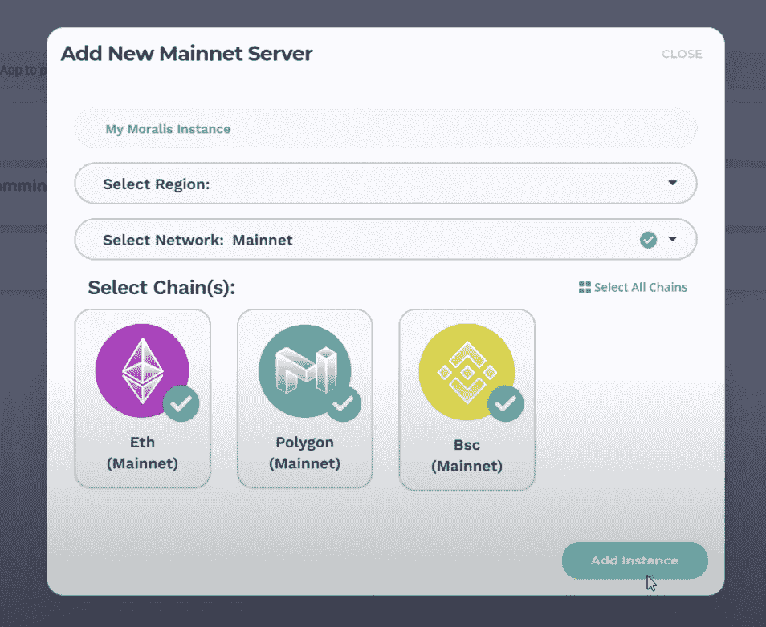

请注意，通过一次选择多个区块链，您可以轻松地使您的 dApp 跨链。这展示了 Moralis 的力量，它让构建具有强大支持的跨链 dApps 的过程简单到只需点击几下鼠标。

#### 无服务器 dApp 创建

有了 Moralis 为您处理服务器并提供[无服务器计算](https://moralis.io/serverless-explained-what-is-serverless-computing/)，您不再需要做繁重的工作。因此，您可以自由地专注于创建一个美丽的前端。

确保通过单击 Moralis 服务器实例栏上的“查看详细信息”获得服务器 URL 和应用程序 ID，并将信息存储在剪贴板上，以备将来在开发中使用。

3.  连接您的 Moralis 服务器

转到[Moralis 文件](https://docs.moralis.io/)页面。在那里，你会在左侧找到“[在 3 分钟内建立一个简单的 dApp](https://docs.moralis.io/guides/build-a-simple-dapp-in-3-minutes)”部分——点击它。然后，向下滚动，复制“在 HTML 页面中包含 Moralis”标题下的源代码，并继续从 36:05 开始的视频教程中的步骤。

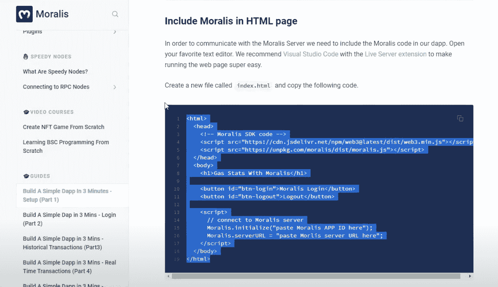

4.  继续建立你的交叉链 dApps

这些只是让你开始的最初步骤。因此，请确保您按照上述视频教程中的说明进行操作，以便全面了解如何构建跨链 dApps。

## 如何构建跨链 dapp–总结

有了交叉链 dApps，可能性成倍增加。以太坊仍然是世界上使用最广泛的区块链。然而，像币安智能链、Polygon、Avalanche 和 Arbitrum 这样的链在支持您的跨链基础设施方面同样强大。此外，Moralis 为您提供了在所有这些基础上进行构建的机会。

你可以选择先在以太坊上构建 dApps，以后再添加跨链特性。Moralis 的伟大之处在于，它是为这种类型的构建而制造的，并且无缝地提供了这样的选项。因此，Moralis 允许您从头开始规划跨链的可互操作 dApps，并在进行过程中提供扩展选项。

此外，Visual Studio 代码中的 [Moralis snippets](https://docs.moralis.io/moralis-server/getting-started/snippets) 扩展可以帮助您在各种跨链 dApps 上创建许多功能。在下面的视频中了解更多有关 Moralis 片段的信息，以加速您的 Web3 编程，并在创纪录的时间内创建功能丰富的 dApps:

https://www.youtube.com/watch?v=X82YBwLf1Vk

为了充分利用您的跨链 dApps，[在 Moralis](https://admin.moralis.io/register) 上注册一个帐户，这是当今 Web3 开发者最强大的“瑞士军刀”!