# 如何在以太坊上构建 dApps

> 原文：<https://moralis.io/how-to-build-dapps-on-ethereum/>

你知道自 2020 年以来，区块链发展一直是最受欢迎的职业之一吗？除此之外，以太坊仍然是区块链 [**Web3**](https://moralis.io/the-ultimate-guide-to-web3-what-is-web3/) **开发的领头羊。因此，拥有以太坊编程技能的开发人员的工资继续攀升并不令人惊讶。因此，学习如何在以太坊上构建** [**dApps**](https://moralis.io/decentralized-applications-explained-what-are-dapps/) **是你在 Web3 之旅中可以做出的最佳决定之一。有些人可能认为开发 dApps 相对困难。然而，使用 Moralis，构建 Web3 应用程序是一个简单易行的过程。因此，我们将向您展示如何借助 Moralis 的平台在以太坊上构建 dApps。**

区块链开发的一个很好的基础是拥有一些关于 JavaScript、HTML 和 CSS 的知识。尽管建议拥有上述一些技能，但几乎没有或根本没有这些技能的初学者仍然可以探索和学习如何在以太坊上构建 dApps。虽然标准的区块链开发路径包括相当复杂和耗时的后端编程，但有一种捷径叫做[Moralis(T5)。这个终极的 Web3 开发平台代表您负责后端基础设施。通过利用 Moralis 的平台，你可以克服潜在的障碍，完全理解如何在以太坊上构建 dApps。](https://moralis.io/)[创建您的帐户](https://admin.moralis.io/login)，立即开始您的区块链之旅！

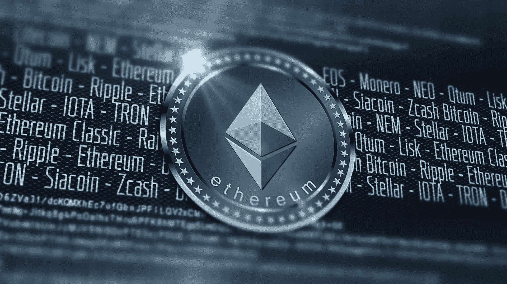

## 如何在以太坊上构建 dApps 先决条件

在我们开始展示如何在以太坊上构建 dApps 的实际例子之前，您需要熟悉特定的工具，并设置一些东西，比如本地区块链和测试基金。此外，不要忘记注册 Moralis，因为我们将广泛使用这个强大的工具，节省我们很多时间。

### 使用基本工具

当学习如何在以太坊上构建 dApps 时，为自己配备合适的工具是非常重要的。当然，Moralis 将是“你袖子里的王牌”，但是还有四个非常有用的工具，你应该下载并安装到你的电脑上。我们已经在一篇名为“[以太坊初学者开发](https://moralis.io/ethereum-development-for-beginners/)”的独立文章中介绍了这四个工具([元掩码](https://moralis.io/metamask-explained-what-is-metamask/)、Visual Studio 代码、 [Node.js](https://moralis.io/node-js-explained-what-is-node-js/) 和 [Ganache](https://moralis.io/ganache-explained-what-is-ganache-blockchain/) )以及如何获得它们。

### 如何在以太坊上构建 dApps 创建本地区块链并发送交易

我们在这一部分的目标如下:

*   解释为什么以太坊 dApp 开发需要本地区块链。
*   创建一个本地区块链。
*   将帐户导入元掩码。
*   在区块链上发送多个测试交易记录。
*   给你的测试钱包添加大量的 ETH。

为什么你需要一个本地的区块链？这是创建一个可以立即测试 dApps 的环境的最佳方式。通过这种方式，智能合约的所有交易和通信都可以快速、免费地得到测试。

下图显示了作为 dApp 开发流程第一步的本地区块链。一旦你在本地区块链上完成了 dApp，你应该把它放到一个测试网上(下图中的第二步),看看它的性能，并找出任何潜在的错误。只有这样做之后，您的分散式应用程序才可以发布到 mainnet 上(下图中的第三步)。

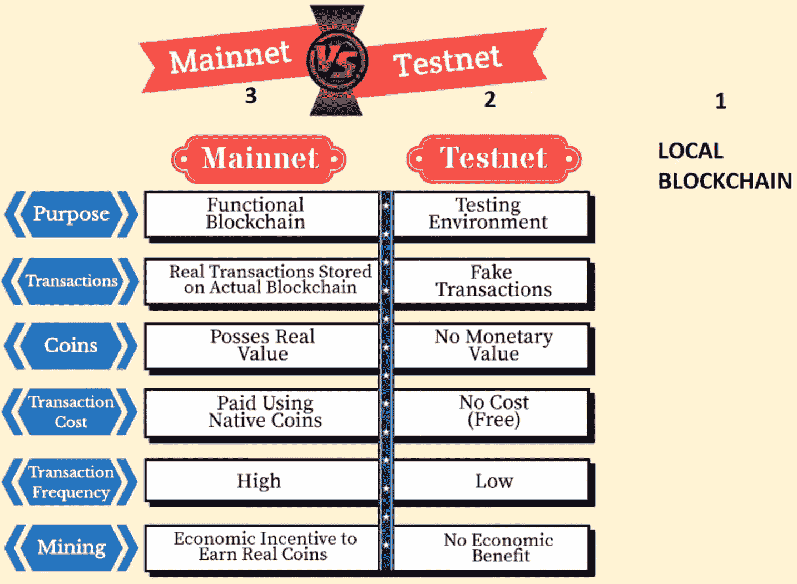

#### 使用 Ganache 创建本地区块链

为了创建一个本地的区块链，我们将使用四个基本工具之一的 Ganache。因此，您应该已经在计算机上安装了它。一旦你启动这个工具，你就会看到 Ganache 的工作区窗口，它提供了“快速启动”和“新工作区”选项(见下图)。我们将选择后者。

下一步，我们需要命名我们的工作空间。你可以把它命名为“第一区块链”，但这可以是你喜欢的任何东西。此外，您现在可以忽略“TRUFFLE PROJECTS”选项，并确保保存您的工作空间。

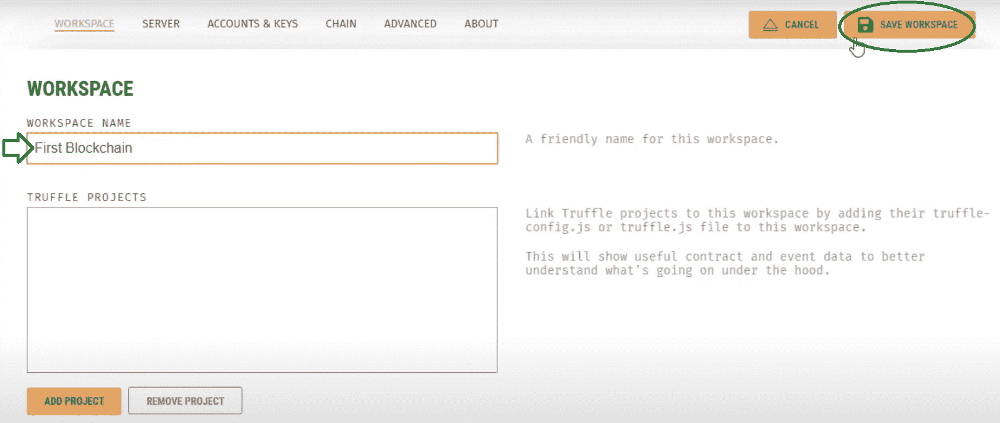

一旦你保存了你的工作空间，你将得到一个有多个 ETH 地址的“沙盒”环境，每个地址都有足够的资金。我们将使用其中一个地址来测试我们的 dApp。再者，每个地址旁边还有一个钥匙图标；通过单击它，我们可以访问该帐户的私钥:

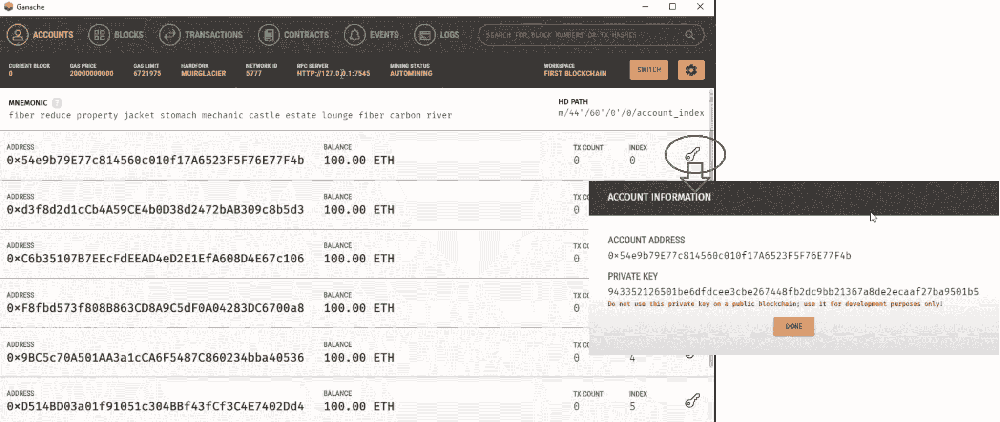

#### 将我们的测试网络导入 MetaMask

接下来我们要做的是让我们的游戏账户与 MetaMask 连接，这也是你应该准备的四个基本工具之一。因此，使用元掩码浏览器扩展并登录。

在将帐户导入元掩码之前，我们需要将其连接到本地区块链。因此，为了学习如何在以太坊上构建 dApps，我们将把它连接到一个定制的 RPC。为此，您需要单击顶部的“网络”选项卡，这将显示一个下拉菜单。然后选择“自定义 RPC”选项，如下所示。

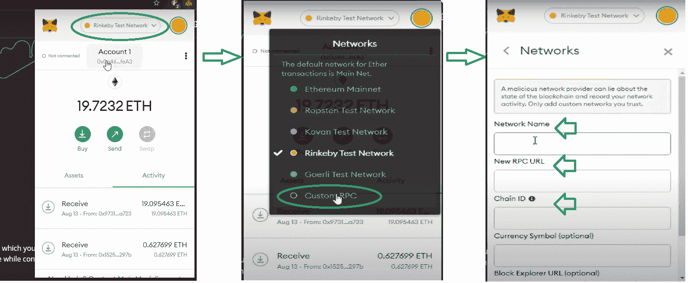

接下来，我们必须输入三条信息:网络名称、新的 RPC URL 和链 ID。第一个可以是你想要的任何东西(我们将其命名为“第一个 Ganache”)，你可以从你的 Ganache 工作区(RPC 服务器)复制 RPC URL，你可以输入“1337”作为链 ID。将其余部分留空，然后单击保存。

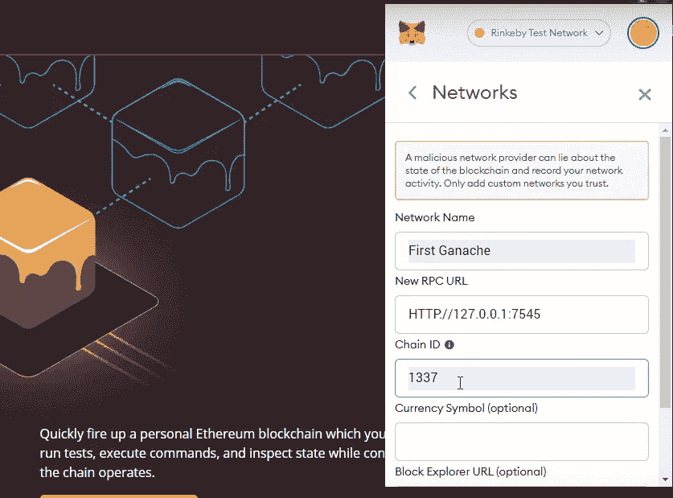

由于导入的网络是空的，我们现在必须添加一个由我们的 Ganache 工作区提供的游戏帐户。您可以通过单击元掩码右上角的图标，然后从下拉菜单中选择“导入帐户”选项来完成此操作:

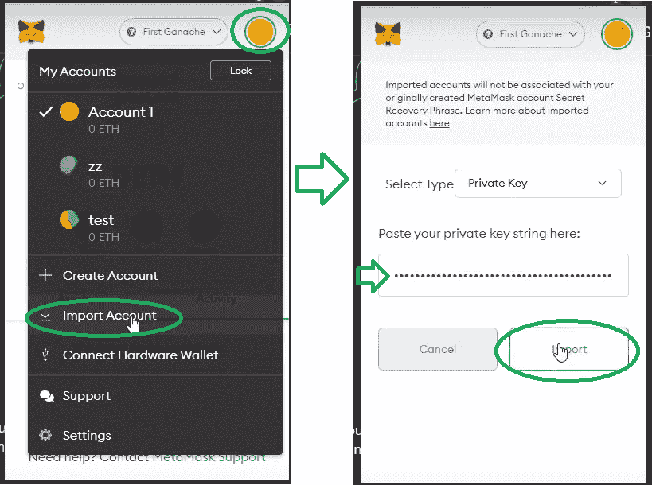

为了让事情更清楚，我们还建议您重命名我们刚刚导入的帐户。为此，单击元蒙版右上角的三个垂直点，这将显示一个下拉菜单，如下图所示。然后选择“账户详情”选项。接下来，单击铅笔图标并键入您想要的名称(我们选择了“Ganache #1”)。要完成重命名过程，请单击勾号，然后单击叉号。

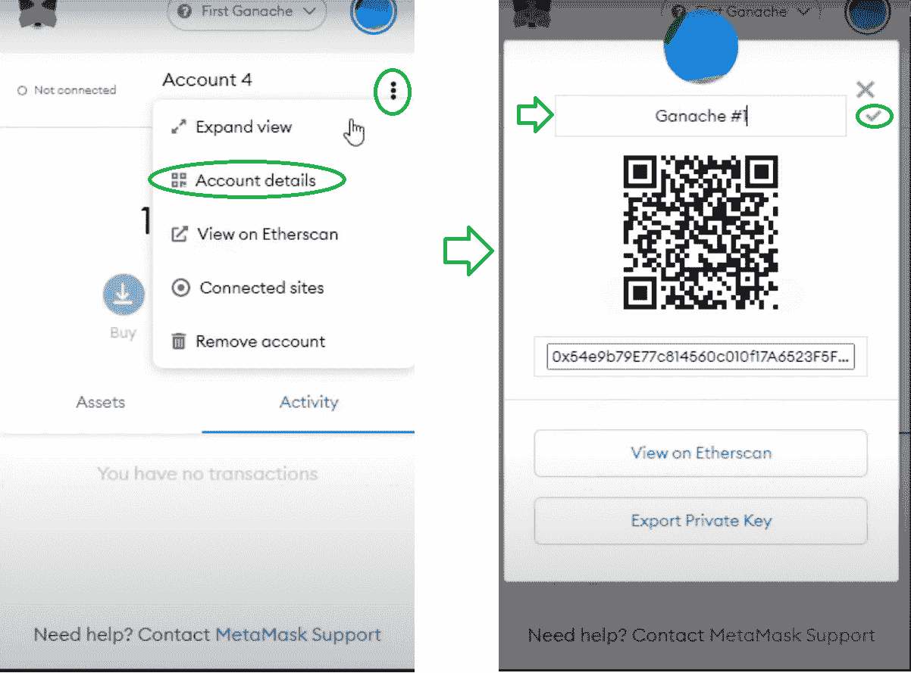

同样，由于我们的目标是学习如何在以太坊上构建 dApps，我们也希望能够测试不同账户之间的一些交易。因此，确保对 Ganache 工作区提供的另一个测试帐户重复上述“帐户导入”步骤。我们把它命名为“加纳切 2 号”。

#### 发送测试交易记录

现在我们已经将两个帐户导入到元掩码中，我们准备在这两个帐户之间发送一些测试事务。例如，我们可以将一些 ETH 从 Ganache #2 发送到 Ganache #1。以下是完成测试交易必须采取的具体步骤:

1.  **复制 Ganache #1 的地址**–只需点击名称。
2.  **切换到 Ganache #2**–点击右上角的图标，然后点击“Ganache # 2”。
3.  **发起发送**–点击“发送”按钮。
4.  **输入“发送”详细信息**–在顶部粘贴 Ganache #1 的地址，然后输入您要发送的金额(我们开始时使用 100 个 ETH 中的 12.78 个 ETH)并单击下一步。
5.  **确认交易**–点击“确认”按钮。

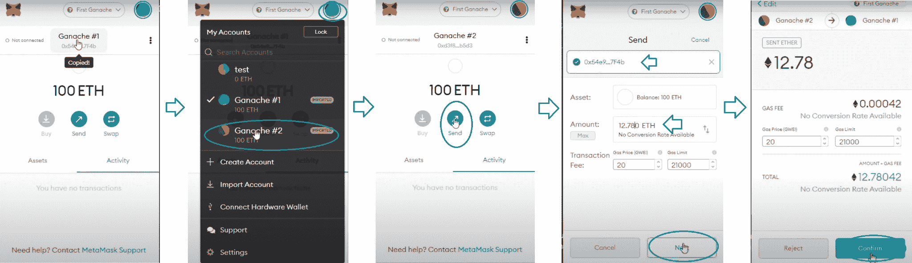

为了确保你的交易顺利进行，请检查两个账户的余额。如果你用和我们一样的数量，现在加纳切#1 应该有 112.78 ETH，加纳切#2 应该有 87.22 ETH。您可以在元蒙版和 Ganache 工作空间中看到后者。此外，您还可以尝试使用上面的步骤，从 MetaMask 中导入的两个帐户之一向 Ganache 工作区中的任何其他帐户发送一些 ETH(只需相应地替换地址)。同样，您的 Ganache 工作区应该通过显示更新的余额和指示交易计数(“TX 计数”)来反映所有交易。

### 如何在以太坊上构建 dApps 使用测试网

当我们将本地区块链导入 MetaMask 时，您可能注意到提供了几个公共测试网。这些试验网是 Ropsten、Kovan、Rinkeby 和 Goerly。在这一节中，我们将重点介绍 Ropsten Testnet。

当学习如何在以太坊上构建 dApps 时，可能经常会花费大量的测试 ETH。因此，我们想向您展示如何免费向您的 testnet 钱包添加大量资金。有几个所谓的“水龙头”你可以用。两个实实在在的例子是[罗普斯滕以太坊龙头](https://faucet.ropsten.be/)和[罗普斯滕以太坊(rETH)龙头](https://faucet.dimensions.network/)。第一个应该每 10 秒钟丢弃 0.3 个 ETH，而第二个每请求发送 5 个 ETH。它们都是通过简单地在指定的字段中粘贴你的测试帐户地址来工作的(记得切换到你的元掩码中的“Ropsten 测试网络”[见下图])。此外，请记住，Ropsten Testnet 上的事务需要被挖掘，因此与使用本地网络相比，它们需要花费稍长的时间。

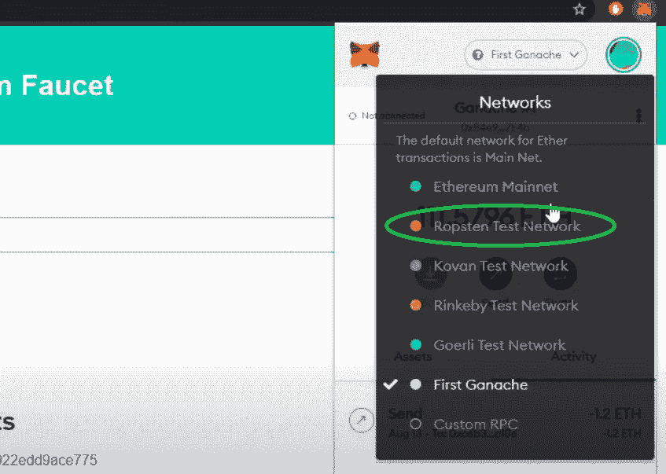

如果你决定使用其他测试网，确保使用你最喜欢的搜索引擎找到免费的 ETH 水龙头，为你在这些测试网上的账户提供资金。

# 如何在以太坊上构建 dApps 一个示例项目

在本文的这一部分，您将能够按照提供的步骤，自己在以太坊上构建一个简单的 dApp。我们认为最好的学习方法是建立一个范例项目。因此，我们将在这里编写一些 HTML、CSS 和 JavaScript 代码。

本质上，我们将构建一个基本的 Web3 站点(最终的仪表板显示在下图中)，使用户能够首先登录并使用 MetaMask 验证自己。一旦登录，用户将能够检查他们帐户上的交易、硬币/代币余额和 NFT。如果你是一个完全的初学者，这可能听起来相当复杂；然而，多亏了 Moralis，这一过程将变得轻而易举。那么，你准备好卷起袖子开始这项有趣的任务了吗？我们开始吧。

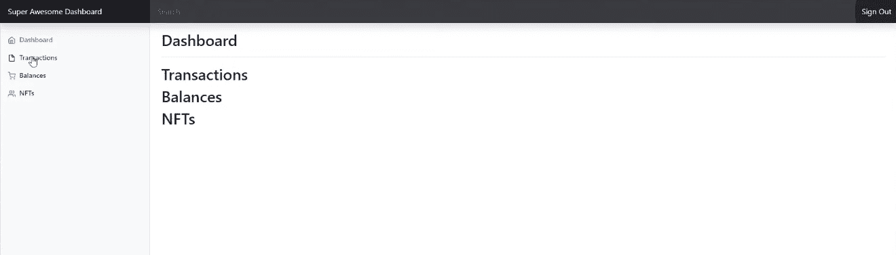

## 如何在以太坊上构建 dApps 构建登录页面

我们将使用另一个名为“ [Bootstrap](https://getbootstrap.com/docs/5.1/examples/) ”的工具，在这里我们将获得项目前端所需组件的代码。一旦上了网站，下载例子和源代码。然后通过将“仪表板”和“登录”文件夹导入到我们的 Visual Studio 代码项目的文件夹中来使用它们。这些模板文件将作为一个很好的起点。如果您对 Visual Studio 代码没有经验，请确保遵循本文末尾“摘要”部分之前的视频中的说明，从 27:18 开始。

#### 使用 JavaScript 添加功能

一旦您对“index.html”文件进行了适当的更改，就该为我们的登录页面添加功能了。我们首先在 Visual Studio 代码中创建“main.js”文件，然后使用以下代码将该文件与“index.html”连接起来:

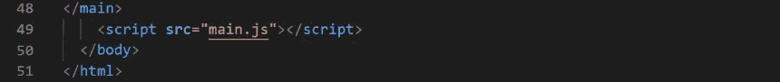

#### 连接 Moralis 服务器

现在，您应该已经创建了您的 Moralis 帐户。首先登录并访问“服务器”选项卡。然后单击“+创建新服务器”按钮，然后从下拉菜单中选择“Mainnet 服务器”选项。

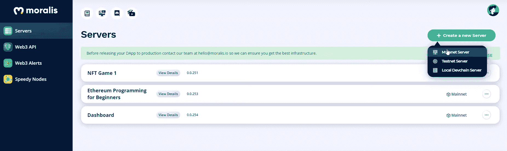

通过命名您的服务器、选择您的区域、mainnet 和所有链来完成这些步骤。最后，单击“添加实例”按钮。

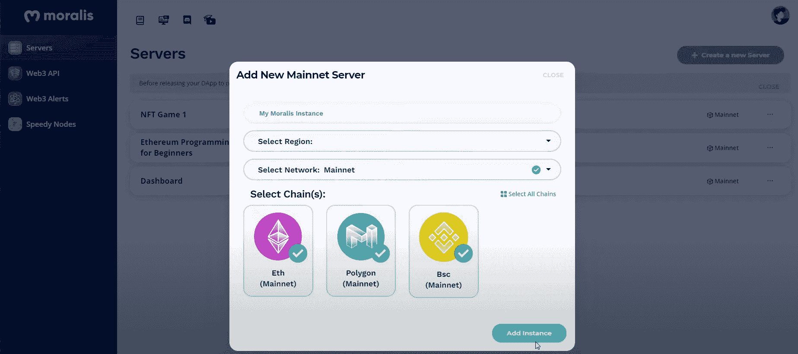

创建服务器后，您可以通过单击服务器名称旁边的“查看详细信息”按钮来获取其详细信息。在这里，您可以看到服务器详细信息的示例:

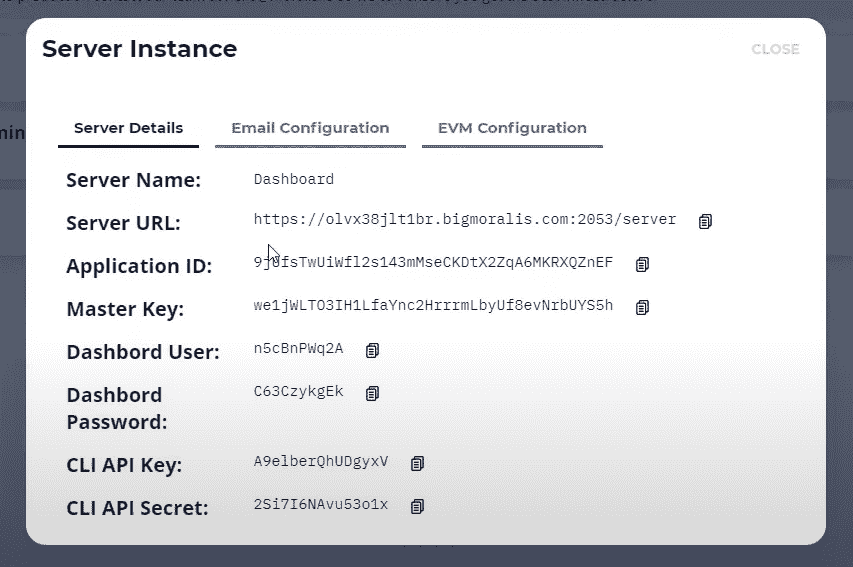

我们将在“main.js”文件中使用服务器 URL 和应用程序 ID:

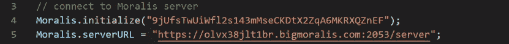

#### 如何构建 dApps–完成登录页面

Moralis 还附带了清晰、详细且高度实用的[文档](https://docs.moralis.io/)，这使得使用这个终极 Web3 开发平台变得很容易。这是你可以复制所有单行代码的地方，这将极大地加速这个过程。下面是我们用来在 HTML 页面(我们的登录页面:“index.html”)中包含 Moralis 的代码:

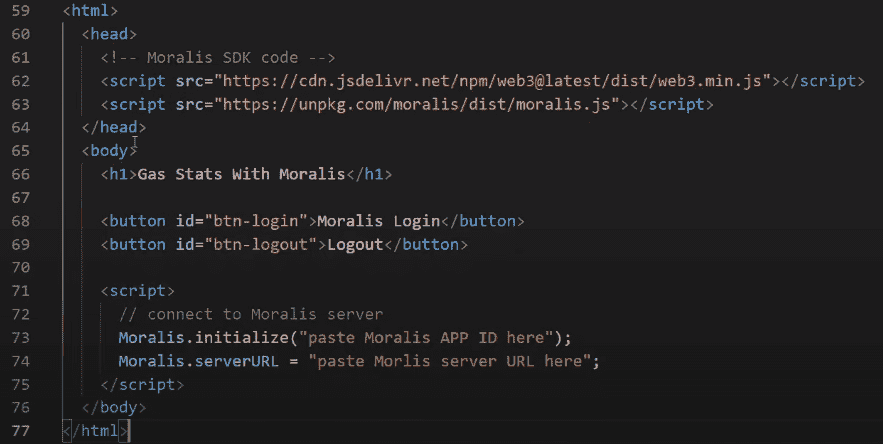

请随意安排代码以最适合您的编码风格，或者按照下面视频中的步骤，从 36:10 开始。

在应用了必要的更改之后，对于 dApp 的登录部分，我们的 HTML 代码的"

<main>"部分看起来将是这样的:</main>

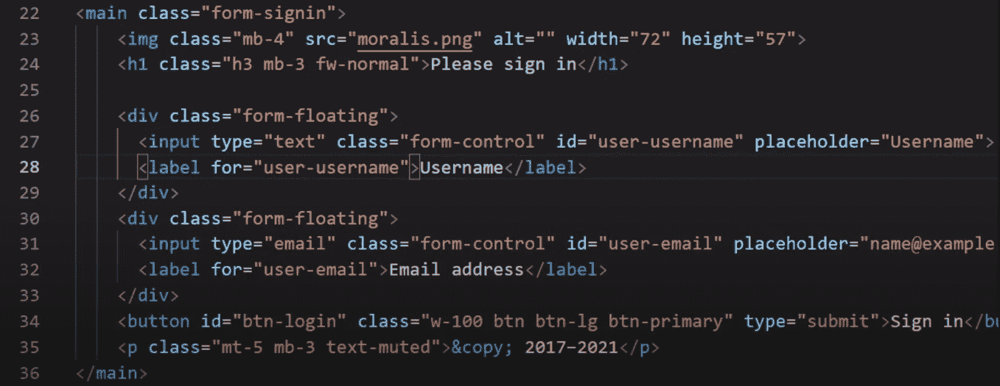

此外，我们 dApp 的其余(大部分)功能将建立在“main.js”文件中。例如，当点击按钮时，我们将在 dApp 的登录页面上使用下面的代码来验证和收集用户的详细信息，包括他们的 ETH 地址。这段代码将完成所有这些工作，并将用户移至我们 dApp 的第二页:

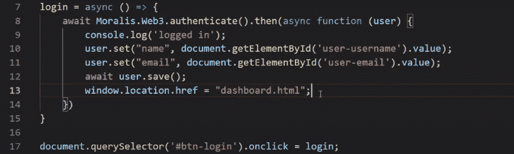

此外，上述代码还会将用户添加到我们的 Moralis 仪表板:

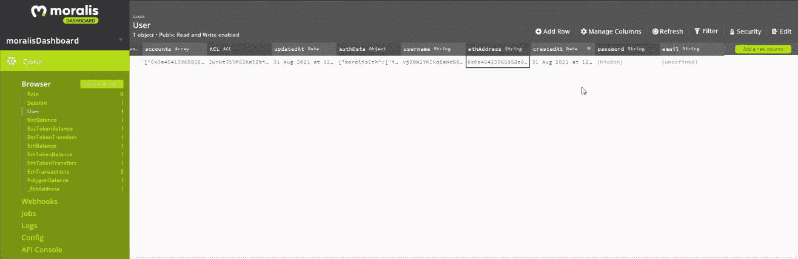

## 如何在以太坊上构建 dApps 构建仪表板

我们现在已经设置了基础，相应地调整了模板代码，为我们的 dApp 创建了一个正常运行的登录页面。现在，让我们专注于构建我们的仪表板(“dashboard.html”文件)。首先，我们需要对从 Bootstrap 获得的初始文件进行一些调整。为了跟随我们的一位专业开发人员执行代码清理，请使用下面的视频，从 51:06 开始。

完成清理后，您可以开始向仪表板添加一些功能。例如，让我们通过使用以下代码更新“main.js”文件来使“退出”按钮工作:

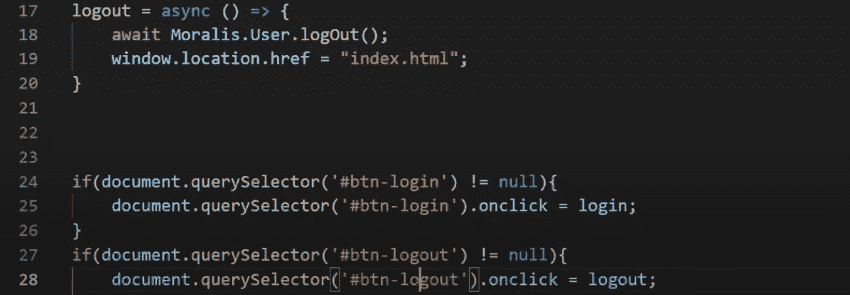

查看上面的代码，您可以看到 Moralis 通过使用简短的代码再次帮助了我们。此外，我们希望确保只有登录的用户才能访问仪表板，而那些未登录的用户将被重定向到登录页面。我们用下面的代码实现了后者:

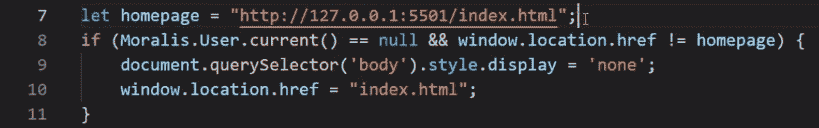

### 如何在以太坊上构建 dApps 获取交易、令牌余额和 NFTs

最后，我们到了这篇“如何在以太坊上构建 dApps”的文章，在这里你将看到为什么 Moralis 是最终的 Web3 开发平台。 [Moralis 的 Web3 API](https://moralis.io/exploring-moralis-sdk-the-ultimate-web3-sdk/) 将使我们实现示例仪表板的功能变得简单——获取令牌余额、获取交易历史和显示 NFT。本质上，我们将从区块链获取信息，并在 dApp 中显示它。

此外，如前所述，我们将再次通过“main.js”文件设置仪表板的大部分功能。 [Moralis 的文档](https://docs.moralis.io/moralis-server/web3-sdk)提供的三个强大的代码片段是“getTransactions”、“getBalances”和“getNFTs”。请记住，这些代码片段需要进行调整，以匹配您的特定项目。此外，必须添加特定的 JavaScript 代码来实现我们的目标。

#### 获取交易

谈到获得交易， [Moralis 提供了两种选择](https://docs.moralis.io/moralis-server/web3-sdk/account)。如果我们对以太坊主网上的交易感兴趣，第一种方法(最简单的方法)适用。然而，当我们想考虑其他链时(这也适用于测试网)，我们需要使用下面的代码:

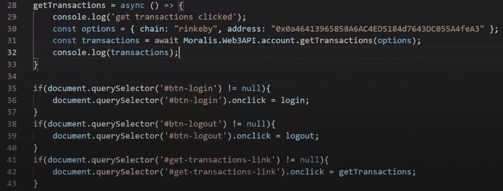

上面显示的“getTransactions”函数已经更新，以匹配我们的地址和 Rinkeby Testnet。上面的几行代码处理了后端的所有繁重工作，如果不使用 Moralis，这些工作将需要数百行代码。很棒，对吧？

为了进一步完善我们的示例 dApp 显示事务的方式，需要一些 JavaScript 代码。具体可以参考下面的视频，从 1:08:35 开始。

#### 获取代币余额

正如交易一样，为了获得代币余额，Moralis 也提供了两种选择。第一个是原生平衡，第二个是其他链。对于我们的示例 dApp，我们使用第二个:

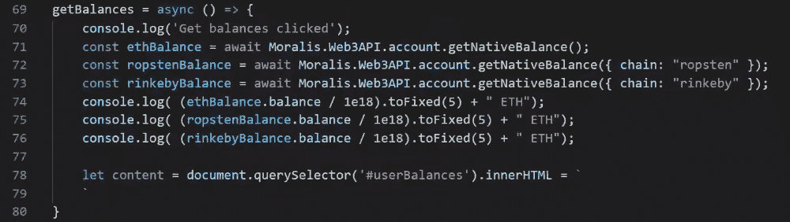

同样，您需要记住，我们已经对 Moralis 文档中的模板代码进行了一些调整，以获得上面的代码行。这样，代码符合我们的示例项目的需求。例如，它显示以太坊主网、Ropsten Testnet 以及 Rinkeby Testnet 上的令牌余额。当然，为了正确显示令牌余额，您需要向“main.js”文件添加某些 JavaScript 代码(参见下面的视频，从 1:48:00 开始)。

#### 获取 NFTs

我们示例项目的这一部分将寻找用户钱包中的 NFT 余额并显示出来。正如前两个功能一样，我们让 Moralis 的 Web3 API 为我们服务。同样，就像以前一样，使用“getNFTs”函数可以使事情变得简单易行。此外，“getNFTs”也有两个选项。我们用的是让我们选择链条的那个。以下是我们的示例 dApp 的代码:

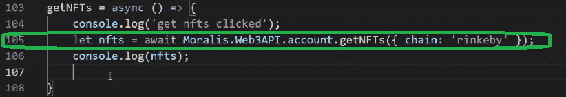

我们已经标记了实际完成所有后端工作的行。是的，这是一行代码。

此外，我们强烈建议您完成正确显示 NFTs 所需的所有编码步骤(从 1:59:00 开始，按照视频中的说明进行操作)。

**这是我们在整篇文章中引用并提供时间戳的视频:**

https://www.youtube.com/embed/jdx2H1alijQ

## 如何在以太坊上构建 dApps 总结

既然您已经看到创建一个相对有用的 dApp 只需要很少的后端编码，那么您肯定希望将您的以太坊发展到下一个阶段。此外，在整篇文章中，我们为您提供了开始成为一名成功的 dApp 开发人员所需的所有信息。现在，您已经了解了使以太坊编程变得更加简单的所有基本工具。由于以太坊开发的后端部分往往是最耗时和最困难的部分，因此了解 Moralis 将为您的 Web3 开发之路增加相当惊人的价值。

此外，您一定已经注意到，如果您想充分利用 Moralis，了解 JavaScript (JS)是必不可少的。所以，如果你还不知道这种实用的编码语言，我们建议你报名参加“[区块链开发者 JavaScript 编程](https://academy.ivanontech.com/courses/javascript-programming-for-blockchain-developers)课程。通过这种方式，您将学习 JavaScript 并准备好在区块链开发中最好地使用它。