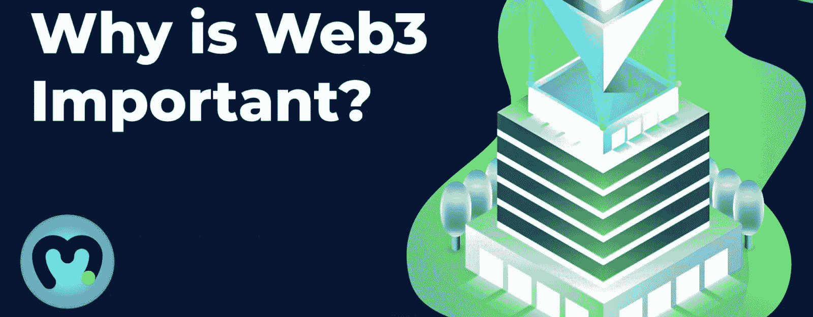
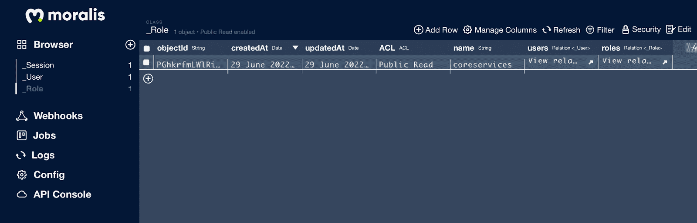
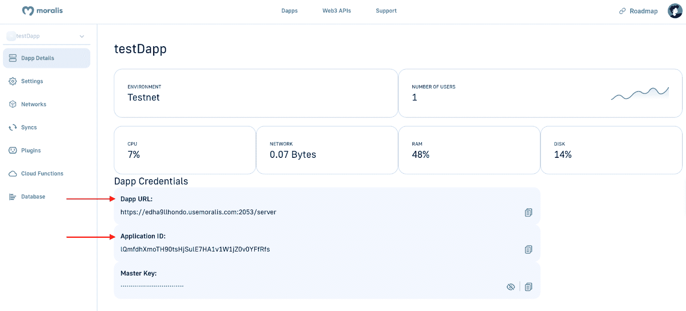
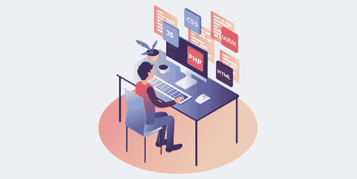

# 如何在几分钟内构建 Web3

> 原文：<https://moralis.io/how-to-build-on-web3-in-minutes/>

**随着** [**Web3**](https://moralis.io/the-ultimate-guide-to-web3-what-is-web3/) **的出现，它迅速成为最令人兴奋的发展领域之一。投资涌入去中心化的网络，新的有趣的项目不断涌现，扩大了这个不断增长的** [**dapps**](https://moralis.io/decentralized-applications-explained-what-are-dapps/) **生态系统。在这个体系内，我们发现从**[**DeFi**](https://moralis.io/what-is-defi-the-full-decentralized-finance-guide/)**平台到**[](https://moralis.io/what-is-the-metaverse-full-guide/)****游戏的各种创新项目。然而，即使您可能听说过 Web3 并了解这个领域的基本原理，您可能仍然不熟悉 Web3 开发的复杂性。出于这个原因，我们将在本文中更多地探讨如何在 Web3 上进行构建！****

**我们将从解释为什么有人想在 Web3 上构建 dapps 开始这个指南。此外，我们还将探索去中心化网络的好处，以及它与 Web2 的不同之处。接下来，我们将看看如何在 Web3 上构建，我们将花时间探索一下 [Moralis](https://moralis.io/) 操作系统。最后，我们将通过发现[成为区块链开发者](https://moralis.io/how-to-become-a-blockchain-developer/)的必要技能来结束一切！**

**在 Web3 上构建最容易的方法是通过 Moralis。Moralis 是区块链开发的主要操作系统，作为用户，你可以在所有 Web3 项目上平均节省 87%。效率的提高部分归功于平台的底层后端基础设施和优秀的开发工具。例如，在这些功能中，你会发现 Moralis 的 [Web3 API](https://docs.moralis.io/moralis-dapp/web3-api) ，它允许你构建高级 dapps，如 [Web3 Spotify](https://moralis.io/how-to-build-a-web3-spotify-clone/) 或 [Web3 Twitter](https://moralis.io/how-to-build-a-web3-twitter-clone/) 克隆。**

**所以，如果你有在 Web3 上发展的野心，考虑和 Moralis 签约。创建一个帐户是完全免费的，你可以立即开始开发兼容 Web3 的项目！**

## **为什么要在 Web3 上构建？**

**Web3 已经迅速成为最有趣的发展空间之一。随着熟练开发者的涌入，这个充满活力的行业继续以惊人的速度发展。Web3 的这种当代状态为新来者和初创公司提供了在指数级增长的市场中获得可观市场份额的巨大机会。因此，现在是建立在 Web3 基础上，为互联网的下一阶段做出贡献的大好时机。**

**

然而，从传统的角度来看，新的参与者进入市场的门槛很高。一般来说，后端开发是最大的障碍。此外，这也是我们可以确定 Web2 和 Web3 开发之间最显著的差异的地方。因此，这增加了对 [IaaS](https://moralis.io/iaas-explained-what-is-infrastructure-as-a-service/) (基础设施即服务)平台的需求，如 Moralis，以提供完整的 Web3 工作流。

Moralis 通过提供更容易理解的开发者体验，解决了与区块链开发相关的传统问题。因此，开发人员可以将更多时间分配给 [Web3 前端](https://moralis.io/web3-frontend-everything-you-need-to-learn-about-building-dapp-frontends/)和智能合约开发。此外，通过关注开发的用户方面，有可能构建更多用户友好的 dapp，并且[为所有区块链项目创建一个伟大的 dapp UI](https://moralis.io/web3-ui-how-to-create-a-great-dapp-ui/) (用户界面)，使该行业更适合大规模采用。此外，如果你对 UI 设计感兴趣，可以看看 Moralis 的 [web3uikit](https://moralis.io/web3ui-kit-the-ultimate-web3-user-interface-kit/) 。

既然我们已经在一定程度上探索了是什么让 Web3 成为一个令人兴奋的行业，我们将继续深入研究如何在 Web3 上进行构建！

## 如何在 Web3 上构建

Moralis 是在 Web3 上构建的最佳方式，因为该平台通过提供对完全托管的后端基础设施的访问，消除了 Web3 后端开发中最重要的问题。因此，避免从零开始创建基础设施的麻烦是可能的。


相反，例如，Moralis 的用户可以利用 Moralis 的 [Web3 SDK](https://moralis.io/exploring-moralis-sdk-the-ultimate-web3-sdk/) 来利用已经开发的代码片段。这使得[使用元掩码](https://moralis.io/how-to-authenticate-with-metamask/)进行认证、发送 [ERC-20](https://moralis.io/erc20-exploring-the-erc-20-token-standard/) 令牌、获取用户交易历史等成为可能。，只有单行代码。

此外，Moralis 还提供了一些业界最强大的开发工具和后端基础设施。突出的例子是[以太坊 NFT API](https://moralis.io/what-is-an-ethereum-nft-api-ethereum-nft-apis-explained/) 、[币安 NFT API](https://moralis.io/binance-nft-api-what-is-it-and-how-does-it-work/) 和[多边形 NFT API](https://moralis.io/what-is-a-polygon-nft-api-polygon-nft-apis-explained/) 。这些工具允许开发人员轻松创建跨链兼容的 dapps。此外，还可以更有效地[创建以太坊 dapp](https://moralis.io/how-to-create-an-ethereum-dapp-instantly/) 或[构建多边形 dapp](https://moralis.io/how-to-build-polygon-dapps-easily/)，从而提供更快的上市路径。因此，使用 Moralis 提供了巨大的竞争优势，让您有可能获得更大的市场份额！

由于 Web2 和 Web3 之间最显著的差异是在后端开发中发现的，Moralis 使传统的 Web2 开发人员更容易过渡到去中心化 Web。因此，Moralis 允许传统的 Web2 和 Web3 开发人员更快、更有效地创建 dapps。

那么，你到底如何在 Web3 上构建呢？在接下来的部分中，我们将进一步了解用 Moralis 建立一个新的 Web3 dapp 是多么容易！

### 基于 Web3 的构建——它是如何工作的？

如果你计划开发 dapps，我们强烈建议你注册 Moralis。作为 Web3 开发人员的首选操作系统，您将能够大大节省开发时间。此外，让我们仔细看看设置过程，以及如何在几分钟内创建一个 dapp。

一旦你手头有一个 Moralis 帐户，你可以导航到管理面板。在 Moralis 界面的顶部，你会发现三个选项卡，我们目前对“Dapps”感兴趣。如果您导航到此页面，您将看到“创建新 Dapp”按钮。点击此按钮后，您将启动第一个 dapp 的设置过程。


由于 Moralis 是跨链兼容的，您可以选择同时为多个区块链创建 dapps。最初，您需要选择一个环境并挑选您想要的网络。然后，你需要选择一个地区，输入一个名字，最后点击“创建你的 Dapp”按钮。这将旋转你自己的 Moralis dapp，你可以连接到你的项目。

有了 dapp，您可以访问各种信息和功能。例如，如果您点击“设置”按钮，您将被定向到 dapp 的仪表板。在那里，您可以更改设置，查找 dapp 凭证，并访问您的 dapp 数据库。起初，数据库将是空的；但是，如果您对用户进行身份验证，数据库将自动填充您可以在开发工作中使用的各种信息。



从这里开始，剩下的就是为你的项目开发代码，并把它连接到你的 Moralis dapp。为了在这个过程中帮助你，安装 Moralis SDK 也是有益的。在下一节中，我们将向您展示如何初始化 Moralis 和安装 SDK！

### 初始化 Moralis 并安装 Moralis SDK

首先，让我们看看如何通过初始化 Moralis 将您正在处理的代码连接到 dapp。为此，我们需要来自 dapp 本身的两条信息:dapp URL 和应用程序 ID。要找到这些信息，你需要回到 Moralis 管理面板，点击“设置”按钮。在那里，您可以在“Dapp 凭证”标题下找到 URL 和 ID。它应该是这样的:



一旦手头有了这些元素，就需要按照以下方式使用它们:

```js
const serverUrl = "https://xxxxx/server";
const appId = "YOUR_APP_ID";
Moralis.start({ serverUrl, appId });
```

初始化 Moralis 的时候就是这样。您的代码现在已连接到您的 dapp！所以，当代码执行时，它会用各种有价值的信息填充你的数据库。现在，让我们仔细看看如何安装 Moralis SDK！

安装 SDK 甚至比初始化 Moralis 更简单。您所需要的就是在您的项目中实现以下内容:

```js
<script src="https://cdn.jsdelivr.net/npm/[email protected]/dist/web3.min.js"></script>
<script src="https://unpkg.com/moralis/dist/moralis.js"></script>
```

如果你想了解更多关于初始化 Moralis 的信息，请查阅官方文档。这将提供如何创建您的第一个 dapp 的详细分解。此外，你很可能在那里找到所有问题的答案。

即使您手头有一个与您的项目相关的 dapp，您仍然需要使用您的编程技能来构建您的 dapp。因此，在最后一节中，我们将仔细看看 Web3 开发所需的必要技能！

## 基于 web 3–web 3 开发技能

Web2 和 Web3 开发之间最显著的区别通常是后端开发。然而，由于 Moralis 负责所有繁重的后端工作，我们将专注于前端和智能合同开发。所以，让我们先来仔细看看 Web2 和 Web3 前端开发之间的区别和相似之处！



当谈到这两个空间时，它们之间没有太多的区别。为此，我们将从探索这两个领域的相似之处开始。此外，像传统的 Web2 实践一样，Web3 前端 Web 开发人员需要掌握 JavaScript (JS)、HTML 和 CSS。下面，我们提供这些语言的简要概述:

*   JavaScript–[JavaScript](https://moralis.io/javascript-explained-what-is-javascript/)主要用于 web 开发，是最重要的前端开发语言之一。JS 具有更新 HTML 和 CSS 元素的潜力。这意味着 JS 在使 dapps 更具交互性方面至关重要。
*   **HTML**–HTML 是“超文本标记语言”的缩写，这种语言用于结构化网页的内容。因此，这是字段、按钮、标题等的代码。，都找到了。
*   CSS–[CSS](https://moralis.io/cascading-style-sheets-what-is-css/)代表“级联样式表”，开发者用它来设计网页和应用程序。

现在，我们已经对 Web2 和 Web3 之间的相似之处有了一个简要的概述，让我们更仔细地看看主要的不同之处。

这两个空间之间最显著的区别是 Web3.js 库的熟练程度。例如，这是一个 JS 库的集合，为开发人员提供了与远程或本地[以太坊](https://moralis.io/full-guide-what-is-ethereum/)节点进行交互的便利。因此，Web2 和 Web3 在前端开发方面最显著的区别就是对这个库的了解。

### 智能合同开发

尽管 Web3 前端开发与更传统的实践没有明显的不同，但我们需要探索的另一个领域是智能合约。那么，[什么是智能合约](https://moralis.io/smart-contracts-explained-what-are-smart-contracts/)？


智能合约本质上是在以太坊这样的区块链上运行的程序。它们通常由两部分组成:1)代码集合和 2)存在于链上特定地址的数据。智能合约是一种账户类型。这意味着他们可以持有资产和进行交易。然而，账户/合同不是由人来管理，而是由合同的代码来管理。

智能合同一般是用 [Solidity](https://moralis.io/solidity-explained-what-is-solidity/) 编写的——一种智能合同编程语言。Solidity 被认为是第一种面向合同的语言，它被用来编写与 T2 和 EVM 兼容的智能合同。此外，Solidity 受到 JS 和 C++的影响，这意味着如果你以前有使用这些语言的经验，你很可能会更快地掌握 Solidity。


所以，总结一下，Web2 和 Web3 开发最显著的区别就是 Web3.js 和智能合约开发。

如果你想进一步探索 Web3 开发的必要技能，我们强烈推荐你看看我们关于区块链开发的最佳语言的文章。此外，如果您想专注于智能合同开发，请查看我们的“[如何创建智能合同](https://moralis.io/how-to-create-smart-contracts/)”指南。通过这样做，您将能够探索智能合同开发的复杂性，这将提高您作为 Web3 开发人员的熟练程度！

本教程到此为止。现在，您应该很有希望理解如何在 Web3 上进行构建，并且可以立即开始您的 Web3 之旅！

## 如何在 Web3 基础上构建—总结

Web3 开发的最大障碍是——至少从传统的角度来看——后端开发，这是我们发现 Web3 和更传统的开发实践最大的不同之处。然而，这不再是一个问题，因为像 Moralis 这样的平台已经出现，可以处理繁重的后端提升。

这表明在 Web3 上构建的最好和最简单的方法是利用 Moralis。正因为如此，这就是为什么我们致力于用 Moralis 更深入地构建 Web3 项目，并且只需简单的点击几下就能创建一个 dapp！

然而，这仅仅涵盖了与 Moralis 合作的基础，还有很多东西需要学习。因此，请随意浏览 [Moralis 博客](https://moralis.io/blog/)获取最新、最相关的 Web3 开发内容。例如，如果你觉得元宇宙很有趣，你可以更深入地了解 Moralis 的[元宇宙 SDK](https://moralis.io/metaverse/) 。SDK 允许你创建复杂的项目，如[中世纪元宇宙游戏](https://moralis.io/how-to-build-a-medieval-metaverse-game/)，AR 元宇宙 NFT 神秘盒子，甚至[创建你自己的元宇宙](https://moralis.io/how-to-create-your-own-metaverse/)！另外，如果你对 NFT 的发展感兴趣，你应该[和 Moralis 家](https://admin.moralis.io/register)签约！


此外，如果你有磨练 Web3 开发技能的雄心，请查看[Moralis 学院](https://academy.moralis.io/)。该学院提供了大量的[区块链课程](https://academy.moralis.io/all-courses)，如“[初学者密码](https://academy.moralis.io/courses/crypto-for-beginners)或“[2022 年硕士 DeFi](https://academy.moralis.io/courses/master-defi)”。因此，报名参加 Moralis 学院，并进一步成为区块链认证！**