# 如何在游戏中购买 NFT 装备

> 原文：<https://moralis.io/how-to-buy-nft-outfits-in-game/>

给游戏中的角色配备独特的服装或服饰，可以让游戏玩家在虚拟世界中传达他们的身份。要做到这一点，玩家必须获得代币(游戏中的货币),以便以后在游戏中购买装备。但是传统游戏中的物品有多“独特”呢？嗯，不如区块链游戏中使用的现象级组件，即 NFTs。在游戏中购买 NFT 装备为区块链游戏体验开辟了一个新的深度。例如，这些 NFT 装备可以在游戏中购买，不仅供玩家拥有或出售，还可以在 NFT 市场交易。对于开发者来说，实现“在游戏中购买 NFT 装备”的功能是关键。多亏了 Moralis 的 Unity SDK，你可以很容易地实现所有类型的 Web3 特性，包括购买 NFT 服装组件！

就 Web3 游戏而言，事情通常始于 [Web3 认证](https://moralis.io/authentication/)。这就是 Moralis 的 Web3 Auth API 使得验证过程非常简单的地方。它使您能够在几分钟内建立一个高效的 Web3 登录方法。因此，用户可以使用任何他们喜欢的加密钱包来验证自己。此外，Moralis 完全是关于跨平台和跨链的互操作性。因此，它使您能够使用您最喜欢的遗留工具，并轻松地将 Web3 功能实现到众多应用程序中。因此，这些应用程序可以成为 dapps(分散应用程序)。此外，Moralis 使您能够专注于各种区块链，并扩展您的工作范围以适应未来。也就是说，我们邀请你到[创建你的免费 Moralis 账户](https://admin.moralis.io/register)，跟随我们的脚步。因此，您将学习如何创建自己的示例游戏实例，让玩家购买 NFT 服装。

## 购买 NFT 装备–我们的示例 Web3 游戏的演示

在我们继续之前，我们希望确保您对我们的示例项目有一个清晰的了解。因此，让我们来看一个让玩家购买 NFT 服装的 Web3 游戏演示。像大多数 dapps 一样，我们的游戏从 Web3 认证开始。在下面的屏幕上，玩家需要点击“连接”:

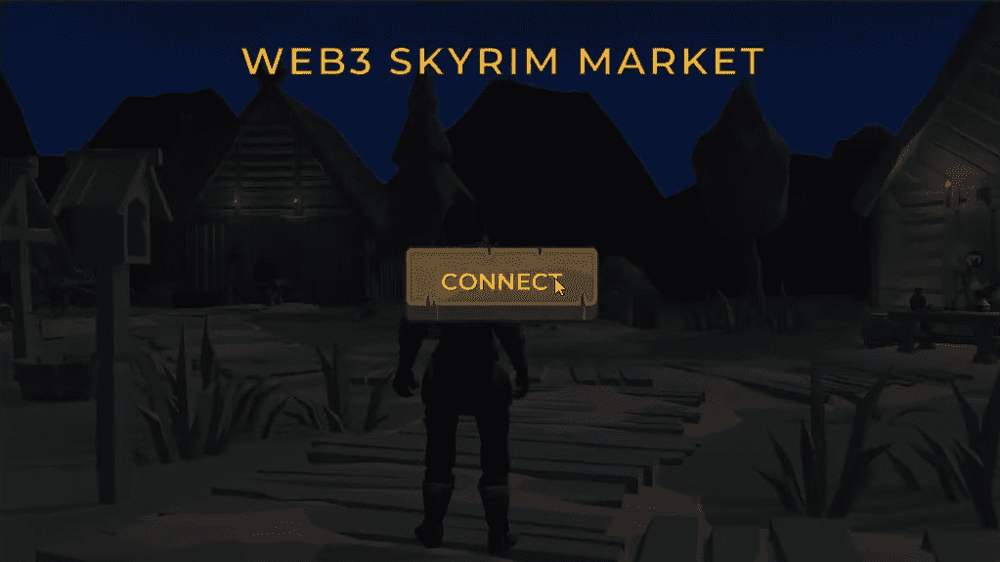

上面的截图还包括我们的示例游戏的名称:“Web3 Skyrim Market”。一旦玩家点击“连接”按钮，就会显示一个二维码。因此，他们需要使用他们最喜欢的移动加密钱包来扫描代码和验证自己:

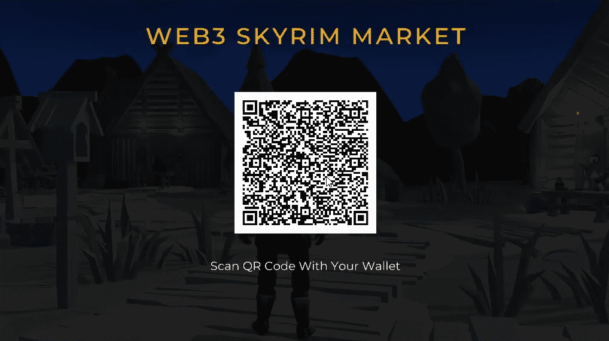

确认登录后，用户可以控制头像。此外，他们可以看到钱包地址的第一部分显示在角色的头部上方:

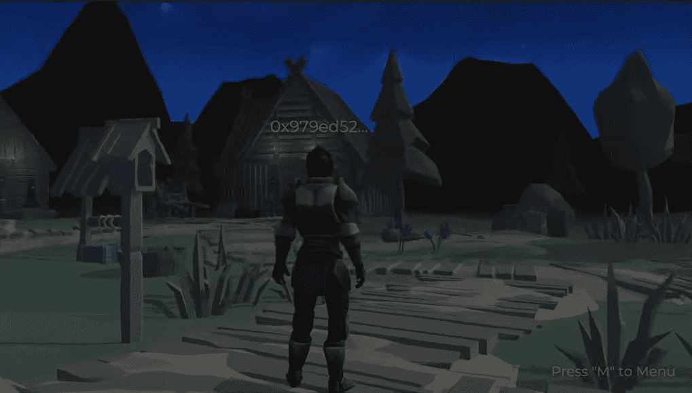

由于这是夜景，所以有点暗。当然，玩家可以自由探索场景。这样做，他们很快就能发现两个商店柜台。此外，一旦他们的化身进入这些计数器的碰撞器，他们就会看到更多的细节。对于我们的“交换”柜台，他们会看到以下屏幕:

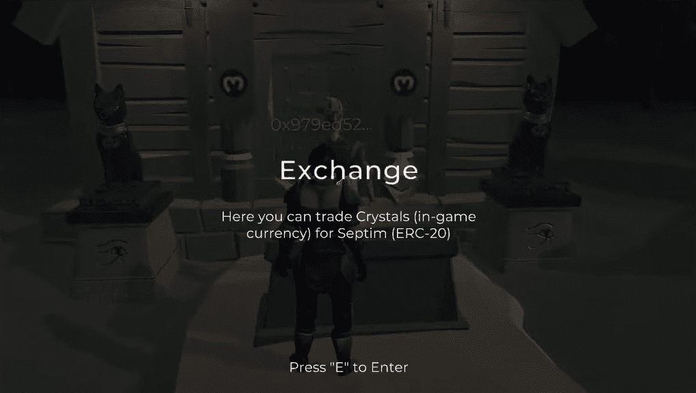

如你所见，游戏告诉玩家，他们可以使用兑换柜台将他们的游戏内货币(我们游戏中的货币称为“水晶”)兑换为“Septim”(取自 *Skyrim* 的硬币名称)。在我们的例子中，后者是一个 ERC-20 令牌，这意味着它是一个链上资产，因此，它背后有一个智能合约(稍后将详细介绍)。所以，让我们假设这个游戏的另一个场景使玩家能够通过完成某种任务来收集水晶。然后，有了足够数量的水晶，玩家就可以用它们来换取 Septim。因此，如果玩家想要兑换游戏中的货币，他们需要按“E ”,这将打开以下屏幕:

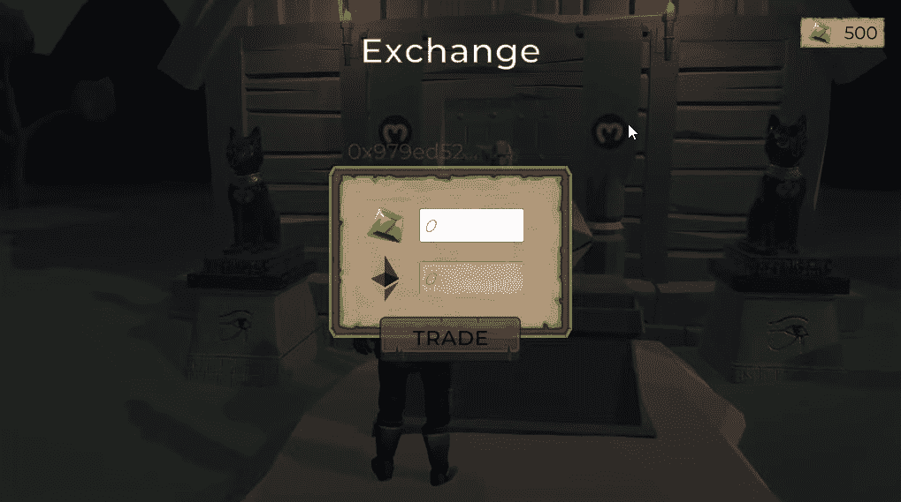

#### 将 Web2 货币兑换成 20 张 ERC 代币

看上面的截图，可以看到玩家可以在右上角看到自己的水晶平衡。而且，在屏幕的中央，他们可以输入想要兑换 Septim 的水晶数量。顺便说一句，一个塞普蒂姆值 50 个水晶:

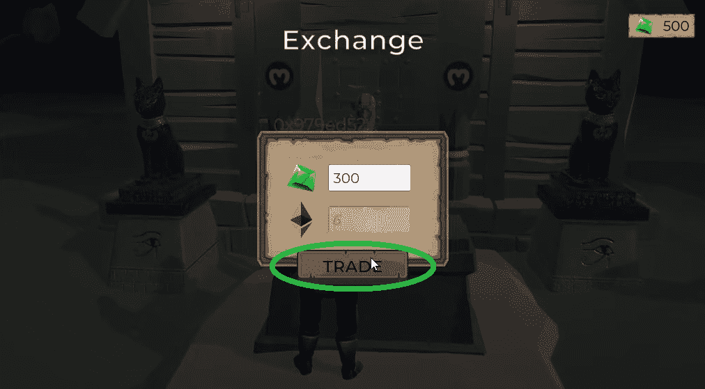

玩家点击“交易”按钮后，他们的加密钱包将提示他们确认“交换”交易:

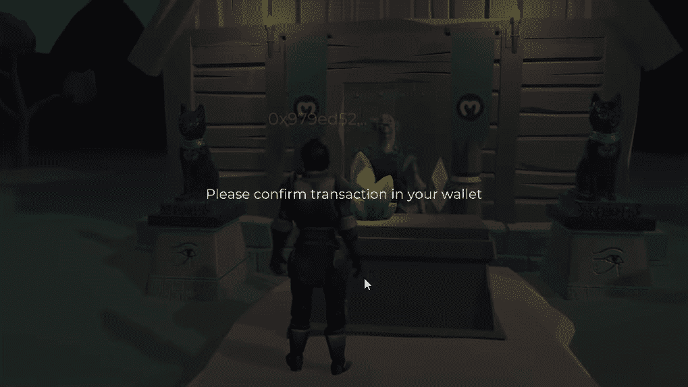

一旦他们确认了钱包中的交易，游戏就会通知他们交易成功:

玩家现在可以离开兑换柜台，按“M”进入菜单。在那里，他们将看到他们的水晶和 Septim 的更新平衡:

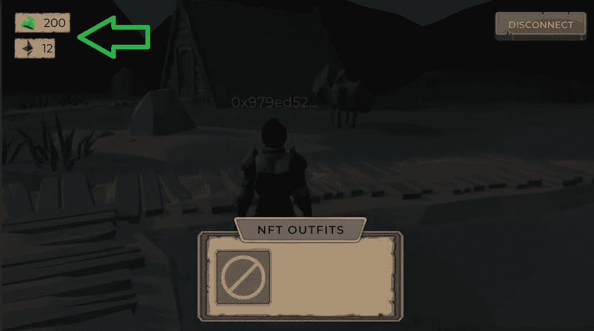

上面的链上交易调用了我们的智能合约，并向玩家的钱包地址铸造了六个 Septim 令牌。有了足够的塞普蒂姆余额，玩家可以使用商店购买 NFT 装备。

### 用 20 个 ERC 代币购买 NFT 服装

就像兑换柜台一样，玩家一旦进入装备店的对撞机，就可以看到以下信息:

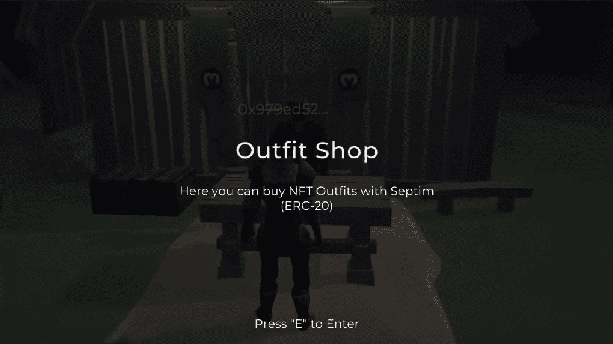

正如上面的消息所示，这是玩家可以用 Septim 购买 NFT 装备的地方。因此，一旦玩家按下键盘上的“E ”,玩家就可以进入装备商店:

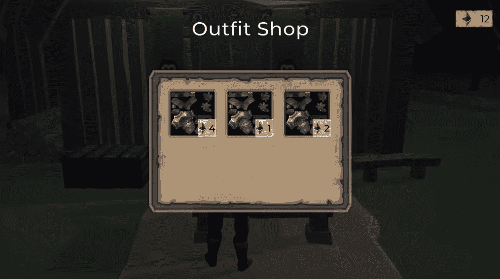

服装店展示了三套服装，包括它们在 Septim 的价格。玩家可以点击他们想要购买的装备，这再次触发玩家的 Web3 钱包:

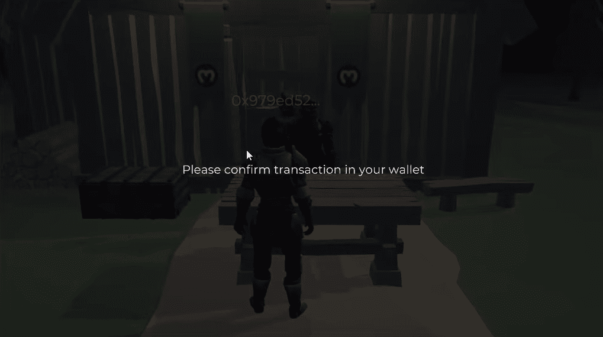

在确认交易后，玩家将 NFT 的装备放入他们的钱包。而且玩家的 Septim 余额会更新。这意味着“购买 NFT 服装”交易触发了我们双方的智能合约。我们的 ERC-721 智能合同负责将 NFT 队的装备放进球员的钱包里。我们的 ERC-20 合同确保了足够数量的塞普蒂姆代币被烧毁。

如果玩家现在离开装备商店并按下“M ”,他们会在“NFT 装备”面板中看到他们的新装备:

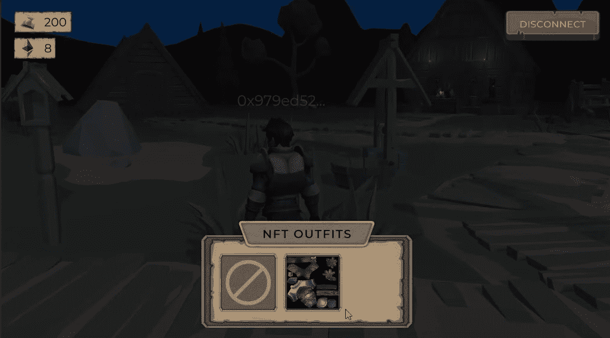

如果玩家想穿新的 NFT 装备，他只需要点击它。

这就是我们让玩家购买 NFT 装备的示例游戏的演示。正如你所看到的，这个特性有很多方面。然而，通过使用正确的工具，你可以毫不费力地实现这样的 ERC-20 令牌和 NFT 用例。

## 实现“在游戏中购买 NFT 装备”功能

你可以使用不同的游戏引擎来创建一个让玩家购买 NFT 装备的 Web3 游戏。然而，你必须使用 Unity 来创建你自己的上述游戏实例。此外，由于 Moralis 的 Unity SDK，您只需输入您的 Moralis 凭据，就可以覆盖所有类型的 Web3 功能。因此，我们将在下一节向您展示如何做到这一点！

除了团结和 Moralis，你还需要你的 PlayFab 账户。后者将使您能够轻松管理游戏中的资产。然而，上述功能的另一个重要部分是适当的智能合约。幸运的是，许多优秀的工具可供您使用，使您无需成为可靠性专家也能部署智能合同。在本教程中，您将学习如何使用 Hardhat 实现这一点。本质上，您只需要按照详细的分步指南来调整必要的默认文件。当然，您不需要自己创建智能合约。相反，你只需要复制我们的代码。所以，从克隆我们的代码或者下载在 [GitHub](https://github.com/MoralisWeb3/unity-web3-sample-skyrim-market) 上等待你的 ZIP 文件开始吧:

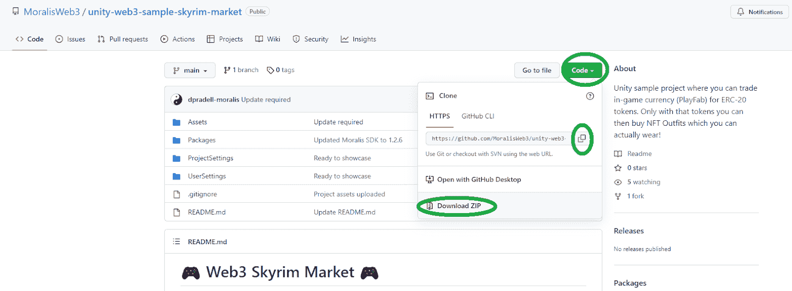

然后，在 Unity 中打开项目,“Moralis Web3 设置”窗口应该会自动打开:

这是您需要输入您的 Moralis dapp 凭证的地方。因此，这是处理初始 Moralis 设置的提示。

### 激活 Moralis 统一 SDK

要使用 Moralis 的 Unity SDK，您需要完成以下步骤:

1.  点击本文开头提到的“创建您的免费 Moralis 帐户”或访问 Moralis 的主页，然后点击“免费开始”:

2.  创建您的帐户后，您必须进入您的 Moralis 管理区。在这里，您需要通过点击“创建新的 dapp”按钮来创建新的 Dapp:

3.  上述按钮将启动 dapp 设置。首先，您需要选择您的环境。因为这是一个示例项目，所以选择“Testnet”选项:

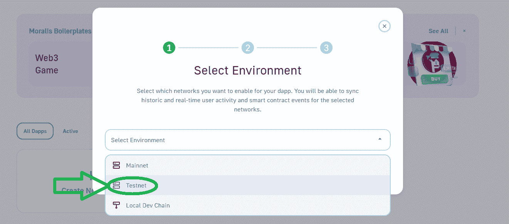

4.  然后，选择您想要关注的链。您可以选择多个链；然而，出于本教程的考虑，我们将把重点放在 Cronos 上。选择网络后，点击“继续”继续:

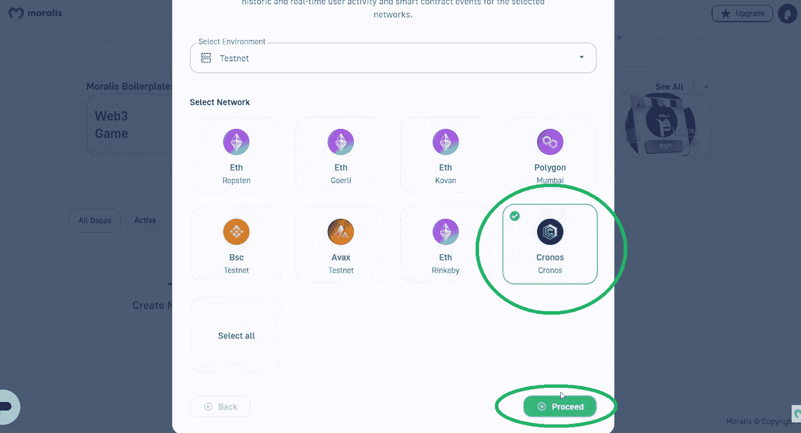

5.  接下来，选择您所在的地区。只需使用下拉菜单，选择离您实际位置最近的城市:

6.  在 dapp 设置的第三步，您需要命名您的 dapp。幸运的是，这可以是你想要的任何东西，所以不要想太多。你可以跟随我们的领导，使用“test-dapp”。然后，点击“创建您的 dapp”按钮启动您的 Dapp:

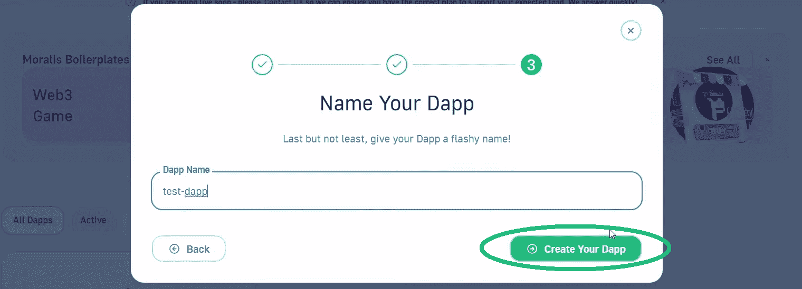

7.  你的 dapp 通常需要几秒钟才能启动并运行。然后，您可以通过“设置”按钮查看其凭据(URL 和 ID):

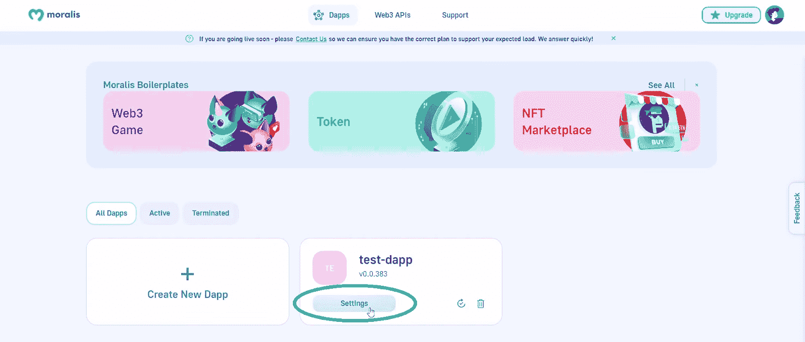

8.  要复制您的 dapp URL 和 ID，请使用“复制”图标:

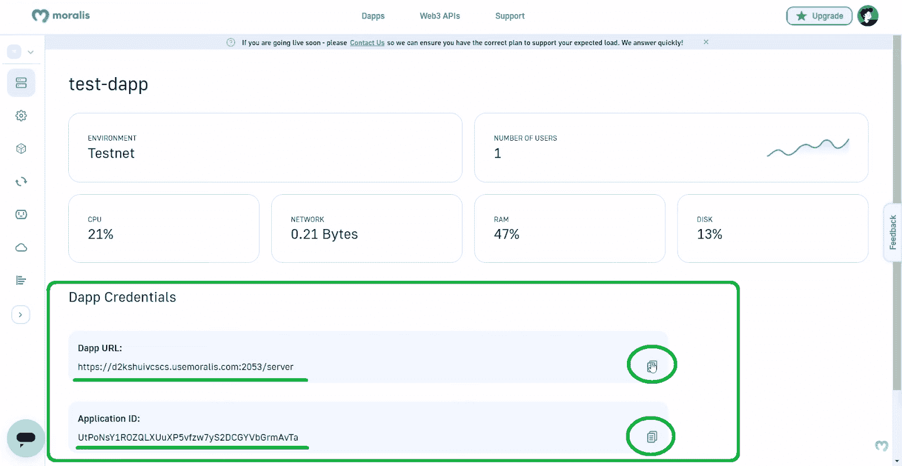

9.  最后，返回 Unity 并将上面复制的凭证粘贴到指定的输入字段中。准备好凭据后，单击“完成”完成设置:

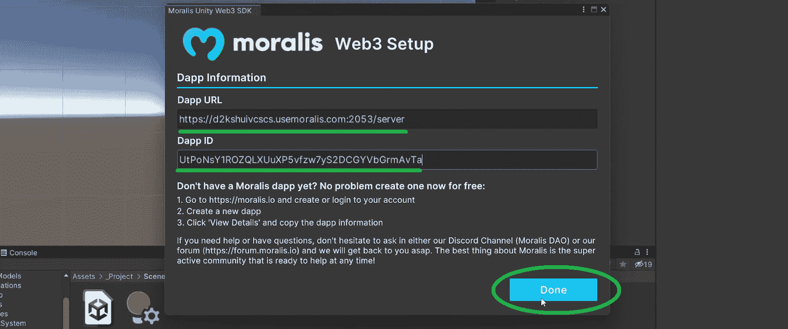

### PlayFab 设置

如上所述，我们将使用 PlayFab 来管理我们的游戏内资产，这是提供“购买 NFT 装备”选项的关键之一。因此，请访问 PlayFab 的主页，创建您的帐户或登录您现有的帐户:

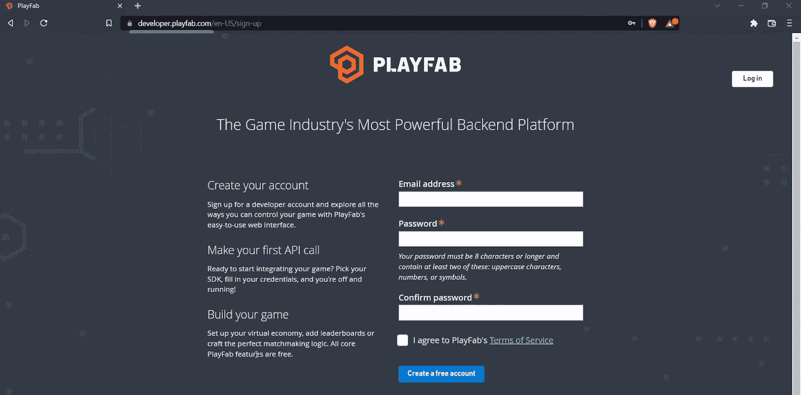

首先，创建一个新的工作室。你可以效仿我们，把它命名为“我的游戏工作室”:

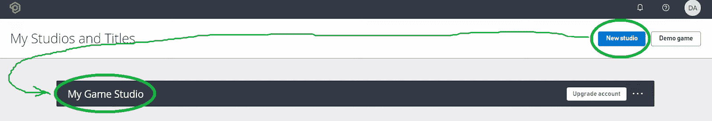

接下来，点击“我的游戏工作室”菜单中的三个点，选择“新标题”:

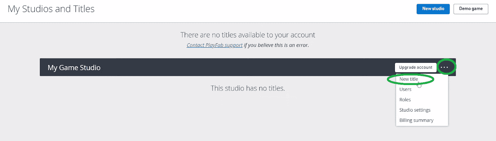

然后，输入名称并点击“创建标题”按钮:

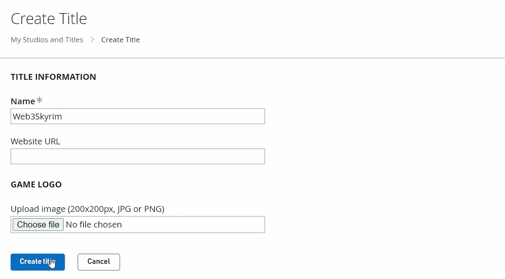

接下来，你需要回到 Unity，进入“窗口”>“Playfab”，打开“编辑器扩展”:

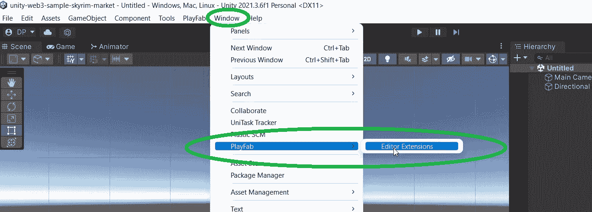

接下来，点击“登录”:

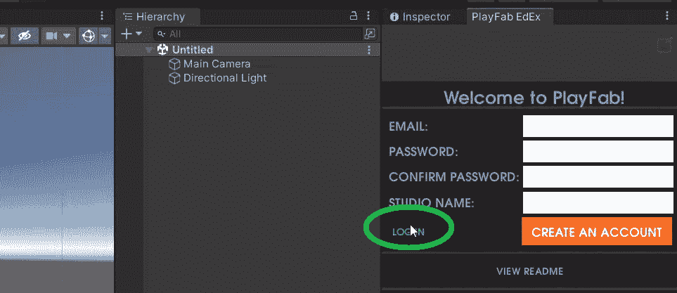

然后，输入您的 PlayFab 凭据:

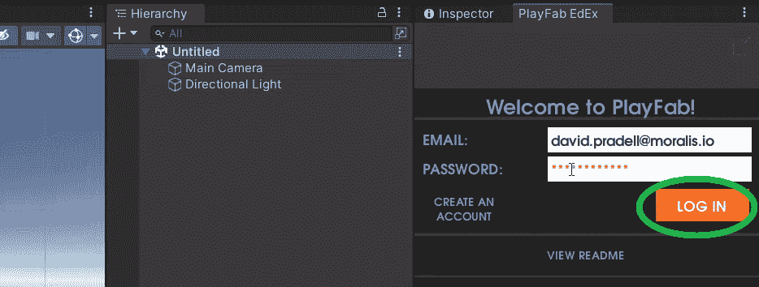

登录后，进入“设置”选项卡并选择您的工作室:

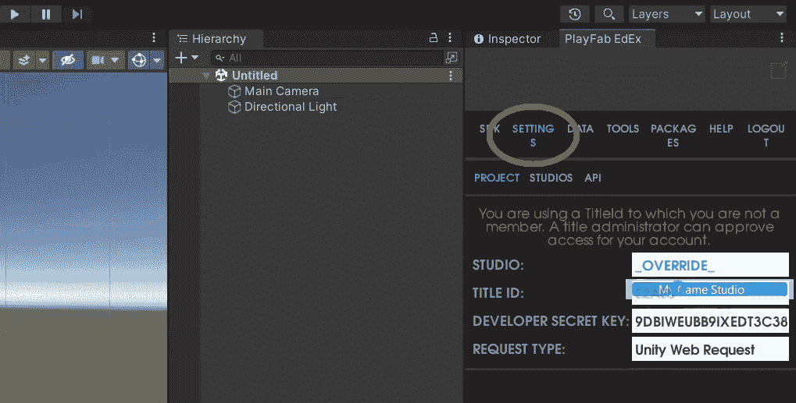

此外，确保标题 ID 与您在上面创建的相匹配。此外，请确保选择“请求类型”旁边的“Unity Web 请求”:

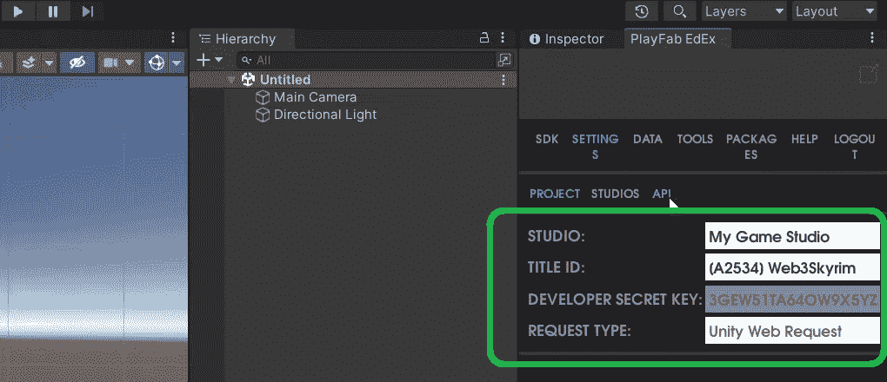

此外，单击“API”选项卡，确保您启用了以下所有 API:

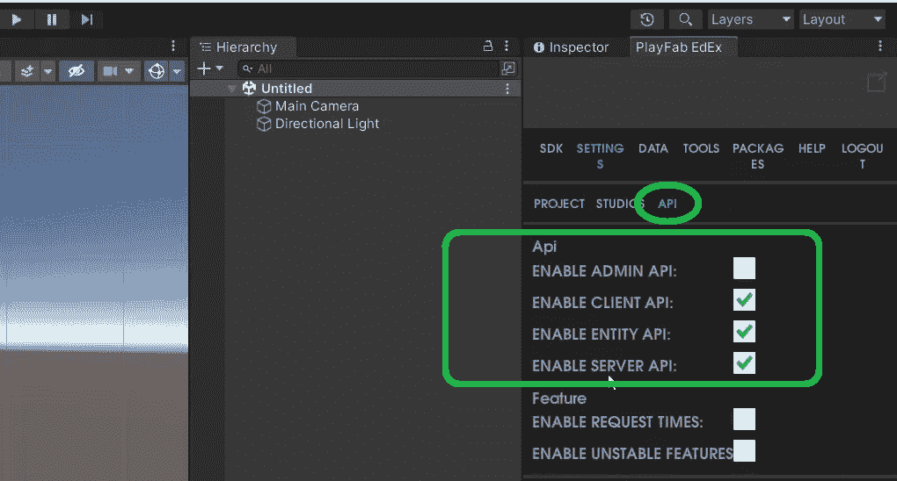

完成上述设置后，PlayFab 就可以获得所有用户的数据，包括他们的 Web3 钱包地址。要了解它是如何完成的，请观看本文底部的视频教程，从 8:53 开始。

## 购买 NFT 服装的精明合同

如前所述，在实现“购买 NFT 服装”功能时，智能合约是必不可少的。幸运的是，OpenZeppelin 等平台提供了我们可以使用的经过验证的智能合约。然而，对于这个例子，您可以使用我们的智能合约。此外，这也是你通过 Visual Studio 代码(VSC)学习使用 Hardhat 的地方。详细说明，请使用下面的视频，从 10:59 开始。在这里，您还将了解在 Unity 中您需要输入智能合同详细信息的位置:

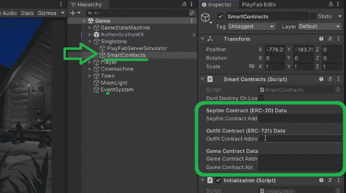

要有效地使用 Hardhat，请使用“Instructions.txt”文件。此外，请确保复制并删除正确的文件(15:14)。从 16:07 开始，您将看到智能合约的更多细节。在这里，您还将了解到，除了负责铸造游戏内代币的两个合同之外，您还将部署第三个合同。后者将确保您的游戏与其他两个契约正确通信。

在成功部署我们的智能合约后，您将仔细查看我们游戏背后的脚本(24:18)。我们的内部专家将向您展示如何在 PlayFab 仪表盘中完成必要的设置。所以，使用下面的视频来正确地实现“购买 NFT 服装”的功能！

https://www.youtube.com/watch?v=nxezdsQT1Mk

## 如何在游戏中购买 NFT 装备——总结

在这篇文章中，我们讨论了相当多的内容。毕竟，让玩家能够购买 NFT 的装备是一个相当先进的功能。然而，如果你跟随我们的领导，你会发现如何使用 Moralis 和 PlayFab 来毫不费力地做到这一点。最终，你必须完成以下五个阶段:

*   初始 Moralis(网络 3)和 PlayFab 设置(网络 2)
*   部署智能合同
*   实现“游戏内资产到 ERC20 代币”的兑换功能
*   建立 NFT 服装商店功能
*   将 NFT 服装应用到虚拟角色

如果你喜欢这个教程，我们鼓励你访问[Moralis YouTube 频道](https://www.youtube.com/c/MoralisWeb3)和[Moralis 博客](https://moralis.io/blog/)。在那里你可以找到很多其他的 [Unity Web3](https://moralis.io/unity-web3-beginners-guide-to-unity-web3-programming/) 示例项目。这些也是探索其他 Web3 开发方面的地方。本质上，你可以利用这两个途径免费成为 Web3 开发者！

然而，如果你想尽快得到一份加密工作，成为区块链认证会有很大帮助。因此，你可以考虑报名参加 Moralis 学院。除了顶级的区块链发展课程，这里也是获得个性化学习路径和专家指导的地方。这也是您可以加入行业中最先进的社区之一的地方！