# 如何申请游戏中的 NFT-完整指南

> 原文：<https://moralis.io/how-to-claim-an-in-game-nft-full-guide/>

**声称拥有一个游戏内资产的能力，比如一个**[**【NFT】**](https://moralis.io/non-fungible-tokens-explained-what-are-nfts/)**，是 Web3 gaming** **的众多** [**好处之一。然而，如果一个用户想在游戏中拥有一个 NFT，玩家必须有能力首先声明它。而且，如果 NFTs 在一个**](https://moralis.io/benefits-of-web3-gaming-full-breakdown/)[**web 3**](https://moralis.io/the-ultimate-guide-to-web3-what-is-web3/)**的游戏中能够解锁特殊关卡，充当******的加电，代表可用物品等。，用户会更想要求这种游戏内的非功能性游戏。因此，将“声明”功能集成到您的 dapps 中是非常必要的。虽然实现这个特性看起来有些棘手，但我们想向您保证，使用正确的工具可以轻松完成。让我们在“如何获得游戏中的 NFT”指南中看看我们如何做到这一点！****

**在本文中，我们将处理另一个 [Unity Web3](https://moralis.io/unity-web3-beginners-guide-to-unity-web3-programming/) 示例项目。您将了解如何使用 [Moralis 的元宇宙 SDK](https://moralis.io/metaverse/) 来满足您与区块链相关的后端需求。对于那些第一次加入我们的人，我们将从快速介绍[Moralis 观](https://moralis.io/)开始。因此，你将能够了解为什么这个“ [Firebase for crypto](https://moralis.io/firebase-for-crypto-the-best-blockchain-firebase-alternative/) ”操作系统是[最好的 Web3 后端平台](https://moralis.io/exploring-the-best-web3-backend-platform/)。随着我们的发展，我们将快速演示一下我们的示例 Web3 游戏，它具有“认领游戏中的 NFT”功能。该演示将帮助您决定是否要卷起袖子加入我们开发这个示例游戏。如果是这样的话，你将从连接 Unity 到 [Moralis SDK](https://moralis.io/exploring-moralis-sdk-the-ultimate-web3-sdk/) 开始。接下来，您将学习如何轻松实现 [Web3 登录](https://moralis.io/how-to-build-a-web3-login-in-5-steps/)。尽管如此，您将获得一个由 Moralis 专家提供的详细的代码演练。**

**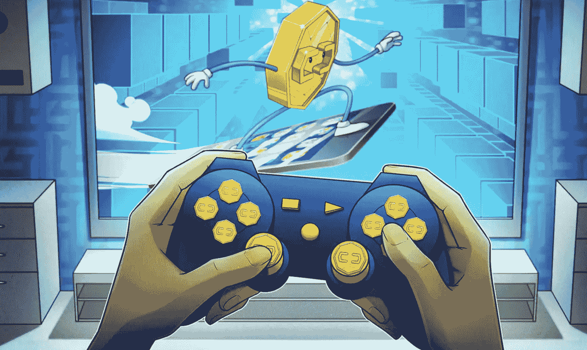

## 用 Moralis 宣称一个游戏中的 NFT

在关注我们的示例项目之前，我们需要确保您知道我们将使用什么工具。因为我们假设您精通 Unity，所以我们将关注最终的 Web3 开发平台——Moralis。当前 [Web3 技术栈](https://moralis.io/exploring-the-web3-tech-stack-full-guide/)的顶峰使得从 Web2 到 Web3 游戏开发的过渡相当顺利。Moralis 还使精通 JavaScript 的开发人员能够更快地进入区块链开发领域。最终，Moralis 是构建 dapp([分散式应用](https://moralis.io/decentralized-applications-explained-what-are-dapps/))的最佳工具。它附带了一个广泛的 [Web3 API](https://docs.moralis.io/moralis-server/web3-sdk/intro) ，其中包括[以太坊 API](https://moralis.io/ethereum-api-develop-ethereum-dapps-with-moralis/) 和 [NFT API](https://moralis.io/ultimate-nft-api-exploring-moralis-nft-api/) 。当使用 Moralis 时，你可以专注于创建一个非凡的 Web3 UI。此外，Moralis 帮助 dapp 创建者平均节省了 87%的开发时间。因此，这个工具可以让你在创纪录的时间内发布你的 Web3 应用。

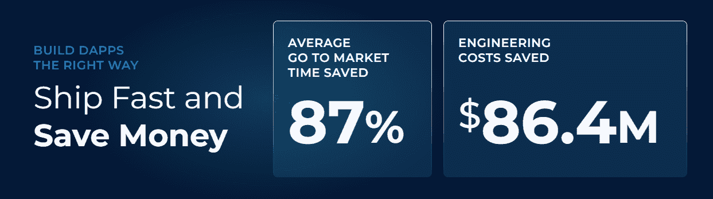

当使用 Moralis 构建时，您通常会从 [Web3 身份验证](https://moralis.io/web3-authentication-the-full-guide/)开始，因为这是所有 dapps 的重要组成部分。幸运的是，这是 Moralis 家的专长之一。此外，它为您提供了几种选择。例如，当精通加密的用户是你的关注点时，[元掩码](https://moralis.io/metamask-explained-what-is-metamask/)或 [WalletConnect](https://moralis.io/what-is-walletconnect-the-ultimate-walletconnect-guide/) 是你的选择。然而，如果你想促进 [Web3 用户的加入](https://moralis.io/how-to-boost-web3-user-onboarding-success-rates/)，使用 [Web3 社交登录](https://moralis.io/web3-social-login-sign-in-dapp-users-with-google-email-or-twitter/)或通过电子邮件进行 [Web3 认证。](https://moralis.io/how-to-do-web3-authentication-via-email/)

我们还必须指出，Moralis 提供了跨链和跨平台的互操作性。因此，您可以使用相同的代码在几个区块链上部署优秀的 dapps。这增加了您的影响力，帮助您的工作经得起未来的考验。目前，Moralis 支持[以太坊](https://moralis.io/full-guide-what-is-ethereum/)、[雪崩](https://moralis.io/how-to-connect-to-avalanche-nodes/)、[多边形](https://moralis.io/how-to-connect-to-polygon-nodes/)、 [BNB 链](https://moralis.io/how-to-create-a-bnb-chain-token-in-5-minutes/)、Fantom、[索拉纳](https://moralis.io/what-is-solana-the-full-2022-guide/)。此外，其他 [EVM](https://moralis.io/evm-explained-what-is-ethereum-virtual-machine/) 兼容链正在筹备中。有了 Moralis，你可以创建 [NFT 市场](https://moralis.io/how-to-launch-an-nft-marketplace/)和 [DeFi](https://moralis.io/how-to-create-a-defi-dashboard-in-5-steps/) 交易所。此外，你可以构建一个 [Web3 Spotify 克隆](https://moralis.io/how-to-build-a-web3-spotify-clone/)、 [Web3 网飞克隆](https://moralis.io/how-to-develop-a-web3-netflix-clone/)等等。所以，[创建你的免费 Moralis 账户](https://admin.moralis.io/register)，今天就开始创建吧！

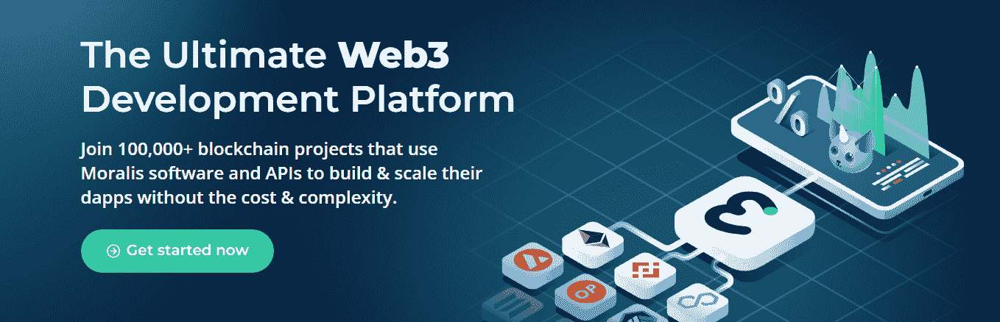

### 使用 Moralis 的元宇宙 SDK 来宣称一个游戏内的 NFT

到目前为止，我们已经在 Moralis 博客中介绍了相当多的 Unity Web3 示例项目。因此，如果你需要一个关于 Unity Web3 编程的提示，我们建议在继续下一步之前阅读我们的[Unity web 3 编程初学者指南](https://moralis.io/unity-web3-beginners-guide-to-unity-web3-programming/)。在那里，你还可以学习关于 T2 元宇宙 T3 的基本知识。然而，如果你需要一些动力，看看 Web3 游戏的[好处。在那里你可以了解到](https://moralis.io/benefits-of-web3-gaming-full-breakdown/) [GameFi 和玩到赚(P2E)](https://moralis.io/what-is-gamefi-and-play-to-earn-p2e/) 的概念。总结一下，通过创建一个游戏将理论付诸实践。

我们过去的教程可以帮助你执行[区块链游戏交易](https://moralis.io/how-to-do-blockchain-game-transactions-with-unity/)，用 Web3 登录连接 [Unity 游戏，以及](https://moralis.io/connecting-a-unity-game-with-web3-login/)[将 Unity 应用连接到 Web3 钱包](https://moralis.io/how-to-connect-a-unity-app-to-a-web3-wallet/)。此外，我们的一些向导会帮助你构建一个 [Web3 MMORPG](https://moralis.io/build-a-web3-mmorpg-with-unity-in-10-minutes/) 或[中世纪元宇宙游戏](https://moralis.io/how-to-build-a-medieval-metaverse-game/)。然而，如果这不是你第一次参加我们的竞技表演，你应该已经熟悉了基本的内容。因此，无需我们的帮助，您就可以完成初始的 Moralis 设置，并将 Unity 与 Moralis 的 SDK 连接起来。如果这适用于你，请通过观看视频，随意跳转到我们的“如何在游戏中要求 NFT”教程的代码演练。现在，让我们来看看“如何在游戏中获得 NFT”任务的示例项目！

## 如何要求一个游戏中的 NFT-例子项目

让我们先快速演示一下我们的 Web3 太空游戏。正如所料，它从登录屏幕开始:

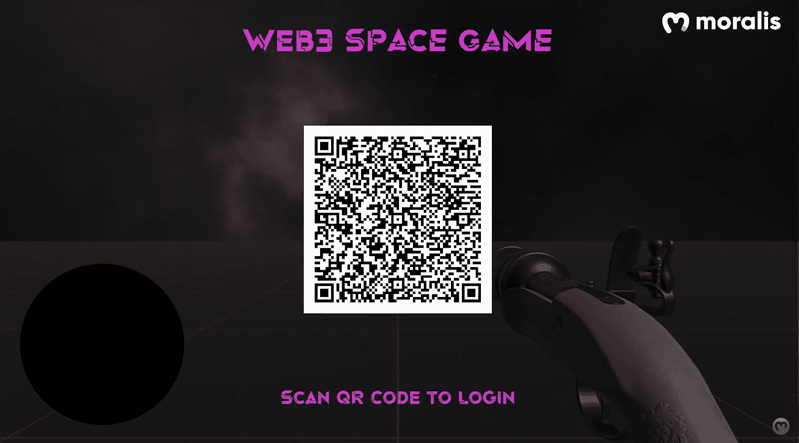

正如你在上面的截图中看到的，我们正在使用二维码来增加用户友好性。一旦用户使用他们最喜欢的 [Web3 钱包](https://moralis.io/what-is-a-web3-wallet-web3-wallets-explained/)扫描代码，他们必须签署钱包中显示的认证消息。然后，游戏马上开始。此外，正如您在下图中看到的，这是一款第一人称射击游戏:

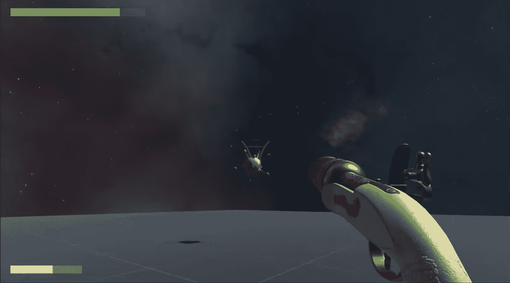

玩家可以看到他们的枪及其瞄准光标(屏幕中间的浅灰色线条)。他们还可以在左上角看到生命或健康栏(绿色)。在左下角，玩家可以看到他们的枪的装载进度(黄色)。而且，普通的敌人是某种会飞的紫色外星人。一旦玩家杀死所有的外星人，boss 就会出现。

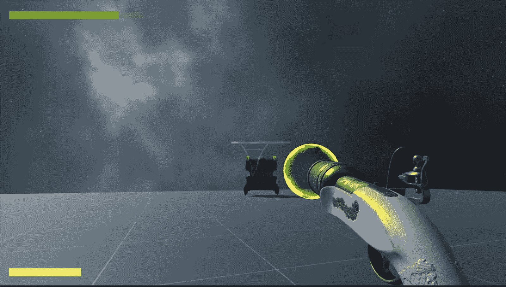

正如你在上面的图片中看到的，boss 的血量条也在上面(紫色)。游戏的任务非常明显——玩家需要射击坏人，并避免被敌人击中或触碰。他们通过移动和用枪射击来达到这个目的。最后，只要他们设法杀死老板，他们就有机会获得游戏中的 NFT:

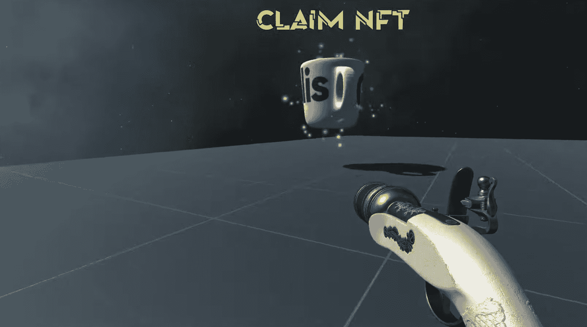

为了得到上面显示的 NFT，玩家需要靠得足够近。一旦玩家进入 NFT 的碰撞区，他们就有机会得到它:

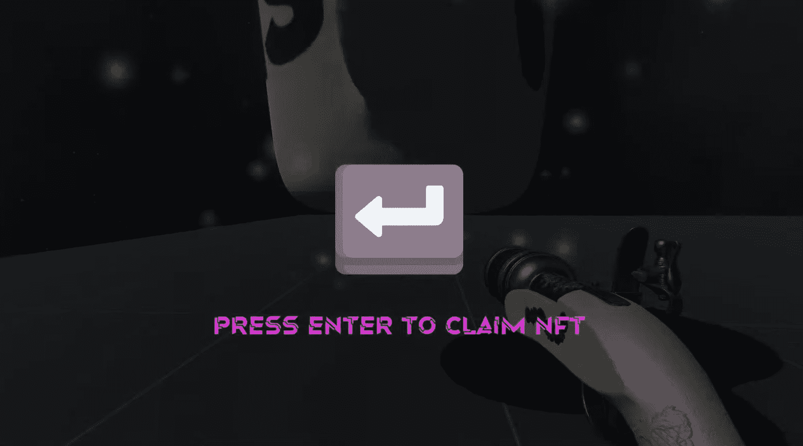

如果他们决定按回车键，申请将开始。由于 NFT 是链上资产，区块链交易是转移的背后。因此，用户需要在他们的钱包中签署一条消息:

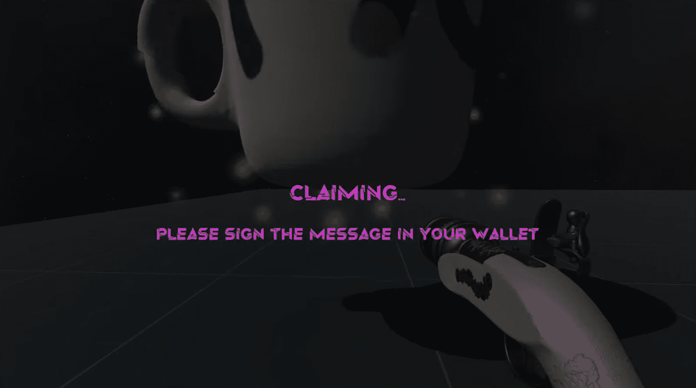

一旦他们确认了加密钱包中的消息，他们将拥有那个 NFT。

## 下载并设置一个 Unity 项目

既然您已经知道如何在我们的示例 Web3 游戏中声明一个游戏内 NFT，您可能很想亲自测试一下。如果是这样的话，是时候下载并设置您的 Unity 项目了。首先打开我们项目的 ZIP 文件，它在 [GitHub](https://github.com/MoralisWeb3/youtube-tutorials/releases) 上等待你。到达后，点击“unity-web3-spaceFPS.zip”:

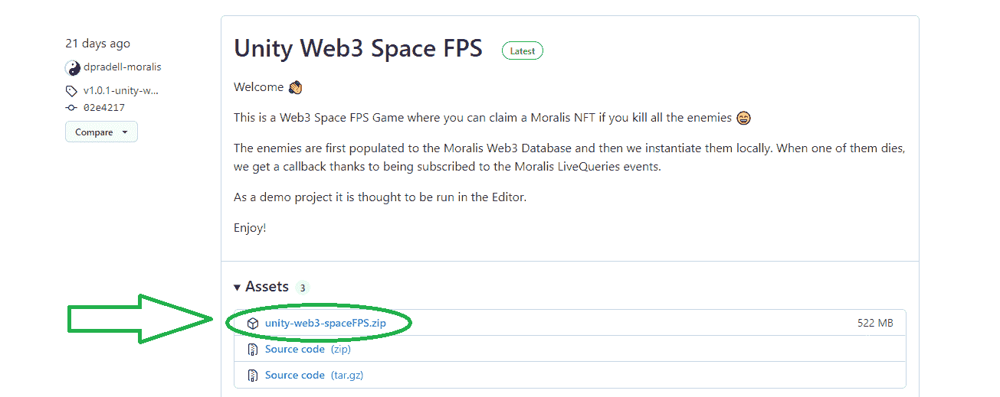

接下来，解压上面的文件，用 Unity 打开。在继续之前，我们必须指出，我们使用 Unity Asset Store 获得了您在上面的演示中看到的[资产](https://github.com/MoralisWeb3/youtube-tutorials/tree/main/unity-web3-spaceFPS/Assets)。

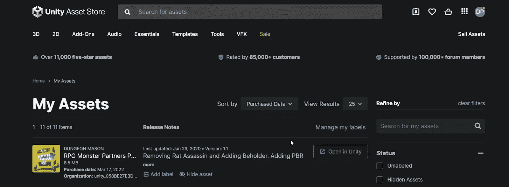

进入 Unity 后，从“场景”文件夹中打开“主”场景:

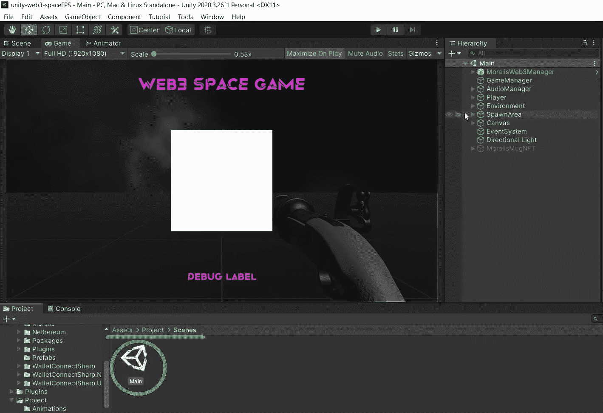

首先，我们需要介绍 Web3 登录。这是在“Moralis 设置”预设中完成的，预设位于“Moralis web 3 管理器”中:

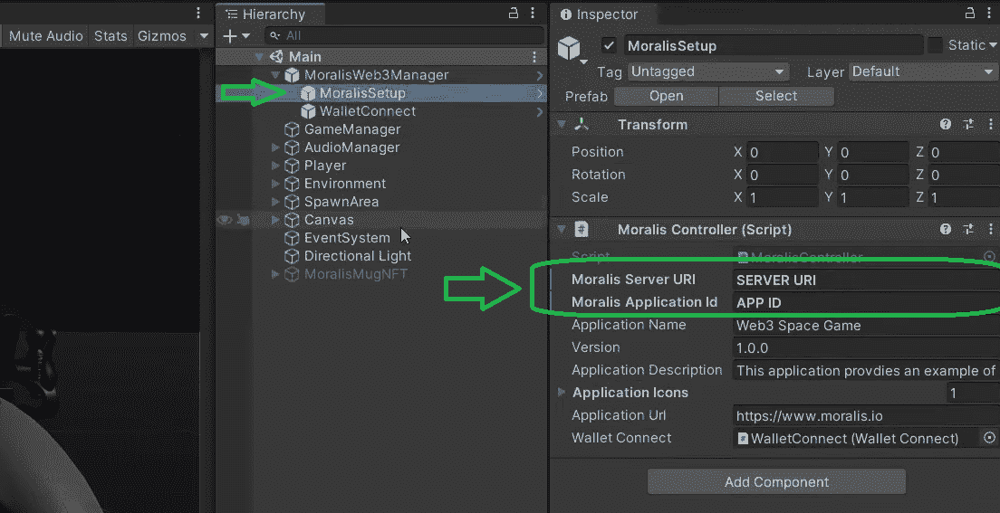

正如您在上面的截图中看到的，您需要获得您的 Moralis 服务器的详细信息——服务器 URL 和应用程序 ID。幸运的是，Moralis 允许你用免费的 Moralis 帐户创建服务器。你只需要[登录](https://admin.moralis.io/login)到你的 Moralis 管理区。在那里，您可以[在“服务器”选项卡内创建一个 Moralis 服务器](https://docs.moralis.io/moralis-dapp/getting-started/create-a-moralis-dapp#2.-create-a-moralis-server):

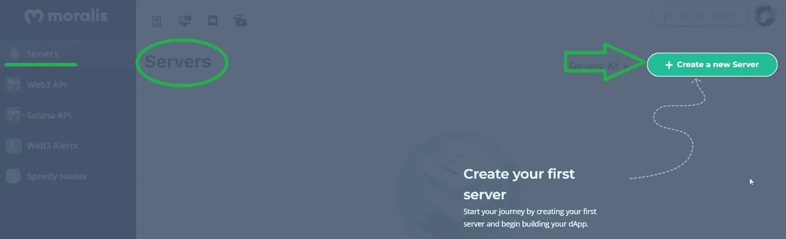

接下来，您需要选择您的服务器类型并输入您的服务器详细信息。一旦您的服务器启动并运行，您将能够通过“查看详细信息”按钮访问其详细信息:

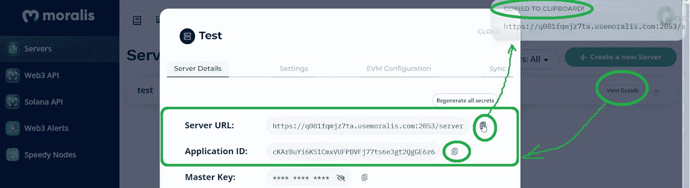

在那里，您可以复制您的服务器 URL 和应用程序 ID，并将其粘贴到 Unity:

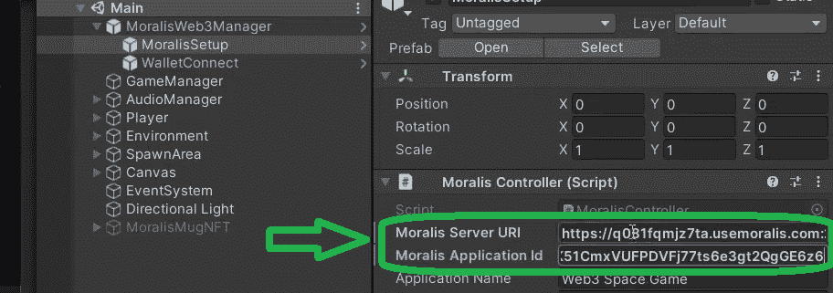

*注意* *:如果您需要更多关于 Moralis 服务器创建过程的指导，请使用本文末尾的视频，从 5:55 开始。*

完成初始设置后，您的 Web3 游戏的登录方法已经可以使用了。如果你愿意，你可以通过点击 Unity 中的“播放”图标来亲自测试。然而，你需要在智能手机上准备好自己的 Web3 钱包:

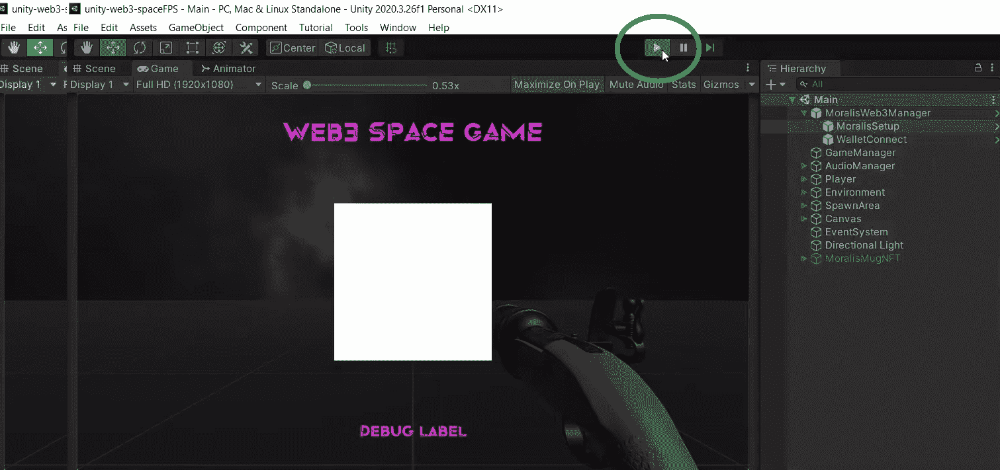

## 如何申请游戏中的 NFT 代码演练

现在你已经完成了初始设置，你可以玩游戏了。然而，为了正确理解我们的示例 Web3 游戏的各个方面是如何工作的，我们建议观看下面的视频。在那里，一位 Moralis 专家会带你浏览脚本。

### Web3 登录和敌人

您可以在 7:33 开始观看下面的视频，了解 C#脚本如何确保我们的 Web3 登录正确完成。在这里，您将了解“成功登录”事件。此外，您将了解“游戏管理员”如何监听该事件。在 8:18，你可以仔细观看，看看“游戏经理”如何处理我们游戏的敌人的行动。首先，你会看到一个成功的登录会自动启动我们的游戏循环，正如我们在演示中注意到的。这个循环还查询所有的敌人数据(“enemy data”类)。为了索引这个类，我们将使用 Moralis 仪表板，您可以在您的 Moralis 管理区访问它:

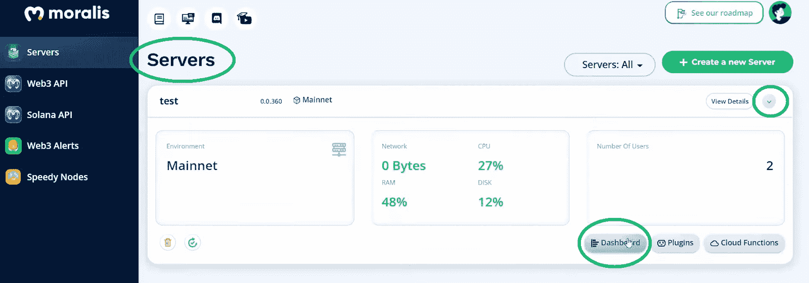

这是你将索引游戏中敌人的所有细节的地方:

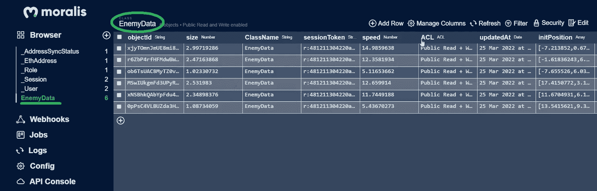

更重要的是，以上细节永远只为活着的敌人而存在。一旦玩家射击了一个敌人，它将不再显示在数据库中(16:41)。

### 老板和索赔要求游戏中的 NFT 功能

有了涵盖你腰带下敌人的代码，你会更仔细地看如何在我们的游戏中编程老板的行为(20:22)。正如上面演示中所展示的，你还会看到确保 boss 在最后一个敌人被杀死时出现的代码。如果你还记得的话，老板的死是触发游戏内 NFT 的事件。这就是“Moralis 自吹自擂”通过“Moralis 自吹自擂”预设来达到目的的地方。后者还包含“声明 NFT 控制器”脚本，激活适当的 NFT 面板。有关使用户能够要求游戏内 NFT 的代码的更多细节，请使用下面 23:00 的视频。这也是我们使用一个相当简单的[智能合同](https://moralis.io/smart-contracts-explained-what-are-smart-contracts/)来确保 NFT 所有权正确转移的部分。

https://www.youtube.com/watch?v=KBmaji1E2LY

## 如何申领游戏中的 NFT——摘要

在本文中，您有机会了解如何在游戏中获得 NFT。我们已经通过一个 Web3 游戏的例子介绍了这一点。后者是由 Unity 专家使用 Moralis 的元宇宙 SDK 创建的。通过访问游戏的 zip 文件，你有机会创建你自己的游戏版本。你只需要创建一个 Moralis 服务器并把它的细节粘贴到 Unity 中。此外，您有机会使用上面的视频来浏览使游戏正常运行的代码。希望这款简单的游戏“认领游戏中的 NFT”能激励你更上一层楼。因此，请随意升级我们的游戏或从头开始创建您自己的 Web3 游戏。

另一方面，如果你不熟悉 Unity，但知道 JavaScript，你可能想要建立一个 [2D Web3 游戏](https://moralis.io/how-to-build-a-2d-web3-game-full-guide%ef%bf%bc/)。此外，请使用 [Moralis YouTube 频道](https://www.youtube.com/c/MoralisWeb3)和 [Moralis 博客](https://moralis.io/blog/)探索其他区块链发展话题。这两个出口涵盖了所有种类的示例项目和加密主题。例如，一些最新的文章关注于 [Web3 合同](https://moralis.io/what-are-web3-contracts-exploring-smart-contracts/)、[将 Web3 钱包连接到 Twitter 账户](https://moralis.io/connecting-web3-wallet-to-twitter-account/)、如何[将 Web3 钱包连接到网站](https://moralis.io/how-to-connect-a-web3-wallet-to-a-website/)、 [Web3 视频流服务](https://moralis.io/how-to-create-a-web3-video-streaming-service/)、如何设置 [BNB 钱包](https://moralis.io/binance-coin-wallet-guide-how-to-set-up-a-bnb-wallet/)、 [NFT 实用程序](https://moralis.io/nft-utility-exploring-nft-use-cases-in-2022/)等等。探索 Moralis 的免费内容也是了解区块链发展可能性的一个好方法。

但是，如果你想[尽快成为 Web3 开发者](https://moralis.io/how-to-become-a-web3-developer-full-guide/)，你应该采取更专业的方法。因此，你可能会考虑报名参加[Moralis 学院](https://academy.moralis.io/)。除了[专业等级的区块链课程](https://academy.moralis.io/all-courses)，你将获得个性化的学习路径、专家导师，并成为一个了不起的社区的成员。**