# 如何在 1 小时内克隆 Zapper

> 原文：<https://moralis.io/how-to-clone-zapper-in-less-than-1-hour/>

**您是否希望构建一个平台来探索和管理加密资产？如果是这样，请跟随本教程，我们将展示如何在不到一个小时的时间内克隆 Zapper！因此，您将能够整齐地组织区块链数据，如 DeFi 资产，并显示给您的 dapp 的用户。此外，您将快速轻松地实现后端功能。但是等等，还有更多。通过将我们一小时的教程延长一点，你也可以为你的 Zapper 克隆创建一个时尚的前端。**

为了完成今天的挑战，我们将向您展示如何使用一些优秀的 Web3 工具来尽可能简化流程。我们将使用 NodeJS 创建一个后端服务器。然后，我们将使用 Moralis 的 [EVM API](https://moralis.io/evm-api/) 的能力，通过简短的代码片段获取各种链上数据。因此，请务必[创建你的免费 Moralis 账户](https://admin.moralis.io/register)。此外，我们将使用 [React](https://moralis.io/react-explained-what-is-react/) 来创建我们的示例 dapp 的前端部分。后者将从我们的后端查询数据。最后但同样重要的是，为了有风格地克隆 Zapper，我们还将使用 Moralis 的 [web3uikit](https://moralis.io/web3ui-kit-the-ultimate-web3-user-interface-kit/) 。因此，我们将在几分钟内准备好引人注目的按钮和其他组件。

此外，值得指出的是 [Moralis](https://moralis.io/) 完全是关于跨链的互操作性。因此，您可以使用相同的代码行来定位所有的主链。但在本教程中，我们重点讨论以太坊和多边形链。然而，在我们向您展示您将有机会构建什么之前，我们需要了解一些基础知识。首先，在你克隆 Zapper 之前，你应该知道它是什么。

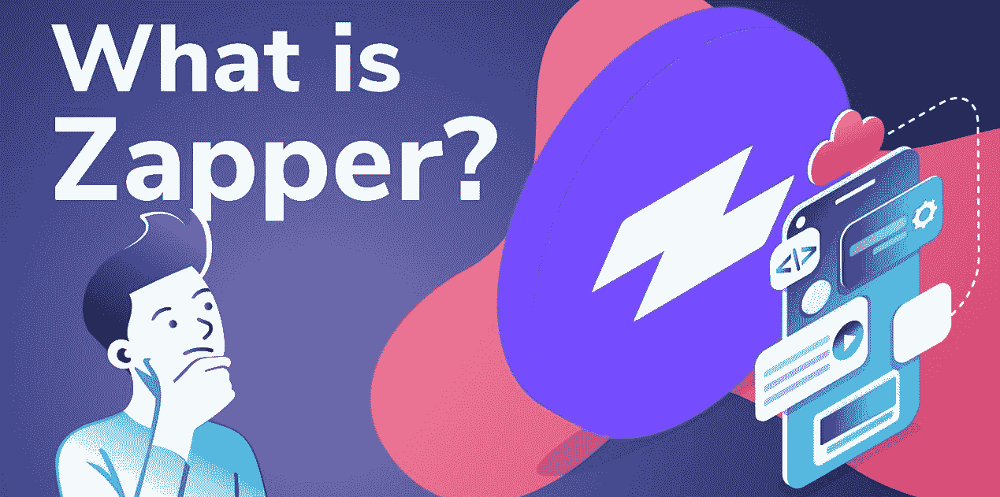

## Zapper 是什么？

Zapper 是一个金融科技平台，使您能够从一个简单的界面探索和管理所有 DeFi 资产。Zapper 的目标之一是为分散金融(DeFi)新来者和高级投资者创造公平的竞争环境。他们通过提供各种快捷方式(“Zaps”)来做到这一点。这些快捷方式使用户能够输入 DeFi 贷款、流动性供应和自动化产量农业。

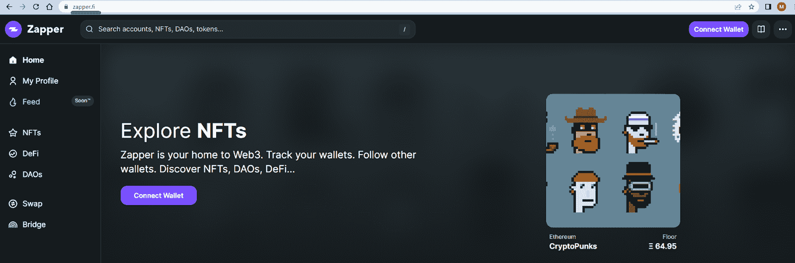

此外，Zapper 也是一种探险家 dapp。它使用户能够连接他们的钱包和探索他们的资产。此外，他们可以搜索其他帐户、NFT、Dao、令牌等等。尽管如此，Zapper 还包括一个交换，用户可以交换他们的令牌。尽管如此，还有一个桥梁，使用户能够将令牌从一个区块链网络转移到另一个网络。

如果这是你第一次听说 Zapper，我们鼓励你访问" *zapper.fi* "并探索它。然而，如果你想克隆 Zapper，了解 Zapper 绝不是先决条件。

## 如何用 NodeJS、React、Moralis 和 Web3UIKit 克隆 Zapper

为了克隆 Zapper，我们必须设置 NodeJS 后端和 React 前端。然后，我们将向您展示如何使用这个后端通过 Moralis EVM API 获取链上数据。当然，我们还将确保前端获得数据并正确显示它。此外，在本教程中，我们将重点关注获取连接钱包的以下详细信息:

*   本地余额和本地余额的美元值
*   ERC-20 代币余额
*   美元总价值组合
*   转移历史
*   NFT 和一种过滤 NFT 的方法

显然，我们将把注意力放在实现资源管理器特性上。但是，借助 1inch 聚合器，您可以轻松添加令牌交换功能。此外，在我们邀请您卷起袖子克隆 Zapper 之前，让我们仔细看看我们的示例 dapp 的演示。

### 我们的 Zapper 克隆演示

这是我们克隆 Zapper 的壮举所产生的 dapp 的要点:

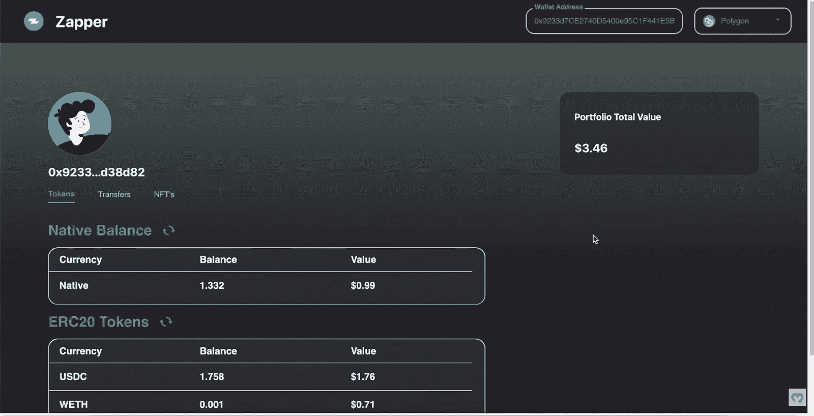

看上面的截图，你可以看到左上角的“Zapper”标志。在顶栏的另一侧，您可以看到“钱包地址”字段和链选择菜单(当前在“多边形”上):

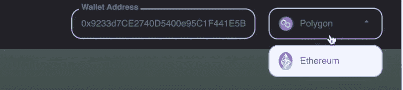

所以，钱包地址和链是入口参数。我们的 Zapper 克隆显示基于这两个参数的本地、ERC-20 和 NFT 余额。此外，我们的示例 dapp 还显示给定钱包地址的转账:

如上图所示，我们的分散式应用程序在右侧显示了投资组合的美元总价值。在左侧，它显示用户图标和连接的钱包的地址。此外，在地址下方是三个选项卡:“令牌”、“转账”和“NFTs”。

此外，当选择“代币”选项时，我们的 dapp 会显示用户的本地代币余额和 ERC-20 余额:

因此，上面连接的钱包持有 1.332 MATIC(多边形链的本地硬币)，1.758 USDC 和 0.001 WETH。如果我们选择“Transfers”选项卡，我们将看到连接的钱包的交易历史记录:

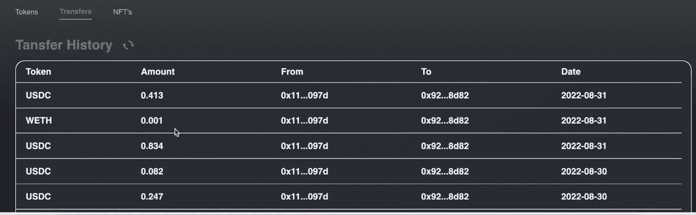

尽管如此,“NFTs”标签显示了该钱包的 NFT 投资组合:

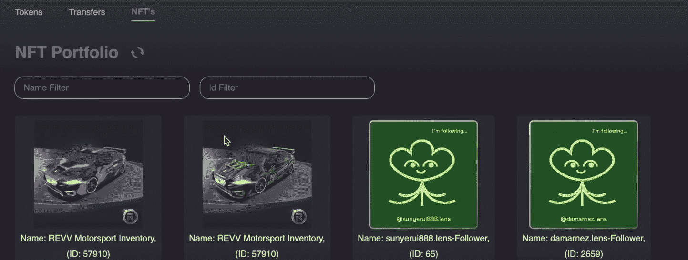

最后但同样重要的是，“NFT 产品组合”页面还允许用户按名称或令牌 ID 过滤 NFT:

正如您在上面的截图中看到的，我们的示例 dapp 包含了简洁的样式。然而，这将是今天“克隆 zapper”壮举的最后阶段。最初，我们将关注功能。因此，这是我们没有任何花哨样式的 dapp 示例:

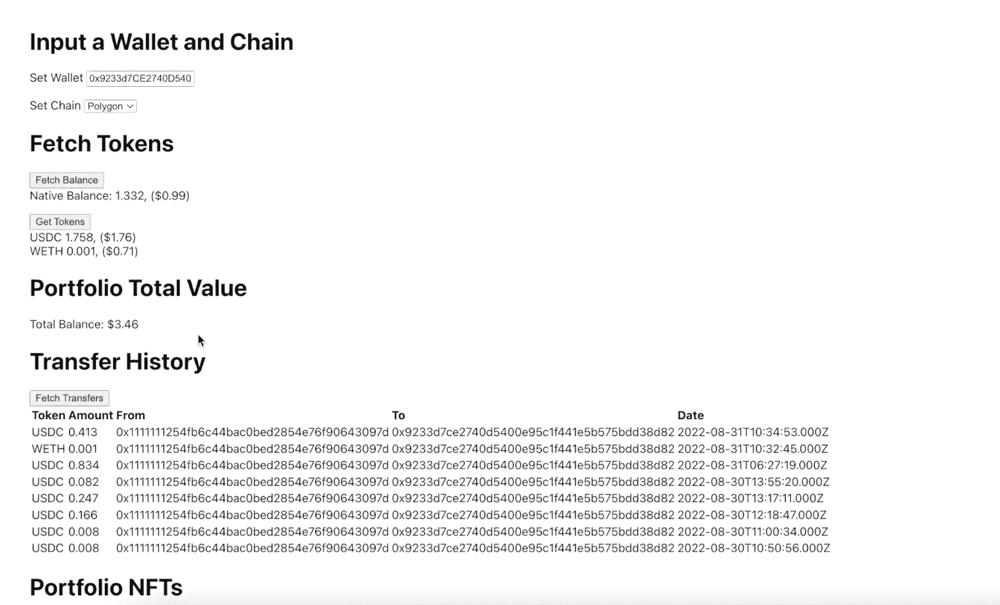

### 设置 NodeJS 后端

*注意* *:确保你已经安装了 NodeJS 和“npm”包。*

如上所述，我们将向您展示如何使用 [NodeJS](https://moralis.io/nodejs-sdk-for-web3-exploring-moralis-nodejs-sdk/) 来设置后端服务器。后者将使用 Moralis 的 Web3 EVM API 查询上述链上数据。首先在 Visual Studio 代码(VSC)中创建“zapper”文件夹。接下来，使用 VSC 的终端，使用“ *mkdir backend* ”命令创建您的“后端”目录。然后将“ *cd* 放入那个文件夹:

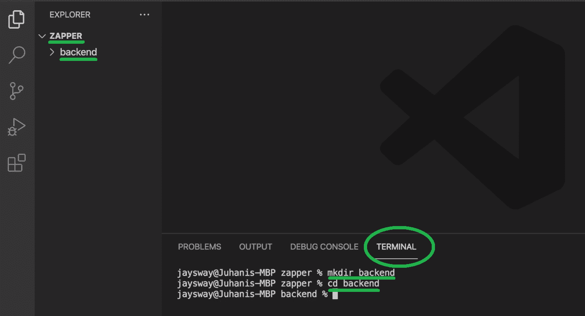

现在，您可以运行“ *npm init* ”命令来初始化您的项目。此外，按几次*键进入*，浏览初始化选项。因此，您现在应该将“package.json”文件放在“backend”文件夹中:

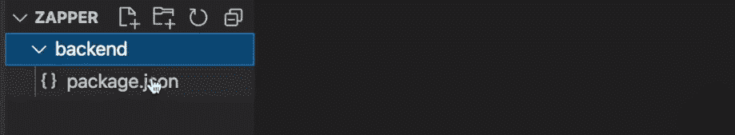

接下来，使用“ *touch index.js* ”命令创建您的“index.js”文件。然后，安装所有有助于覆盖所需后端功能的依赖项。您可以使用"*NPM I moralis express CORS dotenv node mon "*命令来实现这一点。

因此，有了所有的依赖项，就可以填充“index.js”文件了。为了节省时间，您可以使用“hello world example express”模板:

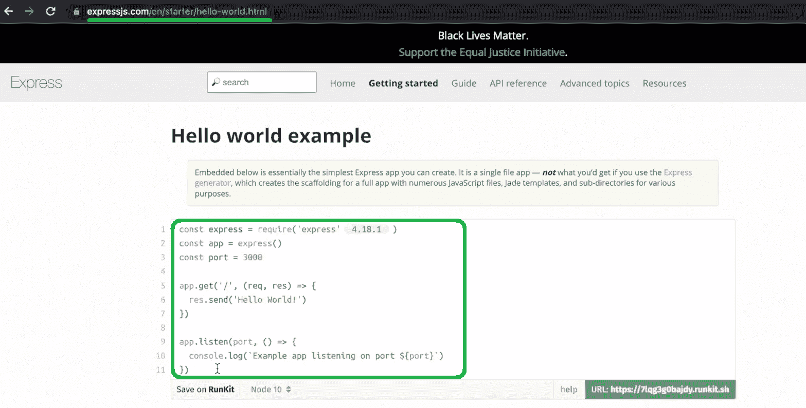

因此，将上面几行代码粘贴到您的“index.js”文件中。接下来，将端口从“ *3000* ”更改为“ *8080* ”，并引入“ *cors* ”包:

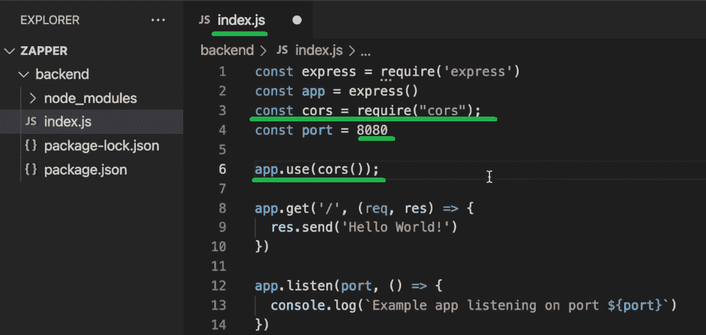

然后，打开“package.json”文件，添加“ *start* 脚本:

每当您对“index.js”文件进行一些更改时，上面的代码行将刷新您的后端。那么，这就结束了您的简单后端设置。因此，您可以使用“ *npm start* ”命令开始监听“ *localhost: 8080* ”:

当然，您也可以使用您最喜欢的浏览器来访问您的后端:

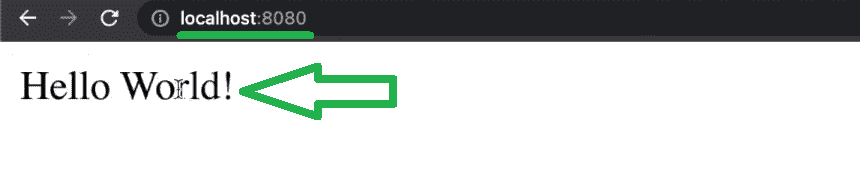

后端的下一阶段将围绕创建端点展开。但是，您应该首先设置您的前端，并将其与后端连接。此外，确保你的后端运行。

### 设置您的 React 前端

首先创建一个新的终端实例:

接下来，使用“*npx create-React-app frontend*”命令创建您的“前端”React 应用程序:

一旦你的前端应用程序准备好了，你会看到“前端”文件夹中的所有相关文件:

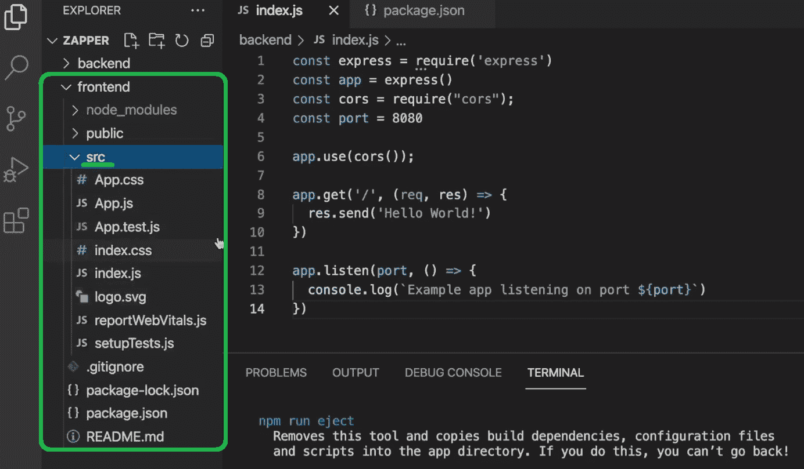

接下来，你需要将 *cd* 放到“frontend”文件夹中。然后，您可以使用“ *npm start* 命令启动您的前端应用程序。随着您的前端应用程序的启动，您可以在“ *localhost: 3000* ”访问您的模板 React 应用程序:

接下来，您需要连接前端和后端。因此，打开“App.js”文件，首先通过删除顶行来删除 React 徽标。接下来，删除“*App*div 内的内容:

然后，您可以向" *div"* 添加一个简单按钮，它将从您的后端获取数据。但是首先，使用“ *npm i axios* ”命令安装 Axios。另外，确保将 Axios 导入到“App.js”文件中。尽管如此，要使“获取你好”按钮起作用，你还需要添加“*后端调用*”异步函数:

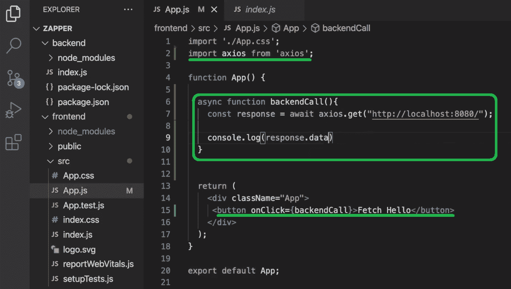

此外，如果您现在使用" *npm start* "命令再次运行您的前端应用程序，您可以看到" Fetch Hello "按钮使用" *get* 端点从您的后端获取数据:

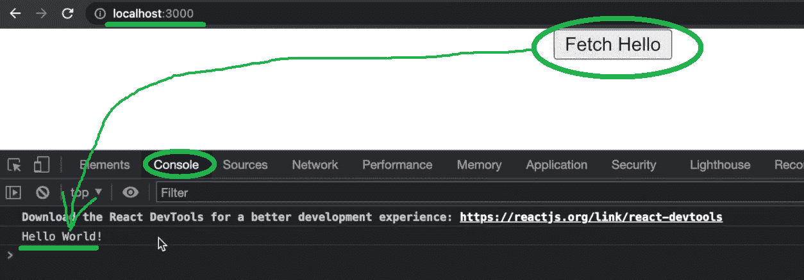

现在，您已经成功地将客户端与服务器端连接起来。这样，您就可以开始实现对后端的 Moralis API 调用，并在前端显示结果。

## 通过 Moralis API 调用克隆 Zapper 功能

要开始使用终极 EVM API，您需要您的 Moralis 帐户。因此，如果你还没有这样做，请使用简介中的“创建你的免费 Moralis 账户”链接。当然，你也可以访问 Moralis 的主页，点击“免费开始”按钮:

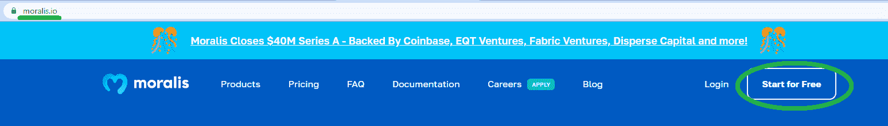

一旦你的 Moralis 帐户启动并运行，你就可以访问你的 Moralis 管理区。在这里，您需要完成两个简单的步骤来获得您的 Moralis Web3 API 密钥:

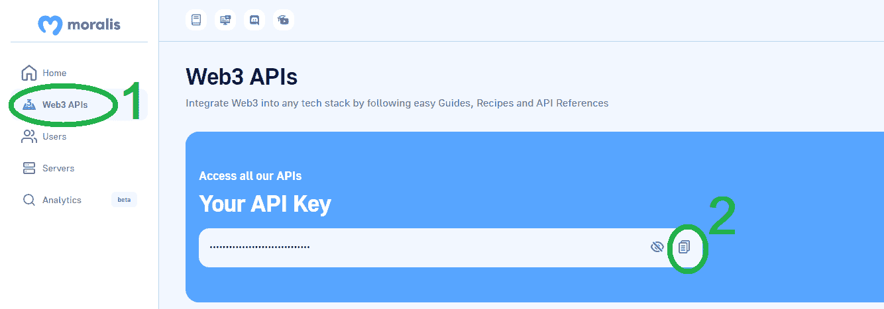

如上图所示，您必须首先转到“Web3 APIs”页面。然后，您可以使用复制图标来复制您的 Web3 API 密钥。接下来，返回到您的“后端”文件夹，并创建您的。env "文件。在该文件中，创建" *MORALIS_API_KEY* "变量，并通过粘贴上面复制的 API 键来设置其值:

接下来，返回到" index.js "文件并"*要求* " the "。env "文件。此外，确保导入 Moralis 规范:

### “ *getNativeBalance* ”和“ *getTokenPrice* ”Moralis Web3 API 端点

有了上面几行代码，您就可以使用 Moralis 的 EVM API 端点来获得本机平衡了。在 Moralis 文档中，您可以获得关于“ *getNativeBalance* ”和“ *getTokenPrice* ”端点的所有必要细节。此外，下面是“ *getNativeBalance* ”页面:

要克隆 Zapper 功能，您必须在“index.js”文件中添加相关的 EVM API 调用。下面是实现“ *getNativeBalance* ”端点的代码行:

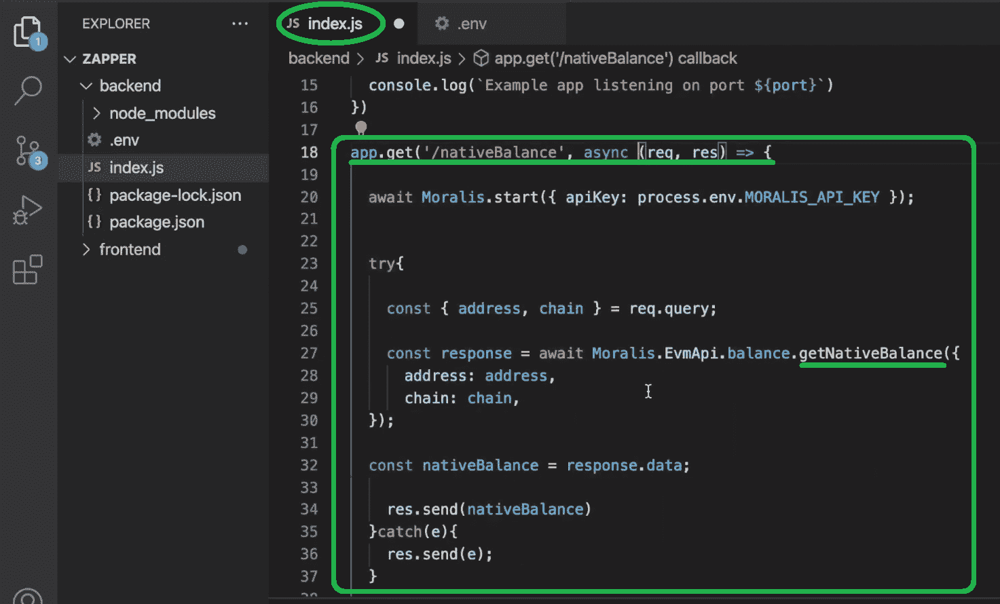

如果你想看到上面的端点在运行，请确保使用本文底部的视频(14:24)。接下来，从 15:45 开始，您将学习如何获取本地余额的美元值。这就是“ *getTokenPrice* ”端点将使事情变得非常简单的地方。当然，您还需要使用一个“ *if* ”语句来确定哪个是当前选择的链:

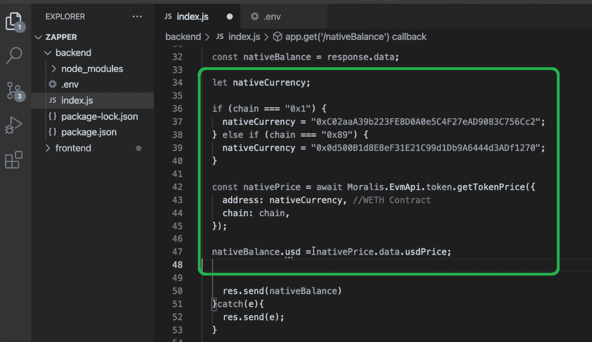

既然您的后端能够获取本地余额和以美元表示的本地货币值，您需要将它传递给您的前端(19:04)。

### 克隆 Zapper——坚持到底

在本节中，您将开始实现 ERC-20 余额、投资组合美元总值、钱包转账历史以及显示 NFT。因此，您可以将其余的功能添加到您的 Zapper 克隆中。从下面视频的 27:50 开始，我们的内部专家将向您展示如何获取和显示 ERC-20 天平。对于这一部分，您将关注" *getWalletTokenBalances"* 端点。此外，您还将学习如何过滤掉值极低的令牌(31:26)。当然，您还将使用您的前端来显示 ERC-20 令牌余额(33:58)。

接下来，您将学习如何创建一个组件来显示投资组合的美元总值。就这部分的后端而言，您已经拥有了所需的所有数据。因此，这是一个完全面向前端的任务(40:45)。

接下来，您将获取一个钱包的转账历史(44:57)。同样，您需要按照前面的两个例子在后端处理这方面的问题。但是，这次您将使用" *getWalletTokenTransfers* "端点。此外，从 56:27 开始，您将学习如何用“ *getWalletNFTs* ”端点获取 NFTs。然后，在 1:06:27，您将开始实现上面演示中介绍的 NFT 滤波功能。

最后但同样重要的是，我们的内部专家将带您了解前端造型(1:14:21)。这是你克隆 Zapper 仪表板的地方。通过完成这最后一步，您将熟悉 Moralis 的 web3uikit。后者使您能够毫不费力地实现各种前端元素。

https://www.youtube.com/watch?v=C9yA8LcJsIY

## 如何在不到 1 小时的时间内克隆 Zapper–总结

如果你浏览了上面所有的章节，并且使用了链接视频教程，你现在知道如何克隆 Zapper 了。在这个过程中，您学习了如何设置后端和前端应用程序，以及如何连接这两者。您还学习了如何获得 Moralis Web3 API 密钥。后者是您使用终极 EVM API 的门户。然后，您使用“ *getNativeBalance* ”、“ *getTokenPrice* ”、“ *getWalletTokenBalances* ”、“ *getWalletTokenTransfers* ”和“ *getWalletNFTs* ”端点来克隆 Zapper 特性。最后，您使用 CSS 和 web3uikit 调整了示例 dapp 的样式。

能够克隆 Zapper 是一个非常有用的技能。它需要使用一些最流行的 Moralis Web3 API 端点。所以，你可以使用这里获得的技能和知识来创造其他种类的 DeFi dapps。然而，如果你需要更多的开发实践，你可以探索一下[Moralis YouTube 频道](https://www.youtube.com/c/MoralisWeb3)和[Moralis 博客](https://moralis.io/blog/)。除了各种 DeFi dapp 想法，这些都是学习更多关于 Web3 开发的地方。例如，你也可以将 Moralis 的力量与 Unity 或 Firebase 结合起来，专注于创建 Web3 游戏。

另一方面，你可能想尽快成为全职加密员。如果是这样，成为区块链认证可以使世界变得不同。因此，一定要考虑报名参加 Moralis 学院。这个在线区块链发展教育平台也为你提供了一个个人学习的途径。此外，这也是获得专家指导并成为最先进的加密社区成员的地方。

