# 如何用 5 个步骤编写区块链 App

> 原文：<https://moralis.io/how-to-code-a-blockchain-app-in-5-steps/>

据专家称，那些学习如何编写区块链应用程序的人可能会在未来几年兴旺发达。 **毕竟，大多数科技专业人士一致认为，Web3 将会继续存在，而且 Web3 革命已经开始。** **因此，学习如何编写一个区块链应用程序无疑是一个人在 2022 年应该掌握的顶级技能之一。可悲的是，许多人在第一次投入区块链编程时使用的是原始工具。然而，Web3 技术在最近几年取得了长足的进步。因此，您现在可以很容易地避免一些旧的约束，比如 RPC 节点的限制。此外，通过使用适当的工具，您可以学习如何利用您的传统编程技能快速轻松地编写区块链应用程序。这就是** [**Moralis**](https://moralis.io/) **进入画面的地方。**

Moralis 专注于为您提供三个核心解决方案，基本上涵盖了整个区块链相关的后端。有了 [Web3 认证](https://moralis.io/authentication/)、链上事件、账户同步和终极 [Web3 API](https://docs.moralis.io/moralis-dapp/web3-api) ，Moralis 可以让你专注于创建最好的前端。接下来，我们将向您展示如何编写一个关注市场情绪的示例区块链应用程序。因此，您将学习如何开始使用 Moralis，以及如何使用 [Moralis 的 Web3 syncs](https://moralis.io/syncs/) 。此外，在这个过程中，您还将学习如何使用 Hardhat 编译、部署和验证智能契约。最后，我们将带您完成以下五个主要步骤:

1.  初始项目设置
2.  部署智能合同
3.  构建您的 dapp 前端
4.  Moralis 系统设置–创建你的 Moralis 系统 dapp
5.  实现 Web3 后端

当然，我们会将以上五个步骤分解成多个更小的步骤，让您的旅程更加简单。因此，如果你想学习如何编写一个区块链应用程序，[创建你的免费 Moralis 账户](https://admin.moralis.io/register)并跟随我们。

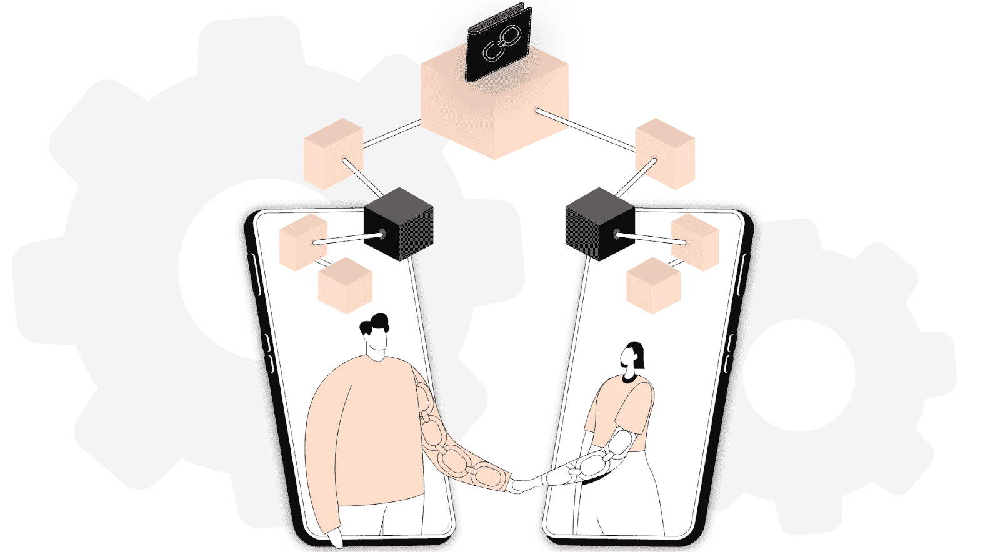

## 什么是区块链 App？

在向您展示我们将要构建的区块链应用程序之前，我们需要了解一些基础知识。先来回答一下“什么是区块链 app？”问题。除非你一直生活在岩石下，否则你很可能知道区块链是一个数字分布的、分散的账本，存在于一个对等网络中。此外，你可能也知道以太坊是第一个可编程的区块链。后者催生了智能合约——去中心化应用(dapps)的核心。

考虑到这一点，你可能会得出结论，区块链应用程序是一种特殊类型的应用程序，以某种方式与可编程区块链进行交互。还值得指出的是，区块链应用通常被称为“dapps”或“Web3 应用”。

如果你想了解更多关于去中心化应用和 Web3 的知识，一定要访问 [Moralis 博客](https://moralis.io/blog/) *。在那里，您可以找到这些概念和许多其他以简单方式解释的加密术语。*

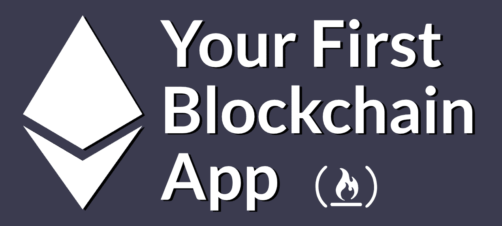

## 区块链应用开发–Dapp 演示示例

随着我们继续“如何编写区块链应用程序”的讨论，我们决定看看我们的示例 dapp 的演示。如果没有别的，这将帮助你决定你是否想要继续前进。

因此，下面的截图涵盖了我们的示例区块链应用程序前端的要点:

如上所述，我们的示例 dapp 关注于隐秘情感。此外，上面的图像表明，我们的 dapp 有一个干净的设计和直观的用户界面。毕竟，如果你想让人们真正使用你的 dapps，后者总是极其重要的。我们还要指出的是，泡泡里面的“液体”其实是动画的，你可以在本文底部的视频教程中看到。

除了 BTC、瑞士联邦理工学院和林克，我们的 dapp 还展示了一些其他领先的硬币(它们的股票代码):

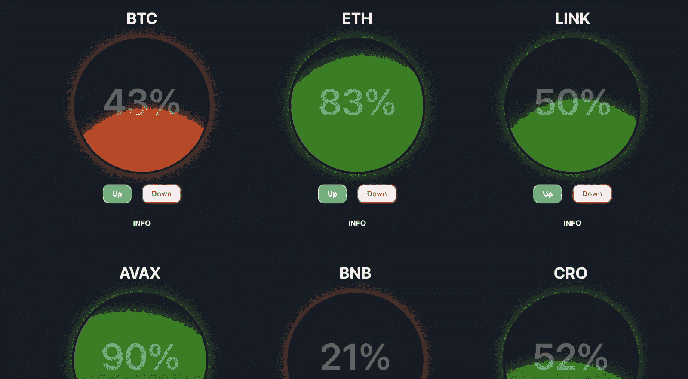

此外，查看上面两张截图，您可以看到气泡内的百分比值。这些价值观符合选民的累积意见。对于大多数选民预计价格会上涨的加密硬币，“液体”是绿色的。然而，红色的“液体”表明超过 50%的选民认为价格会下降。

此外，你可以看到我们的情绪区块链应用程序有四种类型的按钮。其中包括位于右上角的“向上”和“向下”投票按钮、“信息”按钮和“连接钱包”按钮。后者负责 Web3 登录。投票按钮不需要解释。但是，我们必须指出,“信息”按钮打开“关于”信息和相关硬币的当前价格:

### 区块链应用程序登录和投票功能

至此，您已经知道 Web3 身份验证是所有 dapps 的起点。此外，这也是“如何编写区块链应用程序”的一个重要部分。幸运的是，有了 Moralis 的 Web3 Auth API 和 web3uikit，您可以在几分钟内完成。

当未经认证的用户试图在我们的区块链应用程序中投票时，他们会收到一条警告消息:

因此，用户需要点击“连接钱包”按钮来完全使用我们的示例 dapp:

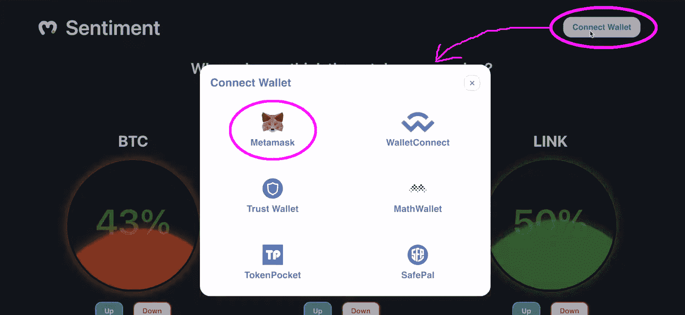

正如上面的屏幕截图所示，为了这个演示，让我们把重点放在决定使用元掩码的示例用户上。因此，一旦他们点击了流行 Web3 钱包的图标，他们的元掩码扩展就会要求他们签署签名请求:

签署签名请求后，用户就可以投票了。如果用户期望链接的价格下降，他们点击链接下的“下降”。由于我们的 dapp 包括在线投票，用户需要确认他们使用加密钱包投票:

一旦用户确认了上述链上交易，他们的投票就直接计入整体情绪。当然，在我们这种情况下，用户并不多。因此，情绪发生了变化。此外，我们在这款区块链应用背后的智能合约还确保用户只能在每个股票上投票一次:

以上结束了我们的演示。然而，确认上面演示的交易确实发生在区块链上也是有意义的。由于我们的 dapp 运行在 Mumbai (Polygon 的 testnet)上，我们需要使用 PolygonScan (testnet)来探索后端活动:

上面的截图清楚地表明了我们的智能合约的事件。标记值是与 LINK 的 downvotes 相关的值。

## 如何使用 Hardhat、React 和 Moralis 编写区块链应用程序

如果上面的演示引起了你的兴趣，是时候学习如何编写一个区块链应用程序了。通过卷起袖子跟随我们的领导，您将了解如何完成初始项目设置、部署智能合同、使用 React 构建您的 dapp 前端、激活 Moralis SDK 以及实现 Web3 后端。

接下来，我们将经常参考本文底部的视频教程。在那里，您可以详细查看所有必要的操作。此外，我们还必须指出，我们的内部专家使用的是传统的 Moralis admin UI。因此，如果您愿意，可以切换到该用户界面:

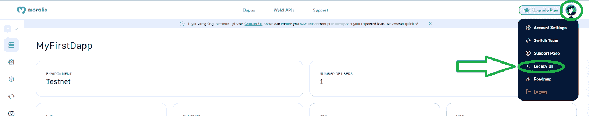

然而，就截图而言，您将能够看到新 UI 的运行。此外，接下来的部分和视频教程假设您将使用我们的[启动代码](https://github.com/MoralisWeb3/youtube-tutorials/tree/main/FirstDapp-Starter)。

## 如何编写区块链应用程序的第一步:初始设置

从克隆我们的起始代码开始。然后，在您喜欢的代码编辑器中打开项目。*您可以跟随我们的脚步，使用 Visual Studio 代码(VSC):*

查看上面的图像，您可以看到我们的示例项目的初始布局。接下来，你需要完成一些安全帽设置(4:16)。后者将使您能够使用这个开发环境来处理智能合约。首先，您将使用“ *cd smartcontract* ”命令导航到“smartcontract”文件夹。接下来，您需要输入“ *npm i -D hardhat* 来安装 hardhat:

然后，输入“ *npx hardhat* ”启动一个新的 hardhat 项目。继续，选择“创建一个基本的示例项目”并按几次“enter ”:

成功创建您的 Hardhat 项目后，您将在“smartcontract”文件夹中拥有一些附加元素:

在部署我们的智能合同实例之前，您还需要安装以下依赖项:

*   " *npm i -D dotenv*
*   "*NPM I-D @ nomic labs/hard hat-ethers can*"

## 如何编写区块链应用程序的第 2 步:部署智能合约

要了解如何创建合适的智能合同，请使用下面的视频(5:35)。在这里，您将依赖现有的模板文件(“Greeter.sol”)。您将更改文件的名称并删除其内容。接下来，你可以按照视频教程或者从 GitHub 复制我们的代码来自己写合同。毕竟，多亏了 OpenZeppelin 这样的平台，你可以经常依赖经过验证的智能合约。

一旦设置好 Solidity 代码，就需要使用 Hardhat 来编译和部署您的智能契约。这是你决定你想关注哪个区块链的地方。因为 Moralis 完全是关于跨链互操作性的，所以您可以在许多著名的可编程区块链中进行选择。然而，为了简单起见，我们建议你跟随我们的领导，关注孟买。此外，从 16:58 开始，您需要调整“sample-script.js ”,以便它与您的智能合约相匹配。接下来，您还将调整“hardhar.config.js”文件(18:05)。在这里，你将学会创造你的”。env "文件并获取必要的详细信息。尽管如此，从 21:10 开始，您将再次关注“hardhat.config.js ”,进行一些最终的调整:

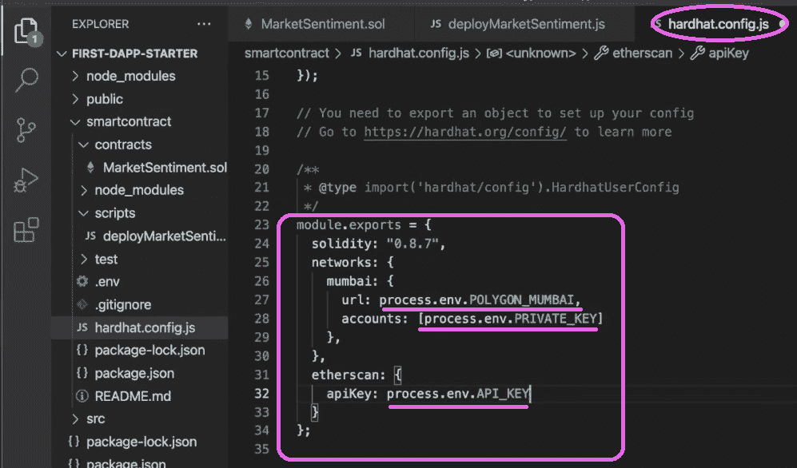

准备好“hardhat.config.js”文件后，您将开始部署和验证您的合同(22:38)。此外，从 23:38 开始，您还将学习如何使用 PolygonScan 与您的智能合约进行交互:

## 如何编写区块链应用程序的第 3 步:构建前端

“如何编写区块链应用程序”挑战的第三步是关于前端的。假设你在 Web2 的那个部门有一些经验，你跟随我们的视频教程应该没有问题。后者将首先向您展示如何初始化您的 React 应用程序(29:01)。接下来，您将创建您的单页 dapp 的标题(30:03)，从 32:26 开始，您将学习添加硬币组件。最后，您将实现投票按钮(38:23)。

## 如何编写区块链应用程序的第 4 步:Moralis 设置

此时，您应该已经部署了自己的智能合约实例，并建立了前端。因此，是时候让您的区块链应用程序上线了。这是您想要创建一个 Moralis dapp (40:12)并将其凭证复制到“index.js”文件中的地方。*使用以下部分获取您的 Moralis dapp 证书。*有了 dapp 的 ID 和 URL，您就可以编写信息模型了(41:26)。这也是您将使用 Moralis 的 Web3 API 的力量来毫不费力地包含令牌价格的地方(47:27)。

### 如何使用新的用户界面获取您的 Moralis Dapp 证书

1.  *使用本文开头提到的“创建您的免费 Moralis 帐户”链接，或者访问 Moralis 的主页，在那里您需要点击“免费开始”:*

2.  登录后，使用“创建新 Dapp”按钮:

3.  选择“测试网”:

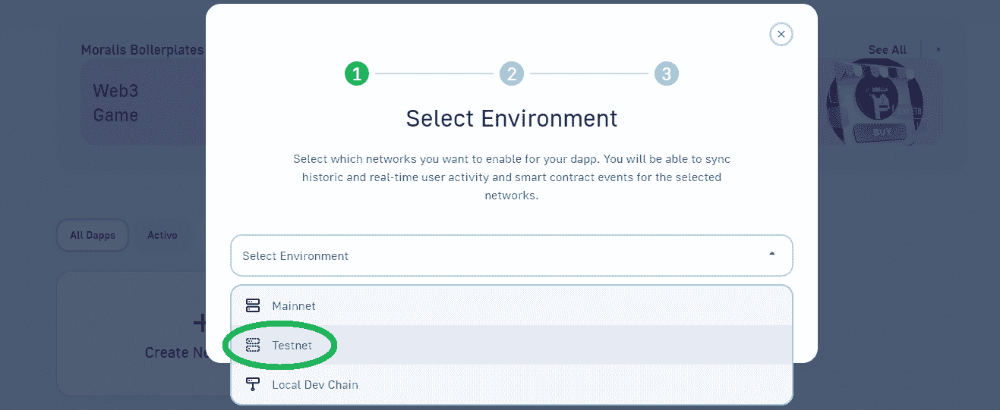

4.  选择“多边形孟买”并点击“继续”:

5.  从下拉菜单中，选择离您实际位置最近的城市:

6.  为您的 dapp 命名:

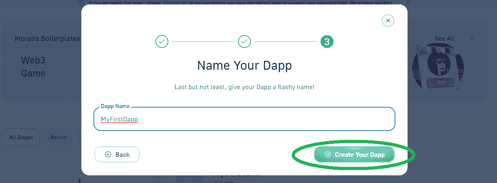

一旦您的 dapp 启动并运行，使用“设置”按钮访问其详细信息:

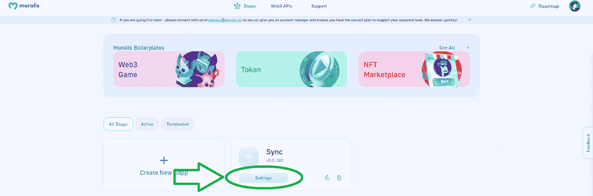

默认情况下，您将登陆侧边栏的顶部选项，在那里您将能够获得您的 dapp 的凭证:

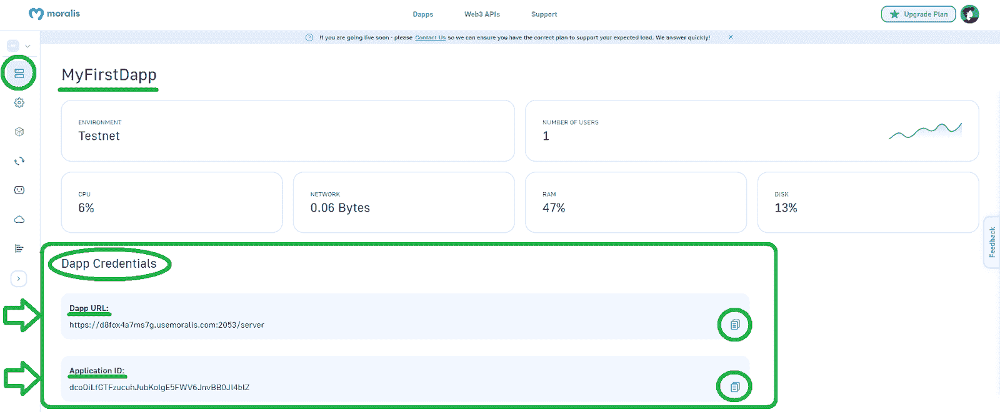

## 如何编写区块链应用程序的第 5 步:实现 Web3 后端

这是“如何编写区块链应用程序”谜题的最后一部分。因此，您现在已经到了需要实现 Web3 后端功能的时候了。因此，从 50:30 开始，您将学习如何将您的 React 应用程序连接到您的智能契约(50:30)。幸运的是，Moralis 的 Web3 同步和数据库让这变得非常简单。

如果您使用新的管理用户界面，您必须返回到您的 Moralis dapp 设置。然后选择“同步”选项卡。在那里，您需要点击“新智能合同事件同步”按钮:

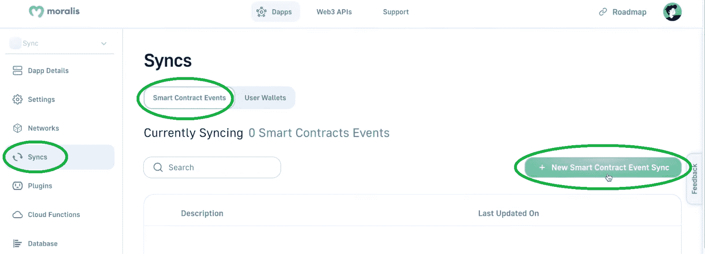

接下来，单击“自定义活动”,按照下面的视频输入必要的详细信息:

智能合约事件同步就绪后，Moralis 数据库将自动索引事件。因此，您只需要访问数据库:

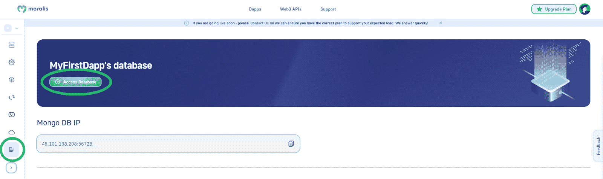

最后，以下视频教程将向您展示如何编写区块链应用程序的详细信息:

https://www.youtube.com/watch?v=MI_Se26Sfmo

## 如何用 5 个步骤编写区块链应用程序——总结

如果这是你第一次听说区块链应用程序或 dapps，你可能会有点不知所措。在这种情况下，我们鼓励您以较慢的速度再次浏览上述部分。目标是清楚地了解 dapp 开发的所有主要方面，包括智能合约、前端和后端。这正是本文所涵盖的内容。此外，文章清楚地说明了如何开始使用 Moralis 以及如何使用 Moralis 的 Web3 API 和 Web3 sync 特性。然而，如果你想从一些简单的项目开始，你可以在 Moralis 的博客和 Moralis YouTube 频道上找到大量的例子。另一方面，这些也是向您展示如何创建几个相当高级的 dapps 的途径。如果你感兴趣，你应该看看我们的“克隆”教程！

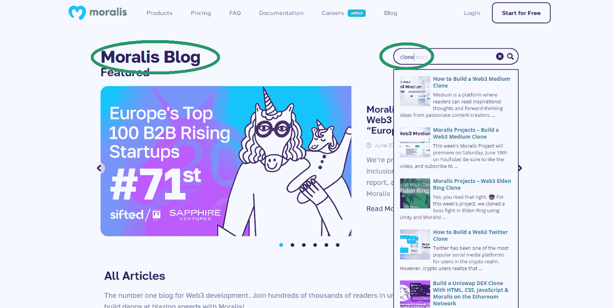

最终，通过完成我们的几个教程，你将学会如何毫不费力地编写区块链应用程序。然后，你将准备好处理你自己的想法和项目。尽管如此，你可能渴望尽快成为全职加密员。如果是这样的话，成为区块链认证可以使所有的差异。所以，一定要考虑报名参加[Moralis 学院](https://academy.moralis.io/)。有了个性化的学习路径、专家指导和来自优秀社区的惊人支持，你很快就会成为一名 Web3 开发者。