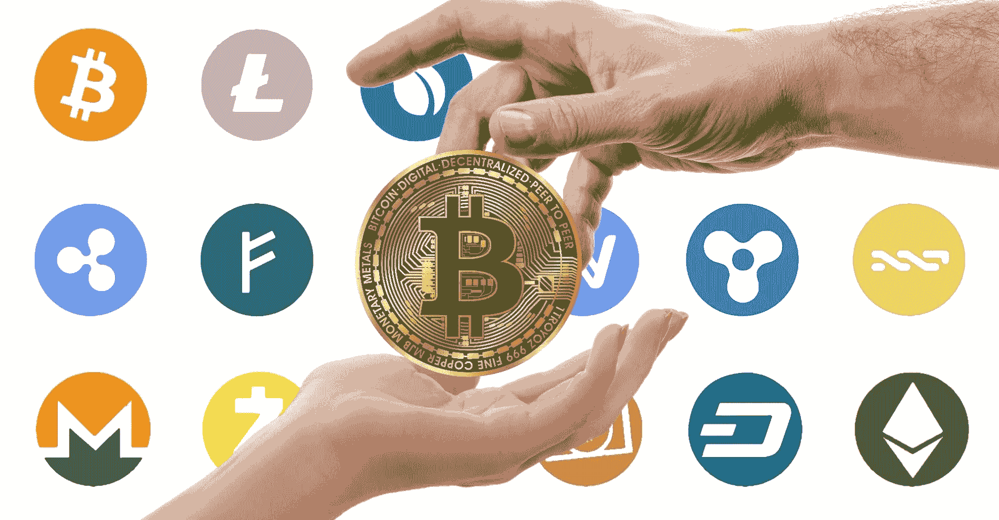
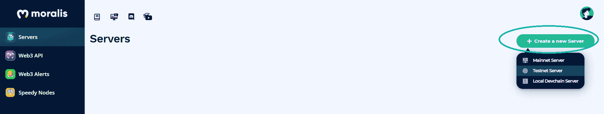
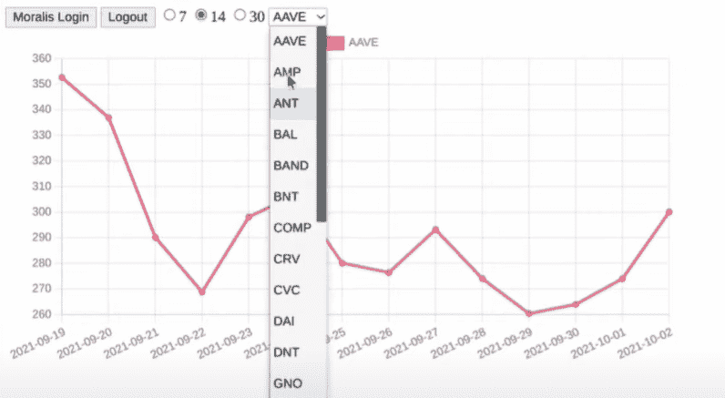
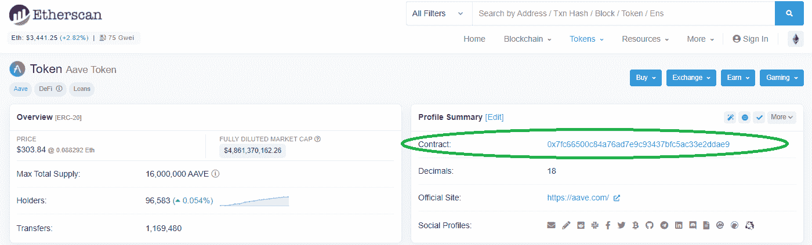
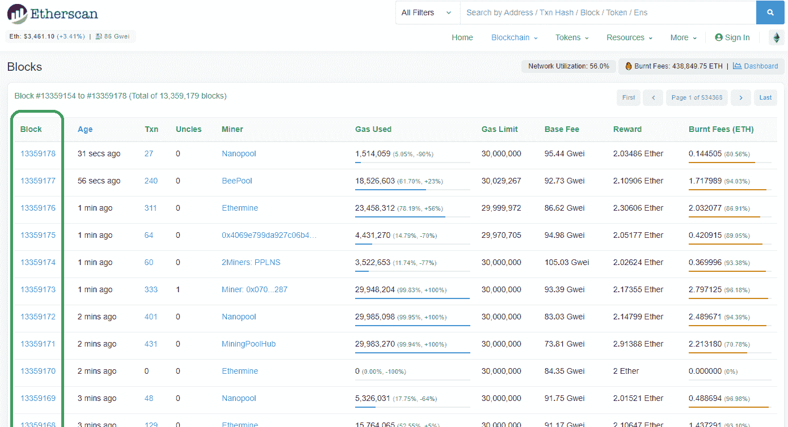

# 如何对令牌价格图表进行编码

> 原文：<https://moralis.io/how-to-code-token-price-charts/>

作为一名区块链开发者，主要的关注点通常不仅仅是监控个别代币的价格。尽管如此，参与区块链行业的开发者和用户仍有可能关注不同的价格图表。因此，开发人员应该知道如何在他们的 [**分散式应用**](https://moralis.io/decentralized-applications-explained-what-are-dapps/) **(dApps)中编码和实现代币价格图表，使用户能够查看各种代币的价格变动。这是优质** [**Web3**](https://moralis.io/the-ultimate-guide-to-web3-what-is-web3/) **应用的“必备”功能，因为大多数用户都希望观察加密货币市场。因此，我们将通过教您如何最轻松地编写令牌价格图表，展示您的分散式应用程序如何获得额外的优势，并为用户提供额外的价值。**

在接下来的几节中，我们将介绍学习如何编写令牌价格图表所需的所有细节。此外，当你使用 [Moralis](https://moralis.io/) 及其强大的平台时，你会意识到这样做比你想象的要简单和快捷得多。这个终极的 Web3 开发平台为您提供了简单的代码片段，可以处理所有繁重的和后端相关的工作。通过利用 [Moralis 的文档](https://docs.moralis.io/)，这是业界最好的文档之一，你本质上是复制和粘贴单行代码来覆盖你的 dApps 区块链相关的编码。立即创建您的免费帐户，以获得对 Moralis 平台的完全访问权限，包括 [Moralis Speedy Nodes](https://moralis.io/speedy-nodes/) 、Moralis’[NFT API](https://moralis.io/ultimate-nft-api-exploring-moralis-nft-api/)及其强大的 [Web3 SDK](https://moralis.io/exploring-moralis-sdk-the-ultimate-web3-sdk/) 。这样，当我们在接下来的章节中介绍如何对代币价格图表进行编码的步骤时，您将能够跟上。我们开始吧！


### 什么是代币？

如果您是 crypto 新手，您可能不确定什么是令牌。此外，对“代币”和“硬币”等术语似乎也存在混淆，甚至在区块链战场上的老手中也是如此。因此，让我们让你们都跟上速度。那么，关于加密硬币和加密代币的讨论是什么？

一般来说，硬币和代币在很大程度上是一样的。硬币或本地代币是特定区块链本地的加密货币。比如比特币(BTC)是比特币的链币，以太(ETH)是以太坊的链币等等。然而，这些提到的硬币是他们的链土生土长。另一方面，额外的加密货币可以在现有的链上创建，在这种情况下，我们谈论代币。例如，现有的大多数代币都是在以太坊区块链的基础上建立的，遵循 ERC-20 代币标准。因此，它们被称为 ERC-20 代币。当然，也有很多代币建立在其他流行链上，包括[币安智能链](https://moralis.io/bsc-programming-guide-intro-to-binance-smart-chain-development-in-10-minutes/)、[多边形](https://moralis.io/how-to-build-polygon-dapps-easily/)、[雪崩](https://moralis.io/moralis-announces-full-support-for-avalanche/)等等。

此外，虽然 crypto 仍处于初级阶段，但许多令牌用例尚未完全实现。因此，交易令牌仍然是许多用户的主要兴趣点。因此，既然不知道一个令牌的价格和波动性就不能交易，学习如何编码令牌价格图表确实是一项有用的技能。



## 如何对代币价格表进行编码–Moralis 设置

在我们进入将清楚地向您展示如何编码令牌价格图表的确切步骤之前，我们需要涵盖初始的 Moralis 设置及其基本步骤。除了注册或登录您现有的 Moralis 帐户，您需要创建一个新的服务器，然后在您的 HTML 或 [JavaScript](https://moralis.io/javascript-explained-what-is-javascript/) 编程文件中初始化 Moralis。

要获得 Moralis 服务器的 ID 和 URL，您需要完成以下步骤:

1.  **创建您的 Moralis 账户**–如果您还没有创建您的 Moralis 账户，请务必现在就创建。记住:完全免费！只需[点击此链接](https://admin.moralis.io/register)，输入您的电子邮件地址并创建您的密码。接下来，您需要确认您的电子邮件地址(您将收到一封带有确认链接的电子邮件)。如果你已经有了一个有效的 Moralis 账户，只需[登录](https://admin.moralis.io/login)。
2.  **创建一个新的服务器**–一旦您登录到您的 Moralis 帐户，您需要创建一个新的服务器。您可以通过点击右上角的“+创建新服务器”按钮来完成此操作。将出现一个下拉菜单，提供不同类型的网络(见下图)。我们建议从“Testnet 服务器”选项开始。



要完成此步骤，您需要输入所需的详细信息，包括服务器名称(可以是您想要的任何名称)，选择区域、网络、链(您可以选择一个或多个选项)，然后单击“添加实例”。


3.  **访问服务器详细信息**–创建服务器后，您可以获取详细信息(供在您的内部使用)。html“或”。js”文件)。只需点击您的服务器名称旁边的“查看详细信息”按钮。接下来，将出现一个包含所有信息的弹出窗口(见下图)。*如果这不是你第一次使用 Moralis，你可能已经安装了一台或多台服务器。在那种情况下，你可以使用任何一个。*


4.  **初始化 Moralis 规范**–剩下的就是填充。html“或”。js”文件，其中包含 Moralis 服务器的详细信息(应用程序 ID 和服务器 URL)。这样，您就获得了所需的后端功能:


*注意:不要而不是从上图中复制服务器的详细信息。您需要使用特定服务器的详细信息。*

# 如何编写令牌价格图表–一个示例项目

让我们从看看我们将要创建的东西开始我们的“如何编码代币价格图表”的探索。下面是我们将创建的简单 dApp 的图像，它使我们能够显示各种令牌的价格行为。



除了“登录”和“注销”按钮之外，我们将构建的 Web3 应用程序还包括一个选择时间范围(7 天、14 天或 30 天)的选项，该应用程序将教您如何编写令牌价格图表。此外，还有一个下拉菜单。这使用户能够选择一个令牌(通过其股票代码)来查看其价格。上图的 Y 轴是金额，X 轴是日期。

随着我们的进展，我们将向您展示特定的代码片段。但是，如果您想访问这个示例项目的完整 HTML 代码，可以在 GitHub 上找到。

此外，看看我们的示例项目的最终目标，我们可以看到图表显示部分是前端编码的问题。然而，在特定时间获得每个令牌价格是后端的工作，我们将委托 Moralis 来完成。

### 如何对代币价格图表进行编码——获取代币价格

如前所述，Moralis 使耗时的任务变得明显更快更容易，当我们谈到象征性价格收购时，我们会体验到这一点。要获得某个令牌价格，我们只需使用以下代码片段:

```js
Moralis.Web3API.token.getTokenPrice(options)
```

“选项”部分接受几个参数，包括 chain(仅在不关注以太坊的区块链时需要)、交换名(可选)和令牌地址。然而，由于我们的例子涉及以太坊的区块链，这是一个本地链，我们只能使用一个令牌地址作为参数。此外，获取令牌地址的一个可靠方法是使用" [Etherscan](https://etherscan.io/) "，在这里您可以访问基于以太坊链的所有令牌的合同地址。当访问特定令牌的以太网扫描页面时，我们还可以看到它的价格，我们可以将其用作参考。



*如果您想了解关于“getTokenPrice”函数* *的更多细节，请查看 Moralis 文档的相关章节。*

此外，上述函数还有另一个参数(***to _ block****)*，它使我们能够从特定的块中获取数据。如果未指定，该函数将自动返回最新块的价格。但是，当我们指定这个参数时，我们可以从任何其他块中获得令牌的价格。

下面是一个“getTokenPrice”函数在“AAVE”令牌中的应用示例:

```js
Moralis.Web3API.token.getTokenPrice({address:”0x7fc66500c84a76ad7e9c93437bfc5ac33e2ddae9”, to_block: 13359177 })
```

为了访问过去块的数据，我们再次使用 Etherscan。使用“区块链”下拉菜单，然后点击“查看区块”:



使用 Moralis 提供的“getTokenPrice”函数及其“address”和“to_block”参数，我们可以访问任何令牌的最新价格，以及过去块中记录的价格。这样，我们就可以满足 Y 轴的所有需求了。因此，我们可以将焦点转移到图表的 X 轴上。

### 如何对代币价格图表进行编码–X 轴

查看显示我们希望 dApp 如何呈现令牌价格的图像，我们看到图表的 X 轴应该显示日期。因此，我们需要找到一种方法来收集特定日期的令牌价格，而不是块数。幸运的是，我们可以再次依靠 Moralis 来为我们做艰苦的工作。

```js
Moralis.Web3API.native.getDateToBlock(options)
```

上述函数接受两个参数；一个是“chain”，可选(默认考虑以太坊的 chain)，另一个是“date”，必选。“ [Moment.js](https://momentjs.com/) 接受的任何日期格式都可以。使用上面的函数并输入一个日期作为参数，我们得到一个块号作为回报。这里有一个例子:

```js
Moralis.Web3API.native.getDateToBlock({date:“2021-10-05”})
```

*如果您想了解关于“getDateToBlock”函数* *的更多细节，请查看 Moralis 文档的相关章节。*


“getTokenPrice”和“getDateToBlock”函数让我们可以轻松地创建一组数据点(价格-日期对)。此外，我们可以在特定的时间范围内为我们想要显示的每个令牌执行此操作。如果没有这两个功能，我们将在后端编码上花费数周时间。然而，有了 Moralis，我们可以在几分钟内做到这一点。

### 如何对令牌价格图表进行编码–创建数组

在我们的“index.html”文件中，我们现在可以创建一个数组。这将为我们提供填充图表的数据点。下面是实现这一点的代码:

```js
let dates1 = Array(Number(days).fill().map((e.i) =>
moment().substract(i, “d”).format(“YYYY-MM-DD”)
).reverse()
```

因为我们要减去日期，所以需要使用“reverse()”函数来获得正确的格式。为了填充上面的数组，我们使用了前面几节中提到的两个 Moralis 函数。以下几行代码将帮助我们通过日期获取块:

```js
let blocks1 = await Promise.all(dates1.map(async(e,i) =>
await Moralis.Web3API.native.getDateToBlock({date:e})
))
```

这些代码将使我们能够获得分配给我们阵列的数据块的价格:

```js
let prices1 = await Promise.all(blocks1.map(async(e,i) =>
await Moralis.Web3API.token.getTokenPrice({address: addrs, to_block:e.block})
))
```

我们在 GitHub 中可访问的 HTML 文件的“priceHistory()”函数中添加了上述代码行。

就是这样；现在你知道如何编码令牌价格图表！如果您更喜欢视频教程，请参见下面的解决相同示例项目的视频教程:

https://www.youtube.com/watch?v=90dMpTlPNZ0

## 如何对代币价格图表进行编码–摘要

由于加密货币是最受欢迎的区块链用例，目前，了解如何快速轻松地编码令牌价格图表是很实用的。此时，您应该知道如何使用 Moralis 的 SDK 来获取单行代码，使您能够在任何特定时间获得任何令牌的价格。我们用“Moralis”来做这件事。Web3API.token.getTokenPrice()”和“Moralis。Web3API.native.getDateToBlock()"函数，通过一些简单的 HTML 编码，我们可以使用这些数据。


如果您一直在区块链领域使用一种乏味的方式围绕 [RPC 节点](https://moralis.io/ethereum-rpc-nodes-what-they-are-and-why-you-shouldnt-use-them/)进行开发，我们鼓励您使用 Moralis 来为您服务。Moralis 的快速节点使 Moralis 成为一个跨链的选择，并且是 BSC 的一个很好的“[信息”选项。有了 Moralis 强大的](https://moralis.io/infura-bsc-alternatives-the-best-alternative-to-infura-for-bsc/) [Web3 API](https://moralis.io/introducing-the-moralis-web3-api-v2/) 的支持，你可以用更快的速度和最少的资源创建和启动 Web3 应用。例如，你可以[在几分钟内创建自己的 ERC-20 代币](https://moralis.io/how-to-create-your-own-erc-20-token-in-10-minutes/)或 [BEP20 代币](https://moralis.io/bep20-testnet-create-a-bep20-token-in-15-mins/)，专注于 [NFT 游戏开发](https://moralis.io/nft-game-development-how-to-build-an-nft-game-app-in-minutes/)，或[建立一个加密钱包](https://moralis.io/how-to-build-a-crypto-wallet-in-4-steps/)。本质上，无论你在做什么加密项目，Moralis 都会帮助你更快地到达终点。

另一方面，如果你是区块链开发的新手，我们建议你深入了解我们免费提供的大量有价值的信息。在 [Moralis 的博客](https://moralis.io/blog/)和 [Moralis 的 YouTube 频道](https://www.youtube.com/channel/UCgWS9Q3P5AxCWyQLT2kQhBw)上，我们涵盖了大量的示例项目，并以简单易懂的方式解释了这一颠覆性技术的不同概念。此外，如果你还不精通 JavaScript，我们强烈建议你报名参加 Ivan on Tech Academy 的“[区块链开发者 JavaScript 编程](https://academy.ivanontech.com/courses/javascript-programming-for-blockchain-developers)课程。我们期待看到您将创建和发布的 Web3 应用程序！