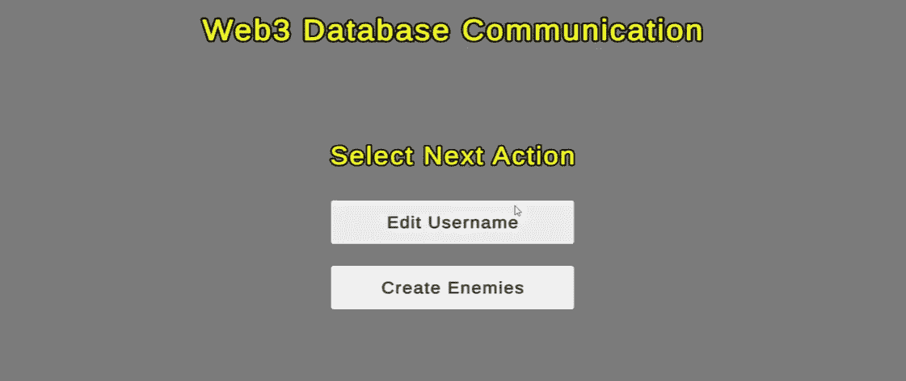
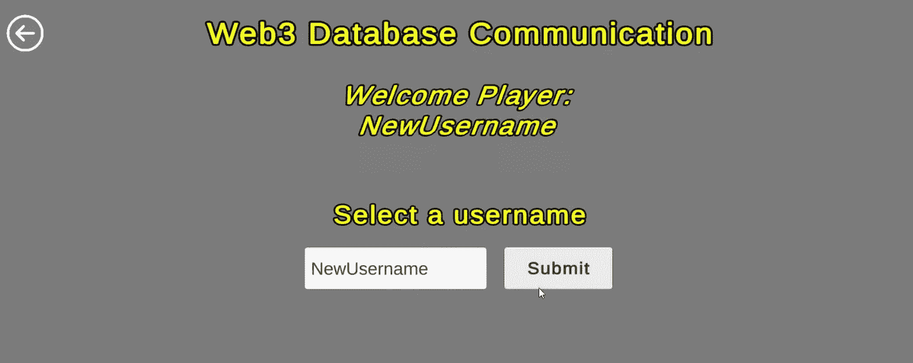
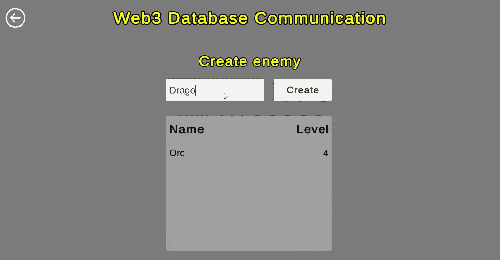
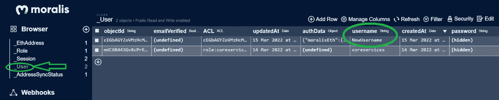
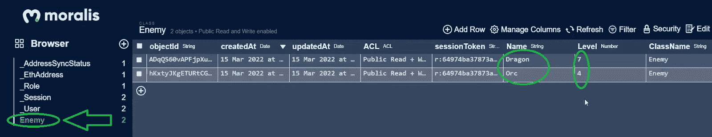
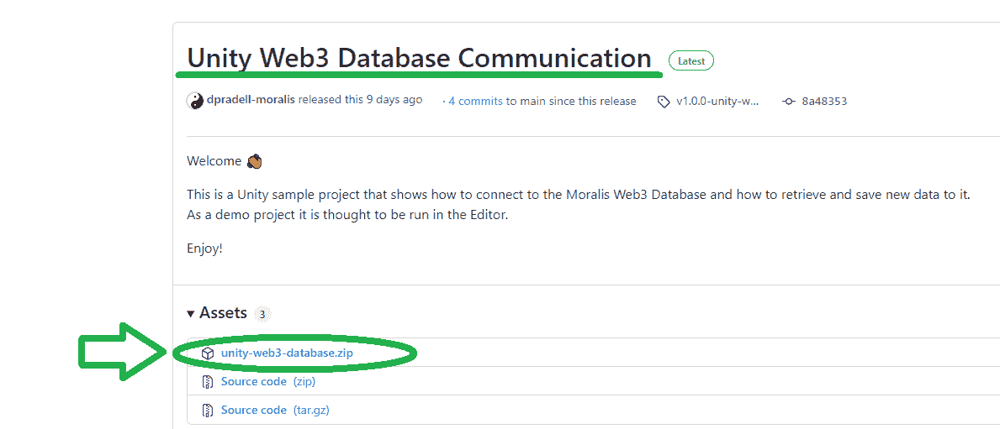
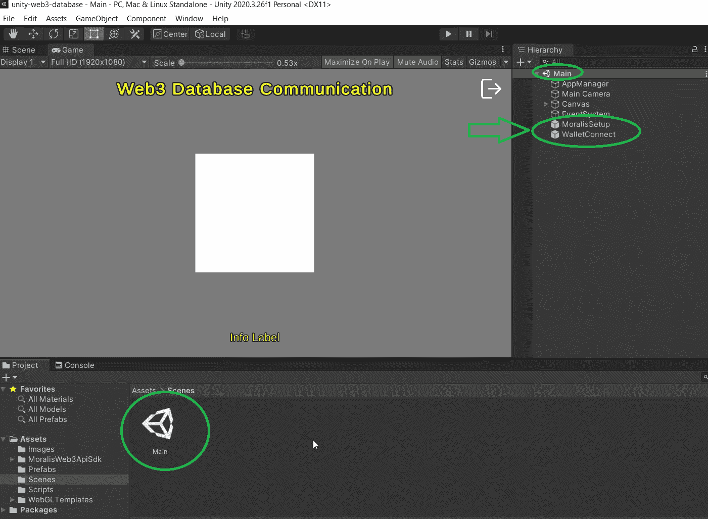
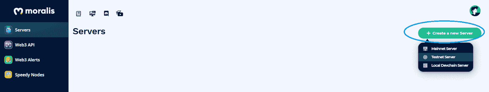
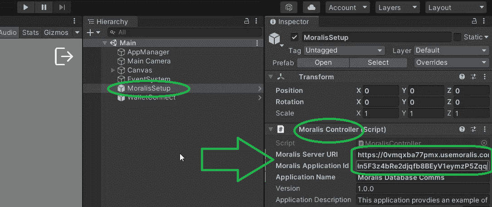
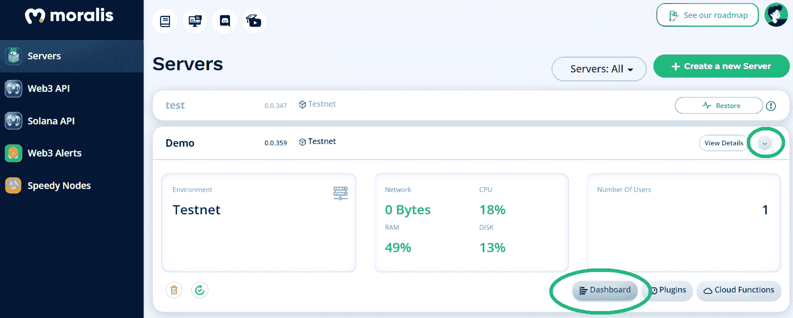

# 如何与 Unity 的 Web3 数据库通信

> 原文：<https://moralis.io/how-to-communicate-with-a-web3-database-from-unity/>

Unity 是创建任何类型游戏的最佳跨平台游戏引擎之一，尤其是 [**Web3**](https://moralis.io/the-ultimate-guide-to-web3-what-is-web3/) **游戏。即使你已经习惯了 Web2 编程，现在也是一个深入研究 Unity Web3** **开发的绝佳时机。幸运的是，有了正确的工具，这种转变可以顺利进行。然而，无论我们关注哪个“网络时代”(Web2/Web3)，与数据库通信的能力都是至关重要的。但是，因为我们专门研究 Web3，所以我们在这里将重点关注 Unity 和 Web3 数据库之间的连接。**

无论你想知道[如何存储链外数据](https://moralis.io/how-to-store-off-chain-data-unity-web3-database/)或处理链上数据，Moralis 的仪表板都会支持你。接下来，您将了解 Moralis 如何使您能够与 Web3 数据库进行通信。有了[Moralis 观](https://moralis.io/)，你就可以[毫不费力地索引区块链](https://moralis.io/how-to-index-the-blockchain-the-ultimate-guide/)。此外，这个终极的 [Web3 后端平台](https://moralis.io/exploring-the-best-web3-backend-platform/)允许您高效地检索和保存新数据。

在接下来的章节中，您将学习如何覆盖初始的 Moralis 设置，这是访问 [Moralis SDK](https://moralis.io/exploring-moralis-sdk-the-ultimate-web3-sdk/) 的关键。此外，我们将向您展示将 Unity 与 [Moralis 的元宇宙 SDK](https://moralis.io/metaverse/) 连接起来是多么容易。在介绍了初始设置之后，我们将关注示例项目的细节。后者将清楚地演示如何与 Web3 数据库进行通信，而不需要花费太多精力或金钱。因此，你将能够进一步发展你的 Web3 游戏。例如，你将能够[同步和索引智能合同事件](https://moralis.io/sync-and-index-smart-contract-events-full-guide/)来实现各种功能。因此，你将没有问题纳入不同的[元宇宙智能合同](https://moralis.io/metaverse-smart-contract-how-to-build-a-metaverse-game-smart-contract/)的例子。那么，你准备好学习如何与 Web3 数据库通信了吗？如果是这样，请务必现在[创建您的免费 Moralis 账户](https://admin.moralis.io/register)。您将需要它来承担即将到来的示例项目。

### Web3 Unity 游戏

3D 游戏是各行各业和各个年龄段的人都喜欢的东西。因此，已经有一个巨大的现有市场。此外，无论市场是涨是跌，人们都会玩游戏。因此，涉足这个利基市场会让你免受市场波动的影响。然而，尽管许多 Web2 游戏已经相当不可思议，但增加 Web3 功能可以创造出更吸引人的游戏。

例如，仅仅通过整合对 [Web3 钱包](https://moralis.io/what-is-a-web3-wallet-web3-wallets-explained/)的支持，一系列优秀的选项就成为可能。然后，用户可以完成各种链上交易。此外，他们可以互相发送可替换的和[不可替换的令牌](https://moralis.io/non-fungible-tokens-explained-what-are-nfts/)(NFT)。因此，所有游戏中的资产都可以交换，并真正归玩家所有。更重要的是，游戏中创造的价值可以转移到现实生活中。就这样，[游戏和赚钱游戏(P2E)](https://moralis.io/what-is-gamefi-and-play-to-earn-p2e/) 概念应运而生。然而，为了成功地创建一个 Web3 Unity 游戏，开发者需要能够与来自 Unity 的 Web3 数据库通信。这就是你将要学习的！

## 与 Web3 数据库通信–示例项目

我们相信，当想要实现新事物时，采取行动并创建一个示例项目会有很大帮助。此外，对示例项目有一个清晰的了解也是有益的。因此，我们想快速展示我们的示例 dapp ( [分散式应用](https://moralis.io/decentralized-applications-explained-what-are-dapps/))的演示。这是 dapp，随着我们的进一步发展，你将有机会建立自己。为了简化事情，我们决定创建一个相对简单的 Unity 应用程序。因此，我们使用了一个基本的界面，并专注于向您展示如何与 Web3 数据库进行通信。

### 如何与 Web3 数据库通信的演示

所以，这是我们 dapp 的 [Web3 认证](https://moralis.io/web3-authentication-the-full-guide/)屏幕的样子:

通过使用 Moralis 的 [WalletConnect](https://moralis.io/what-is-walletconnect-the-ultimate-walletconnect-guide/) 集成，我们能够整合一个简洁的 [Web3 登录](https://moralis.io/how-to-build-a-web3-login-in-5-steps/)解决方案。正如你在上面的截图中看到的，用户可以通过扫描二维码用他们的 Web3 钱包登录。登录后，用户可以选择编辑用户名或创建敌人:

上面的两个选项似乎正好可以清楚地演示如何与 Web3 数据库通信。此外，通过编辑用户名和创建敌人，我们的示例 dapp 向您展示了如何在 Web3 数据库中检索和保存新数据。因此，让我们更仔细地看看这两个选项。首先，当用户选择“编辑用户名”按钮时，他们会进入以下屏幕:

默认情况下，用户名将是用户的钱包地址。虽然，通过查看上面的截图，您已经可以看到这个示例用户将其用户名更改为“NewUsername”。他们使用上面的输入字段和“提交”按钮来完成。此外，这些更改存储在 Moralis 数据库中。此外，让我们现在也预览一下“创建敌人”屏幕:

正如你在上面的图片中看到的,“创造敌人”面板允许用户命名一个敌人。然后，他们通过点击“创建”按钮来创建敌人。当然，新创建的敌人也存储在分配给这个 dapp 的 Moralis 数据库中。尽管如此，以下是用户名和敌人在我们的数据库中的索引:

*   使用 Web3 数据库索引我们 dapp 用户的用户名:

*   使用 Web3 数据库来索引我们 dapp 用户的敌人:

## 与 Web3 数据库通信–初始设置

通过查看上面的演示，您现在知道我们的示例项目是关于什么的了。此外，我们希望您决定采取行动，并直接学习如何与 Web3 数据库通信。因此，卷起你的袖子，跟随我们的领导。我们将首先指导您完成初始设置，然后继续代码演练。

如果这不是你与 Moralis 的第一个示例项目，你已经知道我们尽可能让事情简单明了。因此，我们在 [GitHub](https://github.com/MoralisWeb3/youtube-tutorials/tree/main/unity-web3-database) 上为您提供了这个示例项目的全部代码。不过，最简单的入门方式是下载这个[示例项目的 ZIP 文件](https://github.com/MoralisWeb3/youtube-tutorials/releases/tag/v1.0.0-unity-web3-database):

下载完上面的文件后，解压。然后，统一打开。在 Unity 中打开上述文件，您可以访问其“场景”文件夹。这是你将看到的“主要”场景。要了解这个示例项目的要点，请打开它:

在上面的截图中，你可以看到“Main”里面有两个预置。这些是“Moralis 设置”和“WalletConnect”。当涉及到访问 Web3 功能时，它们都是至关重要的。但是，我们将特别关注“Moralis 设置”，因为这是我们需要输入具体细节的地方。为了获得这些细节，我们需要完成初始的 Moralis 设置。

### 连接 Web3 数据库的关键

现在是选择“Moralis 设置”预设的时候了——只需在层级中点击“Moralis 设置”。通过这样做，你将会看到有问题的预置的细节。后者将显示在右侧的“检查器”选项卡中。接下来，看看“Moralis 控制器”部分。在这里，您会看到两个输入字段——“Moralis 服务器 URI”和“Moralis 应用程序 ID”:

因此，您需要从 Moralis 获得服务器 URL 和应用程序 ID，以便与 Web3 数据库通信。因此，这是涵盖初始 Moralis 设置的线索。

#### 初始 Moralis 设置

每当您想从头开始创建 dapps 或使用 Moralis 的 [Web3 样板文件](https://moralis.io/web3-boilerplate-beginners-guide-to-web3/)时，您需要完成初始的 Moralis 设置:

1.  **登录您的 Moralis 账户**–此时，您很可能已经拥有了免费的 Moralis 账户。如此，[登录](https://admin.moralis.io/login)。*然而，如果你还没有创建一个 Moralis 账户，点击本文开头提到的“创建你的免费 Moralis 账户”链接。登录注册页面后，输入您的电子邮件，创建您的密码，然后单击“下一步”。然后，点击确认链接，完成整个流程，确认链接将发送到您的电子邮件收件箱。*

2.  [**创建一个 Moralis 服务器**](https://docs.moralis.io/moralis-server/getting-started/create-a-moralis-server)——登录您的 Moralis 管理区后，进入“服务器”选项卡。在那里，单击“+创建新服务器”。*如果你是 Moralis 家的新手，你将能够跟上页面上的教程:*

点击“+创建新服务器”后，会出现一个下拉菜单(见下面截图)。当使用示例项目和测试 dapps 时,“本地 Devchain 服务器”或“Testnet 服务器”是最好的选择。然而，当您的 dapps 准备好上线时，“Mainnet 服务器”是一个选项。

接下来，您需要输入您的服务器详细信息。首先输入您的服务器名称，然后选择您的地区、网络类型和链。最后，单击“添加实例”来运行您的服务器:

3.  **访问您服务器的详细信息**–现在，您应该会在“Servers”选项卡中看到您的新服务器。要查看其详细信息，请点击“查看详细信息”:

如下所示，您将在一个新窗口中看到您需要的信息。使用复制图标复制服务器的 URL 和应用程序 ID:

4.  **填充 Unity***–*最后，是时候将上面复制的详细信息粘贴到“Moralis Controller”的相关字段中了:

### Web3 数据库供您使用

每个 Moralis 服务器都带有一个 Moralis 仪表板，实质上是一个 Web3 数据库。因此，在成功创建 Moralis 服务器之后，您就可以访问新的数据库了。您可以通过点击“查看详细信息”右侧的箭头来完成此操作。这将打开附加的服务器选项和详细信息。此外，您还可以访问另外三个按钮——“仪表盘”、“插件”和“云功能”:

要进入您的 Web3 仪表板，您需要点击“仪表板”按钮。如果您正在处理一个已经创建但尚未使用的服务器，那么您应该看到一个空数据库。此外，在您的新仪表板中只会显示默认类别:

现在，您已经知道如何完成初始设置，进而将您的 Unity 项目与 Web3 功能连接起来。因此，您已经准备好学习如何与 Web3 数据库通信，以及如何在您的 Unity 游戏中使用它！

## 与 Web3 数据库通信–代码演练

对于这个示例项目的最后一部分，我们将把您交给 Moralis Unity 专家。在下面的视频中，他将带您浏览代码。他将首先介绍“编辑用户名”特性和与之相关的代码。然后，他会带你了解“创造敌人”功能的细节。

从 4:07 开始，您将开始学习我们的示例 Unity dapp 如何将数据存储到我们的 Web3 数据库。然后，您将有机会更深入地研究“AppManager”脚本。因此，您将能够看到登录的详细信息。此外，还会额外关注“WalletConnectHandler”，这是用户登录的关键。此外，Moralis 专家将向您展示“WalletConnect”预制组件的内部。尽管如此，您将能够看到我们的示例 dapp 是如何从“选择”面板激活“用户名”面板的。为了更好地理解这个函数，从 8:14 开始，您将浏览“UsernamePanel”脚本。

对于与“创造敌人”特性相关的代码的详细演练，您需要跳到 10:16。同样，Moralis 专家将涵盖所涉及的脚本和代码片段中最重要的部分。

https://www.youtube.com/watch?v=ypbXe91CTkA

## 如何从 Unity 与 Web3 数据库通信–总结

至此，您知道了如何使用 Unity 和 Moralis 与 Web3 数据库进行通信。此外，您知道您需要完成初始的 Moralis 服务器设置。此外，您已经能够按照我们的步骤创建您自己版本的示例 dapp。此外，你现在应该对用 Unity 开发 Web3 游戏的原理有了清晰的理解。因此，您已经准备好以更广泛的方式与 Web3 数据库进行通信。

此外，我们邀请您参与我们的一些其他 Unity Web3 示例项目。如果您错过了该主题的初学者指南，请使用简介中的“Unity Web3”链接。后者也是开始了解元宇宙的好地方。总而言之，这是深入研究 Web3 游戏和 [GameFi](https://moralis.io/gamefi-tutorial-how-to-create-a-gamefi-game/) 开发的最佳时机。此外，我们的其他 Unity 主题还涵盖了如何将 [Unity 游戏与 Web3 登录](https://moralis.io/connecting-a-unity-game-with-web3-login/)、[如何将 Unity 应用程序连接到 Web3 钱包](https://moralis.io/how-to-connect-a-unity-app-to-a-web3-wallet/)，以及[如何进行区块链游戏交易](https://moralis.io/how-to-do-blockchain-game-transactions-with-unity/)。尽管如此，我们也保证你可以学习如何建造一个中世纪的元宇宙游戏和一个 MMORPG。

然而，如果你有兴趣探索其他话题，那么 [Moralis YouTube 频道](https://www.youtube.com/c/MoralisWeb3)和 [Moralis 博客](https://moralis.io/blog/)是值得一去的地方。一些最新的文章向您展示了如何[通过](https://moralis.io/how-to-reduce-solidity-gas-costs-full-guide/)[气体优化降低](https://moralis.io/gas-optimizations-in-solidity-top-tips/)气体成本，[如何创建以太坊 NFT](https://moralis.io/how-to-create-an-ethereum-nft-full-guide/) ，[如何在 2022 年进入 Web3](https://moralis.io/how-to-get-into-web3-in-2022/)，[如何创建 2D Web3 游戏](https://moralis.io/how-to-build-a-2d-web3-game-full-guide%ef%bf%bc/)，如何[创建 web 3 音乐流媒体服务](https://moralis.io/web3-music-platform-create-a-web3-music-streaming-service/)等等。

尽管如此，如果你想立刻成为一名 Web3 开发者，考虑报名参加 T2 Moralis 学院，学习从 T4 智能合同审计到区块链基础知识的所有知识。

