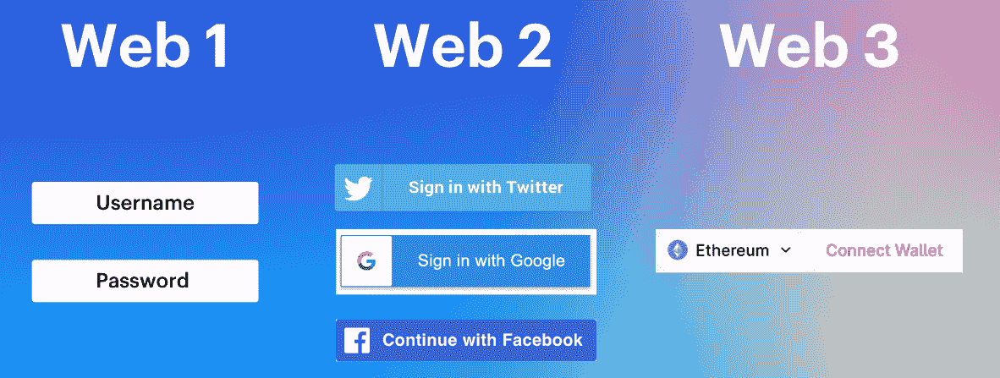
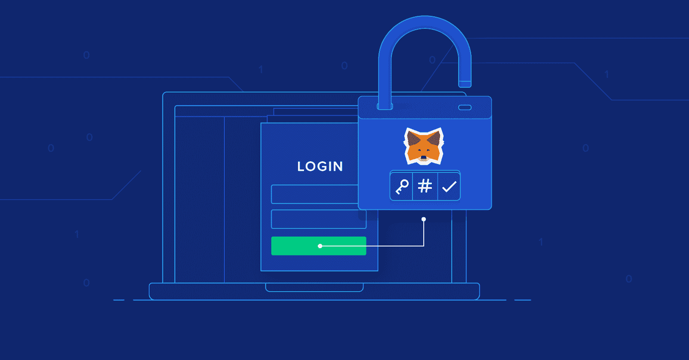
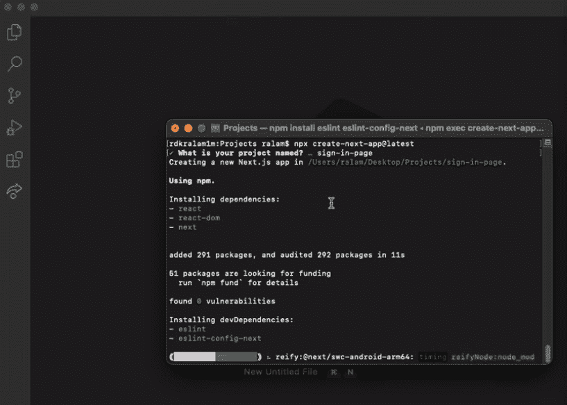
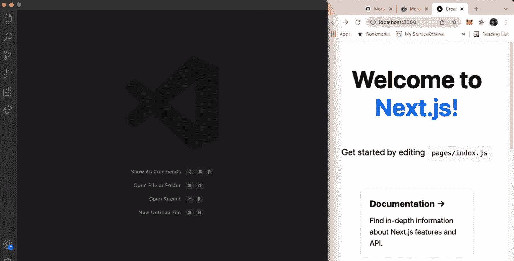
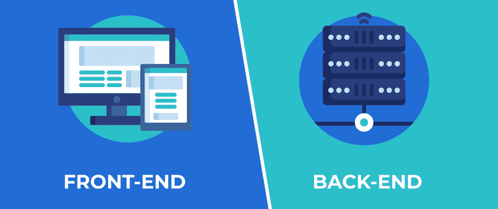
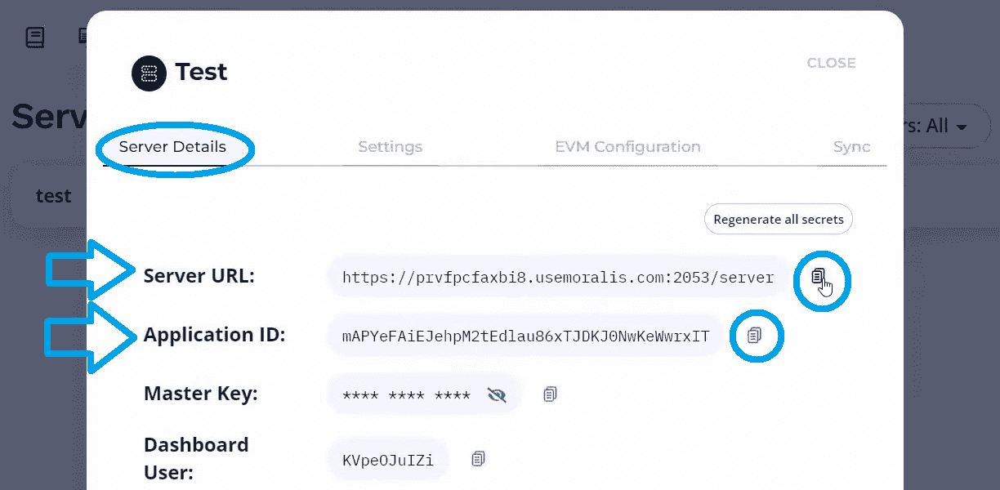

# 如何将 Web3 钱包连接到网站

> 原文：<https://moralis.io/how-to-connect-a-web3-wallet-to-a-website/>

对许多开发者来说，建立一个网页就像在公园里散步一样简单。但是，当转换或实现 [**Web3**](https://moralis.io/the-ultimate-guide-to-web3-what-is-web3/) **时，许多人会感到困惑。当传统程序员试图解决实现** [**Web3 认证**](https://moralis.io/web3-authentication-the-full-guide/) **的初始步骤时，情况尤其如此，这可以使用户将 Web3 钱包连接到网站。如果你觉得这个过程很麻烦，不要担心，我们有一个适合你的解决方案。事实上，以你的 JavaScript 熟练程度，你可以利用 Moralis 轻松实现** [**Web3 登录**](https://moralis.io/how-to-build-a-web3-login-in-5-steps/) **。因此，对于那些想知道“如何连接到 Web3 网站？”问题，这个“如何将钱包连接到网站”的指南将非常有益。**

在接下来的几节中，我们将向您展示如何轻松地将 Web3 钱包连接到网站(也称为[使用 MetaMask](https://moralis.io/how-to-authenticate-with-metamask/) 进行身份验证)。我们将为您提供一个很好的替代 [React](https://moralis.io/react-explained-what-is-react/) 的方案，因为我们将使用 Next.js 创建一个简单的 dapp。后者是一个开源的 web 开发框架，包括一些简洁的功能。然而，其他强大的工具也使我们能够连接到 Web3 网站。因此，我们将利用[超屏蔽](https://moralis.io/metamask-explained-what-is-metamask/)的力量——最受欢迎的 [Web3 钱包](https://moralis.io/what-is-a-web3-wallet-web3-wallets-explained/)。此外，我们将使用最好的 [Web3 后端平台](https://moralis.io/exploring-the-best-web3-backend-platform/)、 [Moralis](https://moralis.io/) 来实现“将钱包连接到网站”功能。这个" [Firebase for crypto](https://moralis.io/firebase-for-crypto-the-best-blockchain-firebase-alternative/) "平台使我们能够用一行代码就包含这一基本功能。为此，您必须首先完成一些初始设置步骤，我们将在此指导您完成这些步骤。因此，为了确保您为今天的挑战做好准备，在继续前进之前，[创建您的免费 Moralis 账户](https://admin.moralis.io/register)。

## 将钱包连接到网站–解释了 Web3 登录

说到 Web3 登录或 Web3 注册，我们通常称之为“Web3 认证”。正如本文的标题所示，我们使用加密钱包或 Web3 钱包来实现这个目的。如果您是加密领域的新手，这可能听起来很复杂。然而，当你使用正确的工具时，这是非常简单的。

如上图所示，通常只需点击一个按钮。此外，用户还需要在他们的钱包内确认他们的登录(也是一个单击操作)。因此，事情在前端非常简单。虽然，这并不一定意味着后端很容易实现。事实上，仍然有许多开发人员通过直接在[以太坊 RPC 节点](https://moralis.io/ethereum-rpc-nodes-what-they-are-and-why-you-shouldnt-use-them/)上构建来进行 dapp 开发。因此，他们面临 RPC 节点的所有[限制。因此，他们要么得不到正确的结果，要么花费大量时间来加入“连接到 Web3”功能。](https://moralis.io/exploring-the-limitations-of-rpc-nodes-and-the-solution-to-them/)

与大多数用户使用电子邮件和密码组合或社交账户登录的 Web2 网站不同，在 Web3 中，用户的加密地址充当密钥。当然，使用一些简洁的工具，[通过电子邮件](https://moralis.io/how-to-do-web3-authentication-via-email/)进行 Web3 认证，甚至 [Web3 社交登录](https://moralis.io/web3-social-login-sign-in-dapp-users-with-google-email-or-twitter/)也是可能的。然而，在 Web3 登录的核心，用户需要有他们的区块链地址与链进行交互。另外，你要知道密码学是一个相当“棘手”的东西。因此，期望用户手动输入他们的加密地址是完全不切实际的，而且对用户也不友好。幸运的是，正如我们在简介中提到的，我们可以依靠现有的工具来简化 Web3 认证。这就是我们在这里的示例项目中要做的。

### 为什么要将钱包连接到网站？

通过以上解释，你会明白当用户将钱包连接到网站时会发生什么——他们实际上是连接到 Web3 网站。这使他们能够与网站所基于的链进行互动。一旦连接上，用户就可以发送、接收和存储可替换和[不可替换令牌](https://moralis.io/non-fungible-tokens-explained-what-are-nfts/) (NFTs)。此外，使用“将钱包连接到网站”的方法，用户可以访问 [NFT 市场](https://moralis.io/how-to-launch-an-nft-marketplace/)、 [GameFi](https://moralis.io/gamefi-tutorial-how-to-create-a-gamefi-game/) 或 [NFT 游戏](https://moralis.io/what-are-nft-games-and-how-to-make-nft-games/)、DeFi 平台和其他加密网站。最终，如果没有加密钱包，你就不可能成为 Web3 用户或者成为区块链开发者。

如上所述，你可以走终极捷径——Moralis。当前 [Web3 技术栈](https://moralis.io/exploring-the-web3-tech-stack-full-guide/)的顶峰是 MetaMask 和 [WalletConnect](https://moralis.io/what-is-walletconnect-the-ultimate-walletconnect-guide/) 集成。因此，你可以让你的用户毫不费力地连接到 Web3 网站。

## 使用加密钱包连接到 Web3 网站

接下来，我们将向您展示如何将 Web3 钱包连接到网站，以及如何为您的用户实现该选项。在这个过程中，我们将使用我们首选的 IDE——Visual Studio Code(VSC)、Next.js、 [Moralis 的 SDK](https://moralis.io/exploring-moralis-sdk-the-ultimate-web3-sdk/) 和[面向开发人员的元掩码](https://moralis.io/metamask-for-developers-how-to-launch-web3-apps-with-metamask/)。此外，与其他一些包含 Web3 登录的方法不同，通过使用上述工具，您可以完全定制您的 [Web3 UI](https://moralis.io/web3-ui-how-to-create-a-great-dapp-ui/) 。然而，这不是连接到 Web3 网站的最快方式。如果你想在几分钟内实现“将钱包连接到网站”的功能，你应该利用终极[以太坊 dapp 样板](https://moralis.io/ethereum-dapp-boilerplate-full-ethereum-react-boilerplate-tutorial/)。

在我们的示例项目中，我们将首先完成 Next.js 项目设置。然后，我们将构建我们的示例前端。接下来，我们将完成初始的 Moralis 设置和 Moralis 集成。在完成前端和后端之后，我们还将检查如何处理错误。但是，让我们从一个快速演示开始，以便更好地了解我们将要构建的内容。

## 将钱包连接到网站–演示

与我们所有的示例项目一样，简单是我们 dapp 的宗旨。因此，下面是我们的示例 Web3 登录的外观:

正如你所看到的，初始屏幕有一个标志和“登录 Moralis”按钮。一旦用户单击上面的按钮，MetaMask 会提示他们确认他们的操作:

如前所述，我们将确保我们的“连接到 Web3 网站”dapp 也能够处理各种错误。例如，假设用户在元掩码的提示下点击“取消”按钮而不是“签名”,那么这就是我们在这种情况下希望他们看到的消息:

当然，我们还需要向用户提供一些他们已经成功登录的指示。因此，这是经过身份验证的用户登录的页面:

上述页面还包括“退出”按钮。因此，用户不必保持登录状态。此外，查看上面的截图，您可以看到我们已经将重点放在了登录页面上。后者是一个合适的“开发级”登录页面。所以，现在是时候卷起你的袖子，加入我们创建“连接到 Web3 网站”dapp 了。

## 如何使用 Next.js 连接到 Web3 网站–项目设置

首先，使用您的终端导航到您想要用于今天的示例项目的文件夹。接下来，确保您运行的是最新版本的节点。当使用 Next.js 时，首先使用“ **npx [【电子邮件保护】](/cdn-cgi/l/email-protection)** ”命令。后者将提示终端要求您输入项目的名称。请随意发挥创意或使用与我们相同的名称——“登录页面”。然后，在创建新项目时等待几秒钟:

安装完成后，需要进入“ **cd 签到页面**”。接下来，您可以使用“ **npm run dev** ”命令运行您的白板应用程序。如果您已经按照说明完成了上述所有步骤，您应该会看到以下内容:

现在，在 VSC(或者您喜欢的代码编辑器)中打开上面创建的项目。为了方便起见，clean slate 应用程序附带了几个默认文件夹和文件:

此外，我们的初始应用程序包含一些模板内容。因为我们不需要它，所以我们想删除它。因此，打开“index.js”文件，删除“”和“”标记之间的所有内容。此外，删除所有“导入”行和“”中的“类名”。整理“index.js”文件后，您应该看到以下内容:

另外，如果这是你第一次使用 Next.js，我们建议你在 0:52 观看下面的视频。在那里，Moralis 专家会很快将 Next.js 与 ReactJS 进行比较。

## 将钱包连接到网站的前端

如上所述，将 JavaScript 技能与 MetaMask 和 Moralis 相结合可以让您走得更远。因此，如果您精通 JavaScript，请使用下面的视频(从 5:12 开始)作为前端开发过程的指南。Moralis 专家将首先向您展示如何使用“global.css”文件来使您的“将钱包连接到网站”页面整洁。然后，他将向您展示如何用自己的 CSS 文件创建一个新的登录组件。在此过程中，您将了解 flexboxes 的基础知识。在大约 17 分钟，你将有前端部分完成，如上述演示。尽管如此，如果您不想编写前端代码，您可以在 [GitHub](https://github.com/MoralisWeb3/youtube-tutorials/tree/main/react-metamask-login) 上访问整个代码。

https://www.youtube.com/watch?v=XmezdzLb154

## 使用 Moralis 连接到 Web3 网站–覆盖后端

当您决定使用 Moralis 来满足您的后端需求时，您需要完成一些初始的 Moralis 设置步骤。以下是使用 Moralis 的 SDK 连接到 Web3 网站必须经过的步骤。

1.  [**登录你的 Moralis 利斯账户**](https://admin.moralis.io/login)——此时，你很可能已经准备好了你的 Moralis 利斯账户。因此，使用您的凭证登录。但是，如果您还没有创建帐户，请使用本文开头的链接创建一个帐户。

2.  [**创建一个 Moralis 服务器**](https://docs.moralis.io/moralis-server/getting-started/create-a-moralis-server)–在您的 Moralis 管理区内，您需要创建一个新的服务器。这包括选择服务器类型和输入服务器的详细信息。*你可以通过点击“创建一个 Moralis 服务器”链接获得非常详细的说明。*

3.  **安装 Moralis SDK**–使用您的终端安装 Moralis SDK，输入“ **npm 安装 moralis** ”，然后输入“ **npm 安装 react-moralis** ”。最后，输入“ **npm run dev** ”命令。

### 通过整合 Moralis 将钱包连接到网站

随着 Moralis 服务器的启动和运行，您可以将 Moralis 集成到您的代码中。这将照顾后端的需求，并使用户能够轻松地连接到网站的钱包。首先访问 VSC 内部的“_app.js”文件。在粘贴 Moralis 服务器的详细信息之前，您需要添加几行代码。具体用上面 24:02 开始的视频教程。

4.  **获取您的 Moralis 服务器的详细信息**–您需要您的服务器 URL 和应用程序 ID，您可以通过点击您的 Moralis 管理区内“服务器”页面上的“查看详细信息”进行查看:

使用您需要的详细信息旁边的复制图标:

5.  **初始化 Moralis**–将上面复制的详细信息粘贴到“_app.js”中:

6.  **添加“连接到 Web3 网站”功能**–这是您向示例 dapp 用户提供轻松连接钱包和网站的部分。从访问“Login.js”文件开始，让上面的视频(26:08)引导你。您将添加几行代码；然而，“ **onClick=(authenticate)** ”将完成*的重任。*

## 连接到 Web3 网站-处理错误

至此，您已经拥有了一个功能齐全的 dapp，可以让您的用户连接到 Web3 网站。然而，正如在我们的演示中提到的，能够正确处理错误也是非常重要的。因此，我们建议您也涵盖我们示例项目的这一方面。因此，从 28:00 开始使用上面的视频。通过完成“将钱包连接到网站”任务的最后一部分，您将确保 UX 更加顺畅。

## 如何将 Web3 钱包连接到网站–摘要

在这篇文章中，我们已经谈了相当多的内容。至此，您知道如何使用加密钱包连接到 Web3 网站。你也知道如何为用户提供一种连接钱包和网站 dapps 的方式。此外，除了涵盖关于 Web3 身份验证和 Web3 钱包的理论，我们还完成了一个非常有用的示例项目。因此，您已经有机会创建自己版本的包含 Web3 登录的简单 dapp。此外，您还有机会熟悉 Next.js。

如果你喜欢这个教程，你应该去看看 YouTube 频道和[Moralis 博客](https://moralis.io/blog/)。这些渠道涵盖了区块链发展的所有领域，从创造[以太坊代币](https://moralis.io/how-to-create-ethereum-tokens-in-4-steps/)到 [Unity Web3 编程](https://moralis.io/unity-web3-beginners-guide-to-unity-web3-programming/)以及这之间的一切。此外，一些最新的话题包括 [NFT 效用](https://moralis.io/nft-utility-exploring-nft-use-cases-in-2022/)、[什么是索拉纳？](https://moralis.io/what-is-solana-the-full-2022-guide/)、一份 [BNB 钱包](https://moralis.io/binance-coin-wallet-guide-how-to-set-up-a-bnb-wallet/)指南、一份 [Web3 视频流媒体服务](https://moralis.io/how-to-create-a-web3-video-streaming-service/)和一份 [Web3 网络克隆](https://moralis.io/how-to-develop-a-web3-netflix-clone/)教程、一份帮助您[创建 ETH 钱包](https://moralis.io/how-to-create-an-eth-wallet-full-guide/)或[多链钱包](https://moralis.io/how-to-build-a-multi-chain-wallet-in-5-steps/)的指南、Web3 游戏的[好处、](https://moralis.io/benefits-of-web3-gaming-full-breakdown/) [Web3 元宇宙](https://moralis.io/web3-metaverse-how-do-web3-and-the-metaverse-fit-together/)等等。除了无数的示例项目之外，您还可以在这些地方找到以简单方式解释的各种加密方面。因此，您可以使用这些平台进行免费的区块链教育。

然而，如果你想尽快成为全职加密员，你应该采取更专业的方法。在这种情况下，你可能会考虑报名参加 Moralis 学院。在那里，你将参加专业级的[课程](https://academy.moralis.io/all-courses)，利用个性化的学习路径，成为一个令人难以置信的社区的一部分，并获得专家指导。

