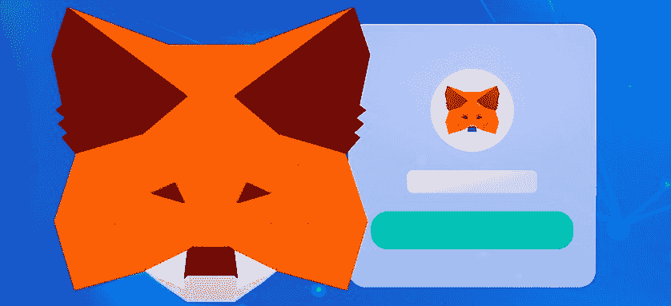
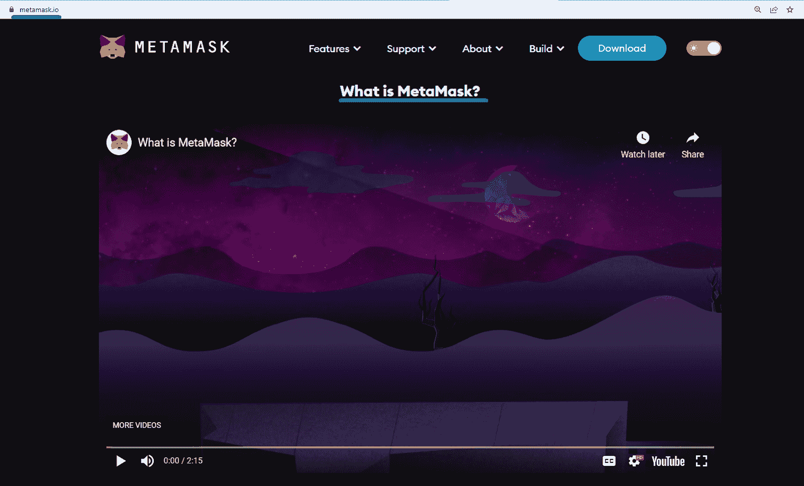
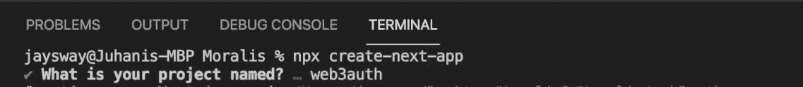
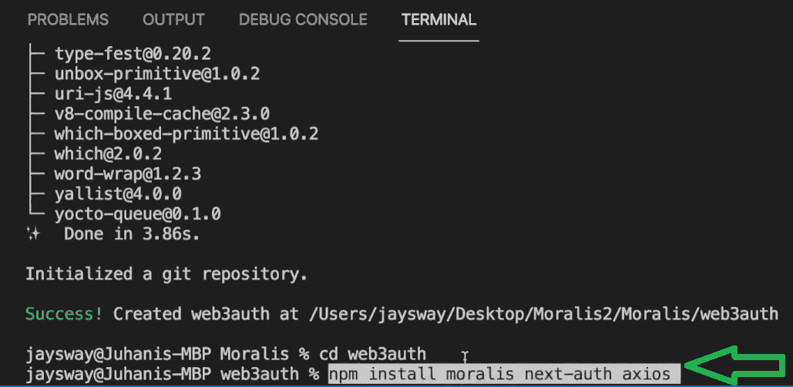
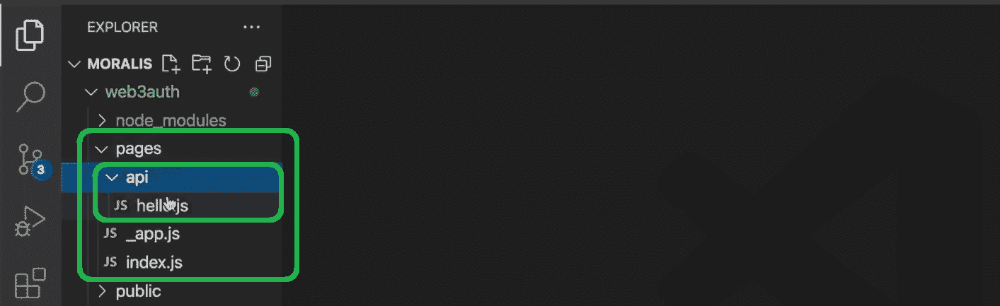
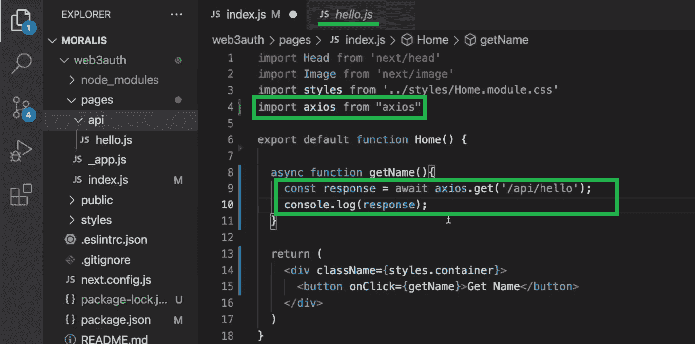
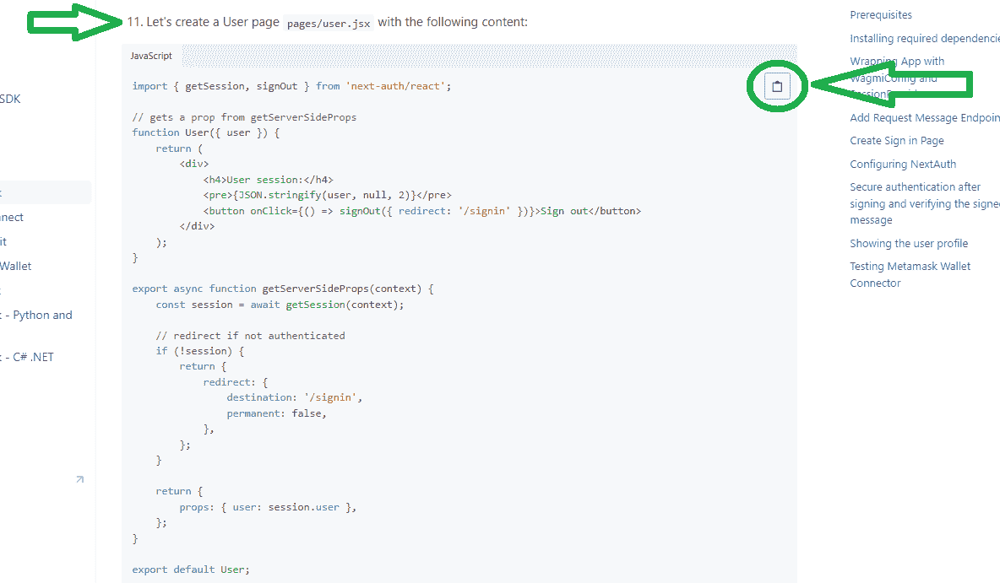
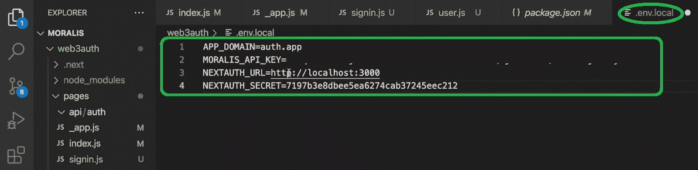
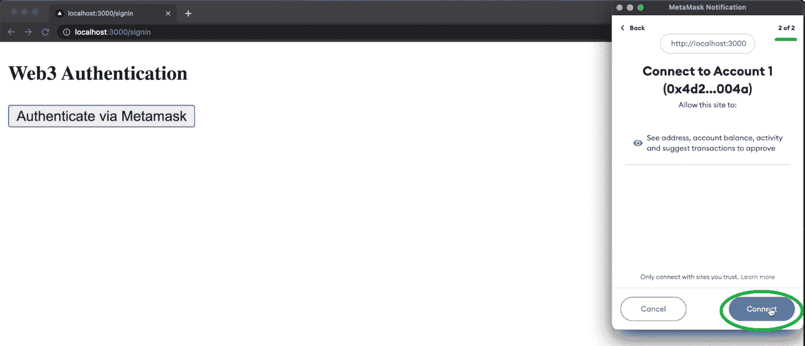

# 如何用 NextJS 将 MetaMask 连接到网站

> 原文：<https://moralis.io/how-to-connect-metamask-to-website-with-nextjs/>

如标题所示，本文展示了作为一名开发人员，如何使用 NextJS 框架将 MetaMask 连接到网站。然而，标题没有提到的是我们将在这里使用的另一个工具——Moralis。就目前的情况而言，MetaMask 充当了与 [**Web3**](https://moralis.io/the-ultimate-guide-to-web3-what-is-web3/) **应用程序交互的初始门户，而 Moralis——领先的企业级 Web3 API 提供商——允许开发人员将 MetaMask 无缝集成到他们的网站中。此外，Moralis'** [**Web3 认证解决方案**](https://moralis.io/authentication/) **使本文的任务成为可能。所以，如果你想知道“如何将元蒙版连接到网站？”问题，这篇文章送给你！**

然而，在我们向您展示如何使用 NextJS 和 Moralis 将 MetaMask 连接到网站之前，我们需要让您了解一下速度。因此，我们将首先确保你们都知道什么是元掩码。然后，我们将指出你应该学习如何将 MetaMask 连接到网站的主要原因。接下来，你将有机会跟随我们的领导，通过我们的教程亲自动手。我们将带您完成整个过程，从初始设置开始。你只需要确保你已经准备好了必要的工具。因此，请确保[创建您的免费 Moralis 账户](https://admin.moralis.io/register)并设置 Visual Studio 代码(VSC)。当然，也要下载 MetaMask 浏览器扩展并创建你的钱包，以防你还没有。这样，一旦你完成了所有的步骤，你就可以带着你的 dapp 去兜风了。

想知道区块链的最新发展吗？请务必 [订阅 Moralis 杂志](https://moralis.io/joindiscord/) *了解 Web3 开发的每周更新！*

## 什么是元掩码

如果您一直在涉足加密，那么您很可能已经使用过这个被称为 MetaMask 的强大工具。当然，这并不意味着你真的知道它是什么。MetaMask 是最受欢迎的 Web3 钱包，主要关注以太坊链。但是，它也支持所有其他与 EVM 兼容的链。但是，您必须自己添加这些网络。

此外，MetaMask 还是其支持的网络上无数可用的 dapps(分散应用)的网关。从本质上说，这个热门的加密钱包是最受欢迎的工具，每个有互联网连接的人都可以用来进行 Web3 认证。因此，只需点击一两个按钮，用户就可以将钱包连接到 dapps。一旦建立了连接，用户就可以与相关 dapp 的所有链上功能进行交互。最终，MetaMask 提供了一种最简单同时也是最安全的方法来连接到基于区块链的应用程序。有了 MetaMask，在 Web3 上进行交互时，您总是处于控制之中。

此外，让我们指出 MetaMask 使您能够购买、存储、发送和交换加密货币。无论您是使用 MetaMask 浏览器扩展还是移动应用程序，它都为您提供了密钥库、安全登录、令牌钱包和令牌交换。因此，它使您能够正确管理您的数字资产。

尽管如此，元掩码允许您拥有自己的数据。它会在您的设备上生成密码和密钥，因此只有您可以访问您的帐户和数据。因此，你可以选择分享什么，保留什么。

*注* *:我们推荐访问“metamask.io”，在那里可以观看一个很酷的视频，解释什么是 meta mask:*

## 为什么将元掩码连接到网站？

仅仅通过阅读介绍和上面的“什么是元掩码”部分，你可能已经明白为什么你应该将元掩码连接到网站。然而，现在让我们澄清使用 MetaMask 背后的目的。

首先，将 MetaMask 用户分为*访问者*和*开发者*是很重要的。当然，它们都使用 MetaMask，但是它们的目的和具体的用例有很大的不同。访问者的目的非常明确——连接到 dapps 并管理他们的加密资产。

另一方面，开发人员主要使用 MetaMask 来测试他们的 dapps 和部署智能合约。在这样做的同时，开发人员也将使用元掩码来处理与访问者相同的操作，但主要是在 testnet/devnet 上。此外，开发人员是整合了 Web3 身份验证选项的人。这取决于他们是否将该选项添加到 dapps 中。只有当开发者在后端将元掩码连接到网站时，访问者才能在前端使用元掩码验证自己。因此，Web3 开发人员充分了解 Web3 提供的所有好处是很重要的。这些好处包括去中心化、抵制审查、不间断访问、数据所有权、透明度等。

那么，作为一名开发人员，为什么要学习如何将 MetaMask 连接到网站呢？为采用新的、改进的互联网 Web3 做出贡献。此外，这也是 Moralis [面向所有人的企业级 Web3 解决方案](http://moralis.io/)能够让您轻松处理 Web3 认证的地方！

### 为什么要用 Moralis？

Moralis 的使命是*让 Web3 的企业开发对所有人开放*，这就是为什么你应该使用 Moralis 的答案。如果你对利用你的 Web2 开发技能加入 Web3 革命感兴趣，那么 Moralis 就是你所需要的。它的企业级 API 使您能够用简短的代码片段来满足与 Web3 相关的后端需求。此外，这一切都始于 Web3 身份验证。

那么，是什么让 Moralis 的后端 Web3 认证功能如此独特呢？首先，它在应用程序中统一了 Web3 钱包和 Web2 账户。此外，它让你拥有和控制所有的用户数据，而不是信任第三方来处理微妙的信息。此外，Moralis Web3 Auth API 与 OpenID、OAuth、DIDs 和其他标准兼容。

此外，您需要知道 Web3 认证只是 Moralis 所能提供的一小部分。通过 Moralis 的 Web3 API、NFT API 和 Streams API，你可以创建各种 dapps。最后，如果你对用简单的方法构建 dapps 感兴趣，Moralis 是你可以使用的工具。这是一个可以节省大量时间和资源的发电站，学习如何使用 NextJS 和 Moralis 将 MetaMask 连接到网站是一个很好的起点。

## 使用 NextJS 和 Moralis 将元掩码连接到网站

最后，您准备好卷起袖子创建一个提供元掩码认证的简单 dapp 了。因此，请跟随我们，我们将向您展示如何使用 NextJS 和 Moralis 将 MetaMask 连接到网站。从打开 VSC 开始。然后创建你的“Moralis”文件夹，并打开一个新的终端。接下来，使用“ *npx create-next-app* 命令。首先，您需要命名您的应用程序(请随意使用我们的名称):

然后，使用“ *cd web3auth* ”命令导航到上面创建的项目。此外，输入“*NPM install moralis next-auth axios*”命令来安装所需的依赖项:

接下来，使用" *npm install wagmi ethers* "命令安装" *wagmi* "和" *ethers* "软件包:

有了所有的依赖项，我们鼓励您查看 NextJS 项目中的默认文件:

请务必关注“pages”文件夹，其中包含我们将继续使用的文件:

“api”文件夹包含所有与后端相关的信息，而“_app.js”和“index.js”文件覆盖了应用程序的前端。

### NextJS 前端-后端通信

您将使用“index.js”文件来处理 NextJS 应用程序的前端-后端通信。首先删除除最外面的 div 之外的默认内容。接下来，用" *Get Name* "按钮填充 div，并添加" *getName* "异步函数:

然后，导入“*axios”*。您可以通过在顶部添加“*从“axios”“*导入 axios”来实现这一点。此外，还定义了“ *getName* 函数的 response 和“*console . log*it:

我们鼓励您在“ *localhost:3000* ”中检查您的进度。为此，输入“ *npm run dev* ”命令。*使用下面的视频(4:49)了解更多细节。*

### 准备前端将元掩码连接到网站

是时候为您的示例 dapp 创建一个简单的前端了。因此，您将关注“_app.js”文件。此外，这个过程很简单，因为您可以从 Moralis 文档中的“[使用 MetaMask](https://docs.moralis.io/docs/sign-in-with-metamask) 登录”页面复制大部分代码。首先复制第四步中的代码:

然后，打开“_app.js”并用上面复制的代码行替换该文件的默认内容:

接下来，您需要创建另外两个页面。从“登录”页面开始。后者将使用户能够将 MetaMask 连接到网站。因此，从文档中复制代码(第七步)并粘贴到您在“pages”文件夹中创建的“登录”文件中:

接下来，您需要创建“用户”页面。这是用户将其 MetaMask 钱包连接到您的 dapp 后将登陆的页面。要获得这个文件的代码，再次使用 Moralis 文档(步骤 11):

*注* *:你可以在下面的视频中获得更详细的代码演练(5:50)。*

### 向您的 NextJS 应用程序添加后端 Web3 身份验证功能

至此，您已经准备好了简单的前端页面。因此，是时候给你的 NextJS 应用添加适当的后端逻辑了。由于这个逻辑将涵盖 Web3 功能，它也将把你的应用程序转换成一个 dapp。您的目标是请求 Moralis 向您发送用户需要签名的登录消息。此外，您还将使用 Moralis 来验证登录消息。最后，在成功验证之后，您的后端需要创建一个经过身份验证的用户，并在“用户”页面上显示他们的详细信息。

首先，转到“api”文件夹，删除“hello.js”文件。接下来，在“api”文件夹中创建一个新文件夹，并将其命名为“auth”。此外，还要在主文件夹(“web3auth”)中创建您的“. env.local”文件:

要了解有关环境变量的更多信息，请使用“使用元掩码登录”文档页面上的第三步。此外，正如您在上面的图片中看到的，其中一个变量是您的 Moralis Web3 API 密钥。幸运的是，获得这个密钥是一个简单的两步过程。然而，你必须准备好你的 Moralis 账户。因此，请务必使用本文开头的“创建你的免费 Moralis 账户”链接。进入 Moralis 管理区域后，转到“Web3 APIs”页面，复制 API 密钥:

#### 创建您的后端文件

现在，在上面创建的“auth”文件夹中创建“request-message.js”文件。然后，用 Moralis 文档中的代码填充这个文件(第五步):

如果您想匹配我们的示例 dapp，请更改“*在此消息上签名以确认您的身份。**【声明】*到 *web3 auth* :

*注* *:详情请看下面(11:00)的视频。*

接下来，为了在用户签署初始消息后对他们进行身份验证，您需要创建另一个端点。因此，在“auth”文件夹中创建另一个文件，并将其命名为“[…nextauth]。js”。用文档中的代码填充这个文件(第九步):

最后但同样重要的是，返回到“signin.js”文件。在那里，您需要添加对上面创建的端点的调用。这些调用是“如何将 MetaMask 连接到网站”这一壮举的重要组成部分。当然，您也可以从文档中复制所需的代码行。只需选择整个“signin.js”内容，并将其替换为步骤 10 中的代码:

至此，您已经成功地用 MetaMask、NextJS 和 Moralis 实现了 Web3 认证。因此，您现在可以运行您的示例 dapp。如果您完全按照我们的说明去做，那么您的 dapp 应该按照下一节所介绍的那样工作。

### 使用元掩码验证网站用户

下面的截图显示了我们的示例 dapp 的要点。此时，您应该知道如何将 MetaMask 连接到网站。此外，如您所见，用户需要点击“通过 MetaMask 认证”按钮:

一旦用户点击认证按钮，元掩码扩展就会弹出。因此，用户需要单击“下一步”按钮，然后单击“连接”:

为了完成流程，用户还需要签署我们的 dapp 签名请求:

根据上一节提供的代码，成功通过身份验证的用户将登陆“用户”页面:

最后但同样重要的是，这是我们在整篇文章中引用的视频教程。它不仅包含所有细节，而且我们的内部 Moralis 专家演示了如何将 MetaMask 连接到网站的具体步骤:

https://www.youtube.com/watch?v=hhkWQPorBKQ

*注意* *:你也可以在* [GitHub](https://github.com/MoralisWeb3/demo-apps/tree/main/nextjs_moralis_auth) *上访问我们这个例子 dapp 的最终代码。*

## 如何使用 NextJS 将元掩码连接到网站–摘要

如果这是你第一次使用 Web3 编程，你会从今天的文章中学到很多。现在您已经知道什么是元掩码，以及如何在 NextJS 应用程序中使用它来创建 dapps。此外，您还了解到 Moralis 是将所有这些联系在一起的工具。多亏了 Moralis，你可以用遗留的编程语言和框架创建 dapps。尽管如此，我们还是带您完成了与“如何将 MetaMask 连接到网站”挑战相关的所有步骤。最后但同样重要的是，您还有机会探索我们的示例 dapp 的演示。

此外，由于 Web3 身份验证是所有 dapp 的起点，您现在已经准备好将您的 dapp 开发提升到下一个级别。当然，您可以继续使用 NextJS 进行构建，或者使用其他框架和开发平台。例如，您可以使用 Unity、Firebase 或 Supabase。因此，你也可以专注于用这些工具结合 Moralis 的力量来开发令人敬畏的 Web3 游戏。此外，别忘了 Moralis 支持多个区块链。因此，你永远不会被任何特定的链所束缚，这保证了你的 dapps 经得起未来的考验。

所以，如果你想获得更多的自信或者免费学习成为一名合格的 Web3 开发者，一定要访问 [Moralis YouTube 频道](https://www.youtube.com/c/MoralisWeb3)和 [Moralis 博客](https://moralis.io/blog/)。在那里，你可以找到无数的范例项目。另一方面，你可能对全职加密感兴趣。在这种情况下，成为区块链认证可以大大提高你找到理想工作的机会。如果你对此感兴趣，一定要考虑报名参加[Moralis 学院](https://academy.moralis.io/)。这也是成为行业中最先进的社区成员的地方。

