# 如何使用 Azure 函数连接 PlayFab 和 Web3

> 原文：<https://moralis.io/how-to-connect-playfab-with-web3-using-azure-functions/>

您知道吗，Moralis 是用 Web3 连接 PlayFab 最简单的方法。如果你想了解更多关于 Moralis 如何让 Web3 游戏开发变得简单明了的信息，请继续阅读，我们将向你展示如何使用 Azure 函数轻松连接到 PlayFab 和 Web3。

本文展示了如何创建一个简单的 Unity 应用程序，允许用户使用他们的 [Web3 钱包](https://moralis.io/what-is-a-web3-wallet-web3-wallets-explained/)登录。此外，一旦登录，它会自动用用户的 Web3 钱包信息填充你的 PlayFab 后端。此外，在五个简单的步骤中，我们快速演示了如何使用任何 Web3 项目连接到 PlayFab！

可访问性源于 [Moralis](https://moralis.io/) 提供的许多工具，如 Moralis 的[web 3 API](https://moralis.io/web3-apis-exploring-the-top-5-blockchain-apis/)。例如，其中一个工具是 Moralis 的 [Web3 Auth](https://moralis.io/authentication/) API，它允许你在你的项目中快速实现几种不同的认证机制。例如，您可以阅读更多关于如何[使用 RainbowKit 添加登录功能](https://moralis.io/how-to-add-a-sign-in-with-rainbowkit-to-your-project-in-5-steps/)或[添加比特币基地钱包登录功能](https://moralis.io/how-to-add-coinbase-wallet-login-functionality/)的信息。

所以，如果你对 Web3 游戏开发感兴趣——或者任何其他开发领域——一定要创建一个 Moralis 账户。注册是免费的，您可以立即开始开发 dapps(分散式应用程序)!

## 什么是 PlayFab？

PlayFab 是一个具有实时分析、LiveOps 和托管游戏服务的游戏后端平台。这些服务允许任何人增加收入和参与度，同时降低成本。

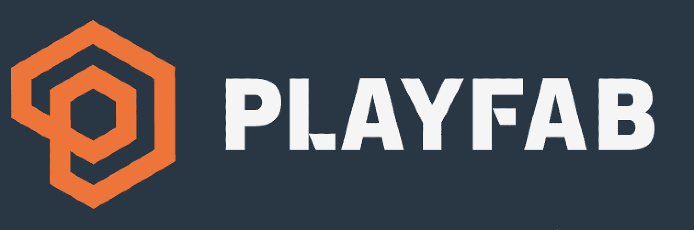

PlayFab 提供的后端服务让游戏开发变得更加容易。因此，开发游戏变得更加容易，PlayFab 为小型和大型工作室提供了经济高效的开发解决方案。以下是 PlayFab 的一些主要功能:

*   借助完整的后端解决方案，消除管理和运行低延迟多人游戏服务器的挑战。
*   PlayFab 使用多种形式的内置身份验证，允许您跨设备跟踪玩家。
*   为用户提供通过游戏内聊天在游戏内交流的能力。

然而，这些只是 PlayFab 提供的突出功能的几个例子。如果你想进一步了解这个平台，请访问[官网](https://playfab.com/)。不过，让我们直接进入本教程的中心部分，探索如何用 Web3 连接到 PlayFab！

## 如何使用 Web3 连接到 PlayFab

随着对 PlayFab 和该平台所包含的内容有了更深刻的理解，是时候说明如何用 Web3 连接到 PlayFab 了。这样，我们将创建一个简单的应用程序，用户可以用他们的钱包登录。一旦通过身份验证，您就可以在 PlayFab 后端访问关于用户的链上数据。此外，借助 Moralis，您只需五个步骤即可轻松连接到 PlayFab 和 Web3:

1.  为 Moralis、PlayFab 和 Azure 函数创建帐户
2.  设置 PlayFab 和 Azure 功能
3.  用 VSC 创建 Azure 函数
4.  用 VSC 部署 Azure 功能
5.  设置 Unity 并连接 Microsoft Azure PlayFab

然而，如果你更喜欢看视频教程，请查看下面来自 [Moralis 的 YouTube](https://www.youtube.com/channel/UCgWS9Q3P5AxCWyQLT2kQhBw) 频道的剪辑。视频举例说明了 PlayFab 与 Web3 连接的全过程。此外，在视频中，一位才华横溢的 Moralis 开发人员会带您完成每个步骤:

https://www.youtube.com/watch?v=xWAzP5otc38&t=337s

尽管如此，你还可以在这里加入我们，我们将向你展示如何在第一步建立所有必要的账户！

## 步骤 1:为 Moralis、PlayFab 和 Azure 功能创建帐户——将 PlayFab 与 Web3 连接起来

如果您还没有，您需要创建一个 Moralis 帐户来启动本教程。这很简单，只需要几秒钟。此外，创建一个 Moralis 账户是完全免费的！

要创建您的帐户，您只需点击 Moralis 网站顶部的“免费开始”按钮，并填写必要的信息:


除了 Moralis 帐户，您还需要为 PlayFab 和 Azure 功能设置帐户。为了尽可能做到无缝，我们建议您创建一个 Microsoft 帐户，因为它可以用于设置 PlayFab 和 Azure。您可以在这里创建一个账户:[https://outlook.live.com/](https://outlook.live.com/)。

有了微软账户，你现在可以轻松地注册 PlayFab 。打开此链接会将您带到下面的页面，如果您有 Microsoft 帐户，您可以单击下面的“登录 Microsoft”按钮:

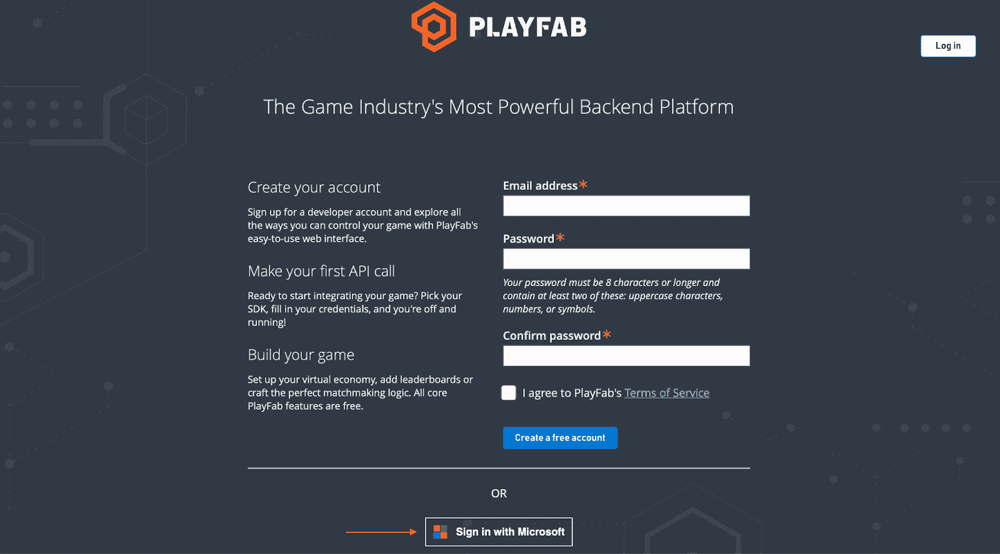

最后，你还需要一个 Azure Functions 账户。要创建您的帐户，请使用以下链接:[https://portal.azure.com/](https://portal.azure.com/)。这将允许您使用之前创建的 Microsoft 帐户登录 Azure Functions。

就是这样；现在，您已经拥有了使用 Web3 连接 PlayFab 的必要帐户。在接下来的部分，我们将仔细研究如何设置 PlayFab 和 Azure 函数！

## 步骤 2:设置 PlayFab 和 Azure 功能——将 PlayFab 与 Web3 连接起来

在这一步，我们将向您展示如何设置 PlayFab 和 Azure 函数。为了使结构尽可能简单明了，我们将这一步分成两个独立的部分，每个部分一个，从 PlayFab 开始！

### PlayFab

我们现在将简要地向您展示如何设置 PlayFab。如果你登录 PlayFab，你会看到一个类似这样的页面:

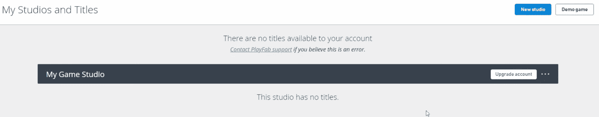

从那里，您将需要创建一个新的标题。在我们的例子中，我们称之为“Moralis”,但你可以随意命名:


一旦你创建了你的新游戏，你将被引导到一个新的页面，这是你游戏的后台。它应该是这样的:

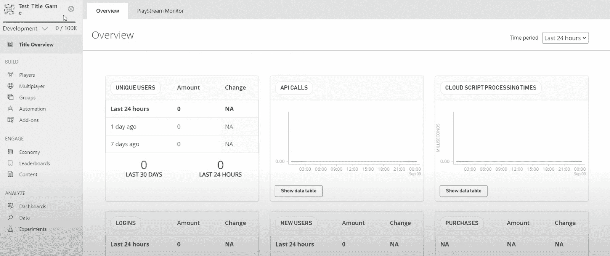

而且，要在 PlayFab 后端运行 Moralis，需要 Azure 函数，这也是你第一步创建账号的原因。然而，要设置 Azure 函数，你需要一些来自 PlayFab 的信息。具体来说，您将需要“标题 ID”和“密钥”信息。要得到这些，你可以点击左边的齿轮，然后点击“标题设置”:

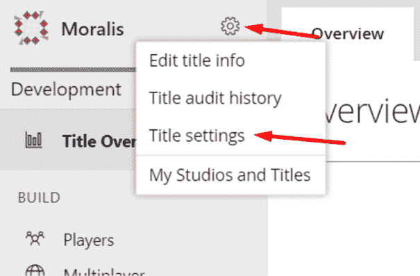

从那里，导航到“API 特性”选项卡以获取“标题 ID”，并导航到“密钥”选项卡以获取“密钥”。保存这两个值，因为您很快就会用到它们。

### Azure 函数

接下来，您需要启动 Azure 功能并创建 Microsoft 客户协议订阅。为此，您可以从点击左上角的“订阅”开始:

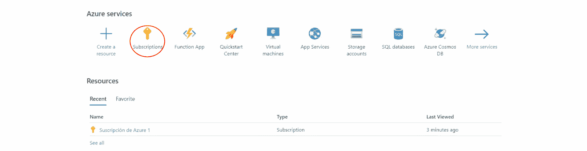

单击此选项卡将带您进入以下页面，您可以通过按“+添加”按钮来添加订阅:

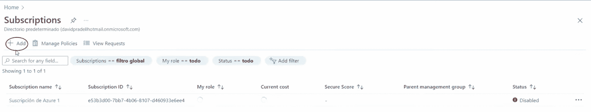

你需要做的就是填写所有必要的字段，点击“审查+创建”，然后点击“创建”。接下来，您需要创建一个新的“功能应用程序”，方法是导航回主页并点击以下按钮:

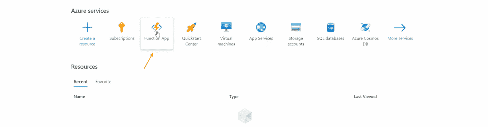

然后，您可以按“创建功能应用程序”来创建“功能应用程序”:

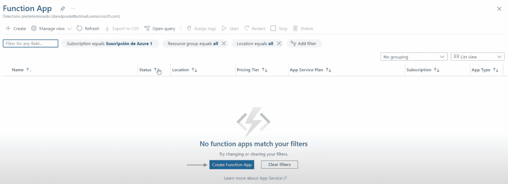

在那里，选择您刚刚创建的订阅，并填写剩余的信息。为了方便起见，这里有一个您需要输入的设置的打印屏幕:

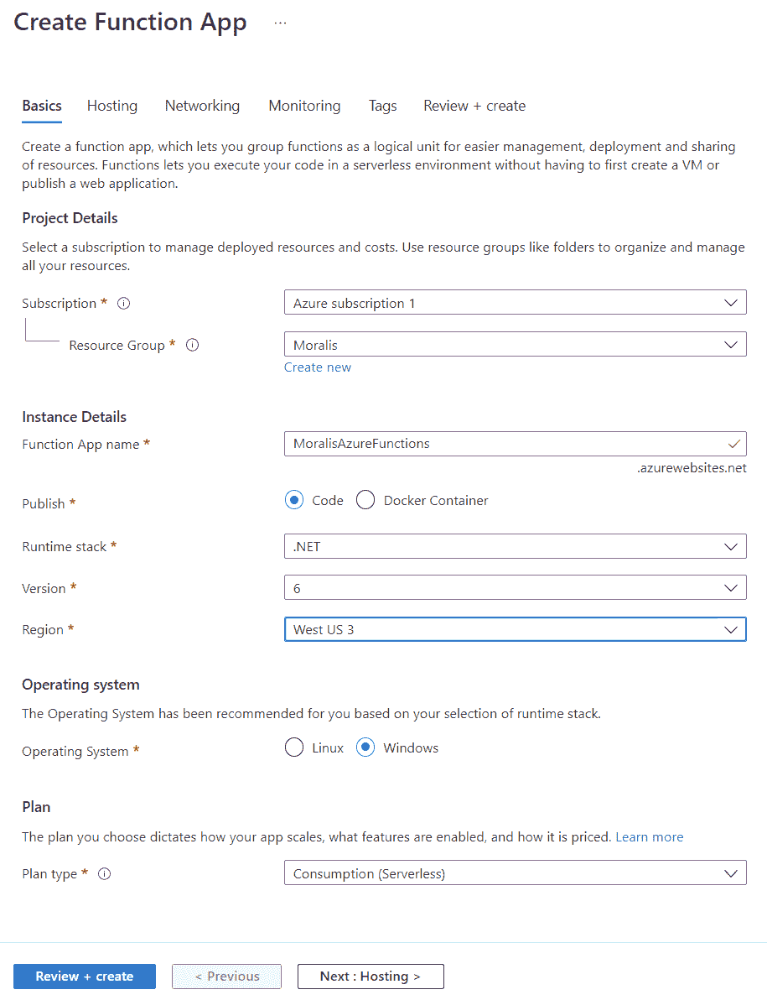

输入所有设置后，单击“查看+创建”和“创建”继续。

### 添加应用程序设置

在这个“函数应用程序”中，您将创建自己的函数。因此，要继续，请导航到您的“功能应用程序”，找到“配置”选项卡，并添加新的应用程序设置:

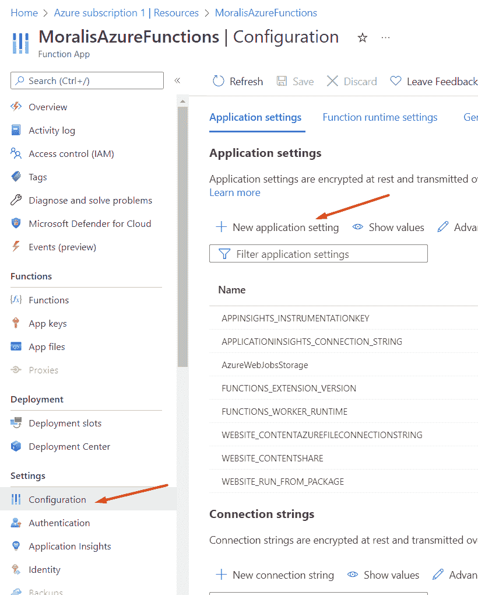

你需要在这里添加几个键。总共，您必须添加五个新设置:

1.  首先，您需要添加您的 Moralis API 密钥。为此，单击“+新应用程序设置”，将名称设置为“MORALIS_API_KEY”，并添加您的 Moralis API 密钥:

    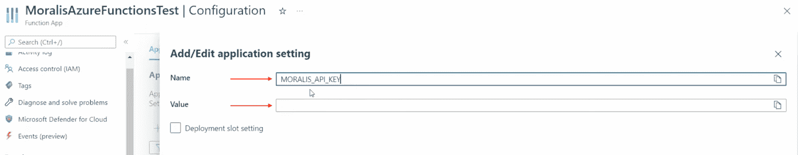

    要找到密钥，您可以导航到 MORALIS 管理面板，单击“Web3 APIs”，并复制“您的 API 密钥”:

    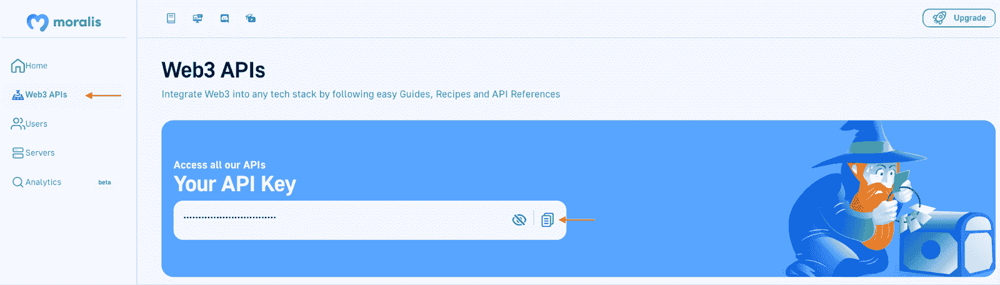
2.  接下来，创建另一个设置，并将其命名为“Moralis 认证 API URL”，其值为:“[https://authapi.moralis.io/](https://authapi.moralis.io/)”。
3.  将第三个设置命名为“Moralis _WEB3_API_URL”，并添加以下值:“[https://deep-index.moralis.io/api/v2](https://deep-index.moralis.io/api/v2)”。
4.  您可以将第四个设置命名为“PLAYFAB_TITLE_ID ”,并粘贴您之前在设置 PLAYFAB 时保存的 play fab“TITLE ID”。
5.  最后，第五个也是最后一个设置应该命名为“PLAYFAB_DEV_SECRET_KEY”，在这里您可以将值设置为您的 PLAYFAB“SECRET KEY”，它也是在设置 play fab 时获取的。

最后，还要确保点击顶部的“保存”:

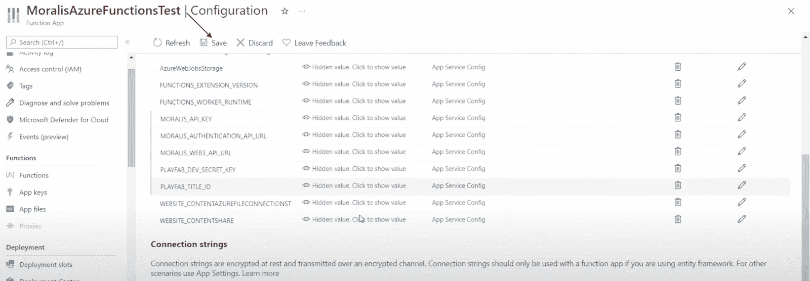

## 第三步:用 VSC 创建 Azure 功能——用 Web3 连接 PlayFab

连接 PlayFab 和 Web3 的第三步分为两个部分。首先，我们将检查必要的先决条件。其次，我们将向您展示如何使用 VSC (Visual Studio 代码)从 Azure 创建函数。所以，事不宜迟，让我们看看您需要满足的先决条件。

### 先决条件

在用 VSC 创建函数之前，您必须考虑一些先决条件。首先，您必须安装。Net 6.0 SDK 使用以下链接:[https://dotnet.microsoft.com/en-us/download/dotnet/6.0](https://dotnet.microsoft.com/en-us/download/dotnet/6.0)。

接下来，你需要[安装 Azure Functions 核心工具](https://learn.microsoft.com/en-us/azure/azure-functions/functions-run-local?tabs=v4%2Cwindows%2Ccsharp%2Cportal%2Cbash#v2)，你可以通过点击链接来完成。向下滚动并点击以下任一选项:

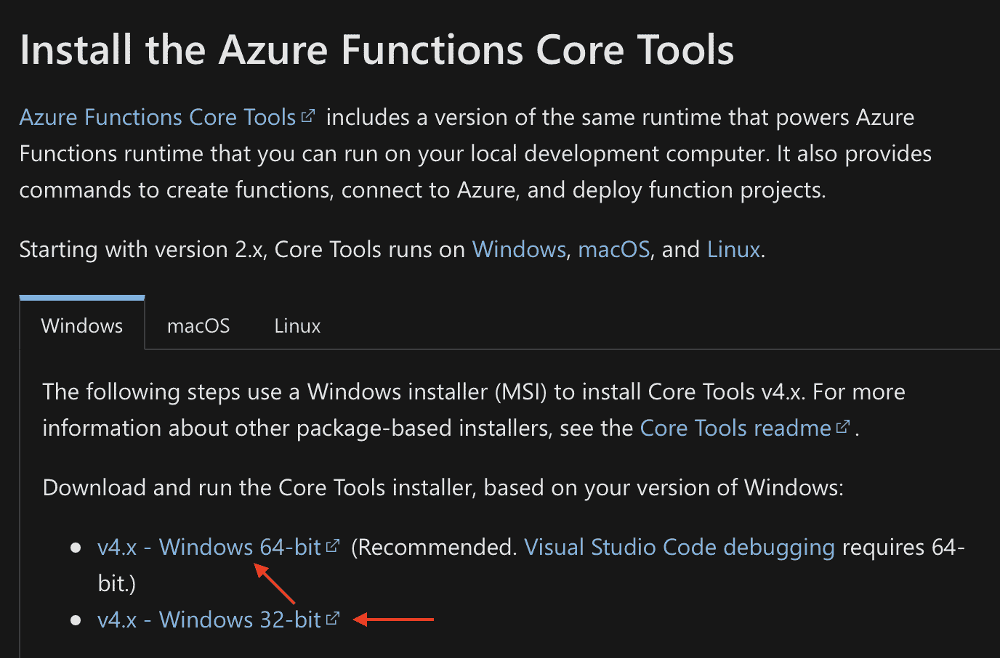

最后，你需要安装 VSC。此外，一旦你有了 VSC，添加 [C#](https://marketplace.visualstudio.com/items?itemName=ms-dotnettools.csharp) 和 [Azure 函数](https://marketplace.visualstudio.com/items?itemName=ms-azuretools.vscode-azurefunctions)扩展。当安装 Azure Functions 扩展时，它应该向 VSC 添加另一个选项卡:

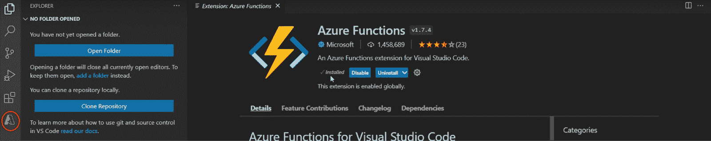

点击此选项卡，点击“登录 Azure”，然后登录您的帐户:

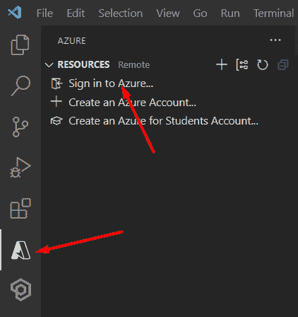

这就是它的先决条件；让我们以下面的部分来创建函数！

### 创建 Azure 函数

考虑到所有的先决条件，我们现在将从 Azure 函数创建方法。因此，首先，导航到“Azure”选项卡，单击“Workspace ”,并创建一个新功能:

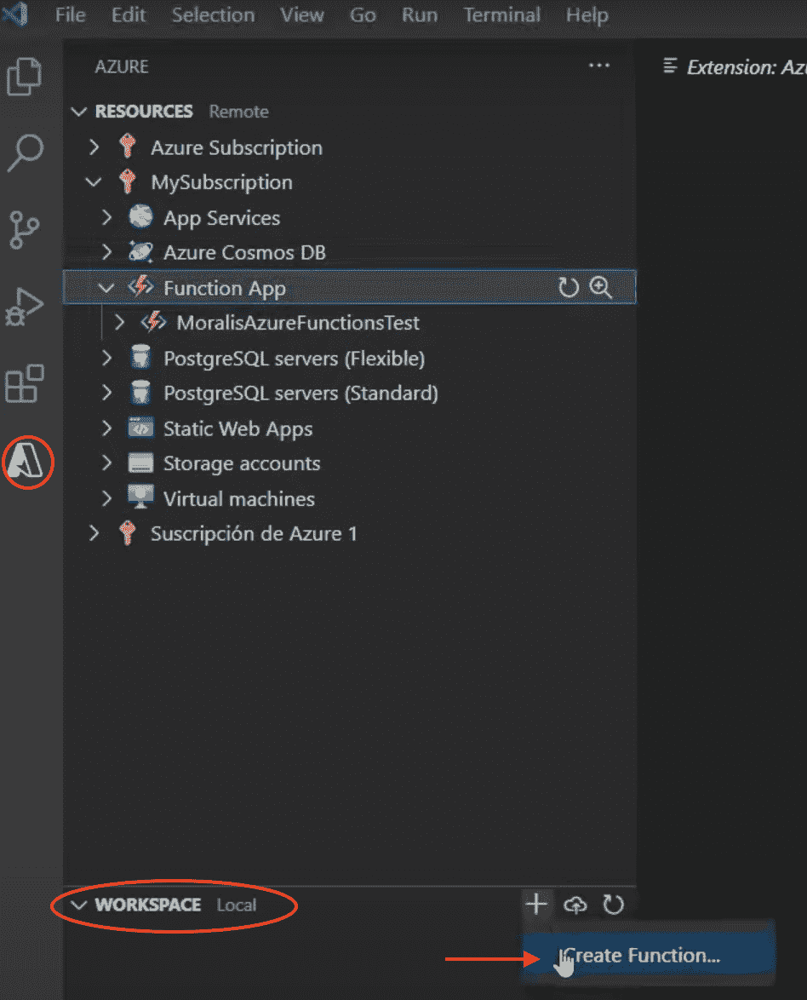

这允许您使用现有的文件夹或全新的文件夹创建新项目。此外，我们将创建一个名为“example-auth-azure-functions”的新文件夹。创建/选择文件夹后，您需要选择一种语言。在这种情况下，您应该选择 C#:

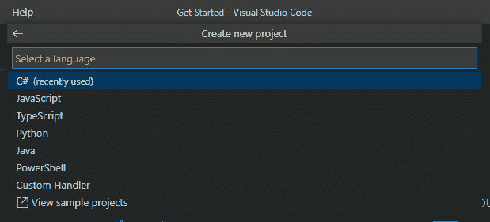

接下来，您需要选择一个”。NET 运行时”，我们将选择”。NET 6.0 LTS”:

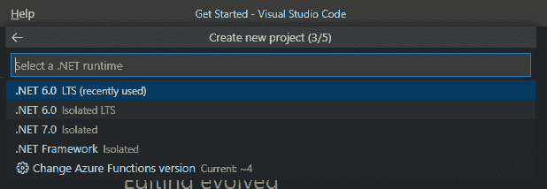

接下来，选择“HTTP 触发器”:

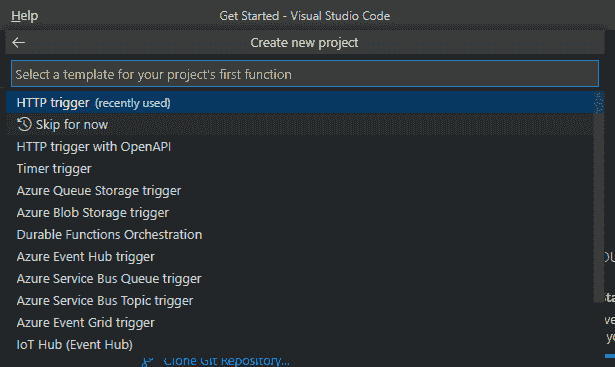

提供根命名空间:


最后，对于“访问权限”，选择“功能”:

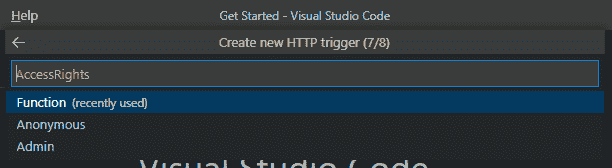

最重要的是，选择“在当前窗口中打开”,并确保在出现的弹出窗口中单击“恢复”:

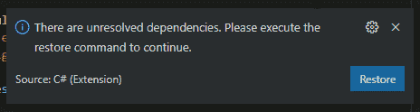

如果您做出这些选择，它应该创建一个包含几个文件的新项目，看起来应该是这样的:

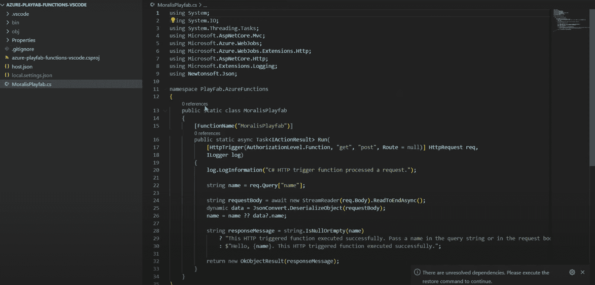

有了这个项目，下一步是添加包。为此，请打开。csproj "文件。该文件将有一个带有一个或多个“PackageReference”的“ItemGroup”元素，您可以用以下代码替换它:

```js
<ItemGroup>
    <PackageReference Include="Microsoft.NET.Sdk.Functions" Version="4.1.1"/>
    <PackageReference Include="PlayFabAllSDK" Version="1.127.220718"/>
    <PackageReference Include="PlayFabCloudScriptPlugin" Version="1.53.190627-alpha"/>
    <PackageReference Include="Moralis" Version="2.0.4-beta"/>
</ItemGroup>
```

一旦你保存了这个文件，它应该会触发另一个弹出窗口，你可以再次点击“恢复”。

最后，访问本教程的 [Moralis 文档](https://docs.moralis.io/docs/using-unity-playfab)并向下滚动到“完整的 MoralisPlayFab.cs”部分。您可以复制整个代码并替换“MoralisPlayFab.cs”文件中的所有内容。

## 第四步:用 VSC 部署 Azure 功能——用 Web3 连接 PlayFab

要使用 VSC 部署功能，您需要右键单击“MoralisAzureFunctions”并选择“部署到功能应用程序…”选项:

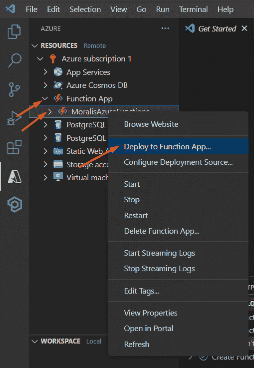

在那里，您需要单击“部署”:

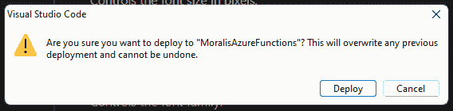

接下来，您可以导航到 PlayFab，找到标题 ID 仪表板，然后单击“自动化”选项卡:


现在你需要注册五个函数。为此，单击“注册功能”，并将“触发”类型设置为“HTTP”:

将“ChallengeRequest”作为名称，并从 VSC 复制函数 URL。您可以通过右键单击“函数”下的“挑战请求”并按“复制函数 Url”来获取 URL:

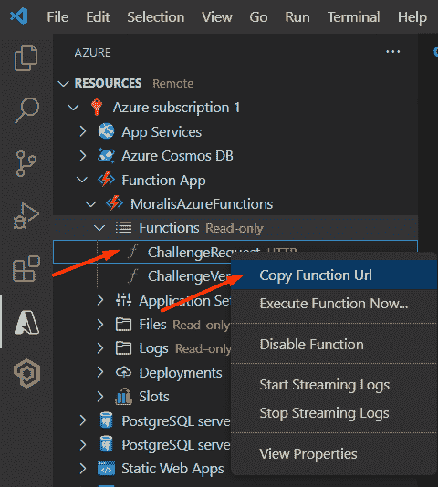

将此 URL 粘贴到 URL 字段，然后选择“注册功能”。

您可以对其他四个功能进行同样的操作。因此，最后，您的 PlayFab 管理面板中应该会有这样的内容:

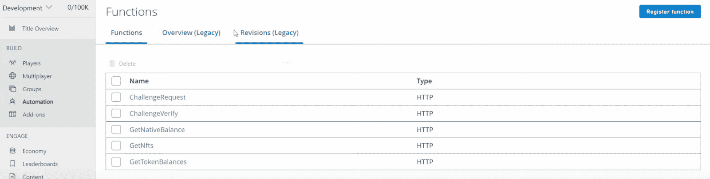

## 步骤 5:设置 Unity 并连接 Microsoft Azure PlayFab–将 play fab 与 Web3 连接

部署好函数后，最后一步是从 Unity 中调用这些函数。为了让这个过程更容易理解，我们将使用 Moralis PlayFab Unity 演示项目。可以在以下链接找到演示项目:[https://github . com/moralis web 3/demo-unity-moralis-auth-via-play fab/archive/refs/heads/main . zip](https://github.com/MoralisWeb3/demo-unity-moralis-auth-via-playfab/archive/refs/heads/main.zip)。

如果你下载了这个项目，用 Unity 打开它，你会看到这样的内容:

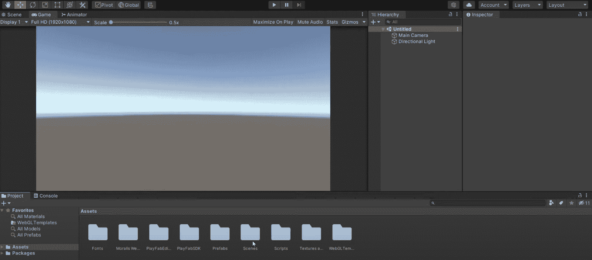

然后你可以点击“场景”和“样品场景”，看起来应该是这样的:

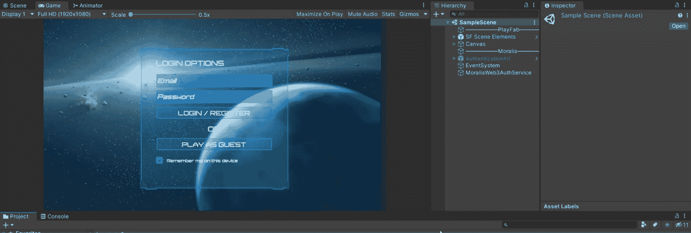

接下来，您需要登录。因此，点击顶部的“窗口”标签，然后点击“PlayFab”，然后点击“编辑器扩展”:

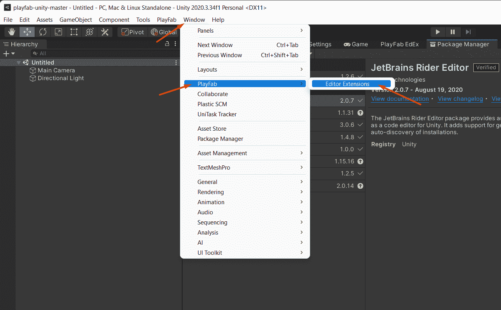

在那里，单击“PlayFab”选项卡，然后单击“MakePlayFabSharedSettings”:


接下来，你可以在检查器中打开它，输入你在本教程第二步中获取的“标题 ID”和“密钥”。因此，它应该是这样的:


现在是测试应用程序是否工作的时候了。因此，您可以使用顶部的播放按钮运行应用程序，然后选择“作为来宾播放”:

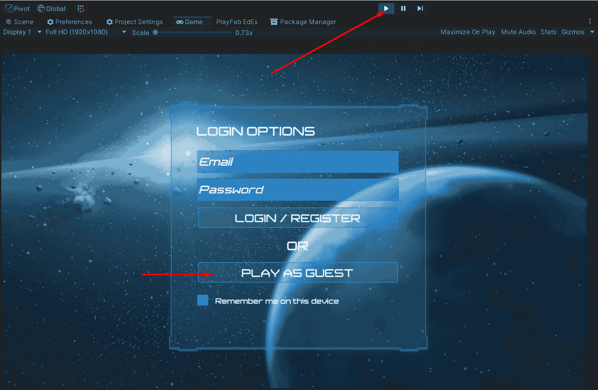

接下来，您可以点击“连接钱包”来连接您的钱包:

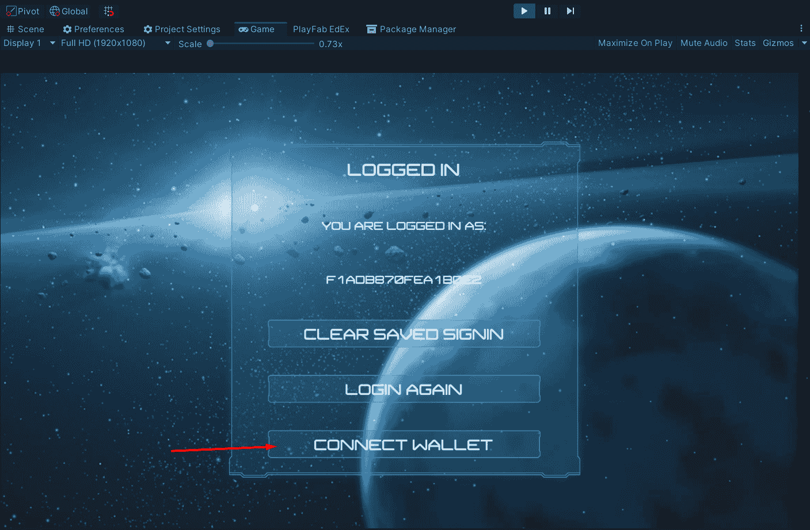

这将显示一个二维码供您扫描。此外，一旦您确定了您的 [Web3 身份](https://moralis.io/web3-identity-the-full-guide-to-authentication-identity-and-web3/)，钱包信息将被添加到 PlayFab 中的玩家档案中。因此，要检查这一点，请在 PlayFab 中导航到“球员”，然后单击“球员数据”:

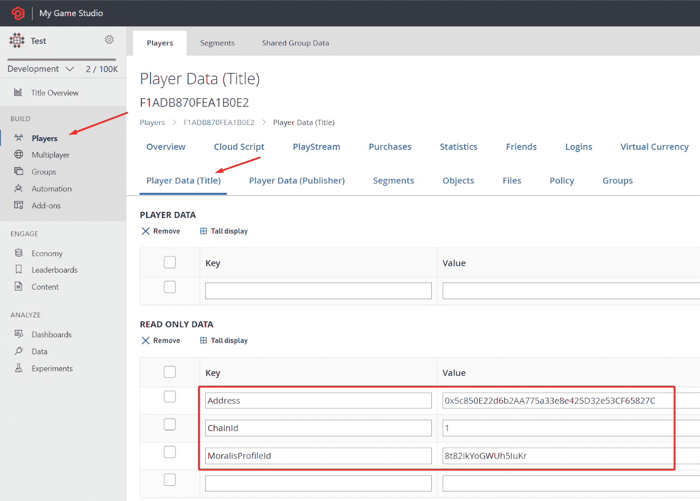

就是这样！您现在知道如何将 PlayFab 与 Web3 连接起来，并且可以立即开始构建令人惊叹的 Web3 游戏！如果你在本教程中遇到了问题，请查看之前的视频，因为它可能会回答你的一些问题！

## 如何通过 Web3 连接到 play fab–总结

在本文中，您使用 Azure 函数轻松连接到了 PlayFab 和 Web3。此外，多亏了 Moralis，你只需五个步骤就能做到:

1.  为 Moralis、PlayFab 和 Azure 函数创建帐户
2.  设置 PlayFab 和 Azure 功能
3.  用 VSC 创建 Azure 函数
4.  用 VSC 部署 Azure 功能
5.  设置 Unity 并连接 Microsoft Azure PlayFab

这允许您创建一个简单的 Unity 应用程序，用户可以使用他们的 Web3 钱包登录。一旦他们通过认证，你的 PlayFab 后台会自动填充用户钱包的相关信息。因此，当涉及到 Web3 游戏开发时，本教程提供了一种在后端访问[链上数据](https://moralis.io/on-chain-data-the-ultimate-guide-to-understanding-and-accessing-on-chain-data/)的简单方法。

如果你觉得这个教程有帮助，我们推荐你在 Moralis 的 [Web3 博客](https://moralis.io/blog/)查看更多内容。例如，学习[只用三个步骤](https://moralis.io/how-to-create-a-decentralized-app-in-just-3-steps/)创建一个去中心化的应用程序，或者[如何构建一个 Web3 FIFA 克隆版](https://moralis.io/how-to-build-a-web3-fifa-clone/)。

此外，如果你想了解更多关于 Moralis 功能的信息，可以查看该平台的其他 API。例如，了解更多关于 Moralis 的 [Web3 Streams](https://moralis.io/streams/) API，它允许您将区块链数据直接传输到项目的后端。

然而，如果你想用 Web3 连接 PlayFab 或者[开发一个 Web3 应用](https://moralis.io/how-to-build-a-web3-app/)，[现在就注册 Moralis](https://admin.moralis.io/register) ！