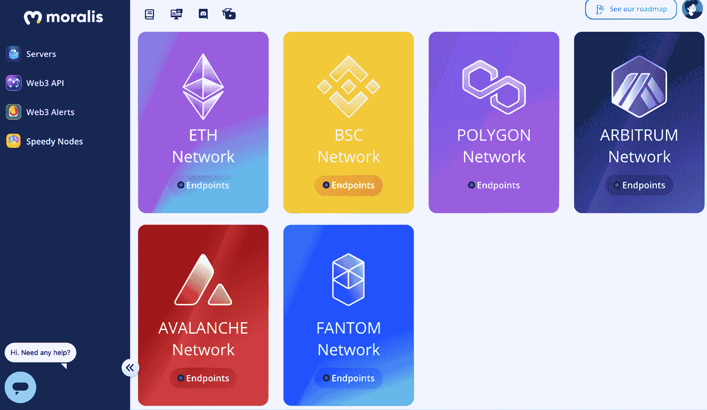
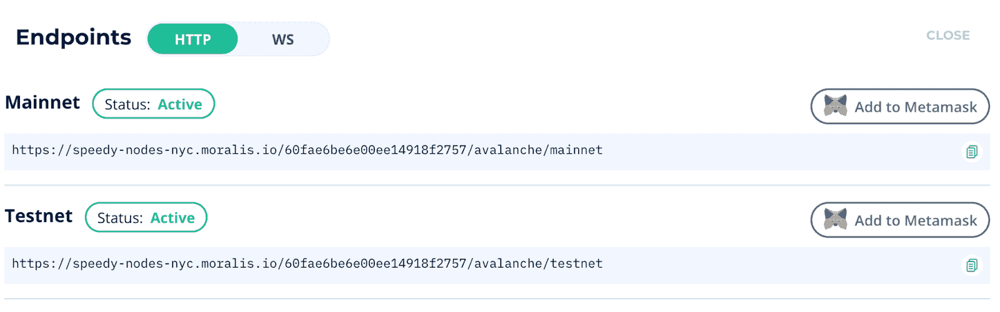

# 如何连接到雪崩节点

> 原文：<https://moralis.io/how-to-connect-to-avalanche-nodes/>

根据你对 [**Web3**](https://moralis.io/the-ultimate-guide-to-web3-what-is-web3/) **开发的实际经验，它可以是不言而喻的，也可以是相当混乱的。因此，如果你是区块链世界的新手，** [**dApp 开发**](https://moralis.io/how-to-build-decentralized-apps-dapps-quickly-and-easily/) **可能看起来是一项艰巨的任务。然而，如果你用合适的工具来装备自己，这并不一定。一个这样的工具是区块链节点，这在开发**[**dApps**](https://moralis.io/decentralized-applications-explained-what-are-dapps/)**时至关重要。节点是任何区块链的重要组件，因为它们允许用户和应用程序直接与区块链通信。因此，如果你发现自己正在寻找，例如，开发雪崩 dApps，那么你可能会发现你需要连接到一个雪崩节点。然而，找到一个快速可靠的节点并不总是容易的。因此，我们将通过这篇文章进一步了解如何连接到雪崩节点。**

尽管节点对区块链的生态系统至关重要，但建立和持续管理自己的节点可能是一项麻烦的任务。出于这个原因，开发人员正转向区块链节点提供商，因为他们是更方便的选择。一个很好的选择是[Moralis。](https://moralis.io/)

Moralis 是 Web3 开发的首要操作系统，通过 Moralis 的快速节点，您可以从六个不同的网络(其中一个是 Avalanche)立即访问快速可靠的节点。此外，Moralis 还为所有用户提供底层后端基础设施。这使得开发人员可以在几个小时内构建 dApps，而不是几周或几个月。

所以，如果你想成为一名区块链开发者，那就和 Moralis 签约吧。创建一个帐户是免费的，你将立即获得后端基础设施和所有的 Moralis 工具。

### 雪崩解释——什么是雪崩？

Web3 开发中最著名的区块链是以太坊，因为这个网络是 dApps 广泛生态系统的家园。然而，随着越来越多的人加入加密社区，以太坊网络遇到了网络拥塞的问题。这将交易成本推高到天文数字，使得加入网络在经济上不可行。这刺激了企业提出解决这些问题的潜在解决方案，其中之一就是雪崩。


Avalanche 是一个面向 dApps 的可编程智能合约平台，专注于解决以太坊的一些重大问题。因此，该平台同时关注交易成本和速度。因此，Avalanche 有助于在不牺牲安全性和分散性的情况下解决以太坊的可扩展性问题。

艾娃实验室是雪崩背后的组织，根据官方网站，他们表示他们已经创建了业界最快的智能合同平台。此外，他们还进一步声明，他们拥有所有保护网络安全的利益相关证明(PoS)协议中最有效的验证程序。

雪崩网络的独特之处在于，它由三个不同的链组成，每个链都专注于不同的任务。有交易所(X)，平台(P)链，合约(C)链。后者是 [EVM](https://moralis.io/evm-explained-what-is-ethereum-virtual-machine/) 或以太坊虚拟机的一个实例。此外，由于 EVM 兼容性，雪崩网络是固体兼容的。这将允许你[使用](https://moralis.io/how-to-create-smart-contracts/) [Solidity](https://moralis.io/solidity-explained-what-is-solidity/) 创建智能合同，这是用于区块链开发的[最佳语言之一](https://moralis.io/best-languages-for-blockchain-development-full-tutorial/)。

因此，在 Avalanche 网络上开发 dApps 和智能合约时，可以利用全面且成熟的开发工具，如 [Remix](https://moralis.io/remix-explained-what-is-remix/) 、 [Truffle Suite](https://moralis.io/truffle-explained-what-is-the-truffle-suite/) 等。，使区块链编程更容易。

不过，如果你想了解更多关于雪崩网络的信息，那么我们建议你仔细看看他们的[官方网页](https://www.avax.network/)。

### 快速节点——作为节点提供商的 Moralis

Moralis 是 Web3 开发的首要操作系统，作为一个 Moralis 用户，有可能大大缩短所有区块链项目的开发时间。与 Moralis 合作的力量来源于所有用户都可以访问的已经开发的后端基础设施。这使得开发人员可以专注于前端和[智能合约](https://moralis.io/smart-contracts-explained-what-are-smart-contracts/)开发，从而避免设置复杂的底层后端基础设施的麻烦。


此外，Moralis 提供了一个广泛的工具箱，里面有各种不同的开发工具，其中之一就是 Speedy Nodes。 [Moralis 的快速节点](https://moralis.io/speedy-nodes/)是市场上最可靠和最快的节点。通过 Speedy Nodes 服务，你可以访问来自六个不同网络的节点:以太坊、Arbitrum、BSC(币安智能链)、Polygon、Fantom，当然还有 Avalanche。

此外，Moralis 为一些网络提供了[存档节点](https://moralis.io/what-are-full-archive-nodes/)。因此，如果您的任何区块链项目需要区块链过去状态的即时信息，您可以访问某些节点的完整历史。此外，Moralis 在不断发展，并不断添加到平台中，为新的链和功能提供支持，这很容易理解为什么开发人员选择 Moralis。

最后，Speedy Nodes 还与 Moralis 生态系统完全集成。这将让你轻松快速地开发 dApps。这只是许多伟大 Moralis 家的特征之一。要了解更多信息，请随意访问 [Moralis 博客](https://moralis.io/blog/)，在那里您可以找到更多令人兴奋的文章，这些文章可以让您成为更好的区块链开发人员。

# 如何使用 Moralis 连接到雪崩节点

随着对什么是 Moralis 的快速节点有了更好的理解，我们可以转移到主要话题，并解释如何连接到雪崩节点。在访问节点之前，您需要有一个帐户。所以，如果你还没有，第一步是注册 Moralis。

手头有一个帐户，你会发现在 Moralis 管理面板左侧的“快速节点”标签。一旦你点击这个标签，你会看到六个不同的替代网络，其中，你会发现雪崩网络。要连接到雪崩节点，您需要点击相关网络的“端点”按钮。这将为您提供两个不同的 URL，作为 Avalanche 的测试和主网络的 Moralis 支持节点。因此，您可以根据您计划在哪里开发/推出 dApp 来选择您喜欢的产品。



您从这个过程中获得的 URL 或端点可以被视为节点本身。这意味着您可以在命令行或代码中直接使用这些 URL，例如，查询有关用户 [ERC-20](https://moralis.io/erc20-exploring-the-erc-20-token-standard/) 令牌余额、 [NFT](https://moralis.io/non-fungible-tokens-explained-what-are-nfts/) 余额、当前块号等信息。

现在就是这样！这就是作为 Moralis 用户获得一个节点是多么容易！此外，如果您有兴趣为另一个链构建 dApps，我们也有关于如何连接到 BSC 节点和如何连接到以太坊节点的优秀指南。由于 Moralis 的魔力，所有这一切都是可能的，所以如果你对扩展你的区块链编程能力感兴趣，那么立即注册 Moralis。

## 如何连接到雪崩节点——实例

了解了作为 Moralis 用户如何获得快速节点以及端点的实际含义后，我们将提供两个如何使用节点的实际例子。首先，我们将演示如何将一个 [JavaScript](https://moralis.io/javascript-explained-what-is-javascript/) 项目连接到 Avalanche 网络，然后我们将仔细看看如何通过高速节点改变 MetaMask 网络。


然而，这仅仅触及了 Moralis 快速节点的表面。有关快速节点和 Moralis 的更多信息，请随意访问 [Moralis 文档](https://docs.moralis.io/)。例如，在这里你可以找到如何着手你的第一个区块链项目的指南。这涵盖了从入门到更高级开发的所有内容，比如检查令牌余额、发送令牌以及[如何使用 MetaMask](https://moralis.io/how-to-authenticate-with-metamask/) 进行认证。

## 如何使用 Moralis 的快速节点将项目连接到 Avalanche

如果您正在为 Avalanche 网络开发一个区块链项目，您需要将一个节点连接到您的代码。例如，如果我们将端点添加到项目中，就有可能在 Avalanche 链中查询当前的块号。这个过程的第一步是导入 Web3 库 [Web3.js](https://moralis.io/web3-and-javascript-what-is-javascript-and-web3-js/) 。有多种方法可以导入库，但在本例中，我们将使用以下脚本:

```js
<script src=”https://cdn.jsdelivr.net/npm/[email protected]/dist/web3.min.js"></script> 
```

导入库后，我们可以简单地继续添加提供者。这就是端点 URL 派上用场的地方。因此，我们现在需要做的就是复制 URL 并添加以下三行来指定提供者，在本例中应该是 Avalanche:

```js
const NODE_URL = "YOUR SPEEDY NODE URL HERE";
const provider = new Web3.providers.HttpProvider(NODE_URL);
const web3 = new Web3(provider);
```

将节点添加到项目中后，就可以查询链中的各种信息。如上所述，例如，可以获取当前的块号。这里我们需要做的就是使用我们之前导入的 Web3 库。

### 如何用 Moralis 的快速节点改变元掩码网络

快速节点的另一个用例是它们可以用来改变元掩码网络。如果你想继续这里，第一步是获得一个元掩码帐户。如果你不熟悉这个扩展，我们推荐你看看下面这篇关于[元掩码](https://moralis.io/metamask-explained-what-is-metamask/)的文章。这将提供元掩码的概述，并帮助您获得自己的加密钱包。

一旦您有了元掩码帐户，您就可以在网络之间切换。要做到这一点，你需要做的就是点击元掩码界面顶部的“网络”标签。然而，你很快就会注意到这个列表并没有包含很多不同的网络。因此，您可以添加自己喜欢的内容。



您可以利用两种不同的方法向元掩码添加新网络；要么点击“添加网络”并手动输入所有信息，或者您可以简单地使用 Moralis 的 Speedy Nodes。如果你选择了快速节点选项，你需要做的就是回到管理面板中的“快速节点”标签，点击想要的网络，最后点击“添加到 MetaMask”按钮。

点击此按钮将打开您的 MetaMask 帐户，您需要做的就是按照说明进行操作。这样做将允许您在几秒钟内将新网络添加到元掩码中。

## 如何连接到雪崩节点—总结

如果您发现自己希望在雪崩网络上创建 dApps，那么您还会发现需要一个雪崩节点。设置、开发和管理您自己的节点可能相当麻烦。因此，这是一种不必要的时间和资源密集型实践，这也是许多人转向区块链节点提供商的原因。


A [区块链节点提供商](https://moralis.io/infura-alternatives-and-blockchain-node-providers/)是连接到雪崩节点的最简单快捷的方式，市场上最好的提供商是 Moralis。通过 Moralis 的快速节点，您不仅可以立即访问雪崩节点，还可以访问另外五个网络的节点。因此，你也可以[构建 ETH dapp](https://moralis.io/how-to-build-eth-dapps-quickly/)或[创建 BSC dapp](https://moralis.io/how-to-create-bsc-dapps-quickly/)就像这些被支持的网络一样容易。

然而，本教程展示了使用 Moralis 连接到 Avalanche 节点是多么容易，因为您所需要的只是一个帐户。我们还演示了如何将您的区块链项目连接到一个节点，以及在使用 Moralis 时更改元掩码网络是多么容易。

尽管 Moralis 是一个节点提供者，但这仅仅触及了操作系统的皮毛。当使用 Moralis 时，可以利用平台的底层后端基础设施，这使得 dApp 开发变得更加容易。此外，除了快速节点，还有其他工具，如 [NFT API](https://moralis.io/ultimate-nft-api-exploring-moralis-nft-api/) 、[Moralis 的 SDK](https://moralis.io/exploring-moralis-sdk-the-ultimate-web3-sdk/) 、对 [IPFS](https://moralis.io/what-is-ipfs-interplanetary-file-system/) 的本地支持等等。

所以，如果你正在寻找建立你的第一个 dApp，加入 65，000 多个区块链项目，今天就和 Moralis 签约吧！注册是免费的，只需要几分钟就可以开始你的第一个区块链项目！