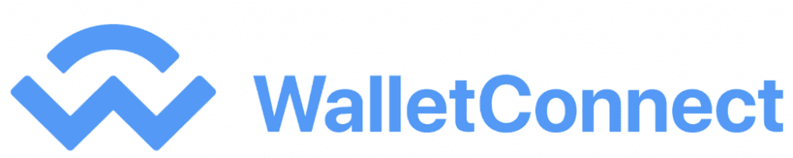
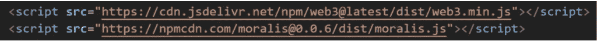
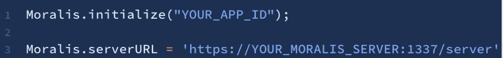
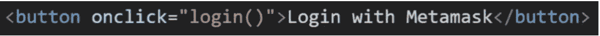
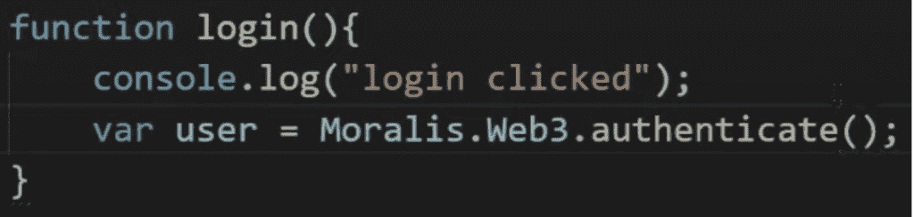
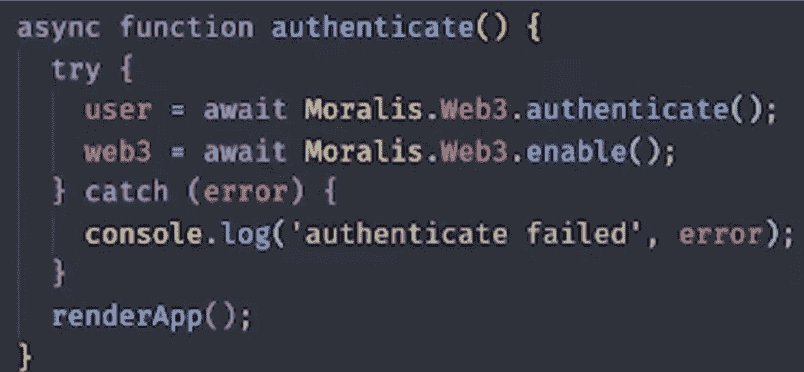
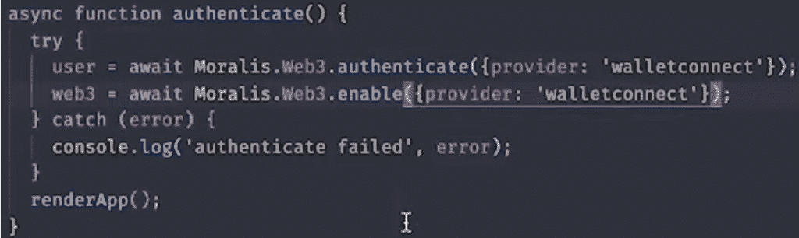

# 如何用 WalletConnect 连接用户

> 原文：<https://moralis.io/how-to-connect-users-with-walletconnect/>

[**开发 dApps**](https://moralis.io/how-to-build-decentralized-apps-dapps-quickly-and-easily/) **(去中心化应用)时，用户认证是一个必不可少的方面，因为它对于确定合法的钱包所有者至关重要。通过对用户进行身份验证，他们可以与**[**dapp**](https://moralis.io/decentralized-applications-explained-what-are-dapps/)**进行交互，使开发人员能够访问有关 NFTs、令牌余额等的信息。，以及其他重要的功能。然而，如果没有合适的工具，对用户进行身份验证会非常麻烦。这是** [**Moralis 家**](https://moralis.io/) **通过使认证过程变得轻而易举而解决的事情。开发人员将知道，可以使用许多方法和替代方案来验证用户。例如，我们之前已经展示了** [**如何使用 Moralis 使用元掩码**](https://moralis.io/how-to-authenticate-with-metamask/) **来认证用户。然而，在本文中，我们将更深入地研究如何用 WalletConnect 连接用户，并在此过程中利用 Moralis。**

Moralis 是下一代 dApp 和 Web3 开发平台，为用户提供从 idea 到全功能 dApp 的完整体验。此外，Moralis 允许用户访问完全托管的无服务器后端基础设施，从而使使用 WalletConnect 认证用户变得更加容易。因此，使用 Moralis 的开发人员只需几行代码就可以构建具有 WalletConnect 身份验证本地支持的 dApps。鉴于这种情况，本文还特别关注如何通过 Moralis 将用户与 WalletConnect 连接起来。

此外，这仅仅是 Moralis 的众多用例之一，该平台为 Web3 开发提供了各种其他有价值的工具。[Moralis Speedy Nodes](https://moralis.io/speedy-nodes/)、NFT 余额、实时提醒只是平台上的用户可以访问的便捷开发工具的三个例子。所以，如果你想成为一名成熟的 dApp 开发者，第一步就是和 Moralis 签约。借助该平台，您将能够显著缩短开发流程，从而节省时间和大量资源！

## 如何用 WalletConnect 连接用户——wallet Connect 是什么？

在我们深入研究如何通过 Moralis 将用户与 WalletConnect 联系起来之前，我们将通过这一部分来进一步了解 WalletConnect。我们首先需要做出第一个区分，WalletConnect 是一个开源的 [Web3](https://moralis.io/the-ultimate-guide-to-web3-what-is-web3/) 协议，将 dApps 连接到移动加密钱包。这意味着 WalletConnect 本身不是一个应用程序，而是各种其他钱包使用的协议。

这种连接可以通过两种不同的方式实现；二维码或者深度链接。通过该协议，可以使用手机直接与 dApps 进行交互。由于使用该协议需要一部电话，WalletConnect 可以被认为是一个相对安全的选择。

正如我们之前提到的，WalletConnect 是几种不同的加密钱包使用的协议。支持 WalletConnect 的钱包示例有 MetaMask、Trust Wallet、Rainbow 等。要开始使用 WalletConnect，您只需下载一个支持该协议的应用程序。这些都可以在 Android 和 iOS 上下载。此外，WalletConnect 协议不是基于区块链构建的，这意味着没有特定的加密货币支持 WalletConnect。这也意味着使用 WalletConnect 是免费的。

因此，WalletConnect 打开了一个以前只有 MetaMask 用户才能使用的 dApps 的世界。因此，用户可以与 dApps 进行交互，而无需放弃任何关于其钱包私钥的信息。此外，他们需要他们的手机签署任何交易，提供更高程度的安全。

然而，这篇文章仅仅触及了 WalletConnect 的表面及其工作原理。如果你想了解更多关于 WalletConnect 的信息，那么我们推荐你访问他们的 [官网](https://walletconnect.org/) 获取更深入的信息。

### 什么是元掩码？

[MetaMask](https://moralis.io/metamask-explained-what-is-metamask/) 是市场上最受欢迎的加密钱包之一，在全球拥有 1，000，000+用户，该应用程序是一个完美的门户，可以进入一个非常发达的以太坊分散应用程序生态系统。MetaMask 有两个不同的版本，要么作为浏览器扩展，要么作为移动应用程序。此外，正如我们之前提到的，MetaMask 是支持 WalletConnect 协议的钱包之一。

钱包为用户提供了一系列出色的功能，如令牌钱包、密钥库、令牌交换、浏览器等。随着扩展/应用程序的安装，用户可以完全管理他们的资产。因此，他们能够通过元掩码存储、交换、购买和管理他们的所有资产。这意味着可以利用元掩码有效地管理资产，同时保持对所有资产的完全控制。

此外，我们还提到元掩码是通向去中心化 web 的门户。这意味着钱包可以用来访问基于以太坊的 dApps。因此，可以通过扩展/应用程序访问类似于 [复合](https://compound.finance/) 或[Uniswap](https://uniswap.org/)的应用程序。这一切都是在不损害用户资产安全的情况下实现的，因为他们仍处于完全控制之中。此外，MetaMask 与 Moralis 相集成，使得通过该平台进行扩展的开发变得轻而易举。

然而，我们刚刚读到的只是解释了什么是元掩码的最基本的东西。如果你访问 [Moralis 博客](https://moralis.io/blog/) ，你会发现深入的 MetaMask 文章会让你对 MetaMask 有更好的了解，并为建立你自己的帐户提供极好的解释。此外，本文还解释了如何使用扩展/应用程序，并更详细地描述了 MetaMask 的所有功能。

### 如何使用元掩码认证用户

正如我们在介绍中提到的，开发 dApps 最快的方法是通过 Moralis。其中一个原因是该平台的许多集成使得认证用户变得非常容易。许多使用 Moralis 的人使用元掩码来认证用户。既然是这种情况，在深入探讨如何用 WalletConnect 连接用户之前，我们将更仔细地研究用 MetaMask 认证用户。

我们需要做的第一件事是与 Moralis 签约，创建我们自己的服务器。我们可以通过点击 Moralis 界面右上角的“+创建一个新应用程序”按钮来实现。这将允许我们通过输入名称、选择区域和选择所需的网络来创建服务器。一旦我们选择了我们的选项，我们可以点击“创建实例”按钮，以完成并启动我们的服务器。

现在我们有了服务器，我们可以开始创建我们的应用程序了。认证用户的第一步是导入以下脚本:

一旦我们有了脚本，我们还必须初始化 Moralis，这可以通过下面的代码来完成:

我们可以通过点击相关服务器上的“查看详情”按钮找到应用 ID 和服务器 URL。

一旦我们完成了这些准备工作，我们就可以从通过元掩码认证用户的代码开始。让我们从创建一个按钮开始:

然后我们可以创建一个简单的登录函数，我们称之为“login”，看起来像这样:

就这样；这就是我们通过 Moralis 用 MetaMask 认证用户所需要做的一切。然而，如果你更喜欢看解释这个过程的视频，那么一定要看看这个:

[https://www.youtube.com/embed/6BfOtYfwFBI?feature=oembed](https://www.youtube.com/embed/6BfOtYfwFBI?feature=oembed)

# 如何使用 Moralis 连接用户与 WalletConnect】

现在我们知道了如何使用 MetaMask(平台上的默认选项)来验证用户，我们可以继续讨论如何通过 Moralis 将用户与 WalletConnect 连接起来。在本节中，我们将使用一个简单的例子来展示从默认元掩码集成到使用 WalletConnect 是多么容易。

正如您在上一节中看到的，使用元掩码验证用户的过程非常简单。该节中使用元掩码验证用户的示例的变体可以是这样的:

要从使用 MetaMask 进行身份验证转移到 WalletConnect，我们需要为调用添加一个参数。在这种情况下，我们将为应用程序的“身份验证”和“启用”功能添加一个参数。此外，在某些情况下，我们在代码中还会有其他的 enable 函数，它们都应该接收相同的参数。

如果没有这些参数，用户将会收到来自元掩码扩展的弹出消息，以验证自己是用户。当我们添加参数时，我们集成了 WalletConnect，在这种情况下，用户将在他们的屏幕上收到一个二维码模型。然后，用户将通过兼容 WalletConnect 的钱包用手机扫描代码来验证自己的身份。

这个过程极其简单，只需要几秒钟就可以创建一个像这样简单的认证功能。然而，如果你对这个过程仍有疑问，我们推荐你观看来自 Moralis YouTube 频道 的 [视频。在这里你会找到一个更详细的例子，一个功能完整的应用程序演示了这个过程:](https://www.youtube.com/channel/UCgWS9Q3P5AxCWyQLT2kQhBw)

[https://www.youtube.com/embed/3Ij6wp0fuXw?feature=oembed](https://www.youtube.com/embed/3Ij6wp0fuXw?feature=oembed)

### 与 Moralis 一起发展

我们在整篇文章中不断提到 Moralis，这是有充分理由的。Moralis 是 Web3 开发的头号平台，帮助用户节省宝贵的时间和金钱。在前面的小节中，我们展示了两个清晰的例子，展示了如何使用 MetaMask 和 WalletConnect 对用户进行身份验证。然而，原生用户身份验证只是 Moralis 提供的众多优秀特性之一，还有更多特性有待发现。

例如，Moralis 为开发人员提供了一个完整的解决方案，让他们从一个简单的想法变成一个功能齐全的 dApp。Moralis 从一开始就是跨链兼容的。如果你对开发 dApps 感兴趣，推荐以下两篇文章:《如何创建以太坊 dApps》和《如何创建 BSC dApps 》。阅读这两篇文章将进一步展示使用 Moralis 进行开发的能力。

此外，该平台还提供了一个完善的博客，为您提供有关特性的新信息，并能帮助您成为更好的 Web3 开发者。该平台还提供了以 [官方 Moralis 文件](https://docs.moralis.io/?utm_source=blog&utm_medium=post&utm_campaign=The%2520Ultimate%2520Guide%2520to%2520Web3%2520%25E2%2580%2593%2520What%2520is%2520Web3%253F) 形式的创建指南，在这里你可以找到一个 [快速入门指南](https://docs.moralis.io/moralis-server/getting-started/quick-start) 来构建你的第一个 dApp。

除了这些强大的功能，Moralis 还为所有用户提供了无限可扩展的后端基础设施。这意味着，作为一名开发人员，您可以将全部注意力放在开发 [智能合同](https://moralis.io/how-to-create-smart-contracts/) 上，并专注于应用程序的前端。因此，您可以节省时间和金钱，因为平台会为您完成所有繁重的工作。

因此，如果你现在就想成为 dApp 开发者，第一步就是与 Moralis 签约，从该平台的强大功能中获益！

## 如何用 WalletConnect 连接用户—摘要

在开发 dApps 时，让用户通过加密他们的钱包来验证自己是很方便的。然而，如果没有合适的工具，集成这种功能会非常麻烦。尽管如此，Moralis 允许您只用几行代码就能做到这一点。Moralis 负责所有繁重的后端管理，使认证用户成为一项简单得多的任务。这意味着该平台允许用户节省宝贵的资源和时间。在本文中，我们将进一步探讨如何用 WalletConnect 连接用户。

通过 Moralis 使用 MetaMask 认证和连接用户是一项简单的任务。您所需要的基本上就是一行代码来验证任何用户。您只需对同一行代码稍加修改，就可以用 WalletConnect 连接用户。所有需要做的就是向原始身份验证调用添加一个参数，为提供者提供代码。我们在前面的部分演示了这个过程。因此，使用 WalletConnect 对用户进行身份验证就像使用 MetaMask 一样简单。

而且，这只是 Moralis 众多伟大特性中的一个，平台可以贯穿整个开发过程。Moralis 是最终的 Web3 开发平台，它提供了开发和部署 dApps 所需的一切。Moralis 还提供了一系列特性/工具，例如对、元掩码、 [的原生支持，以及 Moralis NFT API](https://moralis.io/announcing-the-moralis-nft-api/) 、 [价格 API](https://moralis.io/introducing-the-moralis-price-api/) 等等。

因此，如果你对开发 dApps 感兴趣，请随时 [加入 Moralis](https://admin.moralis.io/register) 和一个拥有 5000 多个区块链项目的生态系统，这些项目目前都在使用该软件。注册该平台是完全免费的，它将为您提供对该平台工具的即时访问！