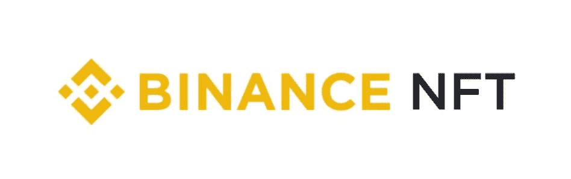
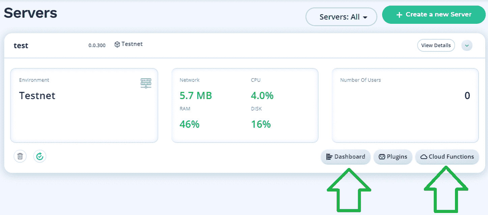
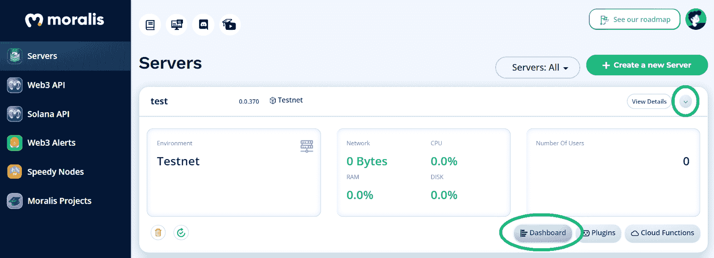
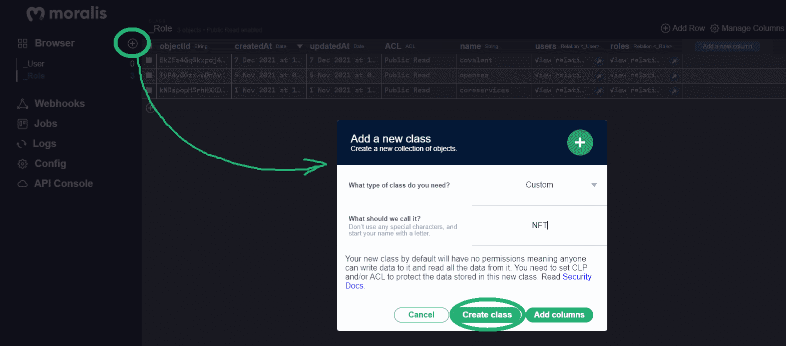
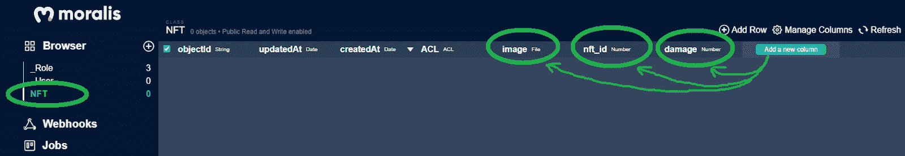
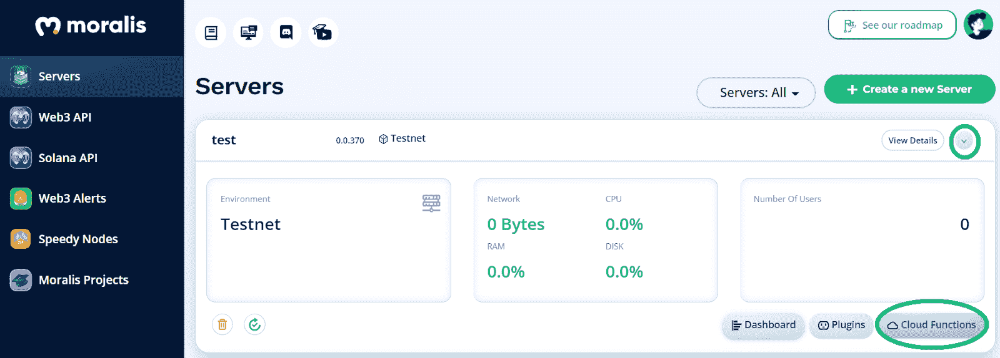
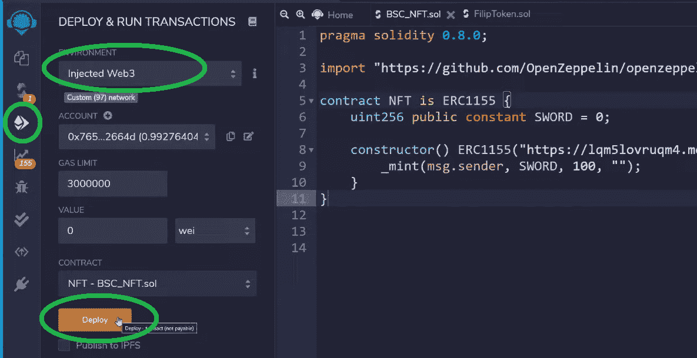
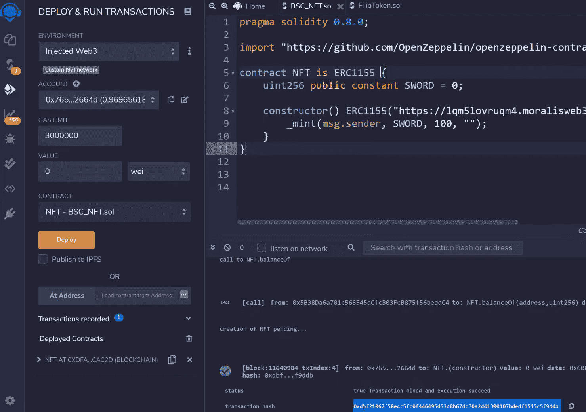

# 如何用 5 个步骤打造币安·NFT

> 原文：<https://moralis.io/how-to-create-a-binance-nft-in-5-steps/>

在 BNB 链上创造一个币安·NFT，而不是在 [**以太坊**](https://moralis.io/full-guide-what-is-ethereum/) **上创造一个 NFT，会带来一定的好处。其中一个好处是币安的低收费。事实上，以太坊高昂的燃气费是开发商想要避开区块链的一个重要原因。因此，学习如何创建一个币安 NFT 是一个不断飙升的趋势。当然，BNB 连锁的去中心化程度和以太坊不匹配；然而，币安还有其他好处。除了上面提到的低费用，它还带来了币安广泛的生态系统，包括一个** [**NFT 市场**](https://moralis.io/how-to-launch-an-nft-marketplace/) **在那里你可以出售和交易非功能性食物。如果在币安上开发一个** [**不可替代令牌**](https://moralis.io/non-fungible-tokens-explained-what-are-nfts/) **听起来很有趣，请密切关注这里的内容。随着我们更仔细地研究这篇文章，您将有充分的准备来创建一个币安 NFT。而且，顾名思义，五步就能做到！**

我们将引导您一步一步地完成这里介绍的五个阶段。您将发现一些优秀的工具，它们将使这一过程变得更加简单。像 [OpenZeppelin](https://moralis.io/what-is-openzeppelin-the-ultimate-guide/) 和 [Remix](https://moralis.io/remix-explained-what-is-remix/) 这样的平台在处理[智能合约](https://moralis.io/smart-contracts-explained-what-are-smart-contracts/)的时候会把事情简单化。我们还会用最流行的 [Web3 钱包](https://moralis.io/what-is-a-web3-wallet-web3-wallets-explained/)、 [MetaMask](https://moralis.io/metamask-explained-what-is-metamask/) 。这将使我们能够与 BNB 链的测试网互动。此外，我们将探索当前 [Web3 技术栈](https://moralis.io/exploring-the-web3-tech-stack-full-guide/)、[Moralis](https://moralis.io/)的顶峰，以满足我们的后端需求。这个" [Firebase for crypto](https://moralis.io/firebase-for-crypto-the-best-blockchain-firebase-alternative/) "平台附带了 [ultimate Web3 SDK](https://moralis.io/exploring-moralis-sdk-the-ultimate-web3-sdk/) 。我们可以使用云功能、节点、数据库、全方位的 API，以及它的平台上的更多东西。最终，Moralis 是支持最流行的链的最好的 Web3 后端平台。因此，请务必现在就[创建你的免费 Moralis 账户](https://admin.moralis.io/register)。事不宜迟，让我们开始我们的旅程，看看我们如何在五个步骤中创建一个币安 NFT！

## 用 Moralis 创造币安·NFT

你可能明白，我们将严重依赖 Moralis 来帮助我们创造一个币安 NFT。如果你决定推进你在 NFT 的发展，Moralis 家的终极 NFT API 可以很好地为你服务。有了 Moralis 的终极 Web3 开发平台，您还可以毫不费力地利用您的币安 NFT。因此，您可以将 NFTs 合并到您的[分散式应用程序](https://moralis.io/decentralized-applications-explained-what-are-dapps/) (dapps)中。

如上所述，我们将使用 OpenZeppelin 来获取一个智能合同模板。然后，我们将使用 Remix 来调整模板并部署我们的智能合约。我们鼓励你加入我们的旅程，自己采取行动。通过这样做，你将学会如何轻松地创建一个币安 NFT。然后，您可以将这一宝贵的技能用于您自己的项目，或者向您的客户提供所需的服务。

现在，让我们来看看如何用五个步骤创建币安 NFT 的每个阶段:

1.  **创建 Moralis 服务器**–您可以使用免费的 Moralis 帐户创建自己的 Moralis 服务器。这也让您可以访问服务器的数据库和其他后端功能。
2.  **创建您的智能合同**–我们将从 OpenZeppelin 的智能合同模板开始。然后我们将调整 Remix 内部的代码。
3.  **存储您的币安·NFT 的元数据**–我们将使用 Moralis dashboard 和 Moralis 的云功能选项来存储元数据并获取 NFT 的 URI 示例。
4.  **插入 URI 并将 BNB 链的 Testnet 添加到元掩码**–Moralis Speedy Nodes 和元掩码使这一步变得异常简单。
5.  **打造币安 NFT**–我们将使用 Remix 来部署您的智能合约，这将打造我们的币安 NFT。

## 创建财务 NFT–示例项目

你还必须注意到，创造一个 NFT 有两个方面——艺术和技术部分。第一部分是艺术家们会关注的；但是，您可以使用任何现有的开源图像。它是将数字文件转换成 NFT 的技术部分。这就是我们所说的“铸造”。

对于我们的例子币安 NFT，我们将使用一个公开可用的图像文件。我们将铸造几个代表剑的 NFT。如果你还没有意识到，这些 NFT 可以用于 [NFT 游戏开发](https://moralis.io/nft-game-development-how-to-build-an-nft-game-app-in-minutes/)。此外，您还应该记住，我们将在 BNB 链条的测试网上部署我们的示例 NFTs。我们总是建议在进行示例项目或测试时使用 testnets。也就是说，我们现在准备开始“用五个步骤创建币安 NFT”任务的第一步。

*注**:2022 年 2 月，币安实施更新，将币安智能链(BSC)和币安链合并，更名为 BNB 链。然而，链条的功能与以前一样。这样，你将基本学会如何在币安智能链* *上* [*创建 NFT。*](https://moralis.io/create-nft-on-binance-smart-chain-full-guide/)

### 步骤 1:创建一个 Moralis 服务器

无论你是想[创建一个 Moralis dapp](https://docs.moralis.io/moralis-dapp/getting-started/create-a-moralis-dapp) 还是使用 Moralis 帮助你铸造代币，你都需要从创建你的 Moralis 服务器开始。幸运的是，我们可以按照这些简单的子步骤相对快速而容易地做到这一点:

1.  **登录你的 Moralis 账户**——现在，你可能已经准备好了你的 Moralis 账户。因此，[登录您的账户](https://admin.moralis.io/login)。但是，如果没有，请使用本文开头的链接来创建您的免费帐户。

2.  **创建 Moralis 服务器**–在您的 Moralis 管理区，您可以通过“创建新服务器”按钮进入[创建您的 Moralis 服务器](https://docs.moralis.io/moralis-dapp/getting-started/create-a-moralis-dapp#2.-create-a-moralis-server)。然后，您需要选择网络类型并输入服务器的详细信息。

确保选择 BNB 链条的测试网(“BSC 测试网”):

一旦您的服务器启动并运行，您就可以利用 Moralis 的后端功能。出于示例项目的目的，我们将使用 Moralis 仪表板(数据库)并创建一个云函数:

### 第二步:创建你的智能合同

当涉及到铸造 NFT 时，智能合同是必不可少的。无论您是对创建 [ERC-721 令牌](https://moralis.io/erc-721-token-standard-how-to-transfer-erc721-tokens/)还是 [ERC-1155](https://moralis.io/erc1155-exploring-the-erc-1155-token-standard/) 令牌感兴趣，您都无法避免使用智能合约。但是，您可以使用经过验证的模板，而不是从头开始创建自己的智能合约。因此，OpenZeppelin 就派上了用场。为了让事情变得更简单，我们开发了我们自己的智能合约，“ [ERC1155.sol](https://github.com/OpenZeppelin/openzeppelin-contracts/blob/master/contracts/token/ERC1155/ERC1155.sol) ”，可以在 GitHub 上找到。不要让以太坊标准(ERC-1155)迷惑了你。由于 BNB 链与 EVM 兼容，币安 NFT 也遵循同样的标准。然而，如果你有兴趣创造一个单一的币安 NFT，一个 [ERC-721 合同](https://moralis.io/erc721-contract-exploring-erc721-smart-contracts/)可能更适合你。

现在，要为这个部分使用 Remix，打开这个在线 IDE 并创建一个新文件。首先，添加顶部的 pragma 行(如下图所示)。然后，输入“import ”,后跟我们的“ERC1155.sol”智能合同的 URL:

即使你对[可靠性](https://moralis.io/solidity-explained-what-is-solidity/)一无所知，你也可以看到我们的智能合同示例非常简单:

*注* *:如需更详细的指导，请使用下面 1:32 开始的视频。*

如上面截图所示，我们将我们的币安 NFTs 命名为“剑”。此外，我们决定创建我们的示例 NFT 的一百个实例。然而，为了给我们的智能契约一个文件来创建 NFTs，我们还必须获得一个相关的 URI。

在 NFTs 的情况下，可以在 NFTs 的元数据中找到 URIs。此外，NFTs 的元数据通常以 JSON 文件的形式出现。因此，这意味着我们需要创建和存储 JSON 文件来获得它们的 URIs，然后创建 NFT。在这里，我们将让 Moralis 家尽可能让事情变得简单明了。

### 第三步:存储你的币安 NFT 元数据

现在，您已经启动并运行了您的 Moralis 服务器。因此，您可以访问其仪表板:

首先创建一个新类:

请随意称呼它。为了在接下来的步骤中更加方便，我们鼓励您将其命名为“NFT”。点击“创建课程”确认您的操作。一旦创建了这个类，就可以使用“添加新列”按钮。点击之后，您需要选择数据的类型并添加您的描述。因此，您可以创建存储币安·NFT 的详细信息的列。我们添加了“image”、“nft_id”和“damage”列(稍后您将使用这些列名):

*注* *:详情请看下面 8:45 的视频。但是，请记住，Moralis 专家使用的是旧版本的 Moralis 仪表板。因此，界面看起来有点不同。*

添加完列后，您需要手动填充一行。这是你上传图像文件的地方，输入你的 NFT ID，并输入“损害”值。如果您想[批量创建 NFT](https://moralis.io/how-to-bulk-mint-nfts-batch-minting-guide/)，有一种简单的方法可以自动填充行。此外，这也是学习如何从[上传文件夹到 IPFS](https://moralis.io/how-to-upload-folders-to-ipfs/) 的一种方式。

#### 使用云函数生成元数据

现在，您已经准备好学习如何生成包含 URI 链接的元数据文件。如上所述，这就是我们将使用 Moralis 云功能的地方:

通过点击“云功能”按钮，您将能够输入以下代码:

上面几行代码确保您可以访问上面创建的“NFT”类的特定列和行。因此，上面的云函数将为您的示例 NFT 返回一个 JSON 文件。关于查看这个 JSON 文件的更多细节，请使用下面 11:27 的视频和 [Moralis 的文档](https://docs.moralis.io/moralis-server/cloud-code/cloud-functions#calling-via-rest-api)。你需要的是 URI 链接:

### 步骤 4:插入 URI，并将 BNB 链的测试网添加到元掩码中

现在你有了你的 URI，你需要返回到混音并粘贴到标记的地方(见第 2 步)。由于我们决定铸造一个以上的币安 NFT，我们需要遵循 ERC-1155 标准的 ID 持有人的指导方针。因此，我们必须将 URI 中的“0”替换为“{id}”:

#### 使用 Moralis 快速节点

当你的 URI 在 Remix 的“构造函数”中时，是时候得到你的 BNB 链节点了。幸运的是，Moralis 也是一个优秀的区块链节点提供商。它用 Moralis Speedy Nodes 覆盖了这个特性。后者使您只需几次点击就可以将支持的网络添加到元掩码中。你可以这样做:

1.  从你的 Moralis 管理区的侧边菜单中选择“快速节点”:

2.  点击“BSC 网络”下的“端点”。

3.  使用 BNB 链测试网的“添加到元掩码”按钮:

4.  将元掩码网络从“以太坊主网”切换到“BSC 测试网”:

*注* *:要覆盖 BNB 链家的 testnet 上的交易，需要“测试”或“玩”BNB 代币。您可以通过访问“***”来收集一些，在那里您将输入您的元掩码地址。**

### *第五步:铸造一个币安 NFT*

*在这一点上，你应该用你的元掩码连接到 BNB 链的测试网。此外，你的钱包里应该有一些“玩”BNB 代币。如果是这样，你可以继续铸造你的币安 NFT。首先确保您在 Remix 中的设置与以下设置相匹配:*

*

然后，您可以通过单击“部署”来执行事务。接下来，您需要在元掩码中确认事务。完成交易后，您可以使用 [BscScan](https://moralis.io/exploring-bscscan-full-guide/) (testnet)来搜索您的交易的散列:

如果您对以上示例项目的更详细的演练感兴趣，请务必观看下面的视频。此外，通过观看视频(在 19:48)，你可以得到一些关于如何将你的“币安 NFT”追求更进一步的好主意。

https://www.youtube.com/watch?v=02VnfTIomn8

## 如何通过 5 个步骤打造币安 NFT——总结

如果您已经学习了以上章节，那么您现在应该知道如何完成创建币安 NFT 所需的所有五个步骤。如果您自己承担了我们的示例项目，您就创建了一个 Moralis 服务器和您的智能合同。您还存储了您的币安 NFT 的元数据，插入了您的 URI，并将 BNB 链的 testnet 添加到您的元掩码中。最后，你铸造了你的币安·NFT。通过完成所有这些任务，你获得了一些关于 OpenZeppelin、Remix、Moralis 和 MetaMask 的有价值的知识。因此，你已经准备好接受一个新的范例项目，它在 [Moralis 博客](https://moralis.io/blog/)或 [Moralis YouTube 频道](https://www.youtube.com/c/MoralisWeb3)等着你。

这两个渠道解释了区块链发展的所有条款和方面。因此，它们可以作为你的免费持续加密教育。例如，一些最新的话题集中在什么是[以太坊名称服务(ENS)](https://moralis.io/what-is-ethereum-name-service-full-ens-guide/) ，如何[声称一个游戏内的 NFT](https://moralis.io/how-to-claim-an-in-game-nft-full-guide/) ，[什么是 Web2 和 Web3](https://moralis.io/what-is-web2-and-web3-explaining-web3/) ， [Web3 契约](https://moralis.io/what-are-web3-contracts-exploring-smart-contracts/)， [NFT 实用程序](https://moralis.io/nft-utility-exploring-nft-use-cases-in-2022/)， [Web3 游戏设计](https://moralis.io/web3-game-design-explaining-the-web3-game-design-process/)，[将 Web3 钱包连接到 Twitter 账户](https://moralis.io/connecting-web3-wallet-to-twitter-account/)，以及[如何将 Web3 钱包连接到网站](https://moralis.io/how-to-connect-a-web3-wallet-to-a-website/)此外，它还涵盖了许多其他 [Web3 认证](https://moralis.io/web3-authentication-the-full-guide/)方面。

你可能渴望尽快成为全职加密员。如果是这样的话，你应该考虑采取更专业的方法。因此，报名参加 Moralis 学院可能是你的正确道路。除了进入顶级的[区块链发展课程](https://academy.moralis.io/all-courses)，你还将获得个性化的学习路径。最重要的是，你将成为行业中最先进的社区之一的成员，并获得专家导师的帮助来克服任何挑战。

*