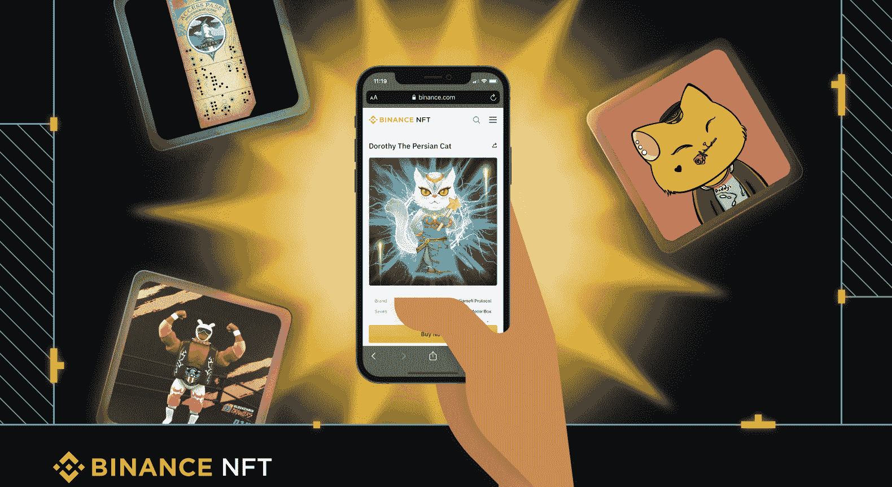
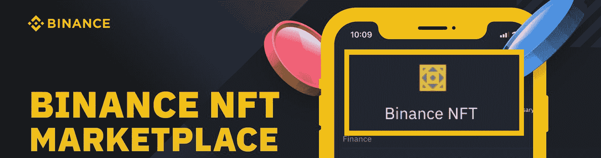
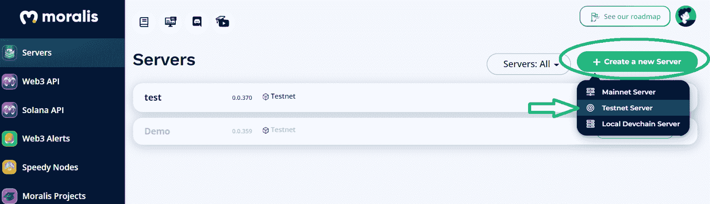
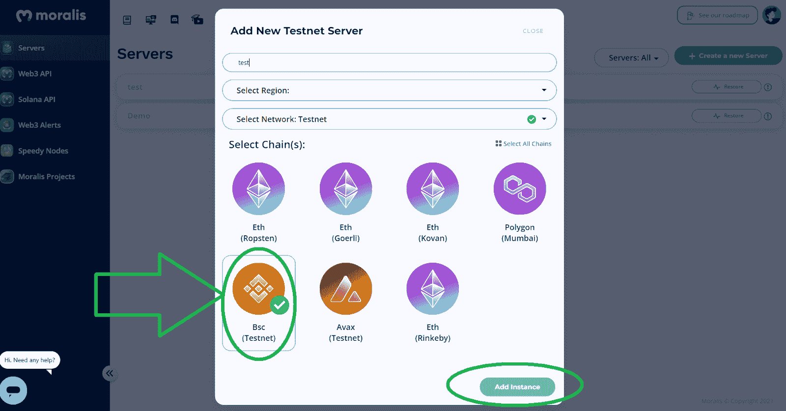
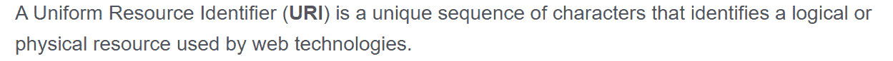
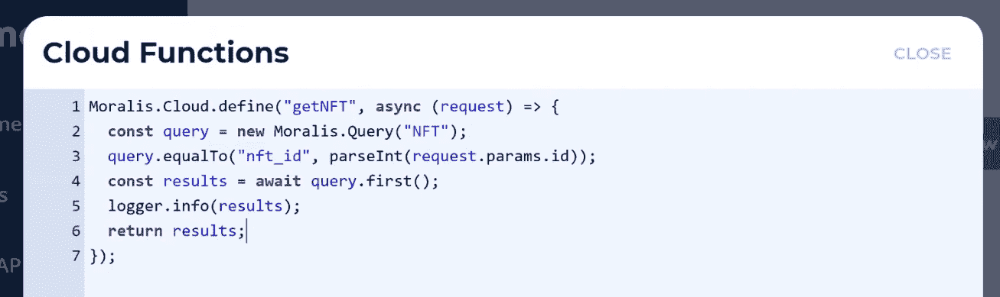
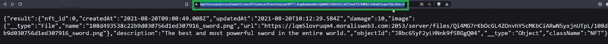
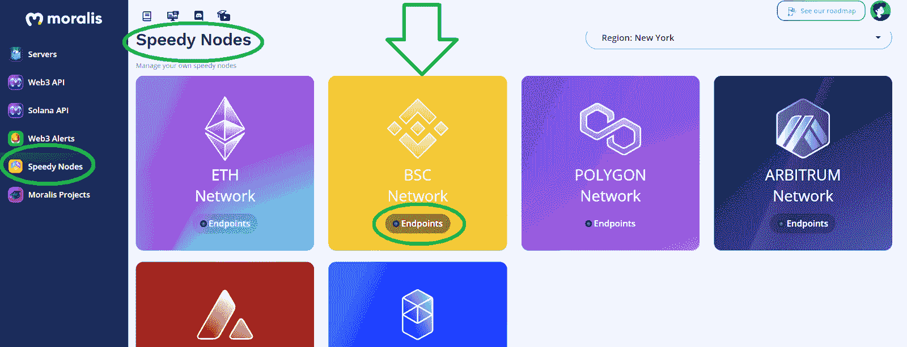
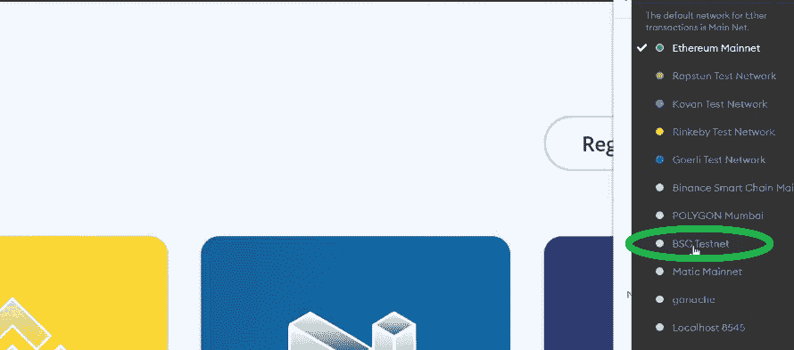

# 如何创造一个 BNB NFT

> 原文：<https://moralis.io/how-to-create-a-bnb-nft/>

凭借其广泛的生态系统、低廉的交易费用和受欢迎的 NFT 市场，BNB 连锁店被证明是那些想要创建不可替代代币(NFT)的人的首选网络。虽然 BNB 链不像 [**以太坊**](https://moralis.io/full-guide-what-is-ethereum/) **那么分散，但创作者愿意在这方面做出妥协，因为他们从创作 BNB NFT 中获得了更多的利润。因此，如果你想创造一个 BNB NFT 由于 BNB 代币的好处，你来对了地方。现在，对于那些认为你需要成为一个******专家来完成这一点的人，不要担心。即使 BNB 链是**[**EVM**](https://moralis.io/evm-explained-what-is-ethereum-virtual-machine/)**——兼容并且我们可以使用以太坊的 NFT 标准(ERC-721 和 ERC-1155)，你也不需要精通扎实；然而，只有当你使用正确的工具和正确的指导。因此，如果您使用 Moralis，您可以在大约 20 分钟内轻松准备好 BNB NFTs。****

**这篇文章将向你展示如何使用 Moralis 来创造一个 BNB·NFT。moralis([Firebase for crypto](https://moralis.io/firebase-for-crypto-the-best-blockchain-firebase-alternative/))涵盖了所有与 Web3 相关的后端需求。此外， [Moralis 的 SDK](https://moralis.io/exploring-moralis-sdk-the-ultimate-web3-sdk/) 还包括[终极 NFT API](https://moralis.io/ultimate-nft-api-exploring-moralis-nft-api/) ，这让 NFT 的开发变得轻而易举。然而，这个当前 [Web3 技术栈](https://moralis.io/exploring-the-web3-tech-stack-full-guide/)的顶峰并不是我们将利用的唯一优秀工具。为了完成今天的示例项目，我们将创建一个 BNB·NFT，您还将使用 [Remix](https://moralis.io/remix-explained-what-is-remix/) 、 [OpenZeppelin](https://moralis.io/what-is-openzeppelin-the-ultimate-guide/) 和 [MetaMask](https://moralis.io/metamask-explained-what-is-metamask/) 。此外，您还将了解 Moralis 仪表盘和 Moralis 的云功能。有了这些知识，您就可以轻松地将 BNB NFT 整合到您的 dapp([分散式应用](https://moralis.io/decentralized-applications-explained-what-are-dapps/))中。尽管如此，如果这是你第一次接触 [best Web3 后端平台](https://moralis.io/exploring-the-best-web3-backend-platform/)，一定要[创建你的免费 Moralis 账户](https://admin.moralis.io/register)。您将需要它来承担本文所涉及的示例项目。**

**

## 使用 Moralis、Remix 和 MetaMask 创建 BNB NFT–概述

让我们简要概述一下创建 BNB NFT 所需的步骤。我们将从创建一个 Moralis 服务器开始。随着 Moralis 服务器的启动和运行，您将可以访问服务器的数据库和 Moralis 的云功能。然后，您需要创建您的智能合同。通过使用 OpenZeppelin，您将获得一个智能合同模板，消除了许多障碍。此外，您将有机会通过使用我们的智能合同获得额外的快捷方式。接下来，您将使用 Remix 对智能合约进行必要的调整。

接下来，您将使用 Moralis dashboard 和 Moralis 的云功能存储 BNB NFT 的元数据。因此，您将获得 NFT 的 URI，您需要将它粘贴到您的智能合同中。然后，您还将 BNB 链的 testnet 添加到您的元掩码，这将使您能够连接到它的网络。在这一点上，你也将了解 Moralis 的快速节点。最后，你将有一切准备创造一个 BNB NFT。因此，您将使用 Remix 将您的智能合约部署到 BNB 连锁店的 testnet 来创建您的示例 NFT。

## 创建一个 BNB NFT-示例项目

如果你想创造一个 BNB·NFT 或任何类型的 NFT，请记住，创造非功能性艺术作品有艺术和技术两部分。艺术方面不是我们在这里要关注的。这是你可以轻松外包的部分。为了这个项目，您可以使用任何现有的开源图像。然而，对于开发人员来说，当涉及到技术部分时，事情就变得有趣了。毕竟这部分是把常见的数字文件，转换成[不可替代的令牌](https://moralis.io/non-fungible-tokens-explained-what-are-nfts/) (NFTs)。因此，除非您决定使用部分集中的 NFT 市场，如 OpenSea，否则创建 NFT 需要一定水平的开发技能。

至于我们的[币安·NFT](https://moralis.io/how-to-create-a-binance-nft-in-5-steps/)的例子，我们将使用开源图像。此外，我们将根据 ERC-1155 标准铸造几个 NFT。此外，我们的示例 NFT 将表示剑。我们选择走这条路，因为这种 NFT 可以很容易地整合到 [NFT 游戏开发](https://moralis.io/nft-game-development-how-to-build-an-nft-game-app-in-minutes/)中。如上所述，我们将在 BNB 链的测试网上部署我们的示例 NFTs。当然，我们可以使用 BNB 连锁店的 mainnet 然而，对于示例项目，最好使用 testnets。

***注:*** *截至 2022 年 2 月，币安智能连锁(BSC)与币安连锁合并，封面名称 BNB 连锁。两条链的功能保持不变。因此，你可以说我们在这里的任务是向你展示如何在币安智能链* *上* [*创建 NFT。*](https://moralis.io/create-nft-on-binance-smart-chain-full-guide/)

### Moralis 服务器 Web3 开发的门户

如果你想使用 Moralis 来帮助你铸造代币或者创建一个 Moralis dapp，你需要创建一个 Moralis 服务器。幸运的是，遵循以下指南，你可以毫不费力地快速做到这一点:

1.  **登录您的 Moralis 账户**-如果您还没有创建免费的 Moralis 账户，现在就创建吧。使用简介末尾的链接。然后，只需[登录你的账户](https://admin.moralis.io/login)。

2.  **创建一个 Moralis 服务器**–在您的 Moralis 管理区的“服务器”选项卡中，您需要点击“创建新服务器”按钮来[创建您的 Moralis 服务器](https://docs.moralis.io/moralis-dapp/getting-started/create-a-moralis-dapp#2.-create-a-moralis-server)。然后，会要求您选择一种服务器类型:

接下来，您将输入服务器的详细信息，包括选择链。因此，在点击“添加实例”之前，请确保您选择了 BNB 链条的测试网(“BSC 测试网”):

随着您的服务器旋转，Moralis 的后端功能由您支配。在我们的案例中，我们将重点使用 Moralis 仪表板(数据库)和云功能特性:

## 你聪明的合同创造了 BNB·NFT

无论你选择哪种 NFT 标准，当涉及到制造非金融交易时，智能合约都扮演着重要的角色。除非你愿意使用 NFT 市场，否则你需要使用智能合约来创造非功能性交易。然而，这并不意味着你需要成为一名可靠性专家。如前所述，您也不需要从头开始创建智能合约。相反，您可以从经过验证的模板开始。这就是 OpenZeppelin 简化事情的地方。此外，请随意使用我们的示例智能合同-"[ERC 1155 . sol](https://github.com/OpenZeppelin/openzeppelin-contracts/blob/master/contracts/token/ERC1155/ERC1155.sol)"。后者在 GitHub 等你。

下面，你可以看到我们在 Remix 里面——一个开源的在线 ide。在 Remix 里面，首先，创建一个新的文件，并随意命名。当然，你可以随意使用和我们一样的名字。第二，使用顶行添加 pragma 行(见下面的截图)。接下来，通过输入“import ”,后跟示例智能合约的 URL，导入我们的“ERC1155.sol”智能合约:

下面是我们智能合约示例的要点:

*注* *:如果你想要更详细的指导，可以参考这篇“如何打造一个 BNB NFT”文章末尾的视频(1:32)。*

通过上面的截图，你可以看到我们的 BNB·NFT 的名字——“剑”。此外，“100”表示我们将创建一百个示例令牌的实例。尽管如此，我们需要得到我们的 NFT 的 URI，以便使用我们的智能合同。

*注意* *:对于不熟悉 NFTs 元数据的人来说，这里有一个“URI”的定义:*

如您所知，URIs 是在 NFTs 的元数据中给出的，通常以 JSON 文件的形式出现。因此，接下来，我们将创建 JSON 文件，然后使用它们的 URIs 来创建我们的 BNB NFT。

## BNB NFTs 的元数据和 Moralis

当涉及到我们的 NFTs 的元数据时，Moralis 将使事情变得非常简单。此时，您应该已经准备好了 Moralis 服务器。因此，您可以打开您的仪表板:

在您的仪表板中，使用“加号”图标创建一个新类:

您需要为您的新类命名。这可以是你想要的任何东西，虽然我们建议你跟随我们的领导，把它命名为“NFT”。这样，随着我们的进展，事情会变得更加清楚。输入班级名称后，点击“创建班级”按钮(见上面的截图)。然后使用“添加新列”按钮。这样做之后，您将需要选择正确的数据类型并添加其描述。实际上，您希望创建列来存储示例 BNB NFTs 的细节。因此，可以像我们一样随意添加相同的列。这些包括“图像”、“nft_id”和“损坏”:

*注意:使用下面 8:45 开始的视频了解更多细节。请注意，该视频中的 Moralis 专家正在使用旧版本的 Moralis 仪表盘。*

成功添加列后，现在是填充一行的时候了，我们将用它来创建一个 BNB·NFT。对于这个示例项目，我们将手动完成这项工作。因此，请务必上传图像文件，并输入您的 NFT 身份证和“损害”的价值。此外，您应该知道有一种实用的方法可以自动填充行。当你想批量制造 NFT 时，后者让事情变得简单多了。另外，当批量铸造有问题时，你也要[上传文件夹到 IPFS](https://moralis.io/how-to-upload-folders-to-ipfs/) 。

### 利用 Moralis 云函数生成 BNB 国家森林公园元数据

在填充了“NFT”类的第一行之后，您可以专注于生成元数据文件。如果你记得，这是获得 URI 链接的方式。如前所述，我们将利用 Moralis 的云功能来实现这一目标:

为您的服务器点击“云功能”,并输入以下代码行:

上面的代码访问“NFT”类的特定列和行。这样，它使用这些列中的数据为您的示例 NFT 创建一个 JSON 文件。此外，请随意使用下面的视频(11:27)并结合 [Moralis 的文档](https://docs.moralis.io/moralis-server/cloud-code/cloud-functions#calling-via-rest-api)来了解查看 JSON 文件的更多细节。基本上，你需要复制你的 URI 链接:

关于以上的更多信息，请看下面 11:31 开始的视频。

### 将 URI 插入混音，并将 BNB 链的测试网添加到 MetaMask

复制你的 URI 后，返回混音。在这里，您希望将 URI 粘贴到“constructor()”函数的“ERC1155”后面的括号中。*参见“你的智能合同创造了一个 BNB·NFT”一节中的图片*。此外，我们需要遵守 ERC-1155 标准对 ID 持有者的指导方针。因此，请确保将 URI 中的“0”替换为“{id}”:

在将智能合约部署到 BNB 链测试网络之前，需要将该网络添加到元掩码中。幸运的是，您可以使用 [Moralis Speedy Nodes](https://moralis.io/speedy-nodes/) 来完成这项工作，只需点击几下鼠标。详细说明，请看下面 16:43 开始的视频。然而，这是它的要点:

1.  使用 Moralis 管理区中的“快速节点”选项卡:

2.  在“BSC 网络”下，单击“端点”。

3.  点击“Testnet”部分中的“Add to MetaMask ”:

4.  将元掩码的扩展切换到“BSC Testnet”网络:

## 打造币安 NFT 铸币厂

*注* *:铸币涉及执行链上交易。因此，你需要一些“测试”或“玩”BNB 代币来支付汽油费。因此，使用“*[*【https://testnet.binance.org/faucet-smart】*](https://testnet.binance.org/faucet-smart)*”并输入您的元掩码地址来获得一些播放 BNB。*

现在你已经连接你的元蒙版到 BNB 链的测试网，你终于可以创建一个 BNB NFT。这是铸造部分，您将通过使用 Remix 部署您的智能合约来完成。首先，将您的混音设置与此处显示的相匹配:

然后，单击“部署”按钮执行链上事务。您需要用元掩码确认后者。

*注意* *:我们鼓励您使用*[*BscScan*](https://moralis.io/exploring-bscscan-full-guide/)*(testnet)来搜索您的交易的 hash，从而确认它已被执行:*

最后，下面是“如何创建一个 BNB NFT”的视频教程，我们一直在这篇文章中引用。它将为您提供更详细的演练。此外，从 19:48 开始，你有机会获得一些关于如何将 BNB NFTs 带到下一个水平的好主意。

https://www.youtube.com/watch?v=02VnfTIomn8

## 如何创建 BNB NFT-摘要

至此，你知道如何在 20 分钟内创建一个 BNB·NFT 了。如果您接手了我们的示例项目，那么您已经学习了如何创建 Moralis 服务器以及如何使用 Remix。此外，您还有机会熟悉 Moralis 仪表盘和 Moralis 的云功能。这两个特性使您能够生成 NFT 的元数据和它们的 URIs。最后，您还有机会使用 Remix 和 MetaMask 部署您的示例智能合约。

如果你喜欢这个示例项目，你应该探索一下 [Moralis 的博客](https://moralis.io/blog/)和 [YouTube 频道](https://www.youtube.com/c/MoralisWeb3)。那里有几个教程可以帮助你[成为一名 Web3 开发者](https://moralis.io/how-to-become-a-web3-developer-full-guide/)。例如，一些最新的主题包括[分数 NFTs](https://moralis.io/what-are-fractional-nfts-the-ultimate-2022-f-nft-guide/) 、[动态 NFTs](https://moralis.io/what-are-dynamic-nfts-the-ultimate-2022-guide/) ，一个示例[即玩即赚(P2E)游戏智能合约](https://moralis.io/how-to-build-a-play-to-earn-p2e-game-smart-contract/)，以及[基于 NFT 的会员资格](https://moralis.io/what-are-nft-based-memberships-full-guide/)。此外，它还展示了如何构建一个 [Uniswap DEX 克隆](https://moralis.io/build-a-uniswap-dex-clone-with-html-css-javascript-moralis-on-the-ethereum-network/)，如何[获得区块链短信通知](https://moralis.io/how-to-get-blockchain-sms-notifications/)，如何[构建一个先玩后赚游戏](https://moralis.io/how-to-build-a-play-to-earn-p2e-game/)，如何添加一个 [Web3 connect wallet 按钮](https://moralis.io/how-to-add-a-web3-connect-wallet-button-to-your-website/)，使用一个 [Mumbai testnet 水龙头](https://moralis.io/mumbai-testnet-faucet-how-to-get-free-testnet-matic-tokens/)等等。然而，如果你想自信地快速成为一名区块链开发者，可以考虑报名参加 Moralis 学院。在那里，你将获得专业级的区块链发展课程。您还将获得个性化的学习路径和专家导师，并成为行业中最先进的社区之一的一部分。

**