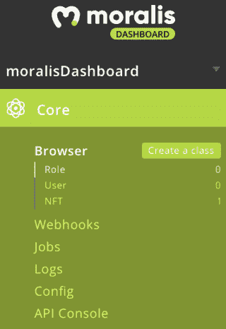
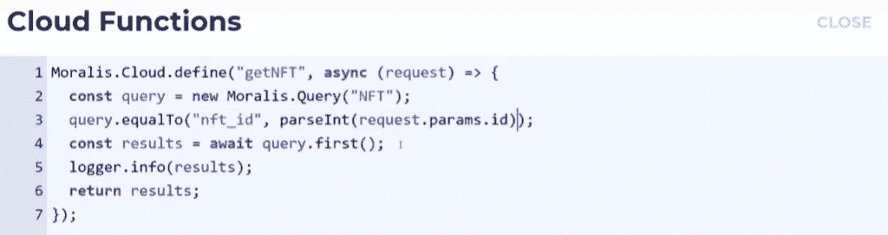
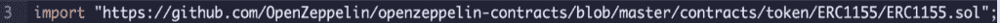
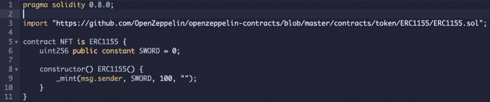
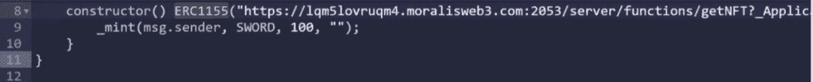
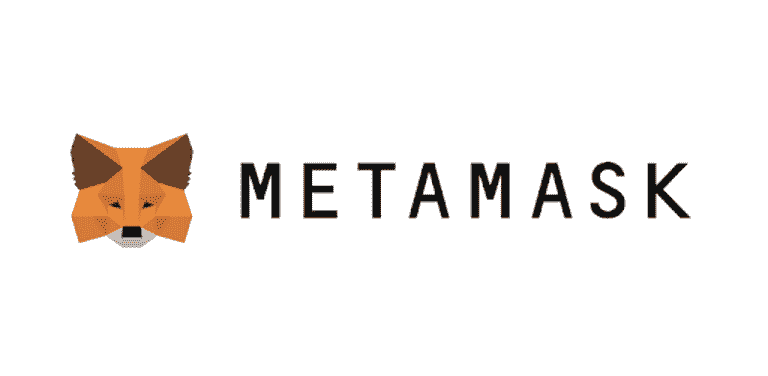

# 如何在 20 分钟内创建一个 BSC NFT

> 原文：<https://moralis.io/how-to-create-a-bsc-nft-in-less-than-20-minutes/>

[**NFTs**](https://moralis.io/non-fungible-tokens-explained-what-are-nfts/) **，或不可替代的代币，风靡全球。它们现在比以往任何时候都更受欢迎，甚至引起了传统媒体的兴趣。然而，这并不奇怪，因为其中一些代币已经卖到了数百万美元。NFT 提供了唯一项目的所有权表示。因此，他们彻底改变了数字艺术空间，让艺术家获得前所未有的资金支持。然而，随着受欢迎程度的增加，这些令牌是如何构造和发射的仍然不为许多人所知。因此，我们将进一步了解如何在不到 20 分钟的时间内创建一个 BSC NFT。**

在不到 20 分钟的时间内，在币安智能链上构建一个 NFT？这听起来好得难以置信吗？嗯，如果我们利用，这是可能的。借助 Moralis 的平台，我们可以显著缩短所有区块链项目的开发时间，例如通过几个简单的步骤创建一个 NFT。Moralis 为用户提供了一个全面管理的后端基础设施，使开发过程更快更容易。因此，我们将把如何在 Moralis 平台上创建 BSC NFT 的过程作为基础。

如果你更想看一个视频，解释如何在币安智能链上建立一个 NFT 的过程，我们建议查看以下来自 [Moralis YouTube 频道](https://www.youtube.com/channel/UCgWS9Q3P5AxCWyQLT2kQhBw) 的视频。在这里，你会找到一个优秀而深入的教程，引导你完成整个过程:

[https://www.youtube.com/embed/02VnfTIomn8?feature=oembed](https://www.youtube.com/embed/02VnfTIomn8?feature=oembed)

因此，如果你正在寻找开发 [dApps](https://moralis.io/decentralized-applications-explained-what-are-dapps/) 、代币或 NFTs，我们强烈建议你马上与 Moralis 家签约！加入该平台是完全免费的，你将获得所有有价值的工具，如 NFT API、Price API、[web 3 API](https://docs.moralis.io/moralis-web3-rest/deep-index-api)等等。

# 如何在不到 20 分钟的时间内打造币安智能连锁 NFT

如果你是 [Moralis 博客](https://moralis.io/blog/) 的老读者，你可能会偶然发现一篇解释 [如何创建自己的 NFT](https://moralis.io/how-to-create-your-own-nft-in-5-steps/) 的文章。因此，您可能已经熟悉了使用 Moralis 及其平台的强大功能。如何在币安智能链上建立一个 NFT 的过程就像你想在任何其他链上做一样简单。然而，为了进一步简化这个过程，我们将在本文中把它分成四个简单的步骤:

1.  创建一个 Moralis 服务器。
2.  制作一个新的 Moralis 类和云函数。
3.  打造 NFT 明廷智能合约 。
4.  编制合同并将其部署到 BSC 区块链公司。

有了 Moralis，我们可以在几分钟内完成这项工作，而且过程简单快捷。让我们先仔细看看如何设置自己的 Moralis 服务器。

## 第一步: 如何创建 BSC NFT —创建 Moralis 服务器

由于我们将在本教程中使用 Moralis，该过程的第一步将是注册 Moralis 平台，这也是设置您自己的 Moralis 服务器的重要部分。此外，作为一名 Moralis 用户，你将获得该平台的所有工具，这将使你作为一名 Web3 开发者在未来的区块链项目中受益匪浅。

一旦您创建了自己的帐户，我们就可以点击 Moralis 界面右上角的“+创建新服务器”按钮，开始创建我们自己的 Moralis 服务器。这将为您提供一个包含三个不同选项的小型下拉菜单。对于本教程，我们将选择“Testnet 服务器”选项，因为我们要将契约部署到 BSC testnet。

但是，如果选择了其中一个选项，您将会看到一个新窗口，您需要在其中输入名称，选择一个地区，然后选择网络。Moralis 平台支持跨链兼容，允许我们选择多个网络。但是，由于我们正在创建 BSC NFT，您应该选择 BSC 作为备选方案之一。

完成选择后，您只需点击“添加实例”按钮，这将启动服务器。启动服务器可能需要一段时间。然而，你不必担心；实例将很快启动并运行。

## 步骤 2:如何创建 BSC NFT——创建新的 Moralis 类和云函数

现在我们已经有了一个 Moralis 服务器，我们可以继续前进，导航到仪表板。我们可以通过单击服务器上的三个点来定位仪表板，然后单击“仪表板”按钮。

启动仪表板后，我们可以点击仪表板左侧“Browser”选项卡旁边的“Create a class”按钮来创建新的课程。在这里，我们可以简单地创建一个新的自定义类，我们称之为“NFT”。

有了这个类，我们可以添加几个列。这些列将表示关于 NFT 的所有信息。例如，我们可以为 NFT ID 添加一个，为图像添加一个，为描述添加一个，等等。

一旦我们有了列，我们就可以添加新的一行，并填写所有的空白列。如果我们想添加另一个 NFT，我们可以简单地添加一个新行，这样我们就可以轻松地创建多个令牌。因此，在我们的 Moralis 数据库中，每一行都是它自己的 NFT 对象。

对于我们新创建的 NFT 对象，我们需要一种方法来获得到这个特定对象的 JSON 链接，这是我们在创建智能契约时需要的。为此，我们需要获得一个链接，我们可以通过创建一个 Moralis 云函数来实现。

### 创建云函数

[用 Moralis](https://docs.moralis.io/moralis-server/cloud-code/cloud-functions) 创建云函数很容易。要开始，我们需要回到 Moralis 的“服务器”选项卡。然后，我们需要再次单击服务器上的三个点，并选择“云功能”而不是“仪表板”。

当我们点击这个按钮时，会出现一个更小的窗口，我们可以在这里输入我们功能的代码。本例中的代码如下:

我们决定将我们的云函数称为“getNFT ”,它被指定为异步函数。这个函数首先选择我们在上一步中创建的“NFT”类。一旦我们选择了类，第三个函数行将找到“nft_id”等于发送给函数的参数的行。

之后，该函数运行查询，并将结果记录到 Moralis。函数的最后一行返回结果变量，通过一个链接在我们的浏览器中以 [JSON](https://moralis.io/json-explained-what-is-json-javascript-object-notation/) 格式传递。现在，剩下的就是在我们的浏览器中调用云函数。

### 调用云函数

为了调用这个函数，我们需要两样东西:“服务器 URL”和“应用程序 ID”。我们可以通过单击服务器上的“查看详细信息”按钮来获取这两个元素。有了 URL 和 ID，我们可以将这两个元素与附加参数结合起来，创建调用函数的链接。

在后面的步骤中，该链接将成为我们的 URI，看起来应该是这样的:

“‘你的服务器 URL’/functions/getNFT？_Application= '您的应用 ID' & id=0"

如你所见，我们从服务器 URL 开始，后面跟着“/functions/getNFT”，这是我们刚刚创建的云函数的名称。接下来是“？_Application= "和应用程序 ID。最后，我们还添加了参数 ID，在本例中它等于 0。因此，该函数将获取关于 ID = 0 的 NFT 对象的信息。

将此链接输入到我们的浏览器中，将会以 JSON 格式为我们提供有关 NFT 对象的所有信息。因此，我们可以查看所有信息，并找到令牌图像的 URL(如果存在)。

因此，随着服务器的启动和运行，以及获取我们的 NFT 对象的数据的云函数，我们可以继续前进，创建用于铸造令牌的智能合同。

## 步骤 3:如何创建 BSC NFT——创建 NFT 铸币智能合同

现在是时候创建 [智能合约](https://moralis.io/smart-contracts-explained-what-are-smart-contracts/) 了，我们将用它来打造我们的 NFT。我们将在 IDE(集成开发环境) [Remix](http://remix.ethereum.org/) 中开发契约。Remix 是一个非常适合智能契约开发的 IDE，它使得编译和部署我们的契约变得相对容易。所以，我们要做的第一件事是打开 Remix web 应用程序。如果你想了解更多关于创建智能合同的知识，Moralis 提供了一个关于如何创建智能合同的指南。

应用程序启动并运行后，我们可以通过右键单击界面左侧的“Contracts”文件夹来启动流程，然后我们可以创建一个新的合同文件。有了新文件，我们就可以开始编写合同代码了。

### 实现编译指令行

我们需要实现的第一件事是一个 pragma 行。这将确定在编译智能合同时使用哪个版本的。这很简单，我们需要做的就是在代码中实现下面一行代码:

### 导入 ERC-1155 OpenZeppelin 模板

因为我们将创建一个 ERC-1155 令牌，我们需要导入一个[OpenZeppelin](https://openzeppelin.com/)Solidity 模板。这将使整个过程更加容易，因为我们可以使用现有的合同模板。我们即将实现的契约是通用的，可以用来创建可替换和不可替换的令牌。要导入这个模板，我们需要做的就是将下面的 URL 作为字符串实现到我们的代码中:

"[https://github . com/open zeppelin/open zeppelin-contracts/blob/master/contracts/token/ERC 1155/ERC 1155 . sol](https://github.com/OpenZeppelin/openzeppelin-contracts/blob/master/contracts/token/ERC1155/ERC1155.sol)"

这是 ERC-1155 令牌可靠性模板的 GitHub 存储库链接，完成后的导入行如下所示:

### 创建合同

既然我们已经建立了一个 pragma 行并导入了 ERC-1155 令牌模板，我们就可以开始定义契约本身了。我们将把我们的合同称为“NFT”，从整体上看，智能合同将类似于这样:

我们现在需要做的第一件事是创建合同，并将其命名为“NFT”。在这之后，我们还确定该契约继承了我们之前导入的 ERC-1155 契约。花括号中的第一行定义了我们在部署契约时将要创建的 NFT。这是通过指定我们想要创建的令牌的 id 来完成的。此外，我们给它加了一个“别名”,这样更容易理解，我们通过创建一个带有名称的常量整数来做到这一点。从代码中可以看出，我们将这个整数命名为“SWORD ”,并将 ID 设置为 0。

一旦我们指定了 ID，我们就创建了用于创建 NFT 的构造函数，后面是我们的智能契约继承的 OpenZeppelin 契约的另一个构造函数。代码的第二个构造函数以 URI 的形式接受一个参数，我们将在后面实现。

在构造函数的花括号中，我们调用了“_mint”函数。这个函数有几个参数。第一个定义了谁将获得 NFT，这里我们选择了“msg.sender”，这意味着令牌被分配到它们被部署的地址。第二个参数是 NFT 的 ID，在这种情况下，它将是我们之前绑定到 ID 0 的“剑”。此外，在 ID 之后，我们可以选择想要创建多少个 NFT。

### ERC1155 Argument

现在，只剩下一件事；“ERC1155()”构造函数的参数。在括号内，我们需要实现令牌 URI，这是我们之前通过云函数创建的链接。这个 URI 是嵌入到我们即将铸造的 NFT 中的一个链接。然而，在这种情况下，我们将稍微改变链接，看起来像这样:

“‘你的服务器 URL’/functions/getNFT？_Application= '您的应用 ID' & id={id}"

不同之处在于末尾的{id},它是 id 的占位符。因此，由契约的部署者来指定将生成哪个 ID。通过这样做，我们可以用同一个契约创建多种类型的 NFT。因此，为了完成代码，我们需要做的就是将这个 URI 实现到第二个构造函数中。

现在我们已经创建了自己的 NFT 铸币智能合同，剩下的工作就是编译并上传合同到区块链。

## 步骤 4 —编译智能合约并部署到 BSC 区块链

用 Remix 编译我们的合同真的很简单。我们所需要做的就是点击左边导航栏中的“Solidity Compiler”标签，并按下所选合同的“Compile”按钮。一旦我们完成了合同，我们就可以继续部署合同了。

但是，在部署合同之前，我们必须先将我们的 [MetaMask](https://moralis.io/metamask-explained-what-is-metamask/) 网络改为 BSC Testnet。默认情况下，此区块链不在元掩码网络中，这意味着我们需要添加它。要添加网络，我们可以使用[Moralis Speedy Nodes](https://moralis.io/speedy-nodes/)。

在 Moralis 界面中，导航到“Speedy Nodes”选项卡，单击 BSC 的“Endpoints”按钮，然后单击“Testnet”URL 旁边的“Add to MetaMask”按钮。这将自动将网络添加到元掩码中，剩下的工作就是选择网络。为此，单击元掩码界面中的“网络”选项卡，并选择 BSC Testnet。

此外，我们还需要在我们的账户中添加一些 BNB 代币，以便我们有足够的资金来部署合同。你只需要找到一个 BSC 水龙头，输入你的钱包地址。

有了正确的网络，我们可以回到 Remix，按下“Solidity 编译器”标签下的“部署”标签。这里我们需要指定环境，我们将它设置为“Injected Web3”。这将自动选择您的元掩码帐户的当前网络。现在，剩下的就是选择合同并点击“部署”按钮。

祝贺您，您已经成功完成了在币安智能链上创建 NFT 的过程。此外，更方便的是，完整的流程也可以用于任何其他[【EVM】](https://moralis.io/evm-explained-what-is-ethereum-virtual-machine/)(以太坊虚拟机)兼容链！

## 如何创建平衡计分卡 NFT —摘要

使用合适的工具，创建 BSC NFT 的过程非常简单。借助 Moralis，我们可以在不到 20 分钟的时间内建立一个币安 NFT 智能链，展示与 Moralis 合作的便利性。此外，我们不仅可以构建 NFT，还可以构建 dApps 和其他令牌。如果你感兴趣，Moralis 博客的特色文章包括:“ [如何在 10 分钟内创建自己的 ERC-20 令牌](https://moralis.io/how-to-create-your-own-erc-20-token-in-10-minutes/) ”和“ [如何快速创建 BSC dapp](https://moralis.io/how-to-create-bsc-dapps-quickly/)”。
此外，如何创建 BSC NFT 的过程可以分解为四个不同的步骤:

1.  创建一个 Moralis 服务器。
2.  制作一个新的 Moralis 类和云函数。
3.  打造 NFT 明廷智能合约 。
4.  编制合同并将其部署到 BSC 区块链公司。

使用 Moralis Speedy Nodes 等工具，如何在币安智能链上构建 NFT 的开发过程变得相当容易，我们可以快速轻松地部署合同。其中一个原因是该平台为所有用户提供了完全托管的后端基础设施。此外，Moralis 还提供了其他强大的工具，如对元掩码和的原生支持。

因此，如果您想开发 NFT、可替换令牌或 dApps，我们建议您今天就向 Moralis 家 注册 [！注册 Moralis 是完全免费的，你可以在几分钟内成为一名 NFT 开发者。](https://admin.moralis.io/login)