# 如何创建一个秘密情绪 Dapp

> 原文：<https://moralis.io/how-to-create-a-crypto-sentiment-dapp/>

预测未来是我们任何人都做不到的事。然而，有了加密情感 dapp，用户可以投票，并进而给出他们的输入，例如关于资产价格走向的输入。如果你想建立这样一个 dapp(****)，请继续阅读！按照我们的方法，我们可以在 70 分钟内创建一个秘密情感 dapp。此外，您将学习如何使用******编写、编译、部署和验证** [**可靠性**](https://moralis.io/solidity-explained-what-is-solidity/) [**智能合同**](https://moralis.io/smart-contracts-explained-what-are-smart-contracts/) **。我们将使用**[**React**](https://moralis.io/react-explained-what-is-react/)**为一个整洁的前端构建一个简单的单页面 web 应用程序。同样，我们将使用**[**Web3 uikit**](https://moralis.io/web3ui-kit-the-ultimate-web3-user-interface-kit/)**——领先的**[**web 3 UI**](https://moralis.io/web3-ui-how-to-create-a-great-dapp-ui/)**库用于 web 3 应用。虽然，从我们的教程中最珍贵的收获是学习** [**Moralis**](https://moralis.io/) **！******

****有了 Moralis——最终的 [Web3 后端平台](https://moralis.io/exploring-the-best-web3-backend-platform/)——你可以节省平均 87%的开发时间。此外，有了这个“ [Firebase for crypto](https://moralis.io/firebase-for-crypto-the-best-blockchain-firebase-alternative/) 平台，你就可以利用你现有的前端技能[成为一名 Web3 开发者](https://moralis.io/how-to-become-a-web3-developer-full-guide/)。这就是 JavaScript 和精通 Unity 的开发人员部署杀手级应用程序的方式。是的，没错，你不再需要处理 RPC 节点的所有[限制。取而代之的是，你使用 Moralis 的单一工作流程，从而充分利用当前的](https://moralis.io/exploring-the-limitations-of-rpc-nodes-and-the-solution-to-them/) [Web3 技术栈](https://moralis.io/exploring-the-web3-tech-stack-full-guide/)。一旦将 [Moralis SDK](https://moralis.io/exploring-moralis-sdk-the-ultimate-web3-sdk/) 连接到您的应用程序，您就可以轻松地用简短的代码片段覆盖区块链相关的后端编程。这就是 [Moralis 的文档](https://docs.moralis.io/)让事情变得尽可能简单的地方。而且，Moralis 让你免费入门。因此，[创建你的免费 Moralis 账户](https://admin.moralis.io/register)并加入我们，因为我们创建一个秘密情绪 dapp！****

****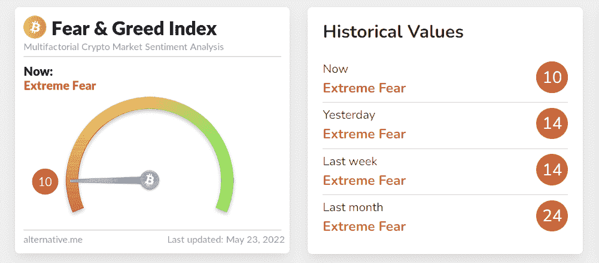

## 我们的秘密情感 Dapp–演示

展望未来，我们希望确保您知道我们的 Web3 应用程序会带来什么。因此，我们即将看到我们完成的秘密情感 dapp 的演示。因此，您将能够决定是否要将您的宝贵时间投入到这个示例项目中。

这是我们的单页 dapp:

从上面的截图可以看出，我们的 crypto perspective dapp 提供了一个干净的设计，它的 UI 相当直观。然而，在上面的图像中你看不到的是，每种加密货币的泡沫“液体”是动画的。因此，你可能想看看本文末尾的视频(0:19)。除了上面显示的三种加密货币(BTC、ETH 和 LINK)，我们的 dapp 还涵盖了其他主要的硬币和代币。当用户进一步向下滚动页面时，它们会显示出来:

我们可以很容易地添加其他硬币。此外，气泡内的百分比表明了选民的意见。较高的数字(绿色“液体”)表明大多数投票者认为硬币的价格会上涨。另一方面，较低的百分比(红色“液体”)意味着大多数选民认为价格会下降。此外，我们的 dapp 内部还有几个按钮。在右上角，我们有“连接钱包”按钮，它负责 [Web3 认证](https://moralis.io/web3-authentication-the-full-guide/)。然后，每个硬币有三个按钮:“向上”、“向下”和“信息”。如果用户点击信息按钮，他们可以看到硬币的当前价格及其描述:

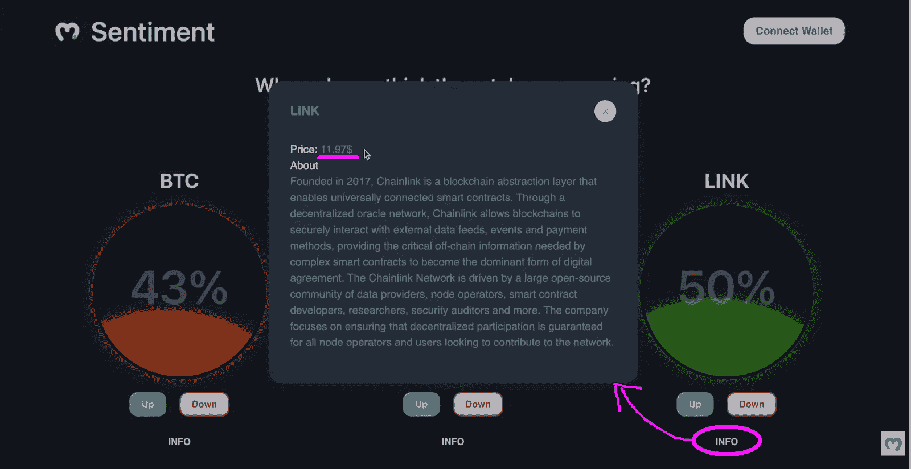

多亏了 [Moralis Web3 API](https://docs.moralis.io/moralis-dapp/web3-api) ，我们可以毫不费力地显示价格。虽然“信息”对所有用户可用，但投票仅限于完成 [Web3 登录](https://moralis.io/how-to-build-a-web3-login-in-5-steps/)的用户:

### 我们的加密情感 Dapp 中的 Web3 认证和投票

用户必须使用我们的智能合同登录并投票，如上所示。因此，他们需要首先使用“连接钱包”按钮:

您可以在上面的截图中看到，示例用户决定使用[元掩码](https://moralis.io/metamask-explained-what-is-metamask/) [Web3 钱包](https://moralis.io/what-is-a-web3-wallet-web3-wallets-explained/)。因此，他的元掩码扩展提示他签名请求。因此，用户需要点击“签名”按钮，以使[通过元掩码](https://moralis.io/how-to-authenticate-with-metamask/)成功认证:

既然示例用户已经登录，他可以使用“向上”和“向下”按钮来提交他的投票。因此，例如，如果用户决定否决链接，他需要点击“向下”按钮。由于这是链上投票，他的投票需要通过链上交易来确认。因此，他的元掩码扩展再次发挥作用:

一旦用户确认了上述交易，他的投票就生效了。这就是 Moralis 仪表板发挥作用的地方，因为它使我们能够轻松地索引区块链。此外，我们已经制定了适当的规则，允许用户对每种加密货币只能投票一次。因此，如果同一用户再次尝试为 LINK 投票，他会收到以下通知:

就我们的示例 crypto perspective dapp 的 UI 演示而言，上面的内容已经完成了。然而，为了向您展示上述事务是实际的链上事件，让我们使用 PolygonScan (testnet)。

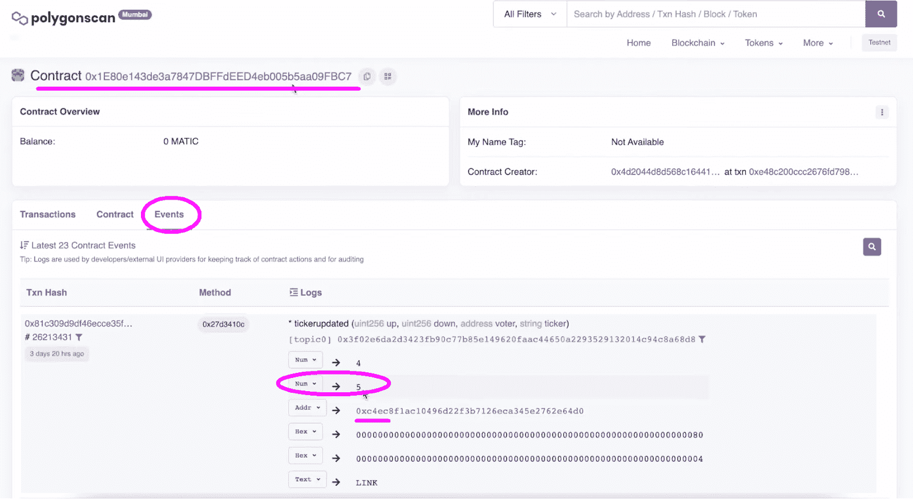

上面的截图清楚地显示了我们的智能合约的与链接向下投票相关的事件。由于这些事件在我们的 dapp 中起着至关重要的作用，所以接下来，您将学习如何[同步和索引智能合约事件](https://moralis.io/sync-and-index-smart-contract-events-full-guide/)。

## 用头盔、反应和 Moralis 创造一个隐秘的情绪 Dapp

现在你已经看到了我们将要建造的多么不可思议的 dapp，你一定很想把手弄脏。事不宜迟，让我们开始创建一个秘密情绪 dapp！

***注:*** *下面的指令，包括下面的视频我们都会引用向前推进，假设你从我们的* [*开始启动代码*](https://github.com/MoralisWeb3/youtube-tutorials/tree/main/FirstDapp-Starter) *。然而，如果你很急，想在几分钟内创建你自己的上述加密情感 dapp 的实例，请使用我们的* [*最终代码*](https://github.com/MoralisWeb3/youtube-tutorials/tree/main/FirsrDapp-Final) *。*

一旦您克隆了我们的起始代码，您将会看到下面的项目布局:

此外，您已经知道我们将使用 Hardhat 来管理我们的智能合同。因此，我们需要涵盖一些安全帽相关的初始设置。我们首先使用“*CD smartcontract”*命令导航到“smart contract”文件夹。接下来，我们用“ *npm i -D 安全帽”*安装安全帽:

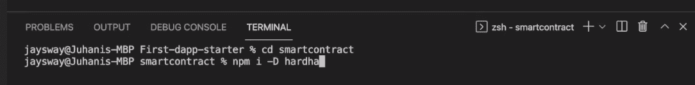

然后，我们使用“ *npx hardhat* ”命令启动一个新的 Hardhat 项目。按照这个命令，我们需要选择“创建一个基本的示例项目”,并按几次“enter ”:

一旦我们创建了一个新的 Hardhat 项目，我们还可以看到“smartcontract”文件夹现在包含了新的元素:

尽管如此，我们还需要安装一些其他的依赖项。因此，我们使用终端输入“ *npm i -D dotenv* ”和“*NPM I-D @ nomic labs/hard hat-ethers can*”。完成初始设置后，我们可以专注于为我们的 dapp 提供支持的智能合同。

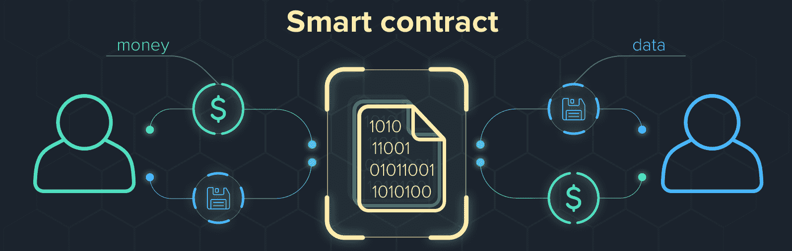

## 隐藏在我们秘密情感背后的智能契约

首先，我们必须打开“Greeter.sol”文件，删除其内容，并将其重命名为“MarketSentiment.sol”。如果这不是你第一次使用 Solidity，你知道我们必须从“pragma”行开始。

接下来是“契约”，它标志着智能契约的真正开始(6:12)。如果你想自己写合同并真正理解它的组成部分，使用下面的视频教程。但是，您也可以从 GitHub("[market 情操. sol](https://github.com/MoralisWeb3/youtube-tutorials/blob/main/FirsrDapp-Final/src/smartcontract/MarketSentiment.sol) ")复制整个代码。

虽然代码的每个部分都至关重要，但“ticker”结构、“tickerupdated”事件和“vote”函数将在我们的投票系统中扮演主要角色。在其他细节中，这是我们决定用户只能为每个硬币投票一次的地方。“添加 Ticker”功能将使智能合约的所有者能够添加 ticker(向我们的加密情感 dapp 添加硬币或令牌)。尽管如此，我们还添加了“getVotes”功能，使任何人都可以获得任何特定股票的涨跌票数。

接下来，我们需要使用 Hardhat 来编译我们的智能契约，然后将其部署到我们选择的网络。如上所述，我们将重点关注 Polygon 的 testnet(孟买)。

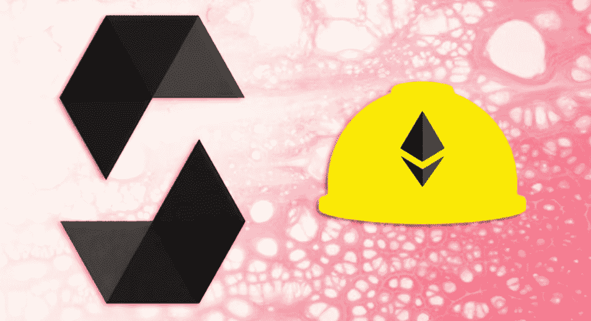

### 编译和部署智能合同

在“scripts”文件夹中，我们有一个“sample-script.js”文件，我们需要将它重命名为“deploymarketpression . js”(16:58)。接下来，我们必须用“市场情绪”和“市场情绪”替换所有的“欢迎者”和“欢迎者”。剩下的就是去掉“你好，安全帽！”来自“market perspective . deploy”的参数。

我们的下一站是“hardhar.config.js”文件(18:05)。对于初学者，我们添加了"*require(" @ nomic labs/hard hat-ethers can ")；*"，"*const dotenv = require(" dotenv ")；*"，以及"*dotenv . config()；*“台词。这也是提示我们去创造。env”文件，我们将在其中创建几个环境变量。其中，我们将使用 PolygonScan 的 API 密钥，这将允许我们验证我们的智能契约*。详情用 19:08 开始的视频。*

接下来，我们需要孟买测试网的端点。幸运的是， [Moralis Speedy Nodes](https://moralis.io/speedy-nodes/) 涵盖了这一点(19:54)。因此，如果您还没有这样做，请创建您的免费 Moralis 帐户来使用此功能:

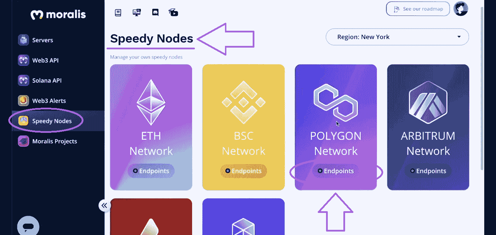

这是我们复制孟买测试网端点的地方:

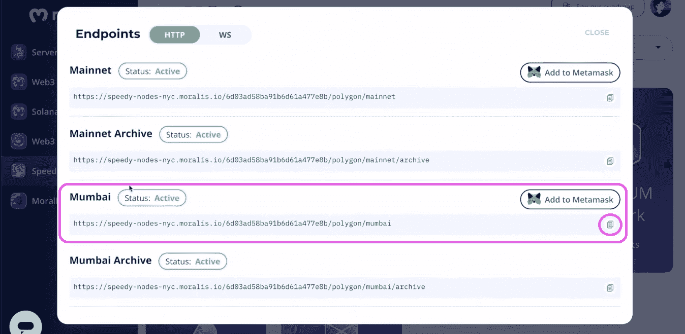

最后，我们还需要输入加密钱包的私钥，我们可以使用元掩码扩展(20:40)获得它。我们转到 MetaMask 浏览器扩展，单击三个垂直点，然后是“帐户详细信息”，最后是“导出私钥”:

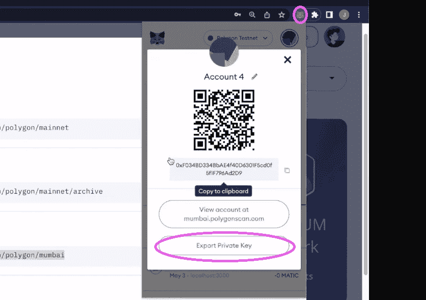

最后，我们有我们所有的环境变量在我们的”。env "文件:

现在，我们返回到“hardhat.config.js”文件(21:10)，在这里我们首先确保将 Solidity 版本更正为“0.8.7”。然后，我们在“module.exports”中创建另一个名为“networks”的对象，我们用它来定义我们的网络:

如上图所示，这也是我们使用环境变量的地方。这样，我们就完成了最后一块拼图。因此，我们已经准备好编译、部署和验证我们的智能合约(22:38)。

#### 用多边形扫描仪读写合同

一旦我们成功地编译、部署和验证了我们的智能契约，我们就可以使用 PolygonScan 与它进行交互。后者还使我们能够访问合同的读写功能:

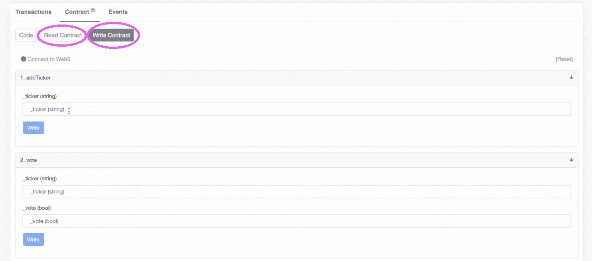

我们可以使用 write 功能向我们的 dapp 添加 tickers。此外，我们还可以检查写功能是否实际上仅限于契约的所有者。因此，我们切换到另一个帐户，并尝试添加一个新的股票。正如你在下面的截图中看到的——由于地址不是所有者，它不能用来写:

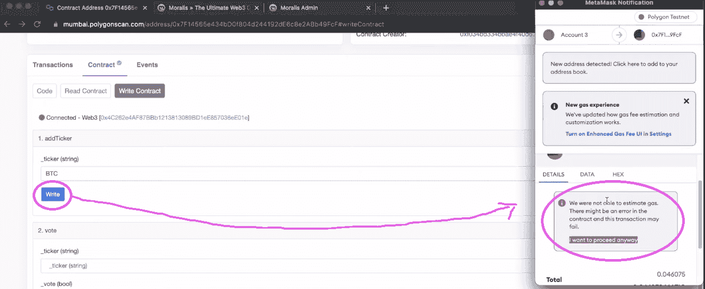

## 加密情感 Dapp–前端

既然您已经将我们的示例 dapp 的核心设置到位，那么是时候创建我们的加密情感 dapp 了。然而，由于你们中的许多人对前端开发并不陌生，我们将把你们交给一位有能力的 Moralis 专家。下面视频的 29:01，你将从初始化 React app 开始。然后，你将创建你的秘密情绪 dapp 的标题(30:03)，硬币部分(32:26)，和投票按钮(38:23)。

然而，为了使按钮和整个应用程序具有交互性，您必须[创建一个 Moralis 服务器](https://docs.moralis.io/moralis-dapp/getting-started/create-a-moralis-dapp) (40:12)。接下来，您将实现 info 模型(41:26)。最后，从 47:27 开始，您将学习如何使用 Moralis Web3 API 轻松地将代币价格包含在“info”模型中。由于 Moralis 的强大功能，您可以使用“getTokenPrice”代码片段来获得实时价格。

## 加密情感 Dapp–后端

从 50:30 开始，你将开始连接你的智能合约和你的 React 应用。这就是 Moralis 仪表板简化事情的地方。它将使您能够轻松地收听和索引您的智能合约事件。因此，您将首先使用 Moralis 的“同步”功能创建一个新的同步事件(50:45):

有了新的“同步”，您的 Moralis 仪表板将自动索引投票。计算比率来显示每个股票的气泡内的百分比值是很容易的。此外，这是您访问 Moralis 仪表板的方式:

这里还有一个对 Moralis 仪表板的预览:

最后，这是我们在整篇文章中引用的视频:

https://www.youtube.com/watch?v=MI_Se26Sfmo

## 如何创建秘密情感 Dapp–总结

我们在本教程中涉及了相当多的内容。按照我们的详细指导，你有机会在不到 70 分钟的时间内创建自己的秘密情绪 dapp。如果您遵循了我们的建议，并从起始代码开始，那么您会对区块链开发有更多的了解。首先，您现在知道了如何使用 Hardhat 来处理智能合约。第二，你有机会更新你的反应技能，创造一个整洁的前端。此外，还向您介绍了 web3uikit 和 Moralis SDK。因此，你现在有机会使用这些工具[成为一名区块链开发者](https://moralis.io/how-to-become-a-blockchain-developer/)。

既然“熟能生巧”，我们鼓励你承担更多的范例项目。你可以在[Moralis 网 YouTube 频道](https://www.youtube.com/c/MoralisWeb3)和[Moralis 网博客](https://moralis.io/blog/)上找到它们。一些最新的话题说明了如何[用幻影钱包](https://moralis.io/how-to-authenticate-solana-users-with-the-phantom-wallet/)认证索拉纳用户，如何创建 NFT [连锁库存系统](https://moralis.io/create-an-nft-on-chain-inventory-system-for-gaming/)，如何构建[去中心化 Twitter](https://moralis.io/2022-guide-to-building-a-decentralized-twitter/) ，以及如何构建市场[购买游戏内 NFTs](https://moralis.io/build-a-marketplace-to-buy-nfts-in-game/)。此外，主题还会教你关于[可靠性智能合约](https://moralis.io/what-are-solidity-smart-contracts-full-solidity-tutorial/)、EIP 1559 示例[、](https://moralis.io/eip-1559-example-what-is-eip-1559/)[分散金融(DeFi)](https://moralis.io/what-is-defi-the-full-decentralized-finance-guide/) 等。此外，一定要报名参加每周的[Moralis 项目](https://moralis.io/projects/)。然而，当我们采取专业的方法时，我们中的一些人进步最有效率。如果这也适用于你，那么进入 Moralis 学院可能是你的正确道路。

****