# 如何在 10 分钟内创造一把刀

> 原文：<https://moralis.io/how-to-create-a-dao-in-10-minutes/>

如果你一直关注以太坊生态系统的发展过程，包括 [**Web3 apps**](https://moralis.io/metamask-for-developers-how-to-launch-web3-apps-with-metamask/) **和 DeFi(去中心化金融)项目，那么你可能对“道”这个术语很熟悉。此外，通过创建一个网络参与者可以自由投票的 DAO，您将使您的项目更接近区块链技术的核心——去中心化。因此，对于任何想要成功的******区块链开发者来说，学习如何创建一个 DAO 将被证明是非常有益的。此外，通过使用 Moralis 的**[**web 3**](https://moralis.io/web3-boilerplate-beginners-guide-to-web3/)**平台，您可以快速完成此操作，并在短短十几分钟内创建一个刀。****

**DAO，即分散自治组织，是一个总部位于区块链的组织，它改写了领导和治理规则。它使用智能合约来取代层级结构。此外，它允许社区的独立成员对相关问题进行投票，通常使用本地令牌。**

**今天，已经有几个 Dao 存在，它们大多基于以太坊[智能合约](https://moralis.io/smart-contracts-explained-what-are-smart-contracts/)。智能契约的规则决定了 DAO 中的行为和限制。而且第一把刀是 2016 年在以太坊上造的。它因为一个漏洞而失败了，但是从那以后，开发人员社区已经从中学到了很多。因此，[以太坊](https://moralis.io/full-guide-what-is-ethereum/?utm_source=blog&utm_medium=post&utm_campaign=MetaMask%2520for%2520Developers%2520%25E2%2580%2593%2520How%2520to%2520Launch%2520Web3%2520Apps%2520with%2520MetaMask)和区块链自从第一次尝试创造一把刀以来就更加强大。**

**Dao 有许多不同的目的和功能。例如，它们可以用于[以太坊 dApps](https://moralis.io/ultimate-guide-how-to-build-ethereum-dapps/) 的治理。它们还可以用于在任何分散的平台上提议和决定变更。因此，它们避免了开发商或所有者之间的集中控制。此外，Dao 在游戏中也有一个用例。拥有巨大的游戏和互动可能性的元宇宙有许多部署 Dao 的机会。因此，对于任何一个对区块链开发感兴趣的人来说，知道如何创建一个 DAO 是非常重要的。**

## **用 Moralis 快速造刀**

**虽然学习如何创建一个 DAO 的想法看起来相当令人畏惧和复杂，但是 DAO 现在已经变得很容易构建了。多亏了最终的 Web3 开发套件 Moralis，DAO 构建已经成为一个更快、更简化的过程。**

**如果你想直接进入视频教程，看看这个来自 Moralis YouTube 频道的简单指南:**

**https://www.youtube.com/watch?v=S-yBqLWEtGw

## 什么是刀？

在你学习创造刀之前，你必须先了解刀是什么。如前所述，DAO 是一个通过以太坊智能合约管理的组织。它允许网络参与者在世界任何地方就影响组织的相关问题自由投票。“道”消除了传统形式的治理，传统形式的治理通常是鼓励高度集权和权力集中的结构。

因此，你可以说“道”是区块链推动的民主。此外，它通过允许参与者决定更具体的问题来维护互联网上的这种民主结构。今天，即使是过去被认为过于“微小”或无关紧要而不能由群体决定的问题，也可以在论坛上定期讨论和决定。此外，在 DAO 中，所有参与者都可以决定对协议进行大的或小的调整。

### 象征性参与

通常，这种决策能力是由本机令牌提供的。但是，为什么是令牌呢？本机令牌支持平台的运行，鼓励游戏中的皮肤，是为组织筹集资金的快速方法，管理激励措施，并创建透明度。令牌遵循不同的标准，但是 ERC-20 令牌标准仍然是一个广泛流行的选择。用户通过在类似 MetaMask 的 Web3 钱包上签署交易来投票。

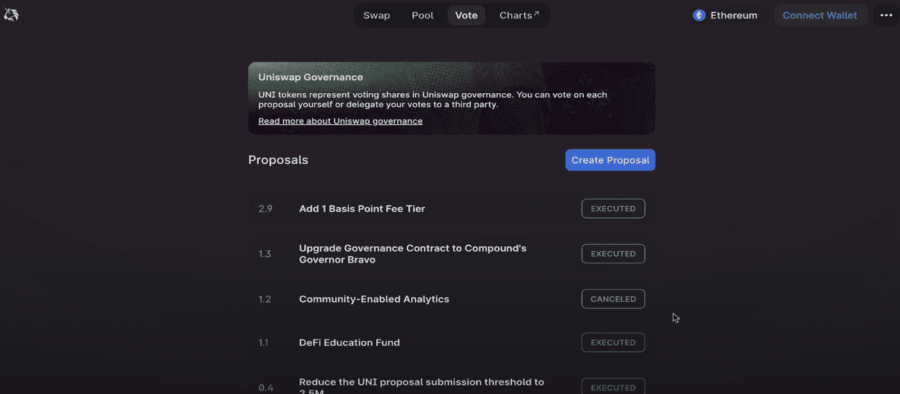

**uni swap DAO 治理快照**

代币也决定了你投票的权重。例如，如果一个令牌相当于一个有表决权的股份，那么持有更多有表决权股份的人对决策的影响就更大。有许多方法可以根据代币来衡量一个人的投票权重。此外，所有这些投票都是自愿的。人们可以选择参加或不参加某些投票。

因此，Dao 带来的另一个优势是透明性。因此，交易可以在区块链上自由查看。因此，很难撒谎或隐瞒决策过程。

简单地说，当您创建 DAO 时，您可以允许您的 dApp 的用户运行整个组织的一部分。

## 为什么要造刀？

为什么会有人想造一把刀？它与 dApps 或[区块链发展](https://moralis.io/best-languages-for-blockchain-development-full-tutorial/)项目有何关联？你应该创造一把刀的原因有很多。Dao 可以应用于许多不同的情况、场景和协议。例如，在 DeFi 中，Dao 可以通过让用户参与他们的协议更新来帮助建立信任。开发人员可以对协议提出新的修改，但是为了赢得信任，用户可以投票决定是否应该实施修改。

DeFi DAO 应用的例子有借贷平台、收益型 dApps 和分散交易所(dex)。如果你想学习如何创建一个索引，请访问 Moralis 博客，获得一个简单的五步指南。

今天的道景观比过去更有活力。它由协议 Dao、投资 Dao、服务 Dao 和社会 Dao 组成。再者，你还可以找到几个对生态系统影响很大的 DAO 运营系统，比如 Aragon、Syndicate、Orca、DaoStack 等。此外，还有赠款 Dao 和媒体 Dao。如果你对 NFT dApps 或 NFT 平台感兴趣，收藏者 Dao 是相关的。

作为一名区块链开发人员，学习如何创建 DAO 可以丰富您希望构建的任何项目。无论你是对金融感兴趣，还是对如何创建 NFT 市场感兴趣，Dao 都有用处。此外，如果您想在元宇宙中构建一个 DEX、DeFi 协议、游戏 dApp 或 dApp，您可以创建一个 DAO 来补充您的项目。

## 在元宇宙造一把刀

“元宇宙”这个流行语这些天一直在流传，它令人兴奋。好消息是，Dao 也将他们的相关性扩展到了元宇宙。已经在治理中使用或计划使用 DAO 的平台示例有 Sandbox 和 Decentraland。此外，沙箱已经设置了实现 DAO 的时间表。然而，分散的土地，一个完整的 3D 生态系统，已经建立了它的道。通过分散的 DAO，它的成员可以对提议的游戏更新进行投票。

### DAO 标记的示例

DAO 标记是 DAO 设计的重要部分，也是创建 DAO 生态系统时必不可少的一部分。今天区块链空间中的一些最大的道令牌是:

1.  **Aave**–Aave(AAVE)令牌用于世界第三大 dApp 和以太坊第二大借贷协议。它促进了 Aave 平台上的借贷，该平台已经拥有 130 亿美元的 TVL。
2.  **Maker**–Maker(MKR)用于 DeFi 最大的借贷平台 MakerDAO。它允许用户对 MakerDAO 的参数进行投票，包括业务逻辑和风险管理系统。
3.  **unis WAP**–unis WAP(UNI)令牌和 DEX 广受欢迎。这个平台目前在 TVL 拥有约 100 亿美元，是以太坊上第二大指数。持有 UNI 令牌的用户可以对新提案进行投票。然而，开发人员在 Uniswap 的决策上仍然有很大的发言权，这使得 uni swap 不如其他部门分散。

## 以创纪录的速度创建一个 DAO 应用程序

虽然刀的概念很复杂，但制作一把刀并不需要花费太多的时间和精力。对于一个熟练的区块链开发人员来说，他擅长 Solidity smart contracts，并且在 JavaScript 和 Web3.js、dApps、NFT 平台和其他方面有很好的基础，这应该不会是一个太大的飞跃。此外，了解如何在创纪录的时间内创建 DAO 可以为您的项目增加许多好处。

此外，使用 Moralis，您可以快速构建强大的工具，为您的 DAO 添加功能。

本教程让您构建一个 DAO 应用程序或小部件，让用户在 DAO 中执行最重要的操作之一——使用 Web3 wallet(如 [MetaMask](https://moralis.io/metamask-explained-what-is-metamask/) )在投票中签名。

### 第一步——注册 Moralis

如果你想快速创建一个 DAO，你需要做的第一件事就是[向 Moralis](https://admin.moralis.io/register?utm_source=blog&utm_medium=post&utm_campaign=MetaMask%2520Explained%2520%25E2%2580%2593%2520What%2520is%2520MetaMask%253F) 注册。Moralis 是目前最好的 Web3 开发者工具包，它提供了许多竞争优势，可以让你立刻启动你的 dApps。

此外，在创建 DAO 应用程序时，这一步对于执行后续步骤至关重要。

### 步骤 2-获取 Moralis 调查代码库

前往 [GitHub repo 进行 Moralis 调查](https://github.com/ashbeech/moralis-poll)。Moralis 调查代码库是来自 [Web3 社交网络样板](https://github.com/ethereum-boilerpla...)的派生或克隆。这一步为您节省了大量时间，因为它处理了许多关于用户和连接到 Web3 所需的功能。您可以使用它作为基础样板文件，而不是从头开始编写代码。

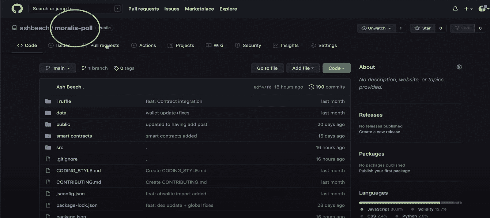

所以，克隆 Moralis 投票代码。然后，将链接复制到 GitHub repo，如下所示。而且，还有一个选择就是给自己叉。

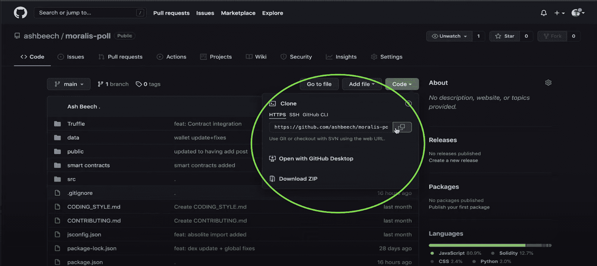

转到 Visual Studio 代码(VSC)。访问您的终端，输入“git clone ”,并将链接粘贴到存储库。这会将其克隆到本地开发环境中。

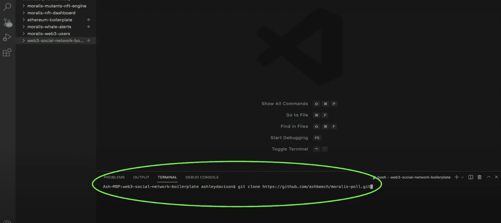

现在，您可以将该文件夹添加到您在 VSC 的工作区中。

### 步骤 3–将 dApp 代码库链接到 Moralis 服务器实例

去你的 Moralis 账户。然后，通过点击右上角的按钮“create a new server”来创建一个新的服务器，并选择 testnet 选项。

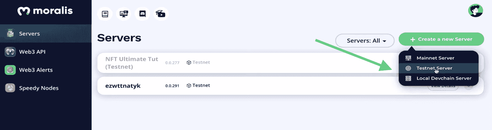

命名您的项目，选择您的区域，然后选择您想要处理的任何链。对于本教程，我们使用多边形孟买链。现在，单击弹出窗口右下角的“添加实例”。

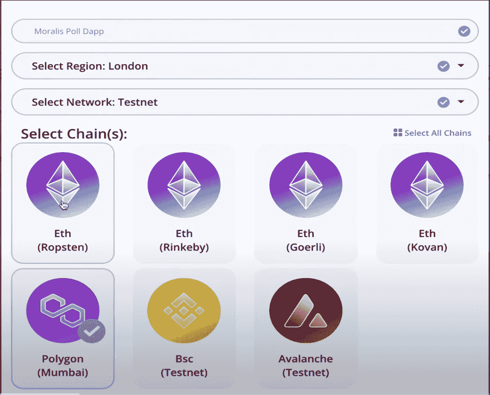

设置好服务器后，单击“查看详细信息”获取必要的信息。

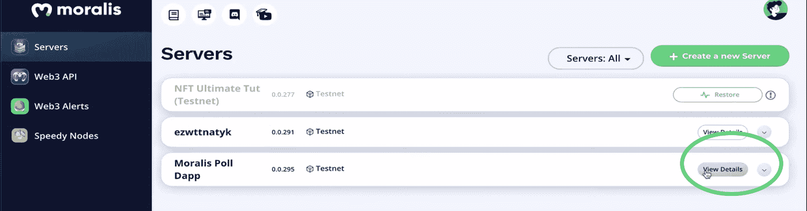

您需要您的 Moralis 服务器 URL 和应用程序 ID。因此，把它们复制到你的剪贴板上。

现在，回 VSC 去，去找那个”。env”文件。在上面，张贴 Moralis 提供的服务器 URL 和应用程序 ID。

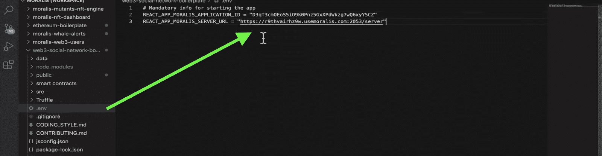

### 步骤 4–创建 DAO–测试您的 dApp

点击保存后，您需要测试您的新 dApp。为此，请观看视频 3:23 开始的关于如何测试 dApp 的教程细节。

此外，在测试时，您需要记住 dApp 允许您立即创建一个投票，并使用 MATIC 令牌在 MetaMask 上签署您的投票。

当然，我们这里使用的令牌类型是一个 [testnet 加密令牌](https://moralis.io/create-free-token-how-to-deploy-your-own-testnet-crypto-token-in-10-mins/)，它可以通过水龙头获得。此外，您的小部件将检查您的钱包中是否有足够的令牌能够在投票中投票。否则，投票不会显示在您的屏幕上。视频中的演示从 4:40 开始。

经过测试，DAO 应用程序或小部件应该如下所示，您的 testnet MATIC 令牌允许您参与和投票。

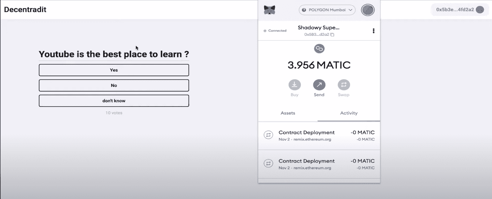

如果你想了解更多关于如何使用 MetaMask 启动 Web3 应用的信息，只需在 Moralis 博客上进一步阅读该主题。

注意，这样做不需要额外的代码，因为克隆的代码库中已经包含了这些特性。此外，样板文件还包含通过元掩码或 Web3 wallet 进行用户认证的所有功能。因此，您不需要编写任何代码来访问 Web3 功能来管理用户。

这个小部件是一个名为“react-polls”的节点模块。这是在构建前端以创建 DAO 应用程序时节省时间的依赖项之一。

此外，所有这些都是通过 Moralis 无缝完成的，它允许您创建一个新的服务器，并在方便的时候点击一下就可以选择您的测试链。此外，您可以连接到区块链，而无需在后端做任何繁重的工作。

#### 验证 Moralis

要检查 dApp 是否连接到 Moralis 服务器实例，请转到 Moralis 仪表板。为此，只需点击如下所示的按钮:

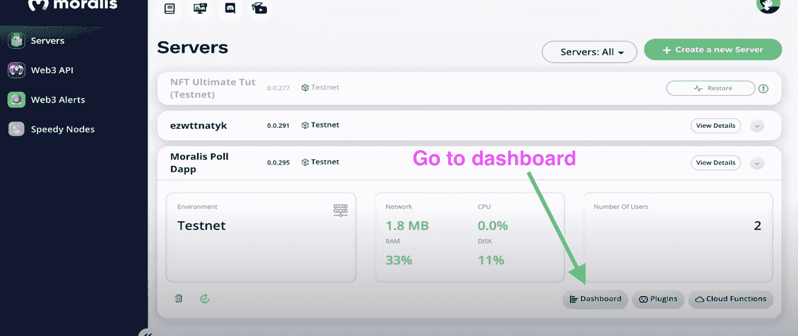

在您的仪表板上，转到“投票”。在那里，您将能够查看和检查与您的投票相关的所有数据，包括所有已签名投票的地址。此外，在“选项阵列”下，您可以看到投票中每个选项的投票次数。

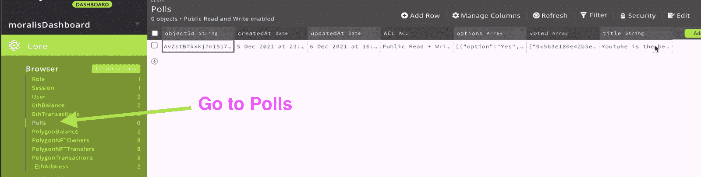

这样，您就可以确信您的 dApp 确实在运行并连接到了 Moralis 服务器。

## 创建一个 DAO——深入代码

要更深入地了解如何创建 DAO 应用程序，以及如何改编 Web3 社交网络样板代码来构建投票组件，只需查看指南的其余部分。这一段从视频的 6:45 开始。

此外，它还展示了如何定制默认组件来创建“polls”组件。polls 组件(“polls.js”)借用了样板文件，因此它可以插入任何使用“react-moralis”或“react-polls”的 React 应用程序中。

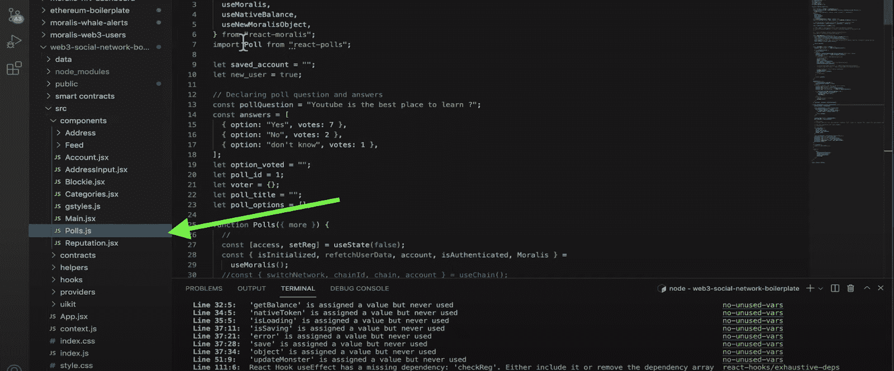

此外，“反应-Moralis”包含所有的 Moralis 功能。这意味着它拥有用户组件、本机余额和钱包检查功能。在这种情况下，Moralis 检查 Polygon Mumbai testnet 的令牌余额信息。

对于其余的代码分解，请务必观看视频教程。

## 在 10 分钟内创建一个 DAO–总结

随着去中心化成为当今治理系统的主旨，任何开发人员都将从学习如何创建 DAO 中受益。除了理解 Solidity smart contracts 的[用例之外，您现在可以应用它们来进一步分散您的新 dApp。](https://moralis.io/use-cases-for-solidity-smart-contracts/)

考虑到设置区块链服务器的后端需求，创建 DAO 通常需要更长的时间。然而，Moralis 为您提供了出色的功能，当您使用其即时服务器创建功能和其他令人兴奋的功能(允许您连接到各种区块链)时，可以将开发时间缩短至十分钟。

测试您的新 DAO 变得像点击几下鼠标一样简单。此外，有了[Moralis 学院](https://academy.moralis.io/)提供的令人兴奋的资源，你可以进一步增强你的 dApp 创作。例如，[以太坊智能合约编程 101](https://academy.moralis.io/courses/ethereum-smart-contract-programming-101) 课程可以让你了解 Dao 和去中心化应用程序世界中正在发生的事情。

处理完后端，前端简化到几个步骤，您可以看到 Moralis 如何让您在所有 Web3 和 dApp 项目中获得优势。只需在网站上注册，查看上面发布的内容，您就可以开始构建自己的 DAO 了！**