# 如何通过 5 个步骤用 PlayFab 和 Unity 创建 Dapp

> 原文：<https://moralis.io/how-to-create-a-dapp-with-playfab-and-unity-in-5-steps/>

微软 Azure PlayFab 是一个强大的游戏后端平台。与 Unity 相结合，它可以帮助您轻松创建高级游戏。然而，真正的机会在于 Web3 游戏。因此，我们决定在这里展示如何使用 PlayFab 创建 dapp(分散式应用程序)。使用这个伟大的遗留工具进行 Web3 开发的关键是[](https://moralis.io/)****。这个企业级 Web3 API 提供者为您提供了三个核心功能，使您能够创建** [**分散式应用**](https://moralis.io/decentralized-applications-explained-what-are-dapps/) **。借助 Moralis 的** [**Web3 认证**](https://moralis.io/authentication/) **功能，您可以毫不费力地让用户登陆。使用来自 Moralis 的**[**web 3 syncs**](https://moralis.io/syncs/)**，您可以在智能合约和您的 dapps 之间建立通信路径。此外，Moralis 的 Web3 API 允许您使用单行代码轻松获取各种链上数据。****

**虽然我们在这里主要关注 PlayFab，但我们也会利用 Unity。因此，如果你想用 PlayFab 和 Unity 创建一个 dapp，你可以通过完成以下五个步骤来实现:**

***   完成初始 Microsoft Azure PlayFab 设置*   设置 Azure 函数*   使用 Visual Studio 代码创建 Azure 函数(VSC)*   使用 VSC 部署 Azure 功能*   设置 Unity 并将其与 Microsoft Azure PlayFab 连接**

**然而，在我们处理以上五个步骤之前，我们需要向你展示如何[创建你的免费 Moralis 账户](https://admin.moralis.io/register)。后者将是你获得 Moralis Web3 API 密匙的门票，在设置 Azure 函数时你将需要它。因此，如果你想用 PlayFab 创建一个 dapp，创建一个 Moralis 帐户是一个先决条件。此外，在我们卷起袖子之前，您应该注意到 Moralis 是跨链互操作的。因此，它使您能够轻松地针对所有领先的可编程区块链，包括以太坊，索拉纳，雪崩，多边形，BNB 链，克罗诺斯等。反过来，您可以快速扩展您的覆盖范围，让您的 dapps 经得起未来考验！**

**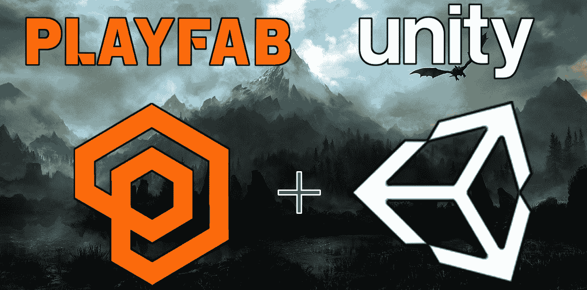

## 创建一个以 PlayFab 和 Unity 为主要前提的 Dapp

如上所述，您需要准备好您的 Moralis 帐户，以便获得您的 Moralis Web3 API 密钥。后者将是设置 Azure 函数时的一个重要部分。所以，如果你还没有这样做，使用“创建你的免费 Moralis 账户”链接。另一方面，您也可以访问 Moralis 主页，点击“免费开始”按钮之一:

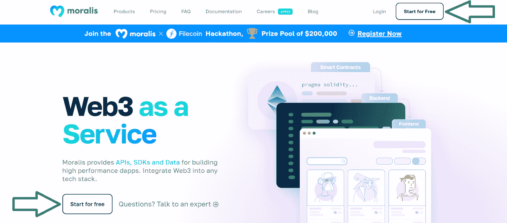

在下一步中，输入您的电子邮件地址并创建您的密码:

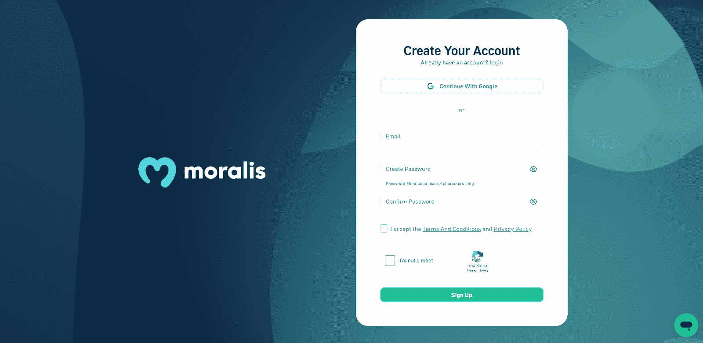

此外，不要忘记通过点击确认链接来确认您的帐户，该链接将出现在您的电子邮件收件箱中。完成后，您将能够访问您的 Moralis 仪表板。在那里，您需要点击侧边菜单中的“Web3 APIs”选项:


如果你计划专注于以太坊或其他 EVM 兼容的连锁店，EVM API 将是你的重点。然而，如果你想在 Solana 上创建 dapps，选择“Solana API”。然后，点击“复制 API 密钥”，接着点击“Web3 Api 密钥”:

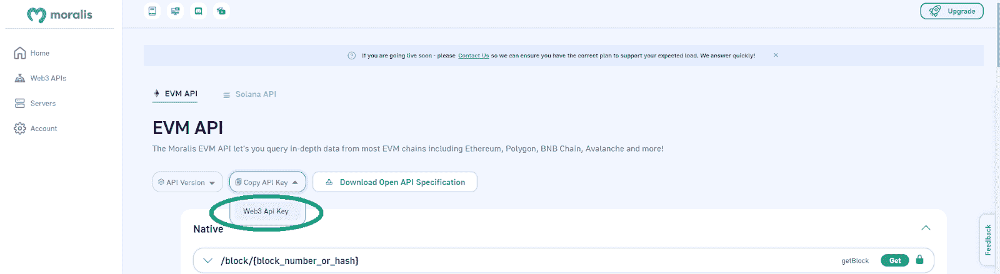

这样，您将看到一个通知，说明您已经成功复制了您的 Moralis Web3 API 密钥:


尽管如此，还有另一种方法来复制您的 Moralis Web3 API 密钥。您可以通过“帐户”选项获得它。进入“帐户设置”页面后，单击“密钥”选项卡，然后复制您的 Web3 API 密钥:


## 用 Playfab 和 Unity 通过 5 个步骤创建一个 Dapp

如果你还记得，我们需要通过这五个步骤来创建一个带有 PlayFab 和 Unity 的 dapp:

1.  完成初始 Microsoft Azure PlayFab 设置
2.  设置 Azure 函数
3.  使用 Visual Studio 代码创建 Azure 函数(VSC)
4.  使用 VSC 部署 Azure 功能
5.  设置 Unity 并将其与 Microsoft Azure PlayFab 连接

接下来，我们将把五个主要步骤分成几个小步骤。因此，你将能够很容易地跟随我们的领导，用 PlayFab 和 Unity 创建一个 dapp。

## 使用 PlayFab 创建 Dapp–步骤 1:初始 Microsoft Azure PlayFab 设置

你可能已经明白，你需要一个有效的 PlayFab 帐户来使用这个微软的游戏开发工具。幸运的是，你可以选择一个免费的计划来开始，不需要任何额外的费用。也就是说，你必须首先访问 PlayFab 官方网站。使用您最喜欢的浏览器和可靠的搜索引擎:

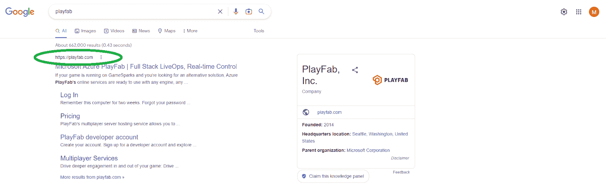

进入 PlayFab 主页后，点击“注册”按钮:

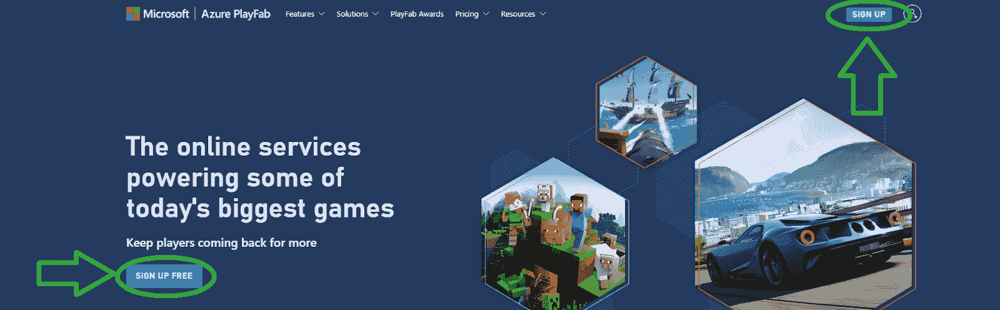

上述按钮将带您进入 PlayFab 注册页面，您需要在此输入您的凭据:

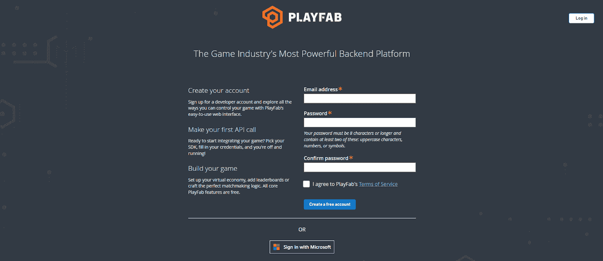

准备好 PlayFab 帐户后，您需要创建一个新游戏。正如您在下图中看到的，我们将我们的命名为“Moralis”:

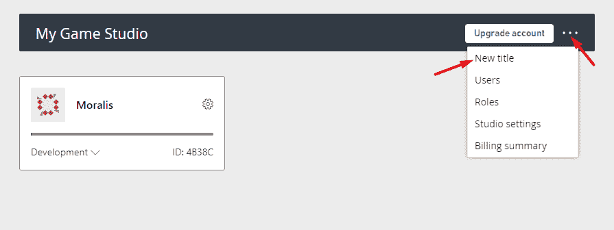

然后，您需要转到您的设置:


接下来，导航到“API 特性”选项卡，并记下“标题 ID”。当我们继续设置 Azure 函数时，您将需要这个 ID。记下您的标题 ID，转到“秘钥”选项卡，写下您的“秘钥”。与“标题 ID”一样，您将在本教程的第二个主要步骤中需要该值。

## 使用 PlayFab 创建 Dapp–步骤 2:设置 Azure 函数

在第一步中，你获得了你的 PlayFab“标题 ID”和“密钥”。这样，你现在就可以设置你的 Azure 函数了。我们通过使用 Azure Function App 来实现这一点，它使您能够构建 web APIs。因此，我们将使用 Azure 特性在后端运行 Moralis。但是 Azure Function App 是一个独立的产品，需要另外一个账号才能使用。因此，请确保创建您的免费 Azure 帐户:

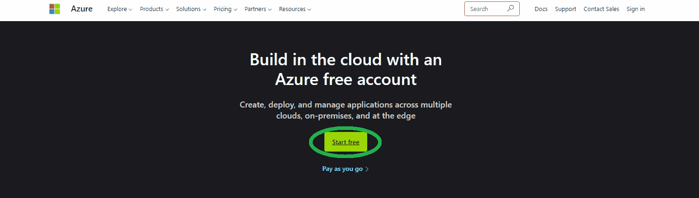

接下来，您必须创建您的 Microsoft 客户协议(MCA)订阅。基本上，你需要完成 15 个简单的步骤。有关详细说明，请使用 Microsoft 的文档。

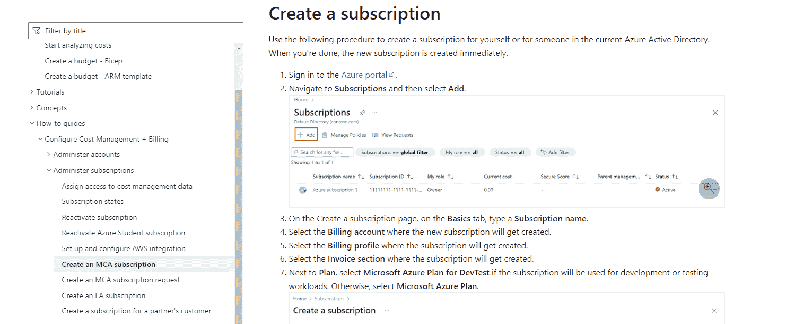

准备好 MCA 后，使用 Azure 搜索栏并输入“功能应用”:

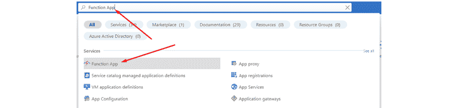

选择“功能应用”(如上所示)后，您将创建一个新的功能应用。使用下面的截图来匹配您的设置:

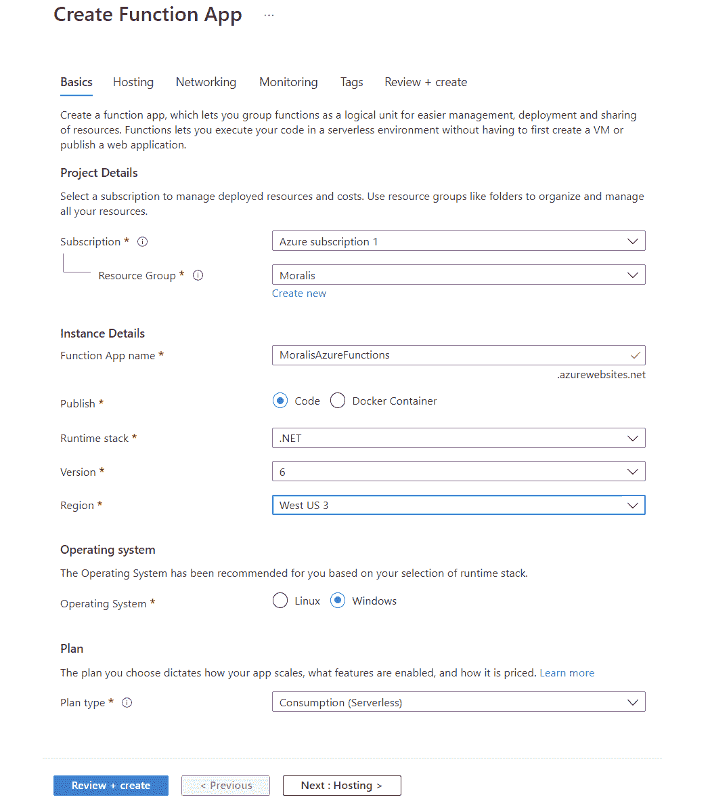

准备好上述详细信息后，单击“查看+创建”按钮，然后单击“创建”。然后，您需要打开上面创建的名为“MoralisAzureFunctions”的函数应用程序:

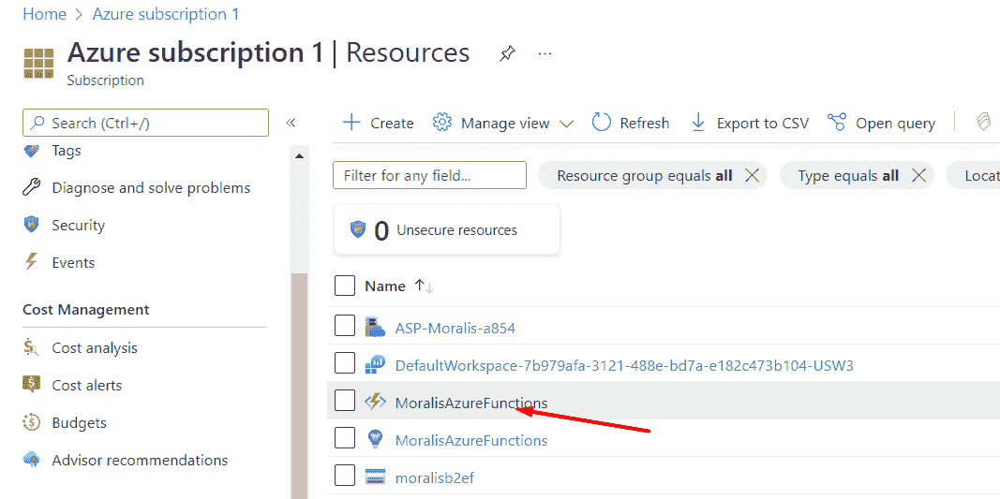

接下来，转到“配置”并单击“新应用程序设置”选项:

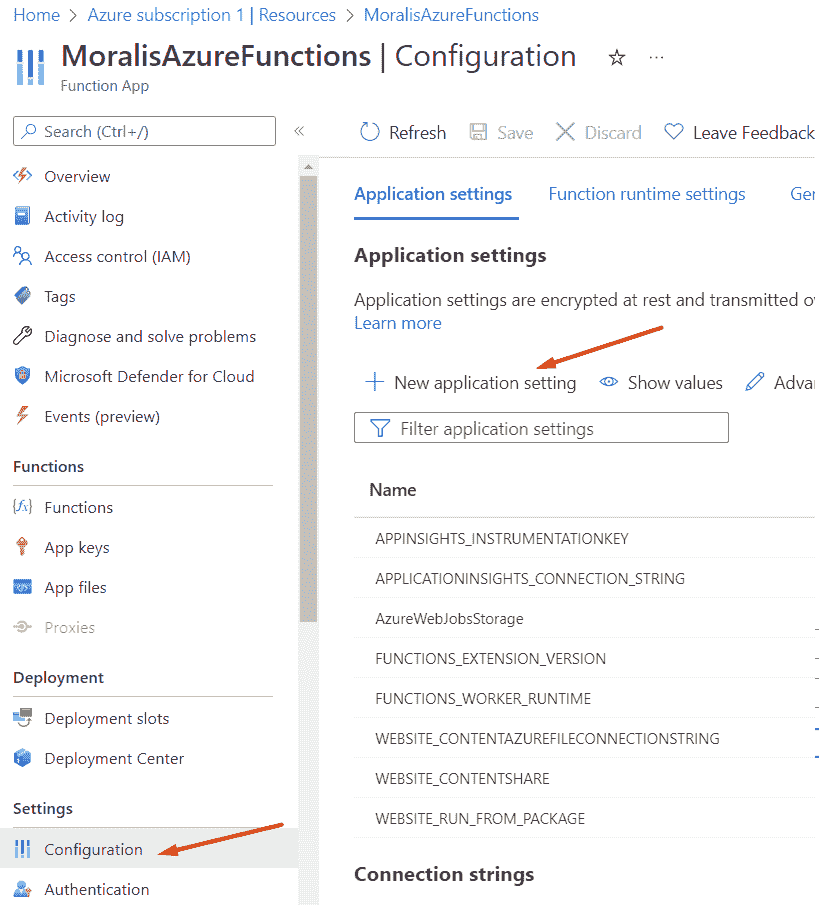

将新的应用程序设置命名为“ *MORALIS_API_KEY* ”。将您之前获得的 Moralis Web3 API 密钥粘贴到值输入字段中。此外，保持“部署插槽设置”选项未选中，并点击“确定”。

再按四次“新应用程序设置”按钮，创建以下四种应用程序设置。于是，重复上述动作；但是，请使用以下详细信息:

*   **第二应用设置:**

*   名称:"*Moralis 认证应用编程接口 URL* "
*   值:"*https://authapi.moralis.io/*"

*   **第三应用设置:**
    *   名称:"*Moralis _WEB3_API_URL* "
    *   值:"*https://deep-index.moralis.io/api/v2*"
*   **第四应用设置:**
    *   名称:" *PLAYFAB_TITLE_ID* "
    *   值:您的 PlayFab 标题 ID(从上面获得)
*   **第五应用设置:**
    *   名称:" *PLAYFAB_DEV_SECRET_KEY* "
    *   值:您的 PlayFab 密钥(从上面获得)

完成上述所有应用程序设置后，点击“保存”:


最后，点击“继续”:

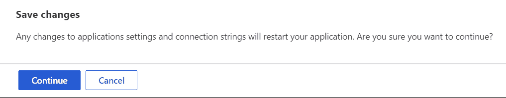

## 使用 PlayFab 创建 Dapp–步骤 3:使用 Visual Studio 代码创建 Azure 函数(VSC)

在你着手用 VSC 创建 Azure 函数之前，你需要准备好以下先决条件:

*   的。Net 6.0 SDK
*   Azure functions 核心工具版本 4.x
*   下载并安装 Visual Studio 代码
*   VSC 的 C#扩展
*   VSC 的 Azure 功能扩展

此外，用 PlayFab 创建 dapps 的这一步都是为了编写集成了 Moralis SDK 的 Azure 函数。为了简化，我们在 GitHub 上提供了完整的代码。

从打开 VSC 开始。然后，选择“Azure”，接着选择“Resources”，在这里您可以添加一个功能:

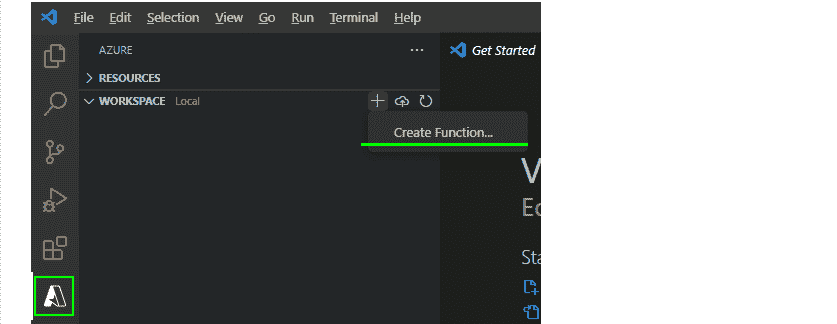

接下来，单击“创建新项目”并选择一个现有文件夹或创建一个新文件夹。请随意跟随我们的领导，创建“示例-验证-azure-功能”文件夹。此外，确保选择 C#作为编程语言:

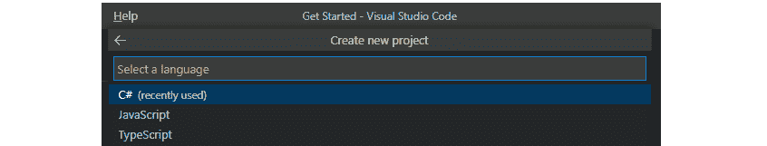

然后，选择“.NET 6.0 LTS”运行时:

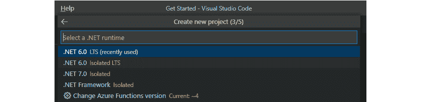

接下来，选择“HTTP 触发器”作为模板:

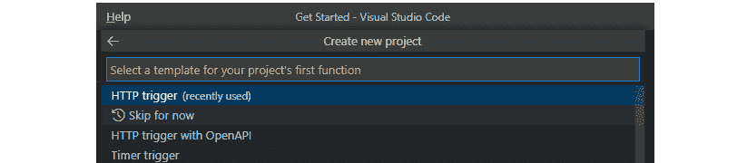

然后，提供" *PlayFab。AzureFunctions* "作为项目的根命名空间:


就“*访问权限*而言，选择“功能”:

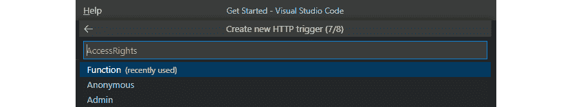

接下来，选择“在当前窗口中打开”选项。然后，您将看到一个弹出窗口，指示缺少的依赖项。点击“恢复”按钮:

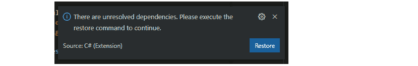

最后，打开”。csproj "文件。在其中，您应该看到“ *ItemGroup* ”元素和一个或多个“*package reference*”元素。您需要选择该部分，并用以下代码行替换它:

```js
<ItemGroup>
    <PackageReference Include="Microsoft.NET.Sdk.Functions" Version="4.1.1"/>
    <PackageReference Include="PlayFabAllSDK" Version="1.127.220718"/>
    <PackageReference Include="PlayFabCloudScriptPlugin" Version="1.53.190627-alpha"/>
    <PackageReference Include="Moralis" Version="2.0.4-beta"/>
</ItemGroup>
```

不要忘记保存更新的文件。

### 主要功能代码演练

当您创建函数时，它会生成“ChallengeRequest.cs”文件。但是，我们希望您将其重命名为“MoralisPlayFab.cs”，并将该类重命名为“ *MoralisPlayFab* ”。接下来，您需要用以下语句替换现有的“【T2 使用”语句:

```js
using System;
using System.IO;
using System.Threading.Tasks;
using System.Collections.Generic;
using Microsoft.AspNetCore.Mvc;
using Microsoft.AspNetCore.Http;
using Microsoft.Azure.WebJobs;
using Microsoft.Azure.WebJobs.Extensions.Http;
using Microsoft.Extensions.Logging;
using PlayFab.ServerModels;
using Moralis.Network;
using Moralis.AuthApi.Models;
using Moralis.AuthApi.Interfaces;
using Newtonsoft.Json;
```

然后，在" *MoralisPlayFab* "类中创建以下变量:

```js
private static string AuthenticationApiUrl = Environment.GetEnvironmentVariable("MORALIS_AUTHENTICATION_API_URL", EnvironmentVariableTarget.Process);

private static string Web3ApiUrl = Environment.GetEnvironmentVariable("MORALIS_WEB3_API_URL", EnvironmentVariableTarget.Process);

private static string ApiKey = Environment.GetEnvironmentVariable("MORALIS_API_KEY", EnvironmentVariableTarget.Process);
```

您还需要将“ *run* 方法”的名称改为“ *ChallengeRequest* ”。此外，删除“ *HttpTrigger* ”的“ *get* ”参数。尽管如此，还是复制了“*challenge request*”方法，并将其重命名为“ *ChallengeVerify* ”。此外，还将以下代码行添加到这两种方法中的每一种方法中:

```js
// Create the function execution's context through the request
string requestBody = await new StreamReader(req.Body).ReadToEndAsync();
// Deserialize Playfab context
dynamic context = JsonConvert.DeserializeObject(requestBody);
var args = context.FunctionArgument;
```

有关这两种方法的详细代码演练，请使用 [Moralis 的文档](https://docs.moralis.io/docs/using-unity-playfab)。“挑战请求方法”部分将带您了解“*挑战请求*方法的详细信息。此外，“挑战验证方法”部分将带您了解“*挑战验证*方法。

此外，在文档中，您将学习如何添加检索钱包余额的方法，包括可替换和不可替换的令牌(NFT)。这就是 Moralis 的力量让事情变得轻而易举的地方。

*注:* *使用之前的“GitHub”链接或访问“完整的 Moralis 展示 Fab.cs”部分查看完整代码。*

## 使用 PlayFab 创建 Dapp–步骤 4:使用 VSC 部署 Azure 功能

有了上面几行代码，是时候部署你的 Azure 功能了，你可以用 VSC 来完成。因此，首先登录 Azure:

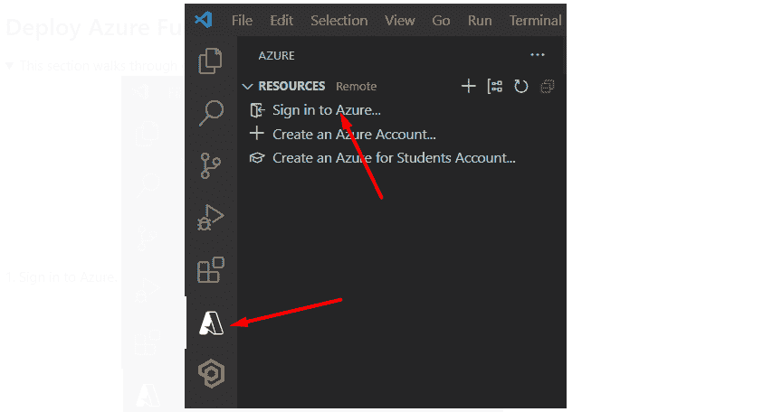

一旦登录 Azure，你就可以右键单击“Moralis AzureFunctions”。然后，选择“部署到功能应用程序”选项:

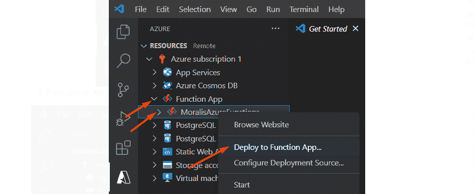

要继续，您需要在弹出窗口中单击“部署”:

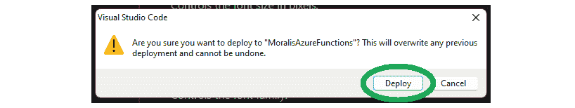

部署完 Azure 功能后，您需要进入 PlayFab 仪表板中的“自动化”:

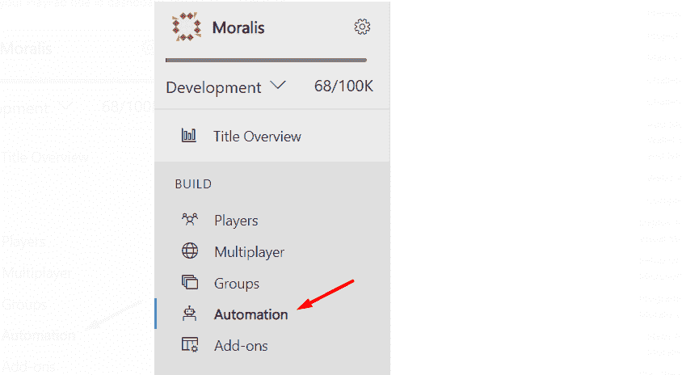

然后，选择“注册函数”选项，并将“触发器”类型设置为 HTTP。接下来，在函数名下输入“ *ChallengeRequest* ”，并从 VSC 复制粘贴函数 URL。要获取 VSC 的功能 Url，请右键单击“功能”下的“*挑战请求*，然后单击“复制功能 URL”:

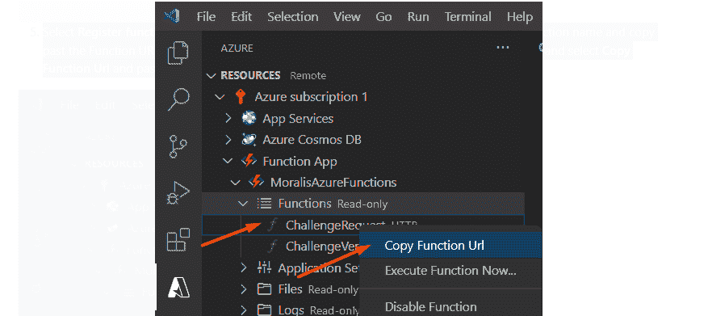

第二次选择“注册函数”选项，再次将“触发器”类型设置为 HTTP。这次对“ *ChallengeVerify* ”(函数名)重复上述过程:

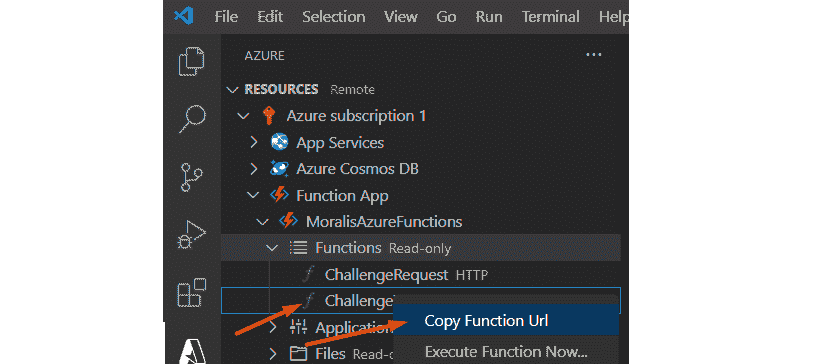

如果你还记得的话，你还有“*getnativebalances*”、“ *GetTokenBalances* ”和“ *GetNfts* 操作。相应地，对这些端点重复“注册功能”过程，并从您的 Moralis 仪表板复制它们的 URL。

## 使用 PlayFab 创建 Dapp–步骤 5:设置 Unity 并将其与 PlayFab 连接

现在你已经成功地部署并注册了你的 Azure 功能，你需要连接 PlayFab 和 Unity。通过使用我们的 Unity 演示项目，您可以轻松实现安全的 Web3 认证。因此，使用上面的“GitHub”链接并下载 ZIP 文件:

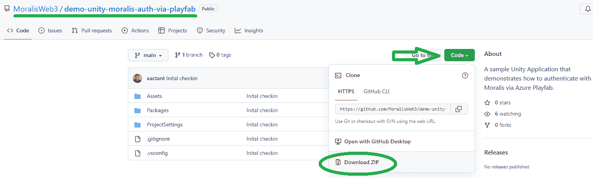

解压缩文件后，您将看到“完整”和“启动”文件夹。如果你想运行应用程序，你应该打开“完成”项目。但是，如果您想通过教程来学习，请使用“Starter”项目。

接下来，点击“PlayFab”>“编辑器扩展”:

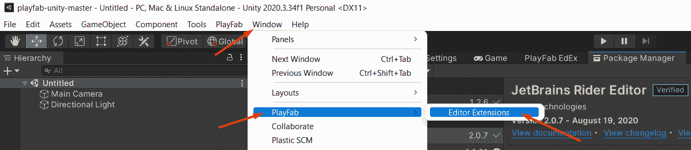

*注意* *:如果 Unity 不显示上述菜单，重新启动。*

然后，点击“登录”并输入您的 PlayFab 凭据:

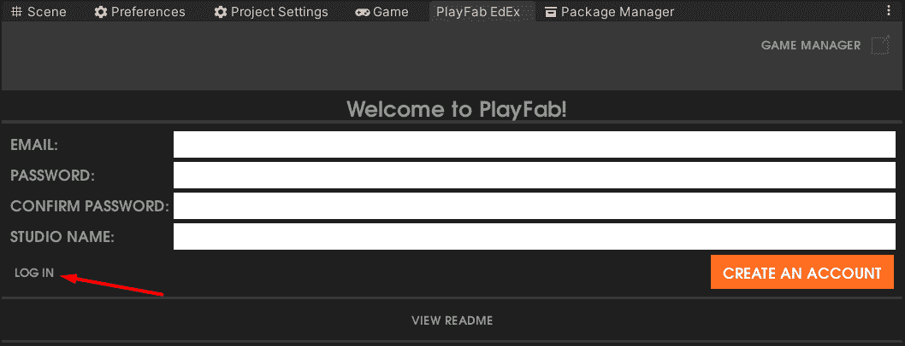

登录后，进入“设置”>“项目”，在这里您需要选择您的工作室和标题 ID:

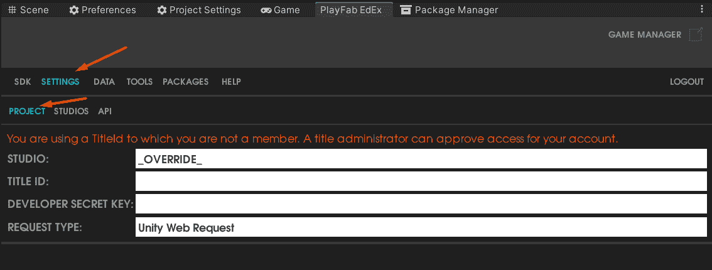

最后，转到“场景”文件夹，打开“样本场景”:

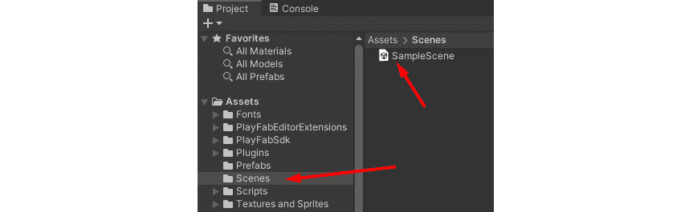

### 探索我们的演示版 Unity Web3 游戏

将 PlayFab 连接到 Unity 后，您已经成功完成了“使用 PlayFab 创建 dapp”之旅的所有五个步骤。但是，我们鼓励您也来探索我们的 Unity 演示游戏。就此而言，您的下一步取决于您在上面选择的项目类型。如果您使用“完整”项目，您可以直接运行“样本场景”并选择“作为客人播放”选项:

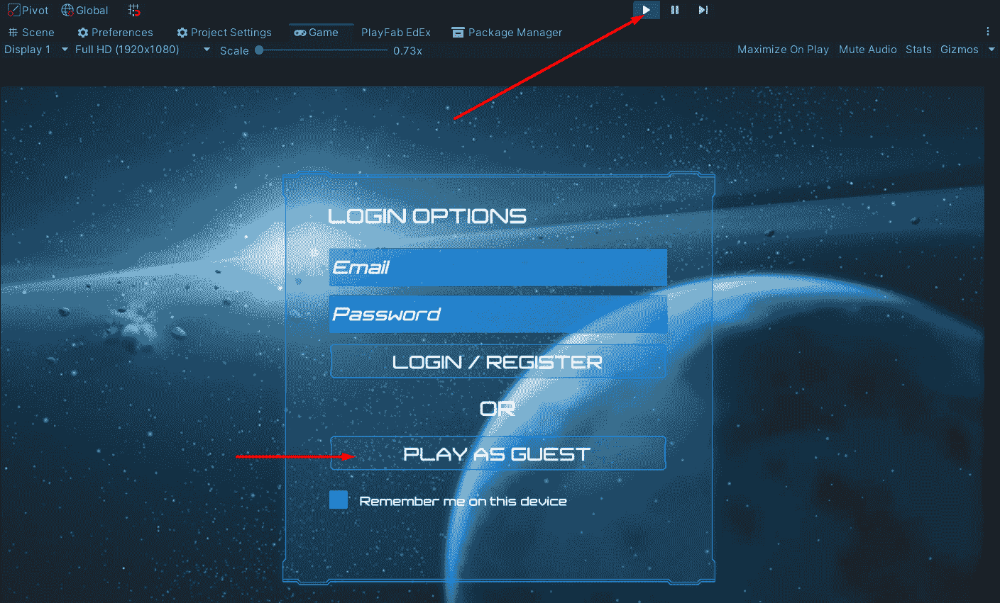

另一方面，如果您选择“Starter”项目，您必须完成特定的操作步骤来实现必要的功能。在这种情况下，我们鼓励您使用之前链接的 Moralis 文档页面的“通过 PlayFab 以编程方式与 Moralis 交互”部分。该部分将带您浏览核心脚本。此外，通过完成 24 个简单的步骤，您将学习如何通过 PlayFab 将 Unity dapp 的实例与 Moralis 集成。

您还将遵循一些简单的步骤来连接 Moralis Web3 认证服务。有了这些，你就可以像选择了“完整的”项目一样玩这个示例游戏了。

## 如何通过 5 个步骤使用 PlayFab 和 Unity 创建 Dapp–总结

在本文中，您学习了如何使用 PlayFab 和 Unity 创建 dapp。此外，您可以看到，由于最终的 Web3 API 提供者 Moralis，您可以非常容易地添加 Web3 功能。此外，通过使用 Visual Studio 代码，您发现了如何创建和部署 Azure 函数。然后，使用 PlayFab 仪表板中的“自动化”选项，我们向您展示了如何注册这些功能。最终，通过利用 Moralis 的力量，您能够使用遗留开发工具创建一个演示 dapp。最后但同样重要的是，您也有机会探索了我们的示例 Web3 游戏，甚至尝试了一下。Moralis 提供了令人惊叹的认证功能——例如使用 Django 的[元掩码认证以及如何使用魔法](https://moralis.io/how-to-add-metamask-authentication-with-django-in-5-steps/)[添加登录。链接](https://moralis.io/add-sign-in-with-magic-link-to-your-nextjs-project-in-5-steps/)。

此外，现在你知道如何用 PlayFab 和 Unity 创建 dapp，你可以更深入地研究 [Web3 游戏设计](https://moralis.io/web3-game-design-explaining-the-web3-game-design-process/)。然而，如果你首先需要一些额外的练习，一定要去探索一下[Moralis 的 YouTube 频道](https://www.youtube.com/c/MoralisWeb3)和[Moralis 的博客](https://moralis.io/blog/)。这两个网站都有大量优秀的教程，可以帮助你免费成为一名 dapp 开发者。

另一方面，你可能渴望尽快成为全职加密员。在这种情况下，成为区块链认证通常会有所不同。如果你对此感兴趣，你应该考虑报名参加[Moralis 学院](https://academy.moralis.io/)！**