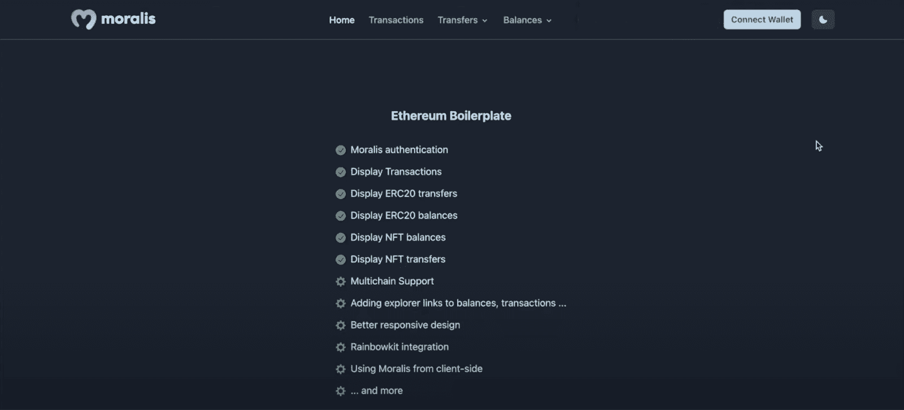
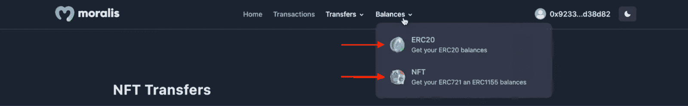
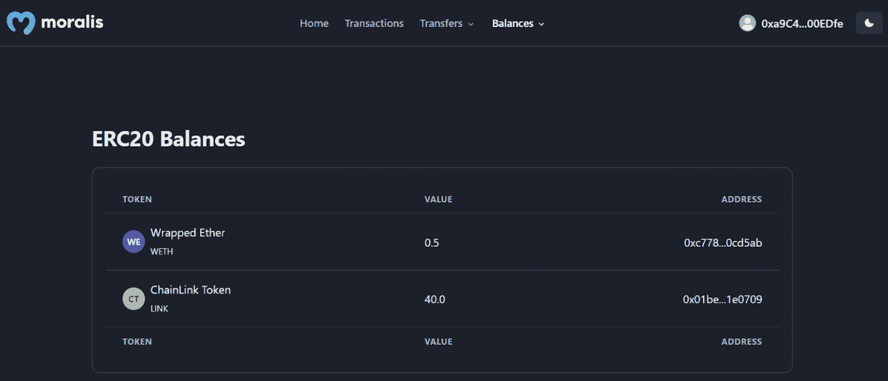
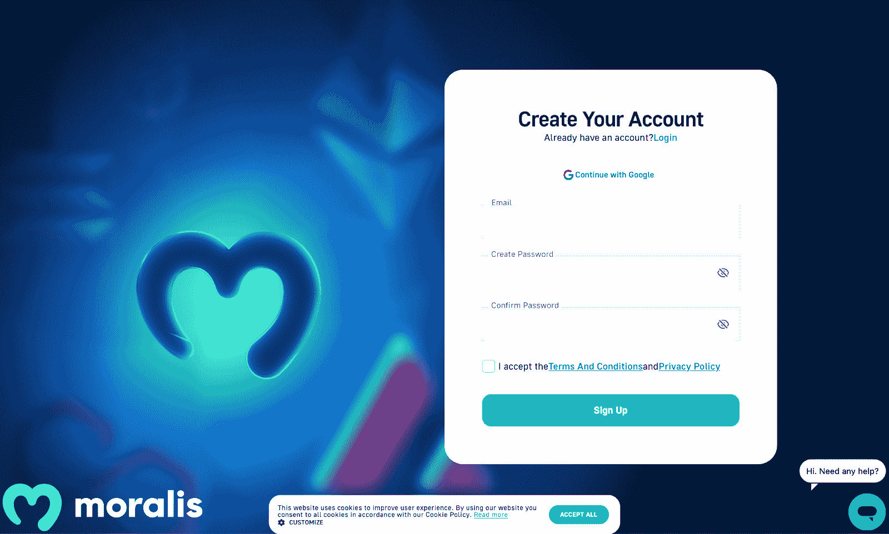
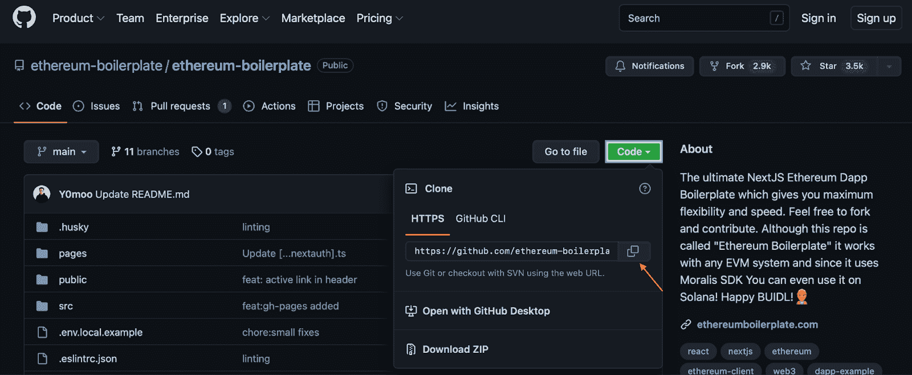

# 如何在 3 个步骤中创建一个分散的应用程序

> 原文：<https://moralis.io/how-to-create-a-decentralized-app-in-just-3-steps/>

你想学习如何快速有效地创建一个去中心化的 app 吗？如果你的答案是“是”，那你就来对地方了。本教程将展示如何使用 [Moralis](https://moralis.io/) 通过三个简单的步骤创建一个去中心化的应用程序。如果这听起来很有趣，请继续阅读并探索构建 dapps 的最快方法之一！此外，如果您愿意，可以跳过本教程的步骤，使用下面的链接立即检查项目代码:

**Moralis 以太坊样板文档—**[**https://github . com/以太坊-样板/以太坊-样板**](https://github.com/ethereum-boilerplate/ethereum-boilerplate)

上面的链接把你带到了 Moralis 的以太坊样板 GitHub 库，这就是你如何能够只用三个步骤创建一个去中心化的应用程序。这与 Moralis 的企业级 Web3 APIs 等令人惊叹的开发工具相结合，使 dapp 开发变得更加容易，从而使您能够更快地创建复杂的 Web3 项目！

例如，Moralis [认证 API](https://docs.moralis.io/reference/auth-api-overview) 使得 [Web3 认证](https://moralis.io/authentication/)相对容易访问。此外，例如，使用 API，您可以使用单个代码片段向您的项目添加几种身份验证机制。以太坊样板最初的特点是元掩码认证；然而，举例来说，你可以用 RainbowKit 轻松地[添加一个标志。](https://moralis.io/how-to-add-a-sign-in-with-rainbowkit-to-your-project-in-5-steps/)

那么，你是否在寻找一个去中心化的应用？如果是这种情况，请确保现在就注册 Moralis 来提高你的效率和效力！

## 什么是去中心化 App？

分散式应用——通常缩写为“dapps”——是基于区块链的，这就是为什么它们被认为是与传统的 Web2 应用不同的。此外，Web2 和 Web3 应用通常实现相同的功能，但后者配备了区块链功能，使它们更加强大。


开发者在 P2P 网络上构建 dapps，它们通过使用智能合约来发挥作用。此外，智能合约是 Web3 开发空间的基本特性，为更高程度的创新提供了机会。现在，如果你对 [Web3 契约](https://moralis.io/what-are-web3-contracts-exploring-smart-contracts/)还不太熟悉，你可能会觉得进一步探究这些契约很有趣。

然而，由于分散式应用在区块链网络上运行，它们有几个好处使它们比 Web2 应用更有吸引力。下面，我们将举几个例子:

*   分散的应用程序是抗审查的。
    *   去中心化是去中心化应用的一个重要特征，它消除了 Web2 开发空间中普遍存在的单点故障。因此，单一当局审查或封锁网络变得更加困难。
*   Dapps 一般都是**开源**。
    *   这推动了空间内的创新并鼓励了发展。
*   分散的应用程序是基于区块链的。
    *   由于 dapps 通过智能合约发挥作用，并在区块链网络上运行，因此将加密货币集成到项目功能中变得很容易。

然而，上面的好处/优势只是几个例子，还有更多值得你自己去发现。尽管如此，现在您已经对分散式应用程序有了一个大致的了解，是时候进入主要部分了，在这里我们将展示如何使用 Moralis 通过三个步骤创建一个分散式应用程序！

## 如何用 3 个步骤创建一个去中心化的应用

从这一点开始，我们将向您展示如何使用 Moralis 创建一个分散的应用程序。多亏了 Moralis 的工具和以太坊样板，这个过程变得相对简单。此外，你需要做的就是遵循这三个步骤:

1.  进入我们的 GitHub 库，克隆以太坊样板代码。
2.  一旦克隆了代码，就必须定制特定的环境变量。
3.  最后，开始去中心化应用！

由于 Moralis 的可访问性，您将能够在创纪录的时间内创建一个分散的应用程序。然而，在我们深入了解过程本身的本质之前，我们将通过下面的部分更深入地研究 Moralis 的以太坊样板代码。这将清楚地说明你的工作目标，并展示模板的功能。

然而，如果你想看 YouTube 上解释这一过程的视频，你有机会这样做。在下面来自 [Moralis 的 YouTube](https://www.youtube.com/c/MoralisWeb3) 频道的视频中，Moralis 团队成员进一步详细解释了以太坊样板文件，并向您展示了如何轻松创建去中心化应用程序:

https://www.youtube.com/watch?v=Bb5Pc–kyAY

### 来自 Moralis 的以太坊样板代码

为了向您展示我们的目标，我们将利用这一部分来探索 Moralis 的以太坊样板。然而，这只是一个模板，帮助你创建一个分散式应用的基础。因此，您可能希望使用此样板文件作为基础，添加/删除不属于您的目标细分市场需求的功能。然而，这是以太坊样板文件的登录页面:



让我们从检查 dapp 顶部的导航栏开始。如你所见，最右边有一个“连接钱包”按钮:


如果您点击此按钮，它将打开您的 MetaMask 钱包，并允许您验证您的 Web3 身份。一旦您签署了邮件，它将自动填充您可以在顶部看到的关于您的钱包信息的附加选项卡。例如，如果您点击“Transactions”选项卡，您将看到一个如下所示的页面:


上表显示了您钱包的交易历史。此外，你可以查看散列，地址，天然气价格，日期等。，关于特定的交易。此外，“转账”和“余额”选项卡都有下拉菜单，允许您在“NFTs”和“ERC-20”令牌之间切换:



如果我们以“余额”选项卡为例，您可以在您的钱包资产之间进行筛选。如果你按下“ERC-20”选项，看起来可能是这样的:



最后，样板文件包含了黑暗和光明两种模式。要在这两个选项之间切换，您可以使用顶部的按钮:


这基本上涵盖了以太坊样板代码的基本部分。现在你知道了它是如何工作的，你的目标是什么，我们可以开始分解教程，并向你展示如何创建一个分散的应用程序！

## 用 3 个步骤创建一个去中心化的应用程序——完全分解

为了让这个“创建一个去中心化的应用”教程更容易理解，我们将把这个部分分成三个小节——每个步骤一个小节。因此，我们将通过向您展示如何克隆 Moralis 以太坊样板文件来开始本教程。接下来，您需要配置一些环境变量。最后，剩下的就是启动应用程序，您自己可以确保一切都按预期运行。

然而，在我们继续向您展示如何克隆模板之前，您必须拥有一个 Moralis 帐户。此外，这是定制环境变量时的一个要求。因此，如果您还没有注册，您可以通过点击 Moralis 网站右上角的“免费开始”来注册。


在那里，你需要做的就是按照指示输入一个电子邮件，创建一个密码，选中“我接受”框，然后点击“注册”:



### 步骤 1:克隆 Moralis 以太坊样板代码

为了创建一个去中心化的应用，你需要做的第一件事就是克隆 Moralis 的以太坊样板代码。为此，请导航到 Ethereum 样板 GitHub 存储库，我们在本文开始时链接了这个存储库。点击此链接后，您可以点击绿色的“代码”按钮并复制 URL:



从那里，您可以打开您选择的 IDE(集成开发环境)。我们用的是 VSC (Visual Studio 代码)；但是，请随意选择您最熟悉的环境。请注意，如果您不使用 VSC，该过程可能会有所不同。

然而，一旦打开 IDE，就可以继续创建新文件夹。您可以随意命名该文件夹，但我们将把我们的文件夹命名为“样板”。有了这个文件夹，接下来您必须做的就是打开一个新的终端。对于 VSC 用户，您可以点击顶部的“终端”选项卡，然后点击“新建终端”:


打开新的终端，确保您位于刚刚创建的文件的正确位置，并使用 GitHub 存储库 URL 运行以下命令:

```js
git clone “BOILERPLATE_URL”
```

这将把以太坊样板文件克隆到您的本地目录中，从那里，您可以通过在终端中输入以下内容来导航到正确的文件夹:

```js
cd ethereum-boilerplate
```

如果一切正常，您的本地目录应该具有以下结构:


现在，有了以太坊样板文件，创建一个去中心化的应用程序必须处理的下一部分就是定制一堆环境变量！

### 步骤 2:自定义环境变量

既然您的本地目录中已经有了以太坊样板文件，那么是时候定制环境变量了。为此，您可以导航到“. env.local.example”文件:


您可以做的第一件事是通过删除“.”将该文件重命名为“. env.local”。例”放在最后。接下来，如上图所示，有五个环境变量；然而，你现在只需要考虑其中的三个。因此，我们将从仔细查看“ *APP_CHAIN_ID* ”开始。

“ *APP_CHAIN_ID* ”变量等于“ *0x1* ”，这是以太坊的链 ID。相应地，如果你想为以太坊网络创建一个去中心化的 app，你不需要配置这个变量。然而，例如，如果你想[构建一个多边形 dapp](https://moralis.io/how-to-build-a-polygon-dapp-in-3-steps/) ，你需要将变量改为“ *0x89* ”。您可以在此找到有关支持链[的更多信息。](https://docs.moralis.io/reference/supported-chains-evm)

接下来，您需要向“ *MORALIS_API_KEY* ”添加一个 API 密钥，这就是为什么您需要一个 MORALIS 帐户。要获取您的密钥，您需要登录您的帐户，点击“帐户”，导航到“密钥”选项卡，然后复制密钥:


从那以后，您只需要将这个值添加到代码中。接下来，您有了" *NEXTAUTH_SECRET* "变量。您可以使用下面的链接来生成一个值，并将其实现到代码中:【https://generate-secret.now.sh/32】。

其他两个变量暂时可以保持不变。例如，“ *NEXTAUTH_URL* ”当前等于“ [http://localhost:3000](http://localhost:3000/) ”。这在你开发 dapp 的时候就起作用了，允许你很容易的测试你的项目。但是，一旦您完成项目并计划在网络上启动应用程序，该值必须等于 dapp 的 URL。

#### 最终" . env.local "代码:

```js
APP_CHAIN_ID=0x1
APP_DOMAIN=ethereum.boilerplate 
MORALIS_API_KEY= "YOUR_API_KEY"
NEXTAUTH_SECRET= b8e786967d7bcbc0f920d35bcc3f891c
NEXTAUTH_URL=http://localhost:3000
```

### 第三步:启动应用程序

在“创建去中心化应用”指南的最后一部分，我们将快速向您展示如何启动 d app。首先，您需要安装适当的依赖项。为此，您只需打开一个新的终端并输入以下命令之一:

```js
npm i
yarn
```

从这里开始，最后一步是在本地主机上运行 dapp，这可以通过以下命令之一来完成:

```js
npm run dev
yarn run dev
```

在本地主机上运行 dapp 允许您通过之前指定的链接轻松访问应用程序:" [http://localhost:3000](http://localhost:3000/) "。这将使您能够在安全的环境中测试 dapp，并确保一切正常工作。

有了模板，现在就由您来定制 dapp，以满足您的目标细分市场的需求。因此，您可能需要添加或删除缺少的或您认为不必要的功能。

如果你觉得这篇文章很有趣，你可以找到其他特定链的指南。例如，学习如何[建立一个雪崩 dapp](https://moralis.io/complete-guide-how-to-build-an-avalanche-dapp-in-3-steps/) 或[建立一个克罗诺斯 dapp 在五个步骤](https://moralis.io/how-to-build-a-cronos-dapp-in-5-steps/)！

## 创建分散式应用程序–总结

这篇文章展示了创建去中心化应用程序的最快方法之一。此外，通过遵循本教程，您只需三个简单的步骤就能创建一个去中心化的应用程序，这要感谢 Moralis 的以太坊样板:

1.  进入我们的 GitHub 库并**克隆以太坊样板**代码。
2.  一旦你克隆了代码，你必须**定制特定的环境变量**。
3.  最后，**启动去中心化应用**！


遵循这些步骤，任何人都可以在几分钟内创建一个去中心化的应用。然而，以太坊样板文件并不是唯一有助于更易访问的开发体验的 Moralis 工具。例如，您可以额外检查 Moralis 的 [Web3 流](https://moralis.io/streams/)，允许您将[链上数据](https://moralis.io/on-chain-data-the-ultimate-guide-to-understanding-and-accessing-on-chain-data/)直接传输到您的 dapps 中。

此外，如果你对这篇文章感兴趣，可以点击 Moralis 的 [Web3 博客](https://moralis.io/blog/)查看更多与区块链相关的内容。例如，你可以了解你所需要的关于 [EIP-4361](https://moralis.io/exploring-eip-4361-sign-in-with-ethereum/) 标准、不同[类型的 Dao](https://moralis.io/full-2022-guide-to-different-types-of-daos/)等等的一切！

因此，如果你想创建一个分散的应用或任何其他 Web3 项目，[现在就向 Moralis](https://admin.moralis.io/register) 注册吧！创建一个 Moralis 帐户只需几秒钟，您就可以立即获得该平台的好处。