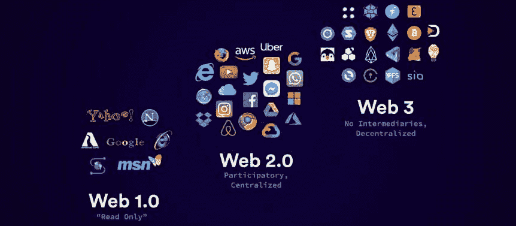
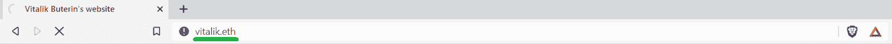
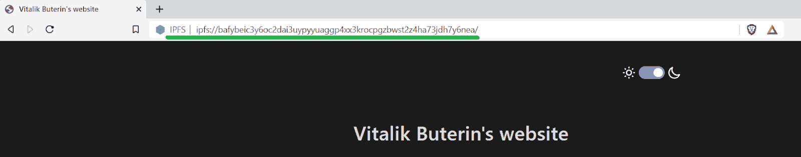
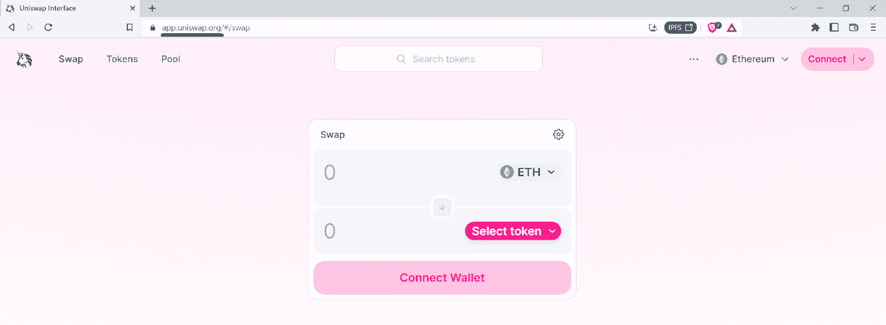
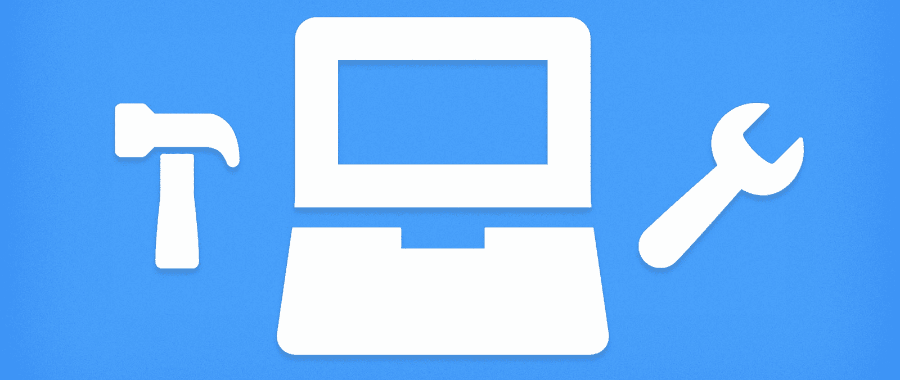
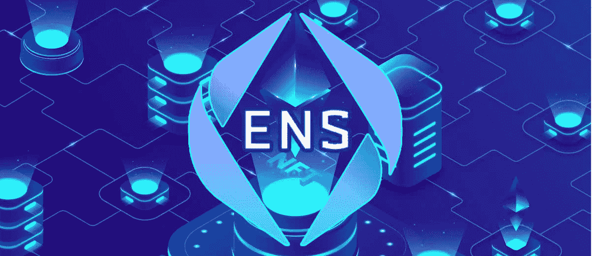
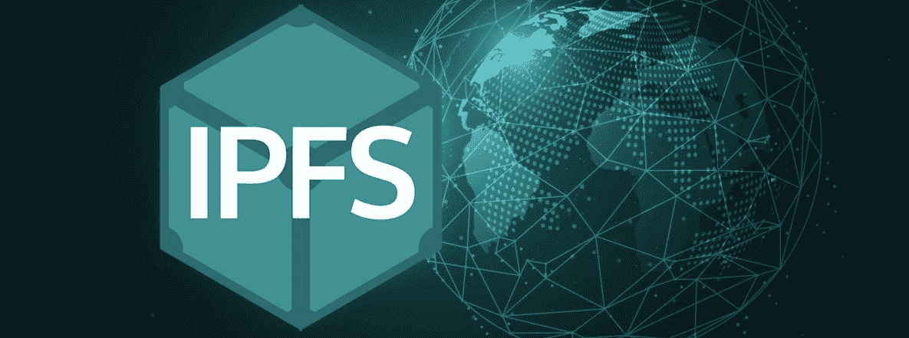
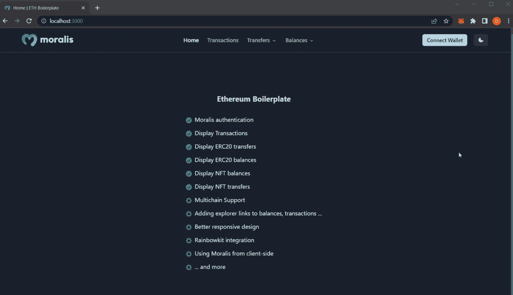
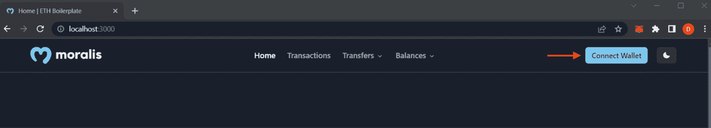
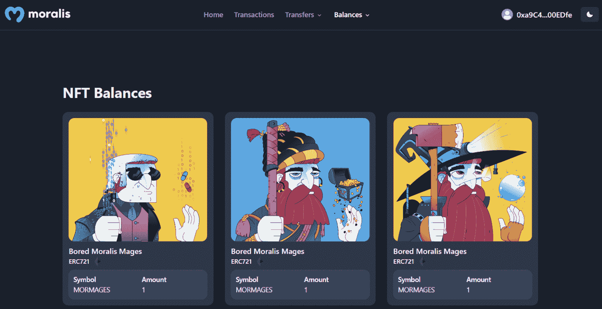

# 如何在以太坊上创建一个分散的网站

> 原文：<https://moralis.io/how-to-create-a-decentralized-website-on-ethereum/>

分散式网站使用户能够与一个或几个区块链网络互动。虽然创建一个 Web2 网站是一项相对简单的任务，但是开发一个分散的 Web3 网站可能会稍微复杂一些。然而，当你选择加入适当的技术堆栈时，你可以通过四个简单的步骤学习如何在以太坊上创建一个分散的网站:

1.  创建一个 Moralis 账户
2.  在 GitHub 上克隆以太坊样板文件
3.  配置环境变量
4.  启动你的分散式网站

我们想指出的是，当我们提到开发一个“去中心化的网站”时，我们实际上指的是 dapps。此外，由于 Moralis——最终的 Web3 API 提供者——你可以用最少的努力创建一个 dapp。事实上，最快的方法是使用 Moralis 的以太坊样板( [Web3 网站模板](https://moralis.io/web3-template-build-a-dapp-using-a-web3-website-template/))。使用该工具，您可以在所有领先的 EVM 兼容连锁店上部署 Web3 网站。

**访问 GitHub 上的终极以太坊样板-**[**https://GitHub . com/以太坊-样板/以太坊-样板**](https://github.com/ethereum-boilerplate/ethereum-boilerplate)

然而，在我们向您展示如何轻松创建一个分散式网站之前，您应该了解一些基本知识。我们将首先确保你知道什么是分散式网站。我们还会看一些 Web3 网站的例子。然后，我们将介绍创建这样一个网站所需的工具，以及其他可以简化这个过程的快捷方式。最后但同样重要的是，我们将带您完成完成今天任务的必要步骤。简而言之，你需要使用我们的以太坊样板并创建你的[免费 Moralis 账户](https://admin.moralis.io/register)。

## 什么是去中心化网站？

正如每一个新兴产业一样，区块链发展的术语还没有完全统一。“去中心化网站”也是如此。然而，在大多数情况下，诸如“分散式网站”或“Web3 网站”等术语是分散式应用程序(dapps)的同义词。Dapps 是包括 Web3 功能的在线应用程序，在某种程度上，用户可以通过连接他们的 Web3 钱包来与区块链互动。这叫做 [Web3 认证](https://moralis.io/authentication/)，是每个 dapp 必不可少的一部分。然而，许多 dapps 远未完全分散。毕竟，应用程序的许多方面可能不需要分散的方法。因此，许多 dapps 实际上是某种 Web2-Web3 的混合体。

另一方面，许多用户更重视去中心化。对他们来说，任何集中化的迹象都意味着一个应用程序或网站不是分散的。对于这些人来说，去中心化的网站只会是那些以去中心化的方式托管其域名和全部内容的网站。此外，重要的是要指出，我们都应该努力实现互联网的真正去中心化。毕竟，任何分散的解决方案都应该包括集体管理和高水平的分配。

此外，在某些情况下，Web3 基础设施和协议也被称为分散式网站。从这个角度来看，dapps 将是一个子类别或特定种类的分散式网站。然而，在本文中，分散式网站代表所有能够让用户连接他们的 Web3 钱包，进而进入加密域的网站。这些网站也被称为基于钱包的网站。因此，在加密空间设法统一所有相关术语之前，创建一个分散式网站的确切方法取决于您更喜欢哪个定义。

### 示例站点

让我们首先指出，最真正去中心化的网站使用加密域和去中心化存储解决方案。这些域以 NFT(不可替换的令牌)的形式出现。此外，由于这些域使用不同的协议，您通常无法用常规浏览器打开它们。但是，您可以使用 IPFS 支持的浏览器，如 Brave:

示例“vitalik.eth”地址重定向到以下 IPFS 地址:

事实上，流行的浏览器不支持加密域只是另一个迹象，表明我们仍然处于 Web3 的早期阶段。所以，如果你想自由访问任何分散的网站，你需要一个 Web3 钱包和一个 IPFS 浏览器。事实上，在创建去中心化网站时，这些工具也会派上用场。

此外，加密域的典型示例以“.”结尾。eth”。至少是由 ENS 协议提供的那些。然而，还有其他流行的协议，与“不可阻挡的域名”领先的包，提供。“NFT，”。加密“，”。token”和许多其他扩展。然而，与 ENS 不同的是，这些协议中的大部分并没有真正去中心化。此外，分散网站的一个众所周知的例子是" *app.uniswap.org"* DEX:

其他类型的分散式网站，也称为基础设施网站，包括 Dao、聚合器和 NFT 交易平台。但是，请记住，分散化的程度因项目而异。以下是一些 Web3 网站的具体例子:

*   **金融服务**:
    *   Aave
    *   Curve.fi
    *   复合的
    *   薄饼交换
    *   1 英寸
    *   Crypto.com
    *   渴望金融
*   **NFT 市场**:
    *   OpenSea
    *   赖布尔
    *   魔幻伊甸园
    *   不可变 X
    *   漂亮的网关
    *   索拉哈特
    *   原子市场
*   **加密游戏平台**:
    *   无限轴
    *   淀积层
    *   沙盒
    *   节日游戏
    *   极端主义者
*   **标记化和细分化**:
    *   Cloudname
    *   共识；一致
    *   隐板岩
    *   比特流
    *   分散土地
*   **互联网服务**:
    *   登特无线
    *   兰花
    *   基本注意力标志

## 创建分散网站的工具

如果在创建 dapps 时，有一个工具你需要关注，那就是 **Moralis** 。有了这个企业级 Web3 API 提供者，您可以使用遗留开发平台和编程语言构建各种 dapps。例如，如果你懂 JavaScript，你可以使用 React 或 NextJS 作为前端，NodeJS 作为后端，然后开始使用 Moralis 的 Web3 API 调用与区块链交互。此外，例如，由于 Moralis 的 Auth API，您可以用 MetaMask 覆盖 Web3 身份验证。此外，Moralis 已经为 Firebase、Supabase、Parse Server、Unity 和 PlayFab 提供了集成。

为了部署和测试你的 dapps，你还需要一个信誉良好的 **Web3 钱包**。说到 Web3 开发，MetaMask 仍然是最受欢迎的选择。此外，为了确保高度的分散化，您应该确保网站上的重要内容使用分散存储解决方案。这就是 T2 IPFS T3 成为首选的地方。尽管如此，我们也鼓励您确保您的域是适当分散的。在这种情况下，你也会想使用 **ENS** 的。

*注* *:如果你不确定 IPFS 和 ENS 是什么，请务必查看下面的“ENS 和 IPFS——为分散目的创建网站”一节。*

随着你 Web3 开发技能的提高，你可能还想在你的分散式网站或 dapps 中加入一些独特的链上特性。在这种情况下，您需要学习如何部署智能合约。如果你专注于以太坊和 EVM 兼容链，你将需要使用**坚固度**、**安全帽**、**混音**。除了所有这些工具，还有几个宝贵的捷径。可以简单复制和粘贴的主题、样板、智能合同模板和代码片段可以节省大量开发时间。

### 主题、样板还是从头开始编码？

从头开始编写 Web3 后端代码通常没有什么意义，尤其是对于像 Moralis 这样的提供商。因此，您可以通过使用高质量的样板和模板来节省大量时间。另外，有了这些快捷方式，你可以更快地准备好你的 MVP(最小可行产品)。事实上，在创建 MVP 时，使用主题来准备一个整洁的前端是有意义的。我们不了解你，但在我们看来，浪费你的时间和资源去重新发明轮子是没有意义的。然而，如果你想让你的分散式应用程序大获成功，我们建议你的前端尽可能的独特。

此外，如果您正在使用高质量的样板、模板和主题，调整代码以满足您独特的需求几乎总是比从头开始编码更快更简单。考虑到这一点，我们创建了几个非常有用的代码库。当谈到创建一个去中心化的网站时，我们的**以太坊样板**是最终的捷径。*你可以在本文开头找到这个 GitHub 回购的链接。*

此外，一旦您开始使用智能合同，您肯定会希望使用由 **OpenZeppelin** 提供的经过验证的智能合同模板。

### ENS 和 IPFS——为分散的目的创建网站

如前所述，要将你的 Web3 网站作为一个完全分散的网站来运行，你需要将你的网站部署到 IPFS。您还应该使用 ENS 域。因此，知道这两个工具是什么很重要。

ENS 是基于以太链的分布式、可扩展、开放命名服务。ENS 的核心目的是将人类可读的名称(如“john.eth ”)映射到机器可读的标识符(如 MetaMask wallet)。因此，ENS 采用长标识符(字母和数字的组合)并将它们连接到更容易理解的名称或域。此外，ENS 支持“反向解析”，这使我们能够将元数据与以太坊地址相关联。

本质上，ENS 的主要目的与“域名系统”(DNS)非常相似。这两个协议都旨在提供更无缝的用户体验。从这个意义上说，ENS 为 Web3 提供了与 Web2 的 DNS 相同的服务。相应的，我们可以说 ENS 简化了 Web3。*查看我们的* [*完整 ENS 指南*](https://moralis.io/what-is-ethereum-name-service-full-ens-guide/) *，深入了解这种分散式域协议。*

当谈到星际文件系统(IPFS)时，它是一种存储内容的分散协议，包括数据、网站、文件和应用程序。此外，IPFS 系统以分散的方式访问这些数据。因此，我们可以用许多不同的方式使用 IPFS 来消除审查问题和单点故障。

此外，值得指出的是，IPFS 利用“基于内容的寻址”。简而言之，这意味着数据或内容是基于内容本身而不是内容的位置来定位的。因此，IPFS 让我们根据实际内容请求信息，而不是告诉计算机信息在哪里。*要进一步探索 IPFS，跟随* [*什么是 IPFS？*](http://v) *链接。*

## 用 Moralis 在以太坊上创建一个分散的网站

至此，您已经掌握了基础知识，这意味着您已经准备好以简单的方式在以太坊上创建一个分散式网站。因此，我们将把您交给我们内部一位非常能干的专家。在下面的视频中，他将向你展示如何通过以下四个步骤创建一个去中心化的网站:

1.  创建一个 Moralis 账户
2.  在 GitHub 上克隆以太坊样板文件
3.  配置环境变量
4.  启动你的分散式网站

然而，我们想向你展示你将朝着什么方向努力。因此，让我们做一个样板 Web3 网站的快速演示。下面的屏幕截图显示了我们示例站点的主页:

要查看 dapp 的功能，您需要点击“连接钱包”按钮，使用您的钱包验证您的身份:

通过点击上面的按钮，您的元掩码扩展将提示您一个签名请求通知。将你的钱包与这个分散的网站成功连接后，你将能够浏览它的所有页面。“Home”旁边的第一个选项是“Transactions”，显示你所有的交易。它通过呈现链上数据来做到这一点，包括散列、地址、天然气成本等。，使用表格:

此外，您还可以探索您的转移，您可以在 ERC-20 代币和 NFT 之间进行选择。当谈到“平衡”时，您也可以在这两个选项之间切换。例如，下面是检查 NFTs 的方法:

点击上面的“NFT”选项，您可以查看您连接的钱包中的非功能性钱包:

看到上面的演示后，你一定渴望开始创建一个去中心化的网站。因此，下面的视频教程将告诉你如何在不到 7 分钟的时间内完成:

[https://www.youtube.com/embed/Bb5Pc--kyAY?feature=oembed](https://www.youtube.com/embed/Bb5Pc--kyAY?feature=oembed)

## 如何在以太坊上创建一个分散的网站——总结

在今天的文章中，你了解到创建一个去中心化的网站并不困难。毕竟可以使用一些优秀的快捷方式。然而，在我们演示如何用终极以太坊样板创建一个去中心化的网站之前，我们已经为您提供了一个坚实的基础。我们解释了什么是去中心化网站，以及是什么让它们真正去中心化。为了更加清晰，我们甚至看了一些示例 Web3 站点。接下来，我们告诉你你需要什么工具来成为一个去中心化网站或者 dapps 的开发者。最后，您有机会使用样板文件并创建自己的分散式网站。

展望未来，我们鼓励你尝试让你的网站更加独特。因此，调整它的主页，改变标识，并添加其他 Web3 功能。此外，你可以去生活与你的分散网站。在这种情况下，确保使用 ENS 和 IPFS 以一种真正分散的方式来做这件事。如果你需要额外的指导，请务必查看[Moralis 文件](https://docs.moralis.io/)、[Moralis YouTube 频道](https://www.youtube.com/c/MoralisWeb3)和[Moralis 博客](https://moralis.io/blog/)。这些也是探索其他开发教程的途径。例如，一些最新的主题涵盖了构建雪崩 dapp 的最快方法、如何创建 Cronos dapps、如何构建多边形 dapp、如何使用多链 NFT API 等等。

最后，我们必须指出，区块链工业提供了很多就业机会。但是，要成为全职加密员，你需要有正确的知识。这就是 Moralis 学院进入画面的地方。例如，你可以[在 2022 年](https://academy.moralis.io/courses/master-defi)获得 DeFi 硕士学位，或者通过注册 Moralis 学院的任何其他课程获得区块链认证。