# 如何通过 5 个步骤创建 DeFi 仪表板

> 原文：<https://moralis.io/how-to-create-a-defi-dashboard-in-5-steps/>

去中心化是区块链技术和整个加密领域的一个重要方面。因此，分散金融(DeFi)是这种颠覆性技术最受欢迎的用例之一。能够在不依赖经纪公司、交易所或银行等中央金融中介的情况下持有、转移、交易、借贷和持有资产是不可思议的。然而，重要的是创建具有用户友好的仪表板的平台，将大众吸引到这种点对点的融资方式。因此，作为一名开发人员，您应该学习如何创建一个 DeFi 仪表板。

如果你刚刚开始做一名[区块链开发者](https://moralis.io/how-to-become-a-blockchain-developer/)，创建一个 DeFi 仪表板的任务可能听起来极其复杂和具有挑战性。然而，有了合适的工具和专业知识，您可以通过五个简单的步骤轻松创建 DeFi 仪表板。通过使用[Moralis](https://moralis.io/)ultimate[web 3](https://moralis.io/the-ultimate-guide-to-web3-what-is-web3/)开发平台，您可以轻松构建一个跨链 DeFi 仪表板。此外，Moralis 使您能够将注意力和资源集中在前端，因此您可以创建最佳的用户体验，同时 Moralis 会满足您所有的后端需求。

在本文中，我们将涵盖所有必要的信息，这样您就可以毫不费力地构建一个跨链 DeFi 仪表板。此外，我们将进行一个示例项目，您可以遵循我们的步骤，这简化了过程。因此，请确保现在创建您的免费 Moralis 帐户，因为我们将使用 Moralis 的优秀平台向您展示如何毫不费力地创建 DeFi 仪表板。

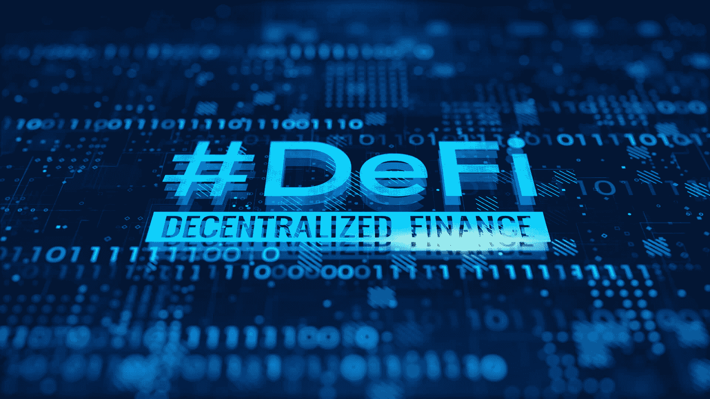

## 如何使用 Moralis 通过 5 个步骤创建 DeFi 仪表板

那些已经在密码行业工作了一段时间的人可能会认出甚至使用过像 Zerion 和 Zapper 这样的网站(见下图)。这些是 DeFi 仪表板的优秀示例，因为它们使您能够查看不同区块链上的各种资产余额。此外，它们使您能够发送您的资产。此外，它们还提供了许多其他 UI(用户界面)选项。所以，如果你想知道如何建立类似的东西，你来对地方了。

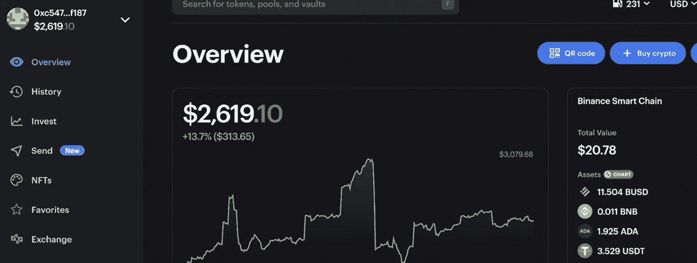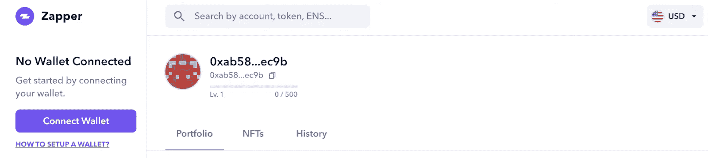

随着我们的继续，我们将构建一个简单的 DeFi 仪表板，它将包括跨链功能，并可以作为您提高前端技能以扩展 UI 的一个很好的起点。然而，在我们深入研究我们的示例项目之前，让我们先概述一下使用 Moralis 构建跨链 DeFi 仪表板所需的步骤。我们可以将事情分成以下五个主要步骤:

1.  创建一个 Moralis 服务器。
2.  构建一个 dApp 并将其连接到您的 Moralis 服务器。
    1.  使用 HTML 文件为你的 [dApp](https://moralis.io/decentralized-applications-explained-what-are-dapps/) 提供结构(使用模板加快进程)。
    2.  创建一个 [JavaScript](https://moralis.io/javascript-explained-what-is-javascript/) 文件来为您的 dApp 提供逻辑(使用模板来加速这个过程)。
3.  向 Web3 的机载用户添加 Moralis 身份验证，并将链上数据无缝“导入”到 Moralis 仪表板。
4.  查询 Moralis dashboard 以访问所有链上数据。
5.  发挥您的 JavaScript 技能，使用手头的链上数据创建最好的 UI。

*注意:从技术上讲，步骤 3-5 都是步骤 2 的延续。但是，由于它们非常重要，并且包含区块链功能，因此应该分别对待。此外，如果我们把它分解成更容易管理的任务，我们将大大简化这个过程。*

## 构建跨链 DeFi 仪表板–示例项目

学习的最好方法之一是采取行动。因此，我们邀请您按照上述五个步骤与我们一起创建一个简单的 DeFi 仪表板。但是，在我们开始每一步之前，让我们先来看看我们将创建的控制面板。

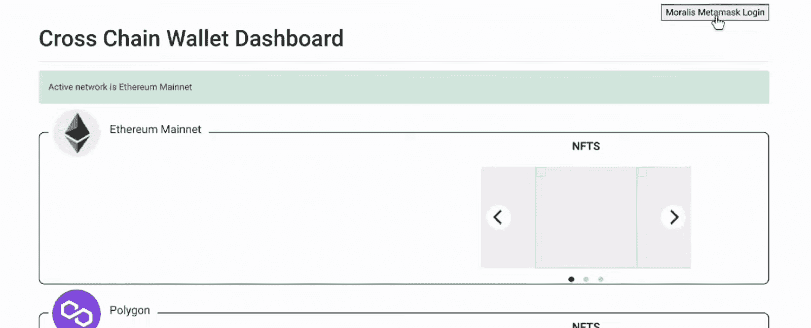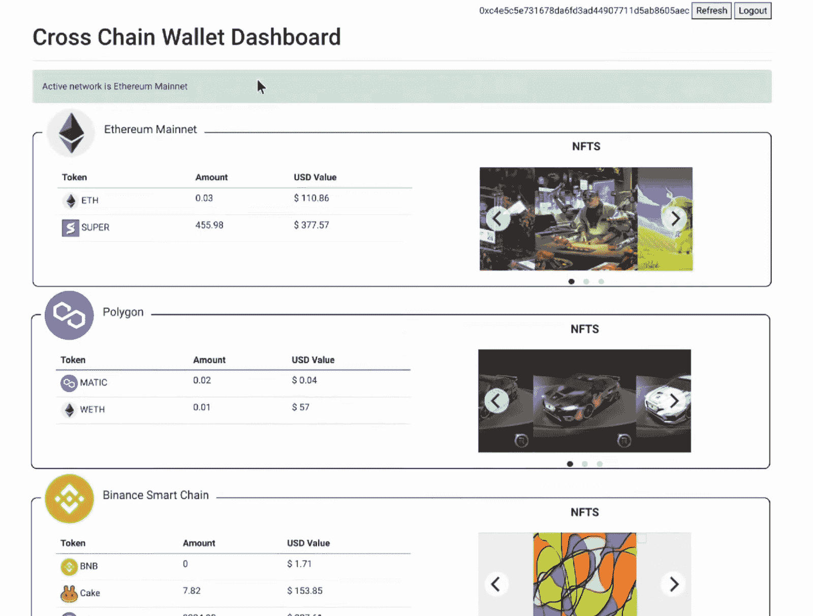

查看上面的第一幅图像，您可以看到我们的示例 Web3 应用程序只显示了框架，因为我们(以用户的角色)没有登录(经过身份验证)。然而，右上角的“Moralis MetaMask 登录”按钮允许用户使用他们的 [MetaMask](https://moralis.io/metamask-explained-what-is-metamask/) 钱包登录。这也是一个伟大的[以太坊认证](https://moralis.io/ethereum-authentication-full-tutorial-to-ethereum-login-programming/)选项。此外，一旦用户登录，我们的示例仪表板将以整洁的方式显示跨多个链的所有资产。第二个图像显示了硬币和代币的余额，显示在左侧，显示在右侧。

此外，虽然上面的图像只显示了三个区块链([以太坊](https://moralis.io/full-guide-what-is-ethereum/)、[多边形](https://moralis.io/how-to-build-polygon-dapps-easily/)和[币安智能链](https://moralis.io/bsc-programming-guide-intro-to-binance-smart-chain-development-in-10-minutes/)【BSC】)，但是我们的示例 DeFi 仪表板还显示了[雪崩](https://moralis.io/how-to-build-avalanche-dapps-in-minutes/)链上持有的资产。所述的链是 Moralis 目前支持的区块链。然而，对其他知名连锁店的全面支持，如 Solana、Fantom 和埃尔隆德，已经在进行中。

现在您已经知道我们将构建什么，让我们更仔细地看看这五个步骤的细节，这五个步骤将向您展示如何创建 DeFi 仪表板。

### 步骤 1:如何创建 DeFi 仪表板–Moralis 设置

如果您记得我们必须完成的五个步骤，您就会知道我们必须首先创建一个 Moralis 服务器。要完成此任务，请按照下列步骤操作:

1.  [**创建您的 Moralis 家账户**](https://admin.moralis.io/register)–如果您还没有 Moralis 家账户，请确保现在就创建一个。为此，请单击上面的链接，输入您的电子邮件地址，并创建您的密码。最后，您需要确认您的电子邮件地址(您将收到一封带有确认链接的电子邮件)。如果你已经有了一个有效的 Moralis 账户，只需[登录](https://admin.moralis.io/login)。
2.  **创建新服务器**–进入您的 Moralis 管理区域后，点击右上角的“+创建新服务器”按钮(如下所示)。从出现的下拉菜单中，选择最适合您需求的网络类型(见下图)。*当示例项目有问题时，我们建议从“Testnet 服务器”选项开始。*


要完成此步骤，请输入所需的服务器详细信息。这些选项包括服务器名称(可以是您想要的任何名称)、选择区域、网络、链(对于多链，请单击“选择所有链”选项)，然后单击“添加实例”。


3.  **访问服务器详细信息**–一旦您的服务器准备就绪，您最终可以通过单击服务器名称旁边的“查看详细信息”按钮来获取服务器详细信息。接下来，将出现一个弹出窗口，包含您需要复制的所有信息(见下图)。*如果你以前用过 Moralis，你可以使用你现有的服务器。*

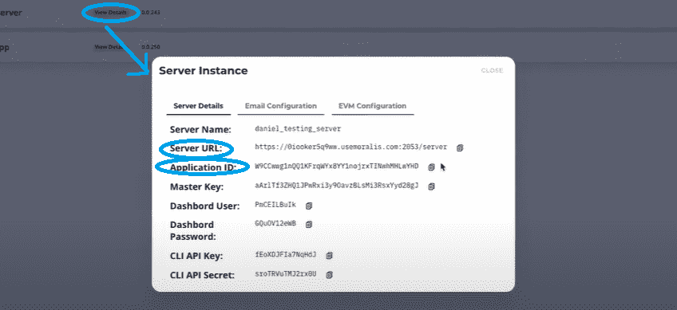

4.  **初始化 Moralis 规范**–现在填充您的”。js“或者”。html”文件，其中包含 Moralis 服务器的详细信息(应用程序 ID 和服务器 URL ),以获得所需的后端功能:


*注意* *:确保使用您特定服务器的详细信息，而不是上图中的信息。*

### 步骤 2:如何创建 DeFi 仪表板–创建 dApp

现在您已经准备好了 Moralis 服务器，是时候创建一个 dApp(分散式应用程序)了。为此，我们将创建两个文件:一个 HTML 文件和一个 JavaScript 文件。“[index.html](https://github.com/IAmJaysWay/Moralis-Cross-Chain/blob/main/index.html)”文件包含的代码将负责我们的示例 DeFi 仪表板的结构。另一方面，“ [logic.js](https://github.com/IAmJaysWay/Moralis-Cross-Chain/blob/main/logic.js) ”文件包含了确保 DeFi 仪表板正常工作所需的所有逻辑代码。

每个文件的大部分代码都与前端相关；因此，你不应该有任何问题。因此，我们将关注负责覆盖区块链相关功能的代码部分。此外，我们在 [GitHub](https://github.com/IAmJaysWay/Moralis-Cross-Chain) 提供了完整的代码。这样，您可以简单地将其用作模板。

*注意* *:虽然我们使用 Visual Studio Code (VSC)来编辑我们的代码，但是您可以随意使用您选择的任何其他代码编辑器。*

查看“index.html”文件，我们首先需要包含“ ”元素内的所有包。这是添加 Moralis 包的代码行:

```js
<script src="https://unpkg.com/moralis/dist/moralis.js"></script>
```

另外两行代码起着重要作用，您可以在其中添加上一节中获得的服务器详细信息:

```js
Moralis.initialize("YOUR APP ID HERE");
Moralis.serverURL = "YOUR SERVER URL HERE";
```

“logic.js”文件的前两行也是如此:

```js
const serverUrl = "YOUR SERVER URL HERE";
const appId = "YOUR APP ID HERE";
```

虽然大部分 HTML 和 JavaScript 代码是为了确保我们的示例 DeFi dashboard 的结构看起来很好，但有些部分在我们的 dApp 的后端功能中起着重要作用。其中一个重要的方面是认证。因此，我们将在下面的步骤中介绍它。

### 步骤 3:构建一个跨链 DeFi 仪表板—验证用户

通过内置的[元掩码认证](https://moralis.io/how-to-authenticate-with-metamask/)，Moralis 使登录功能变得极其简单。只需点击一个按钮，然后进行元掩码确认，用户就可以通过身份验证。此外，我们可以编写代码，在用户登录后自动显示他们的余额。这正是我们将为示例 DeFi 仪表板所做的。下面是“index.html”文件中包含身份验证的几行代码:

```js
    async function login() {
          let user = Moralis.User.current();
          if (!user) {
            user = await Moralis.Web3.authenticate()
            .then(function (user) {
                console.log("logged in user:", user.get("ethAddress"));
                document.getElementById("num").innerHTML = user.get("ethAddress")
            })
          }
          document.getElementById("btn-logout").style = "display:inline";
          document.getElementById("btn-refresh").style = "display:inline";
          document.getElementById("btn-login").style = "display:none";

          await displayTokens("eth", "ETH", "0xc02aaa39b223fe8d0a0e5c4f27ead9083c756cc2", 18,"EthTokenBalance", "EthBalance", "ethTab");
          await displayNFTS("eth", "EthNFTOwners");

          await displayTokens("polygon", "MATIC", "0x0d500b1d8e8ef31e21c99d1db9a6444d3adf1270", 18,"PolygonTokenBalance", "PolygonBalance", "polygonTab");
          await displayNFTS("polygon", "PolygonNFTOwners");

          await displayTokens("bsc", "BNB", "0xbb4CdB9CBd36B01bD1cBaEBF2De08d9173bc095c", 18,"BscTokenBalance", "BscBalance", "bscTab");
          await displayNFTS("bsc", "BscNFTOwners");

          await displayTokens("avalanche", "AVAX", "0xB31f66AA3C1e785363F0875A1B74E27b85FD66c7", 18,"AvaxTokenBalance", "AvaxBalance", "avaxTab");

        }

        async function logOut() {
            await Moralis.User.logOut();
            location.reload();
        }

        document.getElementById("btn-login").onclick = login;
        document.getElementById("btn-refresh").onclick = login;
        document.getElementById("btn-logout").onclick = logOut;
```

当然，我们也想给用户一个退出的选项。这就是上面的“注销”功能。

### 第 4 步:构建一个跨链 DeFi 仪表板-查询 Moralis 仪表板

要访问 Moralis 服务器的仪表板，请单击三个点，然后单击服务器上的“仪表板”:

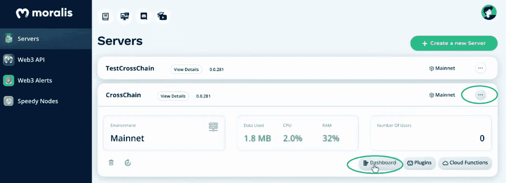

如果没有用户登录您的 dApp，您的控制面板将不会包含很多详细信息:

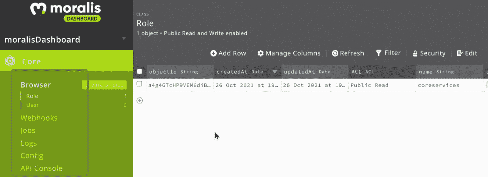

但是，一旦第一个用户登录(使用元掩码身份验证选项)，您的控制面板将填充所有受支持链的详细信息:

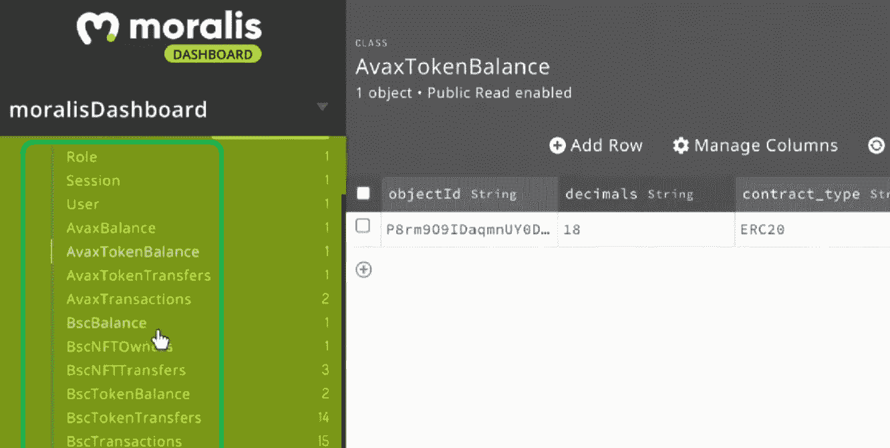

这样，我们就可以完全访问所有四家连锁店的实时在线数据。这意味着，在我们的 Moralis 仪表板中，我们现在有了关于代币余额、NFT 余额以及 Avalanche、BSC、Ethereum 和 Polygon 交易的详细信息。

为了利用这些数据，我们使用“logic.js”文件。在代码中，我们有多个查询。例如，我们在“displayTokens”和“displayNFTS”函数中使用它。以下是“显示令牌”功能的一部分:

```js
async function displayTokens(chn, chnSymbol, nativeAdd, nativeDecimals,dbRef, dbRefNative, htmlRef){
    const query = new Moralis.Query(dbRef)
    query.equalTo("address", Moralis.User.current().get("ethAddress"))
    query.notEqualTo("balance", "0");
    const results = await query.find();

    const queryNative = new Moralis.Query(dbRefNative)
    queryNative.equalTo("address", Moralis.User.current().get("ethAddress"))
    const resultsNative = await queryNative.first();
    let nativePrice = {};
    let prices = [];

    if(chn != "avalanche"){
    nativePrice = await Moralis.Web3API.token.getTokenPrice({chain:chn, address: nativeAdd})
    prices = await Promise.all(results.map(async (e) =>
        await Moralis.Web3API.token.getTokenPrice({chain:chn, address: e.get("token_address")})
    ));}else{
    nativePrice = {usdPrice: 1};//set avax price
    prices = [{usdPrice: 1}]; //set avalanche chain token prices
    }
```

此外，下面是“displayNFTS”函数的代码:

```js
async function displayNFTS(chn, dbRef){
    const query = new Moralis.Query(dbRef)
    query.equalTo("owner_of", Moralis.User.current().get("ethAddress"))
    const results = await query.find();

    let images = await Promise.all(results.map(async (e) => 
        await Moralis.Web3API.token.getTokenIdMetadata({ address: e.get("token_address"), token_id: e.get("token_id"), chain: chn })
    ));

    if(chn == "bsc")
        images.forEach((e,i) =>{
            document.getElementById(i+chn).src = JSON.parse(e.metadata).nft.image;
    });else{
        images.forEach((e,i) =>{
            document.getElementById(i+chn).src = JSON.parse(e.metadata).image;
        });
    }  
}
```

查看上面的代码行，你还可以看到 Moralis 的[以太坊 API](https://moralis.io/ethereum-api-develop-ethereum-dapps-with-moralis/) 和 [NFT API](https://moralis.io/ultimate-nft-api-exploring-moralis-nft-api/) 在运行。这使得获得令牌和 NFT 余额变得极其简单。 ***Moralis 家。web 3 API . token . gettokenprice***和“ ***Moralis。web 3 API . token . gettokenidmetadata***"代码片段。此外，这个 [ultimate Web3 API](https://docs.moralis.io/moralis-server/web3-sdk/intro) 最大的优点是它对所有支持的链都是通用的。

### 步骤 5:构建一个跨链 DeFi 仪表板——UI

既然您已经知道如何创建 DeFi 仪表板，我们鼓励您通过添加更多的高级功能将我们的示例项目提升到一个新的水平。例如，您可以为用户提供发送令牌的选项。在下面的视频中，从 6:21 开始，Moralis 的一位专家向您展示了以太坊和 Avalanche 的“传输功能”是如何工作的。使用他的指导方针，围绕 Moralis 提供的跨链功能构建 UI。

此外，当谈到以最佳方式处理转账时，Moralis 数据库会全力支持您。如下图所示，在执行事务时，它会自动创建一个名为“EthBalancePending”的新类别。这样，您就有办法处理最新的区块链被正确丢弃的情况。当然，这个特性也适用于所有其他受支持的链。

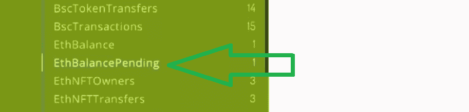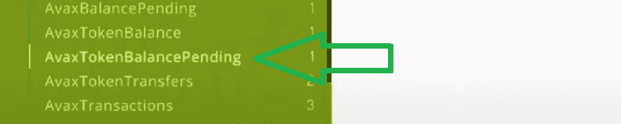

*如前所述，这里是视频:*

https://www.youtube.com/watch?v=xx_7wddfiJA

## 如何通过 5 个步骤创建 DeFi 仪表板–总结

如果您想学习如何创建 DeFi 仪表板，这篇文章是最好的起点。使用上面提供的详细信息，您现在知道如何通过以下五个步骤构建交叉链 DeFi 仪表板:

1.  创建一个 Moralis 服务器。
2.  构建一个 dApp 并将其连接到您的 Moralis 服务器。
3.  **添加 Moralis 认证。**
4.  **查询 Moralis dashboard 以访问所有在链数据。**
5.  使用您的 JavaScript 技能为附加功能添加最佳用户界面。

使用 [Moralis 的 SDK](https://moralis.io/exploring-moralis-sdk-the-ultimate-web3-sdk/) 来构建一个跨链 DeFi 仪表板只是你可以创建的众多优秀 Web3 应用程序中的一个。以跨链互操作性为核心，Moralis 使您能够在大多数主要区块链上部署 dApps。此外，如果[以太坊开发](https://moralis.io/ethereum-development-for-beginners/)是您的首要任务，您应该看看我们的[以太坊 dApp 样板](https://moralis.io/ethereum-dapp-boilerplate-full-ethereum-react-boilerplate-tutorial/)文章，它简化了构建基于以太坊的 dApp 的过程。此外，如果你决定[创建移动以太坊 dApps](https://moralis.io/create-mobile-ethereum-dapp-with-react-native-template/) ，Moralis 也会支持你。

此外，请记住 [Moralis 的 YouTube 频道](https://www.youtube.com/c/MoralisWeb3)和 [Moralis 的博客](https://moralis.io/blog/)提供了大量有价值的内容，涵盖了不同区块链的无数示例项目，涵盖了从[以太坊 dApp 样板](https://moralis.io/ethereum-dapp-boilerplate-full-ethereum-react-boilerplate-tutorial/)到 [BEP20](https://moralis.io/what-is-bep20-full-binance-smart-chain-token-guide/) 深度挖掘的所有内容。例如，由于 NFT 目前非常流行，你可能想要[生成 NFT](https://moralis.io/how-to-generate-nfts-full-guide/)，[创建一个 NFT 市场](https://moralis.io/how-to-create-an-nft-marketplace/)，或者学习[批量制造 NFT](https://moralis.io/how-to-bulk-mint-nfts-batch-minting-guide/)。因此，无论你决定解决这个世界链技术的哪个方面，Moralis 都将帮助你更快地到达终点，并有多余的资源。

